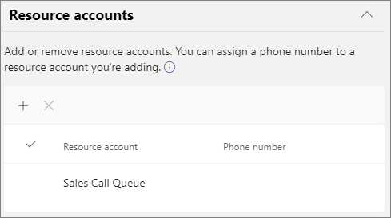

# 创建呼叫队列 - 小型企业教程Create a call queue - small business tutorial

呼叫队列提供了将呼叫者路由到组织中可以解决特定问题或问题的人的方法。Call queues provide a method of routing callers to people in your organization who can help with with a particular issue or question. 呼叫一次一个地分配给队列中 (称为代理 *) 。*Calls are distributed one at a time to the people in the queue (who are known as *agents*). 

呼叫队列提供：Call queues provide:

- 问候消息。A greeting message.

- 音乐等待队列中等待时，Music while people are waiting on hold in a queue.

- 调用路由 - 在 *"先* 到先出" (FIFO) 顺序 - 到代理。Call routing - in *First In, First Out* (FIFO) order - to agents.

- 处理队列溢出和超时的选项。Handling options for queue overflow and timeout.

#### 开始之前Before you begin

获取一 [些手机系统 - 虚拟](../teams-add-on-licensing/virtual-user.md) 用户许可证（如果还没有）。Get some [Phone System - Virtual User licenses](../teams-add-on-licensing/virtual-user.md) if you don't already have them. 为计划设置的每个呼叫队列和自动助理获取一个。Get one for each call queue and auto attendant that you plan to set up. 这些许可证是免费的，因此我们建议获取一些额外的许可证，以防你决定在将来对设置进行更改。These licenses are free, so we suggest getting a few extra in case you decide to make changes to your setup in the future.

由于呼叫队列中的代理可能会拨出以返回客户呼叫，因此请考虑将呼叫代理的呼叫者 ID 设置为主电话号码或相应的自动助理号码。Since agents in a call queue may dial out to return a customer call, consider setting the caller ID for your call agents to your main phone number or the number of an appropriate auto attendant. 有关详细信息 [，请参阅在 Microsoft Teams 中](../caller-id-policies.md) 管理来电显示策略。See [Manage caller ID policies in Microsoft Teams](../caller-id-policies.md) for more information.

#### 按照以下步骤设置呼叫队列Follow these steps to set up your call queue

# [步骤 1   创建团队Step 1 Create a team](#tab/create-team)

创建呼叫队列时，可以将单个用户添加到队列，或者可以使用现有的安全组、Microsoft 365 组或 Microsoft Teams 团队。When creating a call queue, you can add individual users to the queue, or you can use an existing security group, Microsoft 365 group, or Microsoft Teams team. 建议使用 [团队频道](https://support.microsoft.com/office/9f07dabe-91c6-4a9b-a545-8ffdddd2504e)。We recommend [using a team channel](https://support.microsoft.com/office/9f07dabe-91c6-4a9b-a545-8ffdddd2504e). 这样，队列成员可以相互聊天、分享想法以及创建文档或其他资源，以帮助他们帮助客户。This allows members of the queue to chat with each other, share ideas, and create documents or other resources to help them help your customers. 团队还提供语音邮箱，让呼叫者在数小时后或队列达到最大容量时留下消息。A team also provides a voice mailbox for callers to leave a message after hours or if the queue reaches its maximum capacity.

创建团队To create a team

1. 首先，**单击应用** 左侧的"团队"，然后单击团队列表底部的"加入或创建团队"。First, click **Teams** on the left side of the app, then click **Join or create a team** at the bottom of your teams list.

2. 然后单击" **创建团队 (** 卡片，左上角显示) 。Then click **Create team** (first card, top left corner).

3. 选择 **"从头开始构建团队"。**Choose **Build a team from scratch**.

4. 接下来，选择是需要公共团队还是专用团队。Next, choose whether you want a public or private team. 建议 **为** 呼叫队列使用"专用"，以避免用户通过加入团队无意中成为队列的一部分。We recommend **Private** for your call queue to avoid people unintentionally becoming part of the queue by joining the team.

5. 命名团队并添加可选说明。Name your team and add an optional description.

6. 完成后，单击"创建 **"。**When you're done, click **Create**.

8. 键入您希望在呼叫队列中拥有的人的姓名，然后单击"添加 **"。**Type the names of the people that you want to have in your call queue, and then click **Add**.

9. 单击“关闭”。Click **Close**. 添加到团队的人将收到一封电子邮件，让他们知道他们现在是团队的成员，并且团队会显示在团队列表中。People you add to a team will receive an email letting them know they are now a member of your team and the team will show up in their teams list.

接下来，我们将添加用于呼叫队列的通道。Next, we'll add a channel to use with the call queue.

添加频道To add a channel

1. 在 Teams 中，找到刚创建的团队，单击"更多选项" (...) ，然后单击"添加 **频道"。**In Teams, find the team you just created, click **More options** (...), and then click **Add channel**.

2. 键入频道的名称和说明，然后单击"添加 **"。**Type a name and description for the channel, and then click **Add**.

> [!div class="nextstepaction"]
> [步骤 2 - 资源帐户>Step 2 - Resource accounts >](/microsoftteams/business-voice/create-a-phone-system-call-queue-smb?tabs=resource-account#steps)

# [步骤 2   资源帐户Step 2 Resource accounts](#tab/resource-account)

创建的每个呼叫队列都需要一个资源帐户。Each call queue that you create requires a resource account. 这类似于用户帐户，但该帐户与自动助理或呼叫队列（而不是人员）相关联。This is similar to a user account, except the account is associated with an auto attendant or call queue instead of a person. 在此步骤中，我们将创建帐户，为其分配 *Microsoft 365 电话系统 - 虚拟用户* 许可证，然后使用它开始创建呼叫队列。In this step, we'll create the account, assign it a *Microsoft 365 Phone System - Virtual User* license, and then use it to start creating the call queue.

### 创建资源帐户Create a resource account

可以在 Teams 管理中心创建资源帐户。You can create a resource account in the Teams admin center.

1. 在 Teams 管理中心中，展开 **"组织范围的设置"，** 然后单击"**资源帐户"。**In the Teams admin center, expand **Org-wide settings**, and then click **Resource accounts**.

2. 单击“**添加**”。Click **Add**.

3. 在"**添加资源帐户"** 窗格中，填写"**显示名称**、**用户名"，** 然后选择"呼叫队列 **"作为"** 资源帐户 **类型"。**In the **Add resource account** pane, fill out **Display name**, **Username**, and choose **Call queue** for the **Resource account type**. 代理收到来自显示名称来电时，会看到消息。Agents will see the display name when they receive an incoming call from the queue.

    

4. 单击“**保存**”。Click **Save**.

新帐户将显示在帐户列表中。The new account will appear in the list of accounts.

### 分配许可证Assign a license

必须将 Microsoft *365 Phone System - 虚拟用户许可证* 分配给资源帐户。You must assign a *Microsoft 365 Phone System - Virtual User* license to the resource account.

1. 在 Microsoft 365 管理中心的" **活动** 用户"列表中，单击要为其分配许可证的资源帐户。In the Microsoft 365 admin center, in the **Active users** list, click the resource account to which you want to assign a license.

2. 在"**许可证和应用"选项卡上的**"许可证 **"下**，选择 **"Microsoft 365 手机系统 - 虚拟用户"。**On the **Licenses and Apps** tab, under **Licenses**, select **Microsoft 365 Phone System - Virtual User**.

3. 单击"**保存更改"。**Click **Save changes**.

    

### 创建呼叫队列Create a call queue

接下来，我们将开始创建新的呼叫队列并分配资源帐户。Next, we'll start creating a new call queue and assign the resource account.

1. 在 Teams 管理中心中，展开 **"语音"，** 单击"**呼叫队列**"，然后单击"添加 **"。**In the Teams admin center, expand **Voice**, click **Call queues**, and then click **Add**.

1. 键入呼叫队列的名称。Type a name for the call queue.

2. 单击 **"添加** 帐户"，搜索要用于此呼叫队列的资源帐户，单击"添加 **"，然后单击**"添加 **"。**Click **Add accounts**, search for the resource account that you want to use with this call queue, click **Add**, and then click **Add**.

3. 选择一种语言。Choose a language. 如果启用语音提示和语音听录，此语言 (系统生成的语音) 。This language will be used for system-generated voice prompts and voicemail transcription (if you enable them).

    

4. 指定是否要在呼叫者到达队列时播放问候语。Specify if you want to play a greeting to callers when they arrive in the queue. 必须上传包含要播放的问候语的 MP3、WAV 或 WMA 文件。You must upload an MP3, WAV, or WMA file containing the greeting that you want to play.

5. 当呼叫者在队列中保持时，Teams 会向呼叫者提供默认音乐。Teams provides default music to callers while they are on hold in a queue. 如果要播放特定音频文件，请选择"播放音频文件 **"并** 上传 MP3、WAV 或 WMA 文件。If you want to play a specific audio file, choose **Play an audio file** and upload an MP3, WAV, or WMA file.

> [!NOTE]
> 上传的录制内容不能大于 5 MB。The uploaded recording can be no larger than 5 MB.
> Teams 呼叫队列中提供的默认音乐不收取组织支付的任何版权费。The default music supplied in Teams call queues is free of any royalties payable by your organization. 

> [!div class="nextstepaction"]
> [步骤 3 - 呼叫>Step 3 - Call agents >](/microsoftteams/business-voice/create-a-phone-system-call-queue-smb?tabs=call-agents#steps)

# [步骤 3   呼叫代理Step 3 Call agents](#tab/call-agents)

若要将代理添加到呼叫队列，我们会将它们添加到我们之前创建的团队和频道。To add agents to the call queue, we'll add them to the team and channel that we created earlier.

1. 选择"**选择团队"选项，** 然后单击 **"添加频道"。**Select the **Choose a team** option and click **Add a channel**.
2. 键入创建的团队的名称，将其选中，然后单击"添加 **"。**Type the name of the team that you created, select it, and click **Add**.
3. 选择为队列创建的通道。Select the channel that you created for the queue.
3. 单击“**应用**”。Click **Apply**.

    

> [!NOTE]
> 将新用户添加到团队后，最多可能需要八个小时才能第一次呼叫到达。When new users are added to the team, it can take up to eight hours for their first call to arrive.

> [!div class="nextstepaction"]
> [步骤 4 - 资源帐户>Step 4 - Resource accounts >](/microsoftteams/business-voice/create-a-phone-system-call-queue-smb?tabs=call-routing#steps)

# [步骤 4   呼叫路由Step 4 Call routing](#tab/call-routing)

选择想要使用的呼叫路由方法。Choose the call routing method that you want to use.

1. 将 **"会议模式"设置为**"**自动"。**Set **Conference mode** to **Auto**.

2. 选择 **想要使用的** 路由方法。Choose the **Routing method** you want to use. 这会确定代理从队列接收调用的顺序。This determines the order in which agents receive calls from the queue. 我们建议使用 **串行路由或\*\*\*\*轮循机制**。We recommend **Serial routing** or  **Round robin**. 从以下选项中进行选择：Choose from these options:

    - **助理路由** 同时将队列中的所有代理环环。**Attendant routing** rings all agents in the queue at the same time. 第一个接电话的呼叫代理获取呼叫。The first call agent to pick up the call gets the call.

    - **串行路由** 将一个接一个地拨打所有呼叫代理。**Serial routing** rings all call agents one by one. 如果代理关闭或未接回呼叫，该调用将拨打下一个代理，并尝试所有代理，直到它被选取或退出。If an agent dismisses or does not pick up a call, the call will ring the next agent and will try all agents until it is picked up or times out.

    - **轮循** 机制平衡传入调用的路由，以便每个调用代理从队列中获取相同数量的调用。**Round robin** balances the routing of incoming calls so that each call agent gets the same number of calls from the queue. 在入站销售环境中可能需要这样做，以确保所有呼叫代理之间的机会相等。This may be desirable in an inbound sales environment to assure equal opportunity among all the call agents.

    - **最长空闲** 时间将每次调用路由到空闲时间最长的代理。**Longest idle** routes each call to the agent who has been idle the longest time.  (状态为"离开"超过 10 分钟的代理不包括。) (Agents whose presence state has been Away for more than 10 minutes are not included.)

    

3. 打开 **基于状态路由** 。Turn **Presence-based routing** on. 这会将调用路由到状态为"可用"的 **代理**。This routes calls to agents whose presence status is **Available**.

4. 选择是否允许代理选择退出呼叫。Choose if you want to allow agents to opt out of calls.

5. 设置 **代理警报** 时间，指定在队列将呼叫重定向到下一个代理之前，代理的电话响铃的时间。Set an **Agent alert time** to specify how long an agent's phone will ring before the queue redirects the call to the next agent.

    

> [!div class="nextstepaction"]
> [步骤 5 - 调用溢出>Step 5 - Call overflow >](/microsoftteams/business-voice/create-a-phone-system-call-queue-smb?tabs=call-overflow#steps)

# [步骤 5   调用溢出Step 5 Call overflow](#tab/call-overflow)

选择要如何处理队列中超过最大值的调用。Choose how you want to handle calls that exceed the maximum in the queue.

1. 在 **队列中设置最大调用数**。Set the **Maximum calls in the queue**.

2. 选择达到最大呼叫数时要执行哪些工作。Choose what you want to do when the maximum number of calls is reached. 你可以断开呼叫或重定向它。You can disconnect the call or redirect it. 建议将调用重定向到以下目标之一：We recommend that you redirect the call to one of the following destinations:
    - **组织中的人** - 组织中能够接收语音呼叫的人**Person in the organization** - a person in your organization who is able to receive voice calls
    - **语音应用** - 自动助理或其他呼叫队列。**Voice app** - an auto attendant or another call queue.  (选择此目标时选择与自动助理或呼叫队列关联的资源帐户) (Choose the resource account associated with the auto attendant or call queue when choosing this destination.)
    - **外部电话号码** - 任何电话号码。**External phone number** - any phone number. 使用此格式：+[国家/地区代码][区号][电话号码]Use this format: +[country code][area code][phone number]
    - **语音邮件** - 您可以使用创建的团队的语音邮箱。**Voicemail** - you can use the voice mailbox of the team that you created.

    

> [!div class="nextstepaction"]
> [步骤 6 - 调用超时>Step 6 - Call timeout >](/microsoftteams/business-voice/create-a-phone-system-call-queue-smb?tabs=call-timeout#steps)

# [步骤 6   调用超时Step 6 Call timeout](#tab/call-timeout)

选择当通话在队列中等待太长时间时要发生的情况。Choose what you want to happen when calls have been waiting in the queue for too long.

1. 设置"**最长等待时间"。**Set the **Maximum wait time**.

2. 选择通话打时要执行哪些工作。你可以断开呼叫或重定向它。Choose what you want to do when a call times out. You can disconnect the call or redirect it. 建议将调用重定向到以下目标之一：We recommend that you redirect the call to one of the following destinations:
    - **组织中的人** - 组织中能够接收语音呼叫的人**Person in the organization** - a person in your organization who is able to receive voice calls
    - **语音应用** - 自动助理或其他呼叫队列。**Voice app** - an auto attendant or another call queue.  (选择此目标时选择与自动助理或呼叫队列关联的资源帐户) (Choose the resource account associated with the auto attendant or call queue when choosing this destination.)
    - **外部电话号码** - 任何电话号码。**External phone number** - any phone number. 使用此格式：+[国家/地区代码][区号][电话号码]Use this format: +[country code][area code][phone number]
    - **语音邮件** - 您可以使用创建的团队的语音邮箱。**Voicemail** - you can use the voice mailbox of the team that you created.

    

3. 单击“**保存**”。Click **Save**.

这将完成呼叫队列的设置。This completes the setup of your call queue. 接下来，你可能希望 [设置自动助理](create-a-phone-system-auto-attendant-smb.md)。Next, you may want to [set up an auto attendant](create-a-phone-system-auto-attendant-smb.md).

---

