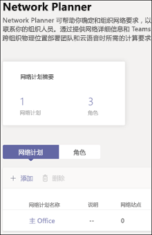
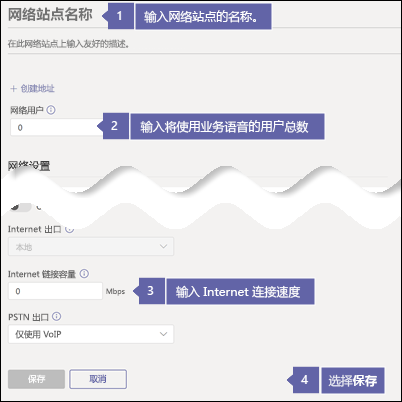
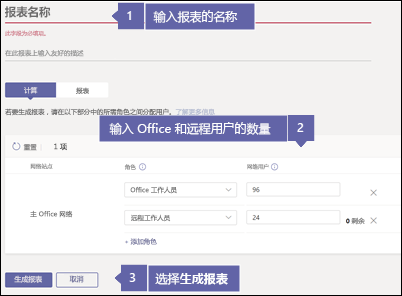
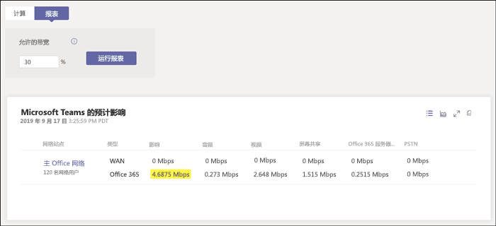

# 检查 Internet 连接。Check your Internet connection

企业语音随 Microsoft 365 一起位于云中。Business Voice is located in the cloud with Microsoft 365. 使用 Microsoft Teams 和企业语音的每台计算机和设备都需要连接到 Internet。Every computer and device that uses Microsoft Teams and Business Voice needs a connection to the Internet. 若要获得最佳的企业语音体验，你需要足够快的宽带 Internet 连接，确保能够支持所需的并发电话呼叫数量。To get the best experience with Business Voice, you need a broadband Internet connection that can support the expected number of phone calls that will be made at any one time. 此外，还需确保网络上的计算机可以访问 Microsoft 365 服务器。You also need to make sure that computers on your network can reach Microsoft 365 servers.

若要执行下面的步骤，必须有一个租户包含以下订阅之一：To follow these steps, you need to have a tenant with one of the following subscriptions:

* Office 365 商业协作版Office 365 Business Essentials
* Office 365 商业高级版Office 365 Business Premium
* Office 365 E1Office 365 E1
* Office 365 E3Office 365 E3
* Office 365 F1Office 365 F1
* Microsoft 365 A1Microsoft 365 A1
* Microsoft 365 A3Microsoft 365 A3
* Microsoft 365 E3Microsoft 365 E3
* Microsoft 365 商业版Microsoft 365 Business

无需企业语音许可证即可执行这些步骤。You don't need a Business Voice license to follow these steps.

## 检查 Internet 连接速度Check your Internet connection speed

本文将帮助你确定自己的 Internet 连接速度是否能满足大量人员打电话、主持视频会议等的需求。This article helps you determine whether your Internet connection is fast enough for the number of people who need to make phone calls, host video conferences, and so on. 你需要输入有关你的组织的一些信息，然后便会获得返回的一个报告，其中包含 Teams 和企业语音将使用的 Internet 连接带宽。You'll enter some information about your organization and get back a report with how much of your Internet connection will be used by Teams and Business Voice.

### 获取有关 Internet 连接和用户的信息Get information about your Internet connection and users

开始之前，你需要了解以下信息：Before you start, you need to know the following information:

* Internet 连接速度。The speed of your Internet connection.
* 有多少人主要在办公室使用企业语音。How many people will use Business Voice mainly from your office.
* 有多少人主要从远程位置（例如家庭办公室）使用企业语音。How many people will use Business Voice mainly from a remote location, such as a home office.

### 在网络规划器中输入你的信息Enter your information into the network planner

下面是需要完成的操作：Here's what you need to do:

1. 打开浏览器，转到 https://admin.teams.microsoft.com，然后使用拥有全局管理员权限的帐户登录。Open a browser and go to https://admin.teams.microsoft.com and sign in with an account that has Global Administrator permissions. 用于注册 Office 365 的帐户便拥有这些权限。The account you used to sign up for Office 365 has these permissions.
1. 打开“计划”\*\*\*\*，然后选择“网络规划器”\*\*\*\*。Open **Org-wide settings** and then select **Network planner**.
1. 在“**网络计划**”下，选择“**添加**”。Under **Network plans**, select **Add**. 为你的计划命名，然后选择“**应用**”。Give your plan a name, and then select **Apply**. 网络计划应如下所示：Your network plan should look like this:

    
1. 单击网络计划的名称（上图中的“**主要办公室**”）。Click on your network plan's name (**Main office** in the picture above).
1. 在下一页上，选择“**网络站点**”选项卡下的“**添加网络站点**”。On the next page, select **Add a network site** under the **Network sites** tab.
1. 仅填写以下屏幕截图中所示的字段，然后选择“保存”\*\*\*\*。Fill in only the fields indicated in the screenshot below and then select **Save**. 将此屏幕上的其他字段留空，不要选择“ExpressRoute”\*\*\*\* 或“已连接到 WAN”\*\*\*\* 选项。Leave the other fields on this screen blank, and don't select either the **ExpressRoute** or **Connected to WAN** options.

    
1. 在“**报告**”选项卡下，选择“**启动报告**”。Under the **Report** tab, select **Start a report**.
1. 填写以下信息，然后选择“生成报表”\*\*\*\*，创建一个显示 Teams 带宽要求的报表。Fill out the following information and then select **Generate report** to create a report showing the bandwidth requirements for Teams. 我们将在下一节中介绍如何阅读该报表。We'll show you how to read the report in the next section.

    

### 查找最低的 Internet 连接速度Find your minimum Internet connection speed

选择“**生成报告**”时，Office 365 将创建如下所示的报告：When you select **Generate report**, Office 365 creates a report that looks like this:

突出显示的数字显示了 Teams 和企业语音将使用的 Internet 连接带宽。The highlighted number shows how much of your Internet connection Teams and Business Voice will use. 建议该数字不超过 Internet 总连接速度的 30%。We recommend that this number be no more than 30% of your total Internet connection speed. 例如，如果 Internet 连接是 60Mbps，则 Teams 和企业语音的占用量不应超过 18Mbps。For example, if your Internet connection is 60Mbps, Teams and Business Voice should take up no more than 18Mbps.

通过执行以下计算可以查找最低的 Internet 连接速度：`<highlighted number> / .3`。You can find your minimum Internet connection speed by doing this calculation: `<highlighted number> / .3`. 使用上图中突出显示的数字，计算将是：`4.6875 / .3 = 15.6`。Using the highlighted number in the picture above, the calculation would be `4.6875 / .3 = 15.6`. 这意味着最低的 Internet 连接速度需要至少为 15.6Mbps。This means your minimum Internet connection speed needs to be at least 15.6Mbps.

如果 Teams 和企业语音的使用量将超过 Internet 总连接速度的 30%，则突出显示的数字将显示为红色。If Teams and Business Voice will use more than 30% of your total Internet connection speed, the highlighted number will show up as red. 如果发生这种情况，可能需要升级 Internet 连接。If this happens, you might need to upgrade your Internet connection.

## 确保网络上的计算机和设备可以访问 Microsoft 365Make sure computers and devices on your network can reach Microsoft 365

为确保正常工作，要用于商业语音的计算机和设备需要使用特定网络端口与 Microsoft 365 服务器进行通信。To work correctly, computers and devices you want to use with Business Voice need to communicate with Microsoft 365 servers using specific network ports. 网络端口本质上是一种“门”；计算机和设备可以通过这个门在网络或 Internet 上互相通信。Network ports are essentially doors through which computers and devices can talk to each other over a network or the Internet. 你的防火墙需要允许网络上的计算机和设备使用下列出站网络端口访问 Microsoft 365：Your firewall needs to allow computers and devices on your network to reach Microsoft 365 using the following outbound network ports:

* **TCP 端口** 80 和 443**TCP ports** 80 and 443
* **UDP 端口** 3478、3479、3480 和 3481**UDP ports** 3478, 3479, 3480, and 3481

检查防火墙是否允许在这些网络端口上进行通信的最简单方法是使用 Teams 进行测试呼叫。The easiest way to check whether your firewall allows communication on these network ports is to make a test call using Teams. 若要进行测试呼叫，请执行下列操作：To make a test call, do the following:

1. 在网络上的计算机上转到 https://aka.ms/getteams 以安装 Teams。Go to https://aka.ms/getteams on a computer on your network to install Teams. 请确保扬声器和麦克风已连接到此计算机。Make sure speakers and a microphone are connected to this computer.
2. 打开 Teams 并使用 Microsoft 365 帐户登录Open Teams and sign in using a Microsoft 365 account
3. 在 Teams 中，选择你的个人资料图片，然后选择“**设置**” > “**设备**”In Teams, select your profile picture, then **Settings** > **Devices**
4. 在“**音频设备**”下选择“**进行测试呼叫**”Choose **Make a test call** under **Audio devices**
5. 按照提示留言，然后回放给你自己Follow the prompts to leave a message and have it played back to you

* 如果呼叫已接通，并且你可以听到自己的留言，则表示你的防火墙已正确设置。If the call connects and you can hear your message played back to you, your firewall is set up correctly.
* 如果呼叫已接通，但无法听到提示或未能回放你的留言，请确保扬声器和麦克风已正确设置并由计算机检测到。If the call connects but you can't hear the prompts or your message played back to you, make sure your speakers and microphone are set up correctly and detected by the computer. 再试一次。Try again.
* 如果呼叫未接通，或已经接通，但你无法听到自己的留言，则可能需要更新防火墙，以便允许上面列出的网络端口。If the call doesn't connect or if it does but you can't hear your message played back to you, you might need to update your firewall to allow the network ports listed above. 请查看防火墙的文档，了解如何允许网络端口访问 Internet，或者联系 IT 专家来帮助你执行此操作。Check your firewall's documentation on how to allow network ports to reach the Internet, or contact an IT specialist to help you.

如果你是 IT 专业人员，想要详细了解如何准备大型或更复杂的网络来支持企业语音，请查看[评估环境](../3-envision-evaluate-my-environment.md)。If you're an IT professional and want more information about how to prepare larger or more complex networks to support Business Voice, take a look at [Evaluate my environment](../3-envision-evaluate-my-environment.md). [评估环境](../3-envision-evaluate-my-environment.md)文章中提供了有关带宽、代理和防火墙要求的其他信息，还介绍了如何使用[网络评估工具](../3-envision-evaluate-my-environment.md#test-the-network)来测试网络。The [Evaluate my environment](../3-envision-evaluate-my-environment.md) article gives additional information about bandwidth, proxy, and firewall requirements and also how to test your network using the [Network Assessment Tool](../3-envision-evaluate-my-environment.md#test-the-network).
