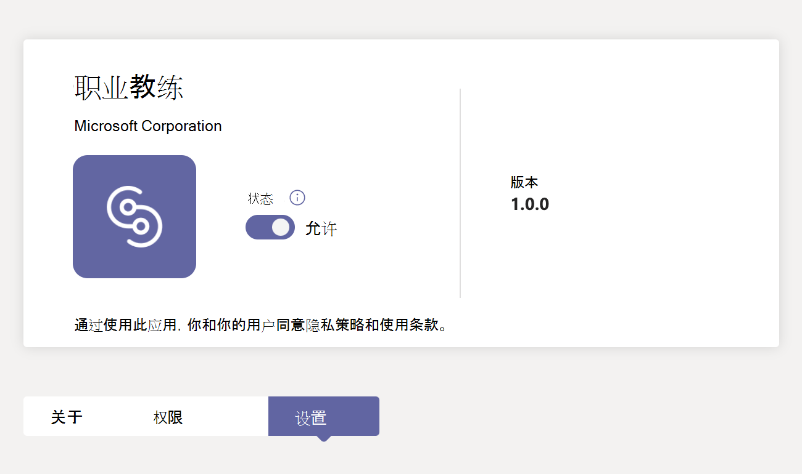
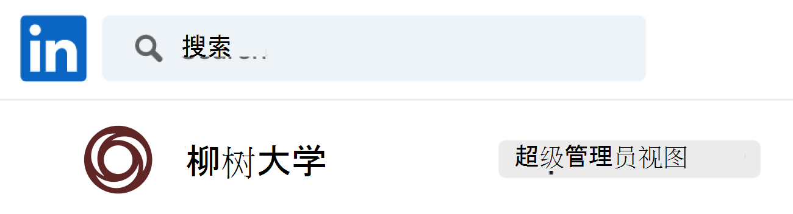
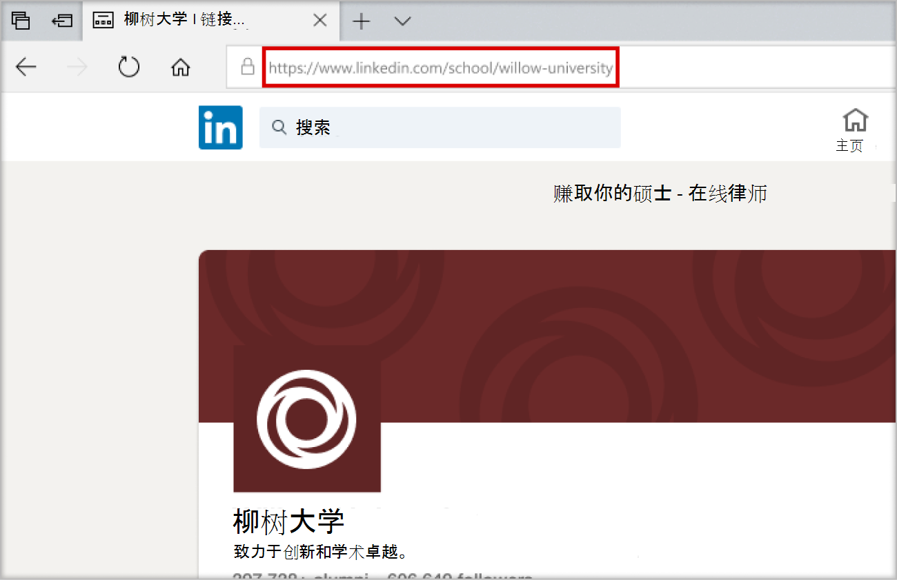
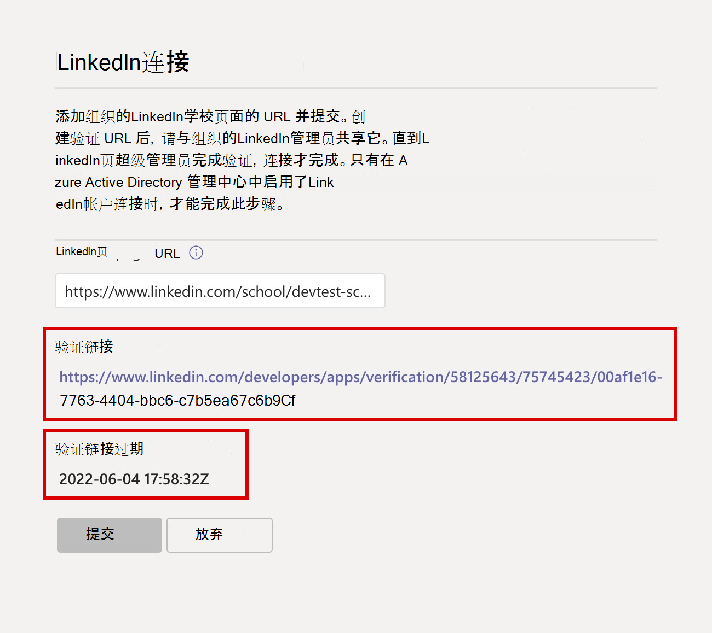
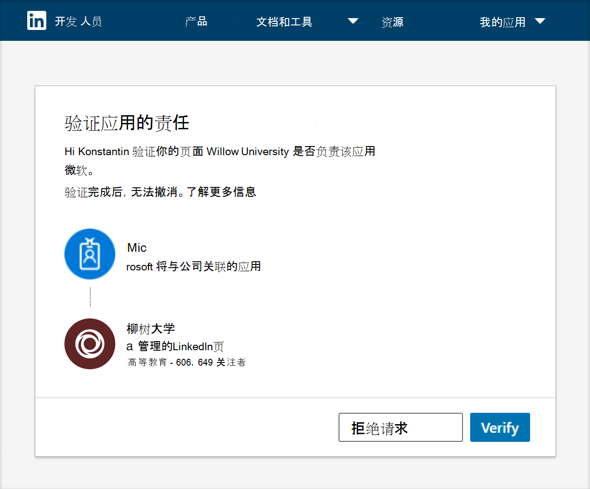
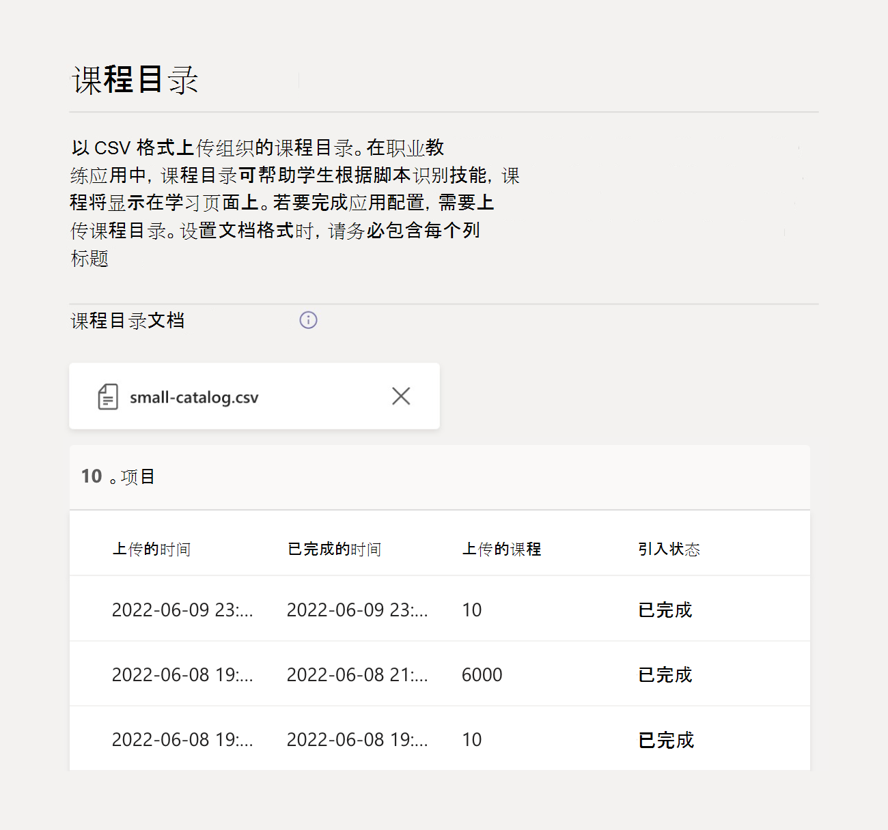

# 为 Microsoft Teams 设置和配置职业指导

本文供教育 IT 管理员了解如何为 Microsoft Teams 设置职业指导。

设置、配置和发布职业指导的主要步骤包括：

1. [步骤 1：为职业指导准备租户](#step-1-prepare-your-microsoft-365-tenant-for-career-coach)。
1. [步骤 2：购买职业指导许可证](#step-2-purchase-career-coach-licenses)。
1. [步骤 3：访问职业指导设置](#step-3-access-the-career-coach-app-settings)。
1. [步骤 4：配置职业指导设置](#step-4-configure-career-coach-settings)。
1. [步骤 5：向你的机构提供职业指导](#step-5-make-career-coach-available-to-your-institution)。

## 标识角色和权限

设置职业指导需要多种类型的管理员角色。 这些角色和权限可能分配给一个人，或者可能需要与教育机构中的 IT 专业人员协作。 使用以下清单确定完成所引用任务所需的个人。

可以通过访问[Microsoft 365 管理中心 >用户>活动用户>](https://go.microsoft.com/fwlink/p/?linkid=834822)选择用户名以确认角色，来检查帐户分配的角色。

详细了解[Microsoft 365 管理中心中的管理员角色](/microsoft-365/admin/add-users/about-admin-roles)。

### [Microsoft 365 管理中心任务](https://go.microsoft.com/fwlink/p/?linkid=2024339)

角色： [全局管理员](/azure/active-directory/roles/permissions-reference#global-administrator)

职业指导任务：

- [购买许可证](#step-2-purchase-career-coach-licenses)。
- [分配许可证](#assign-career-coach-licenses-to-users)。

### [Azure Active Directory 管理中心任务](https://go.microsoft.com/fwlink/p/?linkid=2067268)

角色： [全局管理员](/azure/active-directory/roles/permissions-reference#global-administrator)

职业指导任务：

- [打开LinkedIn帐户连接](#turn-on-linkedin-account-connections)。

### [Teams 管理中心任务](https://admin.teams.microsoft.com/dashboard)

角色： [Teams 管理员](/azure/active-directory/roles/permissions-reference#teams-administrator)

职业指导任务：

- [将职业指导添加为已安装的应用](#add-career-coach-as-an-installed-app)。
- [配置“职业指导”应用设置](#step-4-configure-career-coach-settings)。
- [设置策略](#identify-roles-and-permissions)。
- [固定应用](#identify-roles-and-permissions)。

### LinkedIn开发人员门户任务

角色：[LinkedIn学校页面超级管理员](https://www.linkedin.com/help/linkedin/answer/a541981)

职业指导任务：

- [验证LinkedIn学校页](#verify-the-linkedin-school-page)。

## 为职业教练做准备

在设置和配置职业指导之前，请遵循以下准备步骤。

1. [步骤 1：为职业指导准备租户](#step-1-prepare-your-microsoft-365-tenant-for-career-coach)。
1. [步骤 2：购买职业指导许可证](#step-2-purchase-career-coach-licenses)。

### 步骤 1：为职业指导准备Microsoft 365 租户

#### 打开LinkedIn帐户连接

职业指导LinkedIn帐户连接有两种方法：

- 允许学生和教职员工将其Microsoft 365 帐户连接到其LinkedIn帐户，并从[职业指导发送LinkedIn邀请](https://support.microsoft.com/topic/career-coach-quick-start-guide-for-students-c419db47-9290-4961-9684-c3f86a9b3708#bkmk_connect_your_linkedin_account)。
- 使用来自LinkedIn的公共校友数据启用 [“构建网络](https://support.microsoft.com/topic/career-coach-quick-start-guide-for-students-c419db47-9290-4961-9684-c3f86a9b3708#bkmk_build_your_network) 和 [探索职业”](https://support.microsoft.com/topic/career-coach-quick-start-guide-for-students-c419db47-9290-4961-9684-c3f86a9b3708#bkmk_discover_your_career_path) 功能。

若要打开LinkedIn帐户连接，请执行以下操作：

1. 使用 [Azure AD](https://go.microsoft.com/fwlink/p/?linkid=2067268) 组织的 [全局管理员帐户](#identify-roles-and-permissions) 登录到 Azure AD 管理中心。

2. 选择“ **用户**”。

3. 在 **“用户** ”页上，选择“ **用户设置**”。

4. **LinkedIn帐户连接** 必须设置为 **“是****”或“选择”组**，才能正确配置职业指导。

   - 选择“ **是** ”，为教育机构中的所有用户启用服务。
   - 选择“ **所选组** ”，仅对教育机构中的一组选定用户启用服务。

有关详细信息，请参阅 [Azure Active Directory 中的LinkedIn帐户连接](/azure/active-directory/enterprise-users/linkedin-integration)。

> [!NOTE]
> 未经用户同意，不会共享任何数据。

#### 允许在 Teams 中Microsoft应用

职业指导是Microsoft应用程序，因此必须在 Teams 应用权限策略中允许它。

1. 登录到 **[Teams 管理中心](https://go.microsoft.com/fwlink/p/?linkid=2066851)**。

2. 在左侧导航中，选择“ **Teams 应用** > **[权限策略](https://admin.teams.microsoft.com/policies/manage-apps)**”。

3. 选择首选策略。
    1. 如果不确定要使用哪个策略，请参阅 [Microsoft Teams 策略管理文档](policy-packages-edu.md) 或使用 [教育策略向导](easy-policy-setup-edu.md) 为 Microsoft Teams 配置策略。

详细了解 [如何配置权限策略](teams-app-permission-policies.md)。

#### 将职业指导添加为已安装的应用

此步骤可确保为机构正确配置职业指导，学生可以找到职业指导。

1. 登录到 [Teams 管理中心](https://go.microsoft.com/fwlink/p/?linkid=2066851)。

2. 选择 **“Teams 应用** > **设置策略**”，然后选择首选策略。
    1. 如果不确定要使用哪个策略，请参阅 [Microsoft Teams 策略管理文档](policy-packages-edu.md) 或使用 [教育策略向导](easy-policy-setup-edu.md) 为 Microsoft Teams 配置策略。

3. 在 **“已安装的应用**”下，选择“ **+ 添加应用**”。

4. 在 **“添加已安装的应用** ”窗格中，搜索要在用户启动 Teams 时自动安装的应用。 还可以按应用权限策略筛选应用。

5. 选择应用列表后，选择“ **添加**”。

6. 选择  **“保存** > **确认**”。

编辑或分配策略可能需要几个小时才能使更改生效。 在更改完成之前，Microsoft Teams 中不提供职业指导。

### 步骤 2：购买职业指导许可证

#### 许可证类型

职业指导需要许可证才能访问应用程序。

有两种许可证类型可用。

- **学生许可证** 专为学生设计。
- **教职员工许可证** 专为参与支持学生职业指导的教职员工和 IT 专业人员而设计。
  - 必须向完成配置的 IT 管理员分配职业教练 **教职员工许可证** 。

#### 购买许可证

职业指导 (除中国和俄罗斯以外，) 通过教育解决方案注册 (EES) 、云服务提供商 (CSP) 以及Microsoft 365 管理中心 (Web 直接) ，向符合条件的教育机构提供附加许可证。

作为Microsoft Teams 应用，租户必须具有 Microsoft 365 A3/A5 或 Office 365 A1/A3/A5 才能购买附加职业指导许可证。 为学生和教职员工用户提供单独的许可证。

#### 注册免费试用版

标准 90 天免费试用版适用于 25 名学生和 25 名教职员工许可证。 每个符合条件的租户提供一个试用版。 有资格购买职业指导许可证的租户可以从Microsoft 365 管理中心激活试用许可证。

对于试用激活，请登录到[Microsoft 365 管理中心 >计费>购买服务>搜索职业指导](https://go.microsoft.com/fwlink/p/?linkid=868433)以查找[学生许可证试用](https://signup.microsoft.com/signup?OfferId=b3a40ff2-3d0d-481e-a0ed-f4de1069f201)和[教职员工许可证试用](https://signup.microsoft.com/signup?OfferId=6f6e7db5-b9ab-4baa-86be-f13d0ae6a2c8)。

## 设置和配置职业指导设置

若要为机构设置和配置职业指导设置，请执行以下步骤。

1. [步骤 3：访问“职业指导”应用设置](#step-3-access-the-career-coach-app-settings)。
1. [步骤 4：配置职业指导设置](#step-4-configure-career-coach-settings)。

### 步骤 3：访问职业指导应用设置

若要配置职业指导设置并允许用户使用，你必须是全局管理员或 Teams 服务管理员才能访问页面。

1. 登录到 [Teams 管理中心](https://go.microsoft.com/fwlink/p/?linkid=2066851)。
2. 在左侧导航栏中，选择“ **Teams 应用** > **管理应用**”。
3. 搜索或浏览 **职业指导**。
4. 选择 **“职业指导**”，然后选择 **“设置**”。

### 步骤 4：配置职业指导设置

可以为学生、教职员工配置以下职业指导设置。

- [需要) ](#linkedin-connection-required) (LinkedIn连接
- [品牌和首选项](#brand-and-preferences-optional) (可选) 
- [课程目录](#course-catalog-optional) (可选) 
- [研究领域](#fields-of-study-optional) (可选) 
- [自定义选项](#customization-options-optional) (可选) 

#### LinkedIn连接 (必需) 

LinkedIn连接设置将职业指导与机构LinkedIn学校页面中的公共校友数据连接起来。

只有在 [Azure Active Directory 中启用了LinkedIn帐户连接](#turn-on-linkedin-account-connections)时，才能完成此步骤。 “LinkedIn连接”设置打开“ [构建网络](https://support.microsoft.com/topic/career-coach-quick-start-guide-for-students-c419db47-9290-4961-9684-c3f86a9b3708#bkmk_build_your_network) 和 [探索职业”](https://support.microsoft.com/topic/career-coach-quick-start-guide-for-students-c419db47-9290-4961-9684-c3f86a9b3708#bkmk_discover_your_career_path) 功能。

> [!IMPORTANT]
> 这是必填部分。 如果未验证LinkedIn学校页面连接，则无法打开职业指导。
>
> LinkedIn连接支持多个租户。

##### 添加LinkedIn学校页面 URL

添加LinkedIn学校页面 URL 的过程由 Teams 管理员处理。 验证 URL 的后续步骤是否由教育机构的 LinkedIn 学校页面超级管理员完成。

1. 登录到 **[Teams 管理中心](https://go.microsoft.com/fwlink/p/?linkid=2066851)**。

2. 选择 **“Teams 应用** > **”“管理应用** > **”“职业指导** > **设置”** > **LinkedIn连接**。

3. 选择“ **连接到LinkedIn**”。

4. 通过搜索LinkedIn并选择“学校”筛选器，找到你机构的LinkedIn **学校** 页面。 或者与你机构的营销人员联系，以确定要使用的正确LinkedIn学校页面。 有关详细信息，请参阅 [如何识别LinkedIn页](https://www.linkedin.com/help/linkedin/answer/40133/differences-between-a-linkedin-page-for-a-school-and-company?lang=en)。

    

5. 添加 **LinkedIn学校页 URL**。 URL 必须是 *学校页面*，而不是 *公司页面*，并且格式通常为 `https://www.linkedin.com/school/willow-university/`。

   

6. 选择“ **提交**”。

7. 成功提交 **LinkedIn学校页面 URL** 后，设置页将更新以显示  **“验证”链接** 和  **“验证”链接过期**。 验证链接将在 30 天后过期。

8. 复制 **“验证”链接** ，并将其与教育机构的“LinkedIn学校页面超级管理员”共享。

9. LinkedIn学校页面超级管理员将使用唯一的验证链接来 [验证LinkedIn学校页面](#verify-the-linkedin-school-page) ，并将其与职业指导相关联。

10. 若要确认验证和设置已成功提交，请检查 [“职业指导”配置状态](#configuration-status) 是否标记为 **“完成**”。

##### 验证LinkedIn学校页面

LinkedIn学校页面验证必须由教育机构 [的LinkedIn学校页面超级管理员](https://www.linkedin.com/help/linkedin/answer/a541981)完成。

可以通过登录到LinkedIn并访问教育机构的“LinkedIn学校页面”来检查LinkedIn帐户的管理员角色。 如果你的帐户分配有超级管理员角色，你将在“LinkedIn”页面上看到教育机构名称旁列出的 **超级管理员视图** 。 如果未看到 **“超级管理员视图** ”标记，则表示你不是学校页面的超级管理员。

1. Teams 管理员提交 **LinkedIn学校页 URL** 后，页面将显示 **“验证”链接** 和 **“验证”链接过期**。 验证链接将在 30 天后过期。

     

2. 复制验证链接，并将其与LinkedIn学校页面超级管理员共享。

3. LinkedIn页面超级管理员将打开验证链接，将职业指导与学校的页面相关联。 有关详细信息，请参阅 [有关LinkedIn页验证的其他文档](https://www.linkedin.com/help/linkedin/answer/102672)。

4. 验证完成后，Teams 管理员可以通过检查 [职业指导配置状态](#configuration-status) 是否标记为 **“完成**”来查看设置是否已成功提交。

   

#### 品牌和首选项 (可选) 

自定义职业指导以匹配教育机构的品牌。 你有责任尊重他人的权利，包括版权和商标权。

1. 登录到 **[Teams 管理中心](https://go.microsoft.com/fwlink/p/?linkid=2066851)**。

2. 选择 **“Teams 应用** > **”“管理应用** > **”“职业指导** > **设置** > **”“编辑品牌和首选项**”。

3. 在 **“品牌”** 下，添加 **“组织名称**”。

4. 上传 **组织图标**。 该图标在整个职业指导中使用，用于识别教育机构特有的内容、整个应用的课程目录资源以及仪表板的实际体验部分。

    图标的格式最好为：

    - 透明 PNG
    - 纵横比为 1：1
    - 最大大小为 64 像素 x 64 像素

5. 上传 **学习内容缩略图**。 如果未为教育机构提供的课程指定特定图像，缩略图将用于整个应用中的课程目录学习资源。

    缩略图的格式最好为：

    - A PNG
    - 纵横比为 16：9
    - 最大大小为 360 像素 x 200 像素

6. 这是一个可选步骤。 添加 **组织隐私策略 URL**。 如果添加，学校的隐私策略将可供学生在职业指导中查看。

7. 选择“ **提交**”。

8. 若要确认设置已成功提交，请选中 [“职业指导”配置状态](#configuration-status) 以 **完成**。

#### 课程目录 (可选) 

课程目录记录了教育机构提供的课程和课程。

职业指导使用课程目录数据从成绩单中识别学生的技能，并建议参加的课程。

这些课程在职业指导中用于两个方面：

- 课程作为 [学习资源的](https://support.microsoft.com/topic/career-coach-quick-start-guide-for-students-c419db47-9290-4961-9684-c3f86a9b3708#bkmk_grow_real_world_skills)一部分返回。  

- 课程和课程元数据（如课程标题和说明）用于帮助学生 [在上传成绩单](https://support.microsoft.com/topic/career-coach-quick-start-guide-for-students-c419db47-9290-4961-9684-c3f86a9b3708#bkmk_Set_up_your_profile)时识别其技能。

若要创建课程目录，请将在教育机构教授的所有课程列表放在一起，并使用 [课程目录文档格式和架构](#course-catalog-document-format-and-schema)将其上传为 CSV 文件。

从 [示例课程目录](https://aka.ms/career-coach/docs/it-admins/sample-catalog) 文档开始，确保格式正确。还可以参考 [课程目录文档格式和架构](#course-catalog-document-format-and-schema) 部分，了解有关必填字段和建议字段的详细信息。

##### 添加课程目录

1. 登录到 **[Teams 管理中心](https://go.microsoft.com/fwlink/p/?linkid=2066851)**。

2. 选择 **“Teams 应用** > **”“管理应用** ”>“搜索 **职业指导** > **设置** > **”课程目录**。

3. 选择“ **上传课程目录** ”>上传 CSV 格式的课程，其中包含所需列：courseId、title 和 sourceLink。
    1. 每行必须包含每个必需列的数据。
    1. *包括推荐字段可返回更好的搜索结果和技能识别，从而改善学生的体验。*

4. 将显示已上传课程目录的一部分的预览，供你参考。

5. 准备就绪时选择“ **提交** ”。

6. “设置”页中显示了 [已上传文档的状态](#course-catalog-status) 。

7. 若要确认已成功提交设置，请检查 [“职业指导”配置状态](#configuration-status) 是否标记为 **“完成**”。

若要上传新文件，请选择“ (**X**) ”关闭文档预览，确保清除最后一个文件。 此操作将允许再次显示 **“上传** ”按钮。

##### 课程目录文档格式和架构

文档需要采用 CSV 格式，最大大小为 18 MB。 大型文件应拆分为多个较小的文件，其中最多包含 15，000 行才能成功处理。

文档必须包含所需的课程元数据： **课程标题**、 **课程 ID** 和  **课程 URL**。

从 [示例课程目录]( https://aka.ms/career-coach/docs/it-admins/sample-catalog) 文档开始，确保格式正确。 *包括推荐字段可返回更好的搜索结果和技能识别，从而改善学生的体验。*

下表显示了课程目录中要包含的项目。

| 名称             | 地位      | 类型   | 说明                                                                    |
|------------------|-------------|--------|--------------------------------------------------------------------------------|
| courseId         | 必需    | 字符串 | courseId 映射到学生成绩单中生成的内容。             |
| 标题            | 必需    | 字符串 | 课程标题。                                                              |
| sourceLink       | 必需    | Url    | 指向课程页面的网站链接，了解有关课程和教学大纲的详细信息。   |
| 描述      | 推荐 | 字符串 | 介绍学习目标的课程简介文本。       |
| 语言         | 推荐 | 字符串 | 课程语言。 使用标准语言代码。                           |
| 格式           | 推荐 | 字符串 | 教学模式 (在线、视频、现场) 。                                   |
| thumbnailLink    | 推荐 | Url    | 课程图像的缩略图链接。                                            |
| thumbnailAltText | 推荐 | 字符串 | 图像的辅助功能替换文字                                           |
| educationLevel   | 推荐 | 字符串 | 学习级别，例如 本科生/研究生。                                       |
| 主题           | 推荐 | 字符串 | 与课程教授的技能关联的主题或标记。          |

##### 课程目录状态

上传文档后，课程目录状态会显示在课程目录设置页上，并提供文档上传和处理状态的详细信息。

在处理过程中，职业指导将通过从标题和说明中提取技能来分析你的文档是否重复、规范化和扩充目录，并将其存储在 Learn 页面上和学生脚本上传期间用于技能识别。

| 列           | 值     | 说明                                                                                        |
| ---------------- | --------- | -------------------------------------------------------------------------------------------------- |
| 上传时间    | 时间 戳 | IT 管理员上传文档的日期和时间。                                                     |
| 完成时间   | 时间 戳 | 完全处理文档的日期和时间。                                               |
| 已上传的课程 | 整型   | 在文档中找到的课程数。                                                           |
| 引入状态 | Pending   | 要处理的队列中的文档。                                                                  |
| 引入状态 | 运行   | 当前正在处理文档。 此过程最多可能需要 6 小时，具体取决于文档的大小。 |
| 引入状态 | 成功   | 引入过程已完成，一旦配置了所有必需的设置，课程将在职业指导中提供。 |
| 引入状态 | 失败    | 检查文档格式并重新加载。                                                           |
| 重复       | 整型   | 在文档中找到的重复课程数。                                                 |

如果课程目录状态中的列为空，则表示当前正在处理文档，并且这些值不可用。 此过程最多可能需要 6 小时，具体取决于目录的大小。 处理文档后，将填充值。 可以刷新页面以检查更新。

#### 研究领域 (可选) 

研究领域与主要兴趣领域、学术专业和学位课程同义。 当学生开始使用职业指导并开始设置其个性化个人资料时，将参考这些研究领域。

字段列表允许学生发现他们可能感兴趣的研究领域，并将他们计划的学术重点添加到他们在职业指导中的个人资料中。

> [!IMPORTANT]
> 如果要为职业指导配置学习领域，请添加学生可用的所有学习领域，例如工程、英语、商业等。

##### 添加研究领域

1. 登录到 **[Teams 管理中心](https://go.microsoft.com/fwlink/p/?linkid=2066851)**。

2. 选择 **“Teams 应用** > **”“管理应用** ”>搜索 **“职业指导** > **”“设置** >  **”“研究领域**”。

3. 选择“ **上传** ”以 CSV 格式上传学习文件的字段。 将显示学习文档的字段预览。

4. 选择“ **提交**”。

5. 若要确认设置已成功提交，请检查 [“职业指导”配置状态](#configuration-status) 是否标记为 **“完成**”。

##### 研究领域文档格式和架构

文档需要采用 CSV 格式，最大大小为 18 MB。 文档必须包含所需的元数据： **学习领域名称**。

下表显示了在研究领域中要包括的项目：

| 名称          | 地位   | 类型   | 说明                    |
|---------------|----------|--------|--------------------------------|
| fieldsOfStudy | 必需 | 字符串 | 研究领域的名称 |

#### 可选)  (自定义选项

自定义设置支持向教育机构提供给学生的仪表板添加获取真实体验的机会。

建议的链接包括 应帮助学生获得实际经验，如工作板、活动、职业服务办公室、与职业相关的活动和学生俱乐部。

1. 登录到 **[Teams 管理中心](https://go.microsoft.com/fwlink/p/?linkid=2066851)**。

2. 选择 **“Teams 应用** > **”“管理应用** >搜索 **职业指导** > **设置**”。

3. 选择 **“自定义体验** > **+ 添加”**

4. >选择 **“应用**”添加每个 **标题**、**URL** 和 **信息提示说明**。

5. 将显示已添加信息的预览。

6. 选择“ **提交**”。

### 职业指导设置状态

Teams 管理中心的“职业指导”设置页提供配置职业指导的不完整、挂起、完成和失败步骤的状态摘要。

状态消息可帮助你确定职业指导是否已正确配置并准备好发布到租户。

#### 配置状态

应用设置页的配置状态部分将使用以下图例显示实时状态。

| 类别                    | 地位                                        | 说明                                                 |
| --------------------------- | --------------------------------------------- | ----------------------------------------------------------- |
| 服务预配状态 | 职业指导正在初始化租户。     | 访问“职业指导设置”页时，会自动进行服务预配。 在完成初始设置之前，不会接受配置更改。 服务预配的估计时间最多为 15 分钟。 |
| 服务预配状态 | 职业指导已准备好进行配置。       | 职业指导设置页面已准备就绪，可供 IT 管理员提交设置。 |
| 品牌和首选项       | 未启动                                   | 未提交设置。 这是一个可选步骤，不会阻止完成配置。 |
| 品牌和首选项       | 缺少：“学习”图标                        | 上传学习内容缩略图。 |
| 品牌和首选项       | 缺失：徽标                                 | 上传机构图标。 |
| 品牌和首选项       | 缺失：机构名称                     | 上传机构名称。 |
| 品牌和首选项       | 完成                                      | 设置已完成。 |
| 课程目录上传       | 未启动                                   | 未提交课程目录。 这是一个可选步骤，不会阻止完成配置。 |
| 课程目录上传       | 缺失：成功上传课程目录   | 有关课程目录处理的详细信息，请查看课程目录状态。 |
| 课程目录上传       | 完成                                      | 设置已完成。 |
| LinkedIn学校连接  | 未启动                                   | 未提交LinkedIn学校页面 URL。 |
| LinkedIn学校连接  | 缺失：已批准的LinkedIn学校页面 URL | 正在等待LinkedIn学校页面超级管理员验证批准。 |
| LinkedIn学校连接  | 完成                                      | 无需执行进一步操作。 设置已完成。 |
| 研究领域上传      | 未启动                                   | 未提交研究领域 CSV。 这是一个可选步骤，不会阻止完成配置。 |
| 研究领域上传      | 缺少：感兴趣的领域                    | 检查研究领域上传是否成功。 |
| 研究领域上传      | 完成                                      | 设置已完成。 |

将所有必需的步骤标记为完成后，职业指导可以成功发布到租户。

## 步骤 5：向机构提供职业指导

此时，已为你的机构配置了职业指导。

接下来，请按照以下步骤操作，确保 Microsoft Teams 中的机构可以使用职业指导。

### 向用户分配职业指导许可证

有关分步说明，请参阅 [向用户分配许可证](/microsoft-365/admin/manage/assign-licenses-to-users)。

### 设置策略并固定应用

固定职业指导会将其添加到“Microsoft Teams”窗口的左栏，使其更易于访问和显示学生。 如果想要固定部分用户的职业指导，则需要实施包含该组的设置 [策略](teams-app-setup-policies.md) 。

1. 登录到 **[Teams 管理中心](https://go.microsoft.com/fwlink/p/?linkid=2066851)**。

2. 选择 **“Teams 应用** > **设置策略** ”，然后选择首选策略。

    如果不确定要使用哪个策略，请参阅[Microsoft Teams 策略管理文档](policy-packages-edu.md)，或使用[教育策略向导](easy-policy-setup-edu.md)为 Microsoft Teams 配置策略。

3. 在“ **固定的应用”** 下，选择“ **添加应用**”。

4. **在“基于此应用权限策略的搜索**”下选择首选策略。

5. **在“按名称搜索**”下搜索 **“”职业指导**“，然后选择” **添加** > **“** 以关闭窗格。

6. 选择应用显示的顺序，然后选择“ **确认**”。

Microsoft Teams 中，学生将收到职业指导已固定的通知。
