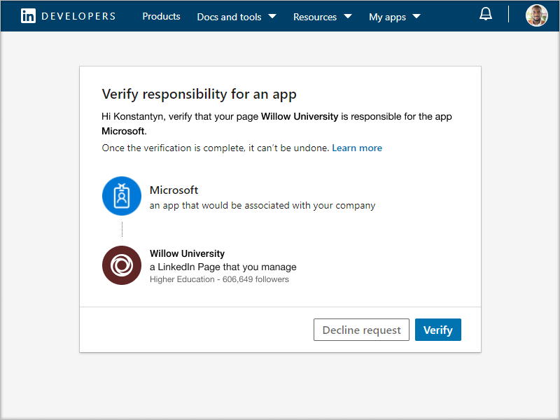

# 购买、配置和启用职业指导Microsoft Teams

职业指导是一Microsoft Teams 教育版由 LinkedIn 支持的应用，它为教育学生提供个性化指导，帮助其导航其职业之旅。 职业指导为教育机构提供统一的职业发展解决方案，使学生能够发现其职业路径、培养实际技能，并全部在一个地方构建其网络。

## 支持的语言

职业指导以下语言本地化：

- 中文 (简体中文，中国大陆) 
- 繁 (繁体中文，台湾) 
- 英语 (US)
- 英语 (UK)
- 加拿大 (法语) 
- 法语 (法国) 
- 德国 (德国) 
- 日语 (日本) 
- 巴西 (葡萄牙语) 
- 西班牙语 (西班牙) 
- 西班牙语 (墨西哥) 

详细了解[职业指导。](https://aka.ms/career-coach)

> [!NOTE]
> 使用本指南中的最佳实践和有用提示，为学生职业指导和教职员工启用应用功能。 请参阅 [快速规划指南](https://support.microsoft.com/office/c5d0b934-bfcf-4fe7-8a85-ba7bbb1b6ad4) 一文。

## 查看要求

若要职业指导机构启用应用，请查看启动和运行应用所需的内容。

**技术要求**

- Office 365租户Azure Active Directory

- Microsoft Teams

- Azure Active Directory

**许可证**

- 教职员工

- 学生

> [!NOTE]
> 必须将职业指导许可证分配给完成配置的 IT 管理员。

**来自教育机构的数据和文件**

- 课程目录数据

- 提供的研究领域

- 教育机构的 LinkedIn 页面

- LinkedIn Learning学校订阅 (首选) 

## 购买职业指导许可证

职业指导 通过教育版解决方案注册 (EES) 、云服务提供商 (CSP) ) 和 Microsoft 365 管理中心 (Web direct) 在全球 (（中国和俄罗斯除外）提供，适用于符合条件的教育机构作为附加许可证。 作为Microsoft Teams应用，客户必须具有 Microsoft 365 A3/A5 或 Office 365 A1/A3/A5 才能购买附加职业指导许可证。

### 向用户分配应用许可证

有关分步说明，请参阅[向用户分配许可证](/microsoft-365/admin/manage/assign-licenses-to-users)。

### 打开 LinkedIn 帐户连接

职业指导 **要求** 教育机构的用户能够将其 Microsoft 365 帐户连接到其 LinkedIn 帐户，该帐户在 职业指导

1. 使用 Azure AD组织的全局管理员帐户登录到 Azure AD 管理中心。

2. 选择"**用户"。**

3. 在"**用户"** 页上，选择"**用户设置"。**

4. 在 **"LinkedIn 帐户连接**"下，允许用户连接其帐户以在某些 Microsoft 应用中访问其 LinkedIn 连接。 在用户同意连接其帐户之前，不会共享任何数据。

   - 选择 **"** 是"，为教育机构中的所有用户启用该服务

   - 选择 **"所选** 组"，仅为教育机构中的一组选定用户启用该服务

   - 选择 **"** 否"以撤消你的教育机构中所有用户的同意

了解如何将[LinkedIn 帐户连接集成到 Azure Active Directory](/azure/active-directory/enterprise-users/linkedin-integration)

## 在 职业指导 管理Teams配置配置

使用 Microsoft Teams 管理中心中的管理员设置，职业指导为教育机构配置管理员，并允许用户启用它。

**要考虑的问题**

- 以下部分需要先完成，然后才能职业指导 - 品牌和首选项、LinkedIn
- 课程目录和研究领域的VS 具有所需的格式，最大大小为 18 MB

- 如果在应用职业指导"当前正在设置职业指导"，则所需部分尚未完成。

- 在包含必填字段的设置页面上，如果字段未完成，页面将不会提交
  - 用户不会看到警告消息，页面不会提交

## 访问 职业指导 应用设置

使用["管理应用](/microsoftteams/manage-apps)"页Teams教育机构的应用目录中的"应用"应用。

1. 登录到管理 **Teams中心**。

2. 在左侧导航栏中，选择  >  **Teams"管理应用"。**  

    > [!NOTE]
    > 只有全局管理员或Teams才能访问页面。

3. 搜索或浏览 **职业指导。**  

4. 选择 **职业指导**"，然后选择 **"设置"。**  

    

### 配置职业指导应用设置

职业指导有五个配置类别：

- [品牌和首选项](#brand-and-preferences)

- [LinkedIn 连接](#linkedin-connection)

- [课程目录](#course-catalog)

- [研究领域](#fields-of-study)

- [自定义](#customization)

> [!NOTE]
> 品牌和首选项、LinkedIn 配置、课程目录和研究领域是必需的，才能有效地为学生和教职员工启用该应用。

#### 品牌和首选项

在品牌和首选项设置页面上设置教育机构的名称、徽标和默认语言。

> [!NOTE]
> 这是必填部分 - 职业指导提交品牌和首选项的情况下无法启用。

##### 教育机构图标

在整个应用中使用教育机构图标职业指导标识您的教育机构独有的内容、整个应用中的课程目录资源，以及仪表板的实际体验部分。 图标的格式最好为：

- 透明 PNG
- 纵横比为 1：1
- 最大大小为 64 px x 64 px。

##### 教育机构缩略图

当特定图像不可用于课程时，教育机构图标将在整个应用中用于课程目录资源。 图标的格式最好为：

- A PNG
- 纵横比为 16：9
- 最大大小为 360 px x 200 像素。

#### LinkedIn 连接

LinkedIn 配置将 职业指导与来自 LinkedIn 的公共毕业生数据连接。

> [!NOTE]
> 这是必填职业指导 - 在未验证 LinkedIn 页面连接的情况下无法启用。

##### 添加并确认 LinkedIn 页面

确定教育机构的 LinkedIn 页面。 通过搜索 LinkedIn 或联系职业服务职员来确定使用的正确页面，查找 LinkedIn 页面。  
  
1. 登录到管理 **Teams中心**。

1. 选择 **Teams"**  >  **管理应用职业指导**  >    >  **LinkedIn 连接"。**

2. 通过搜索 LinkedIn 并选择"学校筛选器"来查找 LinkedIn 页面。 或者与职业服务员工联系，以确定要使用正确的 LinkedIn 学校页面。 [如何识别 LinkedIn 页面](https://www.linkedin.com/help/linkedin/answer/40133/differences-between-a-linkedin-page-for-a-school-and-company?lang=en)

    

3. 添加 LinkedIn 学校页面 URL。 URL 必须是学校页面，而不是公司页面，并且通常格式为 `https://www.linkedin.com/school/willow-university/` 。

   

4. 选择"**提交"。**

5. 如果成功提交，页面将更新以显示"验证"**链接和**"**验证链接过期"。** 验证链接在 30 天后过期。

     

6. 复制验证链接，并与教育机构的 LinkedIn 页面超级管理员共享。在 LinkedIn 页面管理员文档中详细了解 [LinkedIn 页面超级管理员角色](https://www.linkedin.com/help/linkedin/answer/102672)。

7. LinkedIn 页面超级管理员将使用唯一验证链接将职业指导学校页面关联。 [有关 LinkedIn 页面验证的其他文档](https://www.linkedin.com/help/linkedin/answer/102672)。

> [!NOTE]
> LinkedIn 页面超级管理员的验证需要完成 LinkedIn 连接才能职业指导。

   

#### 课程目录

课程目录表示教育机构为学生提供的课程和课程。

> [!NOTE]
> 这是必填部分 - 职业指导目录无法启用。

这些课程在应用内用于两个方面：

- 课程作为学习资源的一部分返回。  

- 课程和课程元数据（如说明）用于帮助学生在上传脚本时识别其技能。  

若要创建课程目录，请汇集在教育机构中教授的所有课程的列表，并将其上传为 CSV 文件。 该应用从课程目录中进行绘制，以识别学生的脚本技能，并建议要参加的课程。

##### 课程目录文档格式和架构

文档需要采用 CSV 格式，最大大小为 18 MB。 文档必须包含必填字段 **课程标题**、**课程 ID** 和 **课程 URL。** 包含建议的字段可返回更好的搜索结果和技能标识，从而改善学生的体验。

> [!NOTE]
> 从示例 [课程目录文档]( https://aka.ms/career-coach/docs/it-admins/sample-catalog) 开始入门。

下表显示了要包括在课程目录中的项目：

| 名称             | 状态      | 类型   | 说明                                                                    |
|------------------|-------------|--------|--------------------------------------------------------------------------------|
| courseId         | 必需    | string | 课程 ID (通常映射到脚本脚本中生成) 。 |
| title            | 必需    | string | 通常是课程标题。                                                      |
| sourceLink       | 必需    | URL    | 课程页面的网站链接。                                               |
| description      | 推荐 | string | 课程简介文本。                                              |
| 语言         | 推荐 | string | 课程的语言。 使用标准语言代码。                           |
| format           | 推荐 | string | 在线 (、视频、个人或个人游戏教学) 。                              |
| thumbnailLink    | 推荐 | URL    | 指向课程图像的缩略图链接。                                            |
| thumbnailAltText | 推荐 | string | 图像的辅助功能替换文字                                           |
| educationLevel   | 推荐 | string | 学习级别，例如 公司/毕业生。                                       |
| 主题           | 推荐 | string | 与课程所教技能相关的主题或标记。          |

##### 添加课程目录

1. 登录到管理 **Teams中心**。

1. 选择 **Teams"** &gt; **管理应用"职业指导设置"** &gt;  &gt;  &gt; **课程目录"。**  

2. Upload包含所需列的 CSV 格式课程：courseId、title、sourceLink。 每行必须包含每个必需列的数据。

包含建议的字段可返回更好的搜索结果和技能标识，从而改善学生的体验。

4. 选择"**提交"。**

   

#### 研究领域

研究领域与感兴趣的主要领域、学术专业和程度同义。 这些游戏在学生开始使用应用并开始设置其个性化个人资料时被学生引用。

> [!NOTE]
> 这是必填职业指导 - 如果没有研究领域列表，则不能启用此功能。

添加学生可用的所有研究领域，如工程、英语、商业等。 字段列表允许学生发现可能感兴趣的研究领域，并将其添加到其个人资料中。

> [!NOTE]
> 从研究领域 [示例文档](https://aka.ms/career-coach/docs/it-admins/sample-fieldsofstudy) 开始。

下表显示了要包括在研究领域中的项目：

| 名称          | 状态   | 类型   | 说明                    |
|---------------|----------|--------|--------------------------------|
| fieldsOfStudy | 必需 | string | 研究领域的名称 |

##### 添加研究领域

1. 登录到管理 **Teams中心**。
1. 选择 **Teams"** &gt; **管理应用** &gt;  &gt; **"职业指导设置"** &gt; **研究领域"。**  

2. Upload CSV 格式的研究领域。

3. 选择"**提交"。**

#### 自定义

职业指导自定义为对教育机构是唯一的。 自定义支持将体验添加到仪表板。 建议添加指向职位委员会、活动、职业服务办公室、职业相关活动、学生俱乐部和任何其他可帮助学生获得实际经验的资源的链接。

##### 添加自定义体验

1. 登录到管理 **Teams中心**。

1. 选择 **Teams"** &gt; **管理应用"职业指导设置** &gt;   >   &gt; **自定义"。**

2. 添加每个 URL、标题和简短说明。  
  
3. 选择"**提交"。**

## 使职业指导可供组织使用

现在职业指导为组织配置了该配置。 请按照以下步骤操作，确保职业指导组织可以使用Microsoft Teams。

### 启用应用

完成配置后，为学生和许可用户启用应用，以便他们有权访问职业指导。  
  
> [!NOTE]
> 必须具有全局或Teams管理员角色权限。

1. 登录到管理 **Teams中心**。

1. 选择 **Teams"** &gt; **管理应用"职业指导"。** &gt; 

2. 将"状态"切换开关移动到"**允许"。**  

  > [!NOTE]
  > 允许意味着该应用可供教育机构中的用户使用。 被阻止意味着该应用对学生不可用。

### 将职业指导添加为已安装的应用

> [!NOTE]
> 此步骤确保为) 2 职业指导正确配置 1 个) ，供学生职业指导。

1. 登录到管理 **Teams中心**。

2. 选择 **Teams** &gt; **设置策略** &gt; *策略"。*

3. 在"已安装的应用"下，选择"添加应用"。

4. 在"添加已安装的应用"窗格中，搜索希望用户在启动应用时自动安装Teams。 还可以按应用权限策略筛选应用。 选择应用列表后，选择"添加"。

### 固定应用

固定职业指导使应用更易于访问，并且对学生可见。

1. 登录到管理 **Teams中心**。

2. 选择 **Teams** &gt; **设置策略** &gt; *策略"。*

3. 在 **"固定的应用"下**，选择 **"添加应用"。**

4. 搜索 **"职业指导"，** 然后选择"添加 **"。**

5. 选择显示应用的顺序，然后选择"保存 **"。**

> [!NOTE]
> 学生将收到已Microsoft Teams职业指导通知。

有关 [更多详细信息，请参阅在 Microsoft 中](/microsoftteams/teams-app-setup-policies) 管理应用设置策略。

## 删除租户数据

租户数据包括作为应用程序配置的一部分上传或生成的信息。 若要删除租户职业指导数据，请让租户的全局管理员打开支持票证，请求永久删除该租户的数据。 请注意，此过程是不可逆的。 删除数据完成后，职业指导 应用程序将恢复为所有用户预配置的非个性化状态，Teams 管理员需要再次设置应用程序才能继续使用该应用程序。

下面介绍了删除过程：

- 租户全局管理员必须提交支持票证，明确表明要永久删除租户数据的请求。 **无法限制删除的数据集或时间窗口**。

- 提交后，支持票证将在一周后解决，以满足合规性的最短保留策略。 在此期间，可以取消操作。

- 一周后，职业指导团队会确保删除与租户相关的所有数据。 Microsoft 支持人员会监视票证，删除过程完成后（不超过 **30** 天）会通知你。

## 资源

以下资源将帮助你规划职业指导应用。

- [欢迎使用 Microsoft Teams](Teams-overview.md)

- [如何部署 Teams](get-started-with-teams-resources-for-org-wide-rollout.md?tabs=SmallBusiness)

- [Microsoft Teams 中的团队和频道概述](teams-channels-overview.md)

- [在管理中心Microsoft Teams应用](manage-apps.md)

- [联机虚拟方向工具包](https://www.microsoft.com/education/remote-learning/virtual-orientation)

- [通道的限制Teams规范](limits-specifications-teams.md)

- [适用于管理员的管理员培训Microsoft Teams](ITAdmin-readiness.md)

- [Teams 疑难解答](/microsoftteams/troubleshoot/teams-welcome)

- [在 Microsoft Teams 中管理应用权限策略](teams-app-permission-policies.md)
