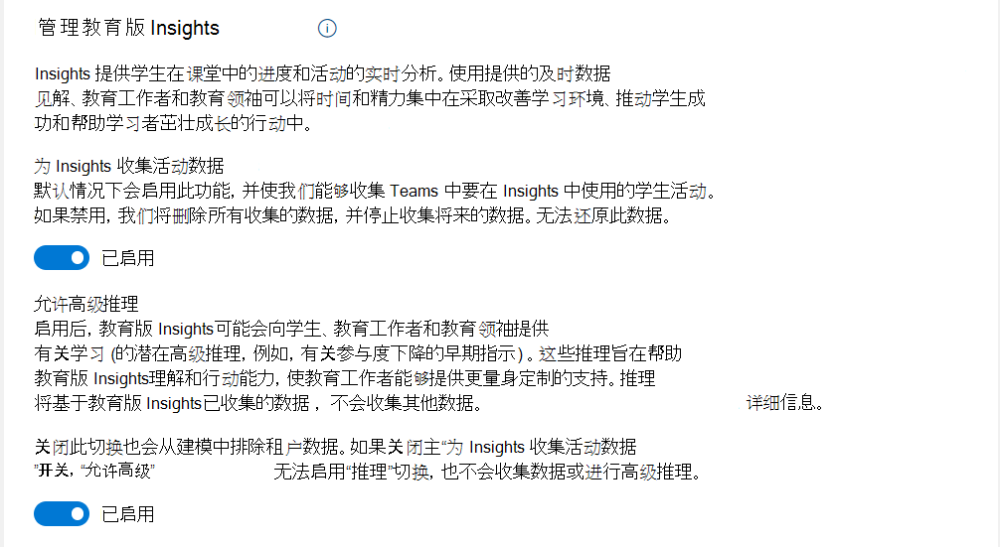

# Microsoft Teams 教育版见解 IT 管理员指南

本文档提供启动和运行 Microsoft Teams 教育版见解所需的步骤，并帮助教师和教育领导者采用该平台并成功使用该应用。

## 概述

**每位学生都有独特的体验、技能和心声。** 
**见解可帮助你了解学生并响应他们的需求。**

见解可实时分析学生在课堂上的进步和活动。 通过易于理解的可视化对象，学校社区可主动轻松地跟踪学生体验。 向教师和教育领导者提供有意义且可靠的数据，以便他们为其课堂团队做出明智的决策。 在数据的指导下，教师可以获得所需的信息，以确保满足学生的情感、社交和学术需求。

如果教师知道哪些策略对学生有效，那么学校社区可以引导工作并带来更为显著的影响力。 利用见解提供的及时数据，教师和教育领导者可以将时间和精力放在改善学习环境、推动学生成功和帮助学员全面发展的举措上。

## 谁使用见解？

### 教师

教师是拥有课堂团队的任何人。 教师可能包括老师、讲师和教授。

教师可在课堂级别访问见解。 他们可查看为其课堂分配的学生活动，但无法访问其他课堂的数据。 见解可帮助教师了解学生并为其提供支持。

使用见解并不需要任何先决条件，教师只需将见解添加到左侧应用栏，或在 Teams 中将其添加为每个课堂的选项卡。

教师由教职员工许可证标识。教师必须拥有教职员工许可证，并且是课堂团队所有者，这样才能查看“Insights”中的数据。

### 教育领导者

教育领导者是机构中所有需要通过组织视图了解学生参与度、进步和幸福感等信息的角色。当教师拥有课堂团队并且需要比课堂视图更多的信息时，教师也可以是教育领导者，例如学科部门的负责人。

教育领导者可能包括首席学术官、部门负责人、地区领导、学校校长、班主任、辅导员、学科负责人、项目主管、社会工作者和心理学家。

教育领导者获得的组织视图取决于 IT 管理员分配的权限。例如，学区管理员可以查看其访问的所有学校。 相反，学校校长或学校主管只能看到该学校的年级和课堂。

假设主管也负责教学，则他们既是教师又是教育领导者，并且可以访问见解的两种视图（适用于教师和教育领导者）。 在这里，见解可帮助教育领导者为教师和学生提供支持。
在组织级别，IT 管理员需要连接学生信息系统，并为每个角色分配访问与其相关的学校或部门的权限。

教育领导者由教职员工许可证标识，但是他们还需要从 IT 全局管理员获取 *显式权限*，才能查看其组织的见解报告。

> [!NOTE]
> **对于学生：**
>
> 见解会收集有关 Teams 中的学生活动的数据。
>
> 学生是 Teams 课堂团队的成员。 他们由其许可证标识，并且 **无权访问**“见解”应用或选项卡（即使他们是团队的所有者）。
>
> *不能* 将来宾视为学生。

## 用户可在何处找到见解？

教师和教育领导者可使用不同方法来访问见解。

### 教师

教师可以使用以下两种方法：

- [个人应用](https://support.microsoft.com/office/747fd8d9-00b0-43e6-bacc-a1bf030b1867) - 可从 Teams 左侧应用栏查看其所有活动课堂的概述，并且能够向下钻取到课堂数据。
- [选项卡](https://support.microsoft.com/office/1386d1b4-3641-4a23-9b9c-0c6c774c2b6c) - 可从课堂团队顶部导航菜单的选项卡中找到有关他们拥有的特定课堂的见解。 此选项卡允许位于 Teams 课堂中的教师直接访问相关数据，以便在课堂上下文中查看该数据。

见解将展示课堂团队的所有频道中的活动数据，但它只能作为选项卡添加到公共频道。 该选项卡显示课堂团队中不是所有者的每个人（包括不是课堂团队所有者的教师）的活动。

在两种视图中，教师都可以访问课堂数据。使用个人应用，教师需要向下钻取到课堂级别，而选项卡则允许直接访问课堂数据。

在课堂级别，如果教师拥有课堂团队，则无需 IT 管理员执行任何其他操作即可使用见解。

### 教育领导者

教育行业专家可以将见解用作 [应用](https://support.microsoft.com/office/8738d1b1-4e1c-49bd-9e8d-b5292474c347) 在 Teams 左侧应用栏上可用。

在组织级别，IT 管理员需要连接学生信息系统，并为每个角色分配访问与其相关的学校或部门的权限。

例如，校长只能看到其学校的课堂，或者部门负责人只能看到部门的课堂。
学生数据在课堂、部门、学校和地区级别进行汇总，我们（基于每个用户的权限）在每个级别提供见解。教师和教育领导者都可以放大并查看各个学生的数据。

**在 Teams 中添加见解应用：**

- 选择应用栏上的“**...**”。
- 搜索“**见解**”并选择它。
- 此时将打开说明屏幕。 选择“**添加**”。

  :::image type="content" source="media/insights-add-personal-app.png" alt-text="向 Teams 添加 Insights。":::

- 右键选择 Insights 图标，然后选择“**固定**”。

  :::image type="content" source="media/insights-pin-app.png" alt-text="固定 Insights 应用。":::

> [!TIP]
> 还可通过此链接查找 Insights 应用：[https://aka.ms/addInsights](https://aka.ms/addInsights)

## 何时使用见解？

Insights 支持整个学习周期的 **学习社区**。借助跨多个维度的实时指标，Insights 支持学校社区成员之间识别、反射、讨论和采取行动的持续循环。

- **了解** 学生与教师、课程材料及其同伴进行互动的方式和时间，以及他们如何完成作业。
- **反思** 投入的资源如何为学生取得成功提供支持，确定发展的领域以及需要协助的地方。
- 与学生和学校社区 **讨论** 调查结果，以加强人际关系、设定目标、执行自我评估、激发协作并改善成果。
- **采取行动** 以制定干预措施、提供有关发展领域的反馈、修改教学策略并确定所需的额外支持。

:::image type="content" source="media/insights-learning-cycle.png" alt-text="Insights 在整个学习周期中为学习社区提供支持。":::

## 见解如何工作？

见解可生成强大的分析，以帮助教师提高学习成果。 为此，它会分析 Teams 中的学生活动，并选择性地使用你提供的学生信息系统 (SIS) 数据来帮助将该活动置于上下文中考虑并进行分组。

在开始为你的机构部署见解之前，快速了解一下见解的工作方式、我们对数据伦理的承诺以及所需的许可。

### 数据收集

见解将从 Teams 的学生和教师活动中收集数据。 不会收集来宾数据。

见解 *不* 显示教师的相关数据。 对数据的分析为教学提供了切实可行的见解。

目前，将从课堂团队的以下部分收集数据：

|Teams 组件|收集的数据|
|---|---|
|**作业**|打开、上交作业并评分。|
|**频道参与**|访问频道、创建帖子、回复和赞帖子（不包括聊天内容）。|
|**文件**|上传、下载、访问、修改、批注和共享文件（不包括文件内容）。|
|**OneNote 课堂笔记本**|编辑笔记本中的页面或分区（不包括页面内容）。|
|**会议**|出席（不包括会议内容）。|
|**[阅读进度](https://support.microsoft.com/topic/e71705a2-a79a-4d7e-bcef-a1e0aa336017)**|准确率、最具挑战性的字词和每分钟字数。|
|**[反映](reflect.md)**|签入（包括值）。|
|**职业指导**|学生提供了专业（学习领域）和学年、职业指导应用中的学生活动，包括：技能、技能兴趣、职业兴趣、学习兴趣、职业相关活动。|

> [!NOTE]
> 几分钟后，所收集的大部分数据都会显示在 Insights 中。在会议结束后的几个小时会出现参加课堂会议（与某个课堂频道相关的会议）的提示，通常最多不超过 24 小时。

> [!NOTE]
> 在教育版 Insights 中收集的数据将一直保留，直到 IT 管理员关闭 [“教育版分析”切换](#turn-sds-for-insights-on-or-off) 或租户的 Office 订阅结束。关闭 Teams 中的特定功能不会删除历史数据。

### 隐私和安全

作为 Microsoft 365 的一部分，教育版 Insights 符合国家/地区、区域和行业特定的数据收集和使用法规，包括保护学生教育记录的隐私的 [GDPR](/compliance/regulatory/gdpr) 和 [“家庭教育权利”和“隐私法案” (FERPA)](/compliance/regulatory/offering-ferpa)。

数据归机构所有，Microsoft 仅收集并存储数据。 Microsoft 人员无法访问或查看数据，除非合规性法规允许以经过审核的方式维护服务（例如数据恢复）。

> [!TIP]
>
> - 访问 [Microsoft 信任中心](https://www.microsoft.com/trust-center)，以深入了解 Microsoft 如何保护你的数据。
> - 请访问 [Microsoft 合规性产品/服务](/compliance/regulatory/offering-home) ，了解 Microsoft 365 如何帮助机构满足法规合规性标准。

### 性能和可靠性

见解旨在以最佳性能和可靠性处理从 Teams 收集的大量数据。 我们不能保证 100％ 的可用性，但是我们会努力提供尽可能接近该目标的可用性。

将在与安装 Teams 中的“见解”选项卡不同的独立服务器上收集数据。 “见解”选项卡或个人应用不影响使用 Teams 其他功能的教师和学生的应用程序性能或网络带宽。

> [!TIP]
> 有关更多详细信息，请参阅[帮助解决 Teams 教育版的低带宽问题](edu-remote-low-bandwidth.md)。

### 数据存储

见解目前部署在欧洲和美国。 欧洲用户的数据存储在位于欧洲的服务器上。 澳大利亚和美国用户的数据存储在位于美国的服务器上。 欧洲、澳大利亚或美国以外用户的数据将存储在我们的某个地理区域中。

### 以道德的方式使用数据

我们致力于以负责任和道德的方式使用数据。 见解遵循 Microsoft 负责任的数据和 AI 原则。 这意味着我们对数据的使用方式保持透明，我们将教师和学生的利益放在第一位。  我们使用最高安全和隐私标准，监控持续可靠性和准确性，并确保你的机构持续保持合规性。

Microsoft 已从零开始构建见解以确保数据得到保护。 我们意识到使用这些数据的潜在敏感性，并且我们会保护你的数据和个人隐私。

#### 支持学习的数据

见解聚焦于学生的学习和数字参与。 该数据可支持学习，并显示数字学习平台上学生的参与程度。 虽然你可以向下钻取到课堂活动的各个级别，但是 Microsoft **不会为这些操作分配任何正值或负值**。 我们收集数据的目的是支持学生和教师实现最佳学习成果。

教师最了解他们的学生。 见解提供的信息可帮助教师在数字学习场景中 **为学生提供支持**。 它复制了可在亲身体验中获得的见解。 例如，假设某个学生在特定时期内没有活动，或者上周未按时完成所有作业。 该数据将呈现给教师，以便提供适当的提示或签入该名学生。 教师有责任与学生以及学生的家人或监护人互动，以确定所发现的任何活动或非活动的根本原因。

见解旨在在数字学习环境框架下同时为学生和教师提供支持。 见解 **不会直接捕获有关教师的数据**。 除了各个学生的数据，它还为特定教师提供学生活动和成果的汇总，使教育领导者能够为学生和教师提供支持。

### 许可

若要访问见解，用户必须具有 Microsoft 365 的 A1、A3 或 A5 教职员工许可证。

*教育版 Insights Premium* 是一种付费升级，它为教育领导者提供了教育见解数据的组织级别视图，并扩展了教师对历史数据视图的访问。 符合条件的教育机构可以通过教育解决方案注册 (EES)、云服务提供商 (CSP) 和 Microsoft 365 管理中心 (web direct) 购买 *教育版 Insights Premium* 附加许可证。

教育版 Insights Premium 加载项将基于为租户中所有以数字化方式活动的学生购买许可证来向组织提供。

## 学生信息系统 (SIS) 集成

向见解提供的数据越多，教师就越能更好地为学生提供支持，并且教育领导者也可以为教师提供更好的支持。

若要提供组织级见解，我们必须使用[学校数据同步 (SDS)](/SchoolDataSync) 连接到学生信息系统 (SIS)，以便见解正确映射教育系统的层次结构。

以课堂教师的身份查看课堂级见解时 *不* 需要这样做，因为我们使用的是 Teams 的课堂结构和权限。

若要了解详细信息，请阅读 [**将学生信息系统 (SIS) 数据与教育版见解同步**](education-insights-sis-data-sync.md)。

## 管理权限

作为 IT 管理员，你可以为教育领导、地区领导、校长、教导主任、教师、学习领域负责人、项目主任、社会工作者和心理医生提供权限。教育工作者在拥有一个班级团队时，会 *自动* 获得权限。

若要了解更多信息，请阅读 [**管理用户对教育版 Insights 的访问权限**](education-insights-manage-access.md)。

## 管理设置策略

作为 IT 管理员，你可以使用应用设置策略在教师和领导者启动 Teams 时默认为其安装 Insights。 使用该设置策略，你可以自定义 Teams 以突出显示见解，并将其固定在应用栏中。

如果教师希望直接访问各个课堂，则可在顶部导航菜单上手动安装“见解”选项卡。 此选项卡允许位于 Teams 课堂中的教师直接访问相关数据，以便在课堂上下文中查看该数据。

在两种视图中，教师都可以访问课堂数据。使用个人应用，教师需要向下钻取到课堂级别，而选项卡则允许直接访问课堂数据。

> [!TIP]
> 有关更多详细信息，请阅读[面向教育的 Teams 策略和策略包](./policy-packages-edu.md)。

## 鼓励采用见解

让你的教育机构对使用见解感到兴奋。

请随时向 **教师** 分发以下材料：

- 查看[见解支持页面](https://support.microsoft.com/office/27b56255-90c0-47aa-bac3-1c9f50157181)以获取更多帮助。
- 快速启动 - [获取 Insights 单页说明 PDF](https://aka.ms/insights/start)。
- 阅读[完整指南 PDF](https://aka.ms/insights/guide)。
- 观看有关如何使用见解的[分步教程](https://aka.ms/insights/resources)。
- 通过 Microsoft 教师中心提供的[免费见解课程](https://aka.ms/insights/course)进行自我培训。
- 最后，请查看专门讨论见解的[博客](https://techcommunity.microsoft.com/t5/education-blog/6-ways-to-be-insight-ful-and-support-student-engagement/ba-p/1903091)。

适用于教育 **者的资料**：

- [适用于教育组织的见解支持页面](https://support.microsoft.com/office/8738d1b1-4e1c-49bd-9e8d-b5292474c347)。

### 打开和关闭 Insights

默认情况下，Insights 处于打开状态，这使我们能够收集 Teams 中学生活动的分析，以便在 Insights 中使用它们。 你可以选择退出 Insights，在这种情况下，我们会 *删除为 Insights 收集的所有数据* 并停止收集任何未来数据。 如果重新启用 Insights，我们将从重新启用时开始收集数据。

可在两个地方控制 *教育版 Insights*。 它们两个的结果相同。 对于从 *SDS（经典）* 转换为 *SDS 预配* 的客户，只能使用 Teams 客户端这一选项。

#### 从 SDS 管理中心打开和关闭 Insights

1. 打开 [SDS 管理中心](https://sds.microsoft.com/)。
1. 转到“**设置**” > “**管理教育版 Insights**”。
1. 将 **为 Insights 收集活动数据** 的开关调整为打开或关闭。

#### 从 Teams 客户端打开和关闭 Insights

1. 如果没有固定 *教育版 Insights* 个人应用，请按照 [这些说明](class-insights.md#education-leaders)添加它。
1. 通过 Microsoft 365 管理员帐户，使用 *教育版 Insights* 右上角的省略号图标打开“**管理员设置**”页。
1. 将 **为 Insights 收集活动数据** 的开关调整为打开或关闭。

> [!NOTE]
> 如果已关闭 Insights，则删除已收集的数据。 选择退出时删除的数据无法在以后还原，即使重新启用了 Insights 也是如此。

### 在见解中打开和关闭高级推理

启用教育见解的“**允许高级推理**”开关后，Education Insights 可能会向学生、教师和教育领导者提供有关学习的高级推理（如参与警告）。 这些推理允许教师为学生提供更量身定制的支持。 该开关还控制如何使用租户数据进行建模。

打开此开关不会收集除教育版 Insights 已收集的数据以外的任何额外数据。

可在两个地方控制 *高级推理*。 它们两个的结果相同。 对于从 *SDS（经典）* 转换为 *SDS 预配* 的客户，只能使用 Teams 客户端这一选项。  

#### 从 SDS 管理中心打开和关闭高级推理

1. 打开 [SDS 管理中心](https://sds.microsoft.com/)。
1. 转到“**设置**” > “**管理教育版 Insights**”。
1. 将“**允许高级推理**”开关调整为关闭或打开。

#### 从 Teams 客户端打开和关闭高级推理

1. 如果没有固定 *教育版 Insights* 个人应用，请按照 [这些说明](class-insights.md#education-leaders)添加它。
1. 通过 Microsoft 365 管理员帐户，使用 *教育版 Insights* 右上角的省略号图标打开“**管理员设置**”页。
1. 将“**允许高级推理**”开关调整为关闭或打开。

> [!NOTE]
> 此切换取决于 **用于 Insights 切换的收集活动数据**。 关闭 **“收集见解”活动数据** 也将关闭“**允许高级推理**”切换。

### 打开或关闭用于 Insights 的 SDS

学校数据同步 (SDS) 有助于自动执行将学生信息系统 (SIS) 数据导入和同步到 Teams 的过程。

使用 Insights *不* 需要使用 SDS。 但是，你随时可以选择从 Insights 中退出。

- 若要关闭使用学校数据同步的 Insights，请按照[禁用 SDS Insights](/schooldatasync/how-to-deploy-sds-for-insights#disabling-sds-for-insights) 中的说明操作。

- 要重新打开它，请按照[如何部署 SDS Insights](/schooldatasync/how-to-deploy-sds-for-insights) 中的说明进行操作。

### 如何从教育版见解中删除用户数据

Insights 会存储在 Microsoft Teams 教育版中执行的学生和教师活动。

Insights 收集的数据有两种类型：

- **传入的数据**–在课堂学习活动中生成的数据。
- **无传入（私有）数据**–Teams 教育版中学生活动收集的数据，这些数据不是课堂学习活动的一部分。

Insights 收集的完整数据在[此处](class-insights.md#data-collection)列出。

为了向教师和教育领导者提供过去时间范围内数据的完全性和完整性，默认情况下，当学生或教师用户帐户关闭时，Insights 不会自动从服务中删除数据。 组织 IT 管理员可以通过执行以下步骤来请求手动删除用户（教师或学生）数据：

- 开启[支持票证](https://aka.ms/edusupport)。 支持票证必须清楚说明对 GDPR Delete DSR 操作的请求，并包含要删除的用户对象ID。
无法限制删除的数据集或时间范围。
- 在请求中，IT 管理员应在以下选项中明确说明需要为该用户删除的数据类型：
  - 所有数据（传入和专用）
  - 所有私人数据
  - 仅职业指导数据
- 存档后，支持票证将在队列中等待一周，以便满足合规性最低保留策略的要求。 你有机会在这段时间内取消操作。
- 一周后，Education Insights 团队会确保从服务中删除与上述特定类型的用户 ID 相关的所有数据。 Microsoft 支持人员将监视票证，并在不超过 28 天的删除过程完成后通知你

## 疑难解答

### 为什么我的机构在 Insights 中看不到任何数据？

如果是 *新* 租户，并且你 *从未* 在见解中查看过数据，请检查你的租户是否 **已验证为教育租户** 以访问见解。 联系 Microsoft 帐户管理员，请他们检查租户配置是否正确。

如果没有账户管理员，请开启票证。 转到“[Microsoft 365 管理中心](https://admin.microsoft.com/AdminPortal/)” > “**支持**” > “**新服务请求**”。  在票证标题中，写入：“”需要有关教育版验证的帮助”。

同时，验证是否已启用见解的数据收集。 虽然默认情况下它处于开启状态，但 IT 管理员可能已将其关闭，因此会删除 Insights 保留的所有数据。

若要验证此项，请打开 [SDS 管理中心](https://sds.microsoft.com)，转到“**设置**” > “**管理教育版 Insights**”。 检查“为 Insights 收集活动数据”的状态。

如果为关闭状态，请将其再次打开。Insights 开始收集数据，但可能需要多达 24 小时才能在报告中查看。

### 为什么会看到某些学生或班级的数据，而不是全部？

我们仅收集 *已授权* 的学生的数据，因此最可能的原因就是有来宾学生参与课程，不会收集他们的数据。 你可能看到他们的姓名，但没有任何数据。

检查学生的状态，确保所有学生都有学生许可证。

### 为什么教师看不到会议数据？

需要长达 24 小时才能在见解报告中查看会议数据。 因此，请检查是否已过足够的时间。

此外，检查学生是否*[在没有 Teams 帐户的情况下加入了课堂](https://support.microsoft.com/office/c6efc38f-4e03-4e79-b28f-e65a4c039508)。 在此情况下不会收集学生活动。

> [!TIP]
> 对于那些想要跟踪学生出席情况的教师，你可以建议在会议期间发送一条消息，要求学生回复。这将在几分钟内注册他们的出席情况。

> [!NOTE]
> 如果问题仍未解决，请 [打开支持票证](https://aka.ms/edusupport)。 包括阐明问题以及问题发生日期的相关屏幕截图。 添加你认为可帮助我们解决该问题的其他数据。

### 激活教育版 Insights Premium 需要哪些许可证？

为了为组织启用教育版 Insights Premium，租户必须根据组织的租户中以数字化方式活动的学生数量购买许可证。 也就是说，应为所有使用 Teams 课堂作为学习活动一部分的学生（如会议、通信、聊天、作业、编辑文件、课堂笔记本或反思等）购买许可证。
