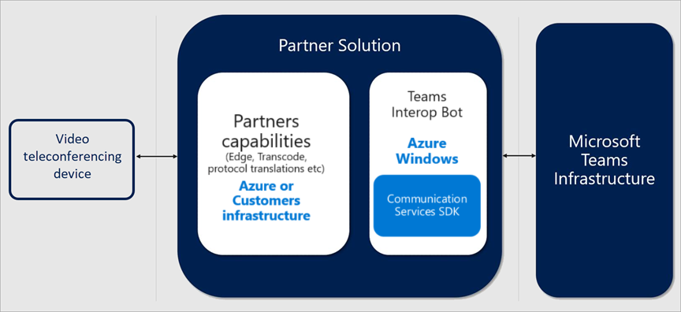
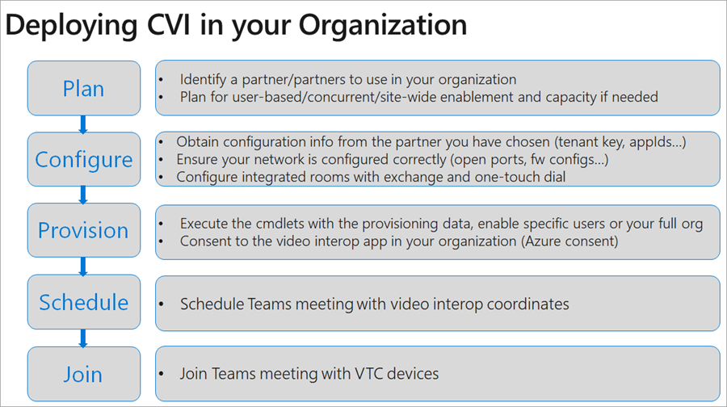

# Microsoft Teams 的云视频互操作性

视频互操作云 (CVI) 是一种 Microsoft 合格第三方解决方案，使第三方会议室 （监控） 和个人视频设备 (VTCs) 加入会议的 Microsoft 团队。
 
与 Microsoft 团队，包括音频、 视频以及内容共享的会议中获取丰富的联机内容协作。 通过桌面和 web 客户端，以及通过与 Microsoft 团队本机集成的许多合作伙伴设备，这可以被喜欢。 但是，许多客户已购买了视频电话会议和个人的视频通信设备，可以升级的费用。 云视频互操作提供了一个简单的解决方案，从而使您可以继续使用您现有的解决方案，直到您准备升级。

与云视频互操作，Microsoft 团队所有参与者 – 在会议室中或内部团队客户端提供本机会议体验。

### 我是否云视频互操作？

云视频互操作提供了中间服务时转换到完整本机 Microsoft 团队解决方案，使用团队终结点。 提供的服务应一部分迁移路径。

云视频互操作供客户满足以下条件：

- 具有未限定与 Microsoft 团队的直接集成的大型会议室内设备的部署和个人的视频设备部署 （50 + 设备）
- 支持云视频互操作合作伙伴之一
- 要保留其当前中的投资值到本机 Microsoft 团队解决方案在迁移期间会议室内设备和个人的视频设备

虽然云视频互操作提供了一个绝佳的中间解决方案，我们鼓励长期查找到我们本机团队会议解决方案，如团队会议室系统，我们客户。 

### Microsoft 团队认证的合作伙伴

以下合作伙伴具有 Microsoft 团队视频互操作的解决方案。 您的公司可以选择使用这些合作伙伴在企业内的任意组合。 

|合作伙伴|合作伙伴解决方案|
|----|---|
| | <a href="https://aka.ms/PolycomRealConnect" target="_blank">Polycom RealConnect 服务</a> |
|| <a href="https://aka.ms/PexipInfinity" target="_blank">Microsoft 团队 Pexip 无穷大</a> | 
|| <a href="https://aka.ms/BluejeansGateway" target="_blank">Microsoft 团队 blueJeans 网关</a> |

### 云视频互操作概述

云视频互操作是由我们的合作伙伴提供对内部部署和 Microsoft 团队的现有视频会议和视频设备个人解决方案之间的互操作性提供一个第三方服务。

我们的合作伙伴提供的解决方案包括的组件可以部署完全云基于或部分/完全在本地。 
     
下图显示了我们的合作伙伴的高级体系结构解决方案。

## 部署云视频互操作

在部署云视频互操作解决方案时，务必了解您正在部署合作伙伴解决方案。 下图中列出了部署云视频互操作应采取的常规步骤。

### 规划

在计划阶段，您应确定您将不替换本机团队设备，并查找云视频互操作合作伙伴可以支持这些设备的设备。  

还有一点了解，您将需要许可证，每个用户都将安排要在其中一个已启用云视频互操作的设备，以加入的会议。 请注意，可以从云视频互操作合作伙伴获得完全许可要求。 确保这是清除开始部署之前。

### 配置

您已选择为 CVI 部署合作伙伴将为您提供的贵组织中成功部署所需的所有步骤都组成完整部署文档。 这将包括防火墙端口和 IP 范围，您的设备，并需要更改其他设置的配置更改。

### 设置  

在设置阶段，您将向用户分配许可证相应根据合作伙伴配置指南。 您还需要通过提供对团队环境的合作伙伴访问的 Azure Consent 过程。 可在此处找到 Azure Consent 过程的详细信息：https://docs.microsoft.com/en-us/azure/active-directory/develop/v2-permissions-and-consent 

### 计划

计划使用任一团队会议外接程序 Outlook 或团队客户端的任何会议用户启用了云视频互操作后，将具有相应的其他信息自动添加到会议这样的团队云视频互操作兼容的设备可以加入这些会议。

### Join

合作伙伴解决方案中，根据有几种方法可以加入已启用云视频互操作的会议。 精确的与会方案将由您云视频互操作的合作伙伴提供。 我们列出了一些下面的示例：

- IVR （互动语音响应） 
  - 您可以使用 tenantkey@domain 的合作伙伴的 IVR 拨入。
  - 当您伙伴 IVR 中时，将提示您输入 VTC conferenceId，其中将然后将您连接到团队会议。
- 直接拨号 
  - 您可以直接拨团队会议不使用直拨功能，与合作伙伴的 IVR 进行交互的情况下使用 tenantkey 的完整字符串。VTC ConferenceId@domain。
- 一站式拨号 
  - 如果您有集成的团队会议室，您可以使用 （而无需键入任何拨号串） 由您的合作伙伴提供的一站式拨号功能。

## 管理云视频互操作

部署云视频互操作后，您可以管理使用我们的合作伙伴提供的解决方案的设备。 每个合作伙伴提供一个将包含许可证和设备管理的管理界面。 

报告中也有直接从合作伙伴管理界面。 报告功能的详细信息，请与您选择的合作伙伴。 

### 疑难解答云视频互操作

云视频互操作是合作伙伴提供服务。 如果您遇到问题，第一步是将设备已安装了团队客户端连接并将其连接到同一段作为云视频互操作设备造成问题。 

如果正确上这一段，并且您的团队功能还具有遵循合作伙伴提供的所有网络和配置指南，您将需要与合作伙伴联系进一步疑难解答。 

## PowerShell for 云视频互操作

为您 （部分） 自动化云视频互操作的部署提供了以下 PowerShell cmdlet。

- **Get CsTeamsVideoInteropServicepolicy**: Microsoft 提供的预构建的策略用于每个允许您指定要用于云视频互操作的合作伙伴的支持合作伙伴。 此 cmdlet，可以确定可以在组织中使用的预构建的策略。 通过利用授予 CsTeamsVideoInteropServicePolicy cmdlet，可以将此策略分配给一个或多个用户。
- **授予 CsTeamsVideoInteropServicePolicy**： 此 cmdlet 可以分配组织中使用的预构建的策略或将策略分配给特定用户。
- **新建 CsVideoInteropServiceProvider**： 此 cmdlet 用于指定有关您的组织希望使用支持 CVI 合作伙伴的信息。
- **设置 CsVideoInteropServiceProvider**： 使用此 cmdlet 更新您的组织使用的支持 CVI 合作伙伴的信息。
- **Get CsVideoInteropServiceProvider**： 使用此 cmdlet 获取所有的提供程序已配置为在组织中使用。
- **删除 CsVideoInteropServiceProvider**： 使用此 cmdlet 可删除有关您的组织不再使用的提供程序的所有提供商信息。
