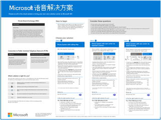

# 规划 Teams 语音解决方案

本文可帮助你确定哪个 Microsoft 语音解决方案适合你的组织。 决定后，本文提供了内容的路线图，使你能够实现所选解决方案。

你可能想要使用通话套餐的最简单的解决方案&mdash;电话系统。 此选项是 Microsoft 的全云解决方案，提供专用分支交换 (PBX) 功能，以及对公共交换电话网络 (PSTN) 的调用，如下图所示。 使用此解决方案，Microsoft 是你的 PSTN 运营商。

如果对以下内容回答“是”，则电话系统和通话套餐是适合你的解决方案：

- 呼叫计划在你所在的区域中可用。
- 无需保留当前的 PSTN 运营商。
- 你希望使用 Microsoft 管理的 PSTN 访问权限。

但是，你的处境可能更复杂。 例如，你可能在通话套餐不可用的位置设有办公室。 或者，可能需要一个组合解决方案来支持复杂的多国家部署，对不同的地理位置有不同的要求。 Microsoft 支持解决方案的组合：

- 具有通话套餐的电话系统
- 具有自己的 PSTN 运营商和 Operator Connect 的电话系统
- 具有自己的 PSTN 运营商和直接路由的电话系统
- 将电话系统与呼叫计划、电话系统与操作员连接以及/或电话系统与直接路由配合使用的组合解决方案

有关所有语音解决方案选项的视觉摘要，请参阅语音解决方案海报。

   [PDF](https://download.microsoft.com/download/4/3/5/435cd4e9-ca56-4fd1-acb6-d1fda7952320/microsoft-voice-solutions.pdf)  [Visio](https://download.microsoft.com/download/7/5/c/75c13012-e20c-48bd-a6dd-ea49d1a3420d/microsoft-voice-solutions.vsdx) 
 

>[!NOTE]
>如果你是一个中小型企业 (300人或更少的人) ，Microsoft现在捆绑电话系统与国内通话计划。 有关详细信息，请参阅 [面向中小型企业的电话系统指南](/microsoftteams/business-voice/whats-business-voice) ，以帮助你规划、设置和管理语音解决方案。

## 需要阅读哪些内容？

**需要所有人。** 本文中的某些部分涉及所有组织。 例如，每个人都应该阅读电话系统，并了解连接到公共交换电话网络 (PSTN) 的选项。

| 所有项均必需 | 说明 |
| :------------|:-------|
| [**电话系统**](#phone-system) | Microsoft 在 Microsoft 365 云中使用 Microsoft Teams 启用呼叫控制和专用分支交换 (PBX) 功能的技术。 |
| [**公共交换电话网络 (PSTN) 连接选项**](#public-switched-telephone-network-connectivity-options) | 选择 Microsoft 作为电话运营商，或使用运营商连接或直接路由将自己的电话运营商连接到 Microsoft Teams。 PSTN 连接选项与电话系统结合使用，使用户能够在世界各地拨打电话。|

**具体取决于你的要求。** 此部分和相关文章中的某些部分是相关的，具体取决于现有的部署和要求。 例如，Location-Based路由仅适用于不允许绕过收费的地理位置中的直接路由客户。

请考虑可能需要哪些其他配置：

| 具体取决于要求 | 说明 |
| :------------|:-------|
| [**电话号码管理**](pstn-connectivity.md#phone-number-management) | 如何获取和管理电话号码因 PSTN 连接选项而异。 如果需要获取电话号码、转移现有号码、获取服务号码等，请阅读本部分。 |
| [**呼叫路由和拨号计划**](pstn-connectivity.md#call-routing-and-dial-plans) | 如何配置和管理拨号计划，将拨号电话号码转换为备用格式 (通常为 E.164 格式) 呼叫授权和呼叫路由。 如果需要了解什么是拨号计划，以及是否需要为组织指定拨号计划，请阅读本部分。|
| [**紧急呼叫**](pstn-connectivity.md#emergency-calling) | 如何管理和配置紧急呼叫因 PSTN 连接选项而异。 如果需要了解如何管理组织的紧急呼叫，请阅读本部分。 |
| [**直接路由的基于位置的路由**](pstn-connectivity.md#location-based-routing-for-direct-routing) |如何使用Location-Based路由 (LBR) 根据其地理位置限制 Microsoft Teams 用户的通行费旁路。 如果组织在不允许绕过收费的位置使用直接路由，请阅读本部分。
| [**云语音功能的网络拓扑**](pstn-connectivity.md#network-topology-for-voice-features) | 如果你的组织要为直接路由或动态紧急呼叫部署Location-Based路由 (LBR) ，则必须在 Microsoft Teams 中为这些功能配置网络设置。 如果要实现直接路由的 LBR，或者使用呼叫计划或直接路由实现动态紧急呼叫，请阅读本部分。 |
| [**迁移现有语音解决方案**](#migrate-your-existing-voice-solution-to-teams) | 将语音解决方案迁移到 Teams 时需要考虑的事项。  如果要从现有语音解决方案迁移到 Teams，请阅读本部分。 

> [!Important]
> 本文重点介绍 Microsoft Teams 的语音解决方案。 由于 Skype for Business Online 于 2021 年 7 月 31 日停用，因此不再支持通过 Skype for Business Server 或 Cloud Connector Edition&mdash;和 Skype for Business Online 连接本地环境&mdash;之间的 PSTN 连接。 本文介绍 Teams 语音解决方案，以及如何在必要时使用操作员连接或直接路由将本地电话网络连接到 Teams。

## 电话系统

电话系统是 Microsoft 在 Microsoft 365 云中使用 Microsoft Teams 启用呼叫控制和专用分支交换 (PBX) 功能的技术。

电话系统适用于 Teams 客户端和经过认证的设备。 通过电话系统，可以将现有的 PBX 系统替换为直接从 Microsoft 365 提供的一组功能。 

组织中的用户之间的呼叫（无论地理区域如何）在电话系统内部进行处理。 这些内部呼叫永远不会转到公共交换电话网络 (PSTN) ，因此你的公司可以避免长途收费。

本文介绍以下电话系统关键功能和功能，以及需要考虑的部署决策：

- [自动助理和呼叫队列](#auto-attendants-and-call-queues)
- [云语音邮件](#cloud-voicemail)
- [调用标识](#calling-identity)

有关所有电话系统功能以及如何设置电话系统的信息，请参阅以下文章：

- [电话系统的功能](here-s-what-you-get-with-phone-system.md)
- [在组织中设置电话系统](setting-up-your-phone-system.md) 
  介绍如何购买和分配电话系统许可证、管理电话号码以及设置免费号码的通信信用额度。 

有关管理受支持的设备的信息，请参阅在 Microsoft Teams 和 [Teams 市场](https://www.microsoft.com/microsoft-365/microsoft-teams/across-devices?ms.url=officecomteamsdevices&rtc=1)[中管理设备](devices/device-management.md)。

### 自动助理和呼叫队列

自动助理允许你设置菜单选项，以基于调用方输入路由呼叫。 呼叫队列正在等待呼叫方的区域。 自动助理和呼叫队列一起使用，可以轻松地将呼叫者路由到组织中的相应人员或部门。

有关自动助理和呼叫队列的信息，请参阅以下文章：

- [规划 Teams 自动助理和呼叫队列](plan-auto-attendant-call-queue.md)
- [设置自动助理](create-a-phone-system-auto-attendant.md)
- [创建呼叫队列](create-a-phone-system-call-queue.md) 
- [Contoso 案例研究：自动助理和呼叫队列](voice-case-study-call-queues.md) 
  介绍虚构的多国公司 Contoso 如何为其语音解决方案实现自动助理和呼叫队列。

### 云语音邮件

云语音邮件由 Azure Voicemail 服务提供支持，仅支持 Exchange 邮箱的语音邮件存款。 它不支持第三方电子邮件系统。 

云语音邮件包括语音邮件转录，默认情况下，为组织中的所有用户启用该功能。 业务需求可能需要为特定用户或整个组织中的所有人禁用语音邮件听录。

云语音邮件自动为 Teams 用户设置和预配。  

有关云语音邮件及其配置的详细信息，请参阅以下文章：

- [设置云语音邮件](set-up-phone-system-voicemail.md)
- [在组织中设置语音邮件策略](manage-voicemail-policies.md)

### 调用标识

默认情况下，所有出站呼叫都使用分配的电话号码作为呼叫标识 (呼叫者 ID) 。 呼叫接收人可以快速识别呼叫方，并决定是接收还是拒绝呼叫。 有关配置调用方 ID 或更改或阻止调用方 ID 的信息，请参阅 [设置用户的调用方 ID](set-the-caller-id-for-a-user.md)。 

## 公用电话交换网连接选项

电话系统为组织提供完整的 PBX 功能。 但是，若要使用户能够在组织外部拨打电话，需要将电话系统连接到公共交换电话网络 (PSTN) 。 若要将电话系统连接到 PSTN，可以选择以下选项之一：

- [**具有通话套餐的电话系统**](pstn-connectivity.md#phone-system-with-calling-plan)。 以 Microsoft 为 PSTN 运营商的全云解决方案。

- [**使用 Operator Connect 使用自己的 PSTN 运营商的电话系统**](operator-connect-plan.md)。 使用 Operator Connect 时，如果现有操作员参与 Microsoft Operator Connect 计划，则他们可以管理将 PSTN 调用引入 Teams 的服务。 有关运算符连接的优势和要求的信息，请参阅 [Plan Operator Connect](operator-connect-plan.md)。

- [**通过使用直接路由**](pstn-connectivity.md#phone-system-with-direct-routing) 将本地环境连接到 Teams，使用自己的 PSTN 运营商的电话系统。

可以选择选项的组合，以便为复杂环境设计解决方案，或管理多步骤迁移。 稍后你将阅读有关迁移的详细信息。

无论选择哪种 PSTN 连接选项，大多数电话系统功能都是相同的。 但是，功能存在一些差异，这会影响配置某些电话系统功能的方式，例如呼叫路由和紧急呼叫。 有关 PSTN 连接选项和配置注意事项的详细信息，请参阅 [PSTN 连接选项](pstn-connectivity.md)。

## 将现有语音解决方案迁移到 Teams

> [!NOTE]
> 有关将 Teams 语音解决方案规划为从 Skype for Business Server 升级到 Teams 的总体计划的一部分的指导，请参阅 [PSTN 注意事项，以便从本地Skype for Business升级到 Teams](upgrade-to-teams-on-prem-pstn-considerations.md)。

对于正在升级到 Teams 的组织，最终目标是将所有用户移动到 TeamsOnly 模式。 仅当用户处于 TeamsOnly 模式时，才支持使用电话系统。 如果需要有关升级到 Teams 的基本信息，请从以下处开始：

- [开始 Microsoft Teams 升级](upgrade-start-here.md)
- [关于升级框架](upgrade-framework.md)
- [IT 管理员的升级策略](upgrade-to-teams-on-prem-implement.md)

迁移语音解决方案时，在迁移到 TeamsOnly 模式时，有四种可能的调用方案：

- [**Skype for Business Online 中的用户，具有 Microsoft 呼叫计划**](upgrade-to-teams-on-prem-pstn-considerations.md#from-skype-for-business-online-with-microsoft-calling-plans)。 升级后，此用户将继续具有 Microsoft 呼叫计划。

- **[Skype for Business Online 中的用户，](upgrade-to-teams-on-prem-pstn-considerations.md#from-skype-for-business-online-with-on-premises-voice)通过本地或云连接器版本Skype for Business具有本地语音功能**。 用户升级到 Teams 需要与将用户迁移到直接路由进行协调，以确保 TeamsOnly 用户具有 PSTN 功能。

- Skype for Business本地企业语音用户 **，他们将转到联机并保持本地 PSTN 连接**。 将此用户迁移到 Teams 需要将用户的本地Skype for Business帐户移动到云，并协调该操作，将用户迁移到直接路由。 

- Skype for Business本地企业语音的 **[用户](upgrade-to-teams-on-prem-pstn-considerations.md#from-skype-for-business-server-on-premises-with-enterprise-voice-to-microsoft-calling-plan)，他们将转到联机并使用 Microsoft 呼叫计划**。  将此用户迁移到 Teams 需要将用户的本地Skype for Business帐户移动到云，并使用 A) 该用户电话号码的端口协调移动到 Microsoft 呼叫计划，或者 B) 从可用区域分配新的订阅者号码。

有关如何针对每个方案实现语音迁移的详细信息，请参阅以下文章：

- [升级到 Teams 时的 PSTN 注意事项 - 面向 IT 管理员](upgrade-to-teams-on-prem-pstn-considerations.md)

- [Contoso 语音迁移案例研究](voice-case-study-overview.md) 
  案例研究描述了虚构的多国公司 Contoso 如何为其组织实现 Teams 语音解决方案。 它包含以下文章：

  - [Teams 升级计划](voice-case-study-migration-plan.md)
  - [电话系统和 PSTN 连接选项](voice-case-study-phone-system.md)
  - [基于位置的路由实现](voice-case-study-location-based-routing.md)
  - [紧急呼叫](voice-case-study-emergency-calling.md)
  - [自动助理和呼叫队列](voice-case-study-call-queues.md)
  - [音频会议](voice-case-study-audio-conferencing.md)
