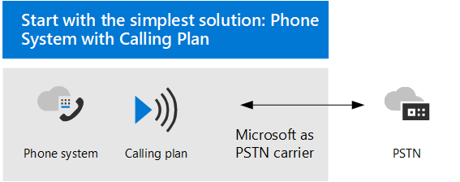
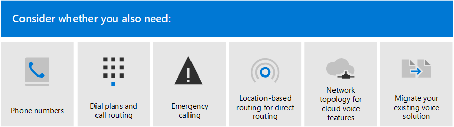
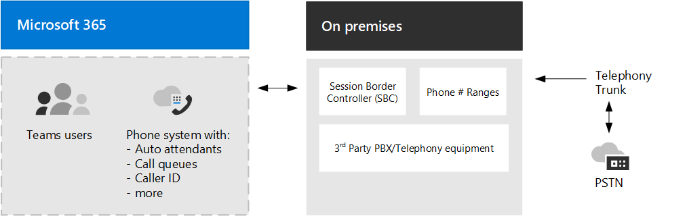

# 规划Teams语音解决方案Plan your Teams voice solution 

本文帮助你确定哪个 Microsoft 语音解决方案适合你的组织。This article helps you decide which Microsoft voice solution is right for your organization. 确定后，本文提供内容路线图，实现所选解决方案。After you've decided, the article provides a roadmap to content that will enable you to implement your chosen solution.

> [!NOTE]
> 有关规划 Teams 语音解决方案作为从 Skype for Business Server 升级到 Teams 的总体计划的一部分的指导，请参阅从 Skype for Business 本地升级到 Teams 的[PSTN 注意事项](upgrade-to-teams-on-prem-pstn-considerations.md)。For guidance on planning a Teams voice solution as part as your overall plan to upgrade to Teams from Skype for Business Server, see [PSTN considerations for upgrading to Teams from Skype for Business on-premises](upgrade-to-teams-on-prem-pstn-considerations.md).

你可能希望使用呼叫计划 &mdash; 电话系统最简单的解决方案。You might want the simplest solution&mdash;Phone System with Calling Plan. 这是 Microsoft 的全云解决方案，可提供专用分支 Exchange (PBX) 功能，并呼叫公用电话交换网 (PSTN) ，如下图所示。This is Microsoft's all-in-the-cloud solution that provides Private Branch Exchange (PBX) functionality and calls to the Public Switched Telephone Network (PSTN), as shown in the following diagram. 借助此解决方案，Microsoft 是你的 PSTN 运营商。With this solution, Microsoft is your PSTN carrier.

如果你对以下内容回答"是"，电话系统呼叫计划"是适合你的解决方案：If you answer yes to the following, then Phone System with Calling Plan is the right solution for you:

- 呼叫计划在你的地区可用。Calling Plan is available in your region.
- 无需保留当前 PSTN 运营商。You do not need to retain your current PSTN carrier.
- 您希望使用 Microsoft 托管的 PSTN 访问权限。You want to use Microsoft-managed access to the PSTN.

但是，情况可能更复杂。However, your situation might be more complex. 例如，你可能在呼叫计划不可用的位置设有办公室。For example, you might have offices in locations where Calling Plan isn't available. 或者，可能需要一个支持复杂、跨区域部署、对不同地理位置有不同的要求的组合解决方案。Or you might need a combination solution that supports a complex, multi-national deployment, with different requirements for different geographic locations. Microsoft 支持解决方案的组合：Microsoft supports a combination of solutions: 

- 电话系统套餐Phone System with Calling Plan
- 电话系统您的 PSTN 运营商运营商连接 (目前仅在公共 **预览版中提供)**Phone System with your own PSTN carrier with Operator Connect (currently available only in **public preview**)
- 电话系统直接路由与自己的 PSTN 运营商联系Phone System with your own PSTN carrier with Direct Routing
- 结合使用解决方案，将 电话系统 与呼叫计划结合使用电话系统接线员连接和/或电话系统直接路由A combination solution that uses Phone System with Calling Plan, Phone System with Operator Connect, and/or Phone System with Direct Routing

## 需要阅读哪些信息？What do you need to read?

**全部必需。****Required for all.** 本文中的某些部分适用于所有组织。Some of the sections in this article pertain to all organizations. 例如，每个人都应该阅读有关电话系统并了解用于连接到 PSTN 公用电话交换网 (的选项) 。For example, everyone should read about Phone System and understand the options for connecting to the Public Switched Telephone Network (PSTN). 

| 全部必需Required for all | 说明Description |
| :------------|:-------|
| [**电话系统****Phone System**](#phone-system) | Microsoft 在云中启用呼叫控制和专用分支 Exchange (PBX) 功能的技术Microsoft 365云Microsoft Teams。Microsoft's technology for enabling call control and Private Branch Exchange (PBX) capabilities in the Microsoft 365 cloud with Microsoft Teams. |
| [**PSTN 公用电话交换 (PSTN) 连接选项****Public Switched Telephone Network (PSTN) connectivity options**](#public-switched-telephone-network-connectivity-options) | 可以选择使用 Microsoft 作为电话运营商，还是使用直接路由或接线员Microsoft Teams将你自己的电话运营商连接。A choice between using Microsoft as your telephony carrier or connecting your own telephony carrier to Microsoft Teams by using Direct Routing or Operator Connect. PSTN 连接电话系统结合使用，使用户能够拨打全球电话。Combined with Phone System, PSTN connectivity options enable your users to make phone calls all over the world.|

**根据你的要求。****Depending on your requirements.** 本文中的某些部分与现有的部署和要求相关。Some of the sections in this article are pertinent depending on your existing deployment and requirements. 例如，Location-Based直接路由客户在不允许收费绕过的地理位置进行直接路由。For example, Location-Based Routing is only required for Direct Routing customers in geographic locations that do not allow toll bypass.

请考虑可能需要以下附加配置中的哪一种：Consider which of these additional configurations you might need:

| 根据要求Depending on your requirements | 说明Description |
| :------------|:-------|
| [**电话 Microsoft 提供的电话号码****Phone numbers from Microsoft**](#phone-numbers-from-microsoft) | 如何从 Microsoft 获取和管理电话号码，以及如何将现有号码转移到 Microsoft。How to get and manage phone numbers from Microsoft, and how to transfer existing numbers to Microsoft. 如果需要获取 Microsoft 呼叫计划的电话号码、转移现有号码、获取服务号码等，请阅读此内容。Read this if you need to obtain phone numbers for Microsoft Calling Plan, transfer existing numbers, obtain service numbers, and so on. |
| [**拨号计划和呼叫路由****Dial plans and call routing**](#dial-plans-and-call-routing) | 如何配置和管理将拨号电话号码转换为备用格式的拨号计划 (通常为 E.164 格式) 进行呼叫授权和呼叫路由。How to configure and manage dial plans that translate dialed phone numbers into an alternate format (typically E.164 format) for call authorization and call routing. 如果需要了解什么是拨号计划以及是否需要为组织指定拨号计划，请阅读此说明。Read this if you need to understand what dial plans are and  whether you need to specify dial plans for your organization.|
| [**紧急呼叫****Emergency calling**](#emergency-calling) | 如何管理和配置紧急呼叫 &mdash; ，具体取决于 PSTN 连接选项。How to manage and configure emergency calling&mdash;depending on your PSTN connectivity option. 如果使用 Microsoft 呼叫计划或直接路由，并且需要了解如何为组织管理紧急呼叫，请阅读本部分。Read this section if you are using Microsoft Calling Plan or Direct Routing and need to understand how to manage emergency calling for your organization. |
| [**用于直接路由的基于位置的路由****Location-Based Routing for Direct Routing**](#location-based-routing-for-direct-routing) |如何使用 LBR Location-Based路由 (，) 基于用户的地理位置Microsoft Teams免收费。How to use Location-Based Routing (LBR) to restrict toll bypass for Microsoft Teams users based on their geographic location. 如果组织在不允许绕过收费站的位置使用直接路由，请阅读本部分。Read this section if your organization is using Direct Routing at a location that does not allow toll bypass.
| [**云语音功能的网络拓扑****Network topology for cloud voice features**](#network-topology-for-voice-features) | 如果组织为直接路由Location-Based LBR (部署) 路由或动态紧急呼叫，则必须配置网络设置，以与 Microsoft Teams 中的这些功能一Microsoft Teams。If your organization is deploying Location-Based Routing (LBR) for Direct Routing or dynamic emergency calling, you must configure network settings for use with these features in Microsoft Teams. 如果要为直接路由实现 LBR，或者使用呼叫计划或直接路由实现动态紧急呼叫，请阅读本部分。Read this section if you are implementing LBR for Direct Routing, or if you are implementing dynamic emergency calling with Calling Plan or Direct Routing. |
| [**迁移现有语音解决方案****Migrate your existing voice solution**](#migrate-your-existing-voice-solution-to-teams) | 将语音解决方案迁移到云时需考虑Teams。What you need to think about when migrating your voice solution to Teams.  如果要从现有语音解决方案迁移到现有语音解决方案，请阅读此Teams。Read this section if you are migrating from an existing voice solution to Teams. 

> [!Important]
> 本文重点介绍语音解决方案与Microsoft Teams。This article focuses on voice solutions with Microsoft Teams. 虽然 Skype for Business Online 解决方案 ([Microsoft](/SkypeForBusiness/hybrid/msft-telephony-solutions)电话解决方案) 中所述，但必须了解 Skype for Business Online 将于 2021 年 7 月 31 日停用。While solutions with Skype for Business Online are still available (as described in [Microsoft telephony solutions](/SkypeForBusiness/hybrid/msft-telephony-solutions)), it's important to understand that Skype for Business Online will be retired on July 31, 2021.  该日期之后，Skype for Business不再可访问联机服务。After that date, the Skype for Business Online service will no longer be accessible. 此外，将不再支持本地环境之间的 PSTN 连接 &mdash; Skype for Business Server云连接器版本和 Skype for Business Online &mdash; 连接。In addition, PSTN connectivity between your on-premises environment&mdash;whether through Skype for Business Server or Cloud Connector Edition&mdash;and Skype for Business Online will no longer be supported. 本文介绍Teams语音解决方案，以及如何在必要时使用直接路由或接线员Teams连接本地电话连接。This article introduces Teams voice solutions and how you can connect your on-premises telephony network, if necessary, to Teams by using Direct Routing or Operator Connect.

## 电话系统Phone System

电话系统是 Microsoft 在 Microsoft 365 或 Office 365 云中启用呼叫控制和专用分支 Exchange (PBX) 功能的技术，Microsoft Teams。Phone System is Microsoft's technology for enabling call control and Private Branch Exchange (PBX) capabilities in the Microsoft 365 or Office 365 cloud with Microsoft Teams.

电话系统适用于Teams或Skype for Business客户端和认证设备。Phone System works with Teams or Skype for Business clients and certified devices. 电话系统将现有 PBX 系统替换为一组直接从 Microsoft 365 或 Office 365。Phone System allows you to replace your existing PBX system with a set of features directly delivered from Microsoft 365 or Office 365. 

您的组织中的用户之间的呼叫在内部处理电话系统，永远不会转到 PSTN (电话) 。Calls between users in your organization are handled internally within Phone System, and never go to the Public Switched Telephone Network (PSTN). 这适用于组织中位于不同地理区域的用户之间的呼叫，消除了这些内部呼叫的远程成本。This applies to calls between users in your organization located in different geographical areas, removing long-distance costs on these internal calls.

本文介绍以下电话系统特性和功能，以及需要考虑的部署决策：This article introduces the following Phone System key features and functionality, and the deployment decisions you'll need to consider:

- [自动助理和呼叫队列Auto attendants and call queues](#auto-attendants-and-call-queues)
- [云语音邮件Cloud Voicemail](#cloud-voicemail)
- [调用标识Calling identity](#calling-identity)

有关所有电话系统功能以及如何设置电话系统，请参阅以下文章：For information about all Phone System features, and how to set up Phone System, see the following articles:

- [电话系统的功能Here's what you get with Phone System](here-s-what-you-get-with-phone-system.md)
- [在组织中设置电话系统Set up Phone System in your organization](setting-up-your-phone-system.md) 
  介绍如何购买和分配电话系统、管理电话号码以及设置免费号码的通信信用额度。Describes how to buy and assign Phone System licenses, manage phone numbers, and set up communication credits for toll-free numbers. 

有关管理受支持设备的信息，请参阅[在](devices/device-management.md)Microsoft Teams 和 Teams[中管理设备](https://www.microsoft.com/microsoft-365/microsoft-teams/across-devices?ms.url=officecomteamsdevices&rtc=1)。For information about managing supported devices, see [Manage your devices in Microsoft Teams](devices/device-management.md) and [Teams Marketplace](https://www.microsoft.com/microsoft-365/microsoft-teams/across-devices?ms.url=officecomteamsdevices&rtc=1).

### 自动助理和呼叫队列Auto attendants and Call queues

自动助理允许您设置菜单选项，以便根据呼叫者输入路由呼叫。Auto attendants allow you to set up menu options to route calls based on caller input. 呼叫队列正在等待呼叫者的区域。Call queues are waiting areas for callers. 自动助理和呼叫队列一起使用可以轻松地将呼叫者路由到组织中相应的人员或部门。Used together, auto attendants and call queues can easily route callers to the appropriate person or department in your organization.

有关自动助理和呼叫队列的信息，请参阅以下文章：For information about auto attendants and call queues, see the following articles:

- [规划Teams助理和呼叫队列Plan for Teams auto attendants and call queues](plan-auto-attendant-call-queue.md)
- [设置自动助理Set up an auto attendant](create-a-phone-system-auto-attendant.md)
- [创建呼叫队列Create a call queue](create-a-phone-system-call-queue.md) 
- [Contoso 案例研究：自动助理和呼叫队列Contoso case study: Auto attendants and call queues](voice-case-study-call-queues.md) 
  介绍虚构的多语言公司 Contoso 如何为语音解决方案实现自动助理和呼叫队列。Describes how a fictional multi-national corporation, Contoso, implemented auto attendants and call queues for their voice solution.

### 云语音邮件Cloud Voicemail

云语音邮件由 Azure 语音邮件服务支持将语音邮件Exchange邮箱。Cloud Voicemail, powered by Azure Voicemail services, supports voicemail deposits to Exchange mailboxes only. 它不支持第三方电子邮件系统。It doesn't support third-party email systems. 

云语音邮件包括语音邮件转录，默认情况下，为组织中的所有用户启用该功能。Cloud Voicemail includes voicemail transcription, which is enabled for all users in your organization by default. 你的业务需求可能要求你为特定用户或整个组织所有人禁用语音邮件转录。Your business needs might require that you disable voicemail transcription for specific users or everyone throughout the organization.

对于仅联机用户云语音邮件，系统会自动为用户设置和预配用户许可证电话系统许可证。For online only users, Cloud Voicemail is automatically set up and provisioned for users after they are assigned a Phone System license. 对于电话系统邮箱Exchange，需要执行额外的配置步骤。For Phone System users with an Exchange mailbox, you will need to perform extra configuration steps. 

有关应用程序及其云语音邮件，请参阅以下文章：For more information about Cloud Voicemail and its configuration, see the following articles:

- [设置云语音邮件Set up Cloud Voicemail](set-up-phone-system-voicemail.md)
- [在组织中设置语音邮件策略Set voicemail policies in your organization](manage-voicemail-policies.md)

### 调用标识Calling identity

默认情况下，所有出站呼叫使用分配的电话号码作为呼叫标识 (呼叫者 ID) 。By default, all outbound calls use the assigned phone number as calling identity (caller ID). 呼叫接收人可以快速识别呼叫方，并决定是接收还是拒绝呼叫。The recipient of the call can quickly identify the caller and decide whether to accept or reject the call. 有关配置来电显示或更改或阻止来电显示的信息，请参阅 [为用户设置来电显示](set-the-caller-id-for-a-user.md)。For information about configuring caller ID or to change or block the caller ID, see [Set the caller ID for a user](set-the-caller-id-for-a-user.md). 

## 公用电话交换网络连接选项Public Switched Telephone Network connectivity options

电话系统为组织提供完整的 PBX 功能。Phone System provides complete PBX capabilities for your organization. 但是，若要让用户在组织外部进行呼叫，你需要将 电话系统 连接到 PSTN (电话) 。However, to enable users to make calls outside your organization, you need to connect Phone System to the Public Switched Telephone Network (PSTN). 若要电话系统 PSTN，可以选择以下选项之一：To connect Phone System to the PSTN, you can choose one of the following options:

- [**电话系统套餐 。**](#phone-system-with-calling-plan)[**Phone System with Calling Plan**](#phone-system-with-calling-plan). 以 Microsoft 作为 PSTN 运营商的全云解决方案。An all-in-the-cloud solution with Microsoft as your PSTN carrier.

- [**电话系统直接**](#phone-system-with-own-pstn-carrier-with-direct-routing)路由将本地环境连接到本地环境，与自己的 PSTN 运营商Teams。[**Phone System with your own PSTN carrier by using Direct Routing**](#phone-system-with-own-pstn-carrier-with-direct-routing) to connect your on-premises environment to Teams.

- 电话系统运营商或运营商与自己的 [**PSTN 运营商连接，**](operator-connect-plan.md)目前仅在公共预览 **版中提供。**[**Phone System with your own PSTN carrier by using Operator Connect**](operator-connect-plan.md), which is currently available only in **public preview.**  使用接线连接，如果现有运营商是 Microsoft 接线员连接参与者，他们可管理将 PSTN 呼叫引入 Teams。With Operator Connect, if your existing operator is a participant in the Microsoft Operator Connect program, they can manage the service for bringing PSTN calling to Teams. 有关操作员服务权益和要求连接，有关参与此计划的操作员的列表，请参阅计划操作员[连接。](operator-connect-plan.md)For information on the benefits and requirements of Operator Connect, and for a list of operators participating in this program, see [Plan Operator Connect](operator-connect-plan.md).

还可以选择一组选项，用于为复杂环境设计解决方案，或管理多步骤迁移 (以后迁移) 。You can also choose a combination of options, which enables you to design a solution for a complex environment, or manage a multi-step migration (more about migration later).

### 电话系统套餐Phone System with Calling Plan 

如本文前面所述，电话系统套餐是 Microsoft 为用户提供的所有云语音Teams解决方案。As described earlier in this article, Phone System with Calling Plan is Microsoft's all-in-the-cloud voice solution for Teams users. 这是将 Microsoft 电话 系统连接到公用电话交换网 (PSTN) 以启用对世界各地的座机和移动电话的呼叫的最简单选项。This is the simplest option that connects Microsoft Phone System to the Public Switched Telephone Network (PSTN) to enable calls to landlines and mobile phones around the world. 使用此选项，Microsoft 为组织Exchange (PBX) 专用分支，并充当 PSTN 运营商，如下图所示：With this option, Microsoft provides Private Branch Exchange (PBX) functionality for your organization and acts as your PSTN carrier, as shown in the following diagram:

如果你对以下内容回答"是"，电话系统呼叫计划"是适合你的解决方案：If you answer yes to the following, then Phone System with Calling Plan is the right solution for you:

- 呼叫计划在你的地区可用。Calling Plan is available in your region.
- 无需保留当前 PSTN 运营商。You do not need to retain your current PSTN carrier.
- 您希望使用 Microsoft 托管的 PSTN 访问权限。You want to use Microsoft-managed access to the PSTN.

使用此选项：With this option: 

- 你可以Microsoft 电话系统添加国内或国际呼叫计划，这些套餐支持拨打世界各地的电话 (具体取决于获得许可的服务) 。You get Microsoft Phone System with added Domestic or International Calling Plans that enable calling to phones around the world (depending on the level of service being licensed).

- 不需要部署或维护本地部署，因为呼叫计划在 Microsoft 365 &mdash; 或 Office 365。You do not require deployment or maintenance of an on-premises deployment&mdash;because Calling Plan operates out of Microsoft 365 or Office 365.

- 注意：如有必要，可以选择通过直接路由连接受支持的会话边界控制器 (SBC) ，以与 SBC 支持的第三方 PBX、模拟设备和其他第三方电话设备进行互操作性。Note: If necessary, you can choose to connect a supported Session Border Controller (SBC) through Direct Routing for interoperability with third-party PBXs, analog devices, and other third-party telephony equipment supported by the SBC.

此选项需要不间断地连接到 Microsoft 365 或 Office 365。This option requires uninterrupted connection to Microsoft 365 or Office 365.

有关呼叫计划详细信息，请参阅以下文章：For more information about Calling Plan, see the following articles:

- [哪种通话套餐适合你？Which Calling Plan is right for you?](calling-plan-landing-page.md)
- [如何购买通话套餐How to buy a Calling Plan](calling-plans-for-office-365.md)
- [通话套餐的国家和地区可用性Country and region availability for Calling Plan](./country-and-region-availability-for-audio-conferencing-and-calling-plans/country-and-region-availability-for-audio-conferencing-and-calling-plans.md)
- [设置呼叫计划Set up Calling Plan](set-up-calling-plans.md)

### 电话系统具有直接路由的 PSTN 运营商Phone System with own PSTN carrier with Direct Routing

此选项使用Microsoft 电话路由将系统连接到电话网络，如下图所示：This option connects Microsoft Phone System to your telephony network by using Direct Routing, as shown in the following diagram: 

如果对以下问题回答"是"，电话系统直接路由是适合的解决方案：If you answer yes to the following questions, then Phone System with Direct Routing is the right solution for you:

- 想要将 Teams 与 电话系统。You want to use Teams with Phone System.
- 你需要保留当前的 PSTN 运营商。You need to retain your current PSTN carrier.
- 您希望混合路由，一些呼叫通过呼叫计划进行，一些呼叫通过运营商进行。You want to mix routing, with some calls going through Calling Plan, some through your carrier.
- 需要和第三方 PBX 和/或设备（例如我们的开销寻呼机、模拟设备等）互操作。You need to interoperate with third-party PBXs and/or equipment such us overhead pagers, analog devices, and so on.

使用此选项：With this option:

- 将自己支持的 SBC 连接到 Microsoft 电话 System，而无需其他本地软件。You connect your own supported SBC to Microsoft Phone System without the need for additional on-premises software.

- 几乎可以将任何电话运营商与 Microsoft 电话系统一起使用。You can use virtually any telephony carrier with Microsoft Phone System.

- 您可以选择配置和管理此选项，也可以由运营商或合作伙伴组织配置和管理 (询问运营商或合作伙伴是否提供此选项) 。You can choose to configure and manage this option, or it can be configured and managed by your carrier or partner (ask if your carrier or partner provides this option).

- 可以在电话设备（例如第三方 PBX 和模拟设备）与 Microsoft 电话 &mdash; &mdash; 系统之间配置互操作性。You can configure interoperability between your telephony equipment&mdash;such as a third-party PBX and analog devices&mdash;and Microsoft Phone System.

此选项需要以下各项：This option requires the following:

- 不间断地连接到 Microsoft 365 或 Office 365。Uninterrupted connection to Microsoft 365 or Office 365.

- 部署和维护支持的 SBC。Deploying and maintaining a supported SBC.

- 与第三方运营商的合同。A contract with a third-party carrier.
   (除非部署为为使用呼叫计划.电话系统的用户提供第三方 PBX、模拟设备或其他电话设备连接的选项) (Unless deployed as an option to provide connection to third-party PBX, analog devices, or other telephony equipment for users who are on Phone System with Calling Plan.)

有关直接路由详细信息，请参阅以下文章：For more information about Direct Routing, see the following articles:

- [电话系统直接路由Phone System Direct Routing](direct-routing-landing-page.md)
- [规划直接路由Plan Direct Routing](direct-routing-plan.md)
- [配置直接路由Configure Direct Routing](direct-routing-configure.md)
- [管理用于直接路由的语音路由策略Manage voice routing policies for use with Direct Routing](manage-voice-routing-policies.md)
- [为直接路由计划基于位置的路由Plan Location-Based Routing for Direct Routing](location-based-routing-plan.md)
- [经认证可用于直接路由的会话边界控制器列表List of Session Border Controllers certified for Direct Routing](direct-routing-border-controllers.md)

## 电话 Microsoft 提供的电话号码Phone numbers from Microsoft

Microsoft 提供两种类型的电话号码：订阅者 (用户) 号码（可分配给您的组织中的用户）和服务号码（以收费和免费服务号码提供）。Microsoft has two types of telephone numbers available: *subscriber* (user) numbers, which can be assigned to users in your organization, and *service* numbers, available as toll and toll-free service numbers. 服务号码的并发呼叫容量高于订阅者号码，可分配给音频会议、自动助理或呼叫队列等服务。Service numbers have higher concurrent call capacity than subscriber numbers and can be assigned to services such as Audio Conferencing, Auto Attendants, or Call Queues.

需要确定：You will need to decide:

- 哪些用户位置需要 Microsoft 提供的新电话号码？Which user locations need new phone numbers from Microsoft?
- 需要哪种类型的 (或) 电话号码？Which type of telephone number (subscriber or service) do I need? 
- 如何将现有电话号码移植到Teams？How do I port existing phone numbers to Teams?

有关管理组织中电话号码（包括获取新号码或转移退出号码）的信息，请参阅以下文章：For more information about managing phone numbers in your organization, including getting new numbers or transferring exiting numbers, see the following articles:

- [管理组织的电话号码Manage phone numbers for your organization](manage-phone-numbers-for-your-organization/manage-phone-numbers-for-your-organization.md) 
- [用于呼叫计划的不同类型的电话号码Different kinds of phone numbers used for Calling Plan](different-kinds-of-phone-numbers-used-for-calling-plans.md)
- [为用户获取电话号码Getting phone numbers for your users](getting-phone-numbers-for-your-users.md)
- [将电话号码转移到Microsoft TeamsTransfer phone numbers to Microsoft Teams](phone-number-calling-plans/transfer-phone-numbers-to-teams.md)

## 拨号计划和呼叫路由Dial plans and call routing

拨号计划是一组规范化规则，将拨入的电话号码转换为备用格式 (通常为 E.164 格式) 进行呼叫授权和呼叫路由。A dial plan is a set of normalization rules that translate dialed phone numbers into an alternate format (typically E.164 format) for call authorization and call routing.

需要确定以下事项：You will need to decide the following: 

- 我的组织是否需要自定义拨号计划？Does my organization need a customized dial plan?
- 哪些用户需要自定义拨号计划？Which users require a customized dial plan?
- 应该向每个用户分配哪个租户拨号计划？Which tenant dial plan should be assigned to each user?

有关详细信息，请参阅以下文章：For more information, see the following articles: 

- [什么是拨号计划？What are dial plans?](what-are-dial-plans.md)
- [规划租户拨号计划Plan for tenant dial plans](what-are-dial-plans.md#planning-for-tenant-dial-plans)
- [创建并管理拨号计划Create and manage dial plans](create-and-manage-dial-plans.md)

## 紧急呼叫Emergency calling

如何配置紧急呼叫取决于 PSTN 连接选项：Microsoft 呼叫计划或直接路由。How you configure emergency calling differs depending on your PSTN connectivity option: Microsoft Calling Plan or Direct Routing. Microsoft 呼叫计划和直接路由电话系统动态紧急呼叫提供配置和路由紧急呼叫以及根据客户端的当前位置通知安全Teams的功能。Dynamic emergency calling for Microsoft Calling Plan and Phone System Direct Routing provides the capability to configure and route emergency calls and notify security personnel based on the current location of the Teams client. 有关紧急呼叫概念和术语以及如何配置动态紧急呼叫的详细信息，请参阅以下文章：For more information about emergency calling concepts and terminology, and how to configure dynamic emergency calling, see the following articles:

- [管理紧急呼叫Manage emergency calling](what-are-emergency-locations-addresses-and-call-routing.md)
- [规划和配置动态紧急呼叫Plan and configure dynamic emergency calling](configure-dynamic-emergency-calling.md)
- [Contoso 案例研究：紧急呼叫Contoso case study: Emergency calling](voice-case-study-emergency-calling.md) 
  介绍虚构的多语言公司 Contoso 如何为组织实施紧急呼叫。Describes how a fictional multi-national corporation, Contoso, implemented emergency calling for their organization.

## Location-Based直接路由的路由Location-Based Routing for Direct Routing

在某些国家和地区，绕过 PSTN 公用电话交换网 (PSTN) 降低远程呼叫成本非法。In some countries and regions, it's illegal to bypass the Public Switched Telephone Network (PSTN) provider to decrease long-distance calling costs. Location-Based直接路由的路由允许根据用户Microsoft Teams限制免收费。Location-Based Routing for Direct Routing enables you to restrict toll bypass for Microsoft Teams users based on their geographic location. 若要详细了解如何计划和配置 Location-Based LBR (路由) ，请参阅以下文章：For more information about how to plan and configure Location-Based Routing (LBR), see the following articles:

- [为直接路由计划基于位置的路由Plan Location-Based Routing for Direct Routing](location-based-routing-plan.md)
- [为基于位置的路由配置网络设置Configure network settings for Location-Based Routing](location-based-routing-configure-network-settings.md)
- [为直接路由启用基于位置的路由Enable Location-Based Routing for Direct Routing](location-based-routing-enable.md)
- [Contoso 案例研究：Location-Based路由Contoso case study: Location-Based Routing](voice-case-study-location-based-routing.md) 
  介绍虚拟的多语言公司 Contoso 如何为Location-Based实现路由。Describes how a fictional multi-national corporation, Contoso, implemented Location-Based Routing for their organization.

## 语音功能的网络拓扑Network topology for voice features

如果要为直接路由部署动态紧急呼叫或Location-Based路由，则必须配置网络设置，以与 Microsoft Teams 中的这些功能一Microsoft Teams。If you are deploying dynamic emergency calling or Location-Based Routing for Direct Routing, you must configure network settings for use with these features in Microsoft Teams. 若要了解如何为网络区域、网络站点、网络子网和受信任的 IP 地址配置网络设置，请参阅以下文章：To learn how to configure network settings for network regions, network sites, network subnets, and trusted IP addresses, see the following articles:

- [云语音功能网络设置Microsoft Teams - 概念和术语Network settings for cloud voice features in Microsoft Teams - Concepts and terminology](cloud-voice-network-settings.md)
- [管理云语音功能的网络拓扑Microsoft TeamsManage your network topology for cloud voice features in Microsoft Teams](manage-your-network-topology.md)

## 将现有语音解决方案迁移到TeamsMigrate your existing voice solution to Teams

对于要升级到 Teams，最终目标是将所有用户移动到 TeamsOnly 模式。For an organization that is upgrading to Teams, the ultimate goal is to move all users to TeamsOnly mode. 仅在电话系统 TeamsOnly Teams，才支持将 Teams 与应用一起使用。Using Phone System with Teams is only supported when the user is in TeamsOnly mode. 如果需要有关升级到 Teams 的基本信息，请从此处开始：If you need basic information about upgrading to Teams, start here:

- [开始 Microsoft Teams 升级Getting started with your Microsoft Teams upgrade](upgrade-start-here.md)
- [关于升级框架About the upgrade framework](upgrade-framework.md)
- [适用于 IT 管理员的升级策略Upgrade strategies for IT administrators](upgrade-to-teams-on-prem-implement.md)

迁移语音解决方案时，迁移到 TeamsOnly 模式时，有四种可能的呼叫方案：When migrating your voice solution, there are four possible calling scenarios when moving to TeamsOnly mode:

- [**具有 Microsoft 呼叫Skype for Business的 Skype for Business Online 中的用户**](upgrade-to-teams-on-prem-pstn-considerations.md#from-skype-for-business-online-with-microsoft-calling-plans)。[**A user in Skype for Business Online, with a Microsoft Calling Plan**](upgrade-to-teams-on-prem-pstn-considerations.md#from-skype-for-business-online-with-microsoft-calling-plans). 升级后，此用户将继续拥有 Microsoft 呼叫计划。Upon upgrade, this user will continue to have a Microsoft Calling Plan.

- **[Skype for Business Online](upgrade-to-teams-on-prem-pstn-considerations.md#from-skype-for-business-online-with-on-premises-voice)** 中的用户，通过本地或云连接器Skype for Business本地语音功能。**[A user in Skype for Business Online, with on-premises voice functionality](upgrade-to-teams-on-prem-pstn-considerations.md#from-skype-for-business-online-with-on-premises-voice) through Skype for Business on-premises or Cloud Connector Edition**. 用户升级到 Teams需要与将用户迁移到直接路由进行协调，以确保 TeamsOnly 用户具有 PSTN 功能。The user’s upgrade to Teams needs to be coordinated with migration of the user to Direct Routing to ensure the TeamsOnly user has PSTN functionality.

- **[在本地使用 Skype for Business 的用户企业语音，](upgrade-to-teams-on-prem-pstn-considerations.md#from-skype-for-business-server-on-premises-with-enterprise-voice-to-direct-routing)该用户将移动到联机并保持本地 PSTN 连接**。**[A user in Skype for Business on-premises with Enterprise Voice](upgrade-to-teams-on-prem-pstn-considerations.md#from-skype-for-business-server-on-premises-with-enterprise-voice-to-direct-routing), who will be moving to online and keeping on-premises PSTN connectivity**. 将该用户迁移到 Teams需要将用户的本地 Skype for Business 帐户移动到云，并协调该移动，同时将用户迁移到直接路由。Migrating this user to Teams requires moving the user’s on-premises Skype for Business account to the cloud, and coordinating that move with migration of the user to Direct Routing. 

- **[在本地使用 Skype for Business 的用户企业语音，](upgrade-to-teams-on-prem-pstn-considerations.md#from-skype-for-business-server-on-premises-with-enterprise-voice-to-microsoft-calling-plan)该用户将移动到联机，使用 Microsoft 呼叫计划**。**[A user in Skype for Business on-premises with Enterprise Voice](upgrade-to-teams-on-prem-pstn-considerations.md#from-skype-for-business-server-on-premises-with-enterprise-voice-to-microsoft-calling-plan), who will be moving to online and using a Microsoft Calling plan**.  将该用户迁移到 Teams 需要将用户的本地 Skype for Business 帐户移动到云，并将该帐户与 A) 用户电话号码的端口转移到 Microsoft 呼叫计划或 B) 从可用区域分配新的订阅者号码协调。Migrating this user to Teams requires moving the user’s on-premises Skype for Business account to the cloud, and coordinating that move with either A) the port of that user’s phone number to a Microsoft Calling Plan or B) assigning a new subscriber number from available regions.

若要详细了解如何针对每种方案实现语音迁移，包括有关何时需要设置混合连接以及如何将具有本地语音功能的用户迁移到直接路由的信息， &mdash; &mdash; 请参阅以下文章：For more information about how to implement your voice migration for each of these scenarios&mdash;including information about when you need to set up hybrid connectivity and how to migrate users with on-premises voice functionality to Direct Routing&mdash;see the following articles:

- [升级到网络时 PSTN Teams注意事项 - 适用于 IT 管理员PSTN considerations when upgrading to Teams — for IT administrators](upgrade-to-teams-on-prem-pstn-considerations.md)

- [Contoso 语音迁移案例研究Contoso voice migration case study](voice-case-study-overview.md) 
  案例研究介绍了虚构的多语言公司 Contoso 如何为Teams实现语音解决方案。The case study describes how a fictional multi-national corporation, Contoso, implemented a Teams voice solution for their organization. 它包含以下文章：It contains the following articles:

  - [Teams升级计划Teams upgrade plan](voice-case-study-migration-plan.md)
  - [电话系统和 PSTN 连接选项Phone System and PSTN connectivity options](voice-case-study-phone-system.md)
  - [基于位置的路由实现Location-Based Routing implementation](voice-case-study-location-based-routing.md)
  - [紧急呼叫Emergency calling](voice-case-study-emergency-calling.md)
  - [自动助理和呼叫队列Auto attendants and call queues](voice-case-study-call-queues.md)
  - [音频会议Audio Conferencing](voice-case-study-audio-conferencing.md)
