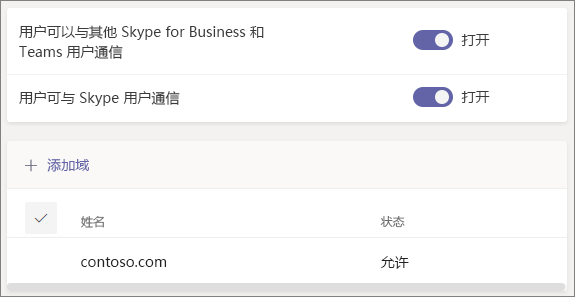

# 使用来宾访问权限和外部访问权限与组织外部的人员进行协作

当需要与组织外部的人员进行通信和协作时，Microsoft Teams 可为你提供两种选择：

- **外部访问** - 一种联盟，允许用户查找其他组织中的人员以及与其通话和聊天。 除非作为来宾受到邀请，否则这些人员无法添加到团队。
- **来宾访问** - 来宾访问允许邀请组织外部人员加入团队。 受邀人员将在 Azure Active Directory 中获得来宾帐户。

请注意，Teams 允许邀请组织外部人员参加会议。 这不需要配置外部或来宾访问。

## 外部访问（联盟）

针对组织外部使用 Teams、Skype for Business（联机或本地）或 Skype 的人员，如果需要查找此类人员、与其通话和聊天以及设置与此类人员的会议，可设置外部访问。 

默认情况下，将针对所有域启用外部访问。 你可以通过允许或阻止特定域或者通过关闭该设置来限制外部访问。

若要配置外部访问，请参阅[管理外部访问](manage-external-access.md)。 

>[!NOTE]
>Microsoft Teams 免费许可证不支持外部访问。

## 来宾访问

使用来宾访问将组织外部人员添加到团队，他们可在其中聊天、通话、开会和协作处理文件。 来宾可以获得几乎与本地团队成员相同的 Teams 功能。

来宾将作为 B2B 用户添加到组织的 Azure Active Directory，且必须使用他们的来宾帐户登录到 Teams。 这意味着，他们可能需要从自己的组织注销才能登录到你的组织。

若要为 Teams 配置来宾访问，请参阅[在团队中与来宾协作](/microsoft-365/solutions/collaborate-as-team)。

## 比较外部访问和来宾访问

下表显示了使用外部访问（联盟）和来宾访问的区别。 在这两种情况下，组织外部人员均被标识为外部用户。

### 你的用户可以进行的一些操作

| 用户可以 | 外部访问用户 | 来宾 |
|---------|-----------------------|--------------------|
| 与其他组织中的人聊天 | 是 | 是 |
| 呼叫其他组织中的人 | 是 | 是 |
| 查看其他组织中的人是否可接受呼叫或聊天 | 是 | 是1 |
| 搜索其他组织中的人员 | 是2 | 否 |
| 共享文件 | 否 | 是 |
| 查看另一个组织中某人外出期间的邮件 | 否 | 是 |
| 组织其他组织中的某个人  | 否 | 是 |
| 使用 @提及 | 是3 | 是 |

### 组织外部的人员可以进行的一些操作

| 组织外部的人员可以 | 外部访问用户 | 来宾 |
|---------|-----------------------|--------------------|
| 访问 Teams 资源 | 否 | 是 |
| 被添加到群聊 | 是 | 是 |
| 受邀加入会议 | 是 | 是 |
| 拨打私人电话 | 是 | 是5 |
| 查看拨入会议参与者的电话号码 | 否4 | 是 |
| 使用 IP 视频 | 是 | 是5 |
| 使用屏幕共享 | 是3 | 是5 |
| 使用立即开会 | 否 | 是5 |
| 编辑已发送的消息 | 是3 | 是5 |
| 删除已发送的消息 | 是3 | 是5 |
| 在对话中使用 Giphy | 是3 | 是5 |
| 在对话中使用 Meme | 是3 | 是5 |
| 在对话中使用贴纸 | 是3 | 是5 |
| 将显示状态 | 是 | 是 |
| 使用 @提及 | 是3 | 是 |

 

1 前提是已将用户添加为来宾，并且对方已使用来宾帐户登录。 
2 仅通过电子邮件或会话初始协议 (SIP) 地址。 
3 支持来自不同组织的仅 Teams 对仅 Teams 用户的一对一聊天。  
4 默认情况下，外部参与者看不到拨入参与者的电话号码。 如果想要保持这些电话号码的隐私，请选择“**进入/退出公告类型**”的“**提示音**”（这会阻止 Teams 读出电话号码）。 若要了解详细信息，请参阅[在 Microsoft Teams 中打开或关闭会议的进入和退出公告](turn-on-or-off-entry-and-exit-announcements-for-meetings-in-teams.md)。  
5 默认允许，但可由 Teams 管理员禁用

## 相关主题

[Teams 中的外部访问](manage-external-access.md)

[Teams 中的来宾访问](guest-access.md)
