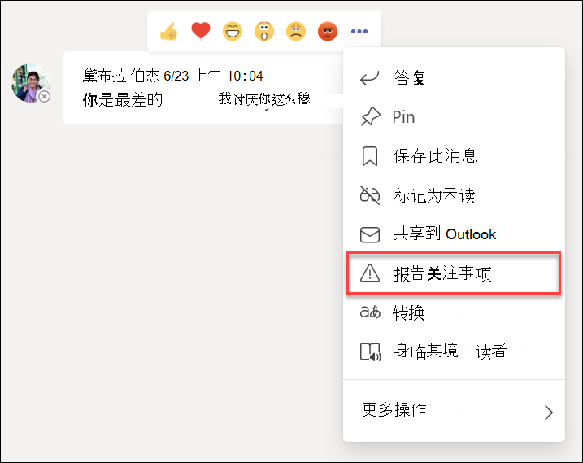
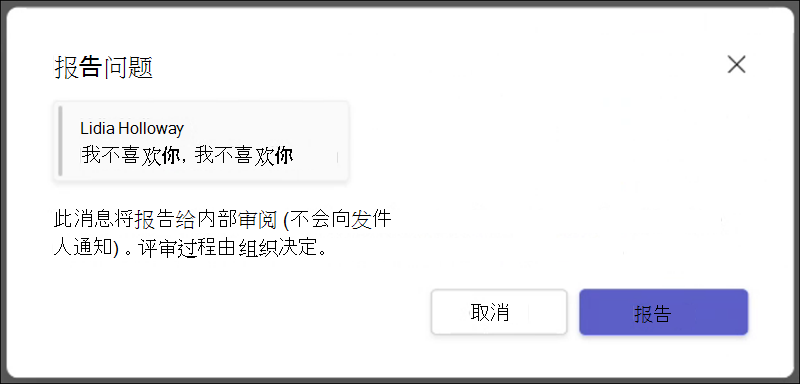

# 与 Microsoft Teams 的通信合规性

Microsoft Purview 通信合规性是 Microsoft 365 中的内部风险解决方案，可帮助你检测、捕获和处理组织中的不当消息，从而最大限度地降低通信风险。

对于 Microsoft Teams，通信合规性有助于识别 Teams 频道、专用 Teams 频道或 1：1 和群聊中的 [以下类型](/microsoft-365/compliance/communication-compliance-feature-reference) 不当内容：

- 冒犯性、亵渎性和骚扰性语言
- 成人、活泼和血腥图像
- 共享敏感信息

有关通信合规性以及如何为组织配置策略的详细信息，请 [参阅了解通信合规性](/microsoft-365/compliance/communication-compliance)。

## 如何在 Microsoft Teams 中使用通信符合性

通信合规性和 Microsoft Teams 紧密集成，有助于最大程度地降低组织中的通信风险。 配置第一个通信符合性策略后，可以主动管理在警报中自动标记的不适当的 Microsoft Teams 消息和内容。

### 入门

Microsoft Teams 中的通信合规性入门首先 [规划](/microsoft-365/compliance/communication-compliance-plan) 和创建预定义或自定义策略，以识别 Teams 频道或 1：1 和组中的不当用户活动。 请记住，需要在配置过程中 [配置](/microsoft-365/compliance/communication-compliance-configure) 一些权限和基本先决条件。

Teams 管理员可以在以下级别配置通信符合性策略：

- **用户级别**：此级别的策略适用于单个 Teams 用户，也可以应用于组织中的所有 Teams 用户。 这些策略涵盖这些用户可能在 1：1 或群聊中发送的消息。 用户的聊天通信会自动监视用户所属的所有 Microsoft Teams。
- **Teams 级别**：此级别的策略适用于 Microsoft Teams 频道，包括专用频道。 这些策略仅涵盖 Teams 频道中发送的消息。

### 在 Microsoft Teams 中报告关注事项

>[!NOTE]
>2022 年 5 月开始为许可和使用 [通信合规性和](/microsoft-365/compliance/communication-compliance-configure#subscriptions-and-licensing) Microsoft Teams 的组织提供用户报告的消息。 此功能将于 2022 年 8 月 31 日前提供给所有获得许可并使用通信合规性的组织，直至 2022 年 7 月。 对于在 2022 年 7 月之后开始使用通信合规性的组织，用户报告的消息策略可用性可能需要从许可之日起最多 30 天，并首次使用通信合规性。

默认情况下，Teams 个人和群组聊天消息的 *“报告关注* ”选项已启用，可以通过 [Teams 管理中心的 Teams](/microsoftteams/manage-teams-in-modern-portal) 消息传递策略进行控制。 这允许组织中的用户提交不适当的内部聊天消息，供通信合规性评审者对策略进行评审。 有关通信合规性中用户报告的消息的详细信息，请参阅 [通信符合性策略](/microsoft-365/compliance/communication-compliance-policies#user-reported-messages-policy)。

提交邮件供审阅后，用户会在 Microsoft Teams 中收到提交结果的确认。 聊天中的其他参与者看不到此通知。

组织中的用户会自动获取全局策略，除非创建并分配自定义策略。 编辑全局策略中的设置，或创建并分配一个或多个自定义策略来打开或关闭此功能。 有关详细信息，请参阅 [Teams 中的“管理消息传递策略](/microsoftteams/messaging-policies-in-teams)”。

### 在 Microsoft Teams 中处理不当消息

配置策略并收到 Microsoft Teams 消息的通信合规性警报后，组织中的合规性审阅者就可以对这些消息采取行动了。 如果为组织启用，这还包括用户报告的消息。 审阅者可以通过查看通信合规性警报并从 Microsoft Teams 中的视图中删除已标记的消息来帮助保护组织。

删除的消息和内容将替换为通知，供查看者解释消息或内容已删除以及哪些策略适用于删除。 删除的消息或内容的发件人也会收到删除状态的通知，并为其删除相关的上下文提供原始消息内容。 发件人还可以查看适用于邮件删除的特定策略条件。

发件人看到的策略提示示例：

发件人看到的策略通知示例：

收件人看到的策略提示示例：

