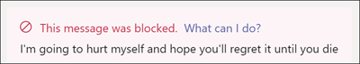

# 与 Microsoft Teams 通信符合性

通信合规性是一种内部风险解决方案，Microsoft 365帮助检测、捕获和操作组织中不适当的邮件，从而最大程度地降低通信风险。

对于Microsoft Teams，通信符合性有助于识别 Teams 通道、专用 Teams 通道或 1：1 和群组聊天中的以下不适当内容类型：

- 冒犯性、亵渎和攻击性语言
- 成人、不性与成人图像
- 共享敏感信息

有关通信符合性以及如何为组织配置策略的信息，请参阅中通信[Microsoft 365。](/microsoft-365/compliance/communication-compliance)

## 如何在 Microsoft Teams 中使用通信符合性

通信合规性Microsoft Teams紧密集成，有助于将组织中通信风险降至最低。 配置第一个通信符合性策略后，可以主动管理Microsoft Teams警报中自动标记的不适宜的邮件和内容。

### 入门

Microsoft Teams通信符合性入门，首先规划和创建预定义或自定义策略，以识别 Teams 通道或 1：1 和组中不适宜的用户活动。 请记住，需要在配置过程中配置一些权限和基本先决条件。

Teams管理员可在以下级别配置通信符合性策略：

- **用户级别**：此级别的策略适用于单个Teams用户，也可以应用于Teams用户。 这些策略涵盖这些用户可以在 1：1 或群组聊天中发送的消息。 用户的聊天通信会在用户作为成员的所有Microsoft Teams自动监视。
- **Teams级别**：此级别的策略适用于Microsoft Teams通道，包括专用通道。 这些策略仅涵盖在 Teams 发送的消息。

### 在邮件中处理不适当的Microsoft Teams

配置策略并收到针对这些邮件的通信Microsoft Teams警报后，组织中的符合性评审者可以针对这些邮件采取措施。 审阅者可以通过查看通信符合性警报和删除邮件视图中的标记邮件来帮助保护Microsoft Teams。

已删除的消息和内容将被替换为通知，供查看者说明邮件或内容已删除以及适用于删除的策略。 已删除邮件或内容的发送者也会收到删除状态通知，并针对与删除相关的上下文提供原始邮件内容。 发送方还可以查看应用于邮件删除的特定策略条件。

发送方看到的策略提示示例：

发件人看到的策略条件通知示例：

收件人看到的策略提示示例：

