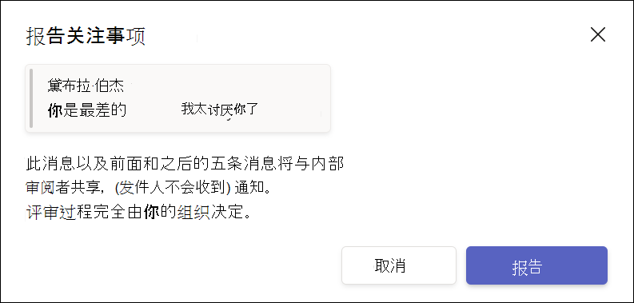
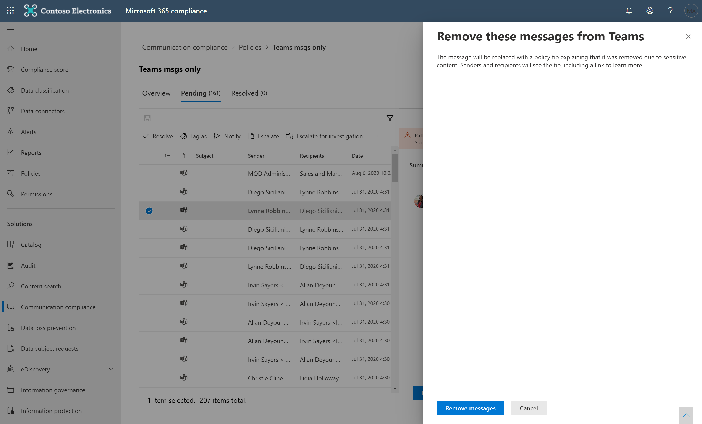

# 与Microsoft Teams的通信合规性

通信合规性是Microsoft 365中的内部风险解决方案，可帮助你检测、捕获和处理组织中的不当消息，从而最大限度地降低通信风险。

对于Microsoft Teams，通信合规性有助于识别Teams频道、专用Teams频道或 1：1 和群聊中的[以下类型](/microsoft-365/compliance/communication-compliance-feature-reference)不当内容：

- 冒犯性、亵渎性和骚扰性语言
- 成人、活泼和血腥图像
- 共享敏感信息

有关通信合规性以及如何为组织配置策略的详细信息，请参阅[Microsoft 365中的通信符合性](/microsoft-365/compliance/communication-compliance)。 有关包含通信合规性的Microsoft 365订阅的信息，请参[阅预览体验成员风险解决方案](/microsoft-365/compliance/insider-risk-solution-overview#communication-compliance)。

## 如何在Microsoft Teams中使用通信符合性

通信合规性和Microsoft Teams紧密集成，有助于最大程度地降低组织中的通信风险。 配置第一个通信合规性策略后，可以主动管理不适当的Microsoft Teams消息和在警报中自动标记的内容。

### 入门

Microsoft Teams中的通信合规性入门始于[规划](/microsoft-365/compliance/communication-compliance-plan)和创建预定义或自定义策略，以识别Teams通道或 1：1 和组中的不适当的用户活动。 请记住，需要在配置过程中 [配置](/microsoft-365/compliance/communication-compliance-configure) 一些权限和基本先决条件。

Teams管理员可以在以下级别配置通信符合性策略：

- **用户级别**：此级别的策略适用于单个Teams用户，也可以应用于组织中的所有Teams用户。 这些策略涵盖这些用户可能在 1：1 或群聊中发送的消息。 用户的聊天通信会自动监视用户所属的所有Microsoft Teams。
- **Teams级别**：此级别的策略适用于Microsoft Teams通道，包括专用频道。 这些策略仅涵盖在Teams通道中发送的消息。

### 报告Microsoft Teams

>[!NOTE]
>从 2022 年 5 月开始，用户报告的消息将开始提供给获得[通信合规性和](/microsoft-365/compliance/communication-compliance-configure#subscriptions-and-licensing)Microsoft Teams许可的组织。 此功能应在 2022 年 8 月 31 日之前适用于所有许可组织。

默认情况下，Teams消息中的"*报告关注*"选项已启用，可以通过Teams [管理中心](/microsoftteams/manage-teams-in-modern-portal)中的Teams消息传送策略进行控制。 这允许组织中的用户提交不适当的消息，供通信合规性评审者对策略进行评审。 有关通信合规性中用户报告的消息的详细信息，请参阅 [通信符合性策略](/microsoft-365/compliance/communication-compliance-policies#user-reported-messages-policy)。

提交邮件以供审阅后，用户会收到Microsoft Teams中提交的确认。 聊天中的其他参与者看不到此通知。

组织中的用户会自动获取全局策略，除非创建并分配自定义策略。 编辑全局策略中的设置，或创建并分配一个或多个自定义策略来打开或关闭此功能。 有关详细信息，请参阅[Teams中的管理消息传送策略](/microsoftteams/messaging-policies-in-teams)。

### 对Microsoft Teams中的不当消息采取行动

配置策略并收到Microsoft Teams消息的通信合规性警报后，组织中的合规性审阅者就可以对这些消息采取行动了。 如果为组织启用，这还包括用户报告的消息。 审阅者可以通过查看通信合规性警报并从Microsoft Teams的视图中删除已标记的消息来帮助保护组织。

删除的消息和内容将替换为通知，供查看者解释消息或内容已删除以及哪些策略适用于删除。 删除的消息或内容的发件人也会收到删除状态的通知，并为其删除相关的上下文提供原始消息内容。 发件人还可以查看适用于邮件删除的特定策略条件。

发件人看到的策略提示示例：

发件人看到的策略通知示例：

收件人看到的策略提示示例：

