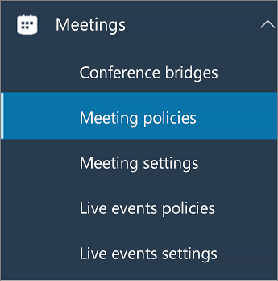

在 Microsoft Teams 中配置桌面共享
============================================

桌面共享让用户可以在会议或聊天过程中呈现屏幕或应用。 管理员可在 Microsoft Teams 中配置屏幕共享，让用户共享整个屏幕、某个应用或文件。 你可以让用户提供或请求控制权、允许 PowerPoint 共享、添加白板以及允许共享笔记。 你还可以配置匿名或外部用户是否可以请求共享屏幕的控制权。 Teams 会议的外部与会者可分为以下几类:

- 匿名用户
- 来宾用户
- B2B 用户
- 联合用户

若要配置屏幕共享，请创建新的会议策略，然后将其分配给要管理的用户。

**在 [Microsoft Teams 管理中心](https://admin.teams.microsoft.com/)**

1. 选择“**会议**” > “**会议策略**”。

    

2. 在"**会议策略"** 页面上，选择"**添加"。**

    

3. 为策略提供唯一的标题，并输入简要说明。

4. 在“**内容共享**”下，从下拉列表中选择一种 **屏幕共享模式**：

   - **整个屏幕** - 让用户共享其整个桌面。
   - **单个应用程序** - 允许用户将屏幕共享限制为单个活动的应用程序。
   - **已禁用** - 关闭屏幕共享。

    

  > [!Note]
  > 你不必启用呼叫策略，用户就可使用聊天中的屏幕共享。 但是，他们的音频将关闭，直到他们自行取消静音。 此外，共享屏幕的用户可以单击" **添加音频"** 以启用音频。 如果呼叫策略被禁用，用户将无法从聊天会话将音频添加到屏幕共享。

5. 打开或关闭以下设置：

    - **允许参与者授予或请求控制权** – 允许团队成员授予或请求控制演示者的桌面或应用程序。
    - **允许外部参与者授予或请求控制权** – 这是按用户的策略。 无论会议组织者设置了什么，组织是否为用户设置了这个功能，都无法控制外部参与者的行为。 该参数控制是否可以让外部参与者控制或请求控制共享者的屏幕，这取决于共享者在其组织的会议策略中设置的内容。
    - **允许 PowerPoint 共享** - 允许用户创建可上传和共享 PowerPoint 演示文稿的会议。
    - **允许白板** - 允许用户共享白板。
    - **允许共享笔记** - 允许用户记录共享笔记。

6. 单击“**保存**”。

## 使用 PowerShell 配置共享桌面

你还可以使用 [Set-CsTeamsMeetingPolicy](/powershell/module/skype/set-csteamsmeetingpolicy?view=skype-ps) cmdlet 来控制桌面共享。 设置以下参数：

- Description
- ScreenSharingMode
- AllowPrivateCalling
- AllowParticipantGiveRequestControl
- AllowExternalParticipantGiveRequestControl
- AllowPowerPointSharing
- AllowWhiteboard
- AllowSharedNotes

[了解有关使用 csTeamsMeetingPolicy cmdlet 的详细信息](/powershell/module/skype/set-csteamsmeetingpolicy?view=skype-ps)。