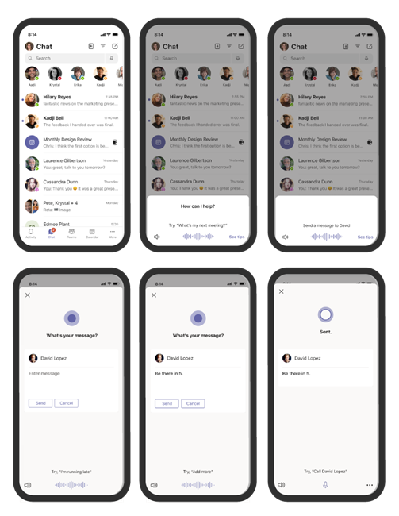

# <a name="cortana-voice-assistance-in-teams"></a>Cortana语音帮助Teams

> [!Note]
> Cortana iOS 和 Android 的 Microsoft Teams 移动应用以及适用于美国、英国、加拿大、印度和澳大利亚的用户的 Microsoft Teams 移动应用中支持语音协助。 Microsoft Teams 会议室 Windows区域设置设置为 en-us 的设备支持本地设置。 Cortana EDU 租户目前GCC、GCC-High、DoD 和非 US EDU 租户提供语音协助。 Cortana EDU 客户Teams移动应用中的语音帮助。 在将来的版本中，将扩展到其他语言和地区。


Cortana Teams 移动应用、Windows 上的 Microsoft Teams 会议室 和 Microsoft Teams 显示设备上提供语音协助，Microsoft 365 企业版 用户可以使用 简化通信、协作和会议相关任务口语自然语言。 用户可以通过Cortana Teams 移动应用右上角的麦克风按钮，或者通过在 Microsoft Teams 会议室中说出 &#8220;Cortana&#8221; 或者使用 Microsoft Teams 显示器来与 Microsoft Teams 讲话。 要免费与团队快速联系，用户可以说查询，例如 &#8220;呼叫 Megan&#8221; 或 &#8220;将消息发送到我的下一&#8221;。 用户还可以加入会议，&#8220;加入我的下一&#8221;，并使用语音协助共享文件、查看其日历等。 这些语音协助体验是使用[Cortana](/microsoft-365/admin/misc/cortana-integration?view=o365-worldwide)企业级服务提供的，这些服务完全符合 Office 365 的隐私、安全性和合规性承诺，如在线服务条款[ (OST ](https://www.microsoft.com/licensing/product-licensing/products?rtc=1)) 所反映。

## <a name="admin-control-and-limitations"></a>管理员控制和限制

Cortana中Teams语音帮助是使用完全符合 Office 365 企业级隐私、安全性和合规性承诺的服务提供的，如在线服务条款 (OST) 。 默认情况下，将为租户启用该功能。

租户管理员可以使用 TeamsCortanaPolicy Cortana策略控制Teams租户中的 (语音) 。 此策略在用户帐户级别或租户级别设置。 管理员可以使用此策略控件中的 CortanaVoiceInvocationMode 字段来确定是禁用了 Cortana、仅通过推送按钮调用启用，还是启用了唤醒词调用 (并且 (适用于支持它的设备，如 Microsoft Teams) 。

管理员可以使用以下 PowerShell cmdlet 来管理此策略 (该策略当前在 Microsoft Teams 管理中心) 。

- [New-CsTeamsCortanaPolicy](/powershell/module/skype/New-CsTeamsCortanaPolicy)

- [Get-CsTeamsCortanaPolicy](/powershell/module/skype/Get-CsTeamsCortanaPolicy)

- [Grant-CsTeamsCortanaPolicy](/powershell/module/skype/Grant-CsTeamsCortanaPolicy)

- [Set-CsTeamsCortanaPolicy](/powershell/module/skype/Set-CsTeamsCortanaPolicy)

- [Remove-CsTeamsCortanaPolicy](/powershell/module/skype/Remove-CsTeamsCortanaPolicy)

例如，以下命令将创建一个名称为 &#8220;EmployeeCortanaPolicy&#8221;的策略，Cortana禁用 Microsoft Teams 语音帮助。  

```PowerShell
PS C:\> New-CsTeamsCortanaPolicy -Identity EmployeeCortanaPolicy -CortanaVoiceInvocationMode Disabled
```

此示例演示了使用 EmployeeCortanaPolicy &#8220;更新现有策略&#8221;并仅在Cortana按钮调用Microsoft Teams启用语音帮助。 用户将能够通过在 Cortana 中选择"Cortana麦克风"按钮来Teams。 唤醒词 (&#8220;你好Cortana&#8221;或&#8220;Cortana&#8221;) 调用将被禁用。  

```PowerShell
PS C:\> Set-CsTeamsCortanaPolicy -Identity EmployeeCortanaPolicy -CortanaVoiceInvocationMode PushToTalkUserOverride
```

此示例演示了更新策略，并Cortana按钮和唤醒词调用启用语音帮助。

```PowerShell
PS C:\> Set-CsTeamsCortanaPolicy -Identity EmployeeCortanaPolicy -CortanaVoiceInvocationMode WakeWordPushToTalkUserOverride
```

在最初发布时，Microsoft 365 企业版美国用户使用英语，以下是可用的函数：

- Teams移动应用不支持唤醒词激活，但将来会支持。  

- Microsoft Teams 会议室屏幕Windows Microsoft Teams将支持唤醒词激活。

## <a name="user-control"></a>用户控件

单个用户可以尝试Cortana设备提供语音帮助：

- 选择移动应用中的麦克风Teams按钮。

- 选择麦克风按钮或在麦克风Cortana说"Microsoft Teams 会议室。

- 在显示器Cortana说"Microsoft Teams"。

通过使用设备中的Cortana Teams，可以控制设备是否已启用设备内设置。



### <a name="microsoft-teams-rooms-on-windows"></a>Microsoft Teams 会议室上Windows

只有在租户级别启用了Cortana，才能在设备级别进行更改。 

在设备级别，可以配置Cortana两种不同方式使用的设备。 可以同时启用任一选项或同时启用两个选项： 
- 通过点击麦克风，该麦克风Cortana _推送以说话_
- 通过说"你好，Cortana"，Cortana _语音激活_

Cortana _设置为使用_ 区域设置，则默认情况下会启用"推送到交谈"功能。 [了解更多信息。](/MicrosoftTeams/rooms/console#to-apply-your-desired-language)  Cortana图标将取代"更多..."下的 _"呈现__"按钮。_ "会议室Teams菜单。 若要禁用Cortana使用 PowerShell _进行_ 推送。[了解更多。](/powershell/module/skype/new-csteamscortanapolicy?view=skype-ps#example-1)

若要启用Cortana _激活_，必须满足以下条件：
- Cortana认证的设备必须连接到 Teams 会议室。 可以在本文末尾找到已认证设备的列表。
- Teams会议室必须设置为使用区域设置 en-us。 以后会提供更多语言。
- 必须做出以下配置更改之一：
  - 在管理中心打开Teams[了解更多信息。](/microsoftteams/rooms/rooms-manage)
  - 将以下 XML 属性添加到 SkypeSettings XML 文件：
```xml
<SkypeSettings>  
        <CortanaWakewordEnabled>true</CortanaWakewordEnabled>  
</SkypeSettings> 
```
在会议级别，只有在设备级别启用了Cortana _激活_ 时，才能进行更改。  若要在Cortana启用语音激活，请移动开关 **"打开**"或 **"关闭"** 以禁用。 会议结束后，Cortana设备级别设置集。


如果在设备级别启用了Cortana，可在会议级别进行更改。

若要在 _Cortana启用语音_ 激活，请移动开关"**开"或**"**关"。** 会议结束后，Cortana设备级别设置集。


## <a name="cortana-certified-devices-for-teams-rooms"></a>Cortana认证设备Teams 会议室
Cortana _Lenovo_ 中心 500 或其中任何设备连接到会议室，可以启用语音激活：
- Jabra Panacast 50 
- 力举麦克风
- Bose 视频栏 VB1 __
