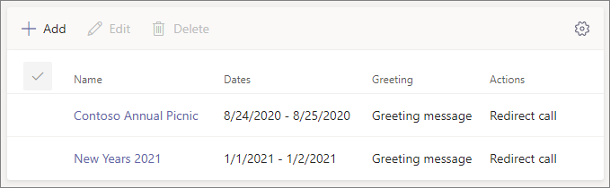

# 设置自动助理

自动助理允许用户呼叫你的组织并导航菜单系统，以便与正确的部门、呼叫队列、人员或操作员交谈。 可以使用Microsoft Teams管理中心或 PowerShell 为组织创建自动助理。

> [!TIP]
> 本文适用于大型组织。 如果你的组织是小型企业，请改为阅读“[设置自动助理- 小型企业教程](/microsoftteams/business-voice/create-a-phone-system-auto-attendant-smb)。

请务必阅读[Teams自动助理和呼叫队列的计划](plan-auto-attendant-call-queue.md)，并遵循[入门步骤](plan-auto-attendant-call-queue.md#getting-started)，然后再按照本文中的过程操作。

自动助理可以根据呼叫者的输入将呼叫定向到以下目标之一： 

- **运算符** - 为自动助理定义的运算符。 定义运算符是可选的。 可将运算符定义为此列表中的任何其他目标。
- **组织中的人员** - 组织中可以接收语音呼叫的人员。 此人可以是使用Skype for Business Server在本地托管的联机用户或用户。
- **语音应用** - 另一个自动助理或呼叫队列。  (选择此目标时与自动助理或呼叫队列关联的资源帐户。) 
- **语音邮件** - 与指定的Microsoft 365组关联的语音邮箱。 可以选择是否需要语音邮件听录和“请在音调后留下邮件”。 系统提示。
- **外部电话号码** - 任何电话号码。  (请参阅 [外部传输技术详细信息](create-a-phone-system-auto-attendant.md#external-phone-number-transfers---technical-details)) 。
- **通知 (音频文件)** - 播放音频文件。 上传的已录制公告消息，保存为音频。WAV、.MP3或 .WMA 格式。 录制内容不得大于 5 MB。 系统播放公告，然后返回到自动助理菜单。
- **公告 (键入)** - 键入消息。 希望系统读取的文本。 最多可以输入 1000 个字符。 系统播放公告，然后返回到自动助理菜单。

设置自动助理时，系统会提示你在不同阶段选择其中一个选项。

若要设置自动助理，请在Teams管理中心展开 **“语音**”，选择 **“自动助理**”，然后选择 **“添加**”。

## 视频演示

此视频演示如何在Teams中创建自动助理的基本示例。

> [!VIDEO https://www.microsoft.com/videoplayer/embed/RWEnCG?autoplay=false]

## 常规信息

1. 在顶部框中键入自动助理的名称。

2. 若要指定运算符，请指定调用运算符的目标。 此指定是可选 (但建议) 。 设置 **“操作员** ”选项以允许调用方从菜单中分离出来并与指定人员交谈。

3. 指定此自动助理的时区。 如果在 [下班后创建单独的呼叫流](#call-flow-for-after-hours)，则时区用于计算工作时间。

4. 为此自动助理指定[受支持的语言](create-a-phone-system-auto-attendant-languages.md)。 这是将用于系统生成的语音提示的语言。

5. 选择是否要启用语音输入。 启用后，每个菜单选项的名称将成为语音识别关键字。 例如，调用方可以说“One”来选择映射到键 1 的菜单选项，也可以说“Sales”以选择名为“Sales”的菜单选项。

   > [!NOTE]
   > 如果在步骤 4 中选择不支持语音输入的语言，将禁用此选项。

6. 选择 **“下一步**”。

## 呼叫流

选择是否要在自动助理接听电话时播放问候语。

如果选择 **“播放音频文件**”，则可以使用 **Upload文件** 按钮上传保存为音频的录制问候消息。WAV、.MP3或 .WMA 格式。 录制内容不得大于 5 MB。

如果选择 **“键入问候语”消息**，系统会在自动助理接听呼叫时读取 (最多 1000 个字符) 键入的文本。

选择要路由呼叫的路由方式。

如果选择 **“断开连接**”，则自动助理将挂起呼叫。

如果选择 **“重定向呼叫**”，则可以选择其中一个呼叫路由目标。

如果选择 **“播放”菜单选项**，可以选择在 **问候消息中****播放音频文件** 或键入，然后在菜单选项和目录搜索之间进行选择。

### 菜单选项

对于拨号选项，请将电话键盘上的 0-9 个密钥分配给某个呼叫路由目标。  ( (星号) 和\# (磅) 的键\*由系统保留，无法重新分配。 按下其中任一键将重复当前菜单。) 

> [!NOTE]
> # 键仅备份到最新的自动助理。 将边界交叉到新自动助理后，#键将无法将你带到上一个。

密钥映射不必是连续的。 可以创建一个菜单，其中键 0、1 和 3 映射到选项，而不使用数字 2 键。

如果已配置零键，建议将零键映射到运算符。 如果未将运算符设置为任何键，语音命令“运算符”也会被禁用。

对于每个菜单选项，请指定以下设置：

- **拨号密钥** - 用于访问此选项的电话键盘上的密钥。 如果语音输入可用，调用方还可以说出此号码以访问该选项。

- **语音命令** - 定义调用方可以提供用于访问此选项的语音命令（如果启用了语音输入）。 它可以包含多个单词，如“客户服务”或“操作和地面”。 例如，调用方可以按 2、说“two”或说“Sales”来选择映射到两个键的选项。 此文本还通过文本呈现为服务确认提示的语音，可能类似于“将呼叫转接到销售”。

- **重定向到** - 调用方选择此选项时使用的呼叫路由目标。 如果重定向到自动助理或呼叫队列，请选择与之关联的资源帐户。

### 目录搜索

如果将拨号键分配到目标，建议选择 **“无****”进行目录搜索**。 如果调用方尝试使用分配给特定目标的密钥拨号或扩展名，则在输入完名称或扩展名之前，可能会意外地将其路由到目标。 我们建议为目录搜索创建单独的自动助理，并使用拨号键将主自动助理链接到它。

如果未分配拨号键，请选择一个用于 **目录搜索的** 选项。

**按名称拨号** - 如果启用此选项，呼叫者可以说出用户的姓名或在电话键盘上键入该名称。 使用Skype for Business Server在本地托管的任何联机用户或任何用户都是符合条件的用户，并且可以使用“按名称拨号”找到。  (可以设置“ [拨号](#dial-scope) 范围”页上的目录中的人员和未包含在其中的人员。) 

**按扩展电话拨号** - 如果启用此选项，呼叫者可以通过拨打其电话扩展名与组织中的用户进行连接。 使用 Skype for Business Server 在本地托管的任何联机用户或任何用户都是符合条件的用户，并且可以 **使用“按扩展拨号”** 找到。  (可以设置“ [拨号](#dial-scope) 范围”页上的目录中的人员和未包含在其中的人员。) 

要用于 Dial By Extension 的用户需要将扩展指定为 Active Directory (中定义的以下电话属性之一，并通过 Azure AD 连接) 或Azure Active Directory进行同步。  (有关详细信息，请参阅 [单独或批量添加用户](/microsoft-365/admin/add-users/add-users) 。) 

- OfficePhone/PhoneNumber (AD 和 Azure AD) 
- HomePhone (AD) 
- Mobile/MobilePhone (AD 和 Azure AD) 
- OtherTelephone (AD) 

在用户电话号码字段中输入扩展所需的格式可以是以下格式之一：

- *+\<phone number>;ext=\<extension>*
- *+\<phone number>X\<extension>*
- *X\<extension>*

- 示例 1：Set-MsolUser -UserPrincipalName usern@domain.com -Phonenumber “+15555555678;ext=5678”
- 示例 2：Set-MsolUser -UserPrincipalName usern@domain.com -Phonenumber “+1555555678x5678”
- 示例 3：Set-MsolUser -UserPrincipalName usern@domain.com -Phonenumber “x5678”

可以在[Microsoft 365 管理中心](https://admin.microsoft.com/)或[Azure Active Directory管理中心](https://aad.portal.azure.com)设置扩展。 最多可能需要 12 小时才能向自动助理和呼叫队列提供更改。

> [!NOTE]
> 如果想要同时使用 **“按名称拨号**”和 **“按扩展拨号**”功能，可以在主自动助理上分配一个拨号密钥，以访问为 **“按名称拨号**”启用的自动助理。 在该自动助理中，可以分配 1 个密钥 (，该密钥没有与之关联的字母，) 到达 **“按扩展拨号**”自动助理。

有关详细信息，请参阅 [拨号和语音参考](dial-voice-reference.md) 。

选择 **目录搜索** 选项后，选择 **“下一步**”。

## 下班后的呼叫流

可以为每个自动助理设置营业时间。 如果没有设置营业时间，所有日期以及每天的所有时间均视为营业时间，因为默认情况下设置为全天候时间表。 工作时间可以设置为白天的休息时间，而未设置为营业时间的所有工作时间都被视为下班后。 你可以为下班后设置不同的传入呼叫处理选项和问候语。

根据你如何配置自动助理和呼叫队列，你可能只需要为具有直接电话号码的自动助理指定下班后呼叫路由。

如果希望对下班后呼叫者进行单独的呼叫路由，请指定每天的工作时间。 选择 **“添加新时间** ”以指定给定一天的多个小时数集，例如，指定午休时间。

指定工作时间后，选择下班后的呼叫路由选项。 与上面指定的工作时间呼叫路由相同。

完成后选择 **“下一步** ”。

## 节假日期间的呼叫流

你的自动助理可以为你[设置的每个假日](set-up-holidays-in-teams.md)都有一个呼叫流。 可以为每个自动助理添加最多 20 个计划假日。

1. 在“假日呼叫设置”页上，选择 **“添加**”。

2. 键入此假日设置的名称。

3. 从 **“假日** ”下拉列表中，选择要使用的假期。

4. 选择要使用的问候语类型。

    

5. 选择是否要 **断开连接**、 **重定向** 或 **播放菜单选项**。

6. 如果选择重定向，请选择呼叫的呼叫路由目标。

7. 如果选择播放菜单选项，请配置 [菜单选项](#menu-options)。

8. 选择“**保存**”。

在每个额外的假期中根据需要重复此过程。

添加所有假期后，选择 **“下一步**”。

## 拨号范围

拨 *号范围* 定义当调用方使用按名称拨号或按扩展拨号时，哪些用户可在目录中使用。 **所有联机用户** 的默认值包括组织中使用 Skype for Business Server 的联机用户或托管在本地的所有用户。

可以通过选择“**包括** 或 **排除**”下的 **自定义用户组** 并选择一个或多个Microsoft 365组、通讯组列表或安全组来包括或排除特定用户。 例如，你可能希望从拨号目录中排除组织中的高管。  (如果用户在这两个列表中，则将从目录中排除它们。) 

> [!NOTE]
> 新用户在目录中列出其名称可能需要长达 36 小时。

设置完拨号范围后，选择 **“下一步**”。

## 资源帐户

所有自动助理都必须具有关联的资源帐户。  一级自动助理将需要至少一个具有关联服务号的资源帐户。 如果需要，可以将多个资源帐户分配给一个自动助理，每个帐户都有一个单独的服务编号。

若要添加资源帐户，请选择 **“添加帐户** ”并搜索要添加的帐户。 选择 **“添加**”，然后选择 **“添加**”。

添加完资源帐户后，选择 **“提交**”以完成自动助理配置。

有关详细信息，请参阅[“管理Teams资源帐户](manage-resource-accounts.md)”。

## 外部电话号码传输 - 技术详细信息

请参阅 [先决条件](plan-auto-attendant-call-queue.md#prerequisites) ，以允许自动助理在外部传输呼叫。  另外：

- 对于具有[通话套餐许可证](calling-plans-for-office-365.md)或[运营商连接](operator-connect-plan.md)号码的资源帐户，必须以 E.164 格式输入外部传输电话号码 (+[国家/地区代码][地区代码][电话号码]) 。

- 对于具有Microsoft Teams 电话许可证和直接路由联机语音路由策略的资源帐户，外部传输电话号码格式取决于[会话边界控制器 (SBC) ](direct-routing-connect-the-sbc.md)设置。

显示的出站电话号码按如下所示确定：

  - 对于呼叫计划和运营商连接号码，将显示原始呼叫者的电话号码。
  - 对于直接路由号码，发送的数字基于 SBC 上的 P-Asserted-Identity (PAI) 设置，如下所示：
    - 如果设置为“已禁用”，则显示原始呼叫者的电话号码。 这是默认和建议的设置。
    - 如果设置为“已启用”，则会显示资源帐户电话号码。

在Skype for Business混合环境中，若要将自动助理调用传输到 PSTN，请创建新的本地用户，并将呼叫转发设置为 PSTN 号码。 必须为用户启用企业语音并分配语音策略。 若要了解详细信息，请参阅 [自动助理呼叫传输到 PSTN](/SkypeForBusiness/plan/exchange-unified-messaging-online-migration-support#auto-attendant-call-transfer-to-pstn)。

## 自动助理 cmdlet

Windows PowerShell允许你通过命令行以批处理或编程方式创建和管理自动助理。

使用以下 cmdlet 可以管理自动助理：

- [New-CsAutoAttendant](/powershell/module/skype/new-csautoattendant)  
- [Get-CsAutoAttendant](/powershell/module/skype/get-csautoattendant)
- [Set-CsAutoAttendant](/powershell/module/skype/set-csautoattendant)
- [Update-CsAutoAttendant](/powershell/module/skype/update-csautoattendant)
- [Remove-CsAutoAttendant](/powershell/module/skype/remove-csautoattendant)
- [New-CsOnlineTimeRange](/powershell/module/skype/new-csonlinetimerange)
- [New-CsOnlineDateTimeRange](/powershell/module/skype/new-csonlinedatetimerange)
- [New-CsOnlineSchedule](/powershell/module/skype/New-CsOnlineSchedule)
- [Get-CsAutoAttendantHolidays](/powershell/module/skype/get-csautoattendantholidays)
- [Import-CsAutoAttendantHolidays](/powershell/module/skype/import-csautoattendantholidays)
- [Export-CsAutoAttendantHolidays](/powershell/module/skype/export-csautoattendantholidays)
- [New-CsAutoAttendantDialScope](/powershell/module/skype/New-CsAutoAttendantDialScope)
- [New-CsAutoAttendantPrompt](/powershell/module/skype/New-CsAutoAttendantPrompt)
- [New-CsAutoAttendantCallableEntity](/powershell/module/skype/New-CsAutoAttendantCallableEntity)
- [New-CsAutoAttendantMenuOption](/powershell/module/skype/New-CsAutoAttendantMenuOption)
- [New-CsAutoAttendantMenu](/powershell/module/skype/new-csautoattendantmenu)
- [New-CsAutoAttendantCallFlow](/powershell/module/skype/New-CsAutoAttendantCallFlow)
- [New-CsAutoAttendantCallHandlingAssociation](/powershell/module/skype/New-CsAutoAttendantCallHandlingAssociation)
- [Get-CsAutoAttendantStatus](/powershell/module/skype/Get-CsAutoAttendantStatus)
- [Get-CsAutoAttendantTenantInformation](/powershell/module/skype/Get-CsAutoAttendantTenantInformation)

还需要以下附加 cmdlet 来管理将用于呼叫队列的用户、资源帐户、Microsoft Teams 电话许可证、电话号码、音频文件和支持的语言：

用户/Teams

- 用户
- - [Get-CsOnlineUser](/powershell/module/skype/Get-CsOnlineUser)

- Teams： 
- - [Get-Team](/powershell/module/teams/Get-Team)

资源帐户：

- [New-CsOnlineApplicationInstance](/powershell/module/skype/New-CsOnlineApplicationInstance)
- [Find-CsOnlineApplicationInstance](/powershell/module/skype/Find-CsOnlineApplicationInstance)
- [Get-CsOnlineApplicationInstance](/powershell/module/skype/Get-CsOnlineApplicationInstance)
- [Set-CsOnlineApplicationInstance](/powershell/module/skype/Set-CsOnlineApplicationInstance)
- [New-CsOnlineApplicationInstanceAssociation](/powershell/module/skype/New-CsOnlineApplicationInstanceAssociation)
- [Get-CsOnlineApplicationInstanceAssociation](/powershell/module/skype/Get-CsOnlineApplicationInstanceAssociation)
- [Remove-CsOnlineApplicationInstanceAssociation](/powershell/module/skype/Remove-CsOnlineApplicationInstanceAssociation)
- [Get-CsOnlineApplicationInstanceAssociationStatus](/powershell/module/skype/Get-CsOnlineApplicationInstanceAssociationStatus)

虚拟Teams 电话许可证：

- [Get-MsolAccountSku](/powershell/module/msonline/get-msolaccountsku)
- [Set-MsolUserLicense](/powershell/module/msonline/set-msoluserlicense)

电话数字分配：

- [Get-CsOnlineTelephoneNumber](/powershell/module/skype/Get-CsOnlineTelephoneNumber)
- [Set-CsPhoneNumberAssignment](/powershell/module/teams/Set-CsPhoneNumberAssignment)

音频文件

- [Get-CsOnlineAudioFile](/powershell/module/skype/Get-CsOnlineAudioFile)
- [Import-CsOnlineAudioFile](/powershell/module/skype/Import-CsOnlineAudioFile)
- [Export-CsOnlineAudioFile](/powershell/module/skype/Export-CsOnlineAudioFile)
- [Remove-CsOnlineAudioFile](/powershell/module/skype/Remove-CsOnlineAudioFile)

支持语言和时区

- [Get-CsAutoAttendantSupportedLanguage](/powershell/module/skype/Get-CsAutoAttendantSupportedLanguage)
- [Get-CsAutoAttendantSupportedTimeZone](/powershell/module/skype/Get-CsAutoAttendantSupportedTimeZone)

有关使用 PowerShell 创建自动助理的分步指南，请参阅使用 [PowerShell cmdlet 创建自动助理](create-a-phone-system-auto-attendant-via-cmdlets.md)

## 自动助理诊断工具

如果你是管理员，则可以使用以下诊断工具来验证自动助理是否能够接收呼叫：

1. 选择下面 **运行测试**，这将在 Microsoft 365 管理中心中弹出诊断结果。 

   > [!div class="nextstepaction"]
   > [运行测试：Teams自动助理](https://aka.ms/TeamsAADiag)

2. 在“运行诊断”窗格中，在 **“用户名”或“电子邮件** ”字段中输入资源帐户，然后选择 **“运行测试**”。

3. 测试将标识阻止自动助理接听呼叫的租户、策略或资源帐户配置，并提供解决标识的任何问题的步骤。

## 相关主题

[下面是Teams 电话](./here-s-what-you-get-with-phone-system.md)

[获取服务电话号码](./getting-service-phone-numbers.md)

[音频会议和通话套餐的国家/地区可用性](./country-and-region-availability-for-audio-conferencing-and-calling-plans/country-and-region-availability-for-audio-conferencing-and-calling-plans.md)

[Windows PowerShell 和 Skype for Business Online 简介](/SkypeForBusiness/set-up-your-computer-for-windows-powershell/set-up-your-computer-for-windows-powershell)
