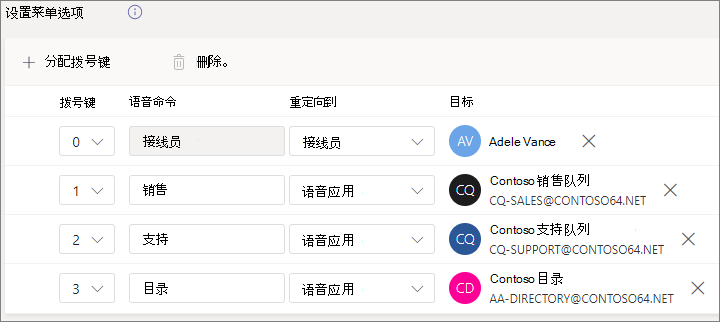

# 设置自动助理Set up an auto attendant

自动助理允许用户呼叫你的组织，并导航菜单系统以与右部门通话、呼叫队列、人员或操作员。Auto attendants let people call your organization and navigate a menu system to speak to the right department, call queue, person, or an operator. 你可以通过 Microsoft 团队管理中心或通过 PowerShell 为你的组织创建自动助理。You can create auto attendants for your organization with the Microsoft Teams admin center, or with PowerShell. 

请确保你拥有 [团队自动助理和呼叫队列](plan-auto-attendant-call-queue.md) 的阅读计划，然后按照本文中的步骤操作，然后按照 [入门步骤](plan-auto-attendant-call-queue.md#getting-started) 操作。Be sure you have read [Plan for Teams auto attendants and call queues](plan-auto-attendant-call-queue.md) and followed the [getting started steps](plan-auto-attendant-call-queue.md#getting-started) before you follow the procedures in this article.

自动助理可根据呼叫者的输入将呼叫定向到以下目的地之一： Auto attendants can direct calls, based on callers' input, to one of the following destinations: 

- **组织中的人员** -您的组织中能够接收语音呼叫的人员。**Person in the organization** - a person in your organization who is able to receive voice calls. 这可以是联机用户，也可以是使用 Skype for Business 服务器内部托管的用户。This can be an online user or a user hosted on-premises using Skype for Business Server.
- **语音应用** -另一个自动助理或呼叫队列。**Voice app** - another auto attendant or a call queue.  (选择 "选择此目标时与自动助理或呼叫队列相关联的资源帐户"。 ) (Choose the resource account associated with the auto attendant or call queue when choosing this destination.)
- **外部电话号码** -任何电话号码。**External phone number** - any phone number.  (参阅 [外部转接技术详细信息](create-a-phone-system-auto-attendant.md#external-phone-number-transfers---technical-details)) 。(See [external transfer technical details](create-a-phone-system-auto-attendant.md#external-phone-number-transfers---technical-details)).
- **语音邮件** -与你指定的 Microsoft 365 组相关联的语音邮箱。**Voicemail** - the voice mailbox associated with a Microsoft 365 group that you specify.
- **Operator** -为自动助理定义的操作员。**Operator** - the operator defined for the auto attendant. 定义运算符是可选的。Defining an operator is optional. 操作员可以定义为此列表中的任何其他目标。The operator can be defined as any of the other destinations in this list.

设置自动助理时，系统会提示你在各个阶段选择其中一个选项。You'll be prompted to choose one of these options at various stages as you set up an auto attendant.

若要设置自动助理，请在 "团队管理中心" 中，展开 " **语音** "，单击 " **自动助理** "，然后单击 " **添加** "。To set up an auto attendant, in the Teams admin center, expand **Voice** , click **Auto attendants** , and then click **Add** .

## 常规信息General info

1. 在顶部的框中键入自动助理的名称。Type a name for the auto attendant in the box at the top.

2. 如果要指定一个运算符，请指定调用该操作员的目标。If you want to designate an operator, specify the destination for calls to the operator. 这是可选的 (但建议) 。This is optional (but recommended). 你可以将 " **操作员** " 选项设置为允许呼叫者跳出菜单，并向指定的人讲话。You can set the **Operator** option to allow callers to break out of the menus and speak to a designated person.

3. 指定此自动助理的时区。Specify the time zone for this auto attendant. 如果您在 [下班后创建单独的通话流](#call-flow-for-after-hours)，则会使用时区计算营业时间。The time zone is used for calculating business hours if you [create a separate call flow for after hours](#call-flow-for-after-hours).

4. 指定此自动助理的语言。Specify a language for this auto attendant. 此语言将用于系统生成的语音提示。This the language that will be used for system-generated voice prompts.

5. 选择是否要启用语音输入。Choose if you want to enable voice inputs. 启用后，每个菜单选项的名称将变为语音识别关键字。When enabled, the name of every menu option becomes a speech-recognition keyword. 例如，呼叫者可以说 "One" 以选择映射到键1的菜单选项，或者说 "销售额" 以选择名为 "Sales" 的菜单选项。For example, callers can say "One" to select the menu option mapped to key 1, or they can say "Sales" to select the menu option named "Sales."

6. 单击" **下一步** "。Click **Next** .

## 通话流Call flow

选择在自动助理接听呼叫时是否要播放问候语。Choose if you want to play a greeting when the auto attendant answers a call.

如果选择 " **播放音频文件** "，你可以使用 " **上传文件** " 按钮上载另存为音频的录制问候语消息。WAV，。MP3 或。WMA 格式。If you select **Play an audio file** you can use the **Upload file** button to upload a recorded greeting message saved as audio in .WAV, .MP3, or .WMA format. 录制内容不能大于 5 MB。The recording can be no larger than 5 MB.

如果选择 " **键入问候语** "，系统将在自动助理接听呼叫时，读取您键入的文本 (最多为1000个字符的文本) 。If you select **Type a greeting message** the system will read the text you the text that you type (up to 1000 characters) when the auto attendant answers a call.

选择您希望路由呼叫的方式。Choose how you want to route the call.

如果您选择 " **断开连接** "，自动助理将挂起呼叫。If you select **Disconnect** , the auto attendant will hang up the call.

如果选择 " **重定向呼叫** "，则可以选择其中一个呼叫传送目的地。If you select **Redirect call** , you can choose one of the call routing destinations.

如果选择 " **播放菜单" 选项** ，则可以选择 **播放音频文件** 或 **键入问候语** ，然后在菜单选项和目录搜索之间进行选择。If you select **Play menu options** , you can choose to **Play an audio file** or **Type in a greeting message** and then choose between menu options and directory search.

### 菜单选项Menu options

对于拨号选项，您可以将电话键盘上的0-9 键分配给其中一个呼叫传送目的地。For dialing options, you can assign the 0-9 keys on the telephone keypad to one of the call routing destinations.  (键 \* (重复) ， \# (后) 由系统保留，并且不能重新分配。 ) (The keys \* (Repeat) and \# (Back) are reserved by the system and can't be reassigned.)

键映射不必是连续的。Key mappings don't have to be continuous. 例如，可以创建一个映射到选项的键为0、1和3的菜单，而不使用2键。It is possible, for example, to create a menu with keys 0, 1, and 3 mapped to options, while the 2 key isn't used.

如果已配置，我们建议将0键映射到操作员。We recommend mapping the 0 key to the operator if you have configured one. 如果运算符未设置为任何键，则语音命令 "Operator" 也会被禁用。If the operator isn't set to any key, the voice command "Operator" is also disabled. 

对于每个菜单选项，请指定以下内容：For each menu option, specify the following:

- " **拨号键** "-电话键盘上的键以访问此选项。**Dial key** - the key on the telephone keypad to access this option. 如果语音输入可用，呼叫方还可以使用此号码访问该选项。If voice inputs are available, callers can also say this number to access the option.

- **语音命令** -定义当语音输入已启用时，呼叫者可以提供的语音命令来访问此选项。**Voice command** - defines the voice command that a caller can give to access this option, if voice inputs are enabled. 它可以包含多个词语，如 "客户服务" 或 "操作和用户"。It can contain multiple words like "Customer Service" or "Operations and Grounds." 例如，呼叫者可以按2、说出 "二" 或说 "销售额" 以选择映射到2键的选项。For example, the caller can press 2, say "two," or say "Sales" to select the option mapped to the 2 key. 此文本还会由用于服务确认提示的文本（如 "将您的呼叫转移到销售人员"）呈现为语音。This text is also rendered by text to speech for the service confirmation prompt, which might be something like "Transferring your call to sales."

- **重定向至** -呼叫路由目标，当呼叫方选择此选项时使用。**Redirect to** - the call routing destination used when callers choose this option. 如果要重定向到自动助理或呼叫队列，请选择与其关联的资源帐户。If you are redirecting to an auto attendant or call queue, choose the resource account associated with it.

### 目录搜索Directory search

如果为目的地分配了拨号键，我们建议您选择 " **无** " 进行 **目录搜索** 。If you assign dial keys to destinations, we recommend that you choose **None** for **Directory search** . 如果呼叫者尝试使用分配给特定目的地的密钥来拨打名称或分机，则它们可能会在完成输入名称或扩展名之前意外地路由到目标。If a caller attempts to dial a name or extension using keys that are assigned to specific destinations, they may be unexpectedly routed to a destination before they finish entering the name or extension. 我们建议你为目录搜索创建单独的自动助理，并让你的主自动助理通过拨号键链接到它。We recommend that you create a separate auto attendant for directory search and have your main auto attendant link to it via a dial key.

如果您没有分配拨号键，请选择 **目录搜索** 选项。If you didn't assign dial keys, then choose an option for **Directory search** .

**按名称拨号** -如果启用此选项，呼叫者可以说出用户的姓名或在电话键盘上键入它。**Dial by name** - If you enable this option, callers can say the user's name or type it on the telephone keypad. 任何带电话系统许可证的在线用户或使用 Skype for Business Server 本地托管的任何用户都是符合条件的用户，可通过 "按名称拨号" 找到。Any online user with a Phone System license, or any user hosted on-premises using Skype for Business Server, is an eligible user and can be found with Dial by name.  (你可以设置 " [拨号作用域](#dial-scope) " 页面上的目录中和未包含的人员。 ) (You can set who is and is not included in the directory on the [Dial scope](#dial-scope) page.)

**按分机号码拨号** -如果启用此选项，则呼叫者可以通过拨打电话分机与您的组织中的用户联系。**Dial by extension** - If you enable this option, callers can connect with users in your organization by dialing their phone extension. 任何具有电话系统许可证的在线用户或使用 Skype for Business Server 本地托管的任何用户都是符合条件的用户，并且可以 **通过 "通过分机拨入** " 找到。Any online user with a Phone System license, or any user hosted on-premises using Skype for Business Server, is an eligible user and can be found with **Dial by extension** .  (你可以设置 " [拨号作用域](#dial-scope) " 页面上的目录中和未包含的人员。 ) (You can set who is and is not included in the directory on the [Dial scope](#dial-scope) page.)

希望可供拨号使用的用户需要将扩展指定为在 Active Directory 或 Azure Active Directory 中定义的以下某个电话属性的一部分 (请参阅 [单独或批量添加用户](https://docs.microsoft.com/microsoft-365/admin/add-users/add-users) 以了解详细信息。 ) Users you wish to make available for Dial By Extension need to have an extension specified as part of one of the following phone attributes defined in Active Directory or Azure Active Directory (See [Add users individually or in bulk](https://docs.microsoft.com/microsoft-365/admin/add-users/add-users) for more information.)

- OfficePhoneOfficePhone
- HomePhoneHomePhone
- 手机/MobilePhoneMobile/MobilePhone
- TelephoneNumber/电话号码TelephoneNumber/PhoneNumber
- OtherTelephoneOtherTelephone

在 "用户电话号码" 字段中输入扩展名所需的格式为 *+ <phone number> ext = <extension>* 或 *+ <phone number> x <extension>* 。The required format to enter the extension in the user phone number field is either *+<phone number>ext=<extension>* or *+<phone number>x<extension>* .

你可以在 [Microsoft 365 管理中心](https://admin.microsoft.com/) 或 [Azure Active Directory 管理中心](https://aad.portal.azure.com)中设置扩展。You can set the extension in the [Microsoft 365 admin center](https://admin.microsoft.com/) or the [Azure Active Directory admin center](https://aad.portal.azure.com). 在自动助理和呼叫队列中进行更改前，最多可能需要12小时。It can take up to 12 hours before changes are available to auto attendants and call queues.

> [!NOTE]
> 如果想要同时使用 " **按姓名** 拨号" 和 " **按分机号码拨号** " 功能，您可以在您的主自动助理上分配一个拨号键，以到达启用 " **按名称拨号** " 的自动助理。If you want to use both the **Dial by name** and **Dial by extension** features, you can assign a dial key on your main auto attendant to reach an auto attendant enabled for **Dial by name** . 在该自动助理中，你可以分配一个没有与之关联的字母 (的键) **通过分机** 自动助理到达拨号。Within that auto attendant, you can assign the 1 key (which has no letters associated with it) to reach the **Dial by extension** auto attendant.

选择 **目录搜索** 选项后，单击 " **下一步** "。Once you have selected a **Directory search** option, click **Next** .

## 下班后的通话流程Call flow for after hours

可以为每个自动助理设置工作时间。Business hours can be set for each auto attendant. 如果没有设置营业时间，所有日期以及每天的所有时间均视为营业时间，因为默认情况下设置为全天候时间表。If business hours aren't set, all days and all hours in the day are considered business hours because a 24/7 schedule is set by default. 可以在一天内通过休息时间设置工作时间，并且未设置为工作时间的所有小时都将被认为是在小时后。Business hours can be set with breaks in time during the day, and all of the hours that are not set as business hours are considered after-hours. 你可以设置不同的传入呼叫处理选项和问候语。You can set different incoming call-handling options and greetings for after-hours.

根据您配置的自动助理和呼叫队列的方式，您可能只需为带有直接电话号码的自动助理指定 "时间后的呼叫路由"。Depending on how you have configured your auto attendants and call queues, you may only need to specify after-hours call routing for auto attendants with direct phone numbers.

如果需要在下班后呼叫者单独呼叫路由，请指定每天的工作时间。If you want separate call routing for after-hours callers, then specify your business hours for each day. 单击 " **添加新时间** " 以指定给定日期的多个小时集，例如，指定午餐休息时间。Click **Add new time** to specify multiple sets of hours for a given day, for example, to specify a lunch break.

一旦您指定了您的工作时间，请选择下班后的呼叫路线选项。Once you have specified your business hours, then choose your call routing options for after hours. 相同的选项可用于您在上面指定的工作时间呼叫路由。The same options are available as for the business hours call routing that you specified above.

完成后，单击 " **下一步** "。Click **Next** when you're done.

## 假期期间的通话流Call flows during holidays

您的自动助理可以为 [您设置](set-up-holidays-in-teams.md)的每个假日提供一个呼叫流。Your auto attendant can have a call flow for each [Holiday you've set up](set-up-holidays-in-teams.md). 可以为每个自动助理添加最多 20 个计划假日。You can add up to 20 scheduled holidays to each auto attendant.

1. 在 "假日呼叫设置" 页面上，单击 " **添加** "。On the Holiday call settings page, click **Add** .

2. 键入此假日设置的名称。Type a name for this holiday setting.

3. 从 " **假日** " 下拉列表中，选择要使用的假日。From the **Holiday** dropdown, choose the holiday that you want to use.

4. 选择要使用的问候语类型。Choose the type of greeting that you want to use.

    

5. 选择是否要 **断开连接** 或 **重定向** 呼叫。Choose if you want to **Disconnect** or **Redirect** the call.

6. 如果您选择重定向，请选择呼叫的呼叫传送目的地。If you chose to redirect, choose the call routing destination for the call.

7. 单击“ **保存** ”。Click **Save** .

根据需要为每个额外的假日重复该过程。Repeat the procedure as needed for each additional holiday.

添加完所有假日后，单击 " **下一步** "。When you've added all your holidays, click **Next** .

## 拨号作用域Dial scope

当呼叫者使用按名称拨号或按扩展方式拨号时， *拨号作用域* 定义哪些用户在目录中可用。The *dial scope* defines which users are available in the directory when a caller uses dial-by-name or dial-by-extension. **所有联机用户** 的默认值包括您的组织中的所有用户，这些用户是使用电话系统许可证的联机用户或使用 Skype For business 服务器内部托管的用户。The default of **All online users** includes all users in your organization that are Online users with a Phone System license or hosted on-premises using Skype for Business Server.

通过选择 " **包含** " 或 " **排除** " 下的 " **自定义用户组** "，然后选择一个或多个 Microsoft 365 组、通讯组列表或安全组，可以包含或排除特定用户。You can include or exclude specific users by selecting **Custom user group** under **Include** or **Exclude** and choosing one or more Microsoft 365 groups, distribution lists, or security groups. 例如，您可能希望从 "拨号目录" 中将组织中的主管排除在您的组织中。For example, you might want to exclude executives in your organization from the dialing directory.  (如果用户在两个列表中，则会将其从目录中排除。 ) (If a user is in both lists, they will be excluded from the directory.)

> [!NOTE]
> 新用户可能需要长达36小时才能在目录中列出其名称。It might take up to 36 hours for a new user to have their name listed in the directory.

设置完拨号作用域后，单击 " **下一步** "。When you're done setting the dial scope, click **Next** .

## 资源帐户Resource accounts

所有自动助理都必须具有关联的资源帐户。All auto attendants must have an associated resource account.  第一级自动助理至少需要一个具有关联服务号码的资源帐户。First level auto attendants will need at least one resource account that has an associated service number. 如果需要，您可以将多个资源帐户分配给自动助理，每个帐户都有一个单独的服务编号。If you wish, you can assign several resource accounts to an auto attendant, each with a separate service number.

若要添加资源帐户，请单击 " **添加帐户** "，然后搜索要添加的帐户。To add a resource account, click **Add account** and search for the account that you want to add. 单击 " **添加** "，然后单击 " **添加** "。Click **Add** , and then click **Add** .

添加完服务帐户后，单击 " **提交** "。When you have finished adding service accounts, click **Submit** . 这将完成自动助理配置。This completes the auto attendant configuration.

## 外部电话号码传输-技术详细信息External phone number transfers - technical details

将呼叫转移到外部电话号码时，与自动助理或呼叫队列关联的资源帐户必须具有电话号码和 Microsoft 365 Phone System-虚拟用户许可证。When transferring calls to an external phone number, the resource account associated with the auto attendant or call queue must have a phone number and a Microsoft 365 Phone System - Virtual User license. 进一步Additionally:

- 对于带有呼叫计划编号的资源帐户，请分配 [呼叫计划](calling-plans-for-office-365.md) 许可证。For a resource account with a Calling Plan number, assign a [Calling Plan](calling-plans-for-office-365.md) license.
- 对于具有直接路由号码的资源帐户，请分配 [联机语音路由策略](manage-voice-routing-policies.md)。For a resource account with a Direct Routing number, assign an [online voice routing policy](manage-voice-routing-policies.md).

显示的出站电话号码按如下方式确定：The outbound phone number that's displayed is determined as follows:

  - 对于呼叫计划号码，将显示原始呼叫者的电话号码。For Calling Plan numbers, the original caller's phone number is displayed.
  - 对于直接路由号码，发送的号码基于 P 宣称的身份 (PAI 在 SBC 上) 设置，如下所示：For Direct Routing numbers, the number sent is based on the P-Asserted-Identity (PAI) setting on the SBC, as follows:
    - 如果设置为 "已禁用"，将显示原始呼叫者的电话号码。If set to Disabled, the original caller's phone number is displayed. 这是默认和推荐的设置。This is the default and recommended setting.
    - 如果设置为 "启用"，则显示资源帐户电话号码。If set to Enabled, the resource account phone number is displayed.

不支持在通话计划中继和直接路由中继之间转移。Transfers between Calling Plan trunks and Direct Routing trunks aren't supported.

在混合环境中，若要通过 Skype for Business PSTN 集成将自动助理呼叫转移到 PSTN，请使用设置为 PSTN 号码的呼叫转接来创建新的本地用户。In a hybrid environment, to transfer an auto attendant call to the PSTN via Skype for Business PSTN integration, create a new on-premises user with call forwarding set to the PSTN number. 必须为用户启用企业语音并分配语音策略。The user must be enabled for Enterprise Voice and have a voice policy assigned. 若要了解详细信息，请参阅 [自动助理呼叫转接到 PSTN](https://docs.microsoft.com/SkypeForBusiness/plan/exchange-unified-messaging-online-migration-support#auto-attendant-call-transfer-to-pstn)。To learn more, see [Auto attendant call transfer to PSTN](https://docs.microsoft.com/SkypeForBusiness/plan/exchange-unified-messaging-online-migration-support#auto-attendant-call-transfer-to-pstn).

### 使用 PowerShell 创建自动助理Create an auto attendant with PowerShell

您也可以使用 PowerShell 创建和设置自动助理。You can also use PowerShell to create and set up auto attendants. 下面是管理自动助理所需的 cmdlet：Here are the cmdlets that you need to manage an auto attendant:

- [新-CsAutoAttendantNew-CsAutoAttendant](https://docs.microsoft.com/powershell/module/skype/new-csautoattendant?view=skype-ps)  
- [Set-CsAutoAttendantSet-CsAutoAttendant](https://docs.microsoft.com/powershell/module/skype/set-csautoattendant?view=skype-ps)
- [CsAutoAttendantGet-CsAutoAttendant](https://docs.microsoft.com/powershell/module/skype/get-csautoattendant?view=skype-ps)
- [CsAutoAttendantHolidaysGet-CsAutoAttendantHolidays](https://docs.microsoft.com/powershell/module/skype/get-csautoattendantholidays?view=skype-ps)
- [Remove-CsAutoAttendantRemove-CsAutoAttendant](https://docs.microsoft.com/powershell/module/skype/remove-csautoattendant?view=skype-ps)
- [新-CsAutoAttendantMenuNew-CsAutoAttendantMenu](https://docs.microsoft.com/powershell/module/skype/new-csautoattendantmenu?view=skype-ps)
- [新-CsOnlineAudioFileNew-CsOnlineAudioFile](https://docs.microsoft.com/powershell/module/skype/new-CsOnlineAudioFile?view=skype-ps)
- [新-CsAutoAttendantCallFlowNew-CsAutoAttendantCallFlow](https://docs.microsoft.com/powershell/module/skype/New-CsAutoAttendantCallFlow?view=skype-ps)
- [Export-CsAutoAttendantHolidaysExport-CsAutoAttendantHolidays](https://docs.microsoft.com/powershell/module/skype/export-csorganizationalautoattendantholidays?view=skype-ps)
- [New-CsOnlineTimeRangeNew-CsOnlineTimeRange](https://docs.microsoft.com/powershell/module/skype/new-csonlinetimerange?view=skype-ps)
- [New-CsOnlineDateTimeRangeNew-CsOnlineDateTimeRange](https://docs.microsoft.com/powershell/module/skype/new-csonlinedatetimerange?view=skype-ps)
- [New-CsOnlineScheduleNew-CsOnlineSchedule](https://docs.microsoft.com/powershell/module/skype/New-CsOnlineSchedule?view=skype-ps)
- [CsAutoAttendantSupportedTimeZoneGet-CsAutoAttendantSupportedTimeZone](https://docs.microsoft.com/powershell/module/skype/Get-CsAutoAttendantSupportedTimeZone?view=skype-ps)
- [新-CsAutoAttendantCallHandlingAssociationNew-CsAutoAttendantCallHandlingAssociation](https://docs.microsoft.com/powershell/module/skype/New-CsAutoAttendantCallHandlingAssociation?view=skype-ps)
- [CsAutoAttendantSupportedLanguageGet-CsAutoAttendantSupportedLanguage](https://docs.microsoft.com/powershell/module/skype/Get-CsAutoAttendantSupportedLanguage?view=skype-ps)
- [Import-CsAutoAttendantHolidaysImport-CsAutoAttendantHolidays](https://docs.microsoft.com/powershell/module/skype/import-csautoattendantholidays?view=skype-ps)
- [新-CsAutoAttendantCallableEntityNew-CsAutoAttendantCallableEntity](https://docs.microsoft.com/powershell/module/skype/New-CsAutoAttendantCallableEntity?view=skype-ps)

## 相关主题Related topics

[电话系统的功能Here's what you get with Phone System](/MicrosoftTeams/here-s-what-you-get-with-phone-system)

[获取服务电话号码Getting service phone numbers](/microsoftteams/getting-service-phone-numbers)

[音频会议和通话套餐的国家/地区可用性Country and region availability for Audio Conferencing and Calling Plans](/microsoftteams/country-and-region-availability-for-audio-conferencing-and-calling-plans/country-and-region-availability-for-audio-conferencing-and-calling-plans)

[小型企业版示例-设置自动助理Small business example — Set up an auto attendant](/microsoftteams/tutorial-org-aa) 

[Windows PowerShell 和 Skype for Business Online 简介An introduction to Windows PowerShell and Skype for Business Online](/SkypeForBusiness/set-up-your-computer-for-windows-powershell/set-up-your-computer-for-windows-powershell)
