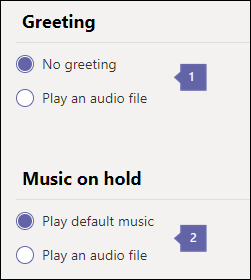

# <a name="create-a-cloud-call-queue"></a>创建云呼叫队列

云呼叫队列可以提供：

- 一条问候语。
- 在呼叫者保持等待时播放的音乐。
- 使用启用邮件的通讯组列表和安全组将呼叫重定向到呼叫代理。
- 设置不同的参数，例如队列最大大小、超时和通话处理选项。

您可以使用[资源帐户](manage-resource-accounts.md)将电话号码与呼叫队列相关联。 可通过自动助理上的选择直接拨打或访问呼叫队列。

呼叫者在处于暂停状态时将听到音乐，并且呼叫将首先连接到呼叫代理，*即先出*（FIFO）订单。

通过以下方法之一将队列中的所有调用发送到代理：

- 通过助理路由，队列中的第一个通话将同时响铃所有代理。
- 通过串行路由，队列中的第一次呼叫将每个呼叫代理逐一响铃一次。
- 通过循环复用，传入呼叫的路由是平衡的，以便每个呼叫代理从队列中获得相同数量的通话。

    > [!NOTE]
    > 在**脱机**状态下呼叫代理、将其状态设置为 "请勿**打扰"** 或选择退出呼叫队列将不会收到呼叫。

- 一次仅有一个传入呼叫通知（在队列的头呼叫）转到呼叫代理。
- 呼叫代理接受呼叫后，队列中的下一个传入呼叫开始拨叫所有代理。

> [!NOTE]
> 本文适用于 Microsoft 团队和 Skype for business Online。

## <a name="step-1--get-started"></a>步骤 1-入门

要开始使用呼叫队列，记住以下几点至关重要：

- 通话队列必须具有关联的资源帐户。 有关资源帐户的详细信息，请参阅[管理团队中的资源帐户](manage-resource-accounts.md)。
- 将电话号码分配给资源帐户时，您现在可以使用 "免费电话系统[虚拟用户" 许可证](teams-add-on-licensing/virtual-user.md)。 电话系统允许组织级别的电话号码与低成本的自动助理和呼叫队列服务配合使用。

> [!NOTE]
> 只有 Microsoft 团队用户和代理才支持直接路由呼叫队列服务号码。

> [!NOTE]
> 若要将呼叫重定向到您的组织中联机的人员，他们必须具有**电话系统**许可证并启用企业语音或拥有 Office 365 通话计划。 请参阅[分配 Skype For business 许可证](/Skype/SfbOnline/skype-for-business-and-microsoft-teams-add-on-licensing/assign-skype-for-business-and-microsoft-teams-licenses.md)或[分配 Microsoft 团队许可证](assign-teams-licenses.md)。 To enable them for Enterprise Voice, you can use Windows PowerShell. 例如，运行：`Set-CsUser -identity "Amos Marble" -EnterpriseVoiceEnabled $true`

- 若要了解有关 Office 365 呼叫计划的详细信息，请参阅[手机系统和通话计划](calling-plan-landing-page.md)和[Office 365 的呼叫计划](calling-plans-for-office-365.md)。

- 您只能将云呼叫队列分配给您在**Microsoft 团队管理中心**或从另一个服务提供商转移的收费电话号码和免费服务电话号码。 免费服务号码需要通讯信用点数。

    > [!NOTE]
    > [!注释] 不能将用户（订阅者）的电话号码分配给呼叫队列 - 只能使用收费或免费服务电话号码。

- 以下客户端支持与云呼叫队列关联的呼叫代理：

  - Skype for Business 桌面客户端2016（32位和64位版本）

  - Lync 桌面客户端2013（32位和64位版本）

  - Microsoft 团队支持的所有 IP 电话模式。 请参阅[获取适用于 Skype for Business Online 的电话](/skypeforbusiness/what-is-phone-system-in-office-365/getting-phones-for-skype-for-business-online/getting-phones-for-skype-for-business-online)。

  - Mac Skype for Business 客户端（版本 16.8.196 及更高版本）

  - Android Skype for Business 客户端（版本 6.16.0.9 及更高版本）

  - iPhone Skype for Business 客户端（版本 6.16.0 及更高版本）

  - iPad Skype for Business 客户端（版本 6.16.0 及更高版本）

  - Microsoft 团队 Windows 客户端（32位和64位版本）

  - Microsoft Teams Mac 客户端

  - Microsoft Teams iPhone 应用

  - Microsoft Teams Android 应用

    > [!NOTE]
    > 分配了直接路由号码的呼叫队列将不支持 Skype for business 客户端、Lync 客户端或 Skype for business IP 手机用作代理。 

## <a name="step-2--getting-or-transferring-toll-or-toll-free-service-phone-numbers"></a>步骤 2-获取或转移收费或免费服务电话号码

在创建和设置呼叫队列之前，您需要获取或转移现有收费或免费服务号码。 获取收费或免费服务电话号码后，它们将显示在**Microsoft 团队管理中心** > **旧版门户** > **Voice** > **电话号码**中，并且**数字类型**将列为**服务-** 免费。 若要获取你的服务号码，请参阅[获取服务电话号码](getting-service-phone-numbers.md)或要转移现有服务号码，请参阅[将电话号码转移到团队](phone-number-calling-plans/transfer-phone-numbers-to-teams.md)。

> [!NOTE]
> 如果您在美国以外，则不能使用 Microsoft 团队管理中心获取服务号码。 转到 "[管理你的组织的电话号码](manage-phone-numbers-for-your-organization/manage-phone-numbers-for-your-organization.md)" 以了解如何从美国以外的国家进行管理。

设置多个自动助理时，你只能将电话号码分配给主自动助理的资源帐户，该帐户可以将呼叫者定向到呼叫队列或嵌套的自动助理。 在这些情况下，在系统中创建所有自动助理并调用队列，而不分配拨号键盘选项，然后稍后编辑设置。 这是必需的，因为不允许创建指向呼叫队列或不存在的自动助理的选项链接。

## <a name="step-3--create-a-new-call-queue"></a>步骤 3-创建新的呼叫队列

[!INCLUDE [updating-admin-interfaces](includes/updating-admin-interfaces.md)]

> [!IMPORTANT]
> 每个通话队列都必须具有关联的[资源帐户](manage-resource-accounts.md)。 必须先创建资源帐户，然后才能将其关联到呼叫队列。

### <a name="using-the-microsoft-teams-admin-center"></a>使用 Microsoft 团队管理中心

在**Microsoft 团队管理中心**、**语音** > **呼叫队列**中，单击 " **+ 添加新**"：

### <a name="set-the-call-queue-display-name-and-resource-account"></a>设置呼叫队列显示名称和资源帐户


* * *


**名称**中的标注输入呼叫队列的描述性显示名称。 此名称是必需的，最多可包含64个字符，包括空格。

 此名称显示在传入呼叫的通知中。

* * *


**添加帐户**选择资源帐户。 资源帐户可能与呼叫队列的服务收费或免费电话号码相关联，但是每个通话队列都需要关联的资源帐户。

如果未列出任何列表，则需要先获取服务号码并将其分配给资源帐户，如前文所述。 若要获取你的服务号码，请参阅[获取服务电话号码](getting-service-phone-numbers.md)。 按照 "[管理团队中的资源帐户](manage-resource-accounts.md)" 中所述创建资源帐户（如果希望呼叫队列具有相关联的电话号码）。

> [!NOTE]
> 如果你希望或需要分配**域**，你可以通过将其分配给呼叫队列的资源帐户来执行此操作。

### <a name="set-the-greeting-and-music-played-while-on-hold"></a>设置通话保持时播放的问候语和音乐



* * *


**问候语**是可选设置。 这是呼叫呼叫队列号码的用户所播放的问候语。

你可以上载音频文件（.wav、mp3 或 .wma 格式）。


**暂停的音乐**你可以使用与呼叫队列一起提供的默认音乐保持通话，也可以将音频文件上载为 .wav、mp3 或 .wma 格式，用作保留的自定义音乐。

* * *

### <a name="select-the-call-answering-options"></a>选择呼叫应答选项


你可以选择多达200个呼叫代理，该代理属于以下任意邮件列表或组：

- Office 365 组
- 安全组
- 通讯组列表

所选呼叫代理必须是以下各项之一： 

- 使用电话系统许可证和启用企业语音的联机用户 
- 使用呼叫计划的在线用户
- 本地 Skype for Business 服务器用户

  > [!NOTE]
  > 如果您想要将呼叫重定向到您的组织中联机的人员，也可以使用此操作。 这些人必须具有**电话系统**许可证，并且已启用企业语音**或**有呼叫计划。 有关详细信息，请参阅[分配 Skype for business 许可证](/Skype/SfbOnline/skype-for-business-and-microsoft-teams-add-on-licensing/assign-skype-for-business-and-microsoft-teams-licenses.md)、[分配 Microsoft 团队许可证](https://docs.microsoft.com/microsoftteams/assign-teams-licenses)或适合[您的通话计划？](https://docs.microsoft.com/microsoftteams/calling-plan-landing-page)

 若要启用企业语音代理，你可以使用 Windows PowerShell。 例如，运行：`Set-CsUser -identity "Amos Marble" -EnterpriseVoiceEnabled $true`

- 具有**电话系统**许可证或添加到 Office 365 组的呼叫计划的用户;启用邮件的通讯组列表;或安全组。 通讯组列表或安全组中新添加的代理可能需要长达3小时才能开始从呼叫队列接收呼叫。 新创建的通讯组列表或安全组可能需要长达48小时才能与通话队列一起使用。 新创建的 Office 365 组几乎立即就可使用。

- 如果你的代理使用 Microsoft 团队应用进行呼叫队列呼叫，则他们必须处于 TeamsOnly 模式。


**路由方法**您可以为您的通话队列分发方法选择 "**助理**"、"**串行**" 或 "**循环**"。 所有新的和现有呼叫队列将具有默认情况下选中的助理路由。 使用 "助理路由" 时，队列中的第一次呼叫将同时响铃所有呼叫工程师。 获取呼叫的第一个呼叫代理将获取呼叫。

- **助理路由**使队列中的第一次通话同时拨打所有呼叫工程师。 获取呼叫的第一个呼叫代理将获取呼叫。
- **串行路由**传入呼叫从呼叫代理列表的开始，逐个拨打呼叫工程师。 不能在 "呼叫代理程序" 列表中订购代理。 如果代理挂断或不接听电话，电话将打给列表的下一位代理，并将尝试逐个拨打所有代理，直到有人接听或队列等待超时为止。
  > [!NOTE]
  > 串行路由将跳过处于**脱机**状态、已将其状态设置为 **请勿打扰**或**已选择退出**不从此队列获取呼叫的代理。
- **循环法**平衡传入呼叫的路由，以便每个呼叫代理从队列中获得相同数量的通话。 这在入站销售环境中可能需要确保所有呼叫代理的同等机遇。

### <a name="select-an-agent-opt-out-option"></a>选择代理选择退出选项


* * *


**工程师可以选择退出 "获取" 呼叫**通过启用此选项，您可以选择允许呼叫队列代理选择退出特定队列中的呼叫。

如果启用此选项，将允许此队列中的所有代理从该呼叫队列开始或停止接收呼叫。 通过清除此复选框，你可以随时撤消代理选择退出特权，这将导致所有代理自动选择再加入此队列 （所有代理的默认设置）。

若要访问选择退出选项，代理可以执行以下操作：

 1. 在其桌面 Skype for Business 客户端中打开**选项**。
 2. 在**呼叫转移**选项卡中，单击**在线编辑设置**链接。
 3. 在 "用户设置" 页面上，单击 "**呼叫队列**"，然后清除要选择退出的任何队列的复选框。

    > [!NOTE]
    > 使用 Skype for Business 桌面之外的应用或终结点的代理可以从 "用户设置" 门户[https://aka.ms/cqsettings](https://aka.ms/cqsettings)访问 "退出" 选项。


中引用标注**Agent 警报设置**

这定义了在串行或循环路由方法移到下一个代理之前通知呼叫的代理的持续时间。

默认设置为30秒，但最多可设置3分钟。

* * *

### <a name="set-the-call-overflow-and-timeout-handling-options"></a>设置呼叫溢出和超时处理选项


* * *


**队列中的最大呼叫数** 使用此字段来设置同一时间可以在队列中等待的最大呼叫数。 默认值为50，但范围可以从0到200。 当达到此限制时，将按照在 "**达到最大通话次数时**" 设置中设置的方式处理呼叫。

* * *


**达到最大通话次数时**当通话队列达到最大值（使用 **"队列" 设置中的最大通话**设置）时，您可以选择新的传入呼叫发生的情况。

- **断开连接**通话断开。
- **重定向到**选择此项时，请选择下列操作之一：

  - **公司中的人员**具有**电话系统**许可证并启用企业语音或具有呼叫计划的在线用户。 您可以对其进行设置，以便呼叫者可以发送到语音邮件。 若要执行此操作，请选择**您的公司中的人员**，并将其呼叫直接转发到语音邮件。

  若要了解语音邮件所需的许可证，请参阅[设置云语音邮件](set-up-phone-system-voicemail.md)。

  - **语音应用程序**选择与已创建的呼叫队列或自动助理相关联的资源帐户的名称。

* * *


**呼叫超时：最长等待时间**您还可以决定呼叫在队列中保留多长时间，并且需要重定向或断开连接。 重定向的位置取决于设置**通话超时**设置的方式。 你可以将此时间设置为 0 到 45 分钟。

超时值可以以秒为单位按 15 秒间隔进行设置。 这样，你可以以更细的粒度操作呼叫流。 例如，您可以指定30秒内代理未接听的任何通话转到目录搜索自动助理。


**拨出的时间**当呼叫达到您在 "队列" 设置**中呼叫可以等待的时间**限制时，您可以选择对此呼叫执行的操作：

- **断开连接**通话断开。
- **将此呼叫重定向到**如果选择此选项，则可以使用以下选项：
  - **公司中的人员**具有**电话系统**许可证并启用企业语音或具有通话计划的在线用户。 你可以通过此设置将呼叫者直接转到语音邮件。 若要执行此操作，请选择**您的公司中的人员**，并将其呼叫直接转发到语音邮件。

  若要了解语音邮件所需的许可，请参阅[设置云语音邮件](set-up-phone-system-voicemail.md)。

  - **语音应用程序**选择与已创建的通话队列或自动助理相关联的资源帐户的名称。

## <a name="change-a-users-caller-id-for-outbound-calls"></a>更改用于出站呼叫的用户来电显示

你可以通过将呼叫队列、自动助理或任何服务号码的呼叫者 ID 改为使用**CsCallingLineIdentity** cmdlet 来保护用户的身份。

若要执行此操作，请运行：

``` Powershell
New-CsCallingLineIdentity -Identity "UKSalesQueue" -CallingIdSubstitute "Service" -ServiceNumber 14258828080 -EnableUserOverride $False -Verbose
```

然后使用 **Grant-CallingLineIdentity** cmdlet 将策略应用于用户。 若要执行此操作，请运行：

``` Powershell
Grant-CsCallingLineIdentity -PolicyName UKSalesQueue -Identity "AmosMarble@contoso.com"
```

有关如何在您的组织中设置来电显示设置的详细信息，[请访问如何在您的组织中使用呼叫者 id](/microsoftteams/how-can-caller-id-be-used-in-your-organization)。

## <a name="call-queue-cmdlets"></a>呼叫队列 cmdlet

还可以使用 Windows PowerShell 来创建和设置呼叫队列。 下面是用于管理呼叫队列的 cmdlet。

- [新-CsCallQueue](https://docs.microsoft.com/powershell/module/skype/new-CsCallQueue?view=skype-ps)

- [Set-CsCallQueue](https://docs.microsoft.com/powershell/module/skype/set-CsCallQueue?view=skype-ps)

- [CsCallQueue](https://docs.microsoft.com/powershell/module/skype/get-CsCallQueue?view=skype-ps)

- [Remove-CsCallQueue](https://docs.microsoft.com/powershell/module/skype/remove-CsCallQueue?view=skype-ps)

### <a name="more-about-windows-powershell"></a>有关 Windows PowerShell 的详细信息

- Windows PowerShell Office 365 的功能是管理用户以及允许或不允许用户执行某些操作。 使用 Windows PowerShell，你可以使用单个管理点管理 Office 365 和 Microsoft 团队，这样，当你有多个任务需要执行操作时，可以简化日常工作。 若要开始使用 Windows PowerShell，请参阅下列主题：

  - [Windows PowerShell 和 Skype for Business Online 简介](/SkypeForBusiness/set-up-your-computer-for-windows-powershell/set-up-your-computer-for-windows-powershell)

  - [为什么要使用 Office 365 PowerShell](https://docs.microsoft.com/office365/enterprise/powershell/why-you-need-to-use-office-365-powershell)

- Windows PowerShell 在速度、简单性和工作效率方面具有许多比 Microsoft 团队管理中心更多的优势，例如，当您同时为多个用户设置更改时。 通过以下主题了解这些优势：

  - [通过 Windows PowerShell 管理 Office 365](https://docs.microsoft.com/office365/enterprise/powershell/manage-office-365-with-office-365-powershell)

  - [为 Windows PowerShell 设置计算机](https://docs.microsoft.com/SkypeForBusiness/set-up-your-computer-for-windows-powershell/set-up-your-computer-for-windows-powershell)

## <a name="related-topics"></a>相关主题

[以下是 Office 365 中的电话系统功能](here-s-what-you-get-with-phone-system.md)

[获取服务电话号码](getting-service-phone-numbers.md)

[音频会议和通话套餐的国家/地区可用性](country-and-region-availability-for-audio-conferencing-and-calling-plans/country-and-region-availability-for-audio-conferencing-and-calling-plans.md)

[新-CsOnlineApplicationInstance](https://docs.microsoft.com/powershell/module/skype/new-csonlineapplicationinstance?view=skype-ps)
