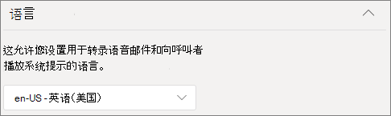
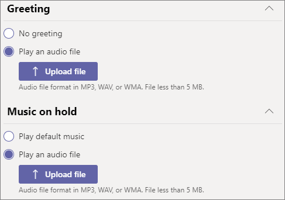

# 创建呼叫队列

呼叫队列提供将呼叫者路由到组织中可以解决特定问题或问题的人的方法。 呼叫一次一个地分配给队列中 (称为代理 *) 。* 

> [!TIP]
> 本文适用于大型组织。 如果你的组织是小型企业，请改为阅读创建 [呼叫队列 - 小型企业](/microsoftteams/business-voice/create-a-phone-system-call-queue-smb) 教程。

呼叫队列提供：

- 问候消息。

- 音乐在等待队列中等待时，

- 调用路由 - 在 *"先* 到先出" (FIFO) 顺序 - 到代理。

- 处理队列溢出和超时的选项。

请确保已阅读自动[助理Teams](plan-auto-attendant-call-queue.md)呼叫队列的计划，并按照入门步骤操作，然后按照本文中的步骤操作。

## 视频演示

此视频演示了如何在呼叫队列中创建呼叫队列的基本Teams。

> [!VIDEO https://www.microsoft.com/videoplayer/embed/RWCF23?autoplay=false]

## 创建呼叫队列

要设置呼叫队列，请在Teams中心展开 **"** 语音"，单击"呼叫 **队列**"，然后单击"添加 **"。**

键入呼叫队列的名称。

## 资源帐户

单击 **"添加** 帐户"，搜索要用于此呼叫队列的资源帐户，单击"添加 **"，然后单击**"添加 **"。**  (代理收到传入呼叫时，会看到资源帐户名称。) 

### 分配呼叫 ID

如果计划为呼叫代理Teams呼叫代理，可以通过指定一个或多个具有电话号码的资源帐户来为代理分配出站呼叫者 ID 号码。

单击 **"** 添加"，在进行出站调用时搜索要允许代理调用 ID 的资源帐户，单击"添加 **"，然后单击**"添加 **"。**

如果不使用呼叫Teams控制代理成员身份，请考虑直接将呼叫队列成员的呼叫者 ID 设置为呼叫队列的服务号码或相应的自动助理。 有关详细信息[，请参阅管理](caller-id-policies.md)Microsoft Teams 中的来电显示策略。

## 语言

选择 [受支持的语言](create-a-phone-system-call-queue-languages.md)。 如果启用语音提示和语音听录，此语言 (系统生成的语音) 。

## 队列中保留的问候语和音乐

指定是否要在呼叫者到达队列时播放问候语。 必须上传包含要播放的问候语的 MP3、WAV 或 WMA 文件。 上传的录制内容不能大于 5 MB。

Teams在队列中保持时向呼叫者提供默认音乐。 呼叫队列中提供的默认Teams不收取组织支付的任何版权费。 如果要播放特定音频文件，请选择"播放音频文件 **"并** 上传 MP3、WAV 或 WMA 文件。

> [!NOTE]
> 你负责独立清除和保护使用任何音乐或音频文件的一切必要权限Microsoft Teams服务， 其中可能包括来自所有相关权利持有者的任何音乐、声音效果、音频、品牌、名称和其他内容中的知识产权和其他权利，其中可能包括艺术家、执行者、执行者、艺术家、歌曲作者、作曲者、录制标签、音乐发布者、联盟、团体、权利代理人、集体管理组织以及拥有、控制或许可音乐版权、声音效果、音频和其他知识产权的其他任何方。

## 呼叫代理

查看 [将代理添加到呼叫队列的先决条件](plan-auto-attendant-call-queue.md#prerequisites)。

##### Teams频道

可以通过一个客户端通道添加多达 200 Teams代理。

如果要使用 [频道管理Teams，](https://support.microsoft.com/office/9f07dabe-91c6-4a9b-a545-8ffdddd2504e)请选择"**选择团队"选项，** 然后单击"**添加频道"。** 搜索想要使用的团队，将其选中，然后单击"添加 **"。** 选择想要使用的频道，然后单击"应用 **"。** 您必须是团队的成员、频道的创建者或所有者。

使用呼叫队列的 Teams支持以下客户端： 

  - Microsoft Teams Windows客户端
  - Microsoft Teams Mac 客户端

> [!NOTE]
> 如果使用此选项，则呼叫队列可能需要 24 小时才能完全正常运行。

##### 用户和组

可以单独添加多达 20 个代理，通过组最多添加 200 个代理。

如果要将单个用户或组添加到队列，请选择" **选择用户和组"** 选项。 

若要将用户添加到队列，请单击"**添加** 用户"，搜索该用户，单击"添加 **"，然后单击**"添加 **"。**

若要将组添加到队列，请单击 **"添加组**"，搜索该组，单击"添加 **"，然后单击**"添加 **"。** 可以使用通讯组列表、安全组和Microsoft 365组Microsoft Teams团队。

> [!NOTE]
> 添加到组的新用户可能需要最多八个小时才能进行第一次呼叫。

## 呼叫路由

**在** 代理接受呼叫后，会议模式可显著减少呼叫者连接到代理所花的时间。 若要使会议模式正常工作，呼叫队列中的代理必须使用以下客户端之一：

  - 最新版本的桌面Microsoft Teams Android 应用或 iOS 应用
  - Microsoft Teams 1449/1.0.94.2020051601 或更高版本
  
代理Teams帐户需要设置为Teams模式。 不符合要求的代理不包括在呼叫路由列表中。 如果代理都使用兼容的客户端，建议为呼叫队列启用会议模式。

> [!NOTE]
> 如果电话呼叫从为"基于位置的路由"启用的直接路由网关路由到队列，则不支持会议模式。

> [!TIP]
> 建议 **将"会议****模式"设置为**"自动"。

**路由** 方法确定代理从队列接收调用的顺序。 从以下选项中进行选择：

- **助理路由** 同时将队列中的所有代理环环。 第一个接电话的呼叫代理获取呼叫。

- **串行路由** 按"呼叫代理"列表中指定的顺序一个接一个地拨打所有 **呼叫** 代理。 如果代理关闭或未接回呼叫，该调用将拨打下一个代理，并尝试所有代理，直到它被选取或退出。

- **轮循** 机制平衡传入调用的路由，以便每个调用代理从队列中获取相同数量的调用。 在入站销售环境中可能需要这样做，以确保所有呼叫代理之间的机会相等。

- **最长空闲** 时间将每次调用路由到空闲时间最长的代理。 如果代理的状态为"可用"或其状态为"离开"时间少于 10 分钟，则代理被视为空闲状态。 状态为"离开"超过 10 分钟的代理不被视为空闲状态，在将状态更改为"可用"之前，他们无法接听呼叫。 

> [!TIP]
> 建议 **将路由方法****设置为轮循机制****或** 最长空闲时间。

**基于状态的路由** 使用呼叫代理的可用性状态来确定是否应在所选路由方法的呼叫路由列表中包含代理。 其可用性状态设置为"可用 **"** 的呼叫代理包含在呼叫路由列表中，可以接收呼叫。 其可用性状态设置为任何其他状态的代理从呼叫路由列表中排除，并且不会接收呼叫，直到其可用性状态更改回"可用 **"。** 

可以使用任何路由方法启用基于状态的呼叫路由。

如果代理选择不接听呼叫，则无论其可用性状态设置为什么，它们将不会包含在呼叫路由列表中。 

> [!NOTE]
> 选择 **"最长** 空闲时间"作为路由方法时，需要并自动启用基于状态的路由，即使基于状态的路由切换将关闭并灰显。
>
> 如果未启用基于状态的路由，并且队列中有多个调用，系统将同时向代理显示这些调用，而不管代理的状态如何。 这会导致向代理发送多个呼叫通知，尤其是当某些代理不应答发送给代理的初始呼叫时。
> 
> 启用基于Skype for Business路由时，使用客户端的代理不会包含在呼叫路由列表中。 如果代理使用 Skype for Business，请不要启用基于状态的呼叫路由。

> [!TIP]
> 建议 **将基于状态路由设置为****"** 打开"。

**代理警报** 时间指定在队列将呼叫重定向到下一个代理之前，代理的电话将响铃的时间。

> [!TIP]
> 建议 **将代理警报时间****设置为 20** 秒。

## 调用溢出处理

**队列中的最大调用** 数指定在任意给定时间可在队列中等待的最大调用数。 默认值为 50，但范围为 0 到 200。 达到此限制时，按"达到最大调用数时"设置指定 **处理** 调用。

可以选择断开呼叫连接或将其重定向到任何呼叫路由目标。 例如，你可能让呼叫者为队列中的代理留下语音邮件。 有关外部传输，请参阅先决条件和外部电话号码转移[- 号码](create-a-phone-system-auto-attendant.md#external-phone-number-transfers---technical-details)格式的技术详细信息。

> [!NOTE]
> 如果最大呼叫数设置为 0，则问候消息将不会播放。

## 调用超时处理

**调用超时：最长等待时间** 指定在重定向或断开连接之前，呼叫在队列中可以保持的最大时间。 可以指定 0 秒到 45 分钟的值。

可以选择断开呼叫连接或将其重定向到呼叫路由目标之一。 例如，你可能让呼叫者为队列中的代理留下语音邮件。 有关外部传输，请参阅先决条件和外部电话号码转移[- 号码](create-a-phone-system-auto-attendant.md#external-phone-number-transfers---technical-details)格式的技术详细信息。

选择通话超时选项后，单击"保存 **"。**

## 建议的呼叫队列设置摘要

建议设置以下设置：

- **"会议模式** "到 **"自动"**
- **路由到轮****循机制或****最长空闲时间的方法**
- **基于状态到"打开"** 的 **路由**
- **代理警报时间：****到 20 秒**

## 支持的客户端

呼叫队列中的呼叫代理支持以下客户端：

  - Skype for Business桌面客户端 2016 (32 位和 64 位版本) 
  - Lync 桌面客户端 2013 (32 位和 64 位版本) 
  - 支持所有 IP 电话型号Microsoft Teams。 请参阅[获取适用于 Skype for Business Online 的电话](/skypeforbusiness/what-is-phone-system-in-office-365/getting-phones-for-skype-for-business-online/getting-phones-for-skype-for-business-online)。
  - Mac Skype for Business 客户端（版本 16.8.196 及更高版本）
  - Android Skype for Business 客户端（版本 6.16.0.9 及更高版本）
  - iPhone Skype for Business 客户端（版本 6.16.0 及更高版本）
  - iPad Skype for Business 客户端（版本 6.16.0 及更高版本）
  - Microsoft Teams Windows客户端 (32 位和 64 位) 
  - Microsoft Teams Mac 客户端
  - Microsoft Teams[虚拟桌面、Citrix](/microsoftteams/teams-for-vdi)和 VMware (Windows虚拟桌面基础结构) 
  - Microsoft Teams iPhone 应用
  - Microsoft Teams Android 应用

    > [!NOTE]
    > 分配有直接路由号码的呼叫队列不支持将 Skype for Business、Lync 客户端或 Skype for Business IP 电话作为代理。 只有 Teams 共存模式才支持 Teams[客户端](/microsoftteams/setting-your-coexistence-and-upgrade-settings)。

## 呼叫队列 cmdlet

还可以使用 Windows PowerShell 来创建和设置呼叫队列。 下面是用于管理呼叫队列的 cmdlet。

- [New-CsCallQueue](/powershell/module/skype/new-CsCallQueue)

- [Set-CsCallQueue](/powershell/module/skype/set-CsCallQueue)

- [Get-CsCallQueue](/powershell/module/skype/get-CsCallQueue)

- [Remove-CsCallQueue](/powershell/module/skype/remove-CsCallQueue)

## 相关主题

[电话系统的功能](here-s-what-you-get-with-phone-system.md)

[获取服务电话号码](getting-service-phone-numbers.md)

[音频会议和通话套餐的国家/地区可用性](country-and-region-availability-for-audio-conferencing-and-calling-plans/country-and-region-availability-for-audio-conferencing-and-calling-plans.md)

[New-CsOnlineApplicationInstance](/powershell/module/skype/new-csonlineapplicationinstance)

[Windows PowerShell 和 Skype for Business Online 简介](/SkypeForBusiness/set-up-your-computer-for-windows-powershell/set-up-your-computer-for-windows-powershell)
