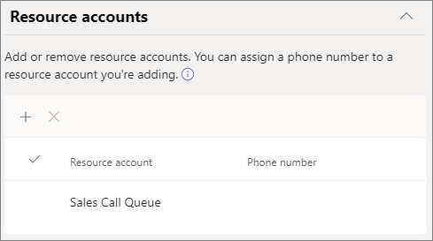
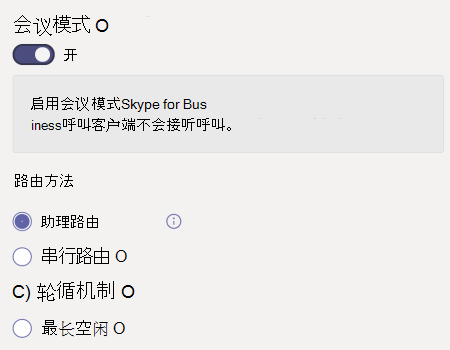
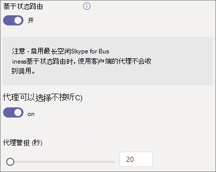
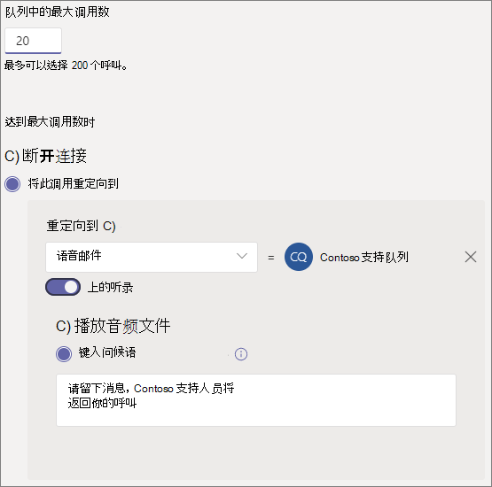

# 创建呼叫队列

呼叫队列提供将呼叫者路由到组织中可以帮助解决特定问题或问题的人的方法。 呼叫一次一个地分配给队列中 (称为代理) 。  

呼叫队列提供：

- 问候消息。

- 音乐排入队列等待等待时，将打开队列。

- 将 FIFO 的"先到 *先* 出 (") 调用路由到代理。

- 处理队列溢出和超时的选项。

在按照本文中的过程操作之前，请确保已阅读[Teams](plan-auto-attendant-call-queue.md)自动助理和呼叫队列的计划，并按照入门步骤操作。

若要设置呼叫队列，请在 Teams 管理中心展开 **"** 语音"，单击"呼叫队列"，然后单击"添加 **"。**

## 资源帐户和语言

1. 键入呼叫队列的名称。 代理收到来自队列的传入呼叫时，会看到此名称。

2. 单击 **"添加** 帐户"，搜索要用于此呼叫队列的资源帐户，单击"添加"，然后单击"添加 **"。**

3. 选择一种语言。 如果启用系统生成的语音提示和语音邮件听录， (此语言) 。

## 在队列中保持的问候语和音乐

指定是否要在呼叫者到达队列时播放问候语。 必须上传包含要播放的问候语的 MP3、WAV 或 WMA 文件。

当呼叫者在队列中保持时，Teams 会向他们提供默认音乐。 如果要播放特定音频文件，请选择"播放音频文件"并上传 MP3、WAV 或 WMA 文件。

> [!NOTE]
> 上传的录制内容不能大于 5 MB。
> Teams 呼叫队列中提供的默认音乐不收取组织支付的任何版权费。 

## 呼叫代理

请参阅先决条件 [，](plan-auto-attendant-call-queue.md#prerequisites) 以便能够将代理添加到呼叫队列。

可以单独最多添加 20 个代理，通过组最多添加 200 个代理。

若要将用户添加到队列，请单击"添加用户"，搜索该用户，单击"添加 **"，然后单击**"添加 **"。**

若要将组添加到队列，请单击"添加组"，搜索组，单击"添加 **"，然后单击**"添加 **"。** 可以使用通讯组列表、安全组和 Microsoft 365 组或 Microsoft Teams 团队。

> [!NOTE]
> 添加到组的新用户最多可能需要八个小时才能进行第一次呼叫。

## 呼叫路由

**在** 代理接受呼叫后，会议模式可显著减少呼叫者连接到代理所花的时间。 若要使会议模式正常工作，呼叫队列中的代理必须使用以下客户端之一：

  - 最新版本的 Microsoft Teams 桌面客户端、Android 应用或 iOS 应用
  - Microsoft Teams 手机版本 1449/1.0.94.2020051601 或更高版本
  
代理的 Teams 帐户需要设置为仅 Teams 模式。 不符合要求的代理不包括在呼叫路由列表中。 如果代理都使用兼容的客户端，我们建议为呼叫队列启用会议模式。

**路由** 方法确定代理从队列接收调用的顺序。 从以下选项中选择：

- **助理路由** 同时会圈出队列中的所有代理。 第一个接电话的呼叫代理获取呼叫。

- **串行路由** 按"呼叫代理"列表中指定的顺序一个接一个地拨打所有 **呼叫** 代理。 如果代理关闭或未接回呼叫，该调用将拨打下一个代理，并尝试所有代理，直到它被选取或退出。

- **轮循** 机制对传入调用的路由进行平衡，以便每个调用代理从队列中获取相同数量的调用。 在入站销售环境中可能需要这样做，以确保所有呼叫代理之间的机会相等。

- **最长空闲** 将每次调用路由到空闲时间最长的代理。 如果代理的状态为"可用"或其状态为"离开"时间少于 10 分钟，则代理被视为空闲状态。 状态为"离开"超过 10 分钟的代理被视为空闲状态，在将状态更改为"可用"之前，将不符合接听呼叫资格。 

**基于状态的路由** 使用呼叫代理的可用性状态来确定代理是否应该包含在所选路由方法的呼叫路由列表中。 其可用性状态设置为"可用"的 **呼叫代理包含在** 呼叫路由列表中，可以接收呼叫。 其可用性状态设置为任何其他状态的代理将排除在呼叫路由列表中，并且不会接收呼叫，直到其可用性状态更改回 **"可用"。** 

可以使用任何路由方法启用基于状态的呼叫路由。

如果代理选择不接听呼叫，则无论其可用性状态设置为什么，它们将不会包含在呼叫路由列表中。 

> [!NOTE]
> 启用基于状态路由时，使用 Skype for Business 客户端的代理不会包含在呼叫路由列表中。 如果你有使用 Skype for Business 的代理，请不要启用基于状态的电话路由。

**代理警报** 时间指定代理的电话在队列将呼叫重定向到下一个代理之前响铃的时间。

建议设置以下设置：

- **会议模式** 到 **自动**
- **路由到****轮循机制或****最长空闲时间的方法**
- **基于状态到"打开** " **的路由**
- **代理警报时间：****到 20 秒**

> [!NOTE]
> 如果未启用基于状态的路由并且队列中有多个调用，系统将同时向代理显示这些调用，而不管代理的状态如何。 这导致向代理发送多个呼叫通知，尤其是当某些代理不应答呈现给代理的初始呼叫时。

## 呼叫溢出处理

**队列中的最大调用** 数指定在任意给定时间队列中可以等待的最大调用数。 默认值为 50，但范围为 0 到 200。 达到此限制时，按"达到最大调用数时"设置指定的方式 **处理调用** 。

可以选择断开呼叫连接或将其重定向到任何呼叫路由目标。 例如，你可能让呼叫者为队列中的代理留下语音邮件。 有关外部转移，请参阅先决条件和外部电话号码[转移 - 数字](create-a-phone-system-auto-attendant.md#external-phone-number-transfers---technical-details)格式的技术详细信息。

> [!NOTE]
> 如果最大呼叫数设置为 0，则问候消息将不会播放。

## 调用超时处理

**调用超时：最长等待时间** 指定在重定向或断开连接之前，呼叫可以在队列中保持的最长时间。 可以指定 0 秒到 45 分钟的值。

可以选择断开呼叫连接或将其重定向到呼叫路由目标之一。 例如，你可能让呼叫者为队列中的代理留下语音邮件。 有关外部转移，请参阅先决条件和外部电话号码[转移 - 数字](create-a-phone-system-auto-attendant.md#external-phone-number-transfers---technical-details)格式的技术详细信息。

选择通话超时选项后，单击"保存 **"。**

## 出站呼叫的来电显示

由于呼叫队列中的代理可能会拨出以返回客户呼叫，因此请考虑将呼叫队列成员的呼叫者 ID 设置为相应自动助理的服务号码。 有关详细信息 [，请参阅"在 Microsoft Teams 中管理来电](caller-id-policies.md) 显示策略"。

## 支持的客户端

呼叫队列中的呼叫代理支持以下客户端：

  - Skype for Business 桌面客户端 2016 (32 位和 64 位版本) 
  - Lync 桌面客户端 2013 (32 位和 64 位版本) 
  - Microsoft Teams 支持的所有 IP 电话型号。 请参阅[获取适用于 Skype for Business Online 的电话](/skypeforbusiness/what-is-phone-system-in-office-365/getting-phones-for-skype-for-business-online/getting-phones-for-skype-for-business-online)。
  - Mac Skype for Business 客户端（版本 16.8.196 及更高版本）
  - Android Skype for Business 客户端（版本 6.16.0.9 及更高版本）
  - iPhone Skype for Business 客户端（版本 6.16.0 及更高版本）
  - iPad Skype for Business 客户端（版本 6.16.0 及更高版本）
  - Microsoft Teams Windows 客户端 (32 位和 64 位版本) 
  - Microsoft Teams Mac 客户端
  - Microsoft Teams iPhone 应用
  - Microsoft Teams Android 应用

    > [!NOTE]
    > 分配有直接路由号码的呼叫队列不支持将 Skype for Business 客户端、Lync 客户端或 Skype for Business IP 电话作为代理。

## 呼叫队列 cmdlet

还可以使用 Windows PowerShell 来创建和设置呼叫队列。 下面是用于管理呼叫队列的 cmdlet。

- [New-CsCallQueue](https://docs.microsoft.com/powershell/module/skype/new-CsCallQueue)

- [Set-CsCallQueue](https://docs.microsoft.com/powershell/module/skype/set-CsCallQueue)

- [Get-CsCallQueue](https://docs.microsoft.com/powershell/module/skype/get-CsCallQueue)

- [Remove-CsCallQueue](https://docs.microsoft.com/powershell/module/skype/remove-CsCallQueue)

## 相关主题

[电话系统的功能](here-s-what-you-get-with-phone-system.md)

[获取服务电话号码](getting-service-phone-numbers.md)

[音频会议和通话套餐的国家/地区可用性](country-and-region-availability-for-audio-conferencing-and-calling-plans/country-and-region-availability-for-audio-conferencing-and-calling-plans.md)

[New-CsOnlineApplicationInstance](https://docs.microsoft.com/powershell/module/skype/new-csonlineapplicationinstance)

[Windows PowerShell 和 Skype for Business Online 简介](/SkypeForBusiness/set-up-your-computer-for-windows-powershell/set-up-your-computer-for-windows-powershell)
