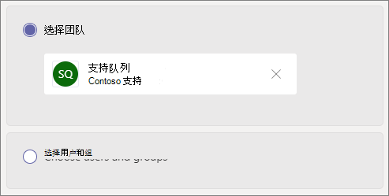

# 创建呼叫队列

通话队列提供了一种将呼叫者路由到组织中的人员的方法，可帮助解决特定问题。 通话将一次分发给队列中的人员， (称为 *代理*) 的人员。 

通话队列提供：

- 一条问候语。

- 用户在队列中等待保留的音乐。

- 拨打电话——首先 *推出* (FIFO) 订单到代理。

- 队列溢出和超时的处理选项。

请确保你拥有 [团队自动助理和呼叫队列](plan-auto-attendant-call-queue.md) 的阅读计划，然后按照本文中的步骤操作，然后按照 [入门步骤](plan-auto-attendant-call-queue.md#getting-started) 操作。

若要设置呼叫队列，请在 "团队管理中心" 中，展开 " **语音**"，单击 " **呼叫队列**"，然后单击 " **添加**"。

## 资源帐户和语言

1. 键入呼叫队列的名称。 当代理接收来自队列的传入呼叫时，将看到此名称。

2. 单击 " **添加帐户**"，搜索要与此通话队列一起使用的资源帐户，单击 " **添加**"，然后单击 " **添加**"。

3. 选择一种语言。 此语言将用于系统生成的语音提示和语音邮件操作 (如果启用这些功能) 。

## 在队列中保留的问候语和音乐

指定是否希望在呼叫者到达队列时向其播放问候语。 必须上载包含要播放的问候语的 MP3、WAV 或 WMA 文件。

当呼叫者在队列中保留时，团队向呼叫者提供默认音乐。 如果要播放特定音频文件，请选择 " **播放音频文件** " 并上载 MP3、WAV 或 WMA 文件。

> [!NOTE]
> 上载的录制不能大于 5 MB。
> 团队通话队列中提供的默认音乐由您的组织提供的任何版税均免费提供。 

## 呼叫代理

请参考 [先决条件](plan-auto-attendant-call-queue.md#prerequisites) ，以便能够将代理添加到呼叫队列。

你可以通过组将多达20个代理分别和最多添加到200个代理。

若要将用户添加到队列，请依次单击 " **添加用户**"、"搜索用户"、" **添加**"，然后单击 " **添加**"。

若要将组添加到队列，请依次单击 " **添加组**"、"搜索组"、" **添加**"，然后单击 " **添加**"。 你可以使用通讯组列表、安全组和 Microsoft 365 组或 Microsoft 团队团队。

> [!NOTE]
> 添加到组的新用户最多可能需要八个小时才能达到首次通话的时间。

## 呼叫路由

在代理接受呼叫后，**会议模式** 会显著减少呼叫者连接到代理所需的时间量。 若要使会议模式正常工作，呼叫队列中的代理必须使用下列客户端之一：

  - Microsoft 团队桌面客户端、Android 应用或 iOS 应用的最新版本
  - Microsoft 团队手机版本 1449/1.0.94.2020051601 或更高版本
  
代理的团队帐户需要设置为 "仅限团队" 模式。 不满足要求的工程师不会包含在 "呼叫" 传送列表中。 如果你的代理全部使用兼容的客户端，我们建议你为通话队列启用会议模式。

> [!NOTE]
> 会议模式不支持忙闲。 如果未启用基于状态的路由，则非呼叫队列呼叫中的代理仍会显示呼叫队列呼叫。

**路由方法** 确定代理从队列接收呼叫的顺序。 从以下选项中选择：

- **助理路由** 同时响铃队列中的所有代理。 获取呼叫的第一个呼叫代理将获取呼叫。

- **串行路由** 按 " **呼叫代理** " 列表中指定的顺序逐个响铃所有呼叫代理。 如果代理程序已关闭或未接听呼叫，则呼叫将拨打下一个代理，并且将尝试所有代理，直到它已被获取或超时。

- **循环法** 平衡传入呼叫的路由，以便每个呼叫代理从队列中获得相同数量的通话。 这在入站销售环境中可能需要确保所有呼叫代理的同等机遇。

- **最长空闲** 路线每次通话时间最长的代理。 如果代理的状态可用或其状态已离开10分钟以内，则会被视为空闲。 如果代理的状态已超过10分钟，则不会被视为空闲，并且在他们将其状态更改为 "可用" 之前，不符合接收呼叫的条件。 

**基于状态的路由** 使用呼叫代理的可用性状态来确定是否应将代理包括在所选路由方法的 "呼叫路由" 列表中。 其可用性状态设置为 " **可用** " 的呼叫代理包括在 "呼叫" 传送列表中，并且可以接收呼叫。 其可用性状态设置为任何其他状态的代理将从呼叫路由列表中排除，并且在其可用性状态更改为 " **可用**" 之前不会收到呼叫。 

你可以使用任何路由方法启用基于状态的呼叫路由。

如果某个代理选择退出呼叫，则无论其可用性状态如何设置，它们都不会包含在 "呼叫" 传送列表中。 

> [!NOTE]
> 启用基于状态的路由时，呼叫传送列表中不包含使用 Skype for Business 客户端的代理。 如果您有使用 Skype for Business 的工程师，请不要启用基于状态的呼叫路由。

**代理警报时间** 指定在队列将呼叫重定向到下一个代理之前，代理电话将响铃的时间。

对于高音量队列，我们建议采用以下设置：

- **会议模式****自动**
- 用于 **助理路由** 的 **路由方法**
- **基于状态的路由** 到 **"开"**
- **代理警报时间：** 到 **20 秒**

## 呼叫溢出处理

**队列中的最大通话** 次数指定可在任何给定时间在队列中等待的最大通话次数。 默认值为50，但范围可以从0到200。 达到此限制时，将按照 **当达到最大调用次数时** 指定的方式处理调用。

您可以选择断开呼叫或将其重定向到任何呼叫传送目的地。 例如，您可能会让呼叫者在队列中留下有关代理的语音邮件。 对于外部传输，请参阅 [先决条件](plan-auto-attendant-call-queue.md#prerequisites) 和 [外部电话号码传输-数字格式的技术详细信息](create-a-phone-system-auto-attendant.md#external-phone-number-transfers---technical-details) 。

> [!NOTE]
> 如果将最大通话次数设置为0，则不会播放问候语。

## 通话超时处理

**呼叫超时：最长等待时间** 指定呼叫在重定向或断开连接之前可以在队列中保留的最长时间。 你可以指定从0秒到45分钟的值。

您可以选择断开呼叫或将其重定向到呼叫传送目的地之一。 例如，您可能会让呼叫者在队列中留下有关代理的语音邮件。 对于外部传输，请参阅 [先决条件](plan-auto-attendant-call-queue.md#prerequisites) 和 [外部电话号码传输-数字格式的技术详细信息](create-a-phone-system-auto-attendant.md#external-phone-number-transfers---technical-details) 。

选择您的通话超时选项后，单击 " **保存**"。

## 用于出站呼叫的来电显示

由于呼叫队列中的代理可能会拨出以返回客户呼叫，请考虑将呼叫队列成员的来电显示设置为相应自动助理的服务号码。 有关详细信息，请参阅 [管理 Microsoft 团队中的来电显示策略](caller-id-policies.md) 。

## 支持的客户端

呼叫队列中的呼叫代理支持下列客户端：

  - Skype for Business 桌面客户端 2016 (32 位和64位版本) 
  - Lync 桌面客户端 2013 (32 位和64位版本) 
  - Microsoft 团队支持的所有 IP 电话模式。 请参阅[获取适用于 Skype for Business Online 的电话](/skypeforbusiness/what-is-phone-system-in-office-365/getting-phones-for-skype-for-business-online/getting-phones-for-skype-for-business-online)。
  - Mac Skype for Business 客户端（版本 16.8.196 及更高版本）
  - Android Skype for Business 客户端（版本 6.16.0.9 及更高版本）
  - iPhone Skype for Business 客户端（版本 6.16.0 及更高版本）
  - iPad Skype for Business 客户端（版本 6.16.0 及更高版本）
  - Microsoft 团队 Windows 客户端 (32 位和64位版本) 
  - Microsoft Teams Mac 客户端
  - Microsoft Teams iPhone 应用
  - Microsoft Teams Android 应用

    > [!NOTE]
    > 分配了直接路由号码的呼叫队列不支持 Skype for business 客户端、Lync 客户端或 Skype for business IP 手机用作代理。

## 呼叫队列 cmdlet

还可以使用 Windows PowerShell 来创建和设置呼叫队列。 下面是用于管理呼叫队列的 cmdlet。

- [新-CsCallQueue](https://docs.microsoft.com/powershell/module/skype/new-CsCallQueue)

- [Set-CsCallQueue](https://docs.microsoft.com/powershell/module/skype/set-CsCallQueue)

- [CsCallQueue](https://docs.microsoft.com/powershell/module/skype/get-CsCallQueue)

- [Remove-CsCallQueue](https://docs.microsoft.com/powershell/module/skype/remove-CsCallQueue)

## 相关主题

[电话系统的功能](here-s-what-you-get-with-phone-system.md)

[获取服务电话号码](getting-service-phone-numbers.md)

[音频会议和通话套餐的国家/地区可用性](country-and-region-availability-for-audio-conferencing-and-calling-plans/country-and-region-availability-for-audio-conferencing-and-calling-plans.md)

[新-CsOnlineApplicationInstance](https://docs.microsoft.com/powershell/module/skype/new-csonlineapplicationinstance)

[Windows PowerShell 和 Skype for Business Online 简介](/SkypeForBusiness/set-up-your-computer-for-windows-powershell/set-up-your-computer-for-windows-powershell)
