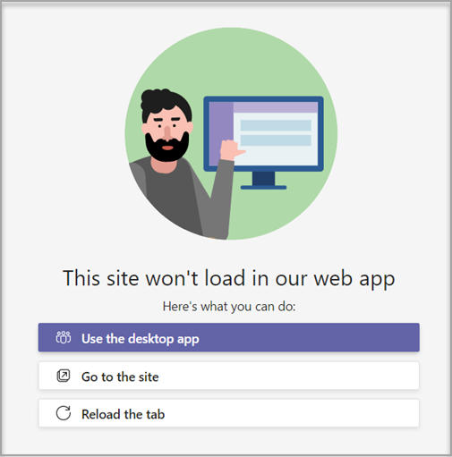

# 在 Microsoft Teams 中创建自定义团队模板

**EDU 客户尚不支持自定义模板。**

自定义团队模板是一个预定义的团队结构，包含一组频道、选项卡和应用。 可以开发一个模板来帮助你快速创建正确的协作空间。 自定义团队模板使用首选设置。  

 

> [!VIDEO https://www.microsoft.com/en-us/videoplayer/embed/RE4P5rx]

若要开始，请：

1. 登录到 Teams 管理中心。

2. 在左侧导航栏中，展开 **Teams**  >  **团队模板"。**

3. 选择“**添加**”。

    

4. 在"**团队模板"** 部分中，选择 **"创建全新的模板"。**

5. 在"**模板设置"** 部分中，完成以下字段，然后选择"下一 **步"：**
    - 模板名称
    - 模板简短和长说明
    - 区域设置可见性  

    

6. 在 **"频道、选项卡** 和应用"部分中，添加团队所需的任何频道和应用。

    1. 在"**频道"部分中**，选择"**添加"。**
    2. 在" **添加"** 对话框中，为通道命名。
    3. 添加说明。
    4. 确定是否默认应显示通道。
    5. 搜索要添加到通道的应用名称。
    6. 完成后 **，选择"** 应用"。

    

8. 完成后 **选择** "提交"。

新模板将显示在"团队 **模板"** 列表中。 该模板可用于在 Teams。

> [!Note]
> 团队用户最多可能需要 24 小时才能在库中查看自定义模板更改。

## 自定义网站选项卡应用

> [!Note]
> 此功能目前以早期预览版提供

你可能希望为自定义团队模板中的频道的网站选项卡指定 URL。 使用模板创建团队的最终用户将具有预设为指定网站 URL 的网站选项卡。

若要开始，请：

1. 创建新的团队模板或编辑现有团队模板。

2. 在"频道"部分中，添加新频道或选择现有频道，然后选择"编辑 **"。**

3. 在" **为此模板添加应用"部分中** ，添加"网站"应用。

    

4. 选择编辑图标并输入选择的 URL。

    

5. 为 **选项卡** 应用编辑选择"保存"，然后选择 **"应用"** 以保存更改。

## 已知问题

**问题**：如果已基于包含其他自定义选项卡的自定义模板创建了团队，则可能会看到空白选项卡，用于使用自定义选项卡应用。 您的默认选项卡 (如"帖子"、"文件"和 **"Wiki**) 将按预期显示。 

**解决方案**：若要解决此问题，请删除自定义选项卡，并使用相同的应用添加新选项卡。 如果无权删除自定义选项卡并添加新选项卡，请联系团队所有者寻求帮助。

我们目前正在为将来从自定义模板创建的团队开发修补程序。

**问题**：在浏览器中Teams时，某些网站不支持在"网站"选项卡Teams呈现。

解决方案：如果查看网站选项卡的内容时遇到问题，将重定向到在单独的网页中打开该选项卡，或者改为在桌面应用中打开 Teams 以查看网站选项卡应用。

## 相关主题

- [管理中心中的团队模板入门](get-started-with-teams-templates-in-the-admin-console.md)
- [从现有团队创建模板](create-template-from-existing-team.md)
- [从现有团队模板创建团队模板](create-template-from-existing-template.md)
