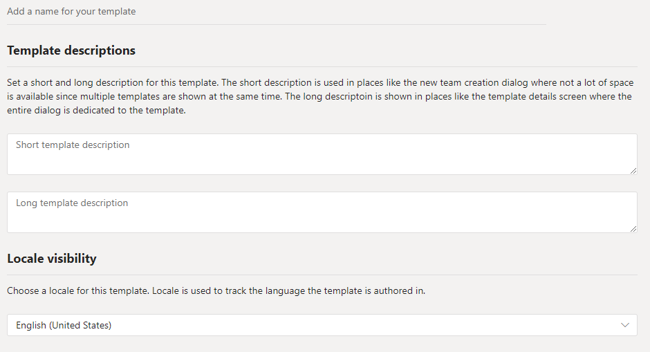

# 在 Microsoft Teams 中创建自定义团队模板Create a custom team template in Microsoft Teams

**EDU 客户尚不支持自定义模板。****Custom templates are not yet supported for EDU customers.**

自定义团队模板是一个预定义的团队结构，包含一组频道、选项卡和应用。A custom team template is a predefined team structure with a set of channels, tabs, and apps. 可以开发一个模板来帮助你快速创建正确的协作空间。You can develop a template that helps you create the right collaboration space quickly. 自定义团队模板使用首选设置。Your custom team template uses your preferred settings.  

若要开始，请：To get started:

1. 登录到 Teams 管理中心。Log in to the Teams admin center.

2. 在左侧导航栏中，展开 **Teams**  >  **团队模板**。In the left navigation, expand **Teams** > **Team templates**.

3. 单击“**添加**”。Click **Add**.

4. 在"**团队模板"** 部分中，选择 **"创建全新的模板"。**In the **Team templates** section, select **Create a brand new template**.

5. 在"**模板设置"** 部分中，完成以下字段，然后单击"下 **一步"：**In the **Template settings** section, complete the following fields and then click **Next**:
    - 模板名称Template name
    - 模板简短和长说明Template short and long descriptions
    - 区域设置可见性Locale visibility  

6. 在 **频道、选项卡和应用** 部分中，添加团队所需的任何频道和应用。In the **channels, tabs, and apps** section, add any channels and apps that your team needs.

    1. 在"**频道"部分中**，单击"**添加"。**In the **Channels** section, click **Add**.
    2. 在" **添加"** 对话框中，为频道命名。In the **Add** dialog, name the channel.
    3. 添加说明。Add a description.
    4. 确定是否默认应显示频道。Decide if the channel should be shown by default.
    5. 搜索要添加到通道的应用名称。Search for an app name that you want to add to the channel.
    6. 完成后 **单击"** 应用"。Click **Apply** when finished.

8. 完成后 **单击** "提交"。Click **Submit** when completed.

新模板显示在"团队 **模板"** 列表中。Your new template is displayed in the **Team templates** list. 该模板可用于在 Teams 中创建团队。The template can be used to create a team in Teams.

> [!Note]
> 团队用户最多可能需要 24 小时才能在库中查看自定义模板。It can take up to 24 hours for teams users to see a custom template in the gallery.

## 已知问题Known issues 

**问题**：如果已基于包含其他自定义选项卡的自定义模板创建了团队，则可能会看到空白选项卡，以用于自定义选项卡应用。**Problem**: If you have created a team from a custom template that contained additional custom tabs, you might see blank tabs in place of your custom tab apps. 默认选项卡 (如帖子、文件和 **Wiki** ) 按预期显示。Your default tabs (i.e. **Posts**, **Files**, and **Wiki**) will appear as expected.

**解决方案**：如果已基于包含其他自定义选项卡的自定义模板创建了团队，则可能会看到空白选项卡，以用于自定义选项卡应用。**Solution**: If you have created a team from a custom template that contained additional custom tabs, you may see blank tabs in place of your custom tab apps. 默认选项卡 (如帖子、文件和 Wiki) 按预期显示。Your default tabs (i.e. Posts, Files and Wiki) will appear as expected.

若要解决此问题，请删除自定义选项卡，并使用相同的应用添加新选项卡。To fix this issue, remove the custom tab and add a new tab with the same app. 如果您没有权限删除自定义选项卡并添加新选项卡，请联系团队所有者，让他们这样做。If you do not have permissions to remove the custom tab and add a new tab, please reach out to the team owner to ask them to do so.

我们目前正在为将来从自定义模板创建的团队开发修补程序。We are currently working on a fix for future teams created from custom templates.

## 相关主题Related topics

- [管理中心中的团队模板入门Get started with team templates in the admin center](get-started-with-teams-templates-in-the-admin-console.md)
- [从现有团队创建模板Create a template from an existing team](create-template-from-existing-team.md)
- [从现有团队模板创建团队模板Create a team template from an existing team template](create-template-from-existing-template.md)
