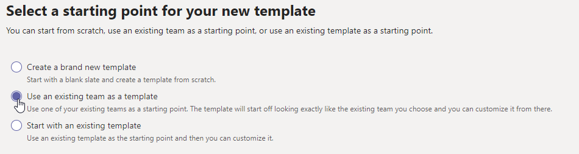

# 从 Microsoft 团队中的现有团队创建模板Create a template from an existing team in Microsoft Teams

[!INCLUDE [preview-feature](includes/preview-feature.md)]

**教育机构客户尚不支持自定义模板。****Custom templates are not yet supported for EDU customers.**

Microsoft 团队使你可以从现有团队创建模板，该模板可以保存和修改以满足你的特定组织需求。Microsoft Teams lets you create a template from an existing team that can be saved and modified to meet your particular organizational needs.

1. 登录团队管理中心。Sign in to the Teams admin center.

2. 在左侧导航中，展开 "**团队**  >  **团队模板**"。In the left navigation, expand **Teams** > **Team templates**.

3. 选择 " **添加**"。Select **Add**.

4. 选择 " **将现有团队用作模板**"，然后选择 " **下一步**"。Select **Use an existing team as a template**, and select **Next**.

 

5. 通过选择团队名称旁边的，选择要用作起点的团队，然后选择 " **下一步**"。Select a team to use as a starting point by selecting next to the team name, and then select **Next**.

6. 在 " **模板设置** " 部分中，填写下列字段，然后选择 " **下一步**"：In the **Template settings** section, complete the following fields and then select **Next**:
    - 模板名称Template name
    - 模板简要和详细说明Template short and long descriptions
    - 区域设置可见性Locale visibility  
  
7. 在 " **频道"、"选项卡" 和 "应用** " 部分中，添加你的团队需要的任何频道和应用。In the **channels, tabs, and apps** section, add any channels and apps that your team needs.

    1. 在 " **频道** " 部分中，选择 " **添加**"。In the **Channels** section, select **Add**.
    2. 在 " **添加** " 对话框中，命名频道。In the **Add** dialog, name the channel.
    3. 添加说明。Add a description.
    4. 确定默认情况下是否显示频道。Decide if the channel should be shown by default.
    5. 搜索要添加到频道的应用名称。Search for an app name that you want to add to the channel.
    6. 完成后选择 " **应用** "。Select **Apply** when finished.

8. 选择 " **提交** " 以保存所做的更改。Select **Submit** to save your changes.

您的新模板将显示在 " **团队模板** " 列表中。Your new template is displayed in the **Team templates** list. 模板可用于在团队中创建团队。The template can be used to create a team in Teams.

> [!Note]
> 团队用户最多需要24小时才能查看库中的自定义模板。It can take up to 24 hours for teams users to see a custom template in the gallery.

## 相关文章Related articles

- [管理中心中的团队模板入门Get started with team templates in the admin center](get-started-with-teams-templates-in-the-admin-console.md)
- [从现有团队模板创建模板Create a template from an existing team template](create-template-from-existing-template.md)
- [创建团队模板Create a team template](create-a-team-template.md)
