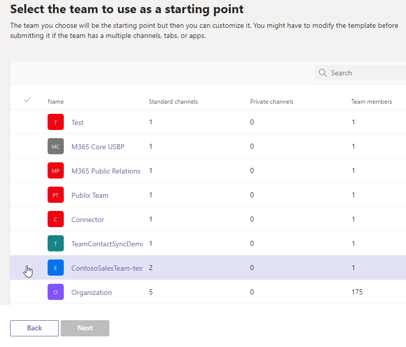

# 在 Microsoft Teams 中从现有团队创建团队模板

[!INCLUDE [preview-feature](includes/preview-feature.md)]

**EDU 客户尚不支持自定义模板。**

Microsoft Teams使你可以从现有团队创建一个模板，该模板可以保存和修改，以满足特定的组织需求。

1. 登录到 Teams 管理中心。

2. 在左侧导航栏中，展开 **Teams** >  **Team 模板**。

3. 选择“**添加**”。

4. 选择 **“使用现有团队作为模板**”，然后选择 **“下一步**”。

 

5. 选择要用作起点的团队，选择团队名称旁边，然后选择 **“下一步**”。

6. 在 **“模板设置”** 部分中，完成以下字段，然后选择 **“下一步**”
    - 模板名称
    - 模板短和长说明
    - 区域设置可见性  
  
7. 在 **频道、选项卡和应用** 部分中，添加团队所需的任何频道和应用。

    1. 在 **“通道** ”部分中，选择 **“添加**”。
    2. 在 **“添加** ”对话框中，将通道命名为名称。
    3. 添加说明。
    4. 确定是否应默认显示通道。
    5. 搜索要添加到通道的应用名称。
    6. 完成后选择 **“应用** ”。

8. 选择 **“提交** ”以保存所做的更改。

新模板显示在 **团队模板** 列表中。 该模板可用于在Teams中创建团队。

> [!Note]
> 团队用户最多可能需要 24 小时才能在库中查看自定义模板。

## 相关文章

- [在管理中心使用团队模板开始](get-started-with-teams-templates-in-the-admin-console.md)
- [从现有团队模板创建模板](create-template-from-existing-template.md)
- [创建团队模板](create-a-team-template.md)
