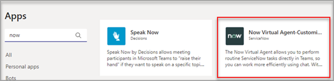

# 在 Microsoft Teams 中自定义应用Customize apps in Microsoft Teams

[!INCLUDE [preview-feature](includes/preview-feature.md)]

 Microsoft Teams 提供应用自定义来增强 Teams 体验。Microsoft Teams provides app customization to enhance the Teams experience. 某些应用开发人员允许 Teams 管理员自定义应用。管理员可以使用 Teams 管理中心"管理应用"页面，根据组织需求自定义或重新设置 **应用属性** 的品牌。Some app developers allow an app to be customized by the Teams admin. The admin can customize or rebrand the app properties based on the organizational needs using the Teams admin center **Manage apps** page. 可以自定义的详细信息包括：The details you can customize are:

- 短名称Short name
- 简短说明Short description
- 完整说明Full description
- 隐私策略 URLPrivacy policy URL
- 网站 URLWebsite URL
- 使用条款 URLTerms of use URL
- 颜色图标Color icon
- "大纲"图标Outline icon
- 主题色Accent color

有关 [可自定义的](https://docs.microsoft.com/microsoftteams/platform/resources/schema/manifest-schema) 字段的详细信息，请参阅 Teams 清单架构。See the [Teams Manifest schema](https://docs.microsoft.com/microsoftteams/platform/resources/schema/manifest-schema) for details about the fields that you can customize.

> [!注意 目前，政府社区云高 (GCCH) 或国防部 (DoD) 不支持自定义应用。[!NOTE Customizing apps isn't supported in Government Community Cloud High (GCCH) or Department of Defense (DoD) at this time.

## 自定义应用的详细信息Customize the app's details

若要开始自定义应用，请完成以下步骤：To start customizing an app, complete the following steps:

1. 登录到 Teams 管理中心。Sign in to the Teams admin center.
2. 展开 **"Teams 应用"** 并选择"**管理应用"。**Expand **Teams Apps** and select **Manage apps**.
3. 检查 **应用列表** 的"可自定义"列，并按可自定义的应用进行排序。Check the **Customizable** column of the apps list and sort by apps that are customizable.

   

   有三个入口点可以访问自定义功能：There are three entry points to access the customize feature:

   - 选择要自定义的应用旁边的 ，然后选择"自定义 **"。**Select next to the app that you want to customize, and then select **Customize**.

     

   - 选择应用名称，然后选择"可 **自定义"。**Select the app name and then **Customizable**.

     

   - 选择应用名称，然后从"操作 **"** 下拉列表中选择 **"自定义** "。Select the app name, and then select **Customize** from the **Actions** dropdown.

     

4. 展开" **详细信息** "部分并自定义以下字段：Expand the **Details** section and customize the following fields:

    - 短名称Short name
    - 简短说明Short description
    - 完整说明Full description
    - 网站Website
    - 隐私策略 URLPrivacy policy URL
    - 使用条款 URLTerms of use URL

   

> [!Note]
> 只有应用开发人员已分配为可自定义的字段将可见。Only the fields that the app developer has assigned as customizable will be visible.

5. 展开" **图标"** 部分。Expand the **Icon** section.

   a.a. 上传图标。Upload an icon. 使用一个全颜色图标 (192x192) PNG 格式的像素。Use one full-color icon (192x192) pixel in PNG format.

   b.b. 选择图标轮廓颜色。Choose an icon outline color. 使用一个 32x32 (32x32) PNG 格式的透明轮廓。Use one transparent outline (32x32) pixel in PNG format.

   c.c. 选择与图标匹配的应用主题色。Select an app accent color that matches the icon.

    

6. 自定义应用后，选择"应用 **"。**Once your app has been customized, select **Apply**.

7. 选择 **"** 发布"以发布自定义应用。Select **Publish** to publish the customized app.

   自定义应用现在列在"管理应用 **"页** 中。The customized app is now listed in your **Manage apps** page. 你将只有一个版本的应用，因为自定义应用功能不会创建应用的副本。You'll have only one version of the app, since customizing the app features doesn't create a copy of the app.

现在，Teams 最终用户可以打开其 Teams 客户端来查看自定义应用。Now your Teams end users can open their Teams client to see the customized app.

   

### 自定义应用的特殊注意事项Special considerations for customizing an app

以下说明包含有关自定义应用的重要详细信息。The following note includes important details about customizing an app.

> [!Note]
> - 自定义应用以及与应用相关的任何说明时，请确保遵循任何自定义指南（如果应用发布者在文档或使用条款中提供）。When you customize apps, and any description related to an app, ensure that you follow any customization guidelines if provided by the app publisher in their documentation or terms of use. 你还有责任尊重他人对可能使用的任何第三方图像的权利。You're also responsible for respecting the rights of others regarding any third-party images you might use.
> - 管理员提供的自定义数据存储在最近的区域。Admin-provided customization data is stored in the nearest region.
> - 你负责确保指向使用条款或隐私策略的链接有效。You are responsible for ensuring that links to terms of use or privacy policy are valid.
> - 如果应用发布者不再允许自定义字段，应用详细信息页上会显示一条消息，通知管理员不再可以自定义的字段。In case the app publisher no longer allows a field to be customizable, a message appears on the app details page notifying the admin about the fields that can't be customized any longer. 对该字段进行的所有更改都将还原为原始值。All the changes made to that field will be reverted to the original values.
> - 更改品牌可能需要最多 24 小时，用户才能看到更改。Changes to branding might require up to 24 hours for the users to see the changes.

## 查看应用详细信息Review app details

你可能希望查看应用详细信息来查看信息。You might want to see the app details to review the information.

1. 登录到 Teams 管理中心。Sign in to the Teams admin center.

2. 展开“**Teams 应用**”，选择“**管理应用**”。Expand **Teams apps** and select **Manage apps**.

3. 选择应用名称。Select the app name.

4. 查看应用详细信息，包括原始应用名称 **发布者的短名称**。View the app details, including the original app name **Short name from publisher**.

   

   只有在 **你更改了** 应用的短名称时，发布者的短名称字段才可见。The **Short name from publisher** field is only visible if you've changed the app's short name.

## 将应用详细信息重置为默认值Reset app details to default

你随时都可以将应用详细信息重置为原始设置。At any time, you can reset the app details to the original settings.

1. 登录到 Teams 管理中心。Sign in to the Teams admin center.

2. 展开 **"Teams 应用"** 并选择"**管理应用"。**Expand **Teams Apps** and select **Manage apps**.

3. 选择应用名称。Select the app name.

4. 从 **"操作"下拉列表中选择\*\*\*\*"重置** 为默认值"。Select **Reset to default** from the **Actions** dropdown.

   

## 常见问题解答Frequently asked questions

**我的用户需要多久来查看自定义应用？****How long will it take for my users to see the customized app?**

虽然管理员可以立即在 Teams 管理中心看到更改，但最终用户最多可能需要 24 小时才能看到更改。Although the admin can immediately see the changes in Teams Admin Center, it might take up to 24 hours for the end users to see the changes.  

**应用提供商是否可为客户自定义应用？****Can the app provider customize the app for its customers?**

 否，租户的管理员需要使用 Teams 管理中心为租户自定义应用。No, the admin of a tenant needs to customize the app for their tenant using the Teams Admin Center.

**自定义应用会自动部署以替换租户中的当前自定义应用吗？****Will the customized app automatically get deployed to replace my current custom app in a tenant?**

否，租户管理员必须手动删除任何自定义应用并发布应用的自定义版本。No, the tenant admins will have to manually remove any custom app and publish the customized version of the app. 如果你已自定义应用并将其发布为自定义应用，则使用应用自定义功能自定义的新应用不会替换当前的自定义应用。If you have customized an app and published it as a custom app, the new app customized using the app customization feature won't replace the current custom app.  

**应用使用情况报告还会显示自定义值（如自定义短名称）吗？****Will the app usage report also show the customized values such as customized short name?**

 否，应用使用情况报告仍将显示从发布者发送的应用的原始名称。No, the app usage report will still show the original name of the app sent from the publisher.

**可以使用应用自定义功能自定义哪些应用？****Which apps can I customize using the app customization feature?**

只能自定义应用发布者允许自定义的应用。You can only customize apps that have been allowed to be customizable by the app publisher. 应用发布者将需要选择加入以允许其客户自定义应用。The app publisher will need to opt in to allow its customers to customize the app.

**自定义属性会显示在图形权限许可屏幕上吗？****Will the customized properties show up on the graph permission consent screen?**

否，权限许可屏幕仍将显示发布者发送的原始值。No, the permission consent screen will still show the original value sent by the publisher.

## 相关文章Related article

- [管理应用Manage apps](manage-apps.md)
- [自定义应用商店Customize your app store](customize-your-app-store.md)
