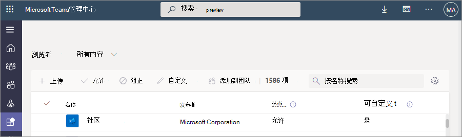

# 自定义组织 Teams 应用商店中应用的外观

Microsoft Teams 允许管理员自定义 Teams 应用，以增强应用商店体验并保留其组织的品牌。 应用开发人员可以允许 Teams 管理员自定义其应用。然后，可以在 Teams 管理中心的“管理应用”页中根据组织需求更新应用属性。 可以自定义的详细信息如下：

* 简短名称
* 简短说明
* 完整描述
* 隐私策略 URL
* 网站 URL
* 使用条款 URL
* 应用程序图标
* 图标的大纲颜色
* 强调色

有关应用的各种元数据字段的信息，请参阅开发人员文档中的 [Teams 清单架构](/microsoftteams/platform/resources/schema/manifest-schema)。

> [!NOTE]
> 不能在任何组织中自定义旁加载的应用。 无法自定义政府社区云高 （GCCH） 或国防部 （DoD） 云中的任何应用。

## 自定义应用的详细信息

若要自定义应用，请完成以下步骤：

1. 登录到 Teams 管理中心。

1. 展开 **Teams 应用** ，然后选择 **[“管理应用](https://admin.teams.microsoft.com/policies/manage-apps)**”。

1. 检查应用列表的“**可自定义**”列，并按可自定义的应用进行排序。

   

   有三个入口点可用于访问自定义功能：

   * 选择要自定义的应用旁边，然后选择 **自定义**。

     

   * 选择应用名称，然后在 **“可自定义”** 中选择编辑图标。

     

   * 选择应用名称，单击悬停在 **“操作** ”上的 **溢出菜单** ，然后选择“自定义”。

     

1. 展开 **“详细信息”** 部分并自定义以下一个或多个字段。 开发人员分配为可自定义的字段可见。

    * 简短名称
    * 简短说明
    * 完整描述
    * 网站
    * 隐私策略 URL
    * 使用条款 URL

   

1. 展开 **“图标** ”部分。

1. 上传图标。 使用 PNG 格式的一个图标 （192 x 192） 像素。

1. 选择图标轮廓颜色。 使用 PNG 格式的透明轮廓 （32x32） 像素。

1. 选择与图标匹配的应用主题色。

   

1. 自定义应用后，选择“ **应用**”。

1. 选择 **“发布** ”以发布自定义应用。

   自定义应用现在列在“ **管理应用** ”页中。 只有一个版本的应用，因为自定义应用功能不会创建应用的副本。

现在，Teams 最终用户可以在其客户端中看到自定义应用。

   

请注意以下有关自定义应用的详细信息：

* 自定义应用以及与应用相关的任何说明时，请确保遵循任何自定义准则（如果由应用发布者在其文档或使用条款中提供）。 你还负责尊重其他人对你可能使用的任何第三方映像的权利。

* 管理员提供的自定义数据存储在最近的区域中。

* 你有责任确保使用条款或隐私策略的链接有效。

* 如果应用发布者不再允许可自定义字段，则应用详细信息页上会显示一条消息，通知管理员无法再自定义的字段。 对该字段所做的所有更改都将还原为原始值。

* 建议在生产环境中进行这些更改之前，先在 Teams 测试租户中测试应用自定义更改。

* 对品牌的更改可能需要长达 24 小时才能传播到所有用户。

* 若要使应用可自定义，开发人员可以提供新版本的应用。 上传新版本并删除以前版本的应用。 如果已自定义应用并将其发布，则使用应用自定义功能自定义的新应用将不会替换当前应用。

* [应用使用情况报](teams-analytics-and-reports/app-usage-report.md) 表显示发布者提供的应用的原始名称。

* Microsoft Graph 权限许可对话框显示发布者提供应用的原始名称。 它可帮助你在向应用提供权限时准确识别应用。

## 查看应用详细信息

你可能想要查看应用详细信息以查看信息。

1. 登录到 Teams 管理中心。

1. 展开 **Teams 应用** ，然后选择 **[“管理应用](https://admin.teams.microsoft.com/policies/manage-apps)**”。

1. 选择应用名称。

1. 查看应用详细信息，包括发布者提供的原始应用名称 **短名称**。

   

   仅当更改了应用的短名称时，**发布者** 字段中的短名称才可见。

## 将应用详细信息重置为默认值

可以将应用详细信息重置为应用开发人员提供的原始值。 该选项仅适用于自定义的应用。

1. 在 Teams 管理中心，访问 **Teams 应用** > **[管理应用](https://admin.teams.microsoft.com/policies/manage-apps)**。

1. 选择应用名称。

1. 从 **“操作** ”菜单中选择 **“重置为默认值”**。

   

## 相关文章

* [管理应用](manage-apps.md)
* [自定义组织的应用商店](customize-your-app-store.md)
* [重新命名应用](https://techcommunity.microsoft.com/t5/microsoft-teams-blog/rebrand-apps-to-your-own-organization-s-branding-with-app/ba-p/2376296)
