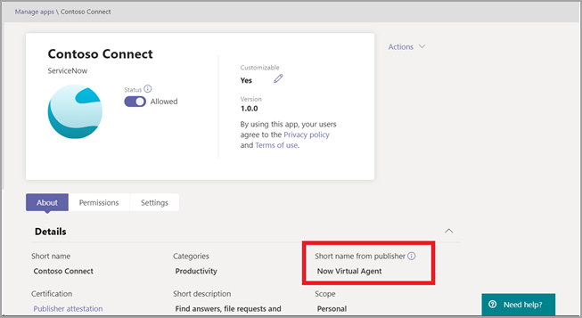

# 自定义应用中Microsoft Teams

 Microsoft Teams应用自定义来增强Teams体验。 某些应用开发人员允许应用由管理员Teams自定义。管理员可以使用管理中心"管理应用"页，根据组织需求自定义或Teams **品牌**。 可以自定义的详细信息包括：

- 短名称
- 简短说明
- 完整说明
- 隐私策略 URL
- 网站 URL
- 使用条款 URL
- 颜色图标
- "大纲"图标
- 主题色

有关[可Teams](/microsoftteams/platform/resources/schema/manifest-schema)字段的详细信息，请参阅清单架构。

> [!NOTE]
> 目前，DoD 政府社区云高 (GCCH) 或国防部 (不支持) 应用。
> 目前，此功能不适用于旁加载Microsoft Teams应用。

## 自定义应用的详细信息

若要开始自定义应用，请完成以下步骤：

1. 登录到 Teams 管理中心。
2. 展开 **Teams应用"，** 然后选择"**管理应用"。**
3. 检查 **应用列表** 的"可自定义"列，并按可自定义的应用进行排序。

   

   有三个入口点可以访问自定义功能：

   - 选择要自定义的应用旁边的 ，然后选择"自定义 **"。**

     

   - 选择应用名称，然后选择"可 **自定义"。**

     

   - 选择应用名称，然后从"操作 **"** 下拉列表中选择 **"自定义** "。

     

4. 展开" **详细信息** "部分并自定义以下字段：

    - 短名称
    - 简短说明
    - 完整说明
    - 网站
    - 隐私策略 URL
    - 使用条款 URL

   

> [!Note]
> 只有应用开发人员已分配为可自定义的字段将可见。

5. 展开" **图标"** 部分。

   a. Upload图标。 使用一个全色图标 (192x192) PNG 格式的像素。

   b. 选择图标轮廓颜色。 使用一个 32x32 (32x32) PNG 格式的透明轮廓。

   c. 选择与图标匹配的应用主题色。

    

6. 自定义应用后，选择"应用 **"。**

7. 选择 **"** 发布"以发布自定义应用。

   自定义应用现在列在"管理应用 **"页** 中。 你将只有一个版本的应用，因为自定义应用功能不会创建应用的副本。

现在Teams最终用户可以打开其 Teams 客户端以查看自定义应用。

   

### 自定义应用的特殊注意事项

以下说明包含有关自定义应用的重要详细信息。

> [!Note]
> - 自定义应用和与应用相关的任何说明时，请确保遵循任何自定义指南（如果应用发布者在文档或使用条款中提供）。 你还有责任尊重他人对可能使用的任何第三方图像的权利。
> - 管理员提供的自定义数据存储在最近的区域。
> - 你负责确保指向使用条款或隐私策略的链接有效。
> - 如果应用发布者不再允许自定义字段，应用详细信息页上会显示一条消息，通知管理员不再可以自定义的字段。 对该字段进行的所有更改都将还原为原始值。
> - 建议在生产环境中执行Teams测试租户中的应用自定义更改。
> - 更改品牌可能需要最多 24 小时，用户才能看到更改。

## 查看应用详细信息

你可能希望查看应用详细信息来查看信息。

1. 登录到 Teams 管理中心。

2. 展开“**Teams 应用**”，选择“**管理应用**”。

3. 选择应用名称。

4. 查看应用详细信息，包括原始应用名称 **发布者的短名称**。

   

   只有在 **你更改了** 应用的短名称时，发布者的短名称字段才可见。

## 将应用详细信息重置为默认值

你随时都可以将应用详细信息重置为原始设置。

1. 登录到 Teams 管理中心。

2. 展开 **Teams应用"，** 然后选择"**管理应用"。**

3. 选择应用名称。

4. 从 **"操作"下拉列表中选择****"重置** 为默认值"。

   

## 常见问题解答

**我的用户需要多久来查看自定义应用？**

虽然管理员可以立即在管理中心Teams更改，但最终用户最多可能需要 24 小时才能看到更改。  

**应用提供商是否可为客户自定义应用？**

 否，租户管理员需要使用管理中心为租户Teams应用。

**自定义应用会自动部署以替换租户中的当前自定义应用吗？**

否，租户管理员必须手动删除任何自定义应用并发布应用的自定义版本。 如果你已自定义应用并将其发布为自定义应用，则使用应用自定义功能自定义的新应用不会替换当前自定义应用。  

**应用使用情况报告还会显示自定义值（如自定义短名称）吗？**

 否，应用使用情况报告仍将显示从发布者发送的应用的原始名称。

**可以使用应用自定义功能自定义哪些应用？**

只能自定义应用发布者允许自定义的应用。 应用发布者需要选择加入以允许其客户自定义应用。

**自定义属性会显示在图形权限许可屏幕上吗？**

否，权限许可屏幕仍将显示发布者发送的原始值。

## 相关文章

- [管理应用](manage-apps.md)
- [自定义应用商店](customize-your-app-store.md)
- [为应用重新品牌](https://techcommunity.microsoft.com/t5/microsoft-teams-blog/rebrand-apps-to-your-own-organization-s-branding-with-app/ba-p/2376296)
