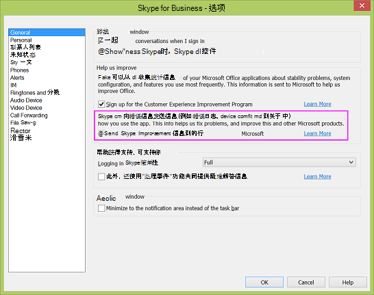

# Skype for Business 和 Microsoft 团队数据收集实践

Skype for business Server 和 skype for business Online，以及 Skype for business 和 Microsoft 团队应用，收集数据，以帮助 Microsoft 了解这些产品的使用情况以及出现的错误类型（如登录错误）。 此信息可帮助我们了解使用模式、规划新功能以及解决问题和解决问题方面的问题。

虽然自动收集某些使用数据，但仅当管理员和/或用户选择允许时，才可以收集其他数据。 数据收集分为以下三个类别：

- 人口普查数据

- 使用情况数据

- 错误报告数据

## 人口普查数据

人口普查数据只是为了提供、支持和改进 Skype for Business 而购买的。 Microsoft 团队和 Skype for business Online。 它包括环境信息（如设备和操作系统版本）以及区域和语言设置。 它还包括用于登录尝试和失败的计数器。 下面是收集的人口统计数据的一些具体示例：

|**数据类型**|**示例**|**注释**|
|:-----|:-----|:-----|
|AppName    |iPhoneSkype    ||
|DeviceModel    |iPhone    ||
|OSName    |iPhoneiOS    ||
|OSVersion    |8.3    ||
|UserLanguage    |EN-US    ||
|UserID    |E296D735-4F36-4E18-7C3B-52E1A02A0164    |该 ID 被散列两次：在客户端和遥测服务上再次执行。 哈希确保 ID 不能链接到特定用户。    |
|Keyroutedeventargs.deviceid    |5E872200-F546-4CCD-8F23-AF5F507AA2DD    |设备 ID 是在设备上随机生成一次并发送到遥测服务的 GUID。    |

人口普查数据不包含任何标识您的组织或用户的信息。 有关详细信息，请参阅[Skype For Business 隐私声明](https://www.microsoft.com/privacystatement/SkypeforBusiness/Default.aspx)。

人口普查数据默认处于打开状态，并且不能由管理员或最终用户关闭。

## 使用情况数据

使用情况数据包括呼叫次数、发送或接收的即时消息数、已加入的会议数、所用功能的频率以及稳定性问题等信息。

使用数据可能包含标识您的组织的信息，例如 contoso.com。 下面是收集的使用数据的一些特定示例：

|**数据类型**|**示例**|**注释**|
|:-----|:-----|:-----|
|发送即时消息    |至    ||
|接收即时消息    |5    ||
|加入会议（尝试）    |5    ||
|加入会议（成功）    |4    ||
|通话/会议分钟数    |30分钟    ||
|FederationPartner    |Microsoft.com    |这是在 Office 365 中注册的组织的名称，以明文形式发送，这意味着不会对其进行模糊处理。    |

使用情况数据不包含任何标识用户的信息。

默认情况下，使用情况数据收集处于打开状态，但本地管理员可以使用 Skype for Business 服务器上的 DisableAutomaticSendTracing 组策略设置将其关闭。 关闭此设置将影响组织中的所有用户。 有关详细信息，请参阅[配置客户端引导策略](/skypeforbusiness/deploy/deploy-clients/configure-client-bootstrapping-policies)。

最终用户无法打开或关闭使用率数据收集。

对于 Skype 会议应用和联接启动器网页，控制遥测的方法是通过此策略：

`Set-CsWebServiceConfiguration -MeetingUxEnableTelemetry $True`

此策略默认为 false，因此遥测集合在默认情况下处于关闭状态。 此设置为每个池，并控制连接到 Skype 会议应用的所有用户与该服务器上托管的会议。

## 错误报告数据

错误报告数据可以包括有关性能和可靠性、设备配置、网络连接质量、错误代码、错误日志和异常的信息。 下面是收集的错误报告数据的一些特定示例：

|**数据类型**|**示例**|**注释**|
|:-----|:-----|:-----|
|邮件方向    |拨    ||
|对话状态    |着    ||
|对话线程 ID    |AdDO8hsJqilU93hQHC3OZaPR2saEA = =    ||
|UserID    |amosmarble   |ID 以明文形式发送，在存储之前遥测服务哈希    |

错误报告数据也可能包含个人身份信息，例如用户的 IP 地址和会话初始协议统一资源标识符（SIP URI）。 有关收集的内容的详细说明，请参阅[Skype For Business 隐私声明](https://www.microsoft.com/privacystatement/SkypeforBusiness/Default.aspx)。

错误报告需要两个事项：

- DisableAutomaticSendTracing 组策略设置在服务器或租户管理中心（这是默认状态）下设置为 False。 有关详细信息，请参阅[配置客户端引导策略](/skypeforbusiness/deploy/deploy-clients/configure-client-bootstrapping-policies)。
    
- 最终用户从 "常规" 选项卡中逐个选择 "（单击的图标），然后在 Skype for business 客户端中**显示"** **常规**"选项卡。
    
 

  
对于 Skype 会议应用，MeetingUxEnableTelemetry 还控制错误报告功能，但在 Windows 上崩溃时，Watson 设置控制上传崩溃信息。 在 "桌面客户端" 对话框中看不到 Skype 会议应用的用户设置。

有关详细信息，请参阅[在 Skype For business 中设置常规选项](https://support.office.com/article/e1a46d3e-dcea-437a-ba7b-6d442a40f439)。

你可以参阅为[Skype for Business Online 设置网络](https://support.office.com/article/81fa5e16-418d-4698-a5f0-e666211c5c66)以设置你的网络。

如果您使用的是由中国的世纪互联运营的 Office 365，请参阅[为由世纪互联运营的 Skype for Business Online 设置网络](https://support.office.com/article/d21f89b0-3afc-432e-b735-036b2432fdbf)。

## 相关主题
[客户体验改善计划](https://www.microsoft.com/products/ceip/default.mspx)

[音频会议和通话套餐的国家/地区可用性](country-and-region-availability-for-audio-conferencing-and-calling-plans/country-and-region-availability-for-audio-conferencing-and-calling-plans.md)
