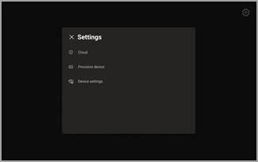
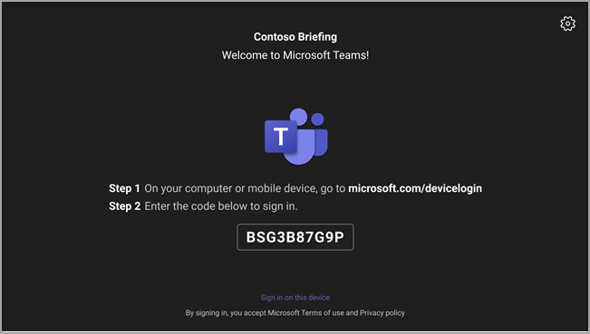

# Android 设备的远程预配Teams登录

IT 管理员可以远程预配并登录到 Teams Android 设备。 若要远程预配设备，管理员需要上传正在预配的设备的 MAC ID 并创建验证码。 整个过程可以从管理中心远程Teams完成。

## 查看支持的设备

以下列表显示了 Android 设备固件要求。

|设备类别|设备模型|固件版本|
|-|-|-|
|Teams手机|Yealink T55/T56/T58|58.15.0.124|
|Teams手机|Yealink VP59|91.15.0.58|
|Teams手机|Yealink CP960|73.15.0.117|
|Teams手机|Yealink MP56/MP54/MP58|122.15.0.36|
|Teams手机|Crestron UC-2|1.0.3.52|
|Teams手机|  Poly Trio C60|  7.0.2.1071|
|Teams手机|  CCX400/CCX500/CCX600    |7.0.2.1072|
|Teams手机|  音频代码 C448HD/C450HD/C470HD|   1.10.120|
|Teams面板|  Crestron 770/1070|  1.004.0115|
|Teams 会议室 Android 上的|Logitech Rally Bar Mini|1.2.982|
|Teams 会议室 Android 上的|Logitech Rally Bar|1.2.982|
|Teams 会议室 Android 上的|AudioCodes RXV80|1.13.361|
|Teams 会议室 Android 上的|EPOS EXPAND Vision 3T|1.2.2.21182.10|
|Teams 会议室 Android 上的|Yealink MeetingBar A30|133.15.0.60|
|Teams 会议室 Android 上的|Yealink MeetingBar A20|133.15.0.60|
|Teams 会议室 Android 上的|Yealink CTP18 触摸控制台|137.15.0.37|
|Teams 会议室 Android 上的|Poly Studio X30|3.5.0.344025|
|Teams 会议室 Android 上的|Poly Studio X50|3.5.0.344025|
|Teams 会议室 Android 上的|Poly TC8 触摸控制台 |3.5.0.210489|
|Teams 会议室 Android 上的|Yealink VC210|118.15.0.54|

## 添加设备 MAC 地址

完成以下步骤以预配新设备。

1. 登录到 Teams 管理中心。
2. 展开 **Teams设备"。**
3. 从 **"操作"选项卡中选择** "预配 **新设备** "。

在 **"预配新设备** "窗口中，可以手动添加 MAC 地址或上传文件。

### 手动添加设备 MAC 地址

1. 在"**正在等待激活"选项卡中**，选择"**添加 MAC ID"。**

   

1. 输入 MAC ID。
1. 输入一个位置，帮助技术人员确定安装设备的位置。
1. 完成后 **，选择"** 应用"。

### Upload文件以添加设备 MAC 地址

1. 在"**正在等待激活"** 选项卡中，Upload **MAC 的 "。**
2. 下载文件模板。
3. 输入 MAC ID 和位置，然后保存文件。
4. **选择文件**，然后选择 **"Upload"。**

## 生成验证码

需要设备的验证码。 验证码以批量或设备级别生成，有效期为 24 小时。

1. 在" **正在等待激活"** 选项卡中，选择现有的 MAC ID。
   为 MAC 地址创建密码，显示在"验证 **码"** 列中。

2. 向现场技术人员提供 MAC ID 和验证码列表。 可以直接在文件中导出详细信息，并与执行实际安装工作的技术人员共享该文件。

## 预配设备

当设备接通电源并连接到网络时，技术人员将设置设备。 这些步骤在设备上Teams完成。

1. 技术人员从"设备 **"列表中选择**"预配 **设置"。**  

   
  
2. 技术人员在提供的输入字段中输入特定于设备的验证码。

   

   成功预配设备后，租户名称会显示在登录页上。

   

## 远程登录

预配的设备显示在"等待 **登录"选项卡** 中。通过选择单个设备启动远程登录过程。

1. 从"等待登录" **选项卡中选择设备** 。

   

2. 按照"登录 **用户"中的说明操作**，然后选择"关闭 **"。**

   

## 相关文章

- [在 Teams 中管理设备](device-management.md)
- [远程Teams更新设备](remote-update.md)
