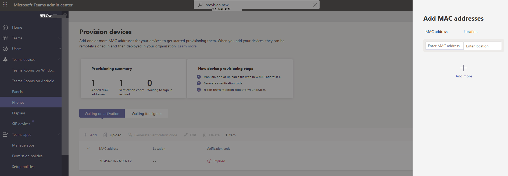

# 远程预配和登录Teams Android设备

IT 管理员可以远程预配和登录到Teams Android设备。 若要远程预配设备，管理员需要上传所预配设备的 MAC ID 并创建验证码。 整个过程可以从Teams管理中心远程完成。

## 查看支持的设备

以下列表显示Android设备固件要求。

|设备类别|设备模型|固件版本|
|---|---|---|
|Teams手机|Yealink T55/T56/T58|58.15.0.124|
|Teams手机|Yealink VP59|91.15.0.58|
|Teams手机|Yealink CP960|73.15.0.117|
|Teams手机|Yealink MP56/MP54/MP58|122.15.0.36|
|Teams手机|Crestron UC-2|1.0.3.52|
|Teams手机|Poly Trio C60|7.0.2.1071|
|Teams手机|CCX400/CCX500/CCX600 |7.0.2.1072|
|Teams手机|音频代码 C448HD/C450HD/C470HD|1.10.120|
|Teams面板|Crestron 770/1070|1.004.0115|
|Android上的Teams 会议室|Logitech Rally Bar Mini|1.2.982|
|Android上的Teams 会议室|Logitech Rally Bar|1.2.982|
|Android上的Teams 会议室|AudioCodes RXV80|1.13.361|
|Android上的Teams 会议室|EPOS EXPAND Vision 3T|1.2.2.21182.10|
|Android上的Teams 会议室|Yealink MeetingBar A30|133.15.0.60|
|Android上的Teams 会议室|Yealink MeetingBar A20|133.15.0.60|
|Android上的Teams 会议室|Yealink CTP18 触摸控制台|137.15.0.37|
|Android上的Teams 会议室|Poly Studio X30|3.5.0.344025|
|Android上的Teams 会议室|Poly Studio X50|3.5.0.344025|
|Android上的Teams 会议室|Poly TC8 触摸控制台 |3.5.0.210489|
|Android上的Teams 会议室|Yealink VC210|118.15.0.54|

## 添加设备 MAC 地址

完成以下步骤以预配新设备。

1. 登录到 Teams 管理中心。
2. 展开 **Teams设备**。
3. 从 **“操作”** 选项卡中选择“**预配新设备**”。

在 **“预配新设备** ”窗口中，可以手动添加 MAC 地址或上传文件。

### 手动添加设备 MAC 地址

1. 在 **“等待激活** ”选项卡中，选择 **“添加 MAC ID**”。

   

1. 输入 MAC ID。
1. 输入一个位置，帮助技术人员确定安装设备的位置。
1. 完成后选择 **“应用** ”。

### Upload文件添加设备 MAC 地址

1. 从 **“等待激活**”选项卡中，选择 **Upload MAC ID**。
2. 下载文件模板。
3. 输入 MAC ID 和位置，然后保存文件。
4. **选择文件**，然后选择 **Upload**。

## 生成验证码

需要设备的验证码。 验证码批量生成或在设备级别生成，有效期为 24 小时。

1. 从 **“等待激活** ”选项卡中，选择现有的 MAC ID。
   为 MAC 地址创建密码，并显示在 **“验证码”** 列中。

2. 向现场技术人员提供 MAC ID 和验证码的列表。 可以直接在文件中导出详细信息，并与正在执行实际安装工作的技术人员共享文件。

## 预配设备

当设备处于启用状态并连接到网络时，技术人员会预配设备。 这些步骤已在Teams设备上完成。

1. 技术人员从 **设置** 中选择 **“预配”设备**。  

   
  
2. 技术人员在提供的输入字段中输入特定于设备的验证码。

   

   成功预配设备后，租户名称将显示在登录页上。

   

## 首次远程登录

预配的设备显示在 **“等待登录**”选项卡中。通过选择单个设备"开始"菜单远程登录过程。

1. 从 **“等待登录** ”选项卡中选择设备。

   

2. 按照 **登录用户** 中的说明操作，然后选择 **“关闭**”。

   

## 相关文章

- [在 Teams 中管理设备](device-management.md)
- [远程登录和注销](remote-sign-in-and-sign-out.md)
- [远程更新Teams设备](remote-update.md)
