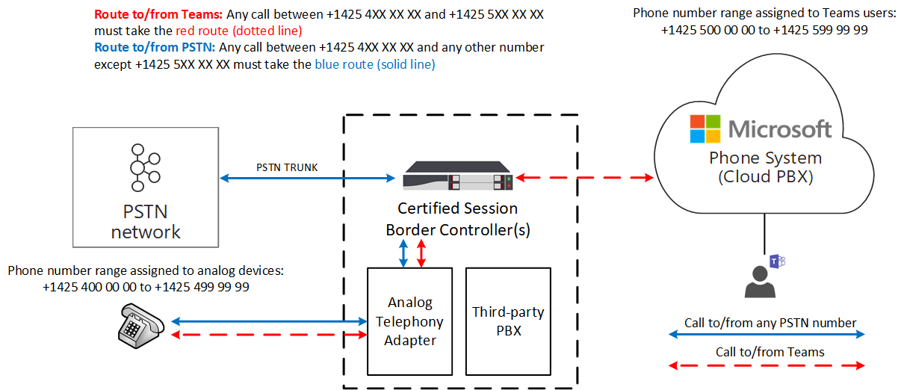

# <a name="how-to-use-analog-devices-with-phone-system-direct-routing"></a>如何将模拟设备与 电话系统直接路由

本文介绍如何将模拟设备与 电话系统直接路由。 若要将模拟设备连接到直接路由，必须使用模拟电话适配器 (ATA) ，并且此适配器必须由经过认证的会话边界控制器 (SBC) 供应商支持。 

当用户从模拟设备进行呼叫时，信号和媒体通过 ATA (ATA) 流到 SBC。  SBC 根据内部路由表Microsoft Teams呼叫发送到 PSTN (公用电话交换网) 呼叫。  当设备进行调用时，它采用的路由取决于为设备创建的路由策略。

下图中配置了直接路由，以便任何 Teams 对 +1425 4XX XX XX 和 +1425 5XX XX XX 之间的数字的调用都必须使用红色路由 (点) ， 与 +1425 4XX XX XX 之间的号码和除号码范围 +1425 5XX XX XX 之外任何其他号码之间的任何 PSTN 呼叫都必须使用蓝色 (实线) 。 

> [!div class="mx-imgBorder"]
> 

## <a name="example--how-to-configure-the-use-of-analog-devices-with-direct-routing"></a>示例：如何使用直接路由配置模拟设备的使用

若要配置通过直接路由使用模拟设备，必须将模拟电话适配器连接到 SBC，并配置 SBC 以使用直接路由。 

此示例指导完成以下步骤：

1. 连接 SBC 到直接路由。
2. 创建 PSTN 使用情况。
3. 创建语音路由并将其与 PSTN 使用情况关联。
4. 将语音路由分配到 PSTN 使用情况。
5. 启用联机用户。
6. 将语音路由策略分配给用户。
7. 为模拟设备创建语音路由。

若要了解如何将 ATA 连接到 SBC 并配置 SBC，请参阅 SBC 制造商配置指南：

- [AudioCodes 配置文档](https://www.audiocodes.com/media/14278/connecting-audiocodes-sbc-with-analog-device-to-microsoft-teams-direct-routing-enterprise-model-configuration-note.pdf)

- [功能区配置文档](https://support.sonus.net/display/UXDOC81/Connect+SBC+Edge+to+Microsoft+Teams+Direct+Routing+to+Support+Analog+Devices)
- [Oracle 配置文档](https://www.oracle.com/technical-resources/documentation/acme-packet.html#Link-MicrosoftTeams)

## <a name="step-1--connect-the-sbc-to-direct-routing"></a>第 1 步  连接 SBC 到直接路由

以下命令配置 SBC 连接，如下所示：

- FQDN sbc.contoso.com
- 信令端口 5068
- 媒体旁路模式
- 已转发到 SBC 的呼叫历史记录信息-
- P-Asserted-Identity (PAI) 标头随调用一起转发 

```powershell
PS C:\> New-CsOnlinePSTNGateway -FQDN sbc.contoso.com -SIPSignalingPort 5068 -ForwardCallHistory $true -ForwardPAI $true -MediaBypass $true -Enabled $true 
```

## <a name="step-2--create-the-pstn-usage"></a>步骤 2：创建 PSTN 使用情况 

下一个命令将创建一个空的 PSTN 使用情况。 联机 PSTN 使用情况是用于呼叫授权的字符串值。 联机 PSTN 使用将联机语音策略链接到路由。 此示例将字符串"互操作"添加到可用 PSTN 使用情况的当前列表。 

```powershell
PS C:\> Set-CsOnlinePstnUsage -Identity global -Usage @{add="Interop"} 
```

## <a name="step-3--create-a-voice-route-and-associate-it-with-the-pstn-usage"></a>步骤 3：创建语音路由并将其与 PSTN 使用情况关联：

此命令为数字范围 +1425 XXX XX XX 创建标识为"模拟互操作"的新在线语音路由。  语音路由适用于联机网关列表，sbc.contoso.com 路由与联机 PSTN 使用情况"互操作"关联。 语音路由包括一个正则表达式，用于标识将通过给定语音路由路由的电话号码：

```powershell
PS C:\> New-CsOnlineVoiceRoute -Identity analog-interop -NumberPattern "^\+1(425)(\d{7})$" -OnlinePstnGatewayList sbc.contoso.com -Priority 1 -OnlinePstnUsages "Interop"
```

## <a name="step-4-assign-the-voice-route-to-the-pstn-usage"></a>步骤 4：将语音路由分配到 PSTN 使用情况：

此命令使用 Identity"AnalogInteropPolicy"创建新的基于用户的联机语音路由策略。 此策略分配有一个在线 PSTN 使用情况："互操作"。

```powershell
PS C:\> New-CsOnlineVoiceRoutingPolicy -Identity "AnalogInteropPolicy" -Name "AnalogInteropPolicy" -OnlinePstnUsages "Interop"
```

## <a name="step-5-enable-the-online-user"></a>步骤 5：启用联机用户

此命令使用 Identity exampleuser@contoso.com 修改用户帐户。 在这种情况下，将修改帐户以启用 企业语音（Microsoft 的 VoIP 实现，已启用语音邮件）并将号码 +14255000000 分配给此用户。  此命令应针对每个用户Teams运行 (公司租户中的 ATA) 用户除外。

```powershell
PS C:\> Set-CsUser -Identity "exampleuser@contoso.com" -EnterpriseVoiceEnabled $True -HostedVoiceMail $True -OnPremLineUri "tel:+14255000000"
```

## <a name="step-6-assign-the-voice-route-policy-to-a-user"></a>步骤 6：将语音路由策略分配给用户

此命令将每个用户的联机语音路由策略 AnalogInteropPolicy 分配给标识为 exampleuser@contoso.com。  此命令应针对每个用户Teams运行 (公司租户中的 ATA) 用户除外。

```powershell
PS C:\> Grant-CsOnlineVoiceRoutingPolicy -Identity "exampleuser@contoso.com" -PolicyName "AnalogInteropPolicy" 
```

## <a name="step-7--create-a-voice-route-for-an-analog-device"></a>步骤 7：为模拟设备创建语音路由

此命令为适用于联机网关列表的编号范围 +1425 4XX XX XX 创建标识为"模拟互操作"的联机语音路由 sbc.contoso.com 并关联到联机 PSTN 使用情况"互操作"。  此命令应该针对具有适当电话号码模式的每个模拟设备运行。 或者，在之前的步骤之一中配置在线语音路由时，可以使用模拟设备的适当数字模式。

```powershell
PS C:\> New-CsOnlineVoiceRoute -Identity analog-interop -NumberPattern "^\+1(4254)(\d{6})$"  -OnlinePstnGatewayList sbc.contoso.com -Priority 1 -OnlinePstnUsages "Interop"
```

## <a name="considerations"></a>注意事项

- 除非另有说明，否则模拟设备是可发送 DTMF 数字以发出呼叫的任何设备。 例如，模拟电话、传真机和开销寻呼机。

- 连接到 ATA 的模拟电话无法从 Teams。 Teams用户必须手动输入与设备关联的电话号码才能呼叫该设备。  
 

## <a name="see-also"></a>另请参阅

[规划直接路由](direct-routing-plan.md)

[配置直接路由](direct-routing-configure.md)
