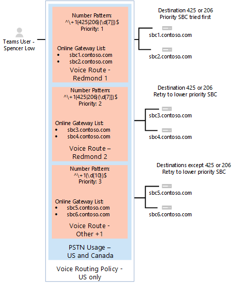

# <a name="configure-direct-routing"></a><span data-ttu-id="b4272-103">配置直接路由</span><span class="sxs-lookup"><span data-stu-id="b4272-103">Configure Direct Routing</span></span>

> [!Tip]
> <span data-ttu-id="b4272-104">观看以下会话，了解直接路由的好处、如何为其规划以及如何部署它： [Microsoft 团队中的直接路由](https://aka.ms/teams-direct-routing)</span><span class="sxs-lookup"><span data-stu-id="b4272-104">Watch the following session to learn about the benefits of Direct Routing, how to plan for it, and how to deploy it: [Direct Routing in Microsoft Teams](https://aka.ms/teams-direct-routing)</span></span>

<span data-ttu-id="b4272-105">如果尚未执行此操作，请阅读 "针对先决条件的[计划直接路由](direct-routing-plan.md)"，并查看配置 Microsoft Phone 系统网络之前需要执行的其他步骤。</span><span class="sxs-lookup"><span data-stu-id="b4272-105">If you have not already done so, read [Plan Direct Routing](direct-routing-plan.md) for prerequisites and to review other steps you’ll need to take before you configure your Microsoft Phone System network.</span></span> 

<span data-ttu-id="b4272-106">本文介绍如何配置 Microsoft Phone 系统直接路由。</span><span class="sxs-lookup"><span data-stu-id="b4272-106">This article describes how to configure Microsoft Phone System Direct Routing.</span></span> <span data-ttu-id="b4272-107">它详细介绍了如何将受支持的会话边界控制器（SBC）配对到直接路由，以及如何将 Microsoft 团队用户配置为使用直接路由连接到公共交换电话网络（PSTN）。</span><span class="sxs-lookup"><span data-stu-id="b4272-107">It details how to pair a supported Session Border Controller (SBC) to Direct Routing and how to configure Microsoft Teams users to use Direct Routing to connect to the Public Switched Telephone Network (PSTN).</span></span> <span data-ttu-id="b4272-108">为了完成本文中介绍的步骤，管理员需要熟悉 PowerShell cmdlet。</span><span class="sxs-lookup"><span data-stu-id="b4272-108">To complete the steps explained in this article, administrators need some familiarity with PowerShell cmdlets.</span></span> <span data-ttu-id="b4272-109">有关使用 PowerShell 的详细信息，请参阅[设置适用于 Windows powershell 的计算机](https://docs.microsoft.com/SkypeForBusiness/set-up-your-computer-for-windows-powershell/set-up-your-computer-for-windows-powershell)。</span><span class="sxs-lookup"><span data-stu-id="b4272-109">For more information about using PowerShell, see [Set up your computer for Windows PowerShell](https://docs.microsoft.com/SkypeForBusiness/set-up-your-computer-for-windows-powershell/set-up-your-computer-for-windows-powershell).</span></span> 

<span data-ttu-id="b4272-110">我们建议你确认你的 SBC 已按照 SBC 供应商的建议进行配置：</span><span class="sxs-lookup"><span data-stu-id="b4272-110">We recommend that you confirm that your SBC has already been configured as recommended by your SBC vendor:</span></span> 

- [<span data-ttu-id="b4272-111">AudioCodes 部署文档</span><span class="sxs-lookup"><span data-stu-id="b4272-111">AudioCodes deployment documentation</span></span>](https://www.audiocodes.com/solutions-products/products/products-for-microsoft-365/direct-routing-for-microsoft-teams)
- [<span data-ttu-id="b4272-112">Oracle 部署文档</span><span class="sxs-lookup"><span data-stu-id="b4272-112">Oracle deployment documentation</span></span>](https://www.oracle.com/industries/communications/enterprise-session-border-controller/microsoft.html)
- [<span data-ttu-id="b4272-113">功能区通信部署文档</span><span class="sxs-lookup"><span data-stu-id="b4272-113">Ribbon Communications deployment documentation</span></span>](https://ribboncommunications.com/solutions/enterprise-solutions/microsoft-solutions/direct-routing-microsoft-teams-calling)
- [<span data-ttu-id="b4272-114">TE-系统（anynode）部署文档</span><span class="sxs-lookup"><span data-stu-id="b4272-114">TE-Systems (anynode) deployment documentation</span></span>](https://www.anynode.de/anynode-and-microsoft-teams/)

<span data-ttu-id="b4272-115">你可以配置 Microsoft Phone 系统并使用户能够使用直接路由，然后通过完成以下过程将 Microsoft 团队设置为首选调用客户端：</span><span class="sxs-lookup"><span data-stu-id="b4272-115">You can configure your Microsoft Phone System and enable users to use Direct Routing, then set up Microsoft Teams as the preferred calling client by completing the following procedures:</span></span> 

- [<span data-ttu-id="b4272-116">将 SBC 与 Microsoft Phone 系统配对并验证配对</span><span class="sxs-lookup"><span data-stu-id="b4272-116">Pair the SBC with a Microsoft Phone System and validate the pairing</span></span>](#pair-the-sbc-to-the-direct-routing-service-of-phone-system)
- [<span data-ttu-id="b4272-117">为用户启用直接路由服务</span><span class="sxs-lookup"><span data-stu-id="b4272-117">Enable users for Direct Routing Service</span></span>](#enable-users-for-direct-routing-service)
- <span data-ttu-id="b4272-118">确保 Microsoft 团队是用户的首选调用客户端</span><span class="sxs-lookup"><span data-stu-id="b4272-118">Ensure that Microsoft Teams is the preferred calling client for the users</span></span>

## <a name="pair-the-sbc-to-the-direct-routing-service-of-phone-system"></a><span data-ttu-id="b4272-119">将 SBC 与电话系统的直接路由服务配对</span><span class="sxs-lookup"><span data-stu-id="b4272-119">Pair the SBC to the Direct Routing Service of Phone System</span></span> 

<span data-ttu-id="b4272-120">下面是让你将 SBC 连接或配对到直接路由接口的三个高级步骤：</span><span class="sxs-lookup"><span data-stu-id="b4272-120">The following are the three high-level steps to let you connect, or pair, the SBC to the Direct Routing interface:</span></span> 

1. <span data-ttu-id="b4272-121">使用 PowerShell 连接到**Skype For Business Online**管理中心</span><span class="sxs-lookup"><span data-stu-id="b4272-121">Connect to **Skype for Business Online** admin center using PowerShell</span></span> 
2. <span data-ttu-id="b4272-122">对 SBC 进行配对</span><span class="sxs-lookup"><span data-stu-id="b4272-122">Pair the SBC</span></span> 
3. <span data-ttu-id="b4272-123">验证配对</span><span class="sxs-lookup"><span data-stu-id="b4272-123">Validate the pairing</span></span> 

### <a name="connect-to-skype-for-business-online-by-using-powershell"></a><span data-ttu-id="b4272-124">使用 PowerShell 连接到 Skype for business Online</span><span class="sxs-lookup"><span data-stu-id="b4272-124">Connect to Skype for Business Online by using PowerShell</span></span> 

<span data-ttu-id="b4272-125">你可以使用连接到租户的 PowerShell 会话将 SBC 与直接路由接口配对。</span><span class="sxs-lookup"><span data-stu-id="b4272-125">You can use a PowerShell session connected to the tenant to pair the SBC to the Direct Routing interface.</span></span> <span data-ttu-id="b4272-126">若要打开 PowerShell 会话，请按照[设置适用于 Windows PowerShell 的计算机](https://docs.microsoft.com/SkypeForBusiness/set-up-your-computer-for-windows-powershell/set-up-your-computer-for-windows-powershell)中概述的步骤进行操作。</span><span class="sxs-lookup"><span data-stu-id="b4272-126">To open a PowerShell session, please follow the steps outlined in [Set up your computer for Windows PowerShell](https://docs.microsoft.com/SkypeForBusiness/set-up-your-computer-for-windows-powershell/set-up-your-computer-for-windows-powershell).</span></span> 
 
<span data-ttu-id="b4272-127">建立远程 PowerShell 会话后，请验证你是否可以看到用于管理 SBC 的命令。</span><span class="sxs-lookup"><span data-stu-id="b4272-127">After you establish a remote PowerShell session, please validate that you can see the commands to manage the SBC.</span></span> <span data-ttu-id="b4272-128">若要验证命令，请在 PowerShell 会话中键入或复制/粘贴以下内容，然后按 Enter：</span><span class="sxs-lookup"><span data-stu-id="b4272-128">To validate the commands, type or copy/paste in the following in the PowerShell session and press Enter:</span></span> 

```PowerShell
Get-Command *onlinePSTNGateway*
```

<span data-ttu-id="b4272-129">你的命令将返回此处所示的4个函数，这些函数将允许你管理 SBC。</span><span class="sxs-lookup"><span data-stu-id="b4272-129">Your command will return the four functions shown here that will let you manage the SBC.</span></span> 

<pre>
CommandType    Name                       Version    Source 
-----------    ----                       -------    ------ 
Function       Get-CsOnlinePSTNGateway    1.0        tmp_v5fiu1no.wxt 
Function       New-CsOnlinePSTNGateway    1.0        tmp_v5fiu1no.wxt 
Function       Remove-CsOnlinePSTNGateway 1.0        tmp_v5fiu1no.wxt 
Function       Set-CsOnlinePSTNGateway    1.0        tmp_v5fiu1no.wxt
</pre>   


### <a name="pair-the-sbc-to-the-tenant"></a><span data-ttu-id="b4272-130">将 SBC 与租户配对</span><span class="sxs-lookup"><span data-stu-id="b4272-130">Pair the SBC to the tenant</span></span> 

<span data-ttu-id="b4272-131">若要将 SBC 与租户配对，请在 PowerShell 会话中键入以下内容，然后按 Enter：</span><span class="sxs-lookup"><span data-stu-id="b4272-131">To pair the SBC to the tenant, in the PowerShell session type the following and press Enter:</span></span> 

```PowerShell
New-CsOnlinePSTNGateway -Fqdn <SBC FQDN> -SipSignalingPort <SBC SIP Port> -MaxConcurrentSessions <Max Concurrent Sessions the SBC can handle> -Enabled $true 
```
  > [!NOTE]
  > 1. <span data-ttu-id="b4272-132">强烈建议使用 SBC 文档中提供的信息，在 SBC 中设置最大通话限制。</span><span class="sxs-lookup"><span data-stu-id="b4272-132">We highly recommend setting a maximum call limit in the SBC, using information that can be found in the SBC documentation.</span></span> <span data-ttu-id="b4272-133">如果 SBC 处于容量级别，则该限制将触发通知。</span><span class="sxs-lookup"><span data-stu-id="b4272-133">The limit will trigger a notification if the SBC is at the capacity level.</span></span>
  > 2. <span data-ttu-id="b4272-134">仅当 FQDN 的域部分与你的租户中注册的一个域（onmicrosoft.com 除外\*）匹配时，你才可以对 SBC 进行配对。</span><span class="sxs-lookup"><span data-stu-id="b4272-134">You can only pair the SBC if the domain portion of its FQDN matches one of the domains registered in your tenant, except \*.onmicrosoft.com.</span></span> <span data-ttu-id="b4272-135">SBC \*FQDN 名称不支持使用 onmicrosoft.com 域名。</span><span class="sxs-lookup"><span data-stu-id="b4272-135">Using \*.onmicrosoft.com domain names is not supported for the SBC FQDN name.</span></span> <span data-ttu-id="b4272-136">例如，如果您有两个域名：</span><span class="sxs-lookup"><span data-stu-id="b4272-136">For example, if you have two domain names:</span></span><br/><br/>
  > <span data-ttu-id="b4272-137">**contoso**</span><span class="sxs-lookup"><span data-stu-id="b4272-137">**contoso**.com</span></span><br/><span data-ttu-id="b4272-138">\*\*\*\* onmicrosoft.com</span><span class="sxs-lookup"><span data-stu-id="b4272-138">**contoso**.onmicrosoft.com</span></span><br/><br/>
  > <span data-ttu-id="b4272-139">对于 SBC 名称，你可以使用名称 sbc.contoso.com。</span><span class="sxs-lookup"><span data-stu-id="b4272-139">For the SBC name, you can use the name sbc.contoso.com.</span></span> <span data-ttu-id="b4272-140">如果你尝试将 SBC 与名称 SBC 对应，则系统将不会允许你，因为域不属于此租户。</span><span class="sxs-lookup"><span data-stu-id="b4272-140">If you try to pair the SBC with a name sbc.contoso.abc, the system will not let you, as the domain is not owned by this tenant.</span></span><br/>
  > <span data-ttu-id="b4272-141">除了在租户中注册的域，还必须有一个具有该域的用户以及分配的 E3 或 E5 许可证。</span><span class="sxs-lookup"><span data-stu-id="b4272-141">In addition to the domain registered in your tenant, it is important that there is a user with that domain and an assigned E3 or E5 license.</span></span> <span data-ttu-id="b4272-142">如果不是，您将收到以下错误：</span><span class="sxs-lookup"><span data-stu-id="b4272-142">If not, you will receive the following error:</span></span><br/>
  <span data-ttu-id="b4272-143">`Can not use the “sbc.contoso.com” domain as it was not configured for this tenant`.</span><span class="sxs-lookup"><span data-stu-id="b4272-143">`Can not use the “sbc.contoso.com” domain as it was not configured for this tenant`.</span></span>

```PowerShell
New-CsOnlinePSTNGateway -Identity sbc.contoso.com -Enabled $true -SipSignalingPort 5067 -MaxConcurrentSessions 100 
```
<span data-ttu-id="b4272-144">返回</span><span class="sxs-lookup"><span data-stu-id="b4272-144">Returns:</span></span>
<pre>
Identity              : sbc.contoso.com 
Fqdn                  : sbc.contoso.com 
SipSignalingPort     : 5067 
FailoverTimeSeconds   : 10 
ForwardCallHistory    : False 
ForwardPai            : False 
SendSipOptions        : True 
MaxConcurrentSessions : 100 
Enabled               : True   
</pre>
<span data-ttu-id="b4272-145">在配对过程中，可以设置其他选项。</span><span class="sxs-lookup"><span data-stu-id="b4272-145">There are additional options that can be set during the pairing process.</span></span> <span data-ttu-id="b4272-146">但是，在前面的示例中，仅显示所需的最低参数。</span><span class="sxs-lookup"><span data-stu-id="b4272-146">In the previous example, however, only the minimum required parameters are shown.</span></span> 
 
<span data-ttu-id="b4272-147">下表列出了可在为```New-CsOnlinePstnGateway```设置参数时使用的其他参数。</span><span class="sxs-lookup"><span data-stu-id="b4272-147">The following table lists the additional parameters that you can use in setting parameters for ```New-CsOnlinePstnGateway```.</span></span>

|<span data-ttu-id="b4272-148">必填？</span><span class="sxs-lookup"><span data-stu-id="b4272-148">Required?</span></span>|<span data-ttu-id="b4272-149">名称</span><span class="sxs-lookup"><span data-stu-id="b4272-149">Name</span></span>|<span data-ttu-id="b4272-150">描述</span><span class="sxs-lookup"><span data-stu-id="b4272-150">Description</span></span>|<span data-ttu-id="b4272-151">默认值</span><span class="sxs-lookup"><span data-stu-id="b4272-151">Default</span></span>|<span data-ttu-id="b4272-152">可能的值</span><span class="sxs-lookup"><span data-stu-id="b4272-152">Possible values</span></span>|<span data-ttu-id="b4272-153">类型和限制</span><span class="sxs-lookup"><span data-stu-id="b4272-153">Type and restrictions</span></span>|
|:-----|:-----|:-----|:-----|:-----|:-----|
|<span data-ttu-id="b4272-154">是</span><span class="sxs-lookup"><span data-stu-id="b4272-154">Yes</span></span>|<span data-ttu-id="b4272-155">FQDN</span><span class="sxs-lookup"><span data-stu-id="b4272-155">FQDN</span></span>|<span data-ttu-id="b4272-156">SBC 的 FQDN 名称</span><span class="sxs-lookup"><span data-stu-id="b4272-156">The FQDN name of the SBC</span></span> |<span data-ttu-id="b4272-157">无</span><span class="sxs-lookup"><span data-stu-id="b4272-157">None</span></span>|<span data-ttu-id="b4272-158">NoneFQDN 名称，限制63个字符</span><span class="sxs-lookup"><span data-stu-id="b4272-158">NoneFQDN name, limit 63 characters</span></span>|<span data-ttu-id="b4272-159">字符串、[适用于计算机、域、网站和 ou 的 Active Directory 中的命名约定](https://support.microsoft.com/help/909264)的允许和不允许的字符列表</span><span class="sxs-lookup"><span data-stu-id="b4272-159">String, list of allowed and disallowed characters on [Naming conventions in Active Directory for computers, domains, sites, and OUs](https://support.microsoft.com/help/909264)</span></span>|
|<span data-ttu-id="b4272-160">否</span><span class="sxs-lookup"><span data-stu-id="b4272-160">No</span></span>|<span data-ttu-id="b4272-161">MediaBypass</span><span class="sxs-lookup"><span data-stu-id="b4272-161">MediaBypass</span></span> |<span data-ttu-id="b4272-162">指示 SBC 的参数支持媒体绕过，并且管理员希望使用它。</span><span class="sxs-lookup"><span data-stu-id="b4272-162">Parameter indicated of the SBC supports Media Bypass and the administrator wants to use it.</span></span>|<span data-ttu-id="b4272-163">无</span><span class="sxs-lookup"><span data-stu-id="b4272-163">None</span></span>|<span data-ttu-id="b4272-164">True</span><span class="sxs-lookup"><span data-stu-id="b4272-164">True</span></span><br/><span data-ttu-id="b4272-165">False</span><span class="sxs-lookup"><span data-stu-id="b4272-165">False</span></span>|<span data-ttu-id="b4272-166">Boolean</span><span class="sxs-lookup"><span data-stu-id="b4272-166">Boolean</span></span>|
|<span data-ttu-id="b4272-167">是</span><span class="sxs-lookup"><span data-stu-id="b4272-167">Yes</span></span>|<span data-ttu-id="b4272-168">SipSignalingPort</span><span class="sxs-lookup"><span data-stu-id="b4272-168">SipSignalingPort</span></span> |<span data-ttu-id="b4272-169">用于通过使用传输层安全性（TLS）协议与直接路由服务进行通信的侦听端口。</span><span class="sxs-lookup"><span data-stu-id="b4272-169">Listening port used for communicating with Direct Routing services by using the Transport Layer Security (TLS) protocol.</span></span>|<span data-ttu-id="b4272-170">无</span><span class="sxs-lookup"><span data-stu-id="b4272-170">None</span></span>|<span data-ttu-id="b4272-171">任何端口</span><span class="sxs-lookup"><span data-stu-id="b4272-171">Any port</span></span>|<span data-ttu-id="b4272-172">0到65535</span><span class="sxs-lookup"><span data-stu-id="b4272-172">0 to 65535</span></span> |
|<span data-ttu-id="b4272-173">否</span><span class="sxs-lookup"><span data-stu-id="b4272-173">No</span></span>|<span data-ttu-id="b4272-174">FailoverTimeSeconds</span><span class="sxs-lookup"><span data-stu-id="b4272-174">FailoverTimeSeconds</span></span> |<span data-ttu-id="b4272-175">设置为10（默认值）时，在10秒内网关未接听的出站呼叫将被路由到下一个可用的中继;如果没有其他中继，则会自动删除呼叫。</span><span class="sxs-lookup"><span data-stu-id="b4272-175">When set to 10 (default value), outbound calls that are not answered by the gateway within 10 seconds are routed to the next available trunk; if there are no additional trunks, then the call is automatically dropped.</span></span> <span data-ttu-id="b4272-176">在网络和网关响应较慢的组织中，这可能会导致不必要地放弃一些呼叫。</span><span class="sxs-lookup"><span data-stu-id="b4272-176">In an organization with slow networks and gateway responses, that could potentially result in calls being dropped unnecessarily.</span></span> <span data-ttu-id="b4272-177">默认值为10。</span><span class="sxs-lookup"><span data-stu-id="b4272-177">The default value is 10.</span></span>|<span data-ttu-id="b4272-178">10</span><span class="sxs-lookup"><span data-stu-id="b4272-178">10</span></span>|<span data-ttu-id="b4272-179">数字</span><span class="sxs-lookup"><span data-stu-id="b4272-179">Number</span></span>|<span data-ttu-id="b4272-180">整形</span><span class="sxs-lookup"><span data-stu-id="b4272-180">Int</span></span>|
|<span data-ttu-id="b4272-181">否</span><span class="sxs-lookup"><span data-stu-id="b4272-181">No</span></span>|<span data-ttu-id="b4272-182">ForwardCallHistory</span><span class="sxs-lookup"><span data-stu-id="b4272-182">ForwardCallHistory</span></span> |<span data-ttu-id="b4272-183">指示是否通过中继转移呼叫历史记录信息。</span><span class="sxs-lookup"><span data-stu-id="b4272-183">Indicates whether call history information will be forwarded through the trunk.</span></span> <span data-ttu-id="b4272-184">如果启用，则 Office 365 PSTN 代理将发送两个标头：历史记录信息和引用者。</span><span class="sxs-lookup"><span data-stu-id="b4272-184">If enabled, the Office 365 PSTN Proxy sends two headers: History-info and Referred-By.</span></span> <span data-ttu-id="b4272-185">默认值为**False** （$False）。</span><span class="sxs-lookup"><span data-stu-id="b4272-185">The default value is **False** ($False).</span></span> |<span data-ttu-id="b4272-186">False</span><span class="sxs-lookup"><span data-stu-id="b4272-186">False</span></span>|<span data-ttu-id="b4272-187">True</span><span class="sxs-lookup"><span data-stu-id="b4272-187">True</span></span><br/><span data-ttu-id="b4272-188">False</span><span class="sxs-lookup"><span data-stu-id="b4272-188">False</span></span>|<span data-ttu-id="b4272-189">Boolean</span><span class="sxs-lookup"><span data-stu-id="b4272-189">Boolean</span></span>|
|<span data-ttu-id="b4272-190">否</span><span class="sxs-lookup"><span data-stu-id="b4272-190">No</span></span>|<span data-ttu-id="b4272-191">ForwardPAI</span><span class="sxs-lookup"><span data-stu-id="b4272-191">ForwardPAI</span></span>|<span data-ttu-id="b4272-192">指示 P-Asserted-Identity (PAI) 标头是否随呼叫一起转移。</span><span class="sxs-lookup"><span data-stu-id="b4272-192">Indicates whether the P-Asserted-Identity (PAI) header will be forwarded along with the call.</span></span> <span data-ttu-id="b4272-193">PAI 标头提供了一种验证呼叫者身份的方法。</span><span class="sxs-lookup"><span data-stu-id="b4272-193">The PAI header provides a way to verify the identity of the caller.</span></span> <span data-ttu-id="b4272-194">如果启用，则隐私： ID 标头也会发送。</span><span class="sxs-lookup"><span data-stu-id="b4272-194">If enabled the Privacy:ID header will also be sent.</span></span> <span data-ttu-id="b4272-195">默认值为**False** （$False）。</span><span class="sxs-lookup"><span data-stu-id="b4272-195">The default value is **False** ($False).</span></span>|<span data-ttu-id="b4272-196">False</span><span class="sxs-lookup"><span data-stu-id="b4272-196">False</span></span>|<span data-ttu-id="b4272-197">True</span><span class="sxs-lookup"><span data-stu-id="b4272-197">True</span></span><br/><span data-ttu-id="b4272-198">False</span><span class="sxs-lookup"><span data-stu-id="b4272-198">False</span></span>|<span data-ttu-id="b4272-199">Boolean</span><span class="sxs-lookup"><span data-stu-id="b4272-199">Boolean</span></span>|
|<span data-ttu-id="b4272-200">否</span><span class="sxs-lookup"><span data-stu-id="b4272-200">No</span></span>|<span data-ttu-id="b4272-201">SendSIPOptions</span><span class="sxs-lookup"><span data-stu-id="b4272-201">SendSIPOptions</span></span> |<span data-ttu-id="b4272-202">定义 SBC 是否将发送 SIP 选项。</span><span class="sxs-lookup"><span data-stu-id="b4272-202">Defines if an SBC will or will not send the SIP options.</span></span> <span data-ttu-id="b4272-203">如果禁用，将从监视和通知系统中排除 SBC。</span><span class="sxs-lookup"><span data-stu-id="b4272-203">If disabled, the SBC will be excluded from Monitoring and Alerting system.</span></span> <span data-ttu-id="b4272-204">强烈建议你启用 SIP 选项。</span><span class="sxs-lookup"><span data-stu-id="b4272-204">We highly recommend that you enable SIP options.</span></span> <span data-ttu-id="b4272-205">默认值为**True**。</span><span class="sxs-lookup"><span data-stu-id="b4272-205">Default value is **True**.</span></span> |<span data-ttu-id="b4272-206">True</span><span class="sxs-lookup"><span data-stu-id="b4272-206">True</span></span>|<span data-ttu-id="b4272-207">True</span><span class="sxs-lookup"><span data-stu-id="b4272-207">True</span></span><br/><span data-ttu-id="b4272-208">False</span><span class="sxs-lookup"><span data-stu-id="b4272-208">False</span></span>|<span data-ttu-id="b4272-209">Boolean</span><span class="sxs-lookup"><span data-stu-id="b4272-209">Boolean</span></span>|
|<span data-ttu-id="b4272-210">否</span><span class="sxs-lookup"><span data-stu-id="b4272-210">No</span></span>|<span data-ttu-id="b4272-211">MaxConcurrentSessions</span><span class="sxs-lookup"><span data-stu-id="b4272-211">MaxConcurrentSessions</span></span> |<span data-ttu-id="b4272-212">由警报系统使用。</span><span class="sxs-lookup"><span data-stu-id="b4272-212">Used by alerting system.</span></span> <span data-ttu-id="b4272-213">如果设置了任何值，则当并发会话的数量为90% 或高于此值时，警报系统将向租户管理员生成警报。</span><span class="sxs-lookup"><span data-stu-id="b4272-213">When any value is set, the alerting system will generate an alert to the tenant administrator when the number of concurrent session is 90% or higher than this value.</span></span> <span data-ttu-id="b4272-214">如果未设置参数，则不会生成警报。</span><span class="sxs-lookup"><span data-stu-id="b4272-214">If parameter is not set, the alerts are not generated.</span></span> <span data-ttu-id="b4272-215">但是，监视系统将每隔24小时报告并发会话的数量。</span><span class="sxs-lookup"><span data-stu-id="b4272-215">However, the monitoring system will report number of concurrent session every 24 hours.</span></span> |<span data-ttu-id="b4272-216">Null</span><span class="sxs-lookup"><span data-stu-id="b4272-216">Null</span></span>|<span data-ttu-id="b4272-217">Null</span><span class="sxs-lookup"><span data-stu-id="b4272-217">Null</span></span><br/><span data-ttu-id="b4272-218">1到100000</span><span class="sxs-lookup"><span data-stu-id="b4272-218">1 to 100,000</span></span> ||
|<span data-ttu-id="b4272-219">否</span><span class="sxs-lookup"><span data-stu-id="b4272-219">No</span></span>|<span data-ttu-id="b4272-220">MediaRelayRoutingLocationOverride</span><span class="sxs-lookup"><span data-stu-id="b4272-220">MediaRelayRoutingLocationOverride</span></span> |<span data-ttu-id="b4272-221">允许手动选择媒体的路径。</span><span class="sxs-lookup"><span data-stu-id="b4272-221">Allows selecting path for media manually.</span></span> <span data-ttu-id="b4272-222">直接路由根据 SBC 的公共 IP 为媒体路径分配一个数据中心。</span><span class="sxs-lookup"><span data-stu-id="b4272-222">Direct Routing assigns a datacenter for media path based on the public IP of the SBC.</span></span> <span data-ttu-id="b4272-223">我们始终选择最接近于 SBC 数据中心的数据。</span><span class="sxs-lookup"><span data-stu-id="b4272-223">We always select closest to the SBC datacenter.</span></span> <span data-ttu-id="b4272-224">但是，在某些情况下，可以将美国范围的公共 IP 分配给位于欧洲的 SBC。</span><span class="sxs-lookup"><span data-stu-id="b4272-224">However, in some cases a public IP from for example a US range can be assigned to an SBC located in Europe.</span></span> <span data-ttu-id="b4272-225">在这种情况下，我们将使用非最佳媒体路径。</span><span class="sxs-lookup"><span data-stu-id="b4272-225">In this case we will be using not optimal media path.</span></span> <span data-ttu-id="b4272-226">此参数允许手动设置媒体流量的首选区域。</span><span class="sxs-lookup"><span data-stu-id="b4272-226">This parameter allows manually set the preferred region for media traffic.</span></span> <span data-ttu-id="b4272-227">仅当通话记录明确指明 "自动分配媒体路径的数据中心" 不会向 SBC 数据中心分配最接近的数据中心时，我们才建议设置此参数。</span><span class="sxs-lookup"><span data-stu-id="b4272-227">We only recommend setting this parameter if the call logs clearly indicate that automatic assignment of the datacenter for media path does not assign the closest to the SBC datacenter.</span></span> |<span data-ttu-id="b4272-228">无</span><span class="sxs-lookup"><span data-stu-id="b4272-228">None</span></span>|<span data-ttu-id="b4272-229">ISO 格式的国家代码</span><span class="sxs-lookup"><span data-stu-id="b4272-229">Country codes in ISO format</span></span>||
|<span data-ttu-id="b4272-230">否</span><span class="sxs-lookup"><span data-stu-id="b4272-230">No</span></span>|<span data-ttu-id="b4272-231">已启用</span><span class="sxs-lookup"><span data-stu-id="b4272-231">Enabled</span></span>|<span data-ttu-id="b4272-232">用于为出站呼叫启用此 SBC。</span><span class="sxs-lookup"><span data-stu-id="b4272-232">Used to enable this SBC for outbound calls.</span></span> <span data-ttu-id="b4272-233">可用于在其更新或维护期间临时删除 SBC。</span><span class="sxs-lookup"><span data-stu-id="b4272-233">Can be used to temporarily remove the SBC, while it is being updated or during maintenance.</span></span> |<span data-ttu-id="b4272-234">False</span><span class="sxs-lookup"><span data-stu-id="b4272-234">False</span></span>|<span data-ttu-id="b4272-235">True</span><span class="sxs-lookup"><span data-stu-id="b4272-235">True</span></span><br/><span data-ttu-id="b4272-236">False</span><span class="sxs-lookup"><span data-stu-id="b4272-236">False</span></span>|<span data-ttu-id="b4272-237">Boolean</span><span class="sxs-lookup"><span data-stu-id="b4272-237">Boolean</span></span>|
 
### <a name="verify-the-sbc-pairing"></a><span data-ttu-id="b4272-238">验证 SBC 配对</span><span class="sxs-lookup"><span data-stu-id="b4272-238">Verify the SBC pairing</span></span> 

<span data-ttu-id="b4272-239">验证连接：</span><span class="sxs-lookup"><span data-stu-id="b4272-239">Verify the connection:</span></span> 
- <span data-ttu-id="b4272-240">检查 SBC 是否在成对的 SBCs 的列表中。</span><span class="sxs-lookup"><span data-stu-id="b4272-240">Check if the SBC is on the list of paired SBCs.</span></span> 
- <span data-ttu-id="b4272-241">验证 SIP 选项。</span><span class="sxs-lookup"><span data-stu-id="b4272-241">Validate SIP Options.</span></span> 
 
#### <a name="validate-if-the-sbc-is-on-the-list-of-paired-sbcs"></a><span data-ttu-id="b4272-242">验证 SBC 是否位于成对的 SBCs 的列表中</span><span class="sxs-lookup"><span data-stu-id="b4272-242">Validate if the SBC is on the list of paired SBCs</span></span> 

<span data-ttu-id="b4272-243">对 SBC 进行配对后，通过在远程 PowerShell 会话中运行以下命令验证 SBC 是否存在于成对的 SBCs 列表中：`Get-CSOnlinePSTNGateway`</span><span class="sxs-lookup"><span data-stu-id="b4272-243">After you pair the SBC, validate that the SBC is present in the list of paired SBCs by running the following command in a remote PowerShell session: `Get-CSOnlinePSTNGateway`</span></span>

<span data-ttu-id="b4272-244">配对网关应显示在列表中，如下面的示例所示，并验证**Enabled**参数是否显示值**True**。</span><span class="sxs-lookup"><span data-stu-id="b4272-244">The paired gateway should appear in the list as shown in the example below, and verify that the **Enabled** parameter  displays a value of **True**.</span></span> <span data-ttu-id="b4272-245">键</span><span class="sxs-lookup"><span data-stu-id="b4272-245">Enter:</span></span>

```PowerShell
Get-CsOnlinePSTNGateway -Identity sbc.contoso.com  
```
<span data-ttu-id="b4272-246">返回：</span><span class="sxs-lookup"><span data-stu-id="b4272-246">Which returns:</span></span>
<pre>
Identity              : sbc.contoso.com  
Fqdn                  : sbc.contoso.com 
SipSignalingPort     : 5067 
CodecPriority         : SILKWB,SILKNB,PCMU,PCMA 
ExcludedCodecs        :  
FailoverTimeSeconds   : 10 
ForwardCallHistory    : False 
ForwardPai            : False 
SendSipOptions        : True 
MaxConcurrentSessions : 100 
Enabled               : True 
</pre>

#### <a name="validate-sip-options-flow"></a><span data-ttu-id="b4272-247">验证 SIP 选项流</span><span class="sxs-lookup"><span data-stu-id="b4272-247">Validate SIP Options flow</span></span> 

<span data-ttu-id="b4272-248">若要使用传出 SIP 选项验证配对，请使用 SBC 管理界面并确认 SBC 是否收到对其传出选项消息的 200 OK 响应。</span><span class="sxs-lookup"><span data-stu-id="b4272-248">To validate the pairing using outgoing SIP Options, use the SBC management interface and confirm that the SBC receives 200 OK responses to its outgoing OPTIONS messages.</span></span>

<span data-ttu-id="b4272-249">当直接路由看到传入选项时，它将向 "传入选项" 消息的 "联系人标题" 字段中配置的 SBC FQDN 开始发送传出 SIP 选项消息。</span><span class="sxs-lookup"><span data-stu-id="b4272-249">When Direct Routing sees incoming OPTIONS, it will start sending outgoing SIP Options messages to the SBC FQDN configured in the Contact header field in the incoming OPTIONS message.</span></span> 

<span data-ttu-id="b4272-250">若要使用传入 SIP 选项验证配对，请使用 SBC 管理接口，并查看 SBC 是否向来自直接路由的选项消息发送回复，并且它发送的响应代码为 200 OK。</span><span class="sxs-lookup"><span data-stu-id="b4272-250">To validate the pairing using incoming SIP Options, use the SBC management interface and see that the SBC sends a reply to the OPTIONS messages coming in from Direct Routing and that the response code it sends is 200 OK.</span></span>

## <a name="enable-users-for-direct-routing-service"></a><span data-ttu-id="b4272-251">为用户启用直接路由服务</span><span class="sxs-lookup"><span data-stu-id="b4272-251">Enable users for Direct Routing Service</span></span> 

<span data-ttu-id="b4272-252">准备好为直接路由服务用户启用用户时，请按照下列步骤操作：</span><span class="sxs-lookup"><span data-stu-id="b4272-252">When you are ready to enable users for the Direct Routing Service, follow these steps:</span></span> 

1. <span data-ttu-id="b4272-253">在 Office 365 中创建用户并分配电话系统许可证。</span><span class="sxs-lookup"><span data-stu-id="b4272-253">Create a user in Office 365 and assign a phone system license.</span></span> 
2. <span data-ttu-id="b4272-254">确保用户托管在 Skype for Business Online 中。</span><span class="sxs-lookup"><span data-stu-id="b4272-254">Ensure that the user is homed in Skype for Business Online.</span></span> 
3. <span data-ttu-id="b4272-255">配置电话号码并启用企业语音和语音邮件。</span><span class="sxs-lookup"><span data-stu-id="b4272-255">Configure the phone number and enable enterprise voice and voicemail.</span></span> 
4. <span data-ttu-id="b4272-256">配置语音路由。</span><span class="sxs-lookup"><span data-stu-id="b4272-256">Configure voice routing.</span></span> <span data-ttu-id="b4272-257">将自动验证该路线。</span><span class="sxs-lookup"><span data-stu-id="b4272-257">The route is automatically validated.</span></span>

### <a name="create-a-user-in-office-365-and-assign-the-license"></a><span data-ttu-id="b4272-258">在 Office 365 中创建用户并分配许可证</span><span class="sxs-lookup"><span data-stu-id="b4272-258">Create a user in Office 365 and assign the license</span></span> 

<span data-ttu-id="b4272-259">在 Office 365 中创建新用户有两个选项。</span><span class="sxs-lookup"><span data-stu-id="b4272-259">There are two options for creating a new user in Office 365.</span></span> <span data-ttu-id="b4272-260">但是，我们建议你的组织选择并使用一个选项来避免路由问题：</span><span class="sxs-lookup"><span data-stu-id="b4272-260">However, we recommend that your organization select and use one option to avoid routing issues:</span></span> 

- <span data-ttu-id="b4272-261">在本地 Active Directory 中创建用户并将用户同步到云。</span><span class="sxs-lookup"><span data-stu-id="b4272-261">Create the user in on-premises Active Directory and sync the user to the cloud.</span></span> <span data-ttu-id="b4272-262">请参阅[将本地目录与 Azure Active Directory 集成](https://docs.microsoft.com/azure/active-directory/connect/active-directory-aadconnect)。</span><span class="sxs-lookup"><span data-stu-id="b4272-262">See [Integrate your on-premises directories with Azure Active Directory](https://docs.microsoft.com/azure/active-directory/connect/active-directory-aadconnect).</span></span>
- <span data-ttu-id="b4272-263">直接在 Office 365 管理员门户中创建用户。</span><span class="sxs-lookup"><span data-stu-id="b4272-263">Create the user directly in the Office 365 Administrator Portal.</span></span> <span data-ttu-id="b4272-264">请参阅[向 Office 365 单独或批量添加用户-管理员帮助](https://support.office.com/article/Add-users-individually-or-in-bulk-to-Office-365-Admin-Help-1970f7d6-03b5-442f-b385-5880b9c256ec)。</span><span class="sxs-lookup"><span data-stu-id="b4272-264">See [Add users individually or in bulk to Office 365 - Admin Help](https://support.office.com/article/Add-users-individually-or-in-bulk-to-Office-365-Admin-Help-1970f7d6-03b5-442f-b385-5880b9c256ec).</span></span> 

<span data-ttu-id="b4272-265">如果您的 Skype for Business Online 部署与 Skype for business 2015 或 Lync 2010/2013 本地部署并存，则唯一支持的选项是在本地 Active Directory 中创建用户并将用户与云同步（选项1）。</span><span class="sxs-lookup"><span data-stu-id="b4272-265">If your Skype for Business Online deployment co-exists with Skype for Business 2015 or Lync 2010/2013 on-premises, the only supported option is to create the user in on-premises Active Directory and sync the user to the cloud (Option 1).</span></span> 

<span data-ttu-id="b4272-266">有关许可证要求的信息，请参阅[计划直接路由](direct-routing-plan.md)中的[许可和其他要求](direct-routing-plan.md#licensing-and-other-requirements)。</span><span class="sxs-lookup"><span data-stu-id="b4272-266">For information about license requirements, see [licensing and other requirements](direct-routing-plan.md#licensing-and-other-requirements) in [Plan Direct Routing](direct-routing-plan.md).</span></span>

### <a name="ensure-that-the-user-is-homed-in-skype-for-business-online"></a><span data-ttu-id="b4272-267">确保用户托管在 Skype for Business Online 中</span><span class="sxs-lookup"><span data-stu-id="b4272-267">Ensure that the user is homed in Skype for Business Online</span></span> 

<span data-ttu-id="b4272-268">直接路由要求用户驻留在 Skype for Business Online 中。</span><span class="sxs-lookup"><span data-stu-id="b4272-268">Direct Routing requires the user to be homed in Skype for Business Online.</span></span> <span data-ttu-id="b4272-269">你可以通过查看 RegistrarPool 参数来检查此情况。</span><span class="sxs-lookup"><span data-stu-id="b4272-269">You can check this by looking at the RegistrarPool parameter.</span></span> <span data-ttu-id="b4272-270">它需要在 infra.lync.com 域中具有值。</span><span class="sxs-lookup"><span data-stu-id="b4272-270">It needs to have a value in the infra.lync.com domain.</span></span>

1. <span data-ttu-id="b4272-271">连接到远程 PowerShell。</span><span class="sxs-lookup"><span data-stu-id="b4272-271">Connect to remote PowerShell.</span></span>
2. <span data-ttu-id="b4272-272">发出命令：</span><span class="sxs-lookup"><span data-stu-id="b4272-272">Issue the command:</span></span> 

    ```PowerShell
    Get-CsOnlineUser -Identity "<User name>" | fl RegistrarPool
    ``` 

### <a name="configure-the-phone-number-and-enable-enterprise-voice-and-voicemail"></a><span data-ttu-id="b4272-273">配置电话号码并启用企业语音和语音邮件</span><span class="sxs-lookup"><span data-stu-id="b4272-273">Configure the phone number and enable enterprise voice and voicemail</span></span> 

<span data-ttu-id="b4272-274">创建用户并分配许可证后，下一步是配置其电话号码和语音邮件。</span><span class="sxs-lookup"><span data-stu-id="b4272-274">After you have created the user and assigned a license, the next step is to configure their phone number and voicemail.</span></span> <span data-ttu-id="b4272-275">这可通过一个步骤完成。</span><span class="sxs-lookup"><span data-stu-id="b4272-275">This can be done in one step.</span></span> 

<span data-ttu-id="b4272-276">要为语音邮件添加电话号码和启用，请执行以下操作：</span><span class="sxs-lookup"><span data-stu-id="b4272-276">To add the phone number and enable for voicemail:</span></span>
 
1. <span data-ttu-id="b4272-277">连接到远程 PowerShell 会话。</span><span class="sxs-lookup"><span data-stu-id="b4272-277">Connect to a remote PowerShell session.</span></span> 
2. <span data-ttu-id="b4272-278">输入命令：</span><span class="sxs-lookup"><span data-stu-id="b4272-278">Enter the command:</span></span> 
 
    ```PowerShell
    Set-CsUser -Identity "<User name>" -EnterpriseVoiceEnabled $true -HostedVoiceMail $true -OnPremLineURI tel:<E.164 phone number>
    ```

    <span data-ttu-id="b4272-279">例如，若要为用户 "Spencer Low" 添加电话号码，请输入以下内容：</span><span class="sxs-lookup"><span data-stu-id="b4272-279">For example, to add a phone number for user "Spencer Low," you would enter the following:</span></span> 

    ```PowerShell
    Set-CsUser -Identity "Spencer Low" -OnPremLineURI tel:+14255388797 -EnterpriseVoiceEnabled $true -HostedVoiceMail $true
    ```

    <span data-ttu-id="b4272-280">使用的电话号码必须配置为完整的 E-164 个国家/地区代码的电话号码。</span><span class="sxs-lookup"><span data-stu-id="b4272-280">The phone number used has to be configured as a full E.164 phone number with country code.</span></span> 

      > [!NOTE]
      > <span data-ttu-id="b4272-281">如果用户的电话号码是在本地管理的，请使用本地 Skype for Business Management Shell 或控制面板配置用户的电话号码。</span><span class="sxs-lookup"><span data-stu-id="b4272-281">If the user’s phone number is managed on premises, use on-premises Skype for Business Management Shell or Control Panel to configure the user's phone number.</span></span> 

### <a name="configure-voice-routing"></a><span data-ttu-id="b4272-282">配置语音路由</span><span class="sxs-lookup"><span data-stu-id="b4272-282">Configure Voice Routing</span></span> 

<span data-ttu-id="b4272-283">Microsoft Phone 系统具有一种路由机制，允许根据以下情况将呼叫发送到特定的 SBC：</span><span class="sxs-lookup"><span data-stu-id="b4272-283">Microsoft Phone System has a routing mechanism that allows a call to be sent to a specific SBC based on:</span></span> 

- <span data-ttu-id="b4272-284">名为 "号码模式"</span><span class="sxs-lookup"><span data-stu-id="b4272-284">Called number pattern</span></span> 
- <span data-ttu-id="b4272-285">称为 "号码模式 +" 的特定用户进行呼叫</span><span class="sxs-lookup"><span data-stu-id="b4272-285">Called number pattern + Specific User who makes the call</span></span>
 
<span data-ttu-id="b4272-286">SBCs 可以指定为 "活动" 和 "备份"。</span><span class="sxs-lookup"><span data-stu-id="b4272-286">SBCs can be designated as active and backup.</span></span> <span data-ttu-id="b4272-287">这意味着当为此号码模式或数字模式 + 特定用户配置为活动的 SBC 不可用时，呼叫将路由到 backup SBC。</span><span class="sxs-lookup"><span data-stu-id="b4272-287">That means when the SBC that is configured as active for this number pattern, or number pattern + specific user, is not available, then the calls will be routed to a backup SBC.</span></span>
 
<span data-ttu-id="b4272-288">呼叫路由由以下元素组成：</span><span class="sxs-lookup"><span data-stu-id="b4272-288">Call routing is made up of the following elements:</span></span> 
- <span data-ttu-id="b4272-289">语音路由策略-PSTN 使用的容器;可以分配给用户或多个用户</span><span class="sxs-lookup"><span data-stu-id="b4272-289">Voice Routing Policy – container for PSTN Usages; can be assigned to a user or to multiple users</span></span> 
- <span data-ttu-id="b4272-290">PSTN 用法–用于语音路由和 PSTN 使用的容器;可以在不同的语音路由策略中共享</span><span class="sxs-lookup"><span data-stu-id="b4272-290">PSTN Usages – container for Voice Routes and PSTN Usages; can be shared in different Voice Routing Policies</span></span> 
- <span data-ttu-id="b4272-291">语音路由-用于呼叫与模式匹配的呼叫的数字模式和联机 PSTN 网关集</span><span class="sxs-lookup"><span data-stu-id="b4272-291">Voice Routes – number pattern and set of Online PSTN Gateways to use for calls where calling number matches the pattern</span></span> 
- <span data-ttu-id="b4272-292">联机 PSTN 网关-指向 SBC 的指针还存储通过 SBC 发出调用时应用的配置，例如，前 P 声明的身份（PAI）或首选编解码器;可以添加到语音路由</span><span class="sxs-lookup"><span data-stu-id="b4272-292">Online PSTN Gateway - pointer to an SBC, also stores the configuration that is applied when call is placed via the SBC, such as forward P-Asserted-Identity (PAI) or Preferred Codecs; can be added to Voice Routes</span></span> 

#### <a name="creating-a-voice-routing-policy-with-one-pstn-usage"></a><span data-ttu-id="b4272-293">创建具有一种 PSTN 使用的语音路由策略</span><span class="sxs-lookup"><span data-stu-id="b4272-293">Creating a voice routing policy with one PSTN Usage</span></span> 

<span data-ttu-id="b4272-294">下图显示了呼叫流中的语音路由策略的两个示例。</span><span class="sxs-lookup"><span data-stu-id="b4272-294">The following diagram shows two examples of voice routing policies in call flow.</span></span>

<span data-ttu-id="b4272-295">**呼叫流1（在左侧）：** 如果用户拨打 + 1 425 XXX xx 或 + 1 206 XXX xx xx，则该呼叫将路由到 SBC sbc1.contoso.biz 或 sbc2.contoso.biz。</span><span class="sxs-lookup"><span data-stu-id="b4272-295">**Call Flow 1 (on the left):** If a user makes a call to +1 425 XXX XX XX or +1 206 XXX XX XX, the call is routed to SBC sbc1.contoso.biz or sbc2.contoso.biz.</span></span> <span data-ttu-id="b4272-296">如果 sbc1.contoso.biz 和 sbc2.contoso.biz 都不可用，则呼叫将被丢弃。</span><span class="sxs-lookup"><span data-stu-id="b4272-296">If neither sbc1.contoso.biz nor sbc2.contoso.biz are available, the call is dropped.</span></span> 

<span data-ttu-id="b4272-297">**呼叫流程2（右侧）：** 如果用户拨打 + 1 425 XXX xx 或 + 1 206 XXX xx xx，则该调用首先路由到 SBC sbc1.contoso.biz 或 sbc2.contoso.biz。</span><span class="sxs-lookup"><span data-stu-id="b4272-297">**Call Flow 2 (on the right):** If a user makes a call to +1 425 XXX XX XX or +1 206 XXX XX XX, the call is first routed to SBC sbc1.contoso.biz or sbc2.contoso.biz.</span></span> <span data-ttu-id="b4272-298">如果两个 SBC 均不可用，将尝试具有较低优先级的路由（sbc3.contoso.biz 和 sbc4.contoso.biz）。</span><span class="sxs-lookup"><span data-stu-id="b4272-298">If neither SBC is available, the route with lower priority will be tried (sbc3.contoso.biz and sbc4.contoso.biz).</span></span> <span data-ttu-id="b4272-299">如果没有 SBCs 可用，将丢弃呼叫。</span><span class="sxs-lookup"><span data-stu-id="b4272-299">If none of the SBCs are available, the call is dropped.</span></span> 


<span data-ttu-id="b4272-301">在这两个示例中，虽然为语音路由分配了优先级，但路由中的 SBCs 按随机顺序尝试。</span><span class="sxs-lookup"><span data-stu-id="b4272-301">In both examples, while the Voice Route is assigned priorities, the SBCs in the routes are tried in random order.</span></span>

  > [!NOTE]
  > <span data-ttu-id="b4272-302">除非用户也有 Microsoft 通话计划许可证，否则将删除示例配置中除与模式 + 1 425 XXX xx xx 或 + 1 206 XXX xx 之间的任何号码。</span><span class="sxs-lookup"><span data-stu-id="b4272-302">Unless the user also has a Microsoft Calling Plan license, calls to any number except numbers matching the patterns +1 425 XXX XX XX or +1 206 XXX XX XX in the example configuration are dropped.</span></span> <span data-ttu-id="b4272-303">如果用户有呼叫计划许可证，则会根据 Microsoft 通话计划的政策自动路由呼叫。</span><span class="sxs-lookup"><span data-stu-id="b4272-303">If the user has a Calling Plan license, the call is automatically routed according to the policies of the Microsoft Calling Plan.</span></span> 

<span data-ttu-id="b4272-304">Microsoft 通话计划将自动应用为具有 Microsoft 呼叫计划许可证的所有用户的最后一个路由，并且不需要其他呼叫路由配置。</span><span class="sxs-lookup"><span data-stu-id="b4272-304">The Microsoft Calling Plan applies automatically as the last route to all users with the Microsoft Calling Plan license and does not require additional call routing configuration.</span></span>

<span data-ttu-id="b4272-305">在下图所示的示例中，添加了一个语音路由，用于向所有其他美国和加拿大号码（转到 "号码模式 + 1 XXX XXX xx xx" 呼叫）发送呼叫。</span><span class="sxs-lookup"><span data-stu-id="b4272-305">In the example shown in the following diagram, a voice route is added to send calls to all other US and Canadian number (calls that go to called number pattern +1 XXX XXX XX XX).</span></span>


<span data-ttu-id="b4272-307">对于所有其他呼叫，如果用户同时具有两个许可证（Microsoft Phone System 和 Microsoft 通话计划），则使用自动路由。</span><span class="sxs-lookup"><span data-stu-id="b4272-307">For all other calls, if a user has both licenses (Microsoft Phone System and Microsoft Calling Plan), Automatic Route is used.</span></span> <span data-ttu-id="b4272-308">如果没有与管理员创建的在线语音路线中的数字模式匹配，请通过 Microsoft 通话计划进行路由。</span><span class="sxs-lookup"><span data-stu-id="b4272-308">If nothing matches the number patterns in the administrator-created online voice routes, route via Microsoft Calling Plan.</span></span>

<span data-ttu-id="b4272-309">如果用户仅有 Microsoft Phone 系统，则呼叫将被丢弃，因为没有可用的匹配规则。</span><span class="sxs-lookup"><span data-stu-id="b4272-309">If the user has only Microsoft Phone System, the call is dropped because no matching rules are available.</span></span>

  > [!NOTE]
  > <span data-ttu-id="b4272-310">在这种情况下，路由 "其他 + 1" 的优先级值不重要，因为只有一个路由与模式 + 1 XXX XXX xx 相匹配。</span><span class="sxs-lookup"><span data-stu-id="b4272-310">The Priority value for route "Other +1" doesn’t matter in this case, as there is only one route that matches the pattern +1 XXX XXX XX XX.</span></span> <span data-ttu-id="b4272-311">如果用户拨打 + 1 324 567 89 89 且 sbc5.contoso.biz 和 sbc6.contoso.biz 都不可用，则呼叫将被丢弃。</span><span class="sxs-lookup"><span data-stu-id="b4272-311">If a user makes a call to +1 324 567 89 89 and both sbc5.contoso.biz and sbc6.contoso.biz are unavailable, the call is dropped.</span></span>

<span data-ttu-id="b4272-312">下表总结了使用三个语音路由的配置。</span><span class="sxs-lookup"><span data-stu-id="b4272-312">The following table summarizes the configuration using three voice routes.</span></span> <span data-ttu-id="b4272-313">在此示例中，所有三个路由都属于同一 PSTN 使用 "美国和加拿大"。</span><span class="sxs-lookup"><span data-stu-id="b4272-313">In this example, all three routes are part of the same PSTN Usage "US and Canada".</span></span>

|<span data-ttu-id="b4272-314">**PSTN 用法**</span><span class="sxs-lookup"><span data-stu-id="b4272-314">**PSTN usage**</span></span>|<span data-ttu-id="b4272-315">**语音路由**</span><span class="sxs-lookup"><span data-stu-id="b4272-315">**Voice route**</span></span>|<span data-ttu-id="b4272-316">**号码模式**</span><span class="sxs-lookup"><span data-stu-id="b4272-316">**Number pattern**</span></span>|<span data-ttu-id="b4272-317">**优先级**</span><span class="sxs-lookup"><span data-stu-id="b4272-317">**Priority**</span></span>|<span data-ttu-id="b4272-318">**SBC**</span><span class="sxs-lookup"><span data-stu-id="b4272-318">**SBC**</span></span>|<span data-ttu-id="b4272-319">**说明**</span><span class="sxs-lookup"><span data-stu-id="b4272-319">**Description**</span></span>|
|:-----|:-----|:-----|:-----|:-----|:-----|
|<span data-ttu-id="b4272-320">仅限美国</span><span class="sxs-lookup"><span data-stu-id="b4272-320">US only</span></span>|<span data-ttu-id="b4272-321">"雷德蒙 1"</span><span class="sxs-lookup"><span data-stu-id="b4272-321">"Redmond 1"</span></span>|<span data-ttu-id="b4272-322">^\\+ 1 （425\|206）（\d{7}） $</span><span class="sxs-lookup"><span data-stu-id="b4272-322">^\\+1(425\|206)(\d{7})$</span></span>|<span data-ttu-id="b4272-323">1</span><span class="sxs-lookup"><span data-stu-id="b4272-323">1</span></span>|<span data-ttu-id="b4272-324">sbc1.contoso.biz</span><span class="sxs-lookup"><span data-stu-id="b4272-324">sbc1.contoso.biz</span></span><br/><span data-ttu-id="b4272-325">sbc2.contoso.biz</span><span class="sxs-lookup"><span data-stu-id="b4272-325">sbc2.contoso.biz</span></span>|<span data-ttu-id="b4272-326">拨打的号码的活动路线 + 1 425 XXX xx XX 或 + 1 206 XXX xx xx</span><span class="sxs-lookup"><span data-stu-id="b4272-326">Active route for called numbers +1 425 XXX XX XX or +1 206 XXX XX XX</span></span>|
|<span data-ttu-id="b4272-327">仅限美国</span><span class="sxs-lookup"><span data-stu-id="b4272-327">US only</span></span>|<span data-ttu-id="b4272-328">"雷德蒙 2"</span><span class="sxs-lookup"><span data-stu-id="b4272-328">"Redmond 2"</span></span>|<span data-ttu-id="b4272-329">^\\+ 1 （425\|206）（\d{7}） $</span><span class="sxs-lookup"><span data-stu-id="b4272-329">^\\+1(425\|206)(\d{7})$</span></span>|<span data-ttu-id="b4272-330">ppls-2</span><span class="sxs-lookup"><span data-stu-id="b4272-330">2</span></span>|<span data-ttu-id="b4272-331">sbc3.contoso.biz</span><span class="sxs-lookup"><span data-stu-id="b4272-331">sbc3.contoso.biz</span></span><br/><span data-ttu-id="b4272-332">sbc4.contoso.biz</span><span class="sxs-lookup"><span data-stu-id="b4272-332">sbc4.contoso.biz</span></span>|<span data-ttu-id="b4272-333">已呼叫号码的备份路由 + 1 425 XXX xx XX 或 + 1 206 XXX xx xx</span><span class="sxs-lookup"><span data-stu-id="b4272-333">Backup route for called numbers +1 425 XXX XX XX or +1 206 XXX XX XX</span></span>|
|<span data-ttu-id="b4272-334">仅限美国</span><span class="sxs-lookup"><span data-stu-id="b4272-334">US only</span></span>|<span data-ttu-id="b4272-335">"其他 + 1"</span><span class="sxs-lookup"><span data-stu-id="b4272-335">"Other +1"</span></span>|<span data-ttu-id="b4272-336">^\\+ 1 （\d{10}） $</span><span class="sxs-lookup"><span data-stu-id="b4272-336">^\\+1(\d{10})$</span></span>|<span data-ttu-id="b4272-337">3</span><span class="sxs-lookup"><span data-stu-id="b4272-337">3</span></span>|<span data-ttu-id="b4272-338">sbc5.contoso.biz</span><span class="sxs-lookup"><span data-stu-id="b4272-338">sbc5.contoso.biz</span></span><br/><span data-ttu-id="b4272-339">sbc6.contoso.biz</span><span class="sxs-lookup"><span data-stu-id="b4272-339">sbc6.contoso.biz</span></span>|<span data-ttu-id="b4272-340">呼叫号码 + 1 XXX XXX xx （除 + 1 425 XXX xx 或 + 1 206 XXX xx 之间）的路由</span><span class="sxs-lookup"><span data-stu-id="b4272-340">Route for called numbers +1 XXX XXX XX XX (except +1 425 XXX XX XX or +1 206 XXX XX XX)</span></span>|
|||||||

<span data-ttu-id="b4272-341">所有路线均与 PSTN 使用 "美国和加拿大" 相关联，PSTN 使用与 "仅美国" 的语音路由策略相关联。</span><span class="sxs-lookup"><span data-stu-id="b4272-341">All routes are associated with the PSTN Usage "US and Canada" and the PSTN Usage is associated with the Voice Routing Policy "US Only."</span></span> <span data-ttu-id="b4272-342">在此示例中，语音路由策略分配给用户 Spencer Low。</span><span class="sxs-lookup"><span data-stu-id="b4272-342">In this example, the voice routing policy is assigned to user Spencer Low.</span></span>

#### <a name="examples-of-call-routes"></a><span data-ttu-id="b4272-343">呼叫路线示例</span><span class="sxs-lookup"><span data-stu-id="b4272-343">Examples of call routes</span></span>

<span data-ttu-id="b4272-344">在以下示例中，我们将演示如何配置路由、PSTN 使用情况和路由策略，并为用户分配策略。</span><span class="sxs-lookup"><span data-stu-id="b4272-344">In the following example, we demonstrate how to configure Routes, PSTN Usages, and Routing policies, and we assign the policy to the user.</span></span>

<span data-ttu-id="b4272-345">**步骤1：** 创建 PSTN 使用 "美国和加拿大"。</span><span class="sxs-lookup"><span data-stu-id="b4272-345">**Step 1:** Create the PSTN Usage "US and Canada".</span></span>

<span data-ttu-id="b4272-346">在 Skype for business 远程 PowerShell 会话中，键入：</span><span class="sxs-lookup"><span data-stu-id="b4272-346">In a Skype for Business Remote PowerShell session, type:</span></span>

```PowerShell
Set-CsOnlinePstnUsage -Identity Global -Usage @{Add="US and Canada"}
```

<span data-ttu-id="b4272-347">通过输入以下内容验证是否已创建使用：</span><span class="sxs-lookup"><span data-stu-id="b4272-347">Validate that the usage was created by entering:</span></span> 
```PowerShell
Get-CSOnlinePSTNUsage
``` 
<span data-ttu-id="b4272-348">这将返回可能被截断的名称的列表：</span><span class="sxs-lookup"><span data-stu-id="b4272-348">Which returns a list of names that may be truncated:</span></span>
```console
Identity    : Global
Usage       : {testusage, US and Canada, International, karlUsage. . .}
```
<span data-ttu-id="b4272-349">在下面的示例中，你可以查看运行 PowerShell 命令`(Get-CSOnlinePSTNUsage).usage`的结果以显示完整名称（未截断）。</span><span class="sxs-lookup"><span data-stu-id="b4272-349">In the example below, you can see the result of the running the PowerShell command `(Get-CSOnlinePSTNUsage).usage` to display full names (not truncated).</span></span>

<pre>
 testusage
 US and Canada
 International
 karlUsage
 New test env
 Tallinn Lab Sonus
 karlUsage2
 Unrestricted
 Two trunks
</pre>

<span data-ttu-id="b4272-350">**步骤2：** 在 Skype for Business Online 的 PowerShell 会话中，创建三个路线：雷德蒙1、雷德蒙2和其他 + 1，如上表中所述。</span><span class="sxs-lookup"><span data-stu-id="b4272-350">**Step 2:** In a PowerShell session in Skype for Business Online, create three routes: Redmond 1, Redmond 2, and Other +1, as detailed in the previous table.</span></span> 

<span data-ttu-id="b4272-351">要创建 "Redmond 1" 路线，请输入：</span><span class="sxs-lookup"><span data-stu-id="b4272-351">To create the "Redmond 1" route, enter:</span></span>

```PowerShell
New-CsOnlineVoiceRoute -Identity "Redmond 1" -NumberPattern "^\+1(425|206)
(\d{7})$" -OnlinePstnGatewayList sbc1.contoso.biz, sbc2.contoso.biz -Priority 1 -OnlinePstnUsages "US and Canada"
```

<span data-ttu-id="b4272-352">返回：</span><span class="sxs-lookup"><span data-stu-id="b4272-352">Which returns:</span></span>
<pre>
Identity                : Redmond 1
Priority                : 1
Description             :
NumberPattern           : ^\+1(425|206) (\d{7})$
OnlinePstnUsages        : {US and Canada}
OnlinePstnGatewayList   : {sbc1.contoso.biz, sbc2.contoso.biz}
Name                    : Redmond 1
</pre>
<span data-ttu-id="b4272-353">若要创建雷德蒙2路线，请输入：</span><span class="sxs-lookup"><span data-stu-id="b4272-353">To create the Redmond 2 route, enter:</span></span>

```PowerShell
New-CsOnlineVoiceRoute -Identity "Redmond 2" -NumberPattern "^\+1(425|206)
(\d{7})$" -OnlinePstnGatewayList sbc3.contoso.biz, sbc4.contoso.biz -Priority 2 -OnlinePstnUsages "US and Canada"
```

<span data-ttu-id="b4272-354">若要创建其他 + 1 路线，请输入：</span><span class="sxs-lookup"><span data-stu-id="b4272-354">To create the Other +1 route, enter:</span></span>

```PowerShell
New-CsOnlineVoiceRoute -Identity "Other +1" -NumberPattern "^\+1(\d{10})$"
-OnlinePstnGatewayList sbc5.contoso.biz, sbc6.contoso.biz -OnlinePstnUsages "US and Canada"
```

  > [!CAUTION]
  > <span data-ttu-id="b4272-355">请确保 NumberPattern 属性中的正则表达式是有效的表达式。</span><span class="sxs-lookup"><span data-stu-id="b4272-355">Make sure that your regular expression in the NumberPattern attribute is a valid expression.</span></span> <span data-ttu-id="b4272-356">你可以使用此网站对其进行测试：[https://www.regexpal.com](https://www.regexpal.com)</span><span class="sxs-lookup"><span data-stu-id="b4272-356">You can test it using this website: [https://www.regexpal.com](https://www.regexpal.com)</span></span>

<span data-ttu-id="b4272-357">在某些情况下，需要将所有调用路由到同一 SBC;请使用-NumberPattern ". \*"</span><span class="sxs-lookup"><span data-stu-id="b4272-357">In some cases there is a need to route all calls to the same SBC; please use -NumberPattern ".\*"</span></span>

<span data-ttu-id="b4272-358">将所有呼叫路由到同一个 SBC。</span><span class="sxs-lookup"><span data-stu-id="b4272-358">Route all calls to same SBC.</span></span>

```PowerShell
Set-CsOnlineVoiceRoute -id "Redmond 1" -NumberPattern ".*" -OnlinePstnGatewayList sbc1.contoso.biz
```

<span data-ttu-id="b4272-359">通过使用如下所示的选项运行`Get-CSOnlineVoiceRoute` PowerShell 命令验证是否已正确配置路由：</span><span class="sxs-lookup"><span data-stu-id="b4272-359">Validate that you’ve correctly configured the route by running the `Get-CSOnlineVoiceRoute` PowerShell command using options as shown:</span></span>

```PowerShell
Get-CsOnlineVoiceRoute | Where-Object {($_.priority -eq 1) -or ($_.priority -eq 2) or ($_.priority -eq 4) -Identity "Redmond 1" -NumberPattern "^\+1(425|206) (\d{7})$" -OnlinePstnGatewayList sbc1.contoso.biz, sbc2.contoso.biz -Priority 1 -OnlinePstnUsages "US and Canada"
```
<span data-ttu-id="b4272-360">应返回：</span><span class="sxs-lookup"><span data-stu-id="b4272-360">Which should return:</span></span>
<pre>
Identity            : Redmond 1 
Priority            : 1
Description     : 
NumberPattern       : ^\+1(425|206) (\d{7})$
OnlinePstnUsages    : {US and Canada}    
OnlinePstnGatewayList   : {sbc1.contoso.biz, sbc2.contoso.biz}
Name            : Redmond 1
Identity        : Redmond 2 
Priority            : 2
Description     : 
NumberPattern       : ^\+1(425|206) (\d{7})$
OnlinePstnUsages    : {US and Canada}    
OnlinePstnGatewayList   : {sbc3.contoso.biz, sbc4.contoso.biz}
Name            : Redmond 2
    
Identity        : Other +1 
Priority            : 4
Description     : 
NumberPattern       : ^\+1(\d{10})$
OnlinePstnUsages    : {US and Canada}    
OnlinePstnGatewayList   : {sbc5.contoso.biz, sbc6.contoso.biz}
Name            : Other +1
</pre>

<span data-ttu-id="b4272-361">在此示例中，自动为 "其他 + 1" 路由分配优先级4。</span><span class="sxs-lookup"><span data-stu-id="b4272-361">In the example, the route "Other +1" was automatically assigned priority 4.</span></span> 

<span data-ttu-id="b4272-362">**步骤3：** 创建语音路由策略 "仅美国"，并将 PSTN 使用 "美国和加拿大" 添加到该策略。</span><span class="sxs-lookup"><span data-stu-id="b4272-362">**Step 3:** Create a Voice Routing Policy "US Only" and add to the policy the PSTN Usage "US and Canada."</span></span>

<span data-ttu-id="b4272-363">在 Skype for Business Online 的 PowerShell 会话中，键入：</span><span class="sxs-lookup"><span data-stu-id="b4272-363">In a PowerShell session in Skype for Business Online, type:</span></span>

```PowerShell
New-CsOnlineVoiceRoutingPolicy "US Only" -OnlinePstnUsages "US and Canada"
```

<span data-ttu-id="b4272-364">此示例中显示了结果：</span><span class="sxs-lookup"><span data-stu-id="b4272-364">The result is shown in this example:</span></span>

<pre>
Identity            : Tag:US only
OnlinePstnUsages    : {US and Canada}
Description         :
RouteType           : BYOT
</pre>

<span data-ttu-id="b4272-365">**步骤4：** 使用 PowerShell 向用户授予 Spencer 低的语音路由策略。</span><span class="sxs-lookup"><span data-stu-id="b4272-365">**Step 4:** Grant to user Spencer Low a voice routing policy by using PowerShell.</span></span>

<span data-ttu-id="b4272-366">在 Skype for Business Online 的 PowerShell 会话中，键入：</span><span class="sxs-lookup"><span data-stu-id="b4272-366">In a PowerShell session in Skype for Business Online, type:</span></span>

```PowerShell
Grant-CsOnlineVoiceRoutingPolicy -Identity "Spencer Low" -PolicyName "US Only"
```

<span data-ttu-id="b4272-367">通过输入以下命令验证策略分配：</span><span class="sxs-lookup"><span data-stu-id="b4272-367">Validate the policy assignment by entering this command:</span></span>

```PowerShell
Get-CsOnlineUser "Spencer Low" | select OnlineVoiceRoutingPolicy
```

<span data-ttu-id="b4272-368">返回：</span><span class="sxs-lookup"><span data-stu-id="b4272-368">Which returns:</span></span>
<pre>
OnlineVoiceRoutingPolicy
---------------------
US Only
</pre>

#### <a name="creating-a-voice-routing-policy-with-several-pstn-usages"></a><span data-ttu-id="b4272-369">创建具有多个 PSTN 用法的语音路由策略</span><span class="sxs-lookup"><span data-stu-id="b4272-369">Creating a Voice Routing Policy with several PSTN Usages</span></span>

<span data-ttu-id="b4272-370">以前创建的语音路由策略仅允许拨打美国和加拿大的电话号码，除非还为用户分配了 Microsoft 通话计划许可证。</span><span class="sxs-lookup"><span data-stu-id="b4272-370">The Voice Routing Policy created previously only allows calls to phone numbers in the US and Canada--unless the Microsoft Calling Plan license is also assigned to the user.</span></span>

<span data-ttu-id="b4272-371">在下面的示例中，您可以创建语音路由策略 "无限制"。</span><span class="sxs-lookup"><span data-stu-id="b4272-371">In the example that follows, you can create the Voice Routing Policy "No Restrictions."</span></span> <span data-ttu-id="b4272-372">该策略重用在上一个示例中创建的 PSTN 使用 "美国和加拿大"，以及新的 PSTN 使用 "国际"。</span><span class="sxs-lookup"><span data-stu-id="b4272-372">The policy reuses the PSTN Usage "US and Canada" created in the previous example, as well as the new PSTN Usage "International."</span></span> 

<span data-ttu-id="b4272-373">这会将所有其他调用路由到 SBCs sbc2.contoso.biz 和 sbc5.contoso.biz。</span><span class="sxs-lookup"><span data-stu-id="b4272-373">This routes all other calls to the SBCs sbc2.contoso.biz and sbc5.contoso.biz.</span></span> <span data-ttu-id="b4272-374">显示的示例将 "仅美国" 策略分配给用户 "Spencer Low"，不限制用户 "John"。</span><span class="sxs-lookup"><span data-stu-id="b4272-374">The examples that are shown assign the US Only policy to user "Spencer Low," and No Restrictions to the user "John Woods."</span></span>

<span data-ttu-id="b4272-375">Spencer 低–只允许拨打美国和加拿大号码的电话。</span><span class="sxs-lookup"><span data-stu-id="b4272-375">Spencer Low – Calls allowed only to US and Canadian numbers.</span></span> <span data-ttu-id="b4272-376">当呼叫雷德蒙数字范围时，必须使用一组特定的 SBC。</span><span class="sxs-lookup"><span data-stu-id="b4272-376">When calling to the Redmond number range, the specific set of SBC must be used.</span></span> <span data-ttu-id="b4272-377">除非向用户分配了通话计划许可证，否则不会路由非美国号码。</span><span class="sxs-lookup"><span data-stu-id="b4272-377">Non-US numbers will not be routed unless the Calling Plan license is assigned to the user.</span></span>

<span data-ttu-id="b4272-378">John 的一对电话-允许拨打任何号码的电话。</span><span class="sxs-lookup"><span data-stu-id="b4272-378">John Woods – Calls allowed to any number.</span></span> <span data-ttu-id="b4272-379">当呼叫雷德蒙数字范围时，必须使用一组特定的 SBC。</span><span class="sxs-lookup"><span data-stu-id="b4272-379">When calling to the Redmond number range, the specific set of SBC must be used.</span></span> <span data-ttu-id="b4272-380">非 US 数字将通过 sbc2.contoso.biz 和 sbc5.contoso.biz 进行路由。</span><span class="sxs-lookup"><span data-stu-id="b4272-380">Non-US numbers will be routed via sbc2.contoso.biz and sbc5.contoso.biz.</span></span>



<span data-ttu-id="b4272-382">对于所有其他呼叫，如果用户同时具有两个许可证（Microsoft Phone System 和 Microsoft 通话计划），则使用自动路由。</span><span class="sxs-lookup"><span data-stu-id="b4272-382">For all other calls, if a user has both licenses (Microsoft Phone System and Microsoft Calling Plan), Automatic Route is used.</span></span> <span data-ttu-id="b4272-383">如果没有与管理员创建的在线语音路线中的数字模式匹配，请通过 Microsoft 通话计划进行路由。</span><span class="sxs-lookup"><span data-stu-id="b4272-383">If nothing matches the number patterns in the administrator-created online voice routes, route via Microsoft Calling Plan.</span></span>

<span data-ttu-id="b4272-384">如果用户仅有 Microsoft Phone 系统，则呼叫将被丢弃，因为没有可用的匹配规则。</span><span class="sxs-lookup"><span data-stu-id="b4272-384">If the user has only Microsoft Phone System, the call is dropped because no matching rules are available.</span></span>


<span data-ttu-id="b4272-386">下表总结了路由策略 "无限制" 的用法标识和语音路由。</span><span class="sxs-lookup"><span data-stu-id="b4272-386">The following table summarizes routing policy "No Restrictions" usage designations and voice routes.</span></span> 

|<span data-ttu-id="b4272-387">**PSTN 用法**</span><span class="sxs-lookup"><span data-stu-id="b4272-387">**PSTN usage**</span></span>|<span data-ttu-id="b4272-388">**语音路由**</span><span class="sxs-lookup"><span data-stu-id="b4272-388">**Voice route**</span></span>|<span data-ttu-id="b4272-389">**号码模式**</span><span class="sxs-lookup"><span data-stu-id="b4272-389">**Number pattern**</span></span>|<span data-ttu-id="b4272-390">**优先级**</span><span class="sxs-lookup"><span data-stu-id="b4272-390">**Priority**</span></span>|<span data-ttu-id="b4272-391">**SBC**</span><span class="sxs-lookup"><span data-stu-id="b4272-391">**SBC**</span></span>|<span data-ttu-id="b4272-392">**说明**</span><span class="sxs-lookup"><span data-stu-id="b4272-392">**Description**</span></span>|
|:-----|:-----|:-----|:-----|:-----|:-----|
|<span data-ttu-id="b4272-393">仅限美国</span><span class="sxs-lookup"><span data-stu-id="b4272-393">US Only</span></span>|<span data-ttu-id="b4272-394">"雷德蒙 1"</span><span class="sxs-lookup"><span data-stu-id="b4272-394">"Redmond 1"</span></span>|<span data-ttu-id="b4272-395">^\\+ 1 （425\|206）（\d{7}） $</span><span class="sxs-lookup"><span data-stu-id="b4272-395">^\\+1(425\|206)(\d{7})$</span></span>|<span data-ttu-id="b4272-396">1</span><span class="sxs-lookup"><span data-stu-id="b4272-396">1</span></span>|<span data-ttu-id="b4272-397">sbc1.contoso.biz</span><span class="sxs-lookup"><span data-stu-id="b4272-397">sbc1.contoso.biz</span></span><br/><span data-ttu-id="b4272-398">sbc2.contoso.biz</span><span class="sxs-lookup"><span data-stu-id="b4272-398">sbc2.contoso.biz</span></span>|<span data-ttu-id="b4272-399">被呼叫方号码的活动路由 + 1 425 XXX XX XX 或 + 1 206 XXX xx xx</span><span class="sxs-lookup"><span data-stu-id="b4272-399">Active route for callee numbers +1 425 XXX XX XX or +1 206 XXX XX XX</span></span>|
|<span data-ttu-id="b4272-400">仅限美国</span><span class="sxs-lookup"><span data-stu-id="b4272-400">US Only</span></span>|<span data-ttu-id="b4272-401">"雷德蒙 2"</span><span class="sxs-lookup"><span data-stu-id="b4272-401">"Redmond 2"</span></span>|<span data-ttu-id="b4272-402">^\\+ 1 （425\|206）（\d{7}） $</span><span class="sxs-lookup"><span data-stu-id="b4272-402">^\\+1(425\|206)(\d{7})$</span></span>|<span data-ttu-id="b4272-403">ppls-2</span><span class="sxs-lookup"><span data-stu-id="b4272-403">2</span></span>|<span data-ttu-id="b4272-404">sbc3.contoso.biz</span><span class="sxs-lookup"><span data-stu-id="b4272-404">sbc3.contoso.biz</span></span><br/><span data-ttu-id="b4272-405">sbc4.contoso.biz</span><span class="sxs-lookup"><span data-stu-id="b4272-405">sbc4.contoso.biz</span></span>|<span data-ttu-id="b4272-406">被呼叫方号码的备份路由 + 1 425 XXX xx XX 或 + 1 206 XXX xx xx</span><span class="sxs-lookup"><span data-stu-id="b4272-406">Backup route for callee numbers +1 425 XXX XX XX or +1 206 XXX XX XX</span></span>|
|<span data-ttu-id="b4272-407">仅限美国</span><span class="sxs-lookup"><span data-stu-id="b4272-407">US Only</span></span>|<span data-ttu-id="b4272-408">"其他 + 1"</span><span class="sxs-lookup"><span data-stu-id="b4272-408">"Other +1"</span></span>|<span data-ttu-id="b4272-409">^\\+ 1 （\d{10}） $</span><span class="sxs-lookup"><span data-stu-id="b4272-409">^\\+1(\d{10})$</span></span>|<span data-ttu-id="b4272-410">3</span><span class="sxs-lookup"><span data-stu-id="b4272-410">3</span></span>|<span data-ttu-id="b4272-411">sbc5.contoso.biz</span><span class="sxs-lookup"><span data-stu-id="b4272-411">sbc5.contoso.biz</span></span><br/><span data-ttu-id="b4272-412">sbc6> contoso.biz</span><span class="sxs-lookup"><span data-stu-id="b4272-412">sbc6>.contoso.biz</span></span>|<span data-ttu-id="b4272-413">被呼叫方号码的路由 + 1 XXX XXX xx （除 + 1 425 XXX xx 或 + 1 206 XXX xx）</span><span class="sxs-lookup"><span data-stu-id="b4272-413">Route for callee numbers +1 XXX XXX XX XX (except +1 425 XXX XX XX or +1 206 XXX XX XX)</span></span>|
|<span data-ttu-id="b4272-414">International</span><span class="sxs-lookup"><span data-stu-id="b4272-414">International</span></span>|<span data-ttu-id="b4272-415">International</span><span class="sxs-lookup"><span data-stu-id="b4272-415">International</span></span>|<span data-ttu-id="b4272-416">\d +</span><span class="sxs-lookup"><span data-stu-id="b4272-416">\d+</span></span>|<span data-ttu-id="b4272-417">4</span><span class="sxs-lookup"><span data-stu-id="b4272-417">4</span></span>|<span data-ttu-id="b4272-418">sbc2.contoso.biz</span><span class="sxs-lookup"><span data-stu-id="b4272-418">sbc2.contoso.biz</span></span><br/><span data-ttu-id="b4272-419">sbc5.contoso.biz</span><span class="sxs-lookup"><span data-stu-id="b4272-419">sbc5.contoso.biz</span></span>|<span data-ttu-id="b4272-420">任何数字模式的路由</span><span class="sxs-lookup"><span data-stu-id="b4272-420">Route for any number pattern</span></span> |


  > [!NOTE]
  > - <span data-ttu-id="b4272-421">语音路由策略中的 PSTN 用法的顺序非常重要。</span><span class="sxs-lookup"><span data-stu-id="b4272-421">The order of PSTN Usages in Voice Routing Policies is critical.</span></span> <span data-ttu-id="b4272-422">使用实例按顺序应用，如果在第一次使用中发现匹配项，则从不计算其他用法。</span><span class="sxs-lookup"><span data-stu-id="b4272-422">The usages are applied in order, and if a match is found in the first usage, then other usages are never evaluated.</span></span> <span data-ttu-id="b4272-423">PSTN 使用 "国际" 必须放置在 PSTN 使用 "仅限美国" 之后。</span><span class="sxs-lookup"><span data-stu-id="b4272-423">The PSTN Usage "International" must be placed after the PSTN Usage "US Only."</span></span> <span data-ttu-id="b4272-424">若要更改 PSTN 用法的顺序，请运行`Set-CSOnlineVoiceRoutingPolicy`命令。</span><span class="sxs-lookup"><span data-stu-id="b4272-424">To change the order of the PSTN Usages, run the `Set-CSOnlineVoiceRoutingPolicy` command.</span></span> <br/><span data-ttu-id="b4272-425">例如，若要将订单从 "美国和加拿大" 的第一个和 "国际" 的订单更改为反向顺序，请执行以下操作：</span><span class="sxs-lookup"><span data-stu-id="b4272-425">For example, to change the order from "US and Canada" first and "International" second to the reverse order run:</span></span><br/> `Set-CsOnlineVoiceRoutingPolicy -id tag:"no Restrictions" -OnlinePstnUsages @{Replace="International", "US and Canada"}`
 > - <span data-ttu-id="b4272-426">将自动分配 "其他 + 1" 和 "国际" 语音路由的优先级。</span><span class="sxs-lookup"><span data-stu-id="b4272-426">The priority for "Other +1" and "International" Voice routes are assigned automatically.</span></span> <span data-ttu-id="b4272-427">它们的优先级与 "Redmond 1" 和 "雷德蒙 2" 相比，不是很重要。</span><span class="sxs-lookup"><span data-stu-id="b4272-427">They don’t matter as long as they have lower priorities than "Redmond 1" and "Redmond 2."</span></span>

#### <a name="example-of-voice-routing-policy-for-user-john-woods"></a><span data-ttu-id="b4272-428">用户 John 的 "语音路由策略" 的示例</span><span class="sxs-lookup"><span data-stu-id="b4272-428">Example of Voice Routing Policy for user John Woods</span></span>

<span data-ttu-id="b4272-429">创建 PSTN 使用 "国际"、语音路由 "国际"、"语音路由策略" 无限制，然后将其分配给用户 "John （John）" 的步骤如下所示。</span><span class="sxs-lookup"><span data-stu-id="b4272-429">The steps to create PSTN Usage "International", voice route "International," Voice Routing Policy "No Restrictions," and then assigning it to the user "John Woods" are as follows.</span></span>   


<span data-ttu-id="b4272-430">**步骤 1**：创建 PSTN 使用 "国际"。</span><span class="sxs-lookup"><span data-stu-id="b4272-430">**Step 1**: Create the PSTN Usage "International."</span></span> 

<span data-ttu-id="b4272-431">在 Skype for Business Online 中的远程 PowerShell 会话中，输入：</span><span class="sxs-lookup"><span data-stu-id="b4272-431">In a remote PowerShell session in Skype for Business Online, enter:</span></span>

```PowerShell
Set-CsOnlinePstnUsage -Identity Global -Usage @{Add="International"}
```

<span data-ttu-id="b4272-432">**步骤 2**：创建新的语音路由 "国际"。</span><span class="sxs-lookup"><span data-stu-id="b4272-432">**Step 2**:  Create the new voice route "International."</span></span>

```PowerShell
New-CsOnlineVoiceRoute -Identity "International" -NumberPattern ".*" -OnlinePstnGatewayList sbc2.contoso.biz, sbc5.contoso.biz -OnlinePstnUsages "International"
```
<span data-ttu-id="b4272-433">返回：</span><span class="sxs-lookup"><span data-stu-id="b4272-433">Which returns:</span></span>

<pre>
Identity                  : International
Priority                  : 5
Description               :
NumberPattern             : .*
OnlinePstnUsages          : {International}
OnlinePstnGatewayList     : {sbc2.contoso.biz, sbc5.contoso.biz}
Name                      : International
</pre>

<span data-ttu-id="b4272-434">**步骤 3**：创建语音路由策略 "无限制"。</span><span class="sxs-lookup"><span data-stu-id="b4272-434">**Step 3**: Create a Voice Routing Policy "No Restrictions".</span></span> 

<span data-ttu-id="b4272-435">PSTN 使用 "Redmond 1" 和 "Redmond" 在此语音路由策略中重复使用，以保留对号码 "+ 1 425 XXX xx" 和 "+ 1 206 XXX xx xx" 的特殊处理，作为本地或本地呼叫。</span><span class="sxs-lookup"><span data-stu-id="b4272-435">The PSTN Usage "Redmond 1" and "Redmond" are reused in this voice routing policy to preserve special handling for calls to number "+1 425 XXX XX XX" and "+1 206 XXX XX XX" as local or on-premises calls.</span></span>

  ```PowerShell
  New-CsOnlineVoiceRoutingPolicy "No Restrictions" -OnlinePstnUsages "US and Canada", "International"
  ```

<span data-ttu-id="b4272-436">记下 PSTN 用法的顺序：</span><span class="sxs-lookup"><span data-stu-id="b4272-436">Take note of the order of PSTN Usages:</span></span>

  <span data-ttu-id="b4272-437">a.</span><span class="sxs-lookup"><span data-stu-id="b4272-437">a.</span></span> <span data-ttu-id="b4272-438">如果对数字 "+ 1 425 XXX XX XX" 的调用配置为以下示例中所示的使用实例，则呼叫将遵循 "美国和加拿大" 使用中设置的路由，并应用特殊路由逻辑。</span><span class="sxs-lookup"><span data-stu-id="b4272-438">If a call made to number "+1 425 XXX XX XX" with the usages configured as in the following example, the call follows the route set in "US and Canada" usage and the special routing logic is applied.</span></span> <span data-ttu-id="b4272-439">也就是说，将首先使用 sbc1.contoso.biz 和 sbc2.contoso.biz 路由呼叫，然后 sbc3.contoso.biz 和 sbc4.contoso.biz 作为备份路由。</span><span class="sxs-lookup"><span data-stu-id="b4272-439">That is, the call is routed using sbc1.contoso.biz and sbc2.contoso.biz first, and then sbc3.contoso.biz and sbc4.contoso.biz as the backup routes.</span></span>

  <span data-ttu-id="b4272-440">b.</span><span class="sxs-lookup"><span data-stu-id="b4272-440">b.</span></span> <span data-ttu-id="b4272-441">如果 "国际" PSTN 使用早于 "美国和加拿大"，则对 + 1 425 XXX xx 的调用将作为路由逻辑的一部分路由到 sbc2.contoso.biz 和 sbc5.contoso.biz。</span><span class="sxs-lookup"><span data-stu-id="b4272-441">If "International" PSTN usage is before "US and Canada," calls to +1 425 XXX XX XX are routed to sbc2.contoso.biz and sbc5.contoso.biz as part of the routing logic.</span></span> <span data-ttu-id="b4272-442">输入命令：</span><span class="sxs-lookup"><span data-stu-id="b4272-442">Enter the command:</span></span>

  ```PowerShell
  New-CsOnlineVoiceRoutingPolicy "No Restrictions" -OnlinePstnUsages "US and Canada", "International"
  ```

<span data-ttu-id="b4272-443">返回：</span><span class="sxs-lookup"><span data-stu-id="b4272-443">Which returns:</span></span>

    <pre>
    Identity              : International 
    OnlinePstnUsages : {US and Canada, International}    
    Description      :  
    RouteType             : BYOT
    </pre>

<span data-ttu-id="b4272-444">**步骤 4**：使用以下命令将语音路由策略分配给用户 "John 的工作"。</span><span class="sxs-lookup"><span data-stu-id="b4272-444">**Step 4**: Assign the voice routing policy to the user "John Woods" using the following command.</span></span>

```PowerShell
Grant-CsOnlineVoiceRoutingPolicy -Identity "John Woods" -PolicyName "No Restrictions”
```

<span data-ttu-id="b4272-445">然后使用以下命令验证作业：</span><span class="sxs-lookup"><span data-stu-id="b4272-445">Then verify the assignment using the command:</span></span> 

```PowerShell
Get-CsOnlineUser "John Woods" | Select OnlineVoiceRoutingPolicy
```

<span data-ttu-id="b4272-446">返回：</span><span class="sxs-lookup"><span data-stu-id="b4272-446">Which returns:</span></span>

<pre>
OnlineVoiceRoutingPolicy
------------------------
No Restrictions
</pre>

<span data-ttu-id="b4272-447">结果是，应用到 John 54777 的语音政策不受限制，并且将遵循可用于美国、加拿大和国际通话的呼叫路线逻辑。</span><span class="sxs-lookup"><span data-stu-id="b4272-447">The result is that the voice policy applied to John Woods’ calls is unrestricted, and will follow the logic of call routing available for US, Canada, and International calling.</span></span>

## <a name="assign-teams-only-mode-to-users-to-ensure-calls-land-in-microsoft-teams"></a><span data-ttu-id="b4272-448">向用户分配 "仅团队" 模式以确保在 Microsoft 团队中拨打土地</span><span class="sxs-lookup"><span data-stu-id="b4272-448">Assign Teams Only mode to users to ensure calls land in Microsoft Teams</span></span>

<span data-ttu-id="b4272-449">直接路由要求用户仅在 "仅工作组" 模式下，以确保传入呼叫位于团队客户的土地。</span><span class="sxs-lookup"><span data-stu-id="b4272-449">Direct Routing requires that users be in Teams Only mode to ensure incoming calls land in the Teams client.</span></span> <span data-ttu-id="b4272-450">若要将用户置于 "仅团队" 模式，请为他们分配 TeamsUpgradePolicy 的 "UpgradeToTeams" 实例。</span><span class="sxs-lookup"><span data-stu-id="b4272-450">To put users in Teams Only mode, assign them the "UpgradeToTeams" instance of TeamsUpgradePolicy.</span></span> <span data-ttu-id="b4272-451">如果你的组织使用 Skype for business 服务器或 Skype for business Online，请参阅以下文章了解 Skype 和团队之间的信息互操作性：[与 skype for business 配合使用团队的组织的迁移和互操作性指南](https://docs.microsoft.com/microsoftteams/migration-interop-guidance-for-teams-with-skype)。</span><span class="sxs-lookup"><span data-stu-id="b4272-451">If your organization uses Skype for Business Server or Skype for Business Online, see the following article for information interoperability between Skype and Teams: [Migration and interoperability guidance for organizations using Teams together with Skype for Business](https://docs.microsoft.com/microsoftteams/migration-interop-guidance-for-teams-with-skype).</span></span> 

## <a name="configuring-sending-calls-directly-to-voicemail"></a><span data-ttu-id="b4272-452">配置将呼叫直接发送到语音邮件</span><span class="sxs-lookup"><span data-stu-id="b4272-452">Configuring sending calls directly to voicemail</span></span>

<span data-ttu-id="b4272-453">直接路由允许您结束呼叫用户并将其直接发送到用户的语音邮件。</span><span class="sxs-lookup"><span data-stu-id="b4272-453">Direct Routing allows you to end the call to a user and send it directly to the users' voicemail.</span></span> <span data-ttu-id="b4272-454">如果您想要将呼叫直接发送到语音邮件，请将不透明 = app：语音邮件附加到请求 URI 标题。</span><span class="sxs-lookup"><span data-stu-id="b4272-454">If you want to send the call directly to voicemail, please attach opaque=app:voicemail to the Request URI header.</span></span> <span data-ttu-id="b4272-455">例如，"sip： user@yourdomain .com; 不透明 = 应用：语音邮件"。</span><span class="sxs-lookup"><span data-stu-id="b4272-455">For example, "sip:user@yourdomain.com;opaque=app:voicemail".</span></span>
<span data-ttu-id="b4272-456">在这种情况下，团队用户将不会收到呼叫通知，直接将呼叫连接到用户的语音邮件。</span><span class="sxs-lookup"><span data-stu-id="b4272-456">In this case the Teams user will not receive the calling notification, the call will be connected to the voicemail of the user directly.</span></span>

## <a name="translate-caller-and-callee-numbers-for-outbound-and-inbound-calls-to-an-alternate-format"></a><span data-ttu-id="b4272-457">将出站和入站呼叫的呼叫者和被叫方的数字转换为备用格式</span><span class="sxs-lookup"><span data-stu-id="b4272-457">Translate caller and callee numbers for outbound and inbound calls to an alternate format</span></span>

<span data-ttu-id="b4272-458">有时，租户管理员可能希望根据其创建的模式更改被呼叫方或呼叫者电话，以确保以 SBCs 的互操作性。</span><span class="sxs-lookup"><span data-stu-id="b4272-458">Sometimes tenant administrators may want to change the callee or caller number for outbound and/or inbound calls based on the patterns they created to ensure interoperability with SBCs.</span></span> <span data-ttu-id="b4272-459">您可以设置一个 "数字翻译规则" 策略，以将被呼叫者或呼叫者号码转换为备用格式。</span><span class="sxs-lookup"><span data-stu-id="b4272-459">You can set a Number Translation Rules policy to translate callee or caller numbers to an alternate format.</span></span> <span data-ttu-id="b4272-460">你可以使用该策略来为以下项转换数字：</span><span class="sxs-lookup"><span data-stu-id="b4272-460">You can use the policy to translate numbers for the following:</span></span>

- <span data-ttu-id="b4272-461">入站呼叫：从 PSTN 终结点（呼叫方）到团队客户端（被调用方）的呼叫。</span><span class="sxs-lookup"><span data-stu-id="b4272-461">Inbound calls: Calls from a PSTN endpoint (caller) to a Teams client (callee).</span></span>
- <span data-ttu-id="b4272-462">出站呼叫：从团队客户端（呼叫者）到 PSTN 终结点（被呼叫方）的呼叫。</span><span class="sxs-lookup"><span data-stu-id="b4272-462">Outbound calls: Calls from a Teams client (caller) to a PSTN endpoint (callee).</span></span>

<span data-ttu-id="b4272-463">该策略将应用于 SBC 级别。</span><span class="sxs-lookup"><span data-stu-id="b4272-463">The policy is applied at the SBC level.</span></span> <span data-ttu-id="b4272-464">你可以将多个翻译规则分配给 SBC，这些规则按照在 PowerShell 中列出它们时的显示顺序进行应用。</span><span class="sxs-lookup"><span data-stu-id="b4272-464">You can assign multiple translation rules to a SBC, which are applied in the order that they appear when you list them in PowerShell.</span></span> <span data-ttu-id="b4272-465">您还可以更改策略中规则的顺序。</span><span class="sxs-lookup"><span data-stu-id="b4272-465">You can also change the order of the rules in the policy.</span></span>

<span data-ttu-id="b4272-466">若要创建、修改、查看和删除数字操作规则，请使用[CsTeamsTranslationRule](https://docs.microsoft.com/powershell/module/skype/new-csteamstranslationrule)、 [CsTeamsTranslationRule](https://docs.microsoft.com/powershell/module/skype/set-csteamstranslationrule)、 [CsTeamsTranslationRule](https://docs.microsoft.com/powershell/module/skype/get-csteamstranslationrule)和[Remove-CsTeamsTranslationRule](https://docs.microsoft.com/powershell/module/skype/remove-csteamstranslationrule) cmdlet。</span><span class="sxs-lookup"><span data-stu-id="b4272-466">To create, modify, view, and delete number manipulation rules, use the [New-CsTeamsTranslationRule](https://docs.microsoft.com/powershell/module/skype/new-csteamstranslationrule), [Set-CsTeamsTranslationRule](https://docs.microsoft.com/powershell/module/skype/set-csteamstranslationrule), [Get-CsTeamsTranslationRule](https://docs.microsoft.com/powershell/module/skype/get-csteamstranslationrule), and [Remove-CsTeamsTranslationRule](https://docs.microsoft.com/powershell/module/skype/remove-csteamstranslationrule) cmdlets.</span></span>

<span data-ttu-id="b4272-467">若要在 SBCs 上分配、配置和列出数字操作规则，请[将 CSOnlinePSTNGateway](https://docs.microsoft.com/powershell/module/skype/new-csonlinepstngateway)和[CSOnlinePSTNGateway](https://docs.microsoft.com/powershell/module/skype/set-csonlinepstngateway) cmdlet 与```InboundTeamsNumberTranslationRules```、 ```InboundPSTNNumberTranslationRules``` ```OutboundTeamsNumberTranslationRules``` ```OutboundPSTNNumberTranslationRules``` ```InboundTeamsNumberTranslationRulesList``` ```InboundPSTNNumberTranslationRulesList``` ```OutboundTeamsNumberTranslationRulesList```、、、、、和```OutboundPSTNNumberTranslationRulesList```参数一起使用。</span><span class="sxs-lookup"><span data-stu-id="b4272-467">To assign, configure, and list number manipulation rules on SBCs, use the [New-CSOnlinePSTNGateway](https://docs.microsoft.com/powershell/module/skype/new-csonlinepstngateway) and [Set-CSOnlinePSTNGateway](https://docs.microsoft.com/powershell/module/skype/set-csonlinepstngateway) cmdlets together with the  ```InboundTeamsNumberTranslationRules```, ```InboundPSTNNumberTranslationRules```, ```OutboundTeamsNumberTranslationRules```, ```OutboundPSTNNumberTranslationRules```, ```InboundTeamsNumberTranslationRulesList```, ```InboundPSTNNumberTranslationRulesList```, ```OutboundTeamsNumberTranslationRulesList```, and ```OutboundPSTNNumberTranslationRulesList``` parameters.</span></span>

### <a name="examples"></a><span data-ttu-id="b4272-468">示例</span><span class="sxs-lookup"><span data-stu-id="b4272-468">Examples</span></span>

#### <a name="example-sbc-configuration"></a><span data-ttu-id="b4272-469">SBC 配置示例</span><span class="sxs-lookup"><span data-stu-id="b4272-469">Example SBC configuration</span></span>

<span data-ttu-id="b4272-470">对于示例方案，我们将运行```New-CsOnlinePSTNGateway``` cmdlet 以创建以下 SBC 配置。</span><span class="sxs-lookup"><span data-stu-id="b4272-470">For the example scenarios, we run the ```New-CsOnlinePSTNGateway``` cmdlet to create the following SBC configuration.</span></span>

```PowerShell
New-CSOnlinePSTNGateway -Identity sbc1.contoso.com -SipSignalingPort 5061 –InboundTeamsNumberTranslationRulesList ‘AddPlus1’, ‘AddE164SeattleAreaCode’ -InboundPSTNNumberTranslationRulesList ‘AddPlus1’ -OnboundPSTNNumberTranslationRulesList ‘AddSeattleAreaCode’,  -OutboundTeamsNumberTranslationRulesList ‘StripPlus1’
```

<span data-ttu-id="b4272-471">下表汇总了分配给 SBC 的转换规则。</span><span class="sxs-lookup"><span data-stu-id="b4272-471">The translation rules assigned to the SBC are summarized in the following table.</span></span>

|<span data-ttu-id="b4272-472">名称</span><span class="sxs-lookup"><span data-stu-id="b4272-472">Name</span></span>  |<span data-ttu-id="b4272-473">模式</span><span class="sxs-lookup"><span data-stu-id="b4272-473">Pattern</span></span> |<span data-ttu-id="b4272-474">转换</span><span class="sxs-lookup"><span data-stu-id="b4272-474">Translation</span></span>  |
|---------|---------|---------|
|<span data-ttu-id="b4272-475">AddPlus1</span><span class="sxs-lookup"><span data-stu-id="b4272-475">AddPlus1</span></span>     |<span data-ttu-id="b4272-476">^ （\d{10}） $</span><span class="sxs-lookup"><span data-stu-id="b4272-476">^(\d{10})$</span></span>          |<span data-ttu-id="b4272-477">+1$1</span><span class="sxs-lookup"><span data-stu-id="b4272-477">+1$1</span></span>          |
|<span data-ttu-id="b4272-478">AddE164SeattleAreaCode</span><span class="sxs-lookup"><span data-stu-id="b4272-478">AddE164SeattleAreaCode</span></span>      |<span data-ttu-id="b4272-479">^ （\d{4}） $</span><span class="sxs-lookup"><span data-stu-id="b4272-479">^(\d{4})$</span></span>          | <span data-ttu-id="b4272-480">+ 1206555 $ 1</span><span class="sxs-lookup"><span data-stu-id="b4272-480">+1206555$1</span></span>         |
|<span data-ttu-id="b4272-481">AddSeattleAreaCode</span><span class="sxs-lookup"><span data-stu-id="b4272-481">AddSeattleAreaCode</span></span>    |<span data-ttu-id="b4272-482">^ （\d{4}） $</span><span class="sxs-lookup"><span data-stu-id="b4272-482">^(\d{4})$</span></span>          | <span data-ttu-id="b4272-483">425555 $ 1</span><span class="sxs-lookup"><span data-stu-id="b4272-483">425555$1</span></span>         |
|<span data-ttu-id="b4272-484">StripPlus1</span><span class="sxs-lookup"><span data-stu-id="b4272-484">StripPlus1</span></span>    |<span data-ttu-id="b4272-485">^ + 1 （\d{10}） $</span><span class="sxs-lookup"><span data-stu-id="b4272-485">^+1(\d{10})$</span></span>          | <span data-ttu-id="b4272-486">$1</span><span class="sxs-lookup"><span data-stu-id="b4272-486">$1</span></span>         |

<span data-ttu-id="b4272-487">在这些示例方案中，我们有两个用户： Alice 和 Bob。</span><span class="sxs-lookup"><span data-stu-id="b4272-487">In these example scenarios, we have two users, Alice and Bob.</span></span> <span data-ttu-id="b4272-488">Alice 是团队用户，她的电话号码是 + 1 206 555 0100。</span><span class="sxs-lookup"><span data-stu-id="b4272-488">Alice is a Teams user and her number is +1 206 555 0100.</span></span> <span data-ttu-id="b4272-489">小明是 PSTN 用户，其号码是 + 1 425 555 0100。</span><span class="sxs-lookup"><span data-stu-id="b4272-489">Bob is a PSTN user and his number is +1 425 555 0100.</span></span>

#### <a name="example-1-inbound-call-to-a-ten-digit-number"></a><span data-ttu-id="b4272-490">示例1：对十位数字的入站呼叫</span><span class="sxs-lookup"><span data-stu-id="b4272-490">Example 1: Inbound call to a ten-digit number</span></span>

<span data-ttu-id="b4272-491">小明使用非 E-164 10 位数字调用刘爱琳。</span><span class="sxs-lookup"><span data-stu-id="b4272-491">Bob calls Alice using a non-E.164 ten-digit number.</span></span> <span data-ttu-id="b4272-492">Bob 拨打2065550100以联系 Alice。</span><span class="sxs-lookup"><span data-stu-id="b4272-492">Bob dials 2065550100 to reach Alice.</span></span>
<span data-ttu-id="b4272-493">SBC 在 RequestURI 中使用2065550100，在 "来自" 头中使用 "页眉" 和 "4255550100"。</span><span class="sxs-lookup"><span data-stu-id="b4272-493">SBC uses 2065550100 in the RequestURI and To headers and 4255550100 in the From header.</span></span>

|<span data-ttu-id="b4272-494">接头</span><span class="sxs-lookup"><span data-stu-id="b4272-494">Header</span></span>  |<span data-ttu-id="b4272-495">源语言</span><span class="sxs-lookup"><span data-stu-id="b4272-495">Original</span></span> |<span data-ttu-id="b4272-496">已翻译页眉</span><span class="sxs-lookup"><span data-stu-id="b4272-496">Translated header</span></span> |<span data-ttu-id="b4272-497">已应用参数和规则</span><span class="sxs-lookup"><span data-stu-id="b4272-497">Parameter and rule applied</span></span>  |
|---------|---------|---------|---------|
|<span data-ttu-id="b4272-498">RequestURI</span><span class="sxs-lookup"><span data-stu-id="b4272-498">RequestURI</span></span>  |<span data-ttu-id="b4272-499">邀请 sip:2065550100@sbc.contoso.com</span><span class="sxs-lookup"><span data-stu-id="b4272-499">INVITE sip:2065550100@sbc.contoso.com</span></span>|<span data-ttu-id="b4272-500">邀请 sip:+12065550100@sbc.contoso.com</span><span class="sxs-lookup"><span data-stu-id="b4272-500">INVITE sip:+12065550100@sbc.contoso.com</span></span>|<span data-ttu-id="b4272-501">InboundTeamsNumberTranslationRulesList 'AddPlus1'</span><span class="sxs-lookup"><span data-stu-id="b4272-501">InboundTeamsNumberTranslationRulesList ‘AddPlus1’</span></span>|
|<span data-ttu-id="b4272-502">自</span><span class="sxs-lookup"><span data-stu-id="b4272-502">TO</span></span>    |<span data-ttu-id="b4272-503">收件人： \<sip:2065550100@sbc.contoso.com></span><span class="sxs-lookup"><span data-stu-id="b4272-503">TO: \<sip:2065550100@sbc.contoso.com></span></span>|<span data-ttu-id="b4272-504">收件人： \<sip:+12065550100@sbc.contoso.com></span><span class="sxs-lookup"><span data-stu-id="b4272-504">TO: \<sip:+12065550100@sbc.contoso.com></span></span>|<span data-ttu-id="b4272-505">InboundTeamsNumberTranlationRulesList 'AddPlus1'</span><span class="sxs-lookup"><span data-stu-id="b4272-505">InboundTeamsNumberTranlationRulesList ‘AddPlus1’</span></span>|
|<span data-ttu-id="b4272-506">从</span><span class="sxs-lookup"><span data-stu-id="b4272-506">FROM</span></span>   |<span data-ttu-id="b4272-507">发件\<自： sip:4255550100@sbc.contoso.com></span><span class="sxs-lookup"><span data-stu-id="b4272-507">FROM: \<sip:4255550100@sbc.contoso.com></span></span>|<span data-ttu-id="b4272-508">发件\<自： sip:+14255550100@sbc.contoso.com></span><span class="sxs-lookup"><span data-stu-id="b4272-508">FROM: \<sip:+14255550100@sbc.contoso.com></span></span>|<span data-ttu-id="b4272-509">InboundPSTNNumberTranslationRulesList 'AddPlus1'</span><span class="sxs-lookup"><span data-stu-id="b4272-509">InboundPSTNNumberTranslationRulesList ‘AddPlus1’</span></span>|

#### <a name="example-2-inbound-call-to-a-four-digit-number"></a><span data-ttu-id="b4272-510">示例2：对四位数数字的入站呼叫</span><span class="sxs-lookup"><span data-stu-id="b4272-510">Example 2: Inbound call to a four-digit number</span></span>

<span data-ttu-id="b4272-511">小明使用四位数字调用刘爱琳。</span><span class="sxs-lookup"><span data-stu-id="b4272-511">Bob calls Alice using a four-digit number.</span></span> <span data-ttu-id="b4272-512">Bob 拨打0100以联系 Alice。</span><span class="sxs-lookup"><span data-stu-id="b4272-512">Bob dials 0100 to reach Alice.</span></span>
<span data-ttu-id="b4272-513">SBC 在 RequestURI 中使用0100，在 "来自" 头中使用 "页眉" 和 "4255550100"。</span><span class="sxs-lookup"><span data-stu-id="b4272-513">SBC uses 0100 in the RequestURI and To headers and 4255550100 in the From header.</span></span>

|<span data-ttu-id="b4272-514">接头</span><span class="sxs-lookup"><span data-stu-id="b4272-514">Header</span></span>  |<span data-ttu-id="b4272-515">源语言</span><span class="sxs-lookup"><span data-stu-id="b4272-515">Original</span></span> |<span data-ttu-id="b4272-516">已翻译页眉</span><span class="sxs-lookup"><span data-stu-id="b4272-516">Translated header</span></span> |<span data-ttu-id="b4272-517">已应用参数和规则</span><span class="sxs-lookup"><span data-stu-id="b4272-517">Parameter and rule applied</span></span>  |
|---------|---------|---------|---------|
|<span data-ttu-id="b4272-518">RequestURI</span><span class="sxs-lookup"><span data-stu-id="b4272-518">RequestURI</span></span>  |<span data-ttu-id="b4272-519">邀请 sip:0100@sbc.contoso.com</span><span class="sxs-lookup"><span data-stu-id="b4272-519">INVITE sip:0100@sbc.contoso.com</span></span>          |<span data-ttu-id="b4272-520">邀请 sip:+12065550100@sbc.contoso.com</span><span class="sxs-lookup"><span data-stu-id="b4272-520">INVITE sip:+12065550100@sbc.contoso.com</span></span>           |<span data-ttu-id="b4272-521">InboundTeamsNumberTranlationRulesList 'AddE164SeattleAreaCode'</span><span class="sxs-lookup"><span data-stu-id="b4272-521">InboundTeamsNumberTranlationRulesList ‘AddE164SeattleAreaCode’</span></span>        |
|<span data-ttu-id="b4272-522">自</span><span class="sxs-lookup"><span data-stu-id="b4272-522">TO</span></span>    |<span data-ttu-id="b4272-523">收件人： \<sip:0100@sbc.contoso.com></span><span class="sxs-lookup"><span data-stu-id="b4272-523">TO: \<sip:0100@sbc.contoso.com></span></span>|<span data-ttu-id="b4272-524">收件人： \<sip:+12065550100@sbc.contoso.com></span><span class="sxs-lookup"><span data-stu-id="b4272-524">TO: \<sip:+12065550100@sbc.contoso.com></span></span>|<span data-ttu-id="b4272-525">InboundTeamsNumberTranlationRulesList 'AddE164SeattleAreaCode'</span><span class="sxs-lookup"><span data-stu-id="b4272-525">InboundTeamsNumberTranlationRulesList ‘AddE164SeattleAreaCode’</span></span>         |
|<span data-ttu-id="b4272-526">从</span><span class="sxs-lookup"><span data-stu-id="b4272-526">FROM</span></span>   |<span data-ttu-id="b4272-527">发件\<自： sip:4255550100@sbc.contoso.com></span><span class="sxs-lookup"><span data-stu-id="b4272-527">FROM: \<sip:4255550100@sbc.contoso.com></span></span>|<span data-ttu-id="b4272-528">发件\<自： sip:+14255550100@sbc.contoso.com></span><span class="sxs-lookup"><span data-stu-id="b4272-528">FROM: \<sip:+14255550100@sbc.contoso.com></span></span>|<span data-ttu-id="b4272-529">InboundPSTNNumberTranlationRulesList 'AddPlus1'</span><span class="sxs-lookup"><span data-stu-id="b4272-529">InboundPSTNNumberTranlationRulesList ‘AddPlus1’</span></span>        |

#### <a name="example-3-outbound-call-using-a-ten-digit-non-e164-number"></a><span data-ttu-id="b4272-530">示例3：使用10位非 E 的非 n 位数字的出站呼叫</span><span class="sxs-lookup"><span data-stu-id="b4272-530">Example 3: Outbound call using a ten-digit non-E.164 number</span></span>

<span data-ttu-id="b4272-531">Alice 使用十位数字呼叫 Bob。</span><span class="sxs-lookup"><span data-stu-id="b4272-531">Alice calls Bob using a ten-digit number.</span></span> <span data-ttu-id="b4272-532">Alice 拨打 425 555 0100 以联系 Bob。</span><span class="sxs-lookup"><span data-stu-id="b4272-532">Alice dials 425 555 0100 to reach Bob.</span></span>
<span data-ttu-id="b4272-533">对于团队和 PSTN 用户，SBC 配置为使用非 E. 164 10 位数字。</span><span class="sxs-lookup"><span data-stu-id="b4272-533">SBC is configured to use non-E.164 ten-digit numbers for both Teams and PSTN users.</span></span>

<span data-ttu-id="b4272-534">在这种情况下，拨号计划会在将数字发送到直接路由界面之前对其进行转换。</span><span class="sxs-lookup"><span data-stu-id="b4272-534">In this scenario, a dial plan translates the number before sending it to the Direct Routing interface.</span></span> <span data-ttu-id="b4272-535">当 Alice 在团队客户端中输入 425 555 0100 时，将按国家/地区的拨号计划将该号码转换为 + 14255550100。</span><span class="sxs-lookup"><span data-stu-id="b4272-535">When Alice enters 425 555 0100 in the Teams client, the number is translated to +14255550100 by the country dial plan.</span></span> <span data-ttu-id="b4272-536">生成的数字是拨号计划规则和团队翻译规则的累积规范化。</span><span class="sxs-lookup"><span data-stu-id="b4272-536">The resulting numbers are a cumulative normalization of the dial plan rules and Teams translation rules.</span></span> <span data-ttu-id="b4272-537">团队翻译规则删除由拨号计划添加的 "+ 1"。</span><span class="sxs-lookup"><span data-stu-id="b4272-537">The Teams translation rules remove the "+1" that was added by the dial plan.</span></span>

|<span data-ttu-id="b4272-538">接头</span><span class="sxs-lookup"><span data-stu-id="b4272-538">Header</span></span>  |<span data-ttu-id="b4272-539">源语言</span><span class="sxs-lookup"><span data-stu-id="b4272-539">Original</span></span> |<span data-ttu-id="b4272-540">已翻译页眉</span><span class="sxs-lookup"><span data-stu-id="b4272-540">Translated header</span></span> |<span data-ttu-id="b4272-541">已应用参数和规则</span><span class="sxs-lookup"><span data-stu-id="b4272-541">Parameter and rule applied</span></span>  |
|---------|---------|---------|---------|
|<span data-ttu-id="b4272-542">RequestURI</span><span class="sxs-lookup"><span data-stu-id="b4272-542">RequestURI</span></span>  |<span data-ttu-id="b4272-543">邀请 sip:+14255550100@sbc.contoso.com</span><span class="sxs-lookup"><span data-stu-id="b4272-543">INVITE sip:+14255550100@sbc.contoso.com</span></span>          |<span data-ttu-id="b4272-544">邀请 sip:4255550100@sbc.contoso.com</span><span class="sxs-lookup"><span data-stu-id="b4272-544">INVITE sip:4255550100@sbc.contoso.com</span></span>       |<span data-ttu-id="b4272-545">OutboundPSTNNumberTranlationRulesList 'StripPlus1'</span><span class="sxs-lookup"><span data-stu-id="b4272-545">OutboundPSTNNumberTranlationRulesList ‘StripPlus1’</span></span>         |
|<span data-ttu-id="b4272-546">自</span><span class="sxs-lookup"><span data-stu-id="b4272-546">TO</span></span>    |<span data-ttu-id="b4272-547">收件人： \<sip:+14255550100@sbc.contoso.com></span><span class="sxs-lookup"><span data-stu-id="b4272-547">TO: \<sip:+14255550100@sbc.contoso.com></span></span>|<span data-ttu-id="b4272-548">收件人： \<sip:4255555555@sbc.contoso.com></span><span class="sxs-lookup"><span data-stu-id="b4272-548">TO: \<sip:4255555555@sbc.contoso.com></span></span>|<span data-ttu-id="b4272-549">OutboundPSTNNumberTranlationRulesList 'StripPlus1'</span><span class="sxs-lookup"><span data-stu-id="b4272-549">OutboundPSTNNumberTranlationRulesList ‘StripPlus1’</span></span>       |
|<span data-ttu-id="b4272-550">从</span><span class="sxs-lookup"><span data-stu-id="b4272-550">FROM</span></span>   |<span data-ttu-id="b4272-551">发件\<自： sip:+12065550100@sbc.contoso.com></span><span class="sxs-lookup"><span data-stu-id="b4272-551">FROM: \<sip:+12065550100@sbc.contoso.com></span></span>|<span data-ttu-id="b4272-552">发件\<自： sip:2065550100@sbc.contoso.com></span><span class="sxs-lookup"><span data-stu-id="b4272-552">FROM: \<sip:2065550100@sbc.contoso.com></span></span>|<span data-ttu-id="b4272-553">OutboundTeamsNumberTranlationRulesList 'StripPlus1'</span><span class="sxs-lookup"><span data-stu-id="b4272-553">OutboundTeamsNumberTranlationRulesList ‘StripPlus1’</span></span>         |

#### <a name="example-4-outbound-call-using-a-four-digit-non-e164-number"></a><span data-ttu-id="b4272-554">示例4：使用四位非 n 位数字的拨出电话</span><span class="sxs-lookup"><span data-stu-id="b4272-554">Example 4: Outbound call using a four-digit non-E.164 number</span></span>

<span data-ttu-id="b4272-555">Alice 使用四位数字调用 Bob。</span><span class="sxs-lookup"><span data-stu-id="b4272-555">Alice calls Bob using a four-digit number.</span></span> <span data-ttu-id="b4272-556">Alice 使用0100与来自呼叫或通过联系人的 Bob 联系。</span><span class="sxs-lookup"><span data-stu-id="b4272-556">Alice uses 0100 to reach Bob from Calls or by using a contact.</span></span>
<span data-ttu-id="b4272-557">SBC 配置为为团队用户使用非 E 的4位数字，对于 PSTN 用户使用10位数字。</span><span class="sxs-lookup"><span data-stu-id="b4272-557">SBC is configured to use non-E.164 four-digit numbers for Teams users and ten-digit numbers for PSTN users.</span></span> <span data-ttu-id="b4272-558">这种情况下不会应用拨号计划。</span><span class="sxs-lookup"><span data-stu-id="b4272-558">The dial plan isn't applied in this scenario.</span></span>

|<span data-ttu-id="b4272-559">接头</span><span class="sxs-lookup"><span data-stu-id="b4272-559">Header</span></span>  |<span data-ttu-id="b4272-560">源语言</span><span class="sxs-lookup"><span data-stu-id="b4272-560">Original</span></span> |<span data-ttu-id="b4272-561">已翻译页眉</span><span class="sxs-lookup"><span data-stu-id="b4272-561">Translated header</span></span> |<span data-ttu-id="b4272-562">已应用参数和规则</span><span class="sxs-lookup"><span data-stu-id="b4272-562">Parameter and rule applied</span></span>  |
|---------|---------|---------|---------|
|<span data-ttu-id="b4272-563">RequestURI</span><span class="sxs-lookup"><span data-stu-id="b4272-563">RequestURI</span></span>  |<span data-ttu-id="b4272-564">邀请 sip:0100@sbc.contoso.com</span><span class="sxs-lookup"><span data-stu-id="b4272-564">INVITE sip:0100@sbc.contoso.com</span></span>           |<span data-ttu-id="b4272-565">邀请 sip:4255550100@sbc.contoso.com</span><span class="sxs-lookup"><span data-stu-id="b4272-565">INVITE sip:4255550100@sbc.contoso.com</span></span>       |<span data-ttu-id="b4272-566">InboundTeamsNumberTranlationRulesList 'AddSeattleAreaCode'</span><span class="sxs-lookup"><span data-stu-id="b4272-566">InboundTeamsNumberTranlationRulesList ‘AddSeattleAreaCode’</span></span>         |
|<span data-ttu-id="b4272-567">自</span><span class="sxs-lookup"><span data-stu-id="b4272-567">TO</span></span>    |<span data-ttu-id="b4272-568">收件人： \<sip:0100@sbc.contoso.com></span><span class="sxs-lookup"><span data-stu-id="b4272-568">TO: \<sip:0100@sbc.contoso.com></span></span>|<span data-ttu-id="b4272-569">收件人： \<sip:4255555555@sbc.contoso.com></span><span class="sxs-lookup"><span data-stu-id="b4272-569">TO: \<sip:4255555555@sbc.contoso.com></span></span>|<span data-ttu-id="b4272-570">InboundTeamsNumberTranlationRulesList 'AddSeattleAreaCode'</span><span class="sxs-lookup"><span data-stu-id="b4272-570">InboundTeamsNumberTranlationRulesList ‘AddSeattleAreaCode’</span></span>       |
|<span data-ttu-id="b4272-571">从</span><span class="sxs-lookup"><span data-stu-id="b4272-571">FROM</span></span>   |<span data-ttu-id="b4272-572">发件\<自： sip:+12065550100@sbc.contoso.com></span><span class="sxs-lookup"><span data-stu-id="b4272-572">FROM: \<sip:+12065550100@sbc.contoso.com></span></span>|<span data-ttu-id="b4272-573">发件\<自： sip:2065550100@sbc.contoso.com></span><span class="sxs-lookup"><span data-stu-id="b4272-573">FROM: \<sip:2065550100@sbc.contoso.com></span></span>| <span data-ttu-id="b4272-574">InboundPSTNNumberTranlationRulesList 'StripPlus1'</span><span class="sxs-lookup"><span data-stu-id="b4272-574">InboundPSTNNumberTranlationRulesList ‘StripPlus1’</span></span> |

## <a name="see-also"></a><span data-ttu-id="b4272-575">另请参阅</span><span class="sxs-lookup"><span data-stu-id="b4272-575">See also</span></span>

[<span data-ttu-id="b4272-576">规划直接路由</span><span class="sxs-lookup"><span data-stu-id="b4272-576">Plan Direct Routing</span></span>](direct-routing-plan.md)
