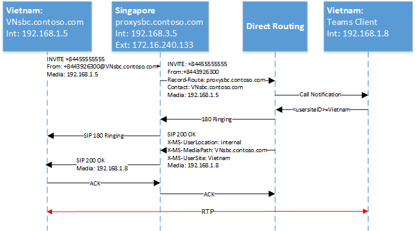
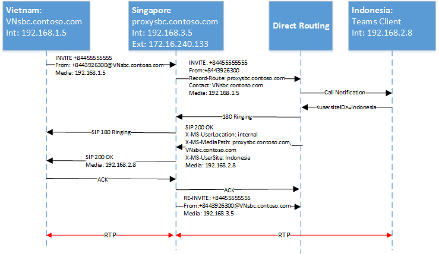

# <a name="configure-local-media-optimization-for-direct-routing"></a><span data-ttu-id="155a7-103">为直接路由配置本地媒体优化</span><span class="sxs-lookup"><span data-stu-id="155a7-103">Configure Local Media Optimization for Direct Routing</span></span>

<span data-ttu-id="155a7-104">本地媒体优化的配置基于由其他云语音功能（如基于位置的路由和动态紧急呼叫）通用的网络设置。</span><span class="sxs-lookup"><span data-stu-id="155a7-104">Configuration for Local Media Optimization is based on network settings that are common to other cloud voice features, such as Location-Based Routing and dynamic emergency calling.</span></span> <span data-ttu-id="155a7-105">若要了解有关网络区域、网络站点、网络子网和受信任的 IP 地址的详细信息，请参阅[云语音功能的网络设置](cloud-voice-network-settings.md)。</span><span class="sxs-lookup"><span data-stu-id="155a7-105">To learn more about network regions, network sites, network subnets, and trusted IP addresses, see [Network settings for cloud voice features](cloud-voice-network-settings.md).</span></span>

<span data-ttu-id="155a7-106">在配置本地媒体优化之前，请参阅[用于直接路由的本地媒体优化](direct-routing-media-optimization.md)。</span><span class="sxs-lookup"><span data-stu-id="155a7-106">Before you configure Local Media Optimization, see [Local media Optimization for Direct Routing](direct-routing-media-optimization.md).</span></span>  

<span data-ttu-id="155a7-107">若要配置本地媒体优化，需要执行以下步骤。</span><span class="sxs-lookup"><span data-stu-id="155a7-107">To configure Local Media Optimization, the following steps are required.</span></span> <span data-ttu-id="155a7-108">你可以使用团队管理员中心或 PowerShell。</span><span class="sxs-lookup"><span data-stu-id="155a7-108">You can use the Teams Admin Center or PowerShell.</span></span> <span data-ttu-id="155a7-109">有关详细信息，请参阅[管理网络拓扑](manage-your-network-topology.md)。</span><span class="sxs-lookup"><span data-stu-id="155a7-109">For details, see [Manage your network topology](manage-your-network-topology.md).</span></span>

1. <span data-ttu-id="155a7-110">按照本文所述，配置用户和 SBC 网站 () 。</span><span class="sxs-lookup"><span data-stu-id="155a7-110">Configure the user and the SBC sites (as described in this article).</span></span>
2. <span data-ttu-id="155a7-111">根据 SBC 供应商规范) ，配置用于本地媒体优化 (的 SBCs。</span><span class="sxs-lookup"><span data-stu-id="155a7-111">Configure the SBCs for Local Media Optimization (according to your SBC vendor specification).</span></span>

<span data-ttu-id="155a7-112">下图显示了本文的示例中所用的网络设置。</span><span class="sxs-lookup"><span data-stu-id="155a7-112">The following diagram shows the network setup used in the examples throughout this article.</span></span>

<span data-ttu-id="155a7-113"></span><span class="sxs-lookup"><span data-stu-id="155a7-113"></span></span>


## <a name="configure-the-user-and-the-sbc-sites"></a><span data-ttu-id="155a7-114">配置用户和 SBC 网站</span><span class="sxs-lookup"><span data-stu-id="155a7-114">Configure the user and the SBC sites</span></span>

<span data-ttu-id="155a7-115">要配置用户和 SBC 网站，你需要：</span><span class="sxs-lookup"><span data-stu-id="155a7-115">To configure the user and the SBC sites, you will need to:</span></span>

1. <span data-ttu-id="155a7-116">[管理外部受信任的 IP 地址](#manage-external-trusted-ip-addresses)。</span><span class="sxs-lookup"><span data-stu-id="155a7-116">[Manage external trusted IP addresses](#manage-external-trusted-ip-addresses).</span></span>  

2. <span data-ttu-id="155a7-117">通过配置网络区域、网络站点和网络子网来[定义网络拓扑](#define-the-network-topology)。</span><span class="sxs-lookup"><span data-stu-id="155a7-117">[Define the network topology](#define-the-network-topology) by configuring the network regions, network sites, and network subnets.</span></span>

3. <span data-ttu-id="155a7-118">通过将 SBC (s) 分配给具有相关模式和代理 SBC 值的站点 () 来[定义虚拟网络拓扑](#define-the-virtual-network-topology)。</span><span class="sxs-lookup"><span data-stu-id="155a7-118">[Define the virtual network topology](#define-the-virtual-network-topology) by assigning SBC(s) to site(s) with relevant modes and proxy SBC values.</span></span>


## <a name="configure-sbcs-for-local-media-optimization-according-to-the-sbc-vendor-specification"></a><span data-ttu-id="155a7-119">根据 SBC 供应商的规范，配置用于本地媒体优化的 SBC (s) </span><span class="sxs-lookup"><span data-stu-id="155a7-119">Configure SBC(s) for Local Media Optimization according to the SBC vendor specification</span></span>

<span data-ttu-id="155a7-120">本文介绍 Microsoft 组件的配置。</span><span class="sxs-lookup"><span data-stu-id="155a7-120">This article describes configuration for Microsoft components.</span></span> <span data-ttu-id="155a7-121">有关 SBC 配置的信息，请参阅 SBC 供应商的文档。</span><span class="sxs-lookup"><span data-stu-id="155a7-121">For information on SBC configuration, see your SBC vendor documentation.</span></span>

<span data-ttu-id="155a7-122">以下 SBC 供应商支持本地媒体优化：</span><span class="sxs-lookup"><span data-stu-id="155a7-122">Local Media Optimization is supported by the following SBC vendors:</span></span>

| <span data-ttu-id="155a7-123">供应商</span><span class="sxs-lookup"><span data-stu-id="155a7-123">Vendor</span></span> | <span data-ttu-id="155a7-124">产品</span><span class="sxs-lookup"><span data-stu-id="155a7-124">Product</span></span> |    <span data-ttu-id="155a7-125">软件版本</span><span class="sxs-lookup"><span data-stu-id="155a7-125">Software version</span></span> |
|:------------|:-------|:-------|
| [<span data-ttu-id="155a7-126">Audiocodes</span><span class="sxs-lookup"><span data-stu-id="155a7-126">Audiocodes</span></span>](https://www.audiocodes.com/media/13253/connecting-audiocodes-sbc-to-microsoft-teams-direct-routing-enterprise-model-configuration-note.pdf) |    <span data-ttu-id="155a7-127">Mediant 500 SBC</span><span class="sxs-lookup"><span data-stu-id="155a7-127">Mediant 500 SBC</span></span> |   <span data-ttu-id="155a7-128">7.20</span><span class="sxs-lookup"><span data-stu-id="155a7-128">7.20A.256</span></span> | 
|            |  <span data-ttu-id="155a7-129">Mediant 800 SBC</span><span class="sxs-lookup"><span data-stu-id="155a7-129">Mediant 800 SBC</span></span> |   <span data-ttu-id="155a7-130">7.20</span><span class="sxs-lookup"><span data-stu-id="155a7-130">7.20A.256</span></span> | 
|            |  <span data-ttu-id="155a7-131">Mediant 2600 SBC</span><span class="sxs-lookup"><span data-stu-id="155a7-131">Mediant 2600 SBC</span></span> |  <span data-ttu-id="155a7-132">7.20</span><span class="sxs-lookup"><span data-stu-id="155a7-132">7.20A.256</span></span> | 
|            |  <span data-ttu-id="155a7-133">Mediant 4000 SBC</span><span class="sxs-lookup"><span data-stu-id="155a7-133">Mediant 4000 SBC</span></span> |  <span data-ttu-id="155a7-134">7.20</span><span class="sxs-lookup"><span data-stu-id="155a7-134">7.20A.256</span></span> | 
|            |  <span data-ttu-id="155a7-135">Mediant 1000B SBC</span><span class="sxs-lookup"><span data-stu-id="155a7-135">Mediant 1000B SBC</span></span> | <span data-ttu-id="155a7-136">7.20</span><span class="sxs-lookup"><span data-stu-id="155a7-136">7.20A.256</span></span> | 
|            |  <span data-ttu-id="155a7-137">Mediant 9000 SBC</span><span class="sxs-lookup"><span data-stu-id="155a7-137">Mediant 9000 SBC</span></span> |  <span data-ttu-id="155a7-138">7.20</span><span class="sxs-lookup"><span data-stu-id="155a7-138">7.20A.256</span></span> | 
|            |  <span data-ttu-id="155a7-139">Mediant 虚拟版 SBC</span><span class="sxs-lookup"><span data-stu-id="155a7-139">Mediant Virtual Edition SBC</span></span> |   <span data-ttu-id="155a7-140">7.20</span><span class="sxs-lookup"><span data-stu-id="155a7-140">7.20A.256</span></span> | 
|            |  <span data-ttu-id="155a7-141">Mediant 云版 SBC</span><span class="sxs-lookup"><span data-stu-id="155a7-141">Mediant Cloud Edition SBC</span></span> | <span data-ttu-id="155a7-142">7.20</span><span class="sxs-lookup"><span data-stu-id="155a7-142">7.20A.256</span></span> |
| [<span data-ttu-id="155a7-143">功能区 SBC 核心</span><span class="sxs-lookup"><span data-stu-id="155a7-143">Ribbon SBC Core</span></span>](https://support.sonus.net/display/ALLDOC/SBC+8.2+-+Configure+Local+Media+Optimization)  |  <span data-ttu-id="155a7-144">SBC 5110</span><span class="sxs-lookup"><span data-stu-id="155a7-144">SBC 5110</span></span>         | <span data-ttu-id="155a7-145">8.2</span><span class="sxs-lookup"><span data-stu-id="155a7-145">8.2</span></span>  |
|            |  <span data-ttu-id="155a7-146">SBC 5210</span><span class="sxs-lookup"><span data-stu-id="155a7-146">SBC 5210</span></span>         | <span data-ttu-id="155a7-147">8.2</span><span class="sxs-lookup"><span data-stu-id="155a7-147">8.2</span></span>  |
|            |  <span data-ttu-id="155a7-148">SBC 5400</span><span class="sxs-lookup"><span data-stu-id="155a7-148">SBC 5400</span></span>         | <span data-ttu-id="155a7-149">8.2</span><span class="sxs-lookup"><span data-stu-id="155a7-149">8.2</span></span>  |
|            |  <span data-ttu-id="155a7-150">SBC 7000</span><span class="sxs-lookup"><span data-stu-id="155a7-150">SBC 7000</span></span>         | <span data-ttu-id="155a7-151">8.2</span><span class="sxs-lookup"><span data-stu-id="155a7-151">8.2</span></span>  |
|            |  <span data-ttu-id="155a7-152">SBC SWe</span><span class="sxs-lookup"><span data-stu-id="155a7-152">SBC SWe</span></span>          | <span data-ttu-id="155a7-153">8.2</span><span class="sxs-lookup"><span data-stu-id="155a7-153">8.2</span></span>  |
| [<span data-ttu-id="155a7-154">功能区 SBC 边缘</span><span class="sxs-lookup"><span data-stu-id="155a7-154">Ribbon SBC Edge</span></span>](https://support.sonus.net/display/UXDOC81/Best+Practice+-+Configuring+Microsoft+Teams+Local+Media+Optimization)  |  <span data-ttu-id="155a7-155">SBC SWe Lite</span><span class="sxs-lookup"><span data-stu-id="155a7-155">SBC SWe Lite</span></span> | <span data-ttu-id="155a7-156">8.1.5</span><span class="sxs-lookup"><span data-stu-id="155a7-156">8.1.5</span></span> |
|               | <span data-ttu-id="155a7-157">SBC 1000</span><span class="sxs-lookup"><span data-stu-id="155a7-157">SBC 1000</span></span> | <span data-ttu-id="155a7-158">8.1.5</span><span class="sxs-lookup"><span data-stu-id="155a7-158">8.1.5</span></span>  |
|               | <span data-ttu-id="155a7-159">SBC 2000</span><span class="sxs-lookup"><span data-stu-id="155a7-159">SBC 2000</span></span> | <span data-ttu-id="155a7-160">8.1.5</span><span class="sxs-lookup"><span data-stu-id="155a7-160">8.1.5</span></span>  |
| [<span data-ttu-id="155a7-161">TE-SYSTEMS</span><span class="sxs-lookup"><span data-stu-id="155a7-161">TE-SYSTEMS</span></span>](https://www.anynode.de/local_media_optimization/) |  <span data-ttu-id="155a7-162">anynode</span><span class="sxs-lookup"><span data-stu-id="155a7-162">anynode</span></span>          | <span data-ttu-id="155a7-163">4.0.1 +</span><span class="sxs-lookup"><span data-stu-id="155a7-163">4.0.1+</span></span> |
| [<span data-ttu-id="155a7-164">Oracle</span><span class="sxs-lookup"><span data-stu-id="155a7-164">Oracle</span></span>](https://www.oracle.com/industries/communications/enterprise-communications/session-border-controller/microsoft.html) | <span data-ttu-id="155a7-165">AP 1100</span><span class="sxs-lookup"><span data-stu-id="155a7-165">AP 1100</span></span> | <span data-ttu-id="155a7-166">8.4.0.0.0</span><span class="sxs-lookup"><span data-stu-id="155a7-166">8.4.0.0.0</span></span> |
|        | <span data-ttu-id="155a7-167">AP 3900</span><span class="sxs-lookup"><span data-stu-id="155a7-167">AP 3900</span></span> | <span data-ttu-id="155a7-168">8.4.0.0.0</span><span class="sxs-lookup"><span data-stu-id="155a7-168">8.4.0.0.0</span></span> |
|        | <span data-ttu-id="155a7-169">AP 4600</span><span class="sxs-lookup"><span data-stu-id="155a7-169">AP 4600</span></span> | <span data-ttu-id="155a7-170">8.4.0.0.0</span><span class="sxs-lookup"><span data-stu-id="155a7-170">8.4.0.0.0</span></span> | 
|        | <span data-ttu-id="155a7-171">AP 6300</span><span class="sxs-lookup"><span data-stu-id="155a7-171">AP 6300</span></span> | <span data-ttu-id="155a7-172">8.4.0.0.0</span><span class="sxs-lookup"><span data-stu-id="155a7-172">8.4.0.0.0</span></span> |
|        | <span data-ttu-id="155a7-173">AP 6350</span><span class="sxs-lookup"><span data-stu-id="155a7-173">AP 6350</span></span> | <span data-ttu-id="155a7-174">8.4.0.0.0</span><span class="sxs-lookup"><span data-stu-id="155a7-174">8.4.0.0.0</span></span> | 
|        | <span data-ttu-id="155a7-175">VME</span><span class="sxs-lookup"><span data-stu-id="155a7-175">VME</span></span>     | <span data-ttu-id="155a7-176">8.4.0.0.0</span><span class="sxs-lookup"><span data-stu-id="155a7-176">8.4.0.0.0</span></span> |


## <a name="manage-external-trusted-ip-addresses"></a><span data-ttu-id="155a7-177">管理外部受信任的 IP 地址</span><span class="sxs-lookup"><span data-stu-id="155a7-177">Manage external trusted IP addresses</span></span>

<span data-ttu-id="155a7-178">外部受信任的 Ip 是企业网络的 Internet 外部 Ip。</span><span class="sxs-lookup"><span data-stu-id="155a7-178">External trusted IPs are the Internet external IPs of the enterprise network.</span></span> <span data-ttu-id="155a7-179">这些 IP 是 Microsoft 团队客户端连接到 Microsoft 365 时使用的 IP 地址。</span><span class="sxs-lookup"><span data-stu-id="155a7-179">These IP’s are the IP addresses used by Microsoft Teams clients when they connect to Microsoft 365.</span></span> <span data-ttu-id="155a7-180">你需要为每个具有使用本地媒体优化的用户的网站添加这些外部 Ip。</span><span class="sxs-lookup"><span data-stu-id="155a7-180">You need to add these external IPs for each site where you have users using Local Media Optimization.</span></span>

<span data-ttu-id="155a7-181">若要为每个网站添加公共 IP 地址，请使用 CsTenantTrustedIPAddress cmdlet。</span><span class="sxs-lookup"><span data-stu-id="155a7-181">To add the public IP addresses for each site, use the New-CsTenantTrustedIPAddress cmdlet.</span></span> <span data-ttu-id="155a7-182">你可以为租户定义无限数量的受信任 IP 地址。</span><span class="sxs-lookup"><span data-stu-id="155a7-182">You can define an unlimited number of trusted IP addresses for a tenant.</span></span> <span data-ttu-id="155a7-183">如果 Microsoft 365 所看到的外部 IPs 是 IPv4 和 IPv6 地址，则需要添加这两种类型的 IP 地址。</span><span class="sxs-lookup"><span data-stu-id="155a7-183">If the external IPs seen by Microsoft 365 are both IPv4 and IPv6 addresses, you need to add both types of IP addresses.</span></span> <span data-ttu-id="155a7-184">对于 IPv4，请使用掩码32。</span><span class="sxs-lookup"><span data-stu-id="155a7-184">For IPv4, use mask 32.</span></span> <span data-ttu-id="155a7-185">对于 IPv6，请使用掩码128。</span><span class="sxs-lookup"><span data-stu-id="155a7-185">For IPv6, use mask 128.</span></span> <span data-ttu-id="155a7-186">你可以通过在 cmdlet 上指定不同的 MaskBits 来添加单个外部 IP 地址和外部 IP 子网。</span><span class="sxs-lookup"><span data-stu-id="155a7-186">You can add both individual external IP addresses and external IP subnets by specifying different MaskBits on the cmdlet.</span></span>

```
New-CsTenantTrustedIPAddress -IPAddress <External IP address> -MaskBits <Subnet bitmask> -Description <description>
```


<span data-ttu-id="155a7-187">添加受信任的 IP 地址的示例。</span><span class="sxs-lookup"><span data-stu-id="155a7-187">Example of adding trusted IP addresses.</span></span>

```
New-CsTenantTrustedIPAddress -IPAddress 172.16.240.110 -MaskBits 32 -Description "Vietnam site trusted IP"
New-CsTenantTrustedIPAddress -IPAddress 172.16.240.120 -MaskBits 32 -Description "Indonesia site trusted IP"
New-CsTenantTrustedIPAddress -IPAddress 172.16.240.130 -MaskBits 32 -Description "Singapore site trusted IP"
```


## <a name="define-the-network-topology"></a><span data-ttu-id="155a7-188">定义网络拓扑</span><span class="sxs-lookup"><span data-stu-id="155a7-188">Define the network topology</span></span>

<span data-ttu-id="155a7-189">本节介绍如何为你的网络拓扑定义网络区域、网络站点和网络子网。</span><span class="sxs-lookup"><span data-stu-id="155a7-189">This section describes how to define the network regions, network sites, and network subnets for your network topology.</span></span>

<span data-ttu-id="155a7-190">所有参数都区分大小写，因此你需要确保使用在安装过程中使用的相同大小写。</span><span class="sxs-lookup"><span data-stu-id="155a7-190">All parameters are case sensitive so you need to ensure that you use the same case that was used during setup.</span></span>  <span data-ttu-id="155a7-191"> (例如，GatewaySiteID 值 "越南" 和 "越南" 将被视为不同的网站。 ) </span><span class="sxs-lookup"><span data-stu-id="155a7-191">(For example, GatewaySiteID values “Vietnam” and “vietnam” will be treated as different sites.)</span></span>

### <a name="define-network-regions"></a><span data-ttu-id="155a7-192">定义网络区域</span><span class="sxs-lookup"><span data-stu-id="155a7-192">Define network regions</span></span>

<span data-ttu-id="155a7-193">若要定义网络区域，请使用 CsTenantNetworkRegion cmdlet。</span><span class="sxs-lookup"><span data-stu-id="155a7-193">To define network regions, use the New-CsTenantNetworkRegion cmdlet.</span></span> <span data-ttu-id="155a7-194">RegionID 参数是一个逻辑名称，表示区域的地理位置，并且不具有依赖关系或限制。</span><span class="sxs-lookup"><span data-stu-id="155a7-194">The RegionID parameter is a logical name that represents the geography of the region and has no dependencies or restrictions.</span></span> <span data-ttu-id="155a7-195">CentralSite <site ID> 参数是可选的。</span><span class="sxs-lookup"><span data-stu-id="155a7-195">The CentralSite <site ID> parameter is optional.</span></span>

```
New-CsTenantNetworkRegion -NetworkRegionID <region ID>  
```

<span data-ttu-id="155a7-196">下面的示例创建了一个名为 APAC 的网络区域：</span><span class="sxs-lookup"><span data-stu-id="155a7-196">The following example creates a network region named APAC:</span></span>

```
New-CsTenantNetworkRegion -NetworkRegionID "APAC"  
```

###  <a name="define-network-sites"></a><span data-ttu-id="155a7-197">定义网络站点</span><span class="sxs-lookup"><span data-stu-id="155a7-197">Define network sites</span></span>

<span data-ttu-id="155a7-198">若要定义网络网站，请使用 CsTenantNetworkSite cmdlet。</span><span class="sxs-lookup"><span data-stu-id="155a7-198">To define network sites, use the New-CsTenantNetworkSite cmdlet.</span></span> <span data-ttu-id="155a7-199">每个网络站点都必须与一个网络区域相关联。</span><span class="sxs-lookup"><span data-stu-id="155a7-199">Each network site must be associated with a network region.</span></span>

```
New-CsTenantNetworkSite -NetworkSiteID <site ID> -NetworkRegionID <region ID>
```

<span data-ttu-id="155a7-200">以下示例在 APAC 区域中创建三个新的网络站点、越南、印度尼西亚和新加坡：</span><span class="sxs-lookup"><span data-stu-id="155a7-200">The following example creates three new network sites, Vietnam, Indonesia, and Singapore in the APAC region:</span></span>

```
New-CsTenantNetworkSite -NetworkSiteID "Vietnam" -NetworkRegionID "APAC"
New-CsTenantNetworkSite -NetworkSiteID "Indonesia" -NetworkRegionID "APAC"
New-CsTenantNetworkSite -NetworkSiteID "Singapore" -NetworkRegionID "APAC"
```

### <a name="define-network-subnets"></a><span data-ttu-id="155a7-201">定义网络子网</span><span class="sxs-lookup"><span data-stu-id="155a7-201">Define network subnets</span></span>

<span data-ttu-id="155a7-202">若要定义网络子网并将其与网络站点关联，请使用 CsTenantNetworkSubnet cmdlet。</span><span class="sxs-lookup"><span data-stu-id="155a7-202">To define network subnets and associate them to network sites, use the New-CsTenantNetworkSubnet cmdlet.</span></span> <span data-ttu-id="155a7-203">每个网络子网只能与一个网站相关联。</span><span class="sxs-lookup"><span data-stu-id="155a7-203">Each network subnet can only be associated with one site.</span></span> 

```
New-CsTenantNetworkSubnet -SubnetID <Subnet IP address> -MaskBits <Subnet bitmask> -NetworkSiteID <site ID>
```

<span data-ttu-id="155a7-204">以下示例定义了三个网络子网，并将其与三个网络站点（越南、印度尼西亚和新加坡）关联：</span><span class="sxs-lookup"><span data-stu-id="155a7-204">The following example defines three network subnets and associates them with the three network sites:  Vietnam, Indonesia, and Singapore:</span></span>

```
New-CsTenantNetworkSubnet -SubnetID 192.168.1.0 -MaskBits 24 -NetworkSiteID “Vietnam”
New-CsTenantNetworkSubnet -SubnetID 192.168.2.0 -MaskBits 24 -NetworkSiteID “Indonesia”
New-CsTenantNetworkSubnet -SubnetID 192.168.3.0 -MaskBits 24 -NetworkSiteID “Singapore”
```

## <a name="define-the-virtual-network-topology"></a><span data-ttu-id="155a7-205">定义虚拟网络拓扑</span><span class="sxs-lookup"><span data-stu-id="155a7-205">Define the virtual network topology</span></span> 

<span data-ttu-id="155a7-206">首先，租户管理员使用 CsOnlinePSTNGateway cmdlet 为每个相关 SBC 创建新的 SBC 配置。</span><span class="sxs-lookup"><span data-stu-id="155a7-206">First, the tenant administrator creates a new SBC configuration for each relevant SBC by using the New-CsOnlinePSTNGateway cmdlet.</span></span>
<span data-ttu-id="155a7-207">租户管理员通过使用 CsOnlinePSTNGateway cmdlet 指定 PSTN 网关对象的网络站点来定义虚拟网络拓扑：</span><span class="sxs-lookup"><span data-stu-id="155a7-207">The tenant administrator defines the virtual network topology by specifying the network sites for the PSTN gateway objects using the Set-CsOnlinePSTNGateway cmdlet:</span></span>

```
PS C:\> Set-CsOnlinePSTNGateway -Identity <Identity> -GatewaySiteID <site ID> -MediaBypass <true/false> -BypassMode <Always/OnlyForLocalUsers> -ProxySBC  <proxy SBC FQDN or $null>
```

<span data-ttu-id="155a7-208">请注意以下事项：</span><span class="sxs-lookup"><span data-stu-id="155a7-208">Note the following:</span></span> 
   - <span data-ttu-id="155a7-209">如果客户有单个 SBC，则-ProxySBC 参数必须是必需的 $null 或 SBC FQDN 值 (中心 SBC 和集中的中继方案 ") 。</span><span class="sxs-lookup"><span data-stu-id="155a7-209">If the customer has a single SBC, the -ProxySBC parameter must be either mandatory $null or SBC FQDN value (Central SBC with centralized trunks scenario).</span></span>
   - <span data-ttu-id="155a7-210">必须将-MediaBypass 参数设置为 $true，才能支持本地媒体优化。</span><span class="sxs-lookup"><span data-stu-id="155a7-210">The -MediaBypass parameter must be set to $true in order to support Local Media Optimization.</span></span>
   - <span data-ttu-id="155a7-211">如果 SBC 没有-BypassMode 参数集，则不会发送 X 毫秒标头。</span><span class="sxs-lookup"><span data-stu-id="155a7-211">If the SBC doesn’t have the -BypassMode parameter set, X-MS headers will not be sent.</span></span> 
   - <span data-ttu-id="155a7-212">所有参数都区分大小写，因此你需要确保使用的是在安装期间使用的相同大小写。</span><span class="sxs-lookup"><span data-stu-id="155a7-212">All parameters are case sensitive so you need to ensure that you use the same case that was used used during setup.</span></span>  <span data-ttu-id="155a7-213"> (例如，GatewaySiteID 值 "越南" 和 "越南" 将被视为不同的网站。 ) </span><span class="sxs-lookup"><span data-stu-id="155a7-213">(For example, GatewaySiteID values “Vietnam” and “vietnam” will be treated as different sites.)</span></span>

<span data-ttu-id="155a7-214">以下示例将3个 SBCs 添加到 APAC 区域中的网络站点越南、印度尼西亚和新加坡，模式始终为 "始终绕过"：</span><span class="sxs-lookup"><span data-stu-id="155a7-214">The following example adds three SBCs to the network sites Vietnam, Indonesia, and Singapore in the APAC region with mode Always bypass:</span></span>

```
Set-CSOnlinePSTNGateway -Identity “proxysbc.contoso.com” -GatewaySiteID “Singapore” -MediaBypass $true -BypassMode “Always” -ProxySBC $null

Set-CSOnlinePSTNGateway -Identity “VNsbc.contoso.com” -GatewaySiteID “Vietnam” -MediaBypass $true -BypassMode “Always” -ProxySBC “proxysbc.contoso.com”

Set-CSOnlinePSTNGateway -Identity “IDsbc.contoso.com” -GatewaySiteID “Indonesia” -MediaBypass $true -BypassMode “Always” -ProxySBC “proxysbc.contoso.com”
```

<span data-ttu-id="155a7-215">注意：为确保同时配置本地媒体优化和基于位置的路由 (LBR) 时，必须为 LBR 启用下游 SBCs，方法是将 GatewaySiteLbrEnabled 参数设置为针对每个下游 SBC $true。</span><span class="sxs-lookup"><span data-stu-id="155a7-215">Note: To ensure uninterrupted operations when Local Media Optimization and Location-Based Routing (LBR) are configured at the same time, downstream SBCs must be enabled for LBR by setting the GatewaySiteLbrEnabled parameter to $true for each downstream SBC.</span></span> <span data-ttu-id="155a7-216">对于代理 SBC 而言， (此设置不是必需的。 ) </span><span class="sxs-lookup"><span data-stu-id="155a7-216">(This setting is not mandatory for the proxy SBC.)</span></span>

<span data-ttu-id="155a7-217">根据上述信息，直接路由将包括三个专用 SIP 标题到 SIP 邀请和重新邀请，如下表所示。</span><span class="sxs-lookup"><span data-stu-id="155a7-217">Based on the information above, Direct Routing will include three proprietary SIP Headers to SIP Invites and Re-invites as shown  in the following table.</span></span>

<span data-ttu-id="155a7-218">如果定义了 BypassMode，则在邀请和重新邀请时直接路由中引入了 X-MS 标题：</span><span class="sxs-lookup"><span data-stu-id="155a7-218">X-MS Headers introduced in Direct Routing on Invites and Re-Invites if BypassMode is defined:</span></span>

| <span data-ttu-id="155a7-219">标题名称</span><span class="sxs-lookup"><span data-stu-id="155a7-219">Header name</span></span> | <span data-ttu-id="155a7-220">相对值</span><span class="sxs-lookup"><span data-stu-id="155a7-220">Values</span></span> | <span data-ttu-id="155a7-221">备注</span><span class="sxs-lookup"><span data-stu-id="155a7-221">Comments</span></span> | 
|:------------|:-------|:-------|
| <span data-ttu-id="155a7-222">X 毫秒-UserLocation</span><span class="sxs-lookup"><span data-stu-id="155a7-222">X-MS-UserLocation</span></span> | <span data-ttu-id="155a7-223">内部/外部</span><span class="sxs-lookup"><span data-stu-id="155a7-223">internal/external</span></span> | <span data-ttu-id="155a7-224">指示用户是内部还是外部用户</span><span class="sxs-lookup"><span data-stu-id="155a7-224">Indicates if user is internal or external</span></span> |
| <span data-ttu-id="155a7-225">请求 URI 邀请 sip： + 84439263000@VNsbc.contoso.com SIP/2。0</span><span class="sxs-lookup"><span data-stu-id="155a7-225">Request-URI   INVITE sip: +84439263000@VNsbc.contoso.com SIP /2.0</span></span> | <span data-ttu-id="155a7-226">SBC FQDN</span><span class="sxs-lookup"><span data-stu-id="155a7-226">SBC FQDN</span></span> | <span data-ttu-id="155a7-227">即使 SBC 未直接连接到直接路由，仍针对呼叫的 FQDN</span><span class="sxs-lookup"><span data-stu-id="155a7-227">The FQDN which is targeted for the call even if the SBC is not directly connected to Direct Routing</span></span> |
| <span data-ttu-id="155a7-228">X 毫秒-MediaPath</span><span class="sxs-lookup"><span data-stu-id="155a7-228">X-MS-MediaPath</span></span> | <span data-ttu-id="155a7-229">示例： proxysbc.contoso.com、VNsbc.contoso.com</span><span class="sxs-lookup"><span data-stu-id="155a7-229">Example: proxysbc.contoso.com, VNsbc.contoso.com</span></span> | <span data-ttu-id="155a7-230">应用于用户和目标 SBC 之间的媒体路径的 SBCs 顺序。</span><span class="sxs-lookup"><span data-stu-id="155a7-230">Order of SBCs that should be used for Media path between the user and target SBC.</span></span> <span data-ttu-id="155a7-231">最终的 SBC 始终持续</span><span class="sxs-lookup"><span data-stu-id="155a7-231">The final SBC is always last</span></span> |
| <span data-ttu-id="155a7-232">X 毫秒-UserSite</span><span class="sxs-lookup"><span data-stu-id="155a7-232">X-MS-UserSite</span></span> | <span data-ttu-id="155a7-233">usersiteID</span><span class="sxs-lookup"><span data-stu-id="155a7-233">usersiteID</span></span> | <span data-ttu-id="155a7-234">租户管理员定义的字符串</span><span class="sxs-lookup"><span data-stu-id="155a7-234">String defined by tenant administrator</span></span> |

## <a name="call-flows"></a><span data-ttu-id="155a7-235">通话流程</span><span class="sxs-lookup"><span data-stu-id="155a7-235">Call flows</span></span> 

<span data-ttu-id="155a7-236">以下显示了两种模式的通话流：</span><span class="sxs-lookup"><span data-stu-id="155a7-236">The following shows call flows for two modes:</span></span>

- [<span data-ttu-id="155a7-237">始终绕过</span><span class="sxs-lookup"><span data-stu-id="155a7-237">Always Bypass</span></span>](#always-bypass-mode)
- [<span data-ttu-id="155a7-238">仅适用于本地用户</span><span class="sxs-lookup"><span data-stu-id="155a7-238">Only for local users</span></span>](#only-for-local-users-mode)

### <a name="always-bypass-mode"></a><span data-ttu-id="155a7-239">始终绕过模式</span><span class="sxs-lookup"><span data-stu-id="155a7-239">Always Bypass mode</span></span>

<span data-ttu-id="155a7-240">始终绕过模式是最简单的配置选项。</span><span class="sxs-lookup"><span data-stu-id="155a7-240">Always Bypass mode is the simplest option to configure.</span></span> <span data-ttu-id="155a7-241">租户管理员可以为所有用户和 SBCs 配置单个网站（如果所有 SBCs 均可从任何网站访问）。</span><span class="sxs-lookup"><span data-stu-id="155a7-241">The tenant administrator can configure a single site for all users and SBCs if all SBCs are reachable from any site.</span></span>

<span data-ttu-id="155a7-242">在以下情况下，示例显示 "始终绕过" 模式：</span><span class="sxs-lookup"><span data-stu-id="155a7-242">The examples show Always bypass mode for the following scenarios:</span></span>

- [<span data-ttu-id="155a7-243">出站呼叫和用户与 SBC 位于同一位置</span><span class="sxs-lookup"><span data-stu-id="155a7-243">Outbound calls and the user is in the same location as the SBC</span></span>](#outbound-calls-and-the-user-is-in-the-same-location-as-the-sbc-with-always-bypass)
- [<span data-ttu-id="155a7-244">入站呼叫和用户与 SBC 位于同一位置</span><span class="sxs-lookup"><span data-stu-id="155a7-244">Inbound calls and the user is in the same location as the SBC</span></span>](#inbound-calls-and-the-user-is-in-the-same-location-as-the-sbc-with-always-bypass)
- [<span data-ttu-id="155a7-245">出站呼叫和用户是外部的</span><span class="sxs-lookup"><span data-stu-id="155a7-245">Outbound calls and the user is external</span></span>](#outbound-calls-and-the-user-is-external-with-always-bypass)
- [<span data-ttu-id="155a7-246">入站呼叫和用户是外部的</span><span class="sxs-lookup"><span data-stu-id="155a7-246">Inbound calls and the user is external</span></span>](#inbound-calls-and-the-user-is-external-with-always-bypass)

<span data-ttu-id="155a7-247">下表显示了示例中使用的 FQDN 和 IP 地址：</span><span class="sxs-lookup"><span data-stu-id="155a7-247">The following table shows the FQDN and IP addresses used in the examples:</span></span>

| <span data-ttu-id="155a7-248">FQDN</span><span class="sxs-lookup"><span data-stu-id="155a7-248">FQDN</span></span> | <span data-ttu-id="155a7-249">SBC 外部 IP 地址</span><span class="sxs-lookup"><span data-stu-id="155a7-249">SBC external IP address</span></span> | <span data-ttu-id="155a7-250">SBC 内部 IP 地址</span><span class="sxs-lookup"><span data-stu-id="155a7-250">SBC internal IP Address</span></span> | <span data-ttu-id="155a7-251">内部子网</span><span class="sxs-lookup"><span data-stu-id="155a7-251">Internal subnet</span></span> | <span data-ttu-id="155a7-252">位置</span><span class="sxs-lookup"><span data-stu-id="155a7-252">Location</span></span> | <span data-ttu-id="155a7-253">外部 NAT (受信任的 IP) </span><span class="sxs-lookup"><span data-stu-id="155a7-253">External NAT (Trusted IP)</span></span> |
|:------------|:-------|:-------|:-------|:-------|:-------|
| <span data-ttu-id="155a7-254">VNsbc.contoso.com</span><span class="sxs-lookup"><span data-stu-id="155a7-254">VNsbc.contoso.com</span></span> | <span data-ttu-id="155a7-255">无</span><span class="sxs-lookup"><span data-stu-id="155a7-255">None</span></span> | <span data-ttu-id="155a7-256">192.168.1.5</span><span class="sxs-lookup"><span data-stu-id="155a7-256">192.168.1.5</span></span> | <span data-ttu-id="155a7-257">192.168.1.0/24</span><span class="sxs-lookup"><span data-stu-id="155a7-257">192.168.1.0/24</span></span> | <span data-ttu-id="155a7-258">越南</span><span class="sxs-lookup"><span data-stu-id="155a7-258">Vietnam</span></span> | <span data-ttu-id="155a7-259">172.16.240.110</span><span class="sxs-lookup"><span data-stu-id="155a7-259">172.16.240.110</span></span> |
| <span data-ttu-id="155a7-260">IDsbc.contoso.com</span><span class="sxs-lookup"><span data-stu-id="155a7-260">IDsbc.contoso.com</span></span> | <span data-ttu-id="155a7-261">无</span><span class="sxs-lookup"><span data-stu-id="155a7-261">None</span></span> | <span data-ttu-id="155a7-262">192.168.2.5</span><span class="sxs-lookup"><span data-stu-id="155a7-262">192.168.2.5</span></span> | <span data-ttu-id="155a7-263">192.168.2.0/24</span><span class="sxs-lookup"><span data-stu-id="155a7-263">192.168.2.0/24</span></span> | <span data-ttu-id="155a7-264">印度尼西亚</span><span class="sxs-lookup"><span data-stu-id="155a7-264">Indonesia</span></span> | <span data-ttu-id="155a7-265">172.16.240.120</span><span class="sxs-lookup"><span data-stu-id="155a7-265">172.16.240.120</span></span> |
| <span data-ttu-id="155a7-266">proxysbc.contoso.com</span><span class="sxs-lookup"><span data-stu-id="155a7-266">proxysbc.contoso.com</span></span> | <span data-ttu-id="155a7-267">172.16.240.133</span><span class="sxs-lookup"><span data-stu-id="155a7-267">172.16.240.133</span></span> | <span data-ttu-id="155a7-268">192.168.3.5</span><span class="sxs-lookup"><span data-stu-id="155a7-268">192.168.3.5</span></span> | <span data-ttu-id="155a7-269">192.168.3.0/24</span><span class="sxs-lookup"><span data-stu-id="155a7-269">192.168.3.0/24</span></span> | <span data-ttu-id="155a7-270">新加坡</span><span class="sxs-lookup"><span data-stu-id="155a7-270">Singapore</span></span> | <span data-ttu-id="155a7-271">172.16.240.130</span><span class="sxs-lookup"><span data-stu-id="155a7-271">172.16.240.130</span></span> |


#### <a name="outbound-calls-and-the-user-is-in-the-same-location-as-the-sbc-with-always-bypass"></a><span data-ttu-id="155a7-272">出站呼叫，并且用户与具有始终绕过的 SBC 位于同一位置</span><span class="sxs-lookup"><span data-stu-id="155a7-272">Outbound calls and the user is in the same location as the SBC with Always Bypass</span></span>

| <span data-ttu-id="155a7-273">众</span><span class="sxs-lookup"><span data-stu-id="155a7-273">Mode</span></span> |    <span data-ttu-id="155a7-274">用户</span><span class="sxs-lookup"><span data-stu-id="155a7-274">User</span></span> |  <span data-ttu-id="155a7-275">位置</span><span class="sxs-lookup"><span data-stu-id="155a7-275">Location</span></span> |  <span data-ttu-id="155a7-276">呼叫方向</span><span class="sxs-lookup"><span data-stu-id="155a7-276">Call direction</span></span> |
|:------------|:-------|:-------| :-------|
| <span data-ttu-id="155a7-277">AlwaysBypass</span><span class="sxs-lookup"><span data-stu-id="155a7-277">AlwaysBypass</span></span> |    <span data-ttu-id="155a7-278">内部</span><span class="sxs-lookup"><span data-stu-id="155a7-278">Internal</span></span> |  <span data-ttu-id="155a7-279">与 SBC 相同的网站</span><span class="sxs-lookup"><span data-stu-id="155a7-279">The same site as SBC</span></span> |  <span data-ttu-id="155a7-280">出站</span><span class="sxs-lookup"><span data-stu-id="155a7-280">Outbound</span></span> |

<span data-ttu-id="155a7-281">下表显示了最终用户配置和操作：</span><span class="sxs-lookup"><span data-stu-id="155a7-281">The following table shows the end user configuration and action:</span></span>

| <span data-ttu-id="155a7-282">用户物理位置</span><span class="sxs-lookup"><span data-stu-id="155a7-282">User physical location</span></span>| <span data-ttu-id="155a7-283">用户拨打或接听号码</span><span class="sxs-lookup"><span data-stu-id="155a7-283">User makes or receives a call to/from number</span></span> | <span data-ttu-id="155a7-284">用户电话号码</span><span class="sxs-lookup"><span data-stu-id="155a7-284">User phone number</span></span>  | <span data-ttu-id="155a7-285">联机语音路由策略</span><span class="sxs-lookup"><span data-stu-id="155a7-285">Online Voice Routing Policy</span></span> | <span data-ttu-id="155a7-286">针对 SBC 配置的模式</span><span class="sxs-lookup"><span data-stu-id="155a7-286">Mode configured for SBC</span></span> |
|:------------|:-------|:-------|:-------|:-------|
| <span data-ttu-id="155a7-287">越南</span><span class="sxs-lookup"><span data-stu-id="155a7-287">Vietnam</span></span> | <span data-ttu-id="155a7-288">+ 84 4 3926 3000</span><span class="sxs-lookup"><span data-stu-id="155a7-288">+84 4 3926 3000</span></span> | <span data-ttu-id="155a7-289">+ 84 4 5555 5555</span><span class="sxs-lookup"><span data-stu-id="155a7-289">+84 4 5555 5555</span></span>   | <span data-ttu-id="155a7-290">优先级1： ^ \+ 84 ( \d {9}) $-VNsbc.contoso.com</span><span class="sxs-lookup"><span data-stu-id="155a7-290">Priority 1: ^\+84(\d{9})$ -VNsbc.contoso.com</span></span> <br> <span data-ttu-id="155a7-291">优先级2：. \*-proxysbc.contoso.com</span><span class="sxs-lookup"><span data-stu-id="155a7-291">Priority 2: .\* - proxysbc.contoso.com</span></span>   | <span data-ttu-id="155a7-292">VNsbc.contoso.com-始终绕过</span><span class="sxs-lookup"><span data-stu-id="155a7-292">VNsbc.contoso.com – Always Bypass</span></span> <br> <span data-ttu-id="155a7-293">proxysbc.contoso.com-始终绕过</span><span class="sxs-lookup"><span data-stu-id="155a7-293">proxysbc.contoso.com – Always Bypass</span></span>


<span data-ttu-id="155a7-294">下图显示了具有 "始终绕过" 模式的出站呼叫和用户位于 SBC 所在位置的 SIP 阶梯。</span><span class="sxs-lookup"><span data-stu-id="155a7-294">The following diagram shows the SIP ladder for an outbound call with Always bypass mode, and the user in the same location as the SBC.</span></span>

<span data-ttu-id="155a7-295"></span><span class="sxs-lookup"><span data-stu-id="155a7-295"></span></span>

<span data-ttu-id="155a7-296">下表显示了直接路由发送的 X-MS 标题：</span><span class="sxs-lookup"><span data-stu-id="155a7-296">The following table shows the X-MS headers sent by Direct Routing:</span></span>

| <span data-ttu-id="155a7-297">参数</span><span class="sxs-lookup"><span data-stu-id="155a7-297">Parameter</span></span> | <span data-ttu-id="155a7-298">解释</span><span class="sxs-lookup"><span data-stu-id="155a7-298">Explanation</span></span> |
|:------------|:-------|
| <span data-ttu-id="155a7-299">邀请 + 8443926300@VNsbc.contoso.com</span><span class="sxs-lookup"><span data-stu-id="155a7-299">Invite +8443926300@VNsbc.contoso.com</span></span> | <span data-ttu-id="155a7-300">在联机语音路由策略中定义的 SBC 的目标 FQDN 在请求 URI 中发送</span><span class="sxs-lookup"><span data-stu-id="155a7-300">The target FQDN of the SBC as defined in the Online Voice Routing Policy is sent in the Request URI</span></span> | 
| <span data-ttu-id="155a7-301">X-MS-UserLocation：内部</span><span class="sxs-lookup"><span data-stu-id="155a7-301">X-MS-UserLocation: internal</span></span> | <span data-ttu-id="155a7-302">指示用户位于企业网络内的字段</span><span class="sxs-lookup"><span data-stu-id="155a7-302">The field indicated that user is located inside the corporate network</span></span> |
| <span data-ttu-id="155a7-303">X-MS-MediaPath： VNsbc.contoso.com</span><span class="sxs-lookup"><span data-stu-id="155a7-303">X-MS-MediaPath: VNsbc.contoso.com</span></span> |   <span data-ttu-id="155a7-304">指定客户端必须遍历到目标 SBC 的 SBC。</span><span class="sxs-lookup"><span data-stu-id="155a7-304">Specifies which SBC the client must traverse to the target SBC.</span></span> <span data-ttu-id="155a7-305">在这种情况下，我们始终绕过，并且客户端是以标题中的唯一名称形式发送的目标名称。</span><span class="sxs-lookup"><span data-stu-id="155a7-305">In this case as we have Always Bypass, and the client is internal the target name sent as the only name in the header.</span></span> | 
|<span data-ttu-id="155a7-306">X-MS-UserSite：越南</span><span class="sxs-lookup"><span data-stu-id="155a7-306">X-MS-UserSite: Vietnam</span></span> |   <span data-ttu-id="155a7-307">用户所在网站内指示的字段。</span><span class="sxs-lookup"><span data-stu-id="155a7-307">The field indicated within the site the user is located.</span></span> |


#### <a name="inbound-calls-and-the-user-is-in-the-same-location-as-the-sbc-with-always-bypass"></a><span data-ttu-id="155a7-308">入站呼叫和用户与具有始终绕过的 SBC 位于同一位置</span><span class="sxs-lookup"><span data-stu-id="155a7-308">Inbound calls and the user is in the same location as the SBC with Always Bypass</span></span>

| <span data-ttu-id="155a7-309">众</span><span class="sxs-lookup"><span data-stu-id="155a7-309">Mode</span></span> |    <span data-ttu-id="155a7-310">用户</span><span class="sxs-lookup"><span data-stu-id="155a7-310">User</span></span> |  <span data-ttu-id="155a7-311">位置</span><span class="sxs-lookup"><span data-stu-id="155a7-311">Location</span></span> |  <span data-ttu-id="155a7-312">呼叫方向</span><span class="sxs-lookup"><span data-stu-id="155a7-312">Call direction</span></span> |
|:------------|:-------|:-------|:-------|:-------|
| <span data-ttu-id="155a7-313">AlwaysBypass</span><span class="sxs-lookup"><span data-stu-id="155a7-313">AlwaysBypass</span></span> |    <span data-ttu-id="155a7-314">内部</span><span class="sxs-lookup"><span data-stu-id="155a7-314">Internal</span></span> | <span data-ttu-id="155a7-315">与 SBC 相同的网站</span><span class="sxs-lookup"><span data-stu-id="155a7-315">The same site as SBC</span></span> | <span data-ttu-id="155a7-316">封</span><span class="sxs-lookup"><span data-stu-id="155a7-316">Inbound</span></span> |


<span data-ttu-id="155a7-317">在入站呼叫中，用户的位置是未知的，并且 SBC 必须猜测用户所在的位置。</span><span class="sxs-lookup"><span data-stu-id="155a7-317">On an inbound call, the location of the user is unknown, and the SBC must guess where the user is.</span></span> <span data-ttu-id="155a7-318">如果猜测不正确，则需要重新邀请。</span><span class="sxs-lookup"><span data-stu-id="155a7-318">If the guess is not correct, a re-invite will be required.</span></span> <span data-ttu-id="155a7-319">这种情况假设用户是内部用户，媒体可以直接流向，不需要执行其他操作 (重新邀请) 。</span><span class="sxs-lookup"><span data-stu-id="155a7-319">This case assumes user is internal, media can flow directly, and no further actions are required (re-invite).</span></span>
<span data-ttu-id="155a7-320">连接到直接路由服务的 SBC 通过提供记录-路由和联系人字段来报告发起的 SBC 位置。</span><span class="sxs-lookup"><span data-stu-id="155a7-320">The SBC connected to the Direct Routing service reports the originating SBC location by providing Record-Route and Contact fields.</span></span> <span data-ttu-id="155a7-321">根据这些字段，媒体路径由直接路由计算。</span><span class="sxs-lookup"><span data-stu-id="155a7-321">Based on these fields, the media path is calculated by Direct Routing.</span></span>

<span data-ttu-id="155a7-322">注意：假设用户可以有多个终结点，则不可能支持183。</span><span class="sxs-lookup"><span data-stu-id="155a7-322">Note: Given that a user can have multiple endpoints, support of 183 is not possible.</span></span> <span data-ttu-id="155a7-323">在这种情况下，直接路由将始终使用180铃声。</span><span class="sxs-lookup"><span data-stu-id="155a7-323">The Direct Routing will always use 180 Ringing in this case.</span></span> 

<span data-ttu-id="155a7-324">下图显示了具有 AlwaysBypass 模式的入站调用中的 SIP 阶梯，并且用户与 SBC 位于同一位置。</span><span class="sxs-lookup"><span data-stu-id="155a7-324">The following diagram shows the SIP ladder for in inbound call with AlwaysBypass mode, and the user is in the same location as the SBC.</span></span>




#### <a name="outbound-calls-and-the-user-is-external-with-always-bypass"></a><span data-ttu-id="155a7-326">出站呼叫和用户是具有始终绕过的外部呼叫</span><span class="sxs-lookup"><span data-stu-id="155a7-326">Outbound calls and the user is external with Always Bypass</span></span>

| <span data-ttu-id="155a7-327">众</span><span class="sxs-lookup"><span data-stu-id="155a7-327">Mode</span></span> |    <span data-ttu-id="155a7-328">用户</span><span class="sxs-lookup"><span data-stu-id="155a7-328">User</span></span> |  <span data-ttu-id="155a7-329">站点</span><span class="sxs-lookup"><span data-stu-id="155a7-329">Site</span></span> |  <span data-ttu-id="155a7-330">呼叫方向</span><span class="sxs-lookup"><span data-stu-id="155a7-330">Call direction</span></span>
|:------------|:-------|:-------|:-------|
<span data-ttu-id="155a7-331">AlwaysBypass</span><span class="sxs-lookup"><span data-stu-id="155a7-331">AlwaysBypass</span></span> |  <span data-ttu-id="155a7-332">外部</span><span class="sxs-lookup"><span data-stu-id="155a7-332">External</span></span> |  <span data-ttu-id="155a7-333">不适用</span><span class="sxs-lookup"><span data-stu-id="155a7-333">N/A</span></span> | <span data-ttu-id="155a7-334">出站</span><span class="sxs-lookup"><span data-stu-id="155a7-334">Outbound</span></span> |


<span data-ttu-id="155a7-335">下图显示了具有 AlwaysBypass 模式的出站呼叫的 SIP 阶梯，并且用户是外部的：</span><span class="sxs-lookup"><span data-stu-id="155a7-335">The following diagram shows the SIP ladder for an outbound call with AlwaysBypass mode, and the user is external:</span></span>


<span data-ttu-id="155a7-337">下表显示了直接路由服务发送的 X-MS 标头：</span><span class="sxs-lookup"><span data-stu-id="155a7-337">The following table shows the X-MS headers sent by the Direct Routing service:</span></span>

| <span data-ttu-id="155a7-338">参数</span><span class="sxs-lookup"><span data-stu-id="155a7-338">Parameter</span></span> |   <span data-ttu-id="155a7-339">解释</span><span class="sxs-lookup"><span data-stu-id="155a7-339">Explanation</span></span> |
|:------------|:-------|
|<span data-ttu-id="155a7-340">邀请 + 8443926300@VNsbc.contoso.com</span><span class="sxs-lookup"><span data-stu-id="155a7-340">Invite +8443926300@VNsbc.contoso.com</span></span> | <span data-ttu-id="155a7-341">在联机语音路由策略中定义的 SBC 的目标 FQDN 在请求 URI 中发送。</span><span class="sxs-lookup"><span data-stu-id="155a7-341">The target FQDN of the SBC as defined in the Online Voice Routing Policy is sent in the Request URI.</span></span>|
| <span data-ttu-id="155a7-342">X-UserLocation：外部</span><span class="sxs-lookup"><span data-stu-id="155a7-342">X-MS-UserLocation: external</span></span> | <span data-ttu-id="155a7-343">指示用户位于企业网络外部的字段。</span><span class="sxs-lookup"><span data-stu-id="155a7-343">The field indicated that user is located outside the corporate network.</span></span> |
| <span data-ttu-id="155a7-344">X-MS-MediaPath： proxysbc.contoso.com，VNsbc.contoso.com</span><span class="sxs-lookup"><span data-stu-id="155a7-344">X-MS-MediaPath: proxysbc.contoso.com, VNsbc.contoso.com</span></span>    | <span data-ttu-id="155a7-345">指定客户端必须遍历到目标 SBC 的 SBC。</span><span class="sxs-lookup"><span data-stu-id="155a7-345">Specifies which SBC the client must traverse to the target SBC.</span></span> <span data-ttu-id="155a7-346">在此情况下，我们始终绕过，并且客户端是外部客户端。</span><span class="sxs-lookup"><span data-stu-id="155a7-346">In this case as we have Always Bypass, and the client is external.</span></span> |

#### <a name="inbound-calls-and-the-user-is-external-with-always-bypass"></a><span data-ttu-id="155a7-347">入站呼叫和用户是具有始终绕过的外部呼叫</span><span class="sxs-lookup"><span data-stu-id="155a7-347">Inbound calls and the user is external with Always Bypass</span></span>

| <span data-ttu-id="155a7-348">众</span><span class="sxs-lookup"><span data-stu-id="155a7-348">Mode</span></span> | <span data-ttu-id="155a7-349">用户</span><span class="sxs-lookup"><span data-stu-id="155a7-349">User</span></span> | <span data-ttu-id="155a7-350">站点</span><span class="sxs-lookup"><span data-stu-id="155a7-350">Site</span></span> |  <span data-ttu-id="155a7-351">呼叫方向</span><span class="sxs-lookup"><span data-stu-id="155a7-351">Call direction</span></span> |
|:------------|:-------|:-------|:-------|
<span data-ttu-id="155a7-352">AlwaysBypass</span><span class="sxs-lookup"><span data-stu-id="155a7-352">AlwaysBypass</span></span> |  <span data-ttu-id="155a7-353">外部</span><span class="sxs-lookup"><span data-stu-id="155a7-353">External</span></span> |  <span data-ttu-id="155a7-354">不适用</span><span class="sxs-lookup"><span data-stu-id="155a7-354">N/A</span></span> |   <span data-ttu-id="155a7-355">封</span><span class="sxs-lookup"><span data-stu-id="155a7-355">Inbound</span></span> |

<span data-ttu-id="155a7-356">对于入站呼叫，连接到直接路由的 SBC 需要发送重新邀请 (默认情况下，如果用户是外部的位置，则始终提供本地媒体候选) 。</span><span class="sxs-lookup"><span data-stu-id="155a7-356">For an inbound call, the SBC connected to Direct Routing needs to send a re-invite (by default, local media candidates are always offered) if the location of the user is external.</span></span>  <span data-ttu-id="155a7-357">X-MediaPath 是基于记录路由和指定的 SBC 用户计算的。</span><span class="sxs-lookup"><span data-stu-id="155a7-357">The X-MediaPath is calculated based on Record-Route and the SBC user specified.</span></span>

<span data-ttu-id="155a7-358">下图显示了具有 AlwaysBypass 模式的入站呼叫的 SIP 阶梯，并且该用户是外部用户。</span><span class="sxs-lookup"><span data-stu-id="155a7-358">The following diagram shows the SIP ladder for an inbound call with AlwaysBypass mode, and the user is external.</span></span>


### <a name="only-for-local-users-mode"></a><span data-ttu-id="155a7-360">仅适用于本地用户模式</span><span class="sxs-lookup"><span data-stu-id="155a7-360">Only for local users mode</span></span>

<span data-ttu-id="155a7-361">仅当用户与 SBC 位于同一位置时，才会提供目标 SBC 的本地媒体候选项。</span><span class="sxs-lookup"><span data-stu-id="155a7-361">Local media candidates of the target SBC will be offered only if a user is in the same location as the SBC.</span></span> <span data-ttu-id="155a7-362">在所有其他情况下，媒体将通过代理 SBC 的内部或外部 IP 进行通信。</span><span class="sxs-lookup"><span data-stu-id="155a7-362">In all other cases, media will flow through either an internal or external IP of the proxy SBC.</span></span>

<span data-ttu-id="155a7-363">介绍以下方案：</span><span class="sxs-lookup"><span data-stu-id="155a7-363">The following scenarios are described:</span></span>

- [<span data-ttu-id="155a7-364">出站呼叫和用户与 SBC 位于同一位置</span><span class="sxs-lookup"><span data-stu-id="155a7-364">Outbound calls and the user is in the same location as the SBC</span></span>](#outbound-calls-and-the-user-is-in-the-same-location-as-the-sbc-with-only-for-local-users)
- [<span data-ttu-id="155a7-365">入站呼叫和用户与 SBC 位于同一位置</span><span class="sxs-lookup"><span data-stu-id="155a7-365">Inbound calls and the user is in the same location as the SBC</span></span>](#inbound-calls-and-the-user-is-in-the-same-location-as-the-sbc-with-only-for-local-users)
- [<span data-ttu-id="155a7-366">用户与 SBC 不在同一位置，但位于企业网络中</span><span class="sxs-lookup"><span data-stu-id="155a7-366">User is not at the same location as the SBC but is in the corporate network</span></span>](#user-is-not-at-the-same-location-as-the-sbc-but-is-in-the-corporate-network-with-only-for-local-users)
- [<span data-ttu-id="155a7-367">入站呼叫和用户是内部的，但与 SBC 不在同一位置</span><span class="sxs-lookup"><span data-stu-id="155a7-367">Inbound calls and the user is internal but is not at the same location as the SBC</span></span>](#inbound-call-and-the-user-is-internal-but-is-not-at-the-same-location-as-the-sbc-with-only-for-local-users)

<span data-ttu-id="155a7-368">下表显示最终用户配置和操作：</span><span class="sxs-lookup"><span data-stu-id="155a7-368">The following table shows end user configuration and action:</span></span>

| <span data-ttu-id="155a7-369">用户物理位置</span><span class="sxs-lookup"><span data-stu-id="155a7-369">User physical location</span></span> |  <span data-ttu-id="155a7-370">用户拨打或接听号码</span><span class="sxs-lookup"><span data-stu-id="155a7-370">User makes or receives a call to/from number</span></span> |  <span data-ttu-id="155a7-371">用户电话号码</span><span class="sxs-lookup"><span data-stu-id="155a7-371">User phone number</span></span> | <span data-ttu-id="155a7-372">联机语音路由策略</span><span class="sxs-lookup"><span data-stu-id="155a7-372">Online Voice Routing Policy</span></span> |   <span data-ttu-id="155a7-373">针对 SBC 配置的模式</span><span class="sxs-lookup"><span data-stu-id="155a7-373">Mode configured for SBC</span></span> |
|:------------|:-------|:-------|:-------|:-------|
| <span data-ttu-id="155a7-374">越南</span><span class="sxs-lookup"><span data-stu-id="155a7-374">Vietnam</span></span> | <span data-ttu-id="155a7-375">+ 84 4 3926 3000</span><span class="sxs-lookup"><span data-stu-id="155a7-375">+84 4 3926  3000</span></span> |  <span data-ttu-id="155a7-376">+ 84 4 5555 5555</span><span class="sxs-lookup"><span data-stu-id="155a7-376">+84 4 5555 5555</span></span> | <span data-ttu-id="155a7-377">优先级1： ^ \+ 84 ( \d {9}) $-VNsbc.contoso.com</span><span class="sxs-lookup"><span data-stu-id="155a7-377">Priority 1: ^\+84(\d{9})$ -VNsbc.contoso.com</span></span> <br> <span data-ttu-id="155a7-378">优先级2：. \*-proxysbc.contoso.com</span><span class="sxs-lookup"><span data-stu-id="155a7-378">Priority 2: .\* - proxysbc.contoso.com</span></span> | <span data-ttu-id="155a7-379">VNsbc.contoso.com-OnlyForLocalUsers Proxysbc.contoso.com-始终绕过</span><span class="sxs-lookup"><span data-stu-id="155a7-379">VNsbc.contoso.com – OnlyForLocalUsers Proxysbc.contoso.com – Always Bypass</span></span> |

#### <a name="outbound-calls-and-the-user-is-in-the-same-location-as-the-sbc-with-only-for-local-users"></a><span data-ttu-id="155a7-380">出站呼叫和用户与 SBC 在同一位置，仅适用于本地用户</span><span class="sxs-lookup"><span data-stu-id="155a7-380">Outbound calls and the user is in the same location as the SBC with Only for local users</span></span>

| <span data-ttu-id="155a7-381">众</span><span class="sxs-lookup"><span data-stu-id="155a7-381">Mode</span></span> | <span data-ttu-id="155a7-382">用户</span><span class="sxs-lookup"><span data-stu-id="155a7-382">User</span></span> | <span data-ttu-id="155a7-383">站点</span><span class="sxs-lookup"><span data-stu-id="155a7-383">Site</span></span> | <span data-ttu-id="155a7-384">呼叫方向</span><span class="sxs-lookup"><span data-stu-id="155a7-384">Call direction</span></span> |
|:------------|:-------|:-------|:-------|
| <span data-ttu-id="155a7-385">OnlyForLocalUsers</span><span class="sxs-lookup"><span data-stu-id="155a7-385">OnlyForLocalUsers</span></span> |   <span data-ttu-id="155a7-386">内部</span><span class="sxs-lookup"><span data-stu-id="155a7-386">Internal</span></span> |<span data-ttu-id="155a7-387">与 SBC 相同</span><span class="sxs-lookup"><span data-stu-id="155a7-387">Same as SBC</span></span>   | <span data-ttu-id="155a7-388">出站</span><span class="sxs-lookup"><span data-stu-id="155a7-388">Outbound</span></span> |

<span data-ttu-id="155a7-389">下图显示了具有 OnlyForLocalUsers 模式的出站调用，并且用户与 SBC 位于同一位置。</span><span class="sxs-lookup"><span data-stu-id="155a7-389">The following diagram shows an outbound call with OnlyForLocalUsers mode, and the user is in the same location as the SBC.</span></span> <span data-ttu-id="155a7-390">这是[当用户与 SBC 位于同一位置时，在出站呼叫](#outbound-calls-and-the-user-is-in-the-same-location-as-the-sbc-with-always-bypass)中显示的相同流。</span><span class="sxs-lookup"><span data-stu-id="155a7-390">This is the same flow shown in [Outbound calls when the user is in the same location as the SBC](#outbound-calls-and-the-user-is-in-the-same-location-as-the-sbc-with-always-bypass).</span></span>


#### <a name="inbound-calls-and-the-user-is-in-the-same-location-as-the-sbc-with-only-for-local-users"></a><span data-ttu-id="155a7-392">入站呼叫和用户与 SBC 在同一位置，仅适用于本地用户</span><span class="sxs-lookup"><span data-stu-id="155a7-392">Inbound calls and the user is in the same location as the SBC with Only for local users</span></span>

| <span data-ttu-id="155a7-393">众</span><span class="sxs-lookup"><span data-stu-id="155a7-393">Mode</span></span> | <span data-ttu-id="155a7-394">用户</span><span class="sxs-lookup"><span data-stu-id="155a7-394">User</span></span> | <span data-ttu-id="155a7-395">站点</span><span class="sxs-lookup"><span data-stu-id="155a7-395">Site</span></span> | <span data-ttu-id="155a7-396">呼叫方向</span><span class="sxs-lookup"><span data-stu-id="155a7-396">Call direction</span></span> |
|:------------|:-------|:-------|:-------|
| <span data-ttu-id="155a7-397">OnlyForLocalUsers</span><span class="sxs-lookup"><span data-stu-id="155a7-397">OnlyForLocalUsers</span></span> |   <span data-ttu-id="155a7-398">内部</span><span class="sxs-lookup"><span data-stu-id="155a7-398">Internal</span></span> | <span data-ttu-id="155a7-399">与 SBC 相同</span><span class="sxs-lookup"><span data-stu-id="155a7-399">Same as SBC</span></span> | <span data-ttu-id="155a7-400">封</span><span class="sxs-lookup"><span data-stu-id="155a7-400">Inbound</span></span> |

<span data-ttu-id="155a7-401">下图显示了具有 OnlyForLocalUsers 模式的入站调用，并且用户与 SBC 位于同一位置。</span><span class="sxs-lookup"><span data-stu-id="155a7-401">The following diagram shows an inbound call with OnlyForLocalUsers mode, and the user is in the same location as the SBC.</span></span> <span data-ttu-id="155a7-402">[当用户与 SBC 位于同一位置时](#inbound-calls-and-the-user-is-in-the-same-location-as-the-sbc-with-always-bypass)，这是与入站通话中所示相同的流。</span><span class="sxs-lookup"><span data-stu-id="155a7-402">This is the same flow as shown in [Inbound calls when the user is in the same location as the SBC](#inbound-calls-and-the-user-is-in-the-same-location-as-the-sbc-with-always-bypass).</span></span>


#### <a name="user-is-not-at-the-same-location-as-the-sbc-but-is-in-the-corporate-network-with-only-for-local-users"></a><span data-ttu-id="155a7-404">用户与 SBC 不在同一位置，但位于企业网络中，仅适用于本地用户</span><span class="sxs-lookup"><span data-stu-id="155a7-404">User is not at the same location as the SBC but is in the corporate network with Only for local users</span></span>

| <span data-ttu-id="155a7-405">众</span><span class="sxs-lookup"><span data-stu-id="155a7-405">Mode</span></span> | <span data-ttu-id="155a7-406">用户</span><span class="sxs-lookup"><span data-stu-id="155a7-406">User</span></span> | <span data-ttu-id="155a7-407">站点</span><span class="sxs-lookup"><span data-stu-id="155a7-407">Site</span></span> |<span data-ttu-id="155a7-408">呼叫方向</span><span class="sxs-lookup"><span data-stu-id="155a7-408">Call direction</span></span> |
|:------------|:-------|:-------|:-------|
| <span data-ttu-id="155a7-409">OnlyForLocalUsers</span><span class="sxs-lookup"><span data-stu-id="155a7-409">OnlyForLocalUsers</span></span>  | <span data-ttu-id="155a7-410">内部</span><span class="sxs-lookup"><span data-stu-id="155a7-410">Internal</span></span> |   <span data-ttu-id="155a7-411">与 SBC 不同</span><span class="sxs-lookup"><span data-stu-id="155a7-411">Different from SBC</span></span> | <span data-ttu-id="155a7-412">出站</span><span class="sxs-lookup"><span data-stu-id="155a7-412">Outbound</span></span> |

<span data-ttu-id="155a7-413">直接路由基于在 SBC 上配置的用户和模式的已报告位置计算 X MediaPath。</span><span class="sxs-lookup"><span data-stu-id="155a7-413">Direct routing calculates X-MediaPath based on the reported location of the user and mode configured on the SBC.</span></span>


<span data-ttu-id="155a7-414">下图显示了具有 OnlyForLocalUsers 模式的出站呼叫，以及与 SBC 不在同一位置的内部用户。</span><span class="sxs-lookup"><span data-stu-id="155a7-414">The following diagram shows an outbound call with OnlyForLocalUsers mode, and an internal user who is not at the same location as the SBC.</span></span>


#### <a name="inbound-call-and-the-user-is-internal-but-is-not-at-the-same-location-as-the-sbc-with-only-for-local-users"></a><span data-ttu-id="155a7-416">入站呼叫和用户是内部的，但与 SBC 不在同一位置，仅适用于本地用户</span><span class="sxs-lookup"><span data-stu-id="155a7-416">Inbound call and the user is internal but is not at the same location as the SBC with Only for local users</span></span>

| <span data-ttu-id="155a7-417">众</span><span class="sxs-lookup"><span data-stu-id="155a7-417">Mode</span></span> |    <span data-ttu-id="155a7-418">用户</span><span class="sxs-lookup"><span data-stu-id="155a7-418">User</span></span> |  <span data-ttu-id="155a7-419">站点</span><span class="sxs-lookup"><span data-stu-id="155a7-419">Site</span></span> |  <span data-ttu-id="155a7-420">呼叫方向</span><span class="sxs-lookup"><span data-stu-id="155a7-420">Call direction</span></span> |
|:------------|:-------|:-------|:-------|
| <span data-ttu-id="155a7-421">OnlyForLocalUsers</span><span class="sxs-lookup"><span data-stu-id="155a7-421">OnlyForLocalUsers</span></span> | <span data-ttu-id="155a7-422">内部</span><span class="sxs-lookup"><span data-stu-id="155a7-422">Internal</span></span> |    <span data-ttu-id="155a7-423">与 SBC 不同</span><span class="sxs-lookup"><span data-stu-id="155a7-423">Different from SBC</span></span> |    <span data-ttu-id="155a7-424">封</span><span class="sxs-lookup"><span data-stu-id="155a7-424">Inbound</span></span> |

<span data-ttu-id="155a7-425">下图显示了具有 OnlyForLocalUsers 模式的入站呼叫，以及与 SBC 不在同一位置的内部用户。</span><span class="sxs-lookup"><span data-stu-id="155a7-425">The following diagram shows an inbound call with OnlyForLocalUsers mode, and an internal user who is not at the same location as the SBC.</span></span>




