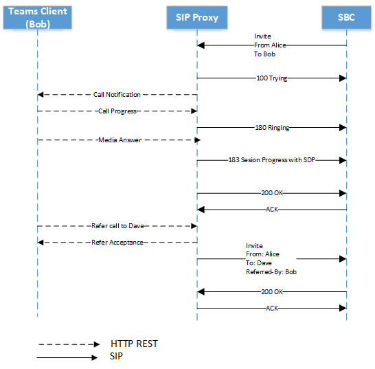
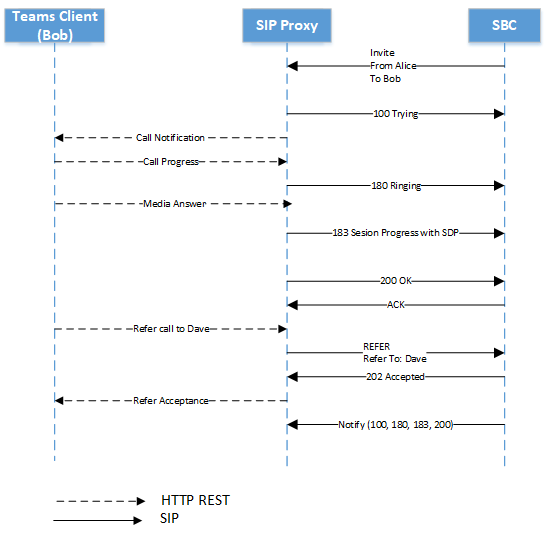

# <a name="direct-routing---sip-protocol"></a><span data-ttu-id="d4be9-103">直接路由 - SIP 协议</span><span class="sxs-lookup"><span data-stu-id="d4be9-103">Direct Routing - SIP protocol</span></span>

<span data-ttu-id="d4be9-104">本文介绍直接路由如何将会话启动协议 (SIP) 。</span><span class="sxs-lookup"><span data-stu-id="d4be9-104">This article describes how Direct Routing implements the Session Initiation Protocol (SIP).</span></span> <span data-ttu-id="d4be9-105">若要在会话边界控制器与 SBC (SBC) 之间正确路由流量，某些 SIP 参数必须具有特定值。</span><span class="sxs-lookup"><span data-stu-id="d4be9-105">To properly route traffic between a Session Border Controller (SBC) and the SIP proxy, some SIP parameters must have specific values.</span></span> <span data-ttu-id="d4be9-106">本文适用于负责配置本地 SBC 与 SIP 代理服务之间的连接的语音管理员。</span><span class="sxs-lookup"><span data-stu-id="d4be9-106">This article is intended for voice administrators who are responsible for configuring the connection between the on-premises SBC and the SIP proxy service.</span></span>

## <a name="processing-the-incoming-request-finding-the-tenant-and-user"></a><span data-ttu-id="d4be9-107">处理传入请求：查找租户和用户</span><span class="sxs-lookup"><span data-stu-id="d4be9-107">Processing the incoming request: finding the tenant and user</span></span>

<span data-ttu-id="d4be9-108">处理传入或出站呼叫之前，在 SIP 代理和 SBC 之间交换 OPTIONS 消息。</span><span class="sxs-lookup"><span data-stu-id="d4be9-108">Before an incoming or outbound call can be processed, OPTIONS messages are exchanged between SIP Proxy and the SBC.</span></span> <span data-ttu-id="d4be9-109">这些 OPTIONS 消息允许 SIP 代理向 SBC 提供允许的功能。</span><span class="sxs-lookup"><span data-stu-id="d4be9-109">These OPTIONS messages allow SIP Proxy to provide the allowed capabilities to SBC.</span></span> <span data-ttu-id="d4be9-110">必须成功通过 OPTIONS 协商 (200OK) ，从而在 SBC 和 SIP 代理之间进一步通信，建立呼叫。</span><span class="sxs-lookup"><span data-stu-id="d4be9-110">It is important for OPTIONS negotiation to be successful (200OK response), allowing for further communication between SBC and SIP Proxy for establishing calls.</span></span> <span data-ttu-id="d4be9-111">下面提供了一个示例，在发送到 SIP 代理的 OPTIONS 消息中提供 SIP 标头：</span><span class="sxs-lookup"><span data-stu-id="d4be9-111">The SIP headers in an OPTIONS messages to SIP Proxy are provided as an example below:</span></span>

| <span data-ttu-id="d4be9-112">参数名称</span><span class="sxs-lookup"><span data-stu-id="d4be9-112">Parameter name</span></span> | <span data-ttu-id="d4be9-113">值的示例</span><span class="sxs-lookup"><span data-stu-id="d4be9-113">Example of the value</span></span> | 
| :---------------------  |:---------------------- |
| <span data-ttu-id="d4be9-114">Request-URI</span><span class="sxs-lookup"><span data-stu-id="d4be9-114">Request-URI</span></span> | <span data-ttu-id="d4be9-115">OPTIONS sip：sip.pstnhub.microsoft.com：5061 SIP /2.0</span><span class="sxs-lookup"><span data-stu-id="d4be9-115">OPTIONS sip:sip.pstnhub.microsoft.com:5061 SIP /2.0</span></span> |
| <span data-ttu-id="d4be9-116">通过标头</span><span class="sxs-lookup"><span data-stu-id="d4be9-116">Via Header</span></span> | <span data-ttu-id="d4be9-117">通过：SIP/2.0/TLS sbc1.adatum.biz：5058;alias;branch=z9hG4bKac2121518978</span><span class="sxs-lookup"><span data-stu-id="d4be9-117">Via: SIP/2.0/TLS sbc1.adatum.biz:5058;alias;branch=z9hG4bKac2121518978</span></span> | 
| <span data-ttu-id="d4be9-118">Max-Forwards标头</span><span class="sxs-lookup"><span data-stu-id="d4be9-118">Max-Forwards header</span></span> | <span data-ttu-id="d4be9-119">最大转发数：68</span><span class="sxs-lookup"><span data-stu-id="d4be9-119">Max-Forwards:68</span></span> |
| <span data-ttu-id="d4be9-120">从标头</span><span class="sxs-lookup"><span data-stu-id="d4be9-120">From Header</span></span> | <span data-ttu-id="d4be9-121">From Header From： <sip:sbc1.adatum.biz:5058></span><span class="sxs-lookup"><span data-stu-id="d4be9-121">From Header From: <sip:sbc1.adatum.biz:5058></span></span> |
| <span data-ttu-id="d4be9-122">To Header</span><span class="sxs-lookup"><span data-stu-id="d4be9-122">To Header</span></span> | <span data-ttu-id="d4be9-123">自： <sip:sip.pstnhub.microsoft.com:5061></span><span class="sxs-lookup"><span data-stu-id="d4be9-123">To: <sip:sip.pstnhub.microsoft.com:5061></span></span> |
| <span data-ttu-id="d4be9-124">CSeq 标头</span><span class="sxs-lookup"><span data-stu-id="d4be9-124">CSeq header</span></span> | <span data-ttu-id="d4be9-125">CSeq：1 INVITE</span><span class="sxs-lookup"><span data-stu-id="d4be9-125">CSeq: 1 INVITE</span></span> | 
| <span data-ttu-id="d4be9-126">联系人头</span><span class="sxs-lookup"><span data-stu-id="d4be9-126">Contact Header</span></span> | <span data-ttu-id="d4be9-127">联系人： <sip:sbc1.adatum.biz:50588;transport=tls></span><span class="sxs-lookup"><span data-stu-id="d4be9-127">Contact: <sip:sbc1.adatum.biz:50588;transport=tls></span></span> |

> [!NOTE]
> <span data-ttu-id="d4be9-128">SIP 标头在使用的 SIP URI 中不包含 userinfo。</span><span class="sxs-lookup"><span data-stu-id="d4be9-128">The SIP headers do not contain userinfo in the SIP URI in use.</span></span> <span data-ttu-id="d4be9-129">根据 [RFC 3261 第 19.1.1](https://tools.ietf.org/html/rfc3261#section-19.1.1)节，URI 的 userinfo 部分是可选的，当目标主机没有用户概念或当主机本身是标识的资源时，可能会不存在。</span><span class="sxs-lookup"><span data-stu-id="d4be9-129">As per [RFC 3261, section 19.1.1](https://tools.ietf.org/html/rfc3261#section-19.1.1), the userinfo part of a URI is optional and MAY be absent when the destination host does not have a notion of users or when the hosst itself is the resource being identified.</span></span> <span data-ttu-id="d4be9-130">如果 SIP URI 中存在 @ 符号，则用户字段不得为空。</span><span class="sxs-lookup"><span data-stu-id="d4be9-130">If the @ sign is present in a SIP URI, the user field MUST NOT be empty.</span></span>

<span data-ttu-id="d4be9-131">在传入呼叫中，SIP 代理需要查找呼叫目标为的租户，并查找此租户中的特定用户。</span><span class="sxs-lookup"><span data-stu-id="d4be9-131">On an incoming call, the SIP proxy needs to find the tenant to which the call is destined and find the specific user within this tenant.</span></span> <span data-ttu-id="d4be9-132">租户管理员可以在多个租户中配置非 DID 号码，例如 +1001。</span><span class="sxs-lookup"><span data-stu-id="d4be9-132">The tenant administrator might configure non-DID numbers, for example +1001, in multiple tenants.</span></span> <span data-ttu-id="d4be9-133">因此，必须查找要执行数字查找的特定租户，因为多个 Microsoft 365 或 Office 365 组织中非 DID 数字可能相同。</span><span class="sxs-lookup"><span data-stu-id="d4be9-133">Therefore, it is important to find the specific tenant on which to perform the number lookup because the non-DID numbers might be the same in multiple Microsoft 365 or Office 365 organizations.</span></span>  

<span data-ttu-id="d4be9-134">本部分介绍 SIP 代理如何查找租户和用户，以及如何对传入连接执行 SBC 身份验证。</span><span class="sxs-lookup"><span data-stu-id="d4be9-134">This section describes how the SIP proxy finds the tenant and the user, and performs authentication of the SBC on the incoming connection.</span></span>

<span data-ttu-id="d4be9-135">下面是传入呼叫上的 SIP 邀请消息的示例：</span><span class="sxs-lookup"><span data-stu-id="d4be9-135">The following is an example of the SIP Invite message on an incoming call:</span></span>

| <span data-ttu-id="d4be9-136">参数名称</span><span class="sxs-lookup"><span data-stu-id="d4be9-136">Parameter name</span></span> | <span data-ttu-id="d4be9-137">值的示例</span><span class="sxs-lookup"><span data-stu-id="d4be9-137">Example of the value</span></span> | 
| :---------------------  |:---------------------- |
| <span data-ttu-id="d4be9-138">Request-URI</span><span class="sxs-lookup"><span data-stu-id="d4be9-138">Request-URI</span></span> | <span data-ttu-id="d4be9-139">邀请 sip:+18338006777@sip.pstnhub.microsoft.com SIP /2.0</span><span class="sxs-lookup"><span data-stu-id="d4be9-139">INVITE sip:+18338006777@sip.pstnhub.microsoft.com SIP /2.0</span></span> |
| <span data-ttu-id="d4be9-140">通过标头</span><span class="sxs-lookup"><span data-stu-id="d4be9-140">Via Header</span></span> | <span data-ttu-id="d4be9-141">通过：SIP/2.0/TLS sbc1.adatum.biz：5058;alias;branch=z9hG4bKac2121518978</span><span class="sxs-lookup"><span data-stu-id="d4be9-141">Via: SIP/2.0/TLS sbc1.adatum.biz:5058;alias;branch=z9hG4bKac2121518978</span></span> | 
| <span data-ttu-id="d4be9-142">Max-Forwards标头</span><span class="sxs-lookup"><span data-stu-id="d4be9-142">Max-Forwards header</span></span> | <span data-ttu-id="d4be9-143">最大转发数：68</span><span class="sxs-lookup"><span data-stu-id="d4be9-143">Max-Forwards:68</span></span> |
| <span data-ttu-id="d4be9-144">从标头</span><span class="sxs-lookup"><span data-stu-id="d4be9-144">From Header</span></span> | <span data-ttu-id="d4be9-145">从头文件来源：<sip：7168712781@sbc1.adatum.biz;transport=udp;tag=1c747237679</span><span class="sxs-lookup"><span data-stu-id="d4be9-145">From Header From: <sip:7168712781@sbc1.adatum.biz;transport=udp;tag=1c747237679</span></span> |
| <span data-ttu-id="d4be9-146">To Header</span><span class="sxs-lookup"><span data-stu-id="d4be9-146">To Header</span></span> | <span data-ttu-id="d4be9-147">To： sip:+183338006777@sbc1.adatum.biz</span><span class="sxs-lookup"><span data-stu-id="d4be9-147">To: sip:+183338006777@sbc1.adatum.biz</span></span> | 
| <span data-ttu-id="d4be9-148">CSeq 标头</span><span class="sxs-lookup"><span data-stu-id="d4be9-148">CSeq header</span></span> | <span data-ttu-id="d4be9-149">CSeq：1 INVITE</span><span class="sxs-lookup"><span data-stu-id="d4be9-149">CSeq: 1 INVITE</span></span> | 
| <span data-ttu-id="d4be9-150">联系人头</span><span class="sxs-lookup"><span data-stu-id="d4be9-150">Contact Header</span></span> | <span data-ttu-id="d4be9-151">联系人：<sip：68712781@sbc1.adatum.biz：5058;transport=tls></span><span class="sxs-lookup"><span data-stu-id="d4be9-151">Contact: <sip: 68712781@sbc1.adatum.biz:5058;transport=tls></span></span> | 

<span data-ttu-id="d4be9-152">在收到邀请时，SIP 代理将执行以下步骤：</span><span class="sxs-lookup"><span data-stu-id="d4be9-152">On receiving the invite, the SIP proxy performs the following steps:</span></span>

1. <span data-ttu-id="d4be9-153">检查证书。</span><span class="sxs-lookup"><span data-stu-id="d4be9-153">Check the certificate.</span></span> <span data-ttu-id="d4be9-154">在初始连接上，直接路由服务采用 Contact 标头中呈现的 FQDN 名称，并匹配该名称与所呈现证书的公用名称或主题可选名称。</span><span class="sxs-lookup"><span data-stu-id="d4be9-154">On the initial connection, the Direct Routing service takes the FQDN name presented in the Contact header and matches it to the Common Name or Subject Alternative name of the presented certificate.</span></span> <span data-ttu-id="d4be9-155">SBC 名称必须与以下选项之一匹配：</span><span class="sxs-lookup"><span data-stu-id="d4be9-155">The SBC name must match one of the following options:</span></span>

   - <span data-ttu-id="d4be9-156">选项 1.</span><span class="sxs-lookup"><span data-stu-id="d4be9-156">Option 1.</span></span> <span data-ttu-id="d4be9-157">Contact 标头中提供的完整 FQDN 名称必须与所呈现证书的公用名称/主题可选名称匹配。</span><span class="sxs-lookup"><span data-stu-id="d4be9-157">The full FQDN name presented in the Contact header must match the Common Name/Subject Alternative name of the presented certificate.</span></span>  

   - <span data-ttu-id="d4be9-158">选项 2.</span><span class="sxs-lookup"><span data-stu-id="d4be9-158">Option 2.</span></span> <span data-ttu-id="d4be9-159">联系人标头 (中呈现的 FQDN 名称的域部分（例如 FQDN 名称 sbc1.adatum.biz) 的 adatum.biz）必须与公用名称/主题可选名称 (例如 \*.adatum.biz) 中的通配符值匹配。</span><span class="sxs-lookup"><span data-stu-id="d4be9-159">The domain portion of the FQDN name presented in the Contact header (for example adatum.biz of the FQDN name sbc1.adatum.biz) must match the wildcard value in Common Name/Subject Alternative Name (for example \*.adatum.biz).</span></span>

2. <span data-ttu-id="d4be9-160">尝试使用 Contact 标头中提供的完整 FQDN 名称查找租户。</span><span class="sxs-lookup"><span data-stu-id="d4be9-160">Try to find a tenant using the full FQDN name presented in the Contact header.</span></span>  

   <span data-ttu-id="d4be9-161">检查联系人标头中的 FQDN 名称 (sbc1.adatum.biz) Microsoft 365 或 Office 365 组织中注册为 DNS 名称。</span><span class="sxs-lookup"><span data-stu-id="d4be9-161">Check if the FQDN name from the Contact header (sbc1.adatum.biz) is registered as a DNS name in any Microsoft 365 or Office 365 organization.</span></span> <span data-ttu-id="d4be9-162">如果找到，在 SBC FQDN 已注册为域名的租户中执行用户的查找。</span><span class="sxs-lookup"><span data-stu-id="d4be9-162">If found, the lookup of the user is performed in the tenant that has the SBC FQDN registered as a Domain name.</span></span> <span data-ttu-id="d4be9-163">如果未找到，则步骤 3 适用。</span><span class="sxs-lookup"><span data-stu-id="d4be9-163">If not found, Step 3 applies.</span></span>   

3. <span data-ttu-id="d4be9-164">步骤 3 仅适用于步骤 2 失败的情况。</span><span class="sxs-lookup"><span data-stu-id="d4be9-164">Step 3 only applies if Step 2 failed.</span></span> 

   <span data-ttu-id="d4be9-165">删除主机部分 adatum.biz) 后，从联系人标头 (FQDN： sbc12.adatum.biz 中呈现的 FQDN 中删除主机部分，并检查此名称是否注册为任何 Microsoft 365 或 Office 365 组织的 DNS 名称。</span><span class="sxs-lookup"><span data-stu-id="d4be9-165">Remove the host portion from the FQDN, presented in the Contact header (FQDN: sbc12.adatum.biz, after removing the host portion: adatum.biz), and check if this name is registered as a DNS name in any Microsoft 365 or Office 365 organization.</span></span> <span data-ttu-id="d4be9-166">如果找到，则在此租户中执行用户查找。</span><span class="sxs-lookup"><span data-stu-id="d4be9-166">If found, the user lookup is performed in this tenant.</span></span> <span data-ttu-id="d4be9-167">如果未找到，则调用会失败。</span><span class="sxs-lookup"><span data-stu-id="d4be9-167">If not found, the call fails.</span></span>

4. <span data-ttu-id="d4be9-168">使用 Request-URI 中提供的电话号码，在步骤 2 或 3 中的租户内执行反向号码查找。</span><span class="sxs-lookup"><span data-stu-id="d4be9-168">Using the phone number presented in the Request-URI, perform the reverse number lookup within the tenant found in Step 2 or 3.</span></span> <span data-ttu-id="d4be9-169">将提供的电话号码与上一步找到的租户中的用户 SIP URI 匹配。</span><span class="sxs-lookup"><span data-stu-id="d4be9-169">Match the presented phone number to a user SIP URI within the tenant found on the previous step.</span></span>

5. <span data-ttu-id="d4be9-170">应用中继设置。</span><span class="sxs-lookup"><span data-stu-id="d4be9-170">Apply trunk settings.</span></span> <span data-ttu-id="d4be9-171">查找租户管理员为此 SBC 设置的参数。</span><span class="sxs-lookup"><span data-stu-id="d4be9-171">Find the parameters set by the tenant admin for this SBC.</span></span>

   <span data-ttu-id="d4be9-172">Microsoft 不支持在 Microsoft SIP 代理和配对 SBC 之间设置第三方 SIP 代理或用户代理服务器，这可能会修改配对 SBC 创建的请求 URI。</span><span class="sxs-lookup"><span data-stu-id="d4be9-172">Microsoft does not support having a third-party SIP proxy or User Agent Server between the Microsoft SIP proxy and the paired SBC, which might modify the Request URI created by the paired SBC.</span></span>

   <span data-ttu-id="d4be9-173">本文 (稍后将介绍一个 SBC 与许多租户 (运营商方案) 互连的方案所需的两个查找步骤 2 和 3) 。</span><span class="sxs-lookup"><span data-stu-id="d4be9-173">The requirements for the two lookups (steps 2 and 3) needed for the scenario where one SBC is interconnected to many tenants (carrier scenario) are covered later in this article.</span></span>

### <a name="detailed-requirements-for-contact-header-and-request-uri"></a><span data-ttu-id="d4be9-174">Contact 标头和 Request-URI 的详细要求</span><span class="sxs-lookup"><span data-stu-id="d4be9-174">Detailed requirements for Contact header and Request-URI</span></span>

#### <a name="contact-header"></a><span data-ttu-id="d4be9-175">联系人头</span><span class="sxs-lookup"><span data-stu-id="d4be9-175">Contact header</span></span>

<span data-ttu-id="d4be9-176">对于所有传入的 SIP (OPTIONS，INVITE) 到 Microsoft SIP 代理，联系人标头必须在 URI 主机名中具有配对的 SBC FQDN，如下所示：</span><span class="sxs-lookup"><span data-stu-id="d4be9-176">For all incoming SIP messages (OPTIONS, INVITE) to the Microsoft SIP proxy, the Contact header must have the paired SBC FQDN in the URI hostname as follows:</span></span>

<span data-ttu-id="d4be9-177">语法：联系人：<SBC 的 sip：phone 或 sip address@FQDN;transport=tls></span><span class="sxs-lookup"><span data-stu-id="d4be9-177">Syntax: Contact:  <sip:phone or sip address@FQDN of the SBC;transport=tls></span></span> 

<span data-ttu-id="d4be9-178">根据 [RFC 3261 第 11.1](https://tools.ietf.org/html/rfc3261#section-11.1)节，"联系人标题"字段可能存在于"选项"消息中。</span><span class="sxs-lookup"><span data-stu-id="d4be9-178">As per [RFC 3261, section 11.1](https://tools.ietf.org/html/rfc3261#section-11.1), a Contact header field MAY be present in an OPTIONS message.</span></span> <span data-ttu-id="d4be9-179">在"直接路由"中，需要联系人标头。</span><span class="sxs-lookup"><span data-stu-id="d4be9-179">In Direct Routing the contact header is required.</span></span> <span data-ttu-id="d4be9-180">对于上述格式的 INVITE 消息，对于 OPTIONS 消息，可以从 SIP URI 中删除 userinfo，并且仅按以下格式发送 FQDN：</span><span class="sxs-lookup"><span data-stu-id="d4be9-180">For INVITE messages in format above, for OPTIONS messages the userinfo can be removed from SIP URI and only FQDN sent in format as follows:</span></span>

<span data-ttu-id="d4be9-181">语法：Contact：<SBC 的 sip：FQDN;transport=tls></span><span class="sxs-lookup"><span data-stu-id="d4be9-181">Syntax: Contact:  <sip:FQDN of the SBC;transport=tls></span></span>

<span data-ttu-id="d4be9-182">此名称 (FQDN) 还必须在所提供证书的"公用名称"或" (可选) 字段。</span><span class="sxs-lookup"><span data-stu-id="d4be9-182">This name (FQDN) must also be in the Common Name or Subject Alternative name field(s) of the presented certificate.</span></span> <span data-ttu-id="d4be9-183">Microsoft 支持在证书的"公用 (或) 可选名称"字段中使用名称的通配符值。</span><span class="sxs-lookup"><span data-stu-id="d4be9-183">Microsoft supports using wildcard values of the name(s) in the Common Name or Subject Alternative Name fields of the certificate.</span></span>   

<span data-ttu-id="d4be9-184">RFC [2818 第 3.1 部分介绍了对通配符的支持](https://tools.ietf.org/html/rfc2818#section-3.1)。</span><span class="sxs-lookup"><span data-stu-id="d4be9-184">The support for wildcards is described in [RFC 2818, section 3.1](https://tools.ietf.org/html/rfc2818#section-3.1).</span></span> <span data-ttu-id="d4be9-185">具体而言：</span><span class="sxs-lookup"><span data-stu-id="d4be9-185">Specifically:</span></span>

<span data-ttu-id="d4be9-186">*"名称可能包含通配符 \* ，该通配符被视为匹配任何单个域名组件或组件片段。例如 \* ，.a.com 与 foo.a.com 匹配 bar.foo.a.com。f \* .com foo.com，bar.com。"*</span><span class="sxs-lookup"><span data-stu-id="d4be9-186">*"Names may contain the wildcard character \* which is considered to match any single domain name component or component fragment. E.g., \*.a.com matches foo.a.com but not bar.foo.a.com. f\*.com matches foo.com but not bar.com."*</span></span>

<span data-ttu-id="d4be9-187">如果 SBC 发送了 SIP 消息中"联系人"标头中的多个值，则只会使用"联系人"标头的第一个值的 FQDN 部分。</span><span class="sxs-lookup"><span data-stu-id="d4be9-187">If more than one value in the Contact header presented in a SIP message is sent by the SBC, only the FQDN portion of the first value of the Contact header is used.</span></span>

<span data-ttu-id="d4be9-188">根据直接路由的经验法则，FQDN 用于填充 SIP URI 而不是 IP，这一点很重要。</span><span class="sxs-lookup"><span data-stu-id="d4be9-188">As rule of thumb for Direct Routing, it is important that FQDN is used to populate SIP URI instead of IP.</span></span> <span data-ttu-id="d4be9-189">将传入的 INVITE 或 OPTIONS 消息发送到包含联系人标头的 SIP 代理，其中主机名由 IP 表示，而不是 FQDN，连接将被拒绝并出现 403 禁止访问。</span><span class="sxs-lookup"><span data-stu-id="d4be9-189">An incoming INVITE or OPTIONS message to SIP Proxy with Contact header where hostname is represented by IP and not FQDN, the connection will be refused with 403 Forbidden.</span></span>

#### <a name="request-uri"></a><span data-ttu-id="d4be9-190">Request-URI</span><span class="sxs-lookup"><span data-stu-id="d4be9-190">Request-URI</span></span> 

<span data-ttu-id="d4be9-191">对于所有传入呼叫，使用 Request-URI 将电话号码与用户匹配。</span><span class="sxs-lookup"><span data-stu-id="d4be9-191">For all incoming calls, the Request-URI is used to match the phone number to a user.</span></span>   

<span data-ttu-id="d4be9-192">目前电话号码必须包含加号 (+) 如以下示例所示。</span><span class="sxs-lookup"><span data-stu-id="d4be9-192">Currently The phone number must contain a plus sign (+) as shown in the following example.</span></span> 

```console
INVITE sip:+18338006777@sip.pstnhub.microsoft.com SIP /2.0
```

## <a name="contact-and-record-route-headers-considerations"></a><span data-ttu-id="d4be9-193">联系人Record-Route头注意事项</span><span class="sxs-lookup"><span data-stu-id="d4be9-193">Contact and Record-Route headers considerations</span></span>

<span data-ttu-id="d4be9-194">SIP 代理需要计算新对话客户端事务的下一跃点 FQDN (例如 Bye 或重新邀请) ，以及答复 SIP 选项时。</span><span class="sxs-lookup"><span data-stu-id="d4be9-194">The SIP proxy needs to calculate the next hop FQDN for new in-dialog client transactions (for example Bye or Re-Invite), and when replying to SIP Options.</span></span> <span data-ttu-id="d4be9-195">使用"联系人Record-Route联系人"。</span><span class="sxs-lookup"><span data-stu-id="d4be9-195">Either Contact or Record-Route are used.</span></span> 

<span data-ttu-id="d4be9-196">根据 [RFC 3261 第 8.1.1.8](https://tools.ietf.org/html/rfc3261#section-8.1.1.8)部分，任何可能导致新对话的请求都需要联系人标头。</span><span class="sxs-lookup"><span data-stu-id="d4be9-196">According to [RFC 3261, section 8.1.1.8](https://tools.ietf.org/html/rfc3261#section-8.1.1.8), Contact header is required in any request that can result in a new dialog.</span></span> <span data-ttu-id="d4be9-197">只有Record-Route想要停留在对话中未来请求的路径时，才需要该请求。</span><span class="sxs-lookup"><span data-stu-id="d4be9-197">The Record-Route is only required if a proxy wants to stay on the path of future requests in a dialog.</span></span> <span data-ttu-id="d4be9-198">如果代理 SBC 与直接路由的本地媒体优化一同 [使用](./direct-routing-media-optimization.md)，则需要配置记录路由，因为代理 SBC 需要停留在路由中。</span><span class="sxs-lookup"><span data-stu-id="d4be9-198">If a proxy SBC is in use with [Local Media Optimization for Direct Routing](./direct-routing-media-optimization.md), a record route will need to be configured as the proxy SBC needs to stay in the route.</span></span> 

<span data-ttu-id="d4be9-199">如果未使用代理 SBC，Microsoft 建议仅使用 Contact 标头：</span><span class="sxs-lookup"><span data-stu-id="d4be9-199">Microsoft recommends using only Contact header if a proxy SBC is not used:</span></span>

- <span data-ttu-id="d4be9-200">根据 [RFC 3261，](https://tools.ietf.org/html/rfc3261#section-20.30)如果代理想要停留在对话中未来请求的路径，则使用第 20.30 节 Record-Route;如果未配置代理 SBC，则使用这一点，因为所有流量在 Microsoft SIP 代理和配对的 SBC 之间移动。</span><span class="sxs-lookup"><span data-stu-id="d4be9-200">Per [RFC 3261, section 20.30](https://tools.ietf.org/html/rfc3261#section-20.30), Record-Route is used if a proxy wants to stay on the path of future requests in a dialog, which is not essential if no proxy SBC is configured as all traffic goes between the Microsoft SIP proxy and the paired SBC.</span></span> 

- <span data-ttu-id="d4be9-201">Microsoft SIP 代理仅使用 Contact 标头 (而不是 Record-Route) 发送出站 ping 选项时确定下一跃点。</span><span class="sxs-lookup"><span data-stu-id="d4be9-201">The Microsoft SIP proxy uses only Contact header (not Record-Route) to determine the next hop when sending outbound ping Options.</span></span> <span data-ttu-id="d4be9-202">如果代理 SBC (，) 仅配置一个参数 (Contact 和 Record-Route) 可简化管理。</span><span class="sxs-lookup"><span data-stu-id="d4be9-202">Configuring only one parameter (Contact) instead of two (Contact and Record-Route) simplifies the administration if a proxy SBC is not in use.</span></span> 

<span data-ttu-id="d4be9-203">若要计算下一跃点，SIP 代理使用：</span><span class="sxs-lookup"><span data-stu-id="d4be9-203">To calculate the next hop, the SIP proxy uses:</span></span>

- <span data-ttu-id="d4be9-204">优先级 1.</span><span class="sxs-lookup"><span data-stu-id="d4be9-204">Priority 1.</span></span> <span data-ttu-id="d4be9-205">顶级记录路由。</span><span class="sxs-lookup"><span data-stu-id="d4be9-205">Top-level Record-Route.</span></span> <span data-ttu-id="d4be9-206">如果顶级Record-Route包含 FQDN 名称，则 FQDN 名称用于建立出站对话内连接。</span><span class="sxs-lookup"><span data-stu-id="d4be9-206">If the top-level Record-Route contains the FQDN name, the FQDN name is used to make the outbound in-dialog connection.</span></span>

- <span data-ttu-id="d4be9-207">优先级 2.</span><span class="sxs-lookup"><span data-stu-id="d4be9-207">Priority 2.</span></span> <span data-ttu-id="d4be9-208">联系人头。</span><span class="sxs-lookup"><span data-stu-id="d4be9-208">Contact header.</span></span> <span data-ttu-id="d4be9-209">如果Record-Route不存在，SIP 代理将查找 Contact 标头的值以建立出站连接。</span><span class="sxs-lookup"><span data-stu-id="d4be9-209">If Record-Route does not exist, the SIP proxy will look up the value of the Contact header to make the outbound connection.</span></span> <span data-ttu-id="d4be9-210"> (这是建议的配置.) </span><span class="sxs-lookup"><span data-stu-id="d4be9-210">(This is the recommended configuration.)</span></span>

<span data-ttu-id="d4be9-211">如果使用 Contact 和 Record-Route，SBC 管理员必须保持其值相同，这会造成管理开销。</span><span class="sxs-lookup"><span data-stu-id="d4be9-211">If both Contact and Record-Route are used, the SBC administrator must keep their values identical, which causes administrative overhead.</span></span> 

### <a name="use-of-fqdn-name-in-contact-or-record-route"></a><span data-ttu-id="d4be9-212">在联系人或联系人中使用 FQDN Record-Route</span><span class="sxs-lookup"><span data-stu-id="d4be9-212">Use of FQDN name in Contact or Record-Route</span></span>

<span data-ttu-id="d4be9-213">在"联系人"或"联系人"中Record-Route IP 地址。</span><span class="sxs-lookup"><span data-stu-id="d4be9-213">Use of an IP address is not supported in either Record-Route or Contact.</span></span> <span data-ttu-id="d4be9-214">唯一支持的选项是 FQDN，它必须匹配 SBC 证书的公用名称或主题可选名称， (证书中的通配符值) 。</span><span class="sxs-lookup"><span data-stu-id="d4be9-214">The only supported option is an FQDN, which must match either the Common Name or Subject Alternative Name of the SBC certificate (wildcard values in the certificate are supported).</span></span>

- <span data-ttu-id="d4be9-215">如果"记录路由"或"联系人"中显示 IP 地址，证书检查会失败，调用会失败。</span><span class="sxs-lookup"><span data-stu-id="d4be9-215">If an IP address is presented in Record-route or Contact, the certificate check fails and the call fails.</span></span>

- <span data-ttu-id="d4be9-216">如果 FQDN 与呈现的证书中"通用"或"主题可选名称"的值不匹配，则调用会失败。</span><span class="sxs-lookup"><span data-stu-id="d4be9-216">If the FQDN does not match the value of the Common or Subject Alternative Name in the presented certificate, the call fails.</span></span> 

## <a name="inbound-call-sip-dialog-description"></a><span data-ttu-id="d4be9-217">入站呼叫：SIP 对话框说明</span><span class="sxs-lookup"><span data-stu-id="d4be9-217">Inbound call: SIP dialog description</span></span>

<span data-ttu-id="d4be9-218">下表汇总了非绕过和绕过模式之间的呼叫流差异和相似点：</span><span class="sxs-lookup"><span data-stu-id="d4be9-218">The following table below summarizes the call flow differences and similarities between non-bypass and bypass modes:</span></span>

| <span data-ttu-id="d4be9-219">参数名称</span><span class="sxs-lookup"><span data-stu-id="d4be9-219">Parameter name</span></span> | <span data-ttu-id="d4be9-220">非绕过模式</span><span class="sxs-lookup"><span data-stu-id="d4be9-220">Non-bypass mode</span></span> | <span data-ttu-id="d4be9-221">绕过模式</span><span class="sxs-lookup"><span data-stu-id="d4be9-221">Bypass mode</span></span>
| :---------------------  |:---------------------- |:----------------|
| <span data-ttu-id="d4be9-222">来自 183 和 200 条消息的媒体候选者</span><span class="sxs-lookup"><span data-stu-id="d4be9-222">Media candidates in 183 and 200 messages coming from</span></span> | <span data-ttu-id="d4be9-223">媒体处理器</span><span class="sxs-lookup"><span data-stu-id="d4be9-223">Media processors</span></span> | <span data-ttu-id="d4be9-224">客户端</span><span class="sxs-lookup"><span data-stu-id="d4be9-224">Clients</span></span> | 
| <span data-ttu-id="d4be9-225">SBC 可以接收的 183 条消息数</span><span class="sxs-lookup"><span data-stu-id="d4be9-225">Number of 183 messages SBC can receive</span></span> | <span data-ttu-id="d4be9-226">每个会话一个</span><span class="sxs-lookup"><span data-stu-id="d4be9-226">One per session</span></span> | <span data-ttu-id="d4be9-227">多个</span><span class="sxs-lookup"><span data-stu-id="d4be9-227">Multiple</span></span> | 
| <span data-ttu-id="d4be9-228">呼叫可以是使用 183 (临时) </span><span class="sxs-lookup"><span data-stu-id="d4be9-228">Call can be with provisional answer (183)</span></span> | <span data-ttu-id="d4be9-229">是</span><span class="sxs-lookup"><span data-stu-id="d4be9-229">Yes</span></span> | <span data-ttu-id="d4be9-230">是</span><span class="sxs-lookup"><span data-stu-id="d4be9-230">Yes</span></span> |
| <span data-ttu-id="d4be9-231">呼叫无需 183 (临时) </span><span class="sxs-lookup"><span data-stu-id="d4be9-231">Call can be without provisional answer (183)</span></span> | <span data-ttu-id="d4be9-232">是</span><span class="sxs-lookup"><span data-stu-id="d4be9-232">Yes</span></span> | <span data-ttu-id="d4be9-233">是</span><span class="sxs-lookup"><span data-stu-id="d4be9-233">Yes</span></span> |

###  <a name="non-media-bypass-flow"></a><span data-ttu-id="d4be9-234">非媒体旁路流</span><span class="sxs-lookup"><span data-stu-id="d4be9-234">Non-media bypass flow</span></span>

<span data-ttu-id="d4be9-235">一个 Teams 用户可能同时有多个终结点。</span><span class="sxs-lookup"><span data-stu-id="d4be9-235">A Teams user might have multiple endpoints at the same time.</span></span> <span data-ttu-id="d4be9-236">例如，Teams for Windows 客户端、Teams for iPhone 客户端和 Teams Phone (Teams Android 客户端) 。</span><span class="sxs-lookup"><span data-stu-id="d4be9-236">For example, Teams for Windows client, Teams for iPhone client, and Teams Phone (Teams Android client).</span></span> <span data-ttu-id="d4be9-237">每个终结点可能会发出 HTTP REST 信号，如下所示：</span><span class="sxs-lookup"><span data-stu-id="d4be9-237">Each endpoint might signal an HTTP rest as follows:</span></span>

-   <span data-ttu-id="d4be9-238">呼叫进度 - 由 SIP 代理转换为 SIP 消息 180。</span><span class="sxs-lookup"><span data-stu-id="d4be9-238">Call progress – converted by the SIP proxy to the SIP message 180.</span></span> <span data-ttu-id="d4be9-239">收到消息 180 时，SBC 必须生成本地响铃。</span><span class="sxs-lookup"><span data-stu-id="d4be9-239">On receiving message 180, the SBC must generate local ringing.</span></span>

-   <span data-ttu-id="d4be9-240">媒体应答 - 由 SIP 代理转换为消息 183，在"会话说明协议"中将媒体候选项 (SDP) 。</span><span class="sxs-lookup"><span data-stu-id="d4be9-240">Media answer – converted by the SIP proxy to message 183 with media candidates in Session Description Protocol (SDP).</span></span> <span data-ttu-id="d4be9-241">收到消息 183 时，SBC 需要连接到在 SDP 消息中收到的媒体候选项。</span><span class="sxs-lookup"><span data-stu-id="d4be9-241">On receiving message 183, the SBC expects to connect to the media candidates received in the SDP message.</span></span> 

    > [!NOTE]
    > <span data-ttu-id="d4be9-242">在某些情况下，媒体应答可能未生成，并且最终点可能使用"已接受呼叫"消息进行应答。</span><span class="sxs-lookup"><span data-stu-id="d4be9-242">In some cases the Media answer might not be generated, and the end point might answer with “Call Accepted” message.</span></span>

-   <span data-ttu-id="d4be9-243">已接受呼叫 – 由 SIP 代理转换为包含 SDP 的 SIP 消息 200。</span><span class="sxs-lookup"><span data-stu-id="d4be9-243">Call accepted – converted by the SIP proxy to SIP message 200 with SDP.</span></span> <span data-ttu-id="d4be9-244">收到消息 200 时，SBC 预期会向提供的 SDP 候选项发送和接收媒体。</span><span class="sxs-lookup"><span data-stu-id="d4be9-244">On receiving message 200, the SBC is expected to send and receive media to and from the provided SDP candidates.</span></span>

#### <a name="multiple-endpoints-ringing-with-provisional-answer"></a><span data-ttu-id="d4be9-245">多个终结点使用临时答案响铃</span><span class="sxs-lookup"><span data-stu-id="d4be9-245">Multiple endpoints ringing with provisional answer</span></span>

1.  <span data-ttu-id="d4be9-246">从 SBC 接收第一个邀请时，SIP 代理发送消息"SIP/2.0 100 正在尝试"，并通知所有最终用户终结点传入呼叫。</span><span class="sxs-lookup"><span data-stu-id="d4be9-246">On receiving the first Invite from the SBC, the SIP proxy sends the message "SIP SIP/2.0 100 Trying" and notifies all end user endpoints about the incoming call.</span></span> 

2.  <span data-ttu-id="d4be9-247">通知后，每个终结点都将开始响铃，向 SIP 代理发送"呼叫进度"消息。</span><span class="sxs-lookup"><span data-stu-id="d4be9-247">Upon notification, each endpoint will start ringing and sending "Call progress” messages to the SIP proxy.</span></span> <span data-ttu-id="d4be9-248">由于 Teams 用户可以有多个终点，因此 SIP 代理可能会收到多个呼叫进度消息。</span><span class="sxs-lookup"><span data-stu-id="d4be9-248">Because a Teams user can have multiple end points, the SIP proxy might receive multiple Call Progress messages.</span></span>

3.  <span data-ttu-id="d4be9-249">对于从客户端收到的每个呼叫进度消息，SIP 代理将呼叫进度消息转换为 SIP 消息"SIP SIP/2.0 180 正在尝试"。</span><span class="sxs-lookup"><span data-stu-id="d4be9-249">For every Call Progress message received from the clients, the SIP proxy converts the Call Progress message to the SIP message "SIP SIP/2.0 180 Trying".</span></span> <span data-ttu-id="d4be9-250">发送此类消息的间隔由从调用控制器接收消息的间隔定义。</span><span class="sxs-lookup"><span data-stu-id="d4be9-250">The interval for sending such messages is defined by the interval of the receiving messages from the Call Controller.</span></span> <span data-ttu-id="d4be9-251">下图显示了 SIP 代理生成的两条 180 条消息。</span><span class="sxs-lookup"><span data-stu-id="d4be9-251">In the following diagram, there are two 180 messages generated by the SIP proxy.</span></span> <span data-ttu-id="d4be9-252">这些消息来自用户的两个 Teams 终结点。</span><span class="sxs-lookup"><span data-stu-id="d4be9-252">These messages come from the two Teams endpoints of the user.</span></span> <span data-ttu-id="d4be9-253">每个客户端都有唯一的标记 ID。</span><span class="sxs-lookup"><span data-stu-id="d4be9-253">The clients each have a unique Tag ID.</span></span>  <span data-ttu-id="d4be9-254">来自不同终结点的每条消息都是单独的会话 ("收件人"字段中的参数"tag"与) 。</span><span class="sxs-lookup"><span data-stu-id="d4be9-254">Every message coming from a different endpoint will be a separate session (the parameter “tag” in the “To” field will be different).</span></span> <span data-ttu-id="d4be9-255">但是，终结点可能不会立即生成消息 180 并发送消息 183，如下图所示。</span><span class="sxs-lookup"><span data-stu-id="d4be9-255">But an endpoint might not generate message 180 and send message 183 right away as shown in the following diagram.</span></span>

4.  <span data-ttu-id="d4be9-256">终结点使用终结点的媒体候选项的 IP 地址生成媒体应答消息后，SIP 代理会将收到的消息转换为"SIP 183 会话进度"消息，并将来自客户端的 SDP 替换为来自媒体处理器的 SDP。</span><span class="sxs-lookup"><span data-stu-id="d4be9-256">Once an endpoint generates a Media Answer message with the IP addresses of endpoint’s media candidates, the SIP proxy converts the message received to a "SIP 183 Session Progress" message with the SDP from the client replaced by the SDP from the Media Processor.</span></span> <span data-ttu-id="d4be9-257">下图中，分叉 2 中的终结点应答了调用。</span><span class="sxs-lookup"><span data-stu-id="d4be9-257">In the following diagram, the endpoint from Fork 2 answered the call.</span></span> <span data-ttu-id="d4be9-258">如果中继未绕过，则仅生成 183 SIP 消息一次 (机器人或客户端) 。</span><span class="sxs-lookup"><span data-stu-id="d4be9-258">If the trunk is non-bypassed, the 183 SIP message is generated only once (either Ring Bot or Client End Point).</span></span> <span data-ttu-id="d4be9-259">183 可能位于现有分叉上或启动新分叉。</span><span class="sxs-lookup"><span data-stu-id="d4be9-259">The 183 might come on an existing fork or start a new one.</span></span>

5.  <span data-ttu-id="d4be9-260">"呼叫接受"消息与接受呼叫的终结点的最终候选项一起发送。</span><span class="sxs-lookup"><span data-stu-id="d4be9-260">A Call Acceptance message is sent with the final candidates of the endpoint that accepted the call.</span></span> <span data-ttu-id="d4be9-261">呼叫接受消息将转换为 SIP 消息 200。</span><span class="sxs-lookup"><span data-stu-id="d4be9-261">The Call Acceptance message is converted to SIP message 200.</span></span> 

> [!div class="mx-imgBorder"]
> <span data-ttu-id="d4be9-262"></span><span class="sxs-lookup"><span data-stu-id="d4be9-262"></span></span>

#### <a name="multiple-endpoints-ringing-without-provisional-answer"></a><span data-ttu-id="d4be9-263">多个终结点在无临时应答的情况下响铃</span><span class="sxs-lookup"><span data-stu-id="d4be9-263">Multiple endpoints ringing without provisional answer</span></span>

1.  <span data-ttu-id="d4be9-264">从 SBC 接收第一个邀请时，SIP 代理发送消息"SIP/2.0 100 正在尝试"，并通知所有最终用户终结点传入呼叫。</span><span class="sxs-lookup"><span data-stu-id="d4be9-264">On receiving the first Invite from the SBC, the SIP proxy sends the message "SIP SIP/2.0 100 Trying" and notifies all end user endpoints about the incoming call.</span></span> 

2.  <span data-ttu-id="d4be9-265">通知后，每个终结点都将开始响铃，并发送消息"呼叫进度"到 SIP 代理。</span><span class="sxs-lookup"><span data-stu-id="d4be9-265">Upon notification, each endpoint will start ringing and sending the message "Call progress” to the SIP proxy.</span></span> <span data-ttu-id="d4be9-266">由于 Teams 用户可以有多个终点，因此 SIP 代理可能会收到多个呼叫进度消息。</span><span class="sxs-lookup"><span data-stu-id="d4be9-266">Because a Teams user can have multiple end points, the SIP proxy might receive multiple Call Progress messages.</span></span>

3.  <span data-ttu-id="d4be9-267">对于从客户端收到的每个呼叫进度消息，SIP 代理将呼叫进度消息转换为 SIP 消息"SIP SIP/2.0 180 正在尝试"。</span><span class="sxs-lookup"><span data-stu-id="d4be9-267">For every Call Progress message received from the clients, the SIP proxy converts the Call Progress message to the SIP message "SIP SIP/2.0 180 Trying".</span></span>  <span data-ttu-id="d4be9-268">发送消息的间隔由从调用控制器接收消息的间隔定义。</span><span class="sxs-lookup"><span data-stu-id="d4be9-268">The interval for sending the messages is defined by the interval of receiving the messages from the Call Controller.</span></span> <span data-ttu-id="d4be9-269">下图显示了 SIP 代理生成的两条 180 条消息，这意味着用户登录到三个 Teams 客户端，每个客户端发送呼叫进度。</span><span class="sxs-lookup"><span data-stu-id="d4be9-269">On the picture below there are two 180 messages generated by the SIP proxy, meaning that user logged into three Teams clients and each client send the call progress.</span></span> <span data-ttu-id="d4be9-270">每条消息将是单独的会话， ("收件人"字段中的参数"tag"不同于) </span><span class="sxs-lookup"><span data-stu-id="d4be9-270">Every message will be a separate session (parameter “tag” in “To” field is different)</span></span>

4.  <span data-ttu-id="d4be9-271">"呼叫接受"消息与接受呼叫的终结点的最终候选项一起发送。</span><span class="sxs-lookup"><span data-stu-id="d4be9-271">A Call Acceptance message is sent with the final candidates of the endpoint that accepted the call.</span></span> <span data-ttu-id="d4be9-272">呼叫接受消息将转换为 SIP 消息 200。</span><span class="sxs-lookup"><span data-stu-id="d4be9-272">The Call Acceptance message is converted to SIP message 200.</span></span> 

> [!div class="mx-imgBorder"]
> <span data-ttu-id="d4be9-273"></span><span class="sxs-lookup"><span data-stu-id="d4be9-273"></span></span>

### <a name="media-bypass-flow"></a><span data-ttu-id="d4be9-274">媒体旁路流</span><span class="sxs-lookup"><span data-stu-id="d4be9-274">Media bypass flow</span></span>

<span data-ttu-id="d4be9-275">媒体旁路 (100 尝试、180、183) 相同的消息。</span><span class="sxs-lookup"><span data-stu-id="d4be9-275">The same messages (100 Trying, 180, 183) are used in the media bypass scenario.</span></span> 

<span data-ttu-id="d4be9-276">下面的架构显示了绕过调用流的一个示例。</span><span class="sxs-lookup"><span data-stu-id="d4be9-276">The schema below shows an example of the bypass call flow.</span></span> 

> [!NOTE]
> <span data-ttu-id="d4be9-277">媒体候选项可以来自不同的终结点。</span><span class="sxs-lookup"><span data-stu-id="d4be9-277">The media candidates can come from different endpoints.</span></span> 

> [!div class="mx-imgBorder"]
> <span data-ttu-id="d4be9-278"></span><span class="sxs-lookup"><span data-stu-id="d4be9-278"></span></span>

## <a name="replaces-option"></a><span data-ttu-id="d4be9-279">替换选项</span><span class="sxs-lookup"><span data-stu-id="d4be9-279">Replaces option</span></span>

<span data-ttu-id="d4be9-280">SBC 必须支持"使用替换邀请"。</span><span class="sxs-lookup"><span data-stu-id="d4be9-280">The SBC must support Invite with Replaces.</span></span>

## <a name="size-of-sdp-considerations"></a><span data-ttu-id="d4be9-281">SDP 注意事项的大小</span><span class="sxs-lookup"><span data-stu-id="d4be9-281">Size of SDP considerations</span></span>

<span data-ttu-id="d4be9-282">直接路由接口可能会发送超过 1，500 字节的 SIP 消息。</span><span class="sxs-lookup"><span data-stu-id="d4be9-282">The Direct Routing interface might send a SIP message exceeding 1,500 bytes.</span></span>  <span data-ttu-id="d4be9-283">SDP 的大小主要会导致这种情况。</span><span class="sxs-lookup"><span data-stu-id="d4be9-283">The size of SDP primarily causes this.</span></span> <span data-ttu-id="d4be9-284">但是，如果 SBC 后面有 UDP 中继，如果消息从 Microsoft SIP 代理转发到未修改的中继，则可能会拒绝该消息。</span><span class="sxs-lookup"><span data-stu-id="d4be9-284">However, if there is a UDP trunk behind the SBC, it might reject the message if it is forwarded from the Microsoft SIP proxy to the trunk unmodified.</span></span> <span data-ttu-id="d4be9-285">Microsoft 建议在将消息发送到 UDP 中继时，去除 SBC 上的 SDP 中的某些值。</span><span class="sxs-lookup"><span data-stu-id="d4be9-285">Microsoft recommends stripping some values in SDP on the SBC when sending the message to the UDP trunks.</span></span> <span data-ttu-id="d4be9-286">例如，可以删除 ICE 候选项或未使用的编解码器。</span><span class="sxs-lookup"><span data-stu-id="d4be9-286">For example, the ICE candidates or unused codecs can be removed.</span></span>

## <a name="call-transfer"></a><span data-ttu-id="d4be9-287">呼叫转接</span><span class="sxs-lookup"><span data-stu-id="d4be9-287">Call transfer</span></span>

<span data-ttu-id="d4be9-288">直接路由支持两种调用传输方法：</span><span class="sxs-lookup"><span data-stu-id="d4be9-288">Direct Routing supports two methods for call transfer:</span></span>

- <span data-ttu-id="d4be9-289">选项 1.</span><span class="sxs-lookup"><span data-stu-id="d4be9-289">Option 1.</span></span> <span data-ttu-id="d4be9-290">SIP 代理进程 从本地客户端引用，并充当 RfC 3892 第 7.1 部分中所述的"代理"。</span><span class="sxs-lookup"><span data-stu-id="d4be9-290">SIP proxy processes Refer from the client locally and acts as a Referee as described in section 7.1 of RFC 3892.</span></span>

  <span data-ttu-id="d4be9-291">使用此选项，SIP 代理终止传输并添加新的"邀请"。</span><span class="sxs-lookup"><span data-stu-id="d4be9-291">With this option, the SIP proxy terminates the transfer and adds a new Invite.</span></span> 


- <span data-ttu-id="d4be9-292">选项 2.</span><span class="sxs-lookup"><span data-stu-id="d4be9-292">Option 2.</span></span> <span data-ttu-id="d4be9-293">SIP 代理发送参考 SBC，并充当 RFC 5589 第 6 节中描述的传输程序。</span><span class="sxs-lookup"><span data-stu-id="d4be9-293">SIP proxy sends the Refer to the SBC and acts as a Transferor as describing in Section 6 of RFC 5589.</span></span>

  <span data-ttu-id="d4be9-294">使用此选项，SIP 代理发送"引用 SBC"，并期望 SBC 完全处理传输。</span><span class="sxs-lookup"><span data-stu-id="d4be9-294">With this option, the SIP proxy sends a Refer to the SBC and expects the SBC to handle the Transfer fully.</span></span>

<span data-ttu-id="d4be9-295">SIP 代理根据 SBC 报告的功能选择方法。</span><span class="sxs-lookup"><span data-stu-id="d4be9-295">The SIP proxy selects the method based on the capabilities reported by the SBC.</span></span> <span data-ttu-id="d4be9-296">如果 SBC 指示它支持"引用"方法，则 SIP 代理将使用选项 2 进行呼叫转移。</span><span class="sxs-lookup"><span data-stu-id="d4be9-296">If the SBC indicates that it supports the method “Refer”, the SIP proxy will use Option 2 for call transfers.</span></span>

<span data-ttu-id="d4be9-297">下面是发送 Refer 方法受支持消息的 SBC 示例：</span><span class="sxs-lookup"><span data-stu-id="d4be9-297">The following is an example of an SBC sending the message that the Refer method is supported:</span></span>

```console
ALLOW: INVITE, OPTIONS, INFO, BYE, CANCEL, ACK, PRACK, UPDATE, REFER, SUBSCRIBE, NOTIFY
```

<span data-ttu-id="d4be9-298">如果 SBC 未指示"引用"为受支持的方法，则直接路由将使用选项 1， (SIP 代理充当) 。</span><span class="sxs-lookup"><span data-stu-id="d4be9-298">If the SBC doesn’t indicate that Refer as a supported method, Direct Routing will use Option 1 (SIP proxy acts as a Referee) .</span></span> <span data-ttu-id="d4be9-299">SBC 还必须发出信号，表明它支持 Notify 方法：</span><span class="sxs-lookup"><span data-stu-id="d4be9-299">The SBC  must also signal that it supports the Notify method:</span></span>

<span data-ttu-id="d4be9-300">指示不支持 Refer 方法的 SBC 示例：</span><span class="sxs-lookup"><span data-stu-id="d4be9-300">Example of SBC indicating that Refer method is not supported:</span></span>

```console
ALLOW: INVITE, ACK, CANCEL, BYE, INFO, NOTIFY, PRACK, UPDATE, OPTIONS
```

### <a name="sip-proxy-processes-refer-from-the-client-locally-and-acts-as-a-referee"></a><span data-ttu-id="d4be9-301">SIP 代理进程 从客户端本地引用，充当代理</span><span class="sxs-lookup"><span data-stu-id="d4be9-301">SIP proxy processes Refer from the client locally and acts as a Referee</span></span>

<span data-ttu-id="d4be9-302">如果 SBC 指示不支持 Refer 方法，则 SIP 代理将充当一个代理人。</span><span class="sxs-lookup"><span data-stu-id="d4be9-302">If the SBC indicated that the Refer method is not supported, the SIP proxy acts as a Referee.</span></span> 

<span data-ttu-id="d4be9-303">来自客户端的"引用"请求将在 SIP 代理上终止。</span><span class="sxs-lookup"><span data-stu-id="d4be9-303">The Refer request that comes from the client will be terminated on the SIP proxy.</span></span> <span data-ttu-id="d4be9-304"> (下图中，来自客户端的"转接"请求显示为"呼叫 Dave"。</span><span class="sxs-lookup"><span data-stu-id="d4be9-304">(The Refer request from the client is shown as “Call transfer to Dave” in the following diagram.</span></span>  <span data-ttu-id="d4be9-305">有关详细信息，请参阅 [RFC 3892 的第 7.1 部分](https://www.ietf.org/rfc/rfc3892.txt)。</span><span class="sxs-lookup"><span data-stu-id="d4be9-305">For more information, see section 7.1 of [RFC 3892](https://www.ietf.org/rfc/rfc3892.txt).</span></span> 

> [!div class="mx-imgBorder"]
> <span data-ttu-id="d4be9-306"></span><span class="sxs-lookup"><span data-stu-id="d4be9-306"></span></span>

### <a name="sip-proxy-send-the-refer-to-the-sbc-and-acts-as-a-transferor"></a><span data-ttu-id="d4be9-307">SIP 代理发送参考 SBC 并充当传输程序</span><span class="sxs-lookup"><span data-stu-id="d4be9-307">SIP proxy send the Refer to the SBC and acts as a Transferor</span></span>

<span data-ttu-id="d4be9-308">这是呼叫转接的首选方法，对于寻求媒体绕过认证的设备，这是强制方法。</span><span class="sxs-lookup"><span data-stu-id="d4be9-308">This is the preferred method for call transfers, and it is mandatory for devices seeking media bypass certification.</span></span> <span data-ttu-id="d4be9-309">媒体旁路模式不支持在 SBC 无法处理"引用"的情况下进行呼叫转移。</span><span class="sxs-lookup"><span data-stu-id="d4be9-309">Call Transfer without the SBC being able to handle Refer is not supported in media bypass mode.</span></span> 

<span data-ttu-id="d4be9-310">RFC 5589 的第 6 部分介绍了标准。</span><span class="sxs-lookup"><span data-stu-id="d4be9-310">The standard is explained in Section 6 of RFC 5589.</span></span> <span data-ttu-id="d4be9-311">相关的 RFC 包括：</span><span class="sxs-lookup"><span data-stu-id="d4be9-311">The related RFCs are:</span></span>

- [<span data-ttu-id="d4be9-312">SIP 会话启动 (协议) 呼叫控制 - 传输</span><span class="sxs-lookup"><span data-stu-id="d4be9-312">Session Initiation Protocol (SIP) Call Control - Transfer</span></span>](https://tools.ietf.org/html/rfc5589)

- [<span data-ttu-id="d4be9-313">会话启动协议 (SIP) "Replaces"标头</span><span class="sxs-lookup"><span data-stu-id="d4be9-313">Session Initiation Protocol (SIP) "Replaces" Header</span></span>](https://tools.ietf.org/html/rfc3891)

- [<span data-ttu-id="d4be9-314">会话启动协议 (SIP) "引用者"机制</span><span class="sxs-lookup"><span data-stu-id="d4be9-314">Session Initiation Protocol (SIP) "Referred-By" mechanism</span></span>](https://tools.ietf.org/html/rfc3892)

<span data-ttu-id="d4be9-315">此选项假定 SIP 代理充当传输程序，并将"参考"消息发送到 SBC。</span><span class="sxs-lookup"><span data-stu-id="d4be9-315">This option assumes that the SIP proxy acts as a Transferor and sends a Refer message to the SBC.</span></span> <span data-ttu-id="d4be9-316">SBC 充当受让方，并处理"引用"以生成要转移的新产品/服务。</span><span class="sxs-lookup"><span data-stu-id="d4be9-316">The SBC acts as a Transferee and handles the Refer to generate a new offer for transfer.</span></span> <span data-ttu-id="d4be9-317">有两种可能的情况：</span><span class="sxs-lookup"><span data-stu-id="d4be9-317">There are two possible cases:</span></span>

- <span data-ttu-id="d4be9-318">呼叫将转接到外部 PSTN 参与者。</span><span class="sxs-lookup"><span data-stu-id="d4be9-318">The call is transferred to an external PSTN participant.</span></span> 
- <span data-ttu-id="d4be9-319">呼叫通过 SBC 从一个 Teams 用户转移到同一租户中的另一个 Teams 用户。</span><span class="sxs-lookup"><span data-stu-id="d4be9-319">The call is transferred from one Teams user to another Teams user in the same tenant via the SBC.</span></span> 

<span data-ttu-id="d4be9-320">如果呼叫通过 SBC 从一个 Teams 用户转移到另一个 Teams 用户，则 SBC 预期会发出新的邀请 (使用"参考"消息中收到的信息) 为转移目标 (启动新的对话) 。</span><span class="sxs-lookup"><span data-stu-id="d4be9-320">If the call is transferred from one Teams user to another via the SBC, the SBC is expected to issue a new invite (start a new dialog) for the transfer target (the Teams user) using the information received in the Refer message.</span></span> 

<span data-ttu-id="d4be9-321">若要在内部填充请求事务的"To/Transferor"字段，SIP 代理需要在 REFER-TO/REFERRED-BY 标头内传达此信息。</span><span class="sxs-lookup"><span data-stu-id="d4be9-321">To populate the To/Transferor fields for the transaction of the request internally, the SIP proxy needs to convey this information  inside the REFER-TO/REFERRED-BY headers.</span></span> 

<span data-ttu-id="d4be9-322">SIP 代理将构成引用作为 SIP URI，该 URI 由主机名中的 SIP 代理 FQDN 和以下任一项组成：</span><span class="sxs-lookup"><span data-stu-id="d4be9-322">The SIP proxy will form the REFER-TO as a SIP URI comprised of a SIP proxy FQDN in the hostname and either one of the following:</span></span>

- <span data-ttu-id="d4be9-323">URI 用户名部分中的 E.164 电话号码，以防转移目标是电话号码，或者</span><span class="sxs-lookup"><span data-stu-id="d4be9-323">An E.164 phone number in the username part of the URI in case the transfer target is a phone number, or</span></span>

- <span data-ttu-id="d4be9-324">x-m 和 x-t 参数分别编码完整传输目标 MRI 和租户 ID</span><span class="sxs-lookup"><span data-stu-id="d4be9-324">x-m and x-t parameters encoding the full transfer target MRI and tenant ID respectively</span></span> 

<span data-ttu-id="d4be9-325">REFERRED-BY 标头是一个 SIP URI，该 URI 中编码了传输器 MRI，以及传输器租户 ID 和其他传输上下文参数，如下表所示：</span><span class="sxs-lookup"><span data-stu-id="d4be9-325">The REFERRED-BY header is a SIP URI with transferor MRI encoded in it as well as transferor tenant ID and other transfer context parameters as shown in the following table:</span></span>

| <span data-ttu-id="d4be9-326">参数</span><span class="sxs-lookup"><span data-stu-id="d4be9-326">Parameter</span></span> | <span data-ttu-id="d4be9-327">值</span><span class="sxs-lookup"><span data-stu-id="d4be9-327">Value</span></span> | <span data-ttu-id="d4be9-328">说明</span><span class="sxs-lookup"><span data-stu-id="d4be9-328">Description</span></span> |  
|:---------------------  |:---------------------- |:---------------------- |
| <span data-ttu-id="d4be9-329">x-m</span><span class="sxs-lookup"><span data-stu-id="d4be9-329">x-m</span></span> | <span data-ttu-id="d4be9-330">MRI</span><span class="sxs-lookup"><span data-stu-id="d4be9-330">MRI</span></span> | <span data-ttu-id="d4be9-331">由抄送填充的传输器/传输目标的完整 MRI</span><span class="sxs-lookup"><span data-stu-id="d4be9-331">Full MRI of transferor/transfer target as populated by CC</span></span> |
| <span data-ttu-id="d4be9-332">x-t</span><span class="sxs-lookup"><span data-stu-id="d4be9-332">x-t</span></span> | <span data-ttu-id="d4be9-333">租户 ID</span><span class="sxs-lookup"><span data-stu-id="d4be9-333">Tenant ID</span></span> | <span data-ttu-id="d4be9-334">x-t 租户 ID 可选租户 ID，由 CC 填充</span><span class="sxs-lookup"><span data-stu-id="d4be9-334">x-t Tenant ID Optional Tenant ID as populated by CC</span></span> |
| <span data-ttu-id="d4be9-335">x-ti</span><span class="sxs-lookup"><span data-stu-id="d4be9-335">x-ti</span></span> | <span data-ttu-id="d4be9-336">传输器关联 ID</span><span class="sxs-lookup"><span data-stu-id="d4be9-336">Transferor Correlation Id</span></span> | <span data-ttu-id="d4be9-337">调用传输器的相关 ID</span><span class="sxs-lookup"><span data-stu-id="d4be9-337">Correlation ID of the call to the transferor</span></span> |
| <span data-ttu-id="d4be9-338">x-tt</span><span class="sxs-lookup"><span data-stu-id="d4be9-338">x-tt</span></span> | <span data-ttu-id="d4be9-339">传输目标调用 URI</span><span class="sxs-lookup"><span data-stu-id="d4be9-339">Transfer target call URI</span></span> | <span data-ttu-id="d4be9-340">编码的呼叫替换 URI</span><span class="sxs-lookup"><span data-stu-id="d4be9-340">Encoded call replacement URI</span></span> |

<span data-ttu-id="d4be9-341">在这种情况下，引用标题的大小最多为 400 个符号。</span><span class="sxs-lookup"><span data-stu-id="d4be9-341">The size of the Refer Header can be up to 400 symbols in this case.</span></span> <span data-ttu-id="d4be9-342">SBC 必须支持处理大小最多为 400 个符号的"引用"消息。</span><span class="sxs-lookup"><span data-stu-id="d4be9-342">The SBC must support handling Refer messages with size up to 400 symbols.</span></span>

> [!div class="mx-imgBorder"]
> <span data-ttu-id="d4be9-343"></span><span class="sxs-lookup"><span data-stu-id="d4be9-343"></span></span>

## <a name="session-timer"></a><span data-ttu-id="d4be9-344">会话计时器</span><span class="sxs-lookup"><span data-stu-id="d4be9-344">Session timer</span></span>

<span data-ttu-id="d4be9-345">SIP 代理支持 (在) 调用时始终提供会话计时器，但不在绕过呼叫时提供它。</span><span class="sxs-lookup"><span data-stu-id="d4be9-345">The SIP proxy supports (always offers) the Session Timer on non-bypass calls but does not offer it on bypass calls.</span></span> <span data-ttu-id="d4be9-346">SBC 不强制使用会话计时器。</span><span class="sxs-lookup"><span data-stu-id="d4be9-346">Use of the Session Timer by the SBC is not mandatory.</span></span>

##  <a name="use-of-request-uri-parameter-userphone"></a><span data-ttu-id="d4be9-347">使用 Request-URI 参数 user=phone</span><span class="sxs-lookup"><span data-stu-id="d4be9-347">Use of Request-URI parameter user=phone</span></span>

<span data-ttu-id="d4be9-348">SIP 代理会分析 Request-URI，如果存在参数 user=phone，服务将处理请求 URI 作为电话号码，将号码与用户匹配。</span><span class="sxs-lookup"><span data-stu-id="d4be9-348">The SIP proxy analyses the Request-URI and if the parameter user=phone is present, the service will handle the Request-URI as a phone number, matching the number to a user.</span></span> <span data-ttu-id="d4be9-349">如果参数不存在，SIP 代理会应用启发法来确定请求 URI 用户类型 (电话号码或 SIP 地址) 。</span><span class="sxs-lookup"><span data-stu-id="d4be9-349">If parameter is not present the SIP proxy applies heuristics to determine  the Request-URI user type (phone number or a SIP address).</span></span>

<span data-ttu-id="d4be9-350">Microsoft 建议始终应用 user=phone 参数以简化呼叫设置过程。</span><span class="sxs-lookup"><span data-stu-id="d4be9-350">Microsoft recommends always applying the user=phone parameter to simplify the call setup process.</span></span>

## <a name="history-info-header"></a><span data-ttu-id="d4be9-351">History-Info标头</span><span class="sxs-lookup"><span data-stu-id="d4be9-351">History-Info header</span></span>

<span data-ttu-id="d4be9-352">History-Info 标头用于重新定位 SIP 请求，并"提供 (s) 用于捕获请求历史记录信息的标准机制，为网络和最终用户启用各种服务。"</span><span class="sxs-lookup"><span data-stu-id="d4be9-352">The History-Info header is used for retargeting SIP requests and “provide(s) a standard mechanism for capturing the request history information to enable a wide variety of services for networks and end-users.”</span></span> <span data-ttu-id="d4be9-353">有关详细信息，请参阅 [RFC 4244 – 第 1.1 部分](http://www.ietf.org/rfc/rfc4244.txt)。</span><span class="sxs-lookup"><span data-stu-id="d4be9-353">For more information, see [RFC 4244 – Section 1.1](http://www.ietf.org/rfc/rfc4244.txt).</span></span> <span data-ttu-id="d4be9-354">对于 Microsoft Phone 系统，此标头用于 Simulring 和呼叫转发方案。</span><span class="sxs-lookup"><span data-stu-id="d4be9-354">For Microsoft Phone System, this header is used in Simulring and Call Forwarding scenarios.</span></span>  

<span data-ttu-id="d4be9-355">如果发送，History-Info如下所示：</span><span class="sxs-lookup"><span data-stu-id="d4be9-355">If sending, the History-Info is enabled as follows:</span></span>

- <span data-ttu-id="d4be9-356">SIP 代理将在组成发送到 PSTN 控制器的 History-Info 标头的单个 History-Info 中插入一个包含关联电话号码的参数。</span><span class="sxs-lookup"><span data-stu-id="d4be9-356">The SIP proxy will insert a parameter containing the associated phone number in individual History-Info entries that comprise the History-Info header sent to the PSTN Controller.</span></span>  <span data-ttu-id="d4be9-357">仅使用具有电话号码参数的条目，PSTN 控制器将重新生成新的 History-Info 标头，并通过 SIP 代理将标头传递给 SIP 中继提供程序。</span><span class="sxs-lookup"><span data-stu-id="d4be9-357">Using only entries that have the phone number parameter, the PSTN Controller will rebuild a new History-Info header, and pass it on to the SIP trunk provider via SIP proxy.</span></span>

- <span data-ttu-id="d4be9-358">History-Info同时拨打和呼叫转发案例添加标头。</span><span class="sxs-lookup"><span data-stu-id="d4be9-358">History-Info header will be added for simultaneous ring and call forwarding cases.</span></span>

- <span data-ttu-id="d4be9-359">History-Info呼叫转接案例不会添加呼叫标头。</span><span class="sxs-lookup"><span data-stu-id="d4be9-359">History-Info header will not be added for call transfer cases.</span></span>

- <span data-ttu-id="d4be9-360">重新构造的 History-Info 标头中的单个历史记录条目将具有提供的电话号码参数与直接路由 FQDN (sip.pstnhub.microsoft.com) 设置为 URI 的主机部分;"user=phone"的参数将添加为 SIP URI 的一部分。</span><span class="sxs-lookup"><span data-stu-id="d4be9-360">An individual history entry in the reconstructed History-Info header will have the phone number parameter provided combined with the Direct Routing FQDN (sip.pstnhub.microsoft.com) set as the host part of the URI; a parameter of ‘user=phone’ will be added as part of the SIP URI.</span></span>  <span data-ttu-id="d4be9-361">与原始 History-Info 标头关联的任何其他参数（手机上下文参数除外）将在重新构造的 History-Info 标头中传递。</span><span class="sxs-lookup"><span data-stu-id="d4be9-361">Any other parameters associated with the original History-Info header, except for phone context parameters, will be passed through in the re-constructed History-Info header.</span></span>  

  > [!NOTE]
  > <span data-ttu-id="d4be9-362">RFC 4244) 第 3.3 节中定义的机制确定为专用端口的条目将按如下方式转发，因为 SIP 中继提供程序是受信任的对等方。 (</span><span class="sxs-lookup"><span data-stu-id="d4be9-362">Entries that are private (as determined by the mechanisms defined in Section 3.3 of RFC 4244) will be forwarded as is because  the SIP trunk provider is a trusted peer.</span></span>

- <span data-ttu-id="d4be9-363">将History-Info入站流量。</span><span class="sxs-lookup"><span data-stu-id="d4be9-363">Inbound History-Info is ignored.</span></span>

<span data-ttu-id="d4be9-364">下面是 SIP 代理发送的 History-info 标头的格式：</span><span class="sxs-lookup"><span data-stu-id="d4be9-364">Following is the format of the History-info header sent by the SIP proxy:</span></span>

```console
<sip:UserB@sip.pstnhub.microsoft.com?Privacy=history&Reason=SIP%3B\cause%3D486>;index=1.2,
```

<span data-ttu-id="d4be9-365">如果多次重定向调用，则每个重定向的信息将按时间顺序包含相应原因。</span><span class="sxs-lookup"><span data-stu-id="d4be9-365">If the call was redirected several times, information about every redirect is included with the appropriate reason in chronological order.</span></span>


<span data-ttu-id="d4be9-366">标头示例：</span><span class="sxs-lookup"><span data-stu-id="d4be9-366">Header Example:</span></span>

```console
History-info: 
<sip:+14257123456@sip.pstnhub.microsoft.com;user=phone?Reason=SIP;cause=302;text=”Move Temporarily”>;index=1
<sip:+14257123457@sip.pstnhub.microsoft.com;user=phone?Reason=SIP;cause=496;text=”User Busy”>;index=1.1
```

<span data-ttu-id="d4be9-367">该History-Info受强制 TLS 机制的保护。</span><span class="sxs-lookup"><span data-stu-id="d4be9-367">The History-Info is protected by a mandatory TLS mechanism.</span></span> 

## <a name="sbc-connection-to-direct-routing-and-failover-mechanism"></a><span data-ttu-id="d4be9-368">与直接路由和故障转移机制的 SBC 连接</span><span class="sxs-lookup"><span data-stu-id="d4be9-368">SBC connection to Direct Routing and failover mechanism</span></span>

<span data-ttu-id="d4be9-369">请参阅直接路由计划中的 SIP 信号 [故障转移机制部分](direct-routing-plan.md#failover-mechanism-for-sip-signaling)。</span><span class="sxs-lookup"><span data-stu-id="d4be9-369">See the section Failover mechanism for SIP signaling in [Plan for Direct Routing](direct-routing-plan.md#failover-mechanism-for-sip-signaling).</span></span>

## <a name="retry-after"></a><span data-ttu-id="d4be9-370">Retry-After</span><span class="sxs-lookup"><span data-stu-id="d4be9-370">Retry-After</span></span>

<span data-ttu-id="d4be9-371">如果直接路由数据中心正忙，服务可以将一Retry-After一秒时间间隔的消息发送到 SBC。</span><span class="sxs-lookup"><span data-stu-id="d4be9-371">If a Direct Routing datacenter is busy, the service can send a Retry-After message with a one-second interval to the SBC.</span></span> <span data-ttu-id="d4be9-372">当 SBC 收到包含 Retry-After 标头的 503 消息以响应 INVITE 时，SBC 必须终止该连接并尝试下一个可用的 Microsoft 数据中心。</span><span class="sxs-lookup"><span data-stu-id="d4be9-372">When the SBC receives a 503 message with a Retry-After header in response to an INVITE, the SBC must terminate that connection and try the next available Microsoft datacenter.</span></span> 

## <a name="ice-restart-media-bypass-call-transferred-to-an-endpoint-that-does-not-support-media-bypass"></a><span data-ttu-id="d4be9-373">ICE 重启：转移到不支持媒体旁路的终结点的媒体旁路呼叫</span><span class="sxs-lookup"><span data-stu-id="d4be9-373">ICE Restart: Media bypass call transferred to an endpoint that does not support media bypass</span></span>

<span data-ttu-id="d4be9-374">SBC 必须支持 [RFC 5245 第 9.1.1.1 部分](https://tools.ietf.org/html/rfc5245#section-9.1.1.1)中所述的 ICE 重启。</span><span class="sxs-lookup"><span data-stu-id="d4be9-374">The SBC must support ICE restarts as described in [RFC 5245, section 9.1.1.1](https://tools.ietf.org/html/rfc5245#section-9.1.1.1).</span></span>

<span data-ttu-id="d4be9-375">直接路由中的重启根据 RFC 的以下段落实现：</span><span class="sxs-lookup"><span data-stu-id="d4be9-375">The restart in Direct Routing is implemented according to the following paragraphs of the RFC:</span></span>

<span data-ttu-id="d4be9-376">*若要重启 ICE，代理必须更改产品/服务中媒体流的 ice-pwd 和 ice-ufrag。 请注意，允许在一个产品/服务中使用会话级别属性，但提供与后续产品/服务中的媒体级别属性相同的 ice-pwd 或 ice-ufrag。 这不是密码更改，只是更改其表示形式，并且不会导致 ICE 重启。*</span><span class="sxs-lookup"><span data-stu-id="d4be9-376">*To restart ICE, an agent MUST change both the ice-pwd and the ice-ufrag for the media stream in an offer.  Note that it is permissible to use a session-level attribute in one offer, but to provide the same ice-pwd or ice-ufrag as a media-level attribute in a subsequent offer.  This is not a change in password, just a change in its representation, and does not cause an ICE restart.*</span></span>

<span data-ttu-id="d4be9-377">*代理为此媒体流设置 SDP 中的其余字段，就像在此媒体流的初始产品/服务中一样 (请参阅第 4.3 部分) 。 因此，候选项集"可以"包括该流的一些、无或所有以前的候选项，"可以"包含一组完全新的候选项，如第 4.1.1 节中所述。*</span><span class="sxs-lookup"><span data-stu-id="d4be9-377">*An agent sets the rest of the fields in the SDP for this media stream as it would in an initial offer of this media stream (see Section 4.3).  Consequently, the set of candidates MAY include some, none, or all of the previous candidates for that stream and MAY include a totally new set of candidates gathered as described in Section 4.1.1.*</span></span>

<span data-ttu-id="d4be9-378">如果呼叫最初是使用媒体旁路建立的，并且呼叫转接到 Skype for Business 客户端，则直接路由需要插入媒体处理器 -这是因为直接路由不能与具有媒体旁路的 Skype for Business 客户端一同使用。</span><span class="sxs-lookup"><span data-stu-id="d4be9-378">If the call was initially established with media bypass, and the call is transferred to a Skype for Business client, Direct Routing needs to insert a Media Processor--this is because Direct Routing cannot be used with a Skype for Business client with media bypass.</span></span> <span data-ttu-id="d4be9-379">直接路由通过更改 ice-pwd 和 ice-ufrag，在重新邀请中提供新的媒体候选项来启动 ICE 重启过程。</span><span class="sxs-lookup"><span data-stu-id="d4be9-379">Direct Routing starts the ICE restart process by  changing the ice-pwd and ice-ufrag and offering new media candidates in a reinvite.</span></span>