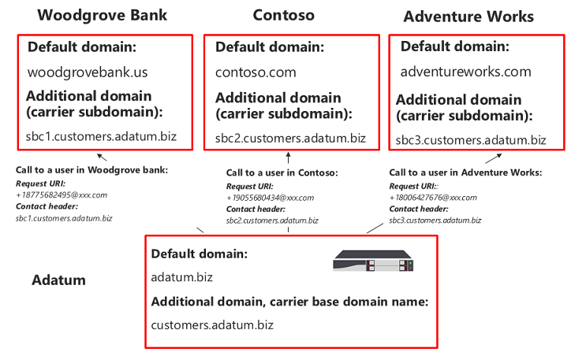
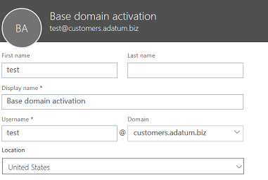

# <a name="configure-a-session-border-controller-for-multiple-tenants"></a>为多个租户配置会话边界控制器

直接路由支持配置一个会话边界控制器 (SBC) 提供多个租户。

> [!NOTE]
> 此方案适用于 Microsoft 合作伙伴和/或 PSTN 运营商，称为本文档后面的运营商。 运营商销售向 Microsoft 工作组传递给他们的客户的电话服务。 

运营商：
- 部署和管理其数据中心中的 SBC （客户不需要实现 SBC，和电话服务收到团队客户端中运营商）。
- 互连到多个租户 SBC。
- 为客户提供 PSTN 服务。
- 管理呼叫质量端到端。
- PSTN 服务的单独的费用。

Microsoft 不管理运营商。 Microsoft 提供的 PBX （Microsoft 电话系统） 和团队客户端、 认证电话，并证实可用于 Microsoft 电话系统的 Sbc。 在选择之前运营商，请确保您选择已认证的 SBC 和可管理语音质量端到端。

以下是配置方案的技术实现步骤。

**仅运营商：**
1. 部署的 SBC 并将其配置为承载方案根据[认证的 SBC 供应商提供的说明](#deploy-and-configure-the-sbc)。
2. 在运营商租户中注册的基域名称并请求通配符证书。
3. 为每个客户，是基本的域的一部分注册子域。

**与客户全局管理员的运营商：**
1. 添加到客户租户子域名称。
2. 激活的子域名称。
3. 配置中继到客户租户和设置用户从运营商。

*请确保您了解 DNS 基础知识和 Office 365 中管理的域名的方式。在进一步之前查看[获取 Office 365 域的帮助](https://support.office.com/article/Get-help-with-Office-365-domains-28343f3a-dcee-41b6-9b97-5b0f4999b7ef)。*

## <a name="deploy-and-configure-the-sbc"></a>部署并配置 SBC

有关如何部署和配置 Sbc SBC 承载方案的详细步骤，请参阅 SBC 供应商的文档。

- **AudioCodes:**[直接路由配置说明](https://www.audiocodes.com/solutions-products/products/products-for-microsoft-365/direct-routing-for-Microsoft-Teams)，承载在"连接到 Microsoft 团队直接路由承载模型配置注释的 AudioCodes SBC"。 中所述情形 SBC 的配置 
- **功能区通信：** 请有关如何配置功能区核心系列 SBCs 文档的[功能区通信 SBC 核心 Microsoft 团队配置指南](https://support.sonus.net/display/IOT/PBXs+-+SBC+5k7kSWe)和对此页[功能区最佳实践-配置的 Microsoft 团队直接路由 SBC 的运营商，参阅边缘](https://support.sonus.net/display/UXDOC70/Best+Practice+-+Configuring+Carriers+for+Microsoft+Teams+Direct+Routing)

> [!NOTE]
> 请注意如何配置"联系人"标头。 联系人标头用于传入 invite 消息上查找客户租户。 

## <a name="register-a-base-domain-and-subdomains"></a>注册基域和子域

对于承载方案，您需要创建：
- 一个归运营商的基域名称。
- 一部分中每个客户租户的基域名的子域。

在下面的示例：
- Adatum 是通过提供 Internet 和电话服务提供若干个客户的运营商。
- Woodgrove 银行、 Contoso 和 Adventure Works 是 Office 365 域但从 Adatum 接收的电话服务的三个客户。

子域**必须**匹配发送到 Office 365 的邀请时将为客户和联系人标头中的 FQDN 配置中继的 FQDN 名称。 

当呼叫到达的 Office 365 直接路由接口时，接口将使用的联系人标头来查找租户其中应查找用户。 直接路由不使用电话号码查找上邀请，如某些客户可能具有非-DID 号码可以在多个租户中重叠。 因此，联系人标头中的 FQDN 名称都需要标识确切的租户，以查找用户的电话号码。

*请查看有关在 Office 365 租户中创建域名[获取 Office 365 域的帮助](https://support.office.com/article/Get-help-with-Office-365-domains-28343f3a-dcee-41b6-9b97-5b0f4999b7ef)。*

下图汇总了对基域、 子域和联系人标头的要求。



SBC 需要证书进行身份验证连接。 运营商需要使用 SAN 中请求证书的 SBC 承载方案， * \*.base_domain (例如， \*customers.adatum.biz)*。 此证书用于身份验证与单个 SBC 从提供的多个租户的连接。

下表是一个配置的一个示例。


|新的域名 |类型|注册  |证书的 SBC SAN  |在示例中的租户默认域  |SBC 必须提供联系人标头中发送给用户的呼叫时的 FQDN 名称|
|---------|---------|---------|---------|---------|---------|
|customers.adatum.biz|    基本     |     运营商租户中  |    \*。 customers.adatum.biz  |   adatum.biz      |NA，这是服务租户，任何用户 |
|sbc1.customers.adatum.biz|    子域  |    客户租户中  |    \*。 customers.adatum.biz  | woodgrovebank.us  |  sbc1.customers.adatum.biz|
|sbc2.customers.adatum.biz  |   子域 | 客户租户中   |   \*。 customers.adatum.biz   |contoso.com   |sbc2.customers.adatum.biz |
|sbc3.customers.adatum.biz |   子域 | 客户租户中 |   \*。 customers.adatum.biz  |  adventureworks.com | sbc3.customers.adatum.biz |
||         |         |         |         |         |

若要配置的基本和子域，请按照如下所述的步骤。 在示例中，我们将配置的基域名称 (customers.adatum.biz) 和一个客户 (sbc1.customers.adatum.biz Woodgrove 银行租户中) 的子域。

## <a name="register-a-base-domain-name-in-the-carrier-tenant"></a>在运营商租户中注册的基域名称

**运营商租户中执行这些操作。**

### <a name="ensure-that-you-have-appropriate-rights-in-the-carrier-tenant"></a>确保您的运营商租户中具有相应权限

如果您登录到 Office 365 管理中心以全局管理员，您可以仅添加新域。 

若要验证您具有的角色，请登录到 Microsoft 365 管理中心 (https://portal.office.com)，请转到**用户** > **活动用户**，然后验证是否已全局管理员角色。 

有关管理角色和如何为 Office 365 中的一个角色分配的详细信息，请参阅[有关 Office 365 管理员角色](https://support.office.com/article/About-Office-365-admin-roles-da585eea-f576-4f55-a1e0-87090b6aaa9d)。

### <a name="add-a-base-domain-to-the-tenant-and-verify-it"></a>向租户添加基域并验证其

1.  在 Microsoft 365 管理中心，转到**安装程序** > **域** > **添加域**。
2.  在**输入您拥有的域**框中，键入基域的 FQDN。 以下示例中，在基域名是*customers.adatum.biz*。

    

3. 单击" **下一步**"。
4. 在此示例中，租户已经有 adatum.biz 与已验证的域的名称。 因为 customers.adatum.biz 是已注册名称子域，向导将不要求的其他验证。 但是，如果您添加 FQDN 的尚未验证之前，您需要经过验证的过程。 验证的过程是[如下所述](#add-a-subdomain-to-the-customer-tenant-and-verify-it)。

    

5.  单击**下一步**，和在**更新 DNS 设置**页上，选择**将自己添加的 DNS 记录**，然后单击**下一步**。
6.  在下一页上，清除所有值 （除非您想要用于业务 Exchange、 SharePoint、 或团队/Skype 的域名），单击**下一步**，，然后单击**完成时间**。 请确保您的新域中的安装程序完成状态。

    

### <a name="activate-the-domain-name"></a>激活的域名

已注册的域名，您需要激活通过添加至少一个 E1，E3 或 E5 许可后用户和分配与 SIP 的 FQDN 部分的 SIP 地址的地址匹配创建的基域名。 

*请查看有关将用户添加 Office 365 租户中[获取帮助与 Office 365 域](https://support.office.com/article/Get-help-with-Office-365-domains-28343f3a-dcee-41b6-9b97-5b0f4999b7ef)。*

例如： test@customers.adatum.biz



## <a name="register-a-subdomain-name-in-a-customer-tenant"></a>在客户租户中注册的子域名称

您需要创建每个客户的唯一子域名称。 本示例中，我们将使用默认域名称 woodgrovebank.us 创建子域 sbc1.customers.adatum.biz 租户中。

**客户租户中是以下所有操作。**

### <a name="ensure-that-you-have-appropriate-rights-in-the-customer-tenant"></a>确保您客户租户中具有相应权限

如果您登录到 Office 365 管理中心以全局管理员，您可以仅添加新域。 

若要验证您具有的角色，请登录到 Microsoft 365 管理中心 (https://portal.office.com)，请转到**用户** > **活动用户**，然后验证是否已全局管理员角色。 

有关管理角色和如何为 Office 365 中的一个角色分配的详细信息，请参阅[有关 Office 365 管理员角色](https://support.office.com/article/About-Office-365-admin-roles-da585eea-f576-4f55-a1e0-87090b6aaa9d)。

### <a name="add-a-subdomain-to-the-customer-tenant-and-verify-it"></a>将子域添加到客户租户并确认它
1. 在 Microsoft 365 管理中心，转到**安装程序** > **域** > **添加域**。
2. 在**输入您拥有的域**框中，键入此租户的子域的 FQDN。 在下面的示例中，子域是 sbc1.customers.adatum.biz。

    

3. 单击" **下一步**"。
4. 从不已在租户中注册的 FQDN。 下一步，您需要验证域。 选择**添加 TXT 记录改为**。 

    

5. 单击**下一步**，并注意生成验证的域名的 TXT 值。

    

6. 值从运营商的 DNS 宿主提供商的上一步中创建的 TXT 记录。

    

    有关详细信息，请参阅[Office 365 任何 DNS 宿主提供商处创建 DNS 记录](https://support.office.com/article/create-dns-records-at-any-dns-hosting-provider-for-office-365-7b7b075d-79f9-4e37-8a9e-fb60c1d95166)。

7. 返回到客户的 Microsoft 365 管理中心，并单击**验证**。 
8. 在下一页上，选择**将自己添加的 DNS 记录**，然后单击**下一步**。

    

9. 在**选择联机服务**页上，清除所有选项，然后单击**下一步**。

    

10. 在**更新 DNS 设置**页上，单击**完成**。

    

11. 确保状态为**安装程序完成**。 
    
    

### <a name="activate-the-subdomain-name"></a>激活子域名

注册域名后，您需要激活通过添加至少一个用户和分配匹配客户租户中创建的子域的 SIP 地址的 FQDN 部分的 SIP 地址。

*请查看有关将用户添加 Office 365 租户中[获取帮助与 Office 365 域](https://support.office.com/article/Get-help-with-Office-365-domains-28343f3a-dcee-41b6-9b97-5b0f4999b7ef)。*

例如： test@sbc1.customers.adatum.biz


### <a name="create-a-trunk-and-provision-users"></a>创建中继和设置用户

> [!NOTE]
> 根据我们在技术的应用程序中收到的反馈，Microsoft 可能会更改简化过程客户租户中创建中继的过程。 请观看此页上的文档更新，并按照 Microsoft 技术社区博客 （英文） 的详细信息。 

使用新建 CSonlinePSTNGateway 命令的客户域中创建中继。 中继 FQDN**必须**匹配子域为客户创建。

例如：

```
New-CSOnlinePSTNGateway –FQDN sbc1.customers.adatum.biz -SipSignallingPort 5068
```

创建中继时, 可能会收到以下错误消息：

```
Can not use the "sbc1.customers.adatum.biz" domain as it was not configured for this tenant.
```

请允许域注册和激活以复制，然后重试一些的时间。

为用户提供的电话号码和配置语音路由。

新建 CSOnlinePSTNGateway 的详细信息，设置用户和配置语音路由，请参阅[配置直接路由](direct-routing-configure.md)。


请参阅上配置联系人标头中发送子域的 FQDN 名称的[SBC 供应商的说明](#deploy-and-configure-the-sbc)。

