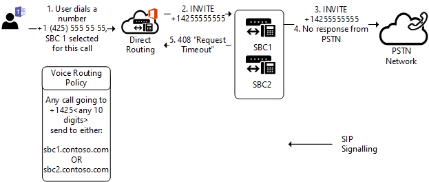

# 出站呼叫发生 Trunk 故障转移

本主题介绍如何避免出站呼叫-从团队对会话边界控制器 (SBC) 上的中继故障转移。

## 在网络错误的故障转移

如果出于任何原因，无法连接到中继，则将从不同的 Microsoft 数据中心尝试与同一个中继的连接。 中继可能不连接，例如，如果被拒绝的连接，如果 TLS 的超时设置，或有其他任何网络级别问题。
例如，连接可能无法如果管理员限制访问 SBC 只能从已知的 IP 地址，但离职放置在 SBC 访问控制列表 (ACL) 的所有 Microsoft 直接路由数据中心的 IP 地址。 

## 接收从会话边界控制器 (SBC) 的特定 SIP 代码的故障转移

如果直接路由到传出 Invite 的响应中收到任何 4xx 或 6xx SIP 错误代码，请呼叫被视为完成默认情况下。 传出意味着来自团队客户端呼叫到公共公用电话交换网 (PSTN) 与以下通信流： 团队客户端的直接路由 >-> SBC-> 电话网络。

[会话初始协议 (SIP) RFC](https://tools.ietf.org/html/rfc3261)中，可以找到 SIP 代码的列表。

假定 SBC 其中替换为代码传入邀请回复的情况"408 请求超时： 服务器无法生成响应中合适的一段时间，例如，如果未能及时确定用户的位置。 客户端可以重复没有修改的请求随时都更高版本。"

此特定 SBC 可能会有连接到被叫方-可能由于网络配置错误或其他错误的困难。 但是，这可能是能够访问被叫方作为路由中是一个多个 SBC。

在下面的图中，当用户发出呼叫的电话号码，还有两个 SBCs 可能可以提供此呼叫作为路由中。 最初，SBC1.contoso.com 选定的呼叫，但 SBC1.contoso.com 不能够访问 PTSN 网络由于网络问题。
默认情况下，将此此时完成呼叫。 
 

但是，其中可能可以将传入呼叫路由中没有一个详细的 SBC。
如果您配置参数`Set-CSOnlinePSTNGateway -Identity sbc1.contoso.com -FailoverResponseCodes "408"`，将尝试第二个 SBC-SBC2.contoso.com 如下图中：

参数-FailoverResponseCodes 并指定代码可帮助您可以精细优化您的路由，并避免设置潜在 SBC 不能因网络或其他问题而呼叫时的问题。

默认值： 408 503、 504

