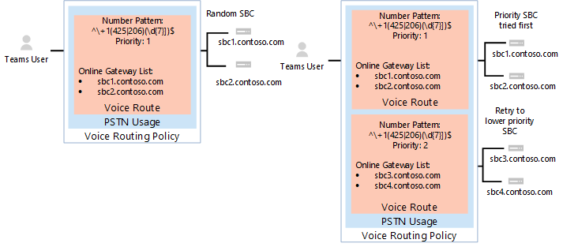

# <a name="configure-voice-routing-for-direct-routing"></a><span data-ttu-id="c7c13-103">为直接路由配置语音路由</span><span class="sxs-lookup"><span data-stu-id="c7c13-103">Configure voice routing for Direct Routing</span></span>

<span data-ttu-id="c7c13-104">本文介绍如何为直接路由配置电话系统路由。</span><span class="sxs-lookup"><span data-stu-id="c7c13-104">This article describes how to configure voice routing for Phone System Direct Routing.</span></span>  <span data-ttu-id="c7c13-105">这是配置直接路由的以下步骤的步骤 3：</span><span class="sxs-lookup"><span data-stu-id="c7c13-105">This is step 3 of the following steps for configuring Direct Routing:</span></span>

- <span data-ttu-id="c7c13-106">第 1 步</span><span class="sxs-lookup"><span data-stu-id="c7c13-106">Step 1.</span></span> [<span data-ttu-id="c7c13-107">连接系统Microsoft 电话 SBC 并验证连接</span><span class="sxs-lookup"><span data-stu-id="c7c13-107">Connect the SBC with Microsoft Phone System and validate the connection</span></span>](direct-routing-connect-the-sbc.md) 
- <span data-ttu-id="c7c13-108">第 2 步</span><span class="sxs-lookup"><span data-stu-id="c7c13-108">Step 2.</span></span> [<span data-ttu-id="c7c13-109">为用户启用直接路由、语音和语音邮件</span><span class="sxs-lookup"><span data-stu-id="c7c13-109">Enable users for Direct Routing, voice, and voicemail</span></span>](direct-routing-enable-users.md)
- <span data-ttu-id="c7c13-110">**步骤 3.配置语音路由** (本文) </span><span class="sxs-lookup"><span data-stu-id="c7c13-110">**Step 3. Configure voice routing** (This article)</span></span>
- <span data-ttu-id="c7c13-111">第 4 步</span><span class="sxs-lookup"><span data-stu-id="c7c13-111">Step 4.</span></span> [<span data-ttu-id="c7c13-112">将数字转换为备用格式</span><span class="sxs-lookup"><span data-stu-id="c7c13-112">Translate numbers to an alternate format</span></span>](direct-routing-translate-numbers.md) 

<span data-ttu-id="c7c13-113">有关设置直接路由所需的所有步骤的信息，请参阅 [配置直接路由](direct-routing-configure.md)。</span><span class="sxs-lookup"><span data-stu-id="c7c13-113">For information on all the steps required for setting up Direct Routing, see [Configure Direct Routing](direct-routing-configure.md).</span></span>

## <a name="voice-routing-overview"></a><span data-ttu-id="c7c13-114">语音路由概述</span><span class="sxs-lookup"><span data-stu-id="c7c13-114">Voice routing overview</span></span>

<span data-ttu-id="c7c13-115">Microsoft 电话系统具有一种路由机制，允许将调用发送到 SBC (特定会话边界控制器) 基于：</span><span class="sxs-lookup"><span data-stu-id="c7c13-115">Microsoft Phone System has a routing mechanism that allows a call to be sent to a specific Session Border Controller (SBC) based on:</span></span> 

- <span data-ttu-id="c7c13-116">调用的编号模式</span><span class="sxs-lookup"><span data-stu-id="c7c13-116">The called number pattern</span></span> 
- <span data-ttu-id="c7c13-117">被调用的号码模式加上进行呼叫的特定用户</span><span class="sxs-lookup"><span data-stu-id="c7c13-117">The called number pattern plus the specific user who makes the call</span></span>
 
<span data-ttu-id="c7c13-118">可以将 SDC 指定为活动和备份。</span><span class="sxs-lookup"><span data-stu-id="c7c13-118">SBCs can be designated as active and backup.</span></span> <span data-ttu-id="c7c13-119">如果配置为活动的 SBC 不可用于特定的调用路由，则调用将路由到备份 SBC。</span><span class="sxs-lookup"><span data-stu-id="c7c13-119">When the SBC that is configured as active is not available for a specific call route, then the call will be routed to a backup SBC.</span></span>
 
<span data-ttu-id="c7c13-120">语音路由由以下元素组成：</span><span class="sxs-lookup"><span data-stu-id="c7c13-120">Voice routing is made up of the following elements:</span></span> 

- <span data-ttu-id="c7c13-121">**语音路由** 策略 - PSTN 用法的容器，可分配给用户或多个用户。</span><span class="sxs-lookup"><span data-stu-id="c7c13-121">**Voice routing policy** – A container for PSTN usages, which can be assigned to a user or to multiple users.</span></span> 

- <span data-ttu-id="c7c13-122">**PSTN 使用情况** - 用于语音路由和 PSTN 使用情况的容器，可在不同的语音路由策略中共享。</span><span class="sxs-lookup"><span data-stu-id="c7c13-122">**PSTN usages** – A container for voice routes and PSTN usages, which can be shared in different voice routing policies.</span></span> 

- <span data-ttu-id="c7c13-123">**语音路由** - 呼叫号码与模式匹配的呼叫使用的一个号码模式和一组联机 PSTN 网关。</span><span class="sxs-lookup"><span data-stu-id="c7c13-123">**Voice routes** – A number pattern and set of online PSTN gateways to use for calls where the calling number matches the pattern.</span></span>

- <span data-ttu-id="c7c13-124">**联机 PSTN** 网关 - 指向 SBC 的指针，该 SBC 还存储通过 SBC 进行呼叫时应用的配置，例如转发 P-Asserted-Identity (PAI) 或首选编解码器;可添加到语音路由。</span><span class="sxs-lookup"><span data-stu-id="c7c13-124">**Online PSTN gateway** - A pointer to an SBC that also stores the configuration that is applied when a call is placed through the SBC, such as forward P-Asserted-Identity (PAI) or Preferred Codecs; can be added to voice routes.</span></span>

## <a name="voice-routing-policy-considerations"></a><span data-ttu-id="c7c13-125">语音路由策略注意事项</span><span class="sxs-lookup"><span data-stu-id="c7c13-125">Voice routing policy considerations</span></span>

<span data-ttu-id="c7c13-126">如果用户具有呼叫计划许可证，该用户的传出呼叫将通过 Microsoft 呼叫计划 PSTN 基础结构自动路由。</span><span class="sxs-lookup"><span data-stu-id="c7c13-126">If a user has a Calling Plan license, that user’s outgoing calls are automatically routed through the Microsoft Calling Plan PSTN infrastructure.</span></span> <span data-ttu-id="c7c13-127">如果配置在线语音路由策略并将其分配给呼叫计划用户，将检查该用户的传出呼叫，以确定拨叫号码是否与在线语音路由策略中定义的号码模式匹配。</span><span class="sxs-lookup"><span data-stu-id="c7c13-127">If you configure and assign an online voice routing policy to a Calling Plan user, that user’s outgoing calls are checked to determine whether the dialed number matches a number pattern defined in the online voice routing policy.</span></span> <span data-ttu-id="c7c13-128">如果存在匹配项，则通过直接路由中继路由调用。</span><span class="sxs-lookup"><span data-stu-id="c7c13-128">If there’s a match, the call is routed through the Direct Routing trunk.</span></span> <span data-ttu-id="c7c13-129">如果没有匹配项，则呼叫将通过呼叫计划 PSTN 基础结构进行路由。</span><span class="sxs-lookup"><span data-stu-id="c7c13-129">If there’s no match, the call is routed through the Calling Plan PSTN infrastructure.</span></span>

> [!CAUTION]
> <span data-ttu-id="c7c13-130">如果配置并应用全局 (组织范围的默认) 在线语音路由策略，则组织中所有支持语音的用户都将继承该策略，这可能会导致呼叫计划用户的 PSTN 呼叫无意中路由到直接路由中继。</span><span class="sxs-lookup"><span data-stu-id="c7c13-130">If you configure and apply the global (Org-wide default) online voice routing policy, all voice-enabled users in your organization will inherit that policy, which may result in PSTN calls from Calling Plan users being inadvertently routed to a Direct Routing trunk.</span></span> <span data-ttu-id="c7c13-131">如果不希望所有用户使用全局联机语音路由策略，请配置自定义联机语音路由策略并将其分配给启用了语音的单个用户。</span><span class="sxs-lookup"><span data-stu-id="c7c13-131">If you don't want all users to use the global online voice routing policy, configure a custom online voice routing policy and assign it to individual voice-enabled users.</span></span>

## <a name="example-1-voice-routing-with-one-pstn-usage"></a><span data-ttu-id="c7c13-132">示例 1：使用一个 PSTN 的语音路由</span><span class="sxs-lookup"><span data-stu-id="c7c13-132">Example 1: Voice routing with one PSTN usage</span></span>

<span data-ttu-id="c7c13-133">下图显示了呼叫流中语音路由策略的两个示例。</span><span class="sxs-lookup"><span data-stu-id="c7c13-133">The following diagram shows two examples of voice routing policies in a call flow.</span></span>

<span data-ttu-id="c7c13-134">**调用Flow左侧 (1) ：** 如果用户拨打 +1 425 XXX XX 或 +1 206 XXX XX XX，该呼叫将路由到 SBC sbc1.contoso.biz 或 sbc2.contoso.biz。</span><span class="sxs-lookup"><span data-stu-id="c7c13-134">**Call Flow 1 (on the left):** If a user makes a call to +1 425 XXX XX XX or +1 206 XXX XX XX, the call is routed to SBC sbc1.contoso.biz or sbc2.contoso.biz.</span></span> <span data-ttu-id="c7c13-135">如果 sbc1.contoso.biz 和 sbc2.contoso.biz 都不可用，将丢弃调用。</span><span class="sxs-lookup"><span data-stu-id="c7c13-135">If neither sbc1.contoso.biz nor sbc2.contoso.biz are available, the call is dropped.</span></span> 

<span data-ttu-id="c7c13-136">**在Flow 2 (调用 2) ：** 如果用户拨打 +1 425 XXX XX 或 +1 206 XXX XX XX，该呼叫将首先路由到 SBC sbc1.contoso.biz 或 sbc2.contoso.biz。</span><span class="sxs-lookup"><span data-stu-id="c7c13-136">**Call Flow 2 (on the right):** If a user makes a call to +1 425 XXX XX XX or +1 206 XXX XX XX, the call is first routed to SBC sbc1.contoso.biz or sbc2.contoso.biz.</span></span> <span data-ttu-id="c7c13-137">如果两个 SBC 都不可用，将尝试优先级较低的路由 (sbc3.contoso.biz sbc4.contoso.biz) 。</span><span class="sxs-lookup"><span data-stu-id="c7c13-137">If neither SBC is available, the route with lower priority will be tried (sbc3.contoso.biz and sbc4.contoso.biz).</span></span> <span data-ttu-id="c7c13-138">如果没有任何 SDC 可用，将丢弃调用。</span><span class="sxs-lookup"><span data-stu-id="c7c13-138">If none of the SBCs are available, the call is dropped.</span></span> 



<span data-ttu-id="c7c13-140">在这两个示例中，当为语音路由分配优先级时，将随机尝试路由中的 SDC。</span><span class="sxs-lookup"><span data-stu-id="c7c13-140">In both examples, while the voice route is assigned priorities, the SBCs in the routes are tried in random order.</span></span>

  > [!NOTE]
  > <span data-ttu-id="c7c13-141">除非用户也有 Microsoft 呼叫计划许可证，否则将删除示例配置中与模式 +1 425 XXX XX XX 或 +1 206 XXX XX XX 匹配的号码以外的任何号码。</span><span class="sxs-lookup"><span data-stu-id="c7c13-141">Unless the user also has a Microsoft Calling Plan license, calls to any number except numbers matching the patterns +1 425 XXX XX XX or +1 206 XXX XX XX in the example configuration are dropped.</span></span> <span data-ttu-id="c7c13-142">如果用户具有呼叫计划许可证，则根据 Microsoft 呼叫计划的策略自动路由呼叫。</span><span class="sxs-lookup"><span data-stu-id="c7c13-142">If the user has a Calling Plan license, the call is automatically routed according to the policies of the Microsoft Calling Plan.</span></span> <span data-ttu-id="c7c13-143">Microsoft 呼叫计划自动作为最后一个路由应用到具有 Microsoft 呼叫计划许可证的所有用户，不需要其他呼叫路由配置。</span><span class="sxs-lookup"><span data-stu-id="c7c13-143">The Microsoft Calling Plan applies automatically as the last route to all users with the Microsoft Calling Plan license and does not require additional call routing configuration.</span></span>

<span data-ttu-id="c7c13-144">在下图所示的示例中，添加了一个语音路由，用于将呼叫发送到所有其他美国和加拿大号码， (呼叫号码模式 +1 XXX XXX XX XX) 。</span><span class="sxs-lookup"><span data-stu-id="c7c13-144">In the example shown in the following diagram, a voice route is added to send calls to all other US and Canadian numbers (calls that go to called number pattern +1 XXX XXX XX XX).</span></span>


<span data-ttu-id="c7c13-146">对于所有其他呼叫，如果用户同时拥有 System (Microsoft 电话和 Microsoft 呼叫) 许可证，则使用自动路由。</span><span class="sxs-lookup"><span data-stu-id="c7c13-146">For all other calls, if a user has both licenses (Microsoft Phone System and Microsoft Calling Plan), the automatic route is used.</span></span> <span data-ttu-id="c7c13-147">如果没有任何内容与管理员创建的联机语音路由中的号码模式匹配，则呼叫将通过 Microsoft 呼叫计划进行路由。</span><span class="sxs-lookup"><span data-stu-id="c7c13-147">If nothing matches the number patterns in the administrator-created online voice routes, then the call is routed through Microsoft Calling Plan.</span></span> <span data-ttu-id="c7c13-148">如果用户只有系统Microsoft 电话，则调用将被删除，因为没有匹配的规则可用。</span><span class="sxs-lookup"><span data-stu-id="c7c13-148">If the user only has Microsoft Phone System, the call is dropped because no matching rules are available.</span></span>

  > [!NOTE]
  > <span data-ttu-id="c7c13-149">在这种情况下，路由"其他 +1"的优先级值并不重要，因为只有一个路由与模式 +1 XXX XXX XX XX 匹配。</span><span class="sxs-lookup"><span data-stu-id="c7c13-149">The Priority value for route "Other +1" doesn't matter in this case because there is only one route that matches the pattern +1 XXX XXX XX XX.</span></span> <span data-ttu-id="c7c13-150">如果用户拨打了 +1 324 567 89 89，sbc5.contoso.biz 和 sbc6.contoso.biz 都不可用，则呼叫将被删除。</span><span class="sxs-lookup"><span data-stu-id="c7c13-150">If a user makes a call to +1 324 567 89 89 and both sbc5.contoso.biz and sbc6.contoso.biz are unavailable, the call is dropped.</span></span>

<span data-ttu-id="c7c13-151">下表总结了使用三个语音路由的配置。</span><span class="sxs-lookup"><span data-stu-id="c7c13-151">The following table summarizes the configuration using three voice routes.</span></span> <span data-ttu-id="c7c13-152">此示例中，所有三个路由都是同一 PSTN 用法"美国和加拿大"的一部分。</span><span class="sxs-lookup"><span data-stu-id="c7c13-152">In this example, all three routes are part of the same PSTN usage, "US and Canada".</span></span>  <span data-ttu-id="c7c13-153">所有路由都与"美国和加拿大"PSTN 使用情况相关联，PSTN 使用情况与"仅美国"语音路由策略相关联。</span><span class="sxs-lookup"><span data-stu-id="c7c13-153">All routes are associated with the "US and Canada" PSTN usage  and the PSTN usage is associated with the "US Only" voice routing policy.</span></span>

|<span data-ttu-id="c7c13-154">**PSTN 用法**</span><span class="sxs-lookup"><span data-stu-id="c7c13-154">**PSTN usage**</span></span>|<span data-ttu-id="c7c13-155">**语音路由**</span><span class="sxs-lookup"><span data-stu-id="c7c13-155">**Voice route**</span></span>|<span data-ttu-id="c7c13-156">**号码模式**</span><span class="sxs-lookup"><span data-stu-id="c7c13-156">**Number pattern**</span></span>|<span data-ttu-id="c7c13-157">**优先级**</span><span class="sxs-lookup"><span data-stu-id="c7c13-157">**Priority**</span></span>|<span data-ttu-id="c7c13-158">**SBC**</span><span class="sxs-lookup"><span data-stu-id="c7c13-158">**SBC**</span></span>|<span data-ttu-id="c7c13-159">**说明**</span><span class="sxs-lookup"><span data-stu-id="c7c13-159">**Description**</span></span>|
|:-----|:-----|:-----|:-----|:-----|:-----|
|<span data-ttu-id="c7c13-160">美国和加拿大</span><span class="sxs-lookup"><span data-stu-id="c7c13-160">US and Canada</span></span>|<span data-ttu-id="c7c13-161">"Redmond 1"</span><span class="sxs-lookup"><span data-stu-id="c7c13-161">"Redmond 1"</span></span>|<span data-ttu-id="c7c13-162">^\\+1 (425 \| 206)  (\d {7}) $</span><span class="sxs-lookup"><span data-stu-id="c7c13-162">^\\+1(425\|206)(\d{7})$</span></span>|<span data-ttu-id="c7c13-163">1</span><span class="sxs-lookup"><span data-stu-id="c7c13-163">1</span></span>|<span data-ttu-id="c7c13-164">sbc1.contoso.biz</span><span class="sxs-lookup"><span data-stu-id="c7c13-164">sbc1.contoso.biz</span></span><br/><span data-ttu-id="c7c13-165">sbc2.contoso.biz</span><span class="sxs-lookup"><span data-stu-id="c7c13-165">sbc2.contoso.biz</span></span>|<span data-ttu-id="c7c13-166">被叫号码的活动路由 +1 425 XXX XX XX 或 +1 206 XXX XX XX</span><span class="sxs-lookup"><span data-stu-id="c7c13-166">Active route for called numbers +1 425 XXX XX XX or +1 206 XXX XX XX</span></span>|
|<span data-ttu-id="c7c13-167">美国和加拿大</span><span class="sxs-lookup"><span data-stu-id="c7c13-167">US and Canada</span></span>|<span data-ttu-id="c7c13-168">"Redmond 2"</span><span class="sxs-lookup"><span data-stu-id="c7c13-168">"Redmond 2"</span></span>|<span data-ttu-id="c7c13-169">^\\+1 (425 \| 206)  (\d {7}) $</span><span class="sxs-lookup"><span data-stu-id="c7c13-169">^\\+1(425\|206)(\d{7})$</span></span>|<span data-ttu-id="c7c13-170">2</span><span class="sxs-lookup"><span data-stu-id="c7c13-170">2</span></span>|<span data-ttu-id="c7c13-171">sbc3.contoso.biz</span><span class="sxs-lookup"><span data-stu-id="c7c13-171">sbc3.contoso.biz</span></span><br/><span data-ttu-id="c7c13-172">sbc4.contoso.biz</span><span class="sxs-lookup"><span data-stu-id="c7c13-172">sbc4.contoso.biz</span></span>|<span data-ttu-id="c7c13-173">被叫号码的备份路由 +1 425 XXX XX XX 或 +1 206 XXX XX XX</span><span class="sxs-lookup"><span data-stu-id="c7c13-173">Backup route for called numbers +1 425 XXX XX XX or +1 206 XXX XX XX</span></span>|
|<span data-ttu-id="c7c13-174">美国和加拿大</span><span class="sxs-lookup"><span data-stu-id="c7c13-174">US and Canada</span></span>|<span data-ttu-id="c7c13-175">"其他 +1"</span><span class="sxs-lookup"><span data-stu-id="c7c13-175">"Other +1"</span></span>|<span data-ttu-id="c7c13-176">^\\+1 (\d {10}) $</span><span class="sxs-lookup"><span data-stu-id="c7c13-176">^\\+1(\d{10})$</span></span>|<span data-ttu-id="c7c13-177">3</span><span class="sxs-lookup"><span data-stu-id="c7c13-177">3</span></span>|<span data-ttu-id="c7c13-178">sbc5.contoso.biz</span><span class="sxs-lookup"><span data-stu-id="c7c13-178">sbc5.contoso.biz</span></span><br/><span data-ttu-id="c7c13-179">sbc6.contoso.biz</span><span class="sxs-lookup"><span data-stu-id="c7c13-179">sbc6.contoso.biz</span></span>|<span data-ttu-id="c7c13-180">被叫号码 +1 XXX XXX XX XX 的路由 (+1 425 XXX XX XX 或 +1 206 XXX XX XX) </span><span class="sxs-lookup"><span data-stu-id="c7c13-180">Route for called numbers +1 XXX XXX XX XX (except +1 425 XXX XX XX or +1 206 XXX XX XX)</span></span>|
|||||||

## <a name="example-1-configuration-steps"></a><span data-ttu-id="c7c13-181">示例 1：配置步骤</span><span class="sxs-lookup"><span data-stu-id="c7c13-181">Example 1: Configuration steps</span></span>

<span data-ttu-id="c7c13-182">以下示例演示如何：</span><span class="sxs-lookup"><span data-stu-id="c7c13-182">The following example shows how to:</span></span>

1. <span data-ttu-id="c7c13-183">创建单个 PSTN 使用情况。</span><span class="sxs-lookup"><span data-stu-id="c7c13-183">Create a single PSTN usage.</span></span>
2. <span data-ttu-id="c7c13-184">配置三个语音路由。</span><span class="sxs-lookup"><span data-stu-id="c7c13-184">Configure three voice routes.</span></span>
3. <span data-ttu-id="c7c13-185">创建语音路由策略。</span><span class="sxs-lookup"><span data-stu-id="c7c13-185">Create a voice routing policy.</span></span>
4. <span data-ttu-id="c7c13-186">将策略分配给名为 Spencer Low 的用户。</span><span class="sxs-lookup"><span data-stu-id="c7c13-186">Assign the policy to a user named Spencer Low.</span></span>

<span data-ttu-id="c7c13-187">可以使用 Microsoft Teams[管理中心](#admincenterexample1)或[PowerShell](#powershellexample1)执行这些步骤。</span><span class="sxs-lookup"><span data-stu-id="c7c13-187">You can use the [Microsoft Teams admin center](#admincenterexample1) or [PowerShell](#powershellexample1) to perform these steps.</span></span>

### <a name="using-the-microsoft-teams-admin-center"></a><span data-ttu-id="c7c13-188">使用 Microsoft Teams 管理中心</span><span class="sxs-lookup"><span data-stu-id="c7c13-188">Using the Microsoft Teams admin center</span></span>
<a name="admincenterexample1"></a>

#### <a name="step-1-create-the-us-and-canada-pstn-usage"></a><span data-ttu-id="c7c13-189">步骤 1：创建"美国和加拿大"PSTN 使用情况</span><span class="sxs-lookup"><span data-stu-id="c7c13-189">Step 1: Create the "US and Canada" PSTN usage</span></span>

1. <span data-ttu-id="c7c13-190">在管理中心的Microsoft Teams导航中，转到"**语音** 直接路由"，然后在右上角选择"管理  >  **PSTN 使用记录"。**</span><span class="sxs-lookup"><span data-stu-id="c7c13-190">In the left navigation of the Microsoft Teams admin center, go to **Voice** > **Direct Routing**, and then in the upper-right corner, select **Manage PSTN usage records**.</span></span>
2. <span data-ttu-id="c7c13-191">单击 **"添加**"，**键入"美国和加拿大**"，然后单击"应用 **"。**</span><span class="sxs-lookup"><span data-stu-id="c7c13-191">Click **Add**, type **US and Canada**, and then click **Apply**.</span></span>

#### <a name="step-2-create-three-voice-routes-redmond-1-redmond-2-and-other-1"></a><span data-ttu-id="c7c13-192">步骤 2：创建三 (Redmond 1、Redmond 2 和其他 +1 语音路由) </span><span class="sxs-lookup"><span data-stu-id="c7c13-192">Step 2: Create three voice routes (Redmond 1, Redmond 2, and Other +1)</span></span>

<span data-ttu-id="c7c13-193">以下步骤介绍如何创建语音路由。</span><span class="sxs-lookup"><span data-stu-id="c7c13-193">The following steps describe how to create a voice route.</span></span> <span data-ttu-id="c7c13-194">使用这些步骤，使用上表中概述的设置为此示例创建名为 Redmond 1、Redmond 2 和 Other +1 的三个语音路由。</span><span class="sxs-lookup"><span data-stu-id="c7c13-194">Use these steps to create the three voice routes named Redmond 1, Redmond 2, and Other +1 for this example by using the settings outlined in the earlier table.</span></span>

1. <span data-ttu-id="c7c13-195">在管理中心的左侧导航Microsoft Teams，转到"**语音**  >  **直接路由**"，然后选择"**语音路由"** 选项卡。</span><span class="sxs-lookup"><span data-stu-id="c7c13-195">In the left navigation of the Microsoft Teams admin center, go to **Voice** > **Direct Routing**, and then select the **Voice routes** tab.</span></span>
2. <span data-ttu-id="c7c13-196">单击 **"** 添加"，然后输入语音路由的名称和说明。</span><span class="sxs-lookup"><span data-stu-id="c7c13-196">Click **Add**, and then enter a name and description for the voice route.</span></span>
3. <span data-ttu-id="c7c13-197">设置优先级并指定拨号号码模式。</span><span class="sxs-lookup"><span data-stu-id="c7c13-197">Set the priority and specify the dialed number pattern.</span></span>
4. <span data-ttu-id="c7c13-198">若要使用语音路由注册 SBC，请在注册了 (可选) 的 SBC 下，单击"添加 **SBC"，** 选择要注册的 SBC，然后单击"应用 **"。** \*\*\*\*</span><span class="sxs-lookup"><span data-stu-id="c7c13-198">To enroll an SBC with the voice route, under **SBCs enrolled (optional)**, click **Add SBCs**, select the SBCs you want to enroll, and then click **Apply**.</span></span>
5. <span data-ttu-id="c7c13-199">若要添加 PSTN 使用记录，请在 **"PSTN** 使用记录" (可选) "下，单击"添加 PSTN 使用情况"，选择要添加的 **PSTN** 记录，然后单击"应用 **"。**</span><span class="sxs-lookup"><span data-stu-id="c7c13-199">To add PSTN usage records, under **PSTN usage records (optional)**, click **Add PSTN usage**, select the PSTN records you want to add, and then click **Apply**.</span></span>
6. <span data-ttu-id="c7c13-200">单击“**保存**”。</span><span class="sxs-lookup"><span data-stu-id="c7c13-200">Click **Save**.</span></span>

#### <a name="step-3-create-a-voice-routing-policy-named-us-only-and-add-the-us-and-canada-pstn-usage-to-the-policy"></a><span data-ttu-id="c7c13-201">步骤 3：创建名为"仅美国"的语音路由策略，将"美国和加拿大"PSTN 使用情况添加到策略</span><span class="sxs-lookup"><span data-stu-id="c7c13-201">Step 3: Create a voice routing policy named "US Only" and add the "US and Canada" PSTN usage to the policy</span></span>

1. <span data-ttu-id="c7c13-202">在管理中心的左侧导航Microsoft Teams，转到 **"**  >  **语音语音路由策略**"，然后单击"添加 **"。**</span><span class="sxs-lookup"><span data-stu-id="c7c13-202">In the left navigation of the Microsoft Teams admin center, go to **Voice** > **Voice routing policies**, and then click **Add**.</span></span>
2. <span data-ttu-id="c7c13-203">键入 **"仅美国** "作为名称并添加说明。</span><span class="sxs-lookup"><span data-stu-id="c7c13-203">Type **US Only** as the name and add a description.</span></span>
3. <span data-ttu-id="c7c13-204">在 **"PSTN 使用记录"** 下，单击"**添加 PSTN 使用情况**"，选择"美国和加拿大"PSTN 使用记录，然后单击"应用 **"。**</span><span class="sxs-lookup"><span data-stu-id="c7c13-204">Under **PSTN usage records**, click **Add PSTN usage**, select the "US and Canada" PSTN usage record, and then click **Apply**.</span></span>
4. <span data-ttu-id="c7c13-205">单击“**保存**”。</span><span class="sxs-lookup"><span data-stu-id="c7c13-205">Click **Save**.</span></span>

<span data-ttu-id="c7c13-206">有关详细信息，请参阅管理 [语音路由策略](manage-voice-routing-policies.md)。</span><span class="sxs-lookup"><span data-stu-id="c7c13-206">To learn more, see [Manage voice routing policies](manage-voice-routing-policies.md).</span></span>

#### <a name="step-4-assign-the-voice-routing-policy-to-a-user-named-spencer-low"></a><span data-ttu-id="c7c13-207">步骤 4：将语音路由策略分配给名为 Spencer Low 的用户</span><span class="sxs-lookup"><span data-stu-id="c7c13-207">Step 4: Assign the voice routing policy to a user named Spencer Low</span></span>

1. <span data-ttu-id="c7c13-208">在 Microsoft Teams 管理员中心的左侧导航中，转到“用户”，然后单击相应的用户。</span><span class="sxs-lookup"><span data-stu-id="c7c13-208">In the left navigation of the Microsoft Teams admin center, go to **Users**, and then click the user.</span></span>
2. <span data-ttu-id="c7c13-209">单击 **"策略**"，然后在"**分配的策略"旁边** 单击"**编辑"。**</span><span class="sxs-lookup"><span data-stu-id="c7c13-209">Click **Policies**, and then next to **Assigned policies**, click **Edit**.</span></span>
3. <span data-ttu-id="c7c13-210">在 **"语音路由策略"** 下，选择"仅美国"策略，然后单击"保存 **"。**</span><span class="sxs-lookup"><span data-stu-id="c7c13-210">Under **Voice routing policy**, select the "US Only" policy, and then click **Save**.</span></span>

<span data-ttu-id="c7c13-211">有关详细信息，请参阅管理 [语音路由策略](manage-voice-routing-policies.md)。</span><span class="sxs-lookup"><span data-stu-id="c7c13-211">To learn more, see [Manage voice routing policies](manage-voice-routing-policies.md).</span></span>

### <a name="using-powershell"></a><span data-ttu-id="c7c13-212">使用 PowerShell</span><span class="sxs-lookup"><span data-stu-id="c7c13-212">Using PowerShell</span></span>
<a name="powershellexample1"></a>


#### <a name="step-1-create-the-us-and-canada-pstn-usage"></a><span data-ttu-id="c7c13-213">步骤 1：创建"美国和加拿大"PSTN 使用情况</span><span class="sxs-lookup"><span data-stu-id="c7c13-213">Step 1: Create the "US and Canada" PSTN usage</span></span>

<span data-ttu-id="c7c13-214">在 Skype for Business Online 中的远程 PowerShell 会话中，键入：</span><span class="sxs-lookup"><span data-stu-id="c7c13-214">In a remote PowerShell session in Skype for Business Online, type:</span></span>

```PowerShell
Set-CsOnlinePstnUsage -Identity Global -Usage @{Add="US and Canada"}
```

<span data-ttu-id="c7c13-215">输入以下代码，验证是否创建了使用情况：</span><span class="sxs-lookup"><span data-stu-id="c7c13-215">Verify that the usage was created by entering:</span></span>

```PowerShell
Get-CSOnlinePSTNUsage
``` 

<span data-ttu-id="c7c13-216">这将返回可能被截断的名称列表：</span><span class="sxs-lookup"><span data-stu-id="c7c13-216">Which returns a list of names that may be truncated:</span></span>

```console
Identity    : Global
Usage        : {testusage, US and Canada, International, karlUsage. . .}
```

<span data-ttu-id="c7c13-217">以下示例显示了运行 PowerShell 命令以显示完整名称的结果， (`(Get-CSOnlinePSTNUsage).usage` 不会被截断) ：</span><span class="sxs-lookup"><span data-stu-id="c7c13-217">The following example shows the result of running the `(Get-CSOnlinePSTNUsage).usage` PowerShell command to display full names (not truncated):</span></span>

```console
 testusage
 US and Canada
 International
 karlUsage
 New test env
 Tallinn Lab Sonus
 karlUsage2
 Unrestricted
 Two trunks
```

#### <a name="step-2-create-three-voice-routes-redmond-1-redmond-2-and-other-1"></a><span data-ttu-id="c7c13-218">步骤 2：创建三 (Redmond 1、Redmond 2 和其他 +1 语音路由) </span><span class="sxs-lookup"><span data-stu-id="c7c13-218">Step 2: Create three voice routes (Redmond 1, Redmond 2, and Other +1)</span></span>

<span data-ttu-id="c7c13-219">若要创建"Redmond 1"路由，请在 Skype for Business Online 的 PowerShell 会话中输入：</span><span class="sxs-lookup"><span data-stu-id="c7c13-219">To create the "Redmond 1" route, in a PowerShell session in Skype for Business Online, enter:</span></span>

```PowerShell
New-CsOnlineVoiceRoute -Identity "Redmond 1" -NumberPattern "^\+1(425|206)
(\d{7})$" -OnlinePstnGatewayList sbc1.contoso.biz, sbc2.contoso.biz -Priority 1 -OnlinePstnUsages "US and Canada"
```

<span data-ttu-id="c7c13-220">这将返回：</span><span class="sxs-lookup"><span data-stu-id="c7c13-220">Which returns:</span></span>

```console
Identity                : Redmond 1
Priority                : 1
Description             :
NumberPattern           : ^\+1(425|206) (\d{7})$
OnlinePstnUsages        : {US and Canada}
OnlinePstnGatewayList   : {sbc1.contoso.biz, sbc2.contoso.biz}
Name                    : Redmond 1
```

<span data-ttu-id="c7c13-221">若要创建 Redmond 2 路线，请输入：</span><span class="sxs-lookup"><span data-stu-id="c7c13-221">To create the Redmond 2 route, enter:</span></span>

```PowerShell
New-CsOnlineVoiceRoute -Identity "Redmond 2" -NumberPattern "^\+1(425|206)
(\d{7})$" -OnlinePstnGatewayList sbc3.contoso.biz, sbc4.contoso.biz -Priority 2 -OnlinePstnUsages "US and Canada"
```

<span data-ttu-id="c7c13-222">若要创建"其他 +1"路由，请输入：</span><span class="sxs-lookup"><span data-stu-id="c7c13-222">To create the Other +1 route, enter:</span></span>

```PowerShell
New-CsOnlineVoiceRoute -Identity "Other +1" -NumberPattern "^\+1(\d{10})$"
-OnlinePstnGatewayList sbc5.contoso.biz, sbc6.contoso.biz -OnlinePstnUsages "US and Canada"
```

  > [!CAUTION]
  > <span data-ttu-id="c7c13-223">请确保 NumberPattern 属性中的正则表达式是有效的表达式。</span><span class="sxs-lookup"><span data-stu-id="c7c13-223">Make sure that your regular expression in the NumberPattern attribute is a valid expression.</span></span> <span data-ttu-id="c7c13-224">可以使用此网站测试它： [https://www.regexpal.com](https://www.regexpal.com)</span><span class="sxs-lookup"><span data-stu-id="c7c13-224">You can test it using this website: [https://www.regexpal.com](https://www.regexpal.com)</span></span>

<span data-ttu-id="c7c13-225">在某些情况下，需要将所有调用路由到同一 SBC;use -NumberPattern ".\*"</span><span class="sxs-lookup"><span data-stu-id="c7c13-225">In some cases, there is a need to route all calls to the same SBC; use -NumberPattern ".\*"</span></span>

<span data-ttu-id="c7c13-226">将所有调用路由到同一 SBC。</span><span class="sxs-lookup"><span data-stu-id="c7c13-226">Route all calls to the same SBC.</span></span>

```PowerShell
Set-CsOnlineVoiceRoute -id "Redmond 1" -NumberPattern ".*" -OnlinePstnGatewayList sbc1.contoso.biz
```

<span data-ttu-id="c7c13-227">使用如下所示的选项运行 PowerShell 命令， `Get-CSOnlineVoiceRoute` 验证是否正确配置了路由：</span><span class="sxs-lookup"><span data-stu-id="c7c13-227">Verify that you've correctly configured the route by running the `Get-CSOnlineVoiceRoute` PowerShell command using options as shown:</span></span>

```PowerShell
Get-CsOnlineVoiceRoute | Where-Object {($_.priority -eq 1) -or ($_.priority -eq 2) or ($_.priority -eq 4) -Identity "Redmond 1" -NumberPattern "^\+1(425|206) (\d{7})$" -OnlinePstnGatewayList sbc1.contoso.biz, sbc2.contoso.biz -Priority 1 -OnlinePstnUsages "US and Canada"
```
<span data-ttu-id="c7c13-228">应返回：</span><span class="sxs-lookup"><span data-stu-id="c7c13-228">Which should return:</span></span>

```console
Identity            : Redmond 1 
Priority               : 1
Description         : 
NumberPattern         : ^\+1(425|206) (\d{7})$
OnlinePstnUsages     : {US and Canada}     
OnlinePstnGatewayList    : {sbc1.contoso.biz, sbc2.contoso.biz}
Name             : Redmond 1
Identity        : Redmond 2 
Priority               : 2
Description         : 
NumberPattern         : ^\+1(425|206) (\d{7})$
OnlinePstnUsages     : {US and Canada}     
OnlinePstnGatewayList    : {sbc3.contoso.biz, sbc4.contoso.biz}
Name             : Redmond 2
    
Identity        : Other +1 
Priority               : 4
Description         : 
NumberPattern         : ^\+1(\d{10})$
OnlinePstnUsages     : {US and Canada}     
OnlinePstnGatewayList    : {sbc5.contoso.biz, sbc6.contoso.biz}
Name             : Other +1
```

<span data-ttu-id="c7c13-229">在示例中，路由"其他 +1"已自动分配优先级 4。</span><span class="sxs-lookup"><span data-stu-id="c7c13-229">In the example, the route "Other +1" was automatically assigned priority 4.</span></span> 

#### <a name="step-3-create-a-voice-routing-policy-named-us-only-and-add-the-us-and-canada-pstn-usage-to-the-policy"></a><span data-ttu-id="c7c13-230">步骤 3：创建名为"仅美国"的语音路由策略，将"美国和加拿大"PSTN 使用情况添加到策略</span><span class="sxs-lookup"><span data-stu-id="c7c13-230">Step 3: Create a voice routing policy named "US Only" and add the "US and Canada" PSTN usage to the policy</span></span>

<span data-ttu-id="c7c13-231">在 Skype for Business Online 中的 PowerShell 会话中，键入：</span><span class="sxs-lookup"><span data-stu-id="c7c13-231">In a PowerShell session in Skype for Business Online, type:</span></span>

```PowerShell
New-CsOnlineVoiceRoutingPolicy "US Only" -OnlinePstnUsages "US and Canada"
```

<span data-ttu-id="c7c13-232">此示例中显示了结果：</span><span class="sxs-lookup"><span data-stu-id="c7c13-232">The result is shown in this example:</span></span>

```console
Identity            : Tag:US only
OnlinePstnUsages    : {US and Canada}
Description         :
RouteType           : BYOT
```

#### <a name="step-4-assign-the-voice-routing-policy-to-a-user-named-spencer-low"></a><span data-ttu-id="c7c13-233">步骤 4：将语音路由策略分配给名为 Spencer Low 的用户</span><span class="sxs-lookup"><span data-stu-id="c7c13-233">Step 4: Assign the voice routing policy to a user named Spencer Low</span></span>

<span data-ttu-id="c7c13-234">在 Skype for Business Online 中的 PowerShell 会话中，键入：</span><span class="sxs-lookup"><span data-stu-id="c7c13-234">In a PowerShell session in Skype for Business Online, type:</span></span>

```PowerShell
Grant-CsOnlineVoiceRoutingPolicy -Identity "Spencer Low" -PolicyName "US Only"
```

<span data-ttu-id="c7c13-235">输入以下命令验证策略分配：</span><span class="sxs-lookup"><span data-stu-id="c7c13-235">Validate the policy assignment by entering this command:</span></span>

```PowerShell
Get-CsOnlineUser "Spencer Low" | select OnlineVoiceRoutingPolicy
```

<span data-ttu-id="c7c13-236">该命令返回以下内容：</span><span class="sxs-lookup"><span data-stu-id="c7c13-236">The command returns the following:</span></span>

```console
OnlineVoiceRoutingPolicy
---------------------
US Only
```

## <a name="example-2-voice-routing-with-multiple-pstn-usages"></a><span data-ttu-id="c7c13-237">示例 2：使用多个 PSTN 的语音路由</span><span class="sxs-lookup"><span data-stu-id="c7c13-237">Example 2: Voice routing with multiple PSTN usages</span></span>

<span data-ttu-id="c7c13-238">在示例 1 中创建的语音路由策略仅允许呼叫美国和加拿大的电话号码，除非 Microsoft 呼叫计划许可证也分配给用户。</span><span class="sxs-lookup"><span data-stu-id="c7c13-238">The voice routing policy created in Example 1 only allows calls to phone numbers in the US and Canada--unless the Microsoft Calling Plan license is also assigned to the user.</span></span>

<span data-ttu-id="c7c13-239">在下面的示例中，可以创建"无限制"语音路由策略。</span><span class="sxs-lookup"><span data-stu-id="c7c13-239">In the example that follows, you can create the "No Restrictions" voice routing policy.</span></span> <span data-ttu-id="c7c13-240">该策略重复使用在示例 1 中创建的"美国和加拿大"PSTN 使用情况，以及新的"国际"PSTN 使用情况。</span><span class="sxs-lookup"><span data-stu-id="c7c13-240">The policy reuses the "US and Canada" PSTN usage created in Example 1, as well as the new "International" PSTN usage.</span></span> <span data-ttu-id="c7c13-241">此策略将所有其他调用路由到 SDC sbc2.contoso.biz sbc5.contoso.biz。</span><span class="sxs-lookup"><span data-stu-id="c7c13-241">This policy routes all other calls to the SBCs sbc2.contoso.biz and sbc5.contoso.biz.</span></span>

<span data-ttu-id="c7c13-242">显示的示例将"仅美国"策略分配给用户 Spencer Low，将"无限制"策略分配给用户 John 一并路由，如下所示：</span><span class="sxs-lookup"><span data-stu-id="c7c13-242">The examples that are shown assign the US Only policy to user Spencer Low, and the No Restrictions policy to the user John Woods so that routing occurs as follows:</span></span>

- <span data-ttu-id="c7c13-243">Spencer Low - 仅美国策略。</span><span class="sxs-lookup"><span data-stu-id="c7c13-243">Spencer Low – US Only policy.</span></span>  <span data-ttu-id="c7c13-244">仅允许拨打美国和加拿大号码。</span><span class="sxs-lookup"><span data-stu-id="c7c13-244">Calls are allowed only to US and Canadian numbers.</span></span> <span data-ttu-id="c7c13-245">调用 Redmond 号码范围时，必须使用特定的 SDC 集。</span><span class="sxs-lookup"><span data-stu-id="c7c13-245">When calling to the Redmond number range, the specific set of SBCs must be used.</span></span> <span data-ttu-id="c7c13-246">除非将呼叫计划许可证分配给用户，否则不会路由非美国号码。</span><span class="sxs-lookup"><span data-stu-id="c7c13-246">Non-US numbers will not be routed unless the Calling Plan license is assigned to the user.</span></span>

- <span data-ttu-id="c7c13-247">John John - 国际策略。</span><span class="sxs-lookup"><span data-stu-id="c7c13-247">John Woods – International policy.</span></span>  <span data-ttu-id="c7c13-248">允许对任意号码进行呼叫。</span><span class="sxs-lookup"><span data-stu-id="c7c13-248">Calls are allowed to any number.</span></span> <span data-ttu-id="c7c13-249">调用 Redmond 号码范围时，必须使用特定的 SDC 集。</span><span class="sxs-lookup"><span data-stu-id="c7c13-249">When calling to the Redmond number range, the specific set of SBCs must be used.</span></span> <span data-ttu-id="c7c13-250">非美国号码将使用 sbc2.contoso.biz 和 sbc5.contoso.biz。</span><span class="sxs-lookup"><span data-stu-id="c7c13-250">Non-US numbers will be routed using sbc2.contoso.biz and sbc5.contoso.biz.</span></span>


<span data-ttu-id="c7c13-252">对于所有其他呼叫，如果用户同时拥有 System (Microsoft 电话和 Microsoft 呼叫) 许可证，则使用自动路由。</span><span class="sxs-lookup"><span data-stu-id="c7c13-252">For all other calls, if a user has both licenses (Microsoft Phone System and Microsoft Calling Plan), automatic route is used.</span></span> <span data-ttu-id="c7c13-253">如果没有任何内容与管理员创建的联机语音路由中的号码模式匹配，则使用 Microsoft 呼叫计划路由呼叫。</span><span class="sxs-lookup"><span data-stu-id="c7c13-253">If nothing matches the number patterns in the administrator-created online voice routes, then the call is routed using Microsoft Calling Plan.</span></span>  <span data-ttu-id="c7c13-254">如果用户只有系统Microsoft 电话，则调用将被删除，因为没有匹配的规则可用。</span><span class="sxs-lookup"><span data-stu-id="c7c13-254">If the user has only Microsoft Phone System, the call is dropped because no matching rules are available.</span></span>


<span data-ttu-id="c7c13-256">下表汇总了路由策略"无限制"使用指示和语音路由。</span><span class="sxs-lookup"><span data-stu-id="c7c13-256">The following table summarizes routing policy "No Restrictions" usage designations and voice routes.</span></span> 

| <span data-ttu-id="c7c13-257">PSTN 用法</span><span class="sxs-lookup"><span data-stu-id="c7c13-257">PSTN usage</span></span> | <span data-ttu-id="c7c13-258">语音路由</span><span class="sxs-lookup"><span data-stu-id="c7c13-258">Voice route</span></span> | <span data-ttu-id="c7c13-259">号码模式</span><span class="sxs-lookup"><span data-stu-id="c7c13-259">Number pattern</span></span> | <span data-ttu-id="c7c13-260">优先级</span><span class="sxs-lookup"><span data-stu-id="c7c13-260">Priority</span></span> | <span data-ttu-id="c7c13-261">SBC</span><span class="sxs-lookup"><span data-stu-id="c7c13-261">SBC</span></span> | <span data-ttu-id="c7c13-262">说明</span><span class="sxs-lookup"><span data-stu-id="c7c13-262">Description</span></span> |
|:-----|:-----|:-----|:-----|:-----|:-----|
|<span data-ttu-id="c7c13-263">美国和加拿大</span><span class="sxs-lookup"><span data-stu-id="c7c13-263">US and Canada</span></span>|<span data-ttu-id="c7c13-264">"Redmond 1"</span><span class="sxs-lookup"><span data-stu-id="c7c13-264">"Redmond 1"</span></span>|<span data-ttu-id="c7c13-265">^\\+1 (425 \| 206)  (\d {7}) $</span><span class="sxs-lookup"><span data-stu-id="c7c13-265">^\\+1(425\|206)(\d{7})$</span></span>|<span data-ttu-id="c7c13-266">1</span><span class="sxs-lookup"><span data-stu-id="c7c13-266">1</span></span>|<span data-ttu-id="c7c13-267">sbc1.contoso.biz</span><span class="sxs-lookup"><span data-stu-id="c7c13-267">sbc1.contoso.biz</span></span><br/><span data-ttu-id="c7c13-268">sbc2.contoso.biz</span><span class="sxs-lookup"><span data-stu-id="c7c13-268">sbc2.contoso.biz</span></span>|<span data-ttu-id="c7c13-269">被叫号码的活动路由 +1 425 XXX XX XX 或 +1 206 XXX XX XX</span><span class="sxs-lookup"><span data-stu-id="c7c13-269">Active route for callee numbers +1 425 XXX XX XX or +1 206 XXX XX XX</span></span>|
|<span data-ttu-id="c7c13-270">美国和加拿大</span><span class="sxs-lookup"><span data-stu-id="c7c13-270">US and Canada</span></span>|<span data-ttu-id="c7c13-271">"Redmond 2"</span><span class="sxs-lookup"><span data-stu-id="c7c13-271">"Redmond 2"</span></span>|<span data-ttu-id="c7c13-272">^\\+1 (425 \| 206)  (\d {7}) $</span><span class="sxs-lookup"><span data-stu-id="c7c13-272">^\\+1(425\|206)(\d{7})$</span></span>|<span data-ttu-id="c7c13-273">2</span><span class="sxs-lookup"><span data-stu-id="c7c13-273">2</span></span>|<span data-ttu-id="c7c13-274">sbc3.contoso.biz</span><span class="sxs-lookup"><span data-stu-id="c7c13-274">sbc3.contoso.biz</span></span><br/><span data-ttu-id="c7c13-275">sbc4.contoso.biz</span><span class="sxs-lookup"><span data-stu-id="c7c13-275">sbc4.contoso.biz</span></span>|<span data-ttu-id="c7c13-276">被叫号码的备份路由 +1 425 XXX XX XX 或 +1 206 XXX XX XX</span><span class="sxs-lookup"><span data-stu-id="c7c13-276">Backup route for callee numbers +1 425 XXX XX XX or +1 206 XXX XX XX</span></span>|
|<span data-ttu-id="c7c13-277">美国和加拿大</span><span class="sxs-lookup"><span data-stu-id="c7c13-277">US and Canada</span></span>|<span data-ttu-id="c7c13-278">"其他 +1"</span><span class="sxs-lookup"><span data-stu-id="c7c13-278">"Other +1"</span></span>|<span data-ttu-id="c7c13-279">^\\+1 (\d {10}) $</span><span class="sxs-lookup"><span data-stu-id="c7c13-279">^\\+1(\d{10})$</span></span>|<span data-ttu-id="c7c13-280">3</span><span class="sxs-lookup"><span data-stu-id="c7c13-280">3</span></span>|<span data-ttu-id="c7c13-281">sbc5.contoso.biz</span><span class="sxs-lookup"><span data-stu-id="c7c13-281">sbc5.contoso.biz</span></span><br/><span data-ttu-id="c7c13-282">sbc6.contoso.biz</span><span class="sxs-lookup"><span data-stu-id="c7c13-282">sbc6.contoso.biz</span></span>|<span data-ttu-id="c7c13-283">被叫号码的路由 +1 XXX XXX XX XX (+1 425 XXX XX 或 +1 206 XXX XX XX) </span><span class="sxs-lookup"><span data-stu-id="c7c13-283">Route for callee numbers +1 XXX XXX XX XX (except +1 425 XXX XX XX or +1 206 XXX XX XX)</span></span>|
|<span data-ttu-id="c7c13-284">International</span><span class="sxs-lookup"><span data-stu-id="c7c13-284">International</span></span>|<span data-ttu-id="c7c13-285">International</span><span class="sxs-lookup"><span data-stu-id="c7c13-285">International</span></span>|<span data-ttu-id="c7c13-286">\d+</span><span class="sxs-lookup"><span data-stu-id="c7c13-286">\d+</span></span>|<span data-ttu-id="c7c13-287">4</span><span class="sxs-lookup"><span data-stu-id="c7c13-287">4</span></span>|<span data-ttu-id="c7c13-288">sbc2.contoso.biz</span><span class="sxs-lookup"><span data-stu-id="c7c13-288">sbc2.contoso.biz</span></span><br/><span data-ttu-id="c7c13-289">sbc5.contoso.biz</span><span class="sxs-lookup"><span data-stu-id="c7c13-289">sbc5.contoso.biz</span></span>|<span data-ttu-id="c7c13-290">任意数字模式的路由</span><span class="sxs-lookup"><span data-stu-id="c7c13-290">Route for any number pattern</span></span> |

  > [!NOTE]
  > - <span data-ttu-id="c7c13-291">语音路由策略中的 PSTN 使用顺序至关重要。</span><span class="sxs-lookup"><span data-stu-id="c7c13-291">The order of PSTN usages in voice routing policies is critical.</span></span> <span data-ttu-id="c7c13-292">按顺序排列使用情况，如果第一次使用时发现匹配项，则永远不会评估其他使用情况。</span><span class="sxs-lookup"><span data-stu-id="c7c13-292">The usages are applied in order, and if a match is found in the first usage, then other usages are never evaluated.</span></span> <span data-ttu-id="c7c13-293">"国际"PSTN 使用必须在"美国和加拿大"PSTN 使用之后。</span><span class="sxs-lookup"><span data-stu-id="c7c13-293">The "International" PSTN usage must be placed after the  "US and Canada" PSTN usage.</span></span> <span data-ttu-id="c7c13-294">若要更改 PSTN 使用情况的顺序，请运行 `Set-CSOnlineVoiceRoutingPolicy` 命令。</span><span class="sxs-lookup"><span data-stu-id="c7c13-294">To change the order of the PSTN usages, run the `Set-CSOnlineVoiceRoutingPolicy` command.</span></span> <br/><span data-ttu-id="c7c13-295">例如，若要将订单从"美国和加拿大"第一个更改为"国际"秒更改为反向顺序运行：</span><span class="sxs-lookup"><span data-stu-id="c7c13-295">For example, to change the order from "US and Canada" first and "International" second to the reverse order run:</span></span><br/> `Set-CsOnlineVoiceRoutingPolicy -id tag:"no Restrictions" -OnlinePstnUsages @{Replace="International", "US and Canada"}`
 > - <span data-ttu-id="c7c13-296">将自动分配"其他 +1"和"国际"语音路由的优先级。</span><span class="sxs-lookup"><span data-stu-id="c7c13-296">The priority for "Other +1" and "International" voice routes are assigned automatically.</span></span> <span data-ttu-id="c7c13-297">只要优先级低于"雷德蒙德 1"和"雷德蒙德 2"，就无关紧要。</span><span class="sxs-lookup"><span data-stu-id="c7c13-297">They don't matter as long as they have lower priorities than "Redmond 1" and "Redmond 2."</span></span>

## <a name="example-2-configuration-steps"></a><span data-ttu-id="c7c13-298">示例 2：配置步骤</span><span class="sxs-lookup"><span data-stu-id="c7c13-298">Example 2: Configuration steps</span></span>

<span data-ttu-id="c7c13-299">以下示例演示如何：</span><span class="sxs-lookup"><span data-stu-id="c7c13-299">The following example shows how to:</span></span>

1. <span data-ttu-id="c7c13-300">创建名为"国际"的新 PSTN 使用情况。</span><span class="sxs-lookup"><span data-stu-id="c7c13-300">Create a new PSTN usage called International.</span></span>
2. <span data-ttu-id="c7c13-301">创建名为"国际"的新语音路由。</span><span class="sxs-lookup"><span data-stu-id="c7c13-301">Create a new voice route called International.</span></span>
3. <span data-ttu-id="c7c13-302">创建名为"无限制"的语音路由策略。</span><span class="sxs-lookup"><span data-stu-id="c7c13-302">Create a voice routing policy called No Restrictions.</span></span>
4. <span data-ttu-id="c7c13-303">将策略分配给用户 John John。。</span><span class="sxs-lookup"><span data-stu-id="c7c13-303">Assign the policy to user John Woods.</span></span>

<span data-ttu-id="c7c13-304">可以使用 Microsoft Teams[管理中心](#admincenterexample2)或[PowerShell](#powershellexample2)执行这些步骤。</span><span class="sxs-lookup"><span data-stu-id="c7c13-304">You can use the [Microsoft Teams admin center](#admincenterexample2) or [PowerShell](#powershellexample2) to perform these steps.</span></span>

### <a name="using-the-microsoft-teams-admin-center"></a><span data-ttu-id="c7c13-305">使用 Microsoft Teams 管理中心</span><span class="sxs-lookup"><span data-stu-id="c7c13-305">Using the Microsoft Teams admin center</span></span>
<a name="admincenterexample2"></a>

#### <a name="step-1-create-the-international-pstn-usage"></a><span data-ttu-id="c7c13-306">步骤 1：创建"国际"PSTN 使用情况</span><span class="sxs-lookup"><span data-stu-id="c7c13-306">Step 1: Create the "International" PSTN usage</span></span>

1. <span data-ttu-id="c7c13-307">在管理中心的Microsoft Teams导航中，转到"**语音** 直接路由"，然后在右上角选择"管理  >  **PSTN 使用记录"。**</span><span class="sxs-lookup"><span data-stu-id="c7c13-307">In the left navigation of the Microsoft Teams admin center, go to **Voice** > **Direct Routing**, and then in the upper-right corner, select **Manage PSTN usage records**.</span></span>
2. <span data-ttu-id="c7c13-308">单击 **"添加**"，键入 **"国际**"，然后单击"**应用"。**</span><span class="sxs-lookup"><span data-stu-id="c7c13-308">Click **Add**, type **International**, and then click **Apply**.</span></span>

#### <a name="step-2-create-the-international-voice-route"></a><span data-ttu-id="c7c13-309">步骤 2：创建"国际"语音路由</span><span class="sxs-lookup"><span data-stu-id="c7c13-309">Step 2: Create the "International" voice route</span></span>

1. <span data-ttu-id="c7c13-310">在管理中心的左侧导航Microsoft Teams，转到"**语音**  >  **直接路由**"，然后选择"**语音路由"** 选项卡。</span><span class="sxs-lookup"><span data-stu-id="c7c13-310">In the left navigation of the Microsoft Teams admin center, go to **Voice** > **Direct Routing**, and then select the **Voice routes** tab.</span></span>
2. <span data-ttu-id="c7c13-311">单击 **"添加**"，输入"国际"作为名称，然后添加说明。</span><span class="sxs-lookup"><span data-stu-id="c7c13-311">Click **Add**, enter "International" as the name, and then add the description.</span></span>
3. <span data-ttu-id="c7c13-312">将优先级设置为 4，然后将拨号号码模式设置为 \d+。</span><span class="sxs-lookup"><span data-stu-id="c7c13-312">Set the priority to 4, and then set the dialed number pattern to \d+.</span></span>
4. <span data-ttu-id="c7c13-313">在 **注册了可选** (的) 下，单击"添加 **SDC"，** 选择"sbc2.contoso.biz"sbc5.contoso.biz"，然后单击"应用 **"。**</span><span class="sxs-lookup"><span data-stu-id="c7c13-313">Under **SBCs enrolled (optional)**, click **Add SBCs**, select sbc2.contoso.biz and sbc5.contoso.biz, and then click **Apply**.</span></span>
5. <span data-ttu-id="c7c13-314">在 **"PSTN 使用** (") "下，单击"添加 **PSTN** 使用情况"，选择"国际"PSTN 使用记录，然后单击"应用 **"。**</span><span class="sxs-lookup"><span data-stu-id="c7c13-314">Under **PSTN usage records (optional)**, click **Add PSTN usage**, select the "International" PSTN usage record, and then click **Apply**.</span></span>
6. <span data-ttu-id="c7c13-315">单击“**保存**”。</span><span class="sxs-lookup"><span data-stu-id="c7c13-315">Click **Save**.</span></span>

#### <a name="step-3-create-a-voice-routing-policy-named-no-restrictions-and-add-the-us-and-canada-and-international-pstn-usages-to-the-policy"></a><span data-ttu-id="c7c13-316">步骤 3：创建名为"无限制"的语音路由策略，将"美国和加拿大"和"国际"PSTN 使用情况添加到策略</span><span class="sxs-lookup"><span data-stu-id="c7c13-316">Step 3: Create a voice routing policy named "No Restrictions" and add the "US and Canada" and "International" PSTN usages to the policy</span></span>

<span data-ttu-id="c7c13-317">此语音路由策略中重复使用 PSTN 使用"美国和加拿大"，以保留对号码"+1 425 XXX XX"和"+1 206 XXX XX XX"作为本地或本地呼叫的呼叫的特殊处理。</span><span class="sxs-lookup"><span data-stu-id="c7c13-317">The PSTN usage "US and Canada" are reused in this voice routing policy to preserve special handling for calls to number "+1 425 XXX XX XX" and "+1 206 XXX XX XX" as local or on-premises calls.</span></span>

1. <span data-ttu-id="c7c13-318">在管理中心的左侧导航Microsoft Teams，转到 **"**  >  **语音语音路由策略**"，然后单击"添加 **"。**</span><span class="sxs-lookup"><span data-stu-id="c7c13-318">In the left navigation of the Microsoft Teams admin center, go to **Voice** > **Voice routing policies**, and then click **Add**.</span></span>
2. <span data-ttu-id="c7c13-319">键入 **"无限制"** 作为名称并添加说明。</span><span class="sxs-lookup"><span data-stu-id="c7c13-319">Type **No Restrictions** as the name and add a description.</span></span>
3. <span data-ttu-id="c7c13-320">在 **"PSTN 使用记录"** 下，单击"添加 **PSTN** 使用情况"，选择"美国和加拿大"PSTN 使用记录，然后选择"国际"PSTN 使用记录。</span><span class="sxs-lookup"><span data-stu-id="c7c13-320">Under **PSTN usage records**, click **Add PSTN usage**, select the "US and Canada" PSTN usage record, and then select the "International" PSTN usage record.</span></span> <span data-ttu-id="c7c13-321">单击“**应用**”。</span><span class="sxs-lookup"><span data-stu-id="c7c13-321">Click **Apply**.</span></span>

    <span data-ttu-id="c7c13-322">记下 PSTN 使用顺序：</span><span class="sxs-lookup"><span data-stu-id="c7c13-322">Take note of the order of PSTN usages:</span></span>

    - <span data-ttu-id="c7c13-323">如果调用号码为"+1 425 XXX XX"，并且使用配置了此示例中的用法，则调用将遵循"美国和加拿大"使用情况中设置的路由，并应用特殊的路由逻辑。</span><span class="sxs-lookup"><span data-stu-id="c7c13-323">If a call made to number "+1 425 XXX XX XX" with the usages configured as in this example, the call follows the route set in "US and Canada" usage and the special routing logic is applied.</span></span> <span data-ttu-id="c7c13-324">也就是说，首先使用 sbc1.contoso.biz 和 sbc2.contoso.biz 路由 sbc3.contoso.biz，sbc4.contoso.biz 作为备份路由。</span><span class="sxs-lookup"><span data-stu-id="c7c13-324">That is, the call is routed using sbc1.contoso.biz and sbc2.contoso.biz first, and then sbc3.contoso.biz and sbc4.contoso.biz as the backup routes.</span></span>

    - <span data-ttu-id="c7c13-325">如果"国际"PSTN 用量在"美国和加拿大"之前，则作为路由逻辑的一部分，对 +1 425 XXX XX XX 的呼叫将路由到 sbc2.contoso.biz 和 sbc5.contoso.biz。</span><span class="sxs-lookup"><span data-stu-id="c7c13-325">If "International" PSTN usage is before "US and Canada," calls to +1 425 XXX XX XX are routed to sbc2.contoso.biz and sbc5.contoso.biz as part of the routing logic.</span></span>

4. <span data-ttu-id="c7c13-326">单击“**保存**”。</span><span class="sxs-lookup"><span data-stu-id="c7c13-326">Click **Save**.</span></span>

<span data-ttu-id="c7c13-327">有关详细信息，请参阅管理 [语音路由策略](manage-voice-routing-policies.md)。</span><span class="sxs-lookup"><span data-stu-id="c7c13-327">To learn more, see [Manage voice routing policies](manage-voice-routing-policies.md).</span></span>

#### <a name="step-4-assign-the-voice-routing-policy-to-a-user-named-john-woods"></a><span data-ttu-id="c7c13-328">步骤 4：将语音路由策略分配给名为 John Woods 的用户</span><span class="sxs-lookup"><span data-stu-id="c7c13-328">Step 4: Assign the voice routing policy to a user named John Woods</span></span>

1. <span data-ttu-id="c7c13-329">在 Microsoft Teams 管理员中心的左侧导航中，转到“用户”，然后单击相应的用户。</span><span class="sxs-lookup"><span data-stu-id="c7c13-329">In the left navigation of the Microsoft Teams admin center, go to **Users**, and then click the user.</span></span>
2. <span data-ttu-id="c7c13-330">单击 **"策略**"，然后在"**分配的策略"旁边** 单击"**编辑"。**</span><span class="sxs-lookup"><span data-stu-id="c7c13-330">Click **Policies**, and then next to **Assigned policies**, click **Edit**.</span></span>
3. <span data-ttu-id="c7c13-331">在 **"语音路由策略"** 下，选择"无限制"策略，然后单击"保存 **"。**</span><span class="sxs-lookup"><span data-stu-id="c7c13-331">Under **Voice routing policy**, select the "No Restrictions" policy, and then click **Save**.</span></span>

<span data-ttu-id="c7c13-332">结果是，应用于 John Unrestrict 的呼叫的语音策略不受限制，并且将遵循适用于美国、加拿大和国际呼叫的呼叫路由逻辑。</span><span class="sxs-lookup"><span data-stu-id="c7c13-332">The result is that the voice policy applied to John Woods' calls is unrestricted and will follow the logic of call routing available for US, Canada, and International calling.</span></span>

### <a name="using-powershell"></a><span data-ttu-id="c7c13-333">使用 PowerShell</span><span class="sxs-lookup"><span data-stu-id="c7c13-333">Using PowerShell</span></span>
<a name="powershellexample2"></a>

#### <a name="step-1-create-the-international-pstn-usage"></a><span data-ttu-id="c7c13-334">步骤 1：创建"国际"PSTN 使用情况</span><span class="sxs-lookup"><span data-stu-id="c7c13-334">Step 1: Create the "International" PSTN usage</span></span>

<span data-ttu-id="c7c13-335">在 Skype for Business Online 中的远程 PowerShell 会话中，输入：</span><span class="sxs-lookup"><span data-stu-id="c7c13-335">In a remote PowerShell session in Skype for Business Online, enter:</span></span>

```PowerShell
Set-CsOnlinePstnUsage -Identity Global -Usage @{Add="International"}
```

#### <a name="step-2--create-a-new-voice-route-named-international"></a><span data-ttu-id="c7c13-336">步骤 2：创建名为"International"的新语音路由</span><span class="sxs-lookup"><span data-stu-id="c7c13-336">Step 2:  Create a new voice route named "International"</span></span>

```PowerShell
New-CsOnlineVoiceRoute -Identity "International" -NumberPattern ".*" -OnlinePstnGatewayList sbc2.contoso.biz, sbc5.contoso.biz -OnlinePstnUsages "International"
```

<span data-ttu-id="c7c13-337">这将返回：</span><span class="sxs-lookup"><span data-stu-id="c7c13-337">Which returns:</span></span>

```console
Identity                  : International
Priority                  : 5
Description               :
NumberPattern             : .*
OnlinePstnUsages          : {International}
OnlinePstnGatewayList     : {sbc2.contoso.biz, sbc5.contoso.biz}
Name                      : International
```

#### <a name="step-3-create-a-voice-routing-policy-named-no-restrictions"></a><span data-ttu-id="c7c13-338">步骤 3：创建名为"无限制"的语音路由策略</span><span class="sxs-lookup"><span data-stu-id="c7c13-338">Step 3: Create a voice routing policy named "No Restrictions"</span></span>

<span data-ttu-id="c7c13-339">PSTN 用法"Redmond 1"和"Redmond"在此语音路由策略中重复使用，以保留对号码"+1 425 XXX XX"和"+1 206 XXX XX XX"作为本地或本地呼叫的呼叫的特殊处理。</span><span class="sxs-lookup"><span data-stu-id="c7c13-339">The PSTN usage "Redmond 1" and "Redmond" are reused in this voice routing policy to preserve special handling for calls to number "+1 425 XXX XX XX" and "+1 206 XXX XX XX" as local or on-premises calls.</span></span>

  ```PowerShell
  New-CsOnlineVoiceRoutingPolicy "No Restrictions" -OnlinePstnUsages "US and Canada", "International"
  ```

<span data-ttu-id="c7c13-340">记下 PSTN 使用顺序：</span><span class="sxs-lookup"><span data-stu-id="c7c13-340">Take note of the order of PSTN usages:</span></span>

  - <span data-ttu-id="c7c13-341">如果调用号码"+1 425 XXX XX"并配置了如下示例所示的用法，则调用将遵循"美国和加拿大"使用情况中设置的路由，并应用特殊的路由逻辑。</span><span class="sxs-lookup"><span data-stu-id="c7c13-341">If a call made to number "+1 425 XXX XX XX" with the usages configured as in the following example, the call follows the route set in "US and Canada" usage and the special routing logic is applied.</span></span> <span data-ttu-id="c7c13-342">也就是说，首先使用 sbc1.contoso.biz 和 sbc2.contoso.biz 路由 sbc3.contoso.biz，sbc4.contoso.biz 作为备份路由。</span><span class="sxs-lookup"><span data-stu-id="c7c13-342">That is, the call is routed using sbc1.contoso.biz and sbc2.contoso.biz first, and then sbc3.contoso.biz and sbc4.contoso.biz as the backup routes.</span></span>

  - <span data-ttu-id="c7c13-343">如果"国际"PSTN 用量在"美国和加拿大"之前，则作为路由逻辑的一部分，对 +1 425 XXX XX XX 的呼叫将路由到 sbc2.contoso.biz 和 sbc5.contoso.biz。</span><span class="sxs-lookup"><span data-stu-id="c7c13-343">If "International" PSTN usage is before "US and Canada," calls to +1 425 XXX XX XX are routed to sbc2.contoso.biz and sbc5.contoso.biz as part of the routing logic.</span></span> <span data-ttu-id="c7c13-344">输入命令：</span><span class="sxs-lookup"><span data-stu-id="c7c13-344">Enter the command:</span></span>

  ```PowerShell
  New-CsOnlineVoiceRoutingPolicy "No Restrictions" -OnlinePstnUsages "US and Canada", "International"
  ```

<span data-ttu-id="c7c13-345">这将返回：</span><span class="sxs-lookup"><span data-stu-id="c7c13-345">Which returns:</span></span>

```console
    Identity              : International 
    OnlinePstnUsages : {US and Canada, International}     
    Description         :  
    RouteType               : BYOT
```

#### <a name="step-4-assign-the-voice-routing-policy-to-the-user-named-john-woods"></a><span data-ttu-id="c7c13-346">步骤 4：将语音路由策略分配给名为 John Woods 的用户</span><span class="sxs-lookup"><span data-stu-id="c7c13-346">Step 4: Assign the voice routing policy to the user named John Woods</span></span>

```PowerShell
Grant-CsOnlineVoiceRoutingPolicy -Identity "John Woods" -PolicyName "No Restrictions"
```

<span data-ttu-id="c7c13-347">然后使用 命令验证分配：</span><span class="sxs-lookup"><span data-stu-id="c7c13-347">Then verify the assignment using the command:</span></span> 

```PowerShell
Get-CsOnlineUser "John Woods" | Select OnlineVoiceRoutingPolicy
```

<span data-ttu-id="c7c13-348">这将返回：</span><span class="sxs-lookup"><span data-stu-id="c7c13-348">Which returns:</span></span>

```console
OnlineVoiceRoutingPolicy
------------------------
No Restrictions
```

<span data-ttu-id="c7c13-349">结果是，应用于 John Unrestrict 的呼叫的语音策略不受限制，并且将遵循适用于美国、加拿大和国际呼叫的呼叫路由逻辑。</span><span class="sxs-lookup"><span data-stu-id="c7c13-349">The result is that the voice policy applied to John Woods' calls is unrestricted, and will follow the logic of call routing available for US, Canada, and International calling.</span></span>

## <a name="see-also"></a><span data-ttu-id="c7c13-350">另请参阅</span><span class="sxs-lookup"><span data-stu-id="c7c13-350">See also</span></span>

[<span data-ttu-id="c7c13-351">规划直接路由</span><span class="sxs-lookup"><span data-stu-id="c7c13-351">Plan Direct Routing</span></span>](direct-routing-plan.md)

[<span data-ttu-id="c7c13-352">配置直接路由</span><span class="sxs-lookup"><span data-stu-id="c7c13-352">Configure Direct Routing</span></span>](direct-routing-configure.md)
