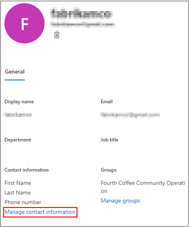

# 编辑来宾用户信息

您可以从 Microsoft 365 管理中心或 Azure Directory 门户中编辑来宾信息。

## Microsoft 365 管理员中的来宾用户

1. 若要在 [Microsoft 365 管理中心](https://admin.microsoft.com)中编辑来宾信息，请选择 " **用户**  >  **来宾用户** "。

   

2. 选择 " **来宾用户** " 中的用户。

3. 在 "来宾用户信息" 中，选择 " **管理联系人信息** "。

   

4. 在 " **管理联系人信息** " 中编辑除 " **显示名称** " 之外选择的任何字段，然后选择 " **保存更改** "。

   

您也可以从 [Azure Active Directory 门户](https://aad.portal.azure.com/#blade/Microsoft_AAD_IAM/UsersManagementMenuBlade/MsGraphUsers)编辑来宾用户。
