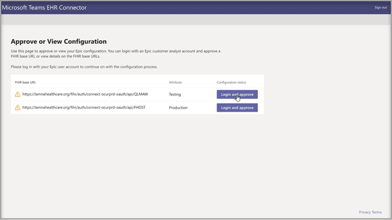

# 使用 Teams 进行虚拟访问 - 集成到 EHR 中

借助 Microsoft Teams 电子健康记录 (EHR) Connector，医生可以轻松直接从 EHR 系统在 Teams 中启动虚拟患者访问或咨询其他提供商。 Microsoft Teams 在 Microsoft 365 云上构建，支持符合 HIPAA、HITECH 认证等要求，通过单个中心中的聊天、视频、语音和医疗保健工具实现简单、安全的协作和通信。
通过 Teams 的通信和协作平台，医生可以轻松解决系统碎片化问题，以便他们花时间提供最佳护理。 Microsoft Teams 电子运行状况记录 (EHR) 连接器可以：
- 从提供商和患者门户启动 Teams 虚拟访问。
- 连接和断开连接事件时写回到 EHR 元数据，以启用自动审核和记录保留。
- 集成到现有医生和患者工作流中，同时允许他们使用 Microsoft Teams。

  观看如何从 EHR 门户管理虚拟访问的视频。

> [!VIDEO https://www.microsoft.com/videoplayer/embed/RE4HAtn]

## 开始之前

在集成 EHR 连接器之前，需要确保满足以下先决条件：

- 访问在长篇故事的应用应用商店中的 Microsoft Teams [应用](https://apporchard.epic.com/Gallery?id=6153)。

- Microsoft Cloud for Healthcare 的活动订阅或 Microsoft Teams EHR Connector 独立套餐的订阅。

- 用户必须具有包含 Microsoft Teams 会议的适当 Microsoft 365 或 Office 365 许可证。

- Microsoft Teams 应在组织内部采用和使用。

- 组织必须具有 2018 年 11 月版或更高版本的"长篇大全"版本。

- 系统必须满足所有 [软件和浏览器先决条件](https://docs.microsoft.com/microsoftteams/hardware-requirements-for-the-teams-app)。

还需要组织中以下人员的信息：

- Microsoft 365 管理员

- 长篇客户分析师

> [!Note]
> 请请Epicep 技术专家提供 Epic-Microsoft Teams Telehealth 集成指南，该指南在长篇市场中提供。

## 连接器设置

连接器设置要求：

- [启动 EHR 连接器配置门户](ehr-admin.md#launch-the-ehr-connector-configuration-portal)
- [配置信息](ehr-admin.md#configuration-information)
- [批准或查看配置](ehr-admin.md#approve-or-view-configuration)
- [查看并完成配置](ehr-admin.md#review-and-finish-the-configuration)

### [启动 EHR 连接器配置门户](#launch-the-ehr-connector-configuration-portal)

首先启动 EHR 连接器配置门户，将医疗保健组织配置为启动 Microsoft Teams 的虚拟访问。 配置一个或多个组织以测试集成。 在配置门户中配置测试和生产 URL。 在迁移到生产环境之前，先从 Epic 的测试环境测试集成。
  
- EHR 连接器配置 URL： [https://ehrconnector.teams.microsoft.com](https://ehrconnector.teams.microsoft.com)

组织的 Microsoft 365 管理员和长篇客户分析师必须在配置门户中完成信息和集成步骤。 有关"长篇大作"配置步骤，请联系分配给组织的"长篇故事"技术专家资源。

### [配置信息](#configuration-information)

此步骤由 **Microsoft 365 管理员完成**。 Microsoft 365 管理员必须启动连接器配置门户，然后使用 Microsoft 凭据登录才能启动配置过程。

若要完成此步骤，Microsoft 365 管理员必须收到一个有效的 Fast Health 互操作性资源 (FHIR) 基 URL，该基 URL 来自要批准配置的 Epic 客户分析师。 Microsoft 365 管理员必须启动连接器配置页，然后使用 Microsoft 凭据登录才能开始配置过程。

- FHIR 基 URL 是对应于服务器 FHIR API 终结点的静态地址。 示例 URL 为 `https://lamnahealthcare.org/fihr/auth/connect-ocurprd-oauth/api/FHDST` 。

- 配置审批者名称是负责在下一步中审批配置的"长篇客户"分析人员的名称。 "长篇故事"客户分析师是组织中具有对"长篇故事"的登录访问权限的人。

  

### [批准或查看配置](#approve-or-view-configuration)

现在，作为审批者添加的医疗保健组织的 Epic 客户分析师必须使用上一步骤中的相同 EHR 连接器 URL，才能使用其 Microsoft 365 凭据登录。 成功验证后，将要求审批者使用其"长篇"凭据登录以验证"长篇故事"组织。

> [!Note]
> 你组织的 Microsoft 365 管理员和长篇客户分析师可以是同一个人。 在这种情况下，请添加自己的用户名作为审批者。 你仍然需要登录到"长篇大作"来验证你的访问权限。 长篇登录仅用于验证 FHIR 基 URL。 Microsoft 不会通过此登录存储凭据或访问 EHR 数据。

  

成功登录"长篇故事"后，"长篇故事"客户 **分析师必须** 批准配置。 如果配置不正确，Microsoft 365 管理员将可以再次登录 Microsoft EHR 连接器门户来修改原始配置。 

### [查看并完成配置](#review-and-finish-the-configuration)

当配置信息由"长篇故事"管理员批准时，你将看到患者和提供者启动的集成记录。 这些记录是完成"长篇故事"中的虚拟访问配置所必需的。 有关详细信息，请参阅 Epic-Microsoft Teams Telehealth 集成指南。

> [!Note]  
> Microsoft 365 或 Epic 客户分析师随时可登录配置门户，查看集成记录并根据需要修改组织配置。

> [!Note]
> 之前由 Microsoft 管理员配置的每一个 FHIR URL 必须由 Epic 客户分析师完成审批过程。

## 启动 Teams 虚拟访问

完成 EHR 连接器步骤和"长篇大作"配置后，组织即可使用 Microsoft Teams 支持视频访问。

### 虚拟访问先决条件

- 系统必须满足所有 [软件和浏览器先决条件](https://docs.microsoft.com/microsoftteams/hardware-requirements-for-the-teams-app)。

- 医疗保健组织必须已完成在"长篇故事"组织和 Microsoft 365 组织之间的设置。

### 提供商体验

贵组织的医疗保健提供商还可以从 Hyperspace、Haiku、Canto (的"长篇大全"提供商应用程序加入 Microsoft Teams 的虚拟) 。 提供程序 **流中** 嵌入了"开始虚拟访问"按钮。

提供商体验的主要功能：

- 提供商可以使用支持的浏览器或 Microsoft Teams 应用程序加入虚拟访问。

- 首次加入虚拟访问时，提供商必须使用其 Microsoft 365 帐户进行一次登录。

- 一次登录后，提供商将直接进入 Microsoft Teams 中的虚拟约会。  (提供程序必须登录到 Microsoft Teams) 。

- 提供商可以看到给定约会的参与者连接和断开连接实时更新。 提供商可以看到患者何时连接到虚拟访问。

  

### 患者体验

此连接器支持患者通过 MyChart Web 和移动设备加入虚拟访问。 预约时，患者可以使用"开始虚拟访问"按钮从 MyChart 开始 **虚拟** 访问。

患者体验的主要功能：

- 患者无需安装应用即可从桌面和移动设备上的现代 Web 浏览器加入虚拟访问。

- 患者只需单击一下即可加入虚拟访问，无需其他帐户或登录。

- 患者无需创建 Microsoft 帐户或登录以启动虚拟访问。

- 患者将被放置在大厅中，直到医疗保健提供商加入预约并准许他们进行虚拟访问。

- 加入虚拟访问之前，大厅中提供了视频和麦克风测试。

  

> [!Note]
> Epic、MyChart、Haiku 和 Canto 是长篇系统公司的商标。

### 数据的隐私和位置

Teams 与 EHR 系统的集成优化了集成和虚拟访问流期间使用和存储的数据量。 该解决方案遵循 Teams 隐私中概述的总体 Teams 隐私和数据管理原则与准则。

Microsoft Teams EHR 连接器不存储或传输任何可识别的个人数据，也不从 EHR 系统传输患者或医疗保健提供者的任何健康记录。 EHR 连接器存储的唯一数据是 EHR 用户的唯一 ID，该 ID 在 Teams 会议设置期间使用。 EHR 用户的唯一 ID 存储在 [Microsoft 365](https://docs.microsoft.com/microsoft-365/enterprise/o365-data-locations?view=o365-worldwide#data-center-geographies)客户数据存储位置中所述的三个地理区域之一。 会议参与者输入到 Teams 的所有聊天、录制和其他数据都根据现有存储策略进行存储。 若要详细了解 Microsoft Teams 中数据的位置，请访问 [Teams 中数据的位置](https://docs.microsoft.com/microsoftteams/location-of-data-in-teams)。
