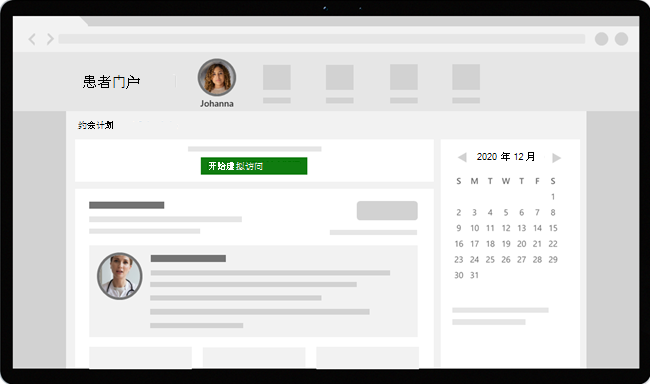

# 使用虚拟访问Teams - 集成到长篇 EHR 中

借助 Microsoft Teams EHR (EHR) 连接器，医生可以直接从长篇 EHR 系统向 Microsoft Teams 中的另一个提供商发起虚拟患者访问或咨询。 基于云Microsoft 365，Teams支持符合 HIPAA、HITECH 认证等要求的单一中心内通过聊天、视频、语音和医疗保健工具实现简单、安全的协作和通信。

这种通信和协作平台Teams让医生能够轻松解决碎片化系统的混乱，以便他们专注于提供最佳护理。 使用 Teams EHR 连接器，可以：

- 使用Teams工作流从长篇 EHR 系统启动虚拟访问。
- 使患者能够从患者Teams或短信加入虚拟访问。
- 支持其他方案，包括多参与者、组访问和解释程序服务。
- 将有关虚拟访问的元数据写回到 EHR Teams，以记录与会者连接、断开连接以及启用自动审核和记录保留时。
- 查看与 EHR 连接的访问的消耗数据报告和可自定义的呼叫质量信息。

观看此视频，大致了解如何从 EHR 门户管理虚拟访问。

> [!VIDEO https://www.microsoft.com/videoplayer/embed/RE4HAtn]

本文介绍如何设置和配置 Teams EHR 连接器，以与医疗保健组织的长篇故事平台集成。 此外，还概述了来自Teams EHR 系统的虚拟访问体验。

## 开始之前

在开始使用之前，需要执行一些操作来准备集成。

### 熟悉集成过程

查看以下信息，了解整个集成过程。

:::image type="content" source="media/ehr-connector-epic-flow.png" alt-text="概述整个集成过程中的步骤的图像。":::

||||||
|---------|---------|---------|---------|---------|
|**操作**：[请求访问 Teams 应用](#request-access-to-the-teams-app)。   **结果**：我们授权你的组织进行测试。|**操作**：创建公钥和私钥证书并将其上传到 Epic。   **结果**：长篇故事会同步公钥证书。|**操作**：在 EHR 连接器配置门户中完成配置步骤。   **结果**：会收到用于长篇配置的 FDI 记录。| **操作**：与 Epic 技术专家合作，在 Epic 中配置 FDI 记录。  **结果**：配置已完成。 准备测试。|**操作**：在测试环境中完成测试。  **结果**：对流进行完整验证，并决定转移到生产环境。|

### 请求访问 Teams 应用

你需要请求访问 Teams 应用。

1. 请求在长Teams[市场下载该应用](https://apporchard.epic.com/Gallery?id=6153)。 执行此操作会触发从 Epic 到 Microsoft EHR 连接器团队的请求。
1. 提出请求后，向用户 TeamsForHealthcare@service.microsoft.com 包含组织名称、租户 ID 和重要技术联系人的电子邮件地址的电子邮件。
1. Microsoft EHR 连接器团队将回复你的电子邮件，确认启用。

### 查看 Epic-Microsoft Teams Telehealth 集成指南

与你的 Epic 技术专家一起查看 [Epic-Microsoft Teams 远程医疗集成指南](https://galaxy.epic.com/Search/GetFile?Url=1!68!100!100100357)。 请确保满足所有先决条件。

## 先决条件

- Microsoft Cloud for Healthcare 的活动订阅或 Microsoft Teams EHR 连接器独立产品/ (仅在生产 EHR 环境中测试时) 。
- 2018 年 11 月或更高版本的长篇故事版本。
- 用户具有适当的Microsoft 365或Office 365许可证，Teams会议。
- Teams已在你的医疗保健组织中采用和使用。
- 系统满足[所有软件和浏览器要求，Teams](../../hardware-requirements-for-the-teams-app.md)。

> [!IMPORTANT]
> 在继续集成之前，请确保完成预集成步骤并满足所有先决条件。

集成步骤由组织中以下人员执行：

- **Microsoft 365全局管理员**：负责集成的主要人员。 管理员将配置连接器，根据需要 (SMS) ，并添加要批准配置的 Epic 客户分析师。
- **长篇故事** 客户分析师：组织中具有"长篇故事"登录凭据的人。 他们批准管理员输入的配置设置，并为 Epic 提供配置记录。

Microsoft 365管理员和 Epic 客户分析师可以是同一个人。

## 设置 Teams EHR 连接器

连接器设置要求你执行以下操作：

- [启动 EHR 连接器配置门户](#launch-the-ehr-connector-configuration-portal)
- [输入配置信息](#enter-configuration-information)
- [启用短信通知 (可选) ](#enable-sms-notifications-optional)
- [批准或查看配置](#approve-or-view-the-configuration)
- [查看和完成配置](#review-and-finish-the-configuration)

### 启动 EHR 连接器配置门户

若要开始，Microsoft 365管理员启动 [EHR](https://ehrconnector.teams.microsoft.com) 连接器配置门户，然后使用其凭据Microsoft 365登录。

你的Microsoft 365管理员可以配置单个组织或多个组织来测试集成。 在配置门户中配置测试和生产 URL。 在迁移到生产环境之前，请确保从长篇测试环境测试集成。

> [!NOTE]
> 你的Microsoft 365管理员和 Epic 客户分析师必须在配置门户中完成集成步骤。 有关长篇大篇的配置步骤，请联系分配到组织的长篇故事技术专家。

### 输入配置信息

接下来，若要设置集成，Microsoft 365管理员执行以下操作：

1. 将快速运行状况互操作性资源 (来自 Epic) 的 FHIR 数据库 URL 中，并指定环境。 根据需要配置多个 FHIR 基 URL，具体取决于组织的需求和要测试的环境。

    - FHIR 基 URL 是对应于服务器 FHIR API 终结点的静态地址。 示例 URL 为 `https://lamnahealthcare.org/fihr/auth/connect-ocurprd-oauth/api/FHDST`。

    - 可以设置测试和生产环境的集成。 对于初始设置，建议在迁移到生产环境之前从测试环境配置连接器。

1. 添加将在稍后的步骤中批准配置的 Epic 客户分析师的用户名。

    :::image type="content" source="media/ehr-connector-epic-configure.png" alt-text=""配置"页的屏幕截图，显示正在添加的审批者。" lightbox="media/ehr-connector-epic-configure.png":::

### 启用短信通知 (可选) 

> [!NOTE]
> 短信通知目前仅在美国可用。 我们正在努力在将来的 Teams 版本中在其他区域提供此功能，并更新本文（如果可用）。

如果你的组织希望 Microsoft 管理患者短信通知，请完成此步骤。 启用短信通知时，患者将收到有关计划访问的确认和提醒消息。

若要启用短信通知，Microsoft 365管理员执行以下操作：

1. 在"短信通知"页面上，选中以下两个许可复选框：

    - 允许 Microsoft 代表组织向患者发送短信通知。
    - 确认你将确保与会者已同意发送和接收短信。
    
    :::image type="content" source="media/ehr-connector-epic-sms-notifications.png" alt-text="短信通知页面的屏幕截图，显示同意复选框和生成电话号码的选项。" lightbox="media/ehr-connector-epic-sms-notifications.png":::

1. 在 **"电话号码"** 下，选择"生成 **新** 电话号码"，为组织生成电话号码。 执行此操作会启动请求并生成新电话号码的过程。 此过程最多可能需要 2 分钟才能完成。

    生成电话号码后，它将显示在屏幕上。 此号码将用于向患者发送短信确认和提醒。 该号码已预配，但尚未链接到 FHIR 基 URL。 下一步中会执行该步骤。

    :::image type="content" source="media/ehr-connector-epic-phone-number.png" alt-text="显示已生成的电话号码的示例的屏幕截图。" lightbox="media/ehr-connector-epic-phone-number.png":::

    选择 **"完成**"，然后选择"下一 **步"**。

1. 若要将电话号码链接到 FHIR 基 URL，请在电话 **"短信** 配置"**部分中选择该** 号码。 针对要启用短信通知的每个 FHIR 基 URL 执行此操作。

    :::image type="content" source="media/ehr-connector-epic-link-phone-number.png" alt-text="显示如何将电话号码链接到 FHIR 基 URL 的屏幕截图。" lightbox="media/ehr-connector-epic-link-phone-number.png":::

    如果这是第一次配置连接器，则会看到在上一步中输入的 FHIR 基 URL。 同一电话号码可以链接到多个 FHIR 基 URL，这意味着患者将收到来自不同组织和/或部门相同电话号码的短信通知。

1. 选择 **每个** FHIR 基 URL 旁边的"短信设置"，设置要发送给患者短信通知的类型。

    :::image type="content" source="media/ehr-connector-epic-sms-setup.png" alt-text="显示短信设置设置的屏幕截图。" lightbox="media/ehr-connector-epic-sms-setup.png":::

    - **确认短信**：在 EHR 系统中安排、更新或取消访问时，会向患者发送通知。
    - **提醒短信**：根据指定的时间间隔和计划的访问时间，向患者发送通知。

    选择" **保存**"。

1. 选择 **Upload证书** 上传公钥证书。 必须仅针对每个环境 (.cer) Base64 编码的公钥。

    需要公钥证书才能接收发送短信通知的约会信息。 需要证书才能验证传入的信息是否来自有效源。

    当连接器用于发送短信提醒时，当在长篇故事中创建约会时，长篇故事以 HL7v2 有效负载发送患者的电话号码。 这些号码存储为组织地理位置的每个约会，并保留到约会发生。 若要详细了解如何配置 HL7v2 消息，请参阅 [Telehealth Microsoft Teams Telehealth 集成指南](https://galaxy.epic.com/Search/GetFile?Url=1!68!100!100100357)。

    选择"下 **一步"**。

> [!NOTE]
> 你的管理员Microsoft 365随时更新任何短信设置。 请记住，更改设置可能会导致短信服务停止。 若要详细了解如何查看短信报告，请参阅 Teams [EHR 连接器管理员报告](ehr-admin-reports.md)。

### 批准或查看配置

组织中已添加为审批者的客户分析师启动 [EHR](https://ehrconnector.teams.microsoft.com) 连接器配置门户，使用其凭据Microsoft 365登录。 成功验证后，要求审批者使用其长篇凭据登录以验证"长篇故事"组织。

> [!Note]
> 如果Microsoft 365管理员和 Epic 客户分析师是同一个人，则你仍然需要登录到 Epic 来验证访问权限。 长篇登录仅用于验证 FHIR 基 URL。 Microsoft 不会通过此登录存储凭据或访问 EHR 数据。

:::image type="content" source="media/ehr-connector-epic-login-approve.png" alt-text=""批准或查看配置"页的屏幕截图，显示"登录和批准"选项。" lightbox="media/ehr-connector-epic-login-approve.png":::

成功登录到 Epic 后，Epic 客户分析师 **必须** 批准配置。 如果配置不正确，管理员Microsoft 365登录到配置门户并更改设置。

:::image type="content" source="media/ehr-connector-epic-approve.png" alt-text=""批准"或"查看配置"页的屏幕截图，显示"批准"选项。" lightbox="media/ehr-connector-epic-approve.png":::

### 查看和完成配置

在配置信息获得 Epic 管理员批准后，系统将为你提供用于患者和提供商启动的集成记录。 集成记录包括：

- 患者和提供者记录
- 直接短信记录
- 短信配置记录
- 设备测试配置记录

Epic 客户分析师必须将这些记录提供给 Epic，以完成 Epic 中的虚拟访问配置。 有关详细信息，请参阅 [Epic-Microsoft Teams Telehealth 集成指南](https://galaxy.epic.com/Search/GetFile?Url=1!68!100!100100357)。

> [!Note]  
> 客户或Microsoft 365客户分析师随时都可以登录到配置门户，查看集成记录并根据需要更改组织配置。

:::image type="content" source="media/ehr-connector-epic-finish.png" alt-text=""审阅和完成"页的屏幕截图，显示集成信息。" lightbox="media/ehr-connector-epic-finish.png":::

> [!Note]
> Epic 客户分析师必须完成由管理员配置的每个 FHIR 基 URL 的审批Microsoft 365过程。

## 启动Teams虚拟访问

完成 EHR 连接器步骤和长篇大作配置后，组织已准备好使用 Teams 支持视频访问。

### 虚拟访问先决条件

- 系统必须满足所有[软件和浏览器要求，Teams](../../hardware-requirements-for-the-teams-app.md)。

- 你已完成了长篇故事组织与贵组织之间的Microsoft 365设置。

### 提供商体验

贵组织的医疗保健提供商可以使用来自 Hyperspace、Haiku Teams Canto (的长篇大作提供商应用加入) 。 提供商流中嵌入了“**开始虚拟就诊**”按钮。

提供商体验的主要功能：

- 提供商可以使用支持的浏览器或应用加入Teams访问。

- 首次加入访问时，提供商必须使用其Microsoft 365帐户进行一次登录。

- 一次登录后，提供程序将直接进入 Teams 中的虚拟Teams。  (提供程序必须登录到 Teams) 。

- 提供商可以看到给定约会的参与者连接和断开连接实时更新。 提供商可以看到患者何时连接到了一个访问。

  

> [!NOTE]
> 在会议聊天中输入的出于医疗记录连续性或保留目的所需的任何信息都应由医疗保健提供商下载、复制和表示。 聊天不构成法律医疗记录或指定的记录集。 聊天中的消息根据管理员创建的设置Microsoft Teams存储。

### 患者体验

连接器支持患者通过 MyChart Web 和移动设备加入访问。 预约时，患者可以使用"开始虚拟访问"按钮从 MyChart **开始** 访问。

患者体验的主要功能：

- 患者可以在桌面和移动设备上加入新式 Web 浏览器的访问，而无需安装Teams[应用](../mobile-browser-join.md)。

- 患者只需单击一次即可加入访问，无需其他帐户或登录。

- 患者无需创建 Microsoft 帐户或登录启动访问。

- 病人被放置在大厅中，直到提供商加入并准许他们加入。

- 患者可以在加入访问之前在大厅中测试视频和麦克风。

  

> [!Note]
> Epic、MyChart、Haiku 和 Canto 是 Epic Systems Corporation 的商标。

### 隐私和数据位置

Teams EHR 系统集成可以优化集成和虚拟访问流期间使用和存储的数据量。 该解决方案遵循“Teams 隐私”中概述的总体 Teams 隐私和数据管理原则和准则。

EHR 连接器Teams EHR 系统不存储或传输任何可识别的个人数据或患者或医疗保健提供者的任何健康记录。 EHR 连接器存储的唯一数据是 EHR 用户的唯一 ID，该 ID 在 Teams 会议设置期间使用。

EHR 用户的唯一 ID 存储在“[Microsoft 365 客户数据的存储位置](/microsoft-365/enterprise/o365-data-locations)”中所述的三个地理区域之一。 会议参与者在会议Teams共享的所有聊天、录制和其他数据都根据现有存储策略进行存储。 若要详细了解数据在数据中的位置Teams，[请参阅数据在](../../location-of-data-in-teams.md)Teams。

## 相关文章

- [Teams EHR 连接器管理员报告](ehr-admin-reports.md)
- [医疗保健Teams入门](teams-in-hc.md)
