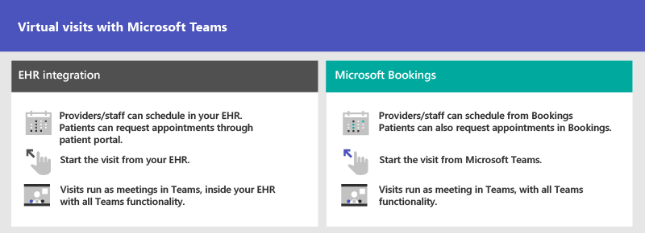
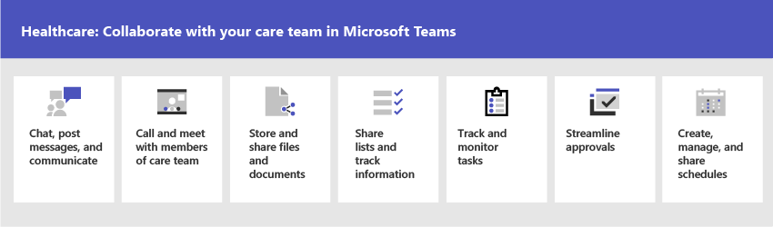

# 面向医疗保健组织的团队入门Get started with Teams for healthcare organizations

Microsoft 团队提供了许多适用于医院和其他医疗保健组织的功能，包括：Microsoft Teams offers a number of features useful for hospitals and other healthcare organizations, including:

- 虚拟访问和电子医疗保健记录 (EHR) 集成Virtual visits and Electronic Healthcare Record (EHR) integration
- 团队策略程序包Teams policy packages
- 安全消息Secure messaging
- 团队模板Teams templates
- 护理协调和协作Care coordination and collaboration

此功能是适用于医疗保健的 Microsoft 云的一部分。This functionality is part of the Microsoft Cloud for Healthcare. 了解有关使用此解决方案的详细信息，该解决方案通过 [适用于医疗保健的 Microsoft 云](https://docs.microsoft.com/industry/healthcare)从 Azure、Dynamics 365 和 microsoft 365 集中功能。Learn more about using this solution, which brings together capabilities from Azure, Dynamics 365, and Microsoft 365 at [Microsoft Cloud for Healthcare](https://docs.microsoft.com/industry/healthcare).

观看以下视频，了解有关在 Microsoft 团队中使用 "医疗保健" 集合增强运行状况团队协作的详细信息。Watch the following video to learn more about using the healthcare collection to enhance health team collaboration in Microsoft Teams.

> [!VIDEO https://www.microsoft.com/videoplayer/embed/RE4Hqan]

> [!NOTE]
> 本部分中的内容假设您已经在组织中部署了团队。The content in this section assumes that you've already deployed Teams in your organization. 如果尚未推出团队，请先阅读 [如何展示 Microsoft 团队](../../How-to-roll-out-teams.md)。If you haven't yet rolled out Teams, start by reading [How to roll out Microsoft Teams](../../How-to-roll-out-teams.md).

## 虚拟访问和电子医疗保健记录 (EHR) 集成Virtual visits and Electronic Healthcare Record (EHR) integration

使用 Microsoft 团队中的 "完整会议" 平台安排、管理和处理患者的虚拟访问。Use the complete meetings platform in Microsoft Teams to schedule, manage, and conduct virtual visits with patients.

- 如果您的组织已使用电子运行状况记录或 EHR，则可以集成 Microsoft 团队以实现更流畅的体验。If your organization already uses Electronic Health Records, or EHR, you can integrate Microsoft Teams for a more seamless experience. Microsoft 团队电子医疗记录 (EHR) 连接器使临床医生能够轻松地从 EHR 系统与团队中的另一个提供商发起虚拟患者访问或咨询。Microsoft Teams Electronic Health Record (EHR) Connector makes it easy for clinicians to launch a virtual patient visit or consultation with another provider in Teams directly from the EHR system. 若要了解详细信息，请参阅 [与团队的虚拟访问-集成到 EHR](ehr-admin.md)。To learn more, see [Virtual visits with Teams - Integration into EHR](ehr-admin.md).
- 如果你不使用受支持的 EHR，则可以使用 Microsoft 预定和团队中的预定应用。If you aren't using a supported EHR, you can use Microsoft Bookings and the Bookings app in Teams. 若要了解详细信息，请参阅 [Microsoft 团队中的 "登记应用和虚拟访问](../../bookings-app-admin.md)"。To learn more, see [Bookings app and virtual visits in Microsoft Teams](../../bookings-app-admin.md).

## 团队策略程序包Teams policy packages

应用团队策略包以定义不同角色可在团队中执行的操作。Apply Teams policy packages to define what different roles can do in Teams. 例如，为以下内容指定策略：For example, specify policies for:

- 临床工作者（如注册的护士、费用护理人员、医生和社会工作者），以便他们可以拥有对聊天、通话、班次管理和会议的完全访问权限。Clinical workers, such as registered nurses, charge nurses, physicians, and social workers, so that they can have full access to chat, calling, shift management, and meetings.
- 您的医疗保健组织中的信息工作者（如 IT 人员、informatics 员工、财务人员和合规性监察官）可以拥有对聊天、通话和会议的完全访问权限。Information workers in your healthcare organization, such as IT personnel, informatics staff, finance personnel, and compliance officers, can have full access to chat, calling, and meetings.
- 患者机房，用于控制患者机房设备的设置。Patient rooms, to control settings for patient room devices.

若要了解详细信息，请参阅 [医疗保健的团队策略程序包](../../policy-packages-healthcare.md)。To learn more, see [Teams policy packages for healthcare](../../policy-packages-healthcare.md).

## 安全消息Secure messaging

安全邮件支持运行状况团队中的协作，包括多个新功能：Secure messaging supports collaboration within health teams, including several new features:

- 邮件发件人可以为其邮件设置特殊优先级，以便收件人在阅读邮件之前反复收到通知。A message sender can set a special priority for their message, so the recipient is repeatedly notified until they read the message.
- 邮件发件人可以请求已读回执，这样当邮件收件人阅读邮件时，会收到通知。A message sender can request a read receipt, so they are notified when a message they sent was read by the message recipient.

结合这些功能，可以更快地注意紧急邮件，并确保邮件已接收和阅读。Together, these features allow quicker attention to urgent messages and confidence that the message was received and read. 使用这些功能的新运行状况团队可以在每个患者的基础上创建。New health teams using these features can be created on a per-patient basis. 这些功能是基于策略的，可分配给个人或整个团队。These features are policy-based, and can be assigned to individuals or entire Teams.

若要了解详细信息，请参阅 [面向医疗保健组织的安全邮件策略入门](messaging-policies-hc.md)。To learn more, see [Get started with Secure Messaging policies for Healthcare organizations](messaging-policies-hc.md).

同时与安全消息相关的功能是拥有受医疗保健组织联盟的其他租户，从而实现了更丰富的租户间通信。Also related to secure messaging is the ability to have other tenants federated by Healthcare organizations, allowing richer inter-tenant communication.  (请参阅 [管理 Microsoft 团队) 中的 "管理外部访问 (联合身份验证") ](../../manage-external-access.md) 。(See [Manage external access (federation) in Microsoft Teams](../../manage-external-access.md)).

## 医疗保健组织的团队模板Teams templates for healthcare organizations

创建团队的新模板已开发为适用于医院的设置，并且预计会更多。New templates for creating Teams were developed to apply to a Hospital setting, and more are expected soon. 这使您可以更轻松地创建医疗保健工作者在各种部门或 wards 中协调病人的护理。This makes it easier to create teams that Healthcare workers use to coordinate care for patients in various departments or wards. 若要了解详细信息，请参阅 [面向医疗保健组织的团队模板入门](healthcare-templates.md)。To learn more, see [Get started with Teams templates for Healthcare organizations](healthcare-templates.md). 团队可以为内部部门（如心脏病科）或用于护理 wards 的团队开始，并且更多模板位于开发中。Teams can be started for internal departments such as cardiology, or for care wards, and more templates are in development.

## 护理协调和协作Care coordination and collaboration

让您的运行状况团队协同工作，与 Microsoft 团队协调护理和协作。Bring your health team together to coordinate care and collaborate with Microsoft Teams.

Microsoft 团队使医生、临床医生、护士和其他员工能够以 Microsoft 团队中包含的协作功能高效地协作，例如：Microsoft Teams enables physicians, clinicians, nurses, and other staff to collaborate efficiently with included collaboration features in Microsoft Teams, such as:

- 为您的健康团队和信息工作者设置团队和频道。Set up teams and channels for your health teams and information workers. 将频道与选项卡配合使用，以通过可固定信息源的选项卡提供更多帮助。Use channels with tabs as a way to structure their work, with additional help from tabs to which they can pin information sources.
- 聊天、发布消息和交流。Chat, post messages, and communicate. 你的团队可以与需要关注的不同患者进行持续对话。Your team can have persistent conversations about different patients needing attention.
- 与运行状况团队的成员通话和会面。Call and meet with members of the health team. 设置单个会议，或使用频道会议管理每日会议，包括团队的强大功能：音频、视频、屏幕共享、录制和设备功能。Set up individual meetings, or use channel meetings to manage daily meetings, both with the power of Teams audio, video, screen sharing, recording, and transcription features.
- 存储和共享文件和文档。Store and share files and documents. 您的运行状况团队是单个虚拟化团队的一部分，可在 Office 文档上工作并进行协作。Your health team is part of a single virtualized team that works and collaborates on Office documents.

此外，你的团队可以使用团队中的应用执行以下操作：In addition, your team can use apps in Teams to:

- 通过 "列表" 应用共享列表和跟踪信息Share lists and track information with the Lists app
- 利用 "任务" 应用程序跟踪和监视任务Track and monitor tasks with the Tasks app
- 通过 "审批" 应用优化审批Streamline approvals with the Approvals app
- 通过 "倒班" 应用创建、管理和共享日程安排Create, manage, and share schedules with the Shifts app

### 通过 "列表" 应用共享列表和跟踪信息Share lists and track information with the Lists app

> [!NOTE]
> 2020年10月30日，患者应用将停用并由团队中的 " [列表" 应用](https://support.microsoft.com/office/get-started-with-lists-in-teams-c971e46b-b36c-491b-9c35-efeddd0297db) 取代。Effective October 30, 2020, the Patients app will be retired and replaced by the [Lists app](https://support.microsoft.com/office/get-started-with-lists-in-teams-c971e46b-b36c-491b-9c35-efeddd0297db) in Teams. 利用 "列表"，医疗保健组织中的 "护理团队" 可以创建各种方案的患者列表，包括从倒圆角和 interdisciplinary 团队会议到常规患者监控。With Lists, care teams in your healthcare organization can create patient lists for scenarios ranging from rounds and interdisciplinary team meetings to general patient monitoring.

团队中的 "列表" 应用可帮助团队跟踪信息和组织工作。The Lists app in Teams helps teams track information and organize work. 为所有团队用户预安装应用，并且该应用在每个团队和频道中均可用作选项卡。The app is pre-installed for all Teams users and is available as a tab in every team and channel. 可以从预定义的模板或将数据导入到 Excel 中从头开始创建列表。Lists can be created from scratch, from predefined templates, or by importing data to Excel.

运行状况团队可以使用患者模板开始使用。health teams can use the Patients template to get started. 他们可以创建列表来跟踪病人的需求和状况。They can create lists to track the needs and status of patients. 可将 Excel 电子表格中的现有患者数据引入到团队中以创建列表。Existing patient data on Excel spreadsheets can be brought in to create a list in Teams. 这些列表可用于诸如倒圆角和患者监视等方案来协调护理。These lists can be used for scenarios such as rounds and patient monitoring to coordinate care.

例如，收费护士在包含所有运行状况团队成员的团队中创建一个患者列表。For example, a charge nurse creates a patient list in a team that includes all health team members. 在倒圆角期间，运行状况团队将在其移动设备上访问团队并更新列表中的患者信息，团队中的每个人都可以查看它们以保持同步。在运行状况团队收集以讨论和评估关键运行状况性能指标的舍入会话中，为确保患者在合适的 glide 路径上，他们可以使用大型显示屏幕上的团队共享此信息。During rounds, the health team access Teams on their mobile devices and update patient information in the list, which everyone on the team can view to stay in sync. At rounding sessions where the health team gathers to discuss and evaluate key health performance metrics to ensure a patient is on the right glide path to discharge, they can share this information using Teams on a large display screen. 不在网站上的运行状况团队成员可以远程加入。health team members who aren't on site can join remotely.

下面是为患者舍入设置的示例列表。Here's an example list which was set up for patient rounding.

:::image type="content" source="../../media/lists-patients-example.png" alt-text="患者舍入示例列表的屏幕截图":::

若要了解详细信息，请参阅 [管理团队中组织的列表应用](../../manage-lists-app.md)。To learn more, see [Manage the Lists app for your organization in Teams](../../manage-lists-app.md).

### 利用 "任务" 应用程序跟踪和监视任务Track and monitor tasks with the Tasks app

使用团队中的 [任务](https://support.microsoft.com/office/use-the-tasks-app-in-teams-e32639f3-2e07-4b62-9a8c-fd706c12c070) 跟踪整个运行状况团队的待办事项。Use [Tasks](https://support.microsoft.com/office/use-the-tasks-app-in-teams-e32639f3-2e07-4b62-9a8c-fd706c12c070) in Teams to track to do items for your whole health team. 您的运行状况团队可随时从运行团队的任何设备创建、分配和安排任务、对任务进行分类和更新状态。Your health team can create, assign, and schedule tasks, categorize tasks, and update status at any time, from any device running Teams.

若要了解详细信息，请参阅 [在 Microsoft 团队中管理组织的 "任务" 应用](../../manage-tasks-app.md)To learn more, see [Manage the Tasks app for your organization in Microsoft Teams](../../manage-tasks-app.md)

### 通过 "审批" 应用优化审批Streamline approvals with the Approvals app

使用 [审批](https://support.microsoft.com/office/what-is-approvals-a9a01c95-e0bf-4d20-9ada-f7be3fc283d3) 简化你的团队的所有请求和流程。Use [Approvals](https://support.microsoft.com/office/what-is-approvals-a9a01c95-e0bf-4d20-9ada-f7be3fc283d3) to streamline all of your requests and processes with your team. 直接从您的中心创建、管理和共享审批以进行协作。Create, manage, and share approvals directly from your hub for teamwork. 从您发送聊天的同一位置启动审批流程，在频道对话中或从 "审批" 应用本身开始。Start an approval flow from the same place you send a chat, in a channel conversation, or from the Approvals app itself. 只需选择审批类型、添加详细信息、附加文件，然后选择 "审批者"。Just select an approval type, add details, attach files, and choose approvers. 提交后，审批者将收到通知，并可查看请求并对请求进行操作。Once submitted, approvers are notified and can review and act on the request.

你可以为你的组织允许 "审批" 应用，并将其添加到你的团队。You can allow the Approvals app for your organization and add it to your teams. 若要了解有关管理应用的详细信息，请参阅 [在 Microsoft 团队管理中心中管理你的应用](../../manage-apps.md)。To learn more about managing apps, see [Manage your apps in the Microsoft Teams admin center](../../manage-apps.md).

### 通过倒班应用和一线工作人员集成创建、管理和共享计划Create, manage, and share schedules with the Shifts app and Firstline Worker integration

Microsoft 团队与倒班应用和一线工作者集成，可用于协调倒班人员人员的功能。Microsoft Teams integrates with the Shifts app and Firstline Worker, which can be used to coordinate shift staffing features and more. 例如，在倒班中，护士经理可以为其员工设置和协调日程，并且护士可以检查计划和交换班次。For example, in Shifts, Nurse managers can set up and coordinate schedules for their staff, and nurses can check schedules and swap shifts. 团队包括一个内置的一线 Worker 应用设置策略，可分配给你的组织中的一线工作人员。Teams includes a built-in Firstline Worker app setup policy that you can assign to Firstline Workers in your organization. 默认情况下，该策略包括活动、班次、聊天和呼叫应用。By default, the policy includes the Activity, Shifts, Chat, and Calling apps. 此策略控制这些应用的行为，例如，将倒班应用固定到应用栏，以便团队可以快速访问它。This policy controls behavior for these apps, for example, pinning the Shifts app to the app bar so the team can quickly access it.

若要了解详细信息，请参阅 [在 Microsoft 团队中管理你的组织的倒班应用](../shifts/manage-the-shifts-app-for-your-organization-in-teams.md)。To learn more, see [Manage the Shifts app for your organization in Microsoft Teams](../shifts/manage-the-shifts-app-for-your-organization-in-teams.md).
