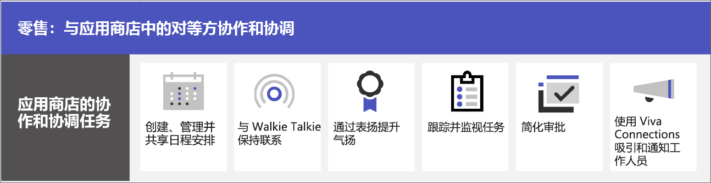

# 零售团队协作

将店内同事和管理层汇集在一起，从而使用 Microsoft Teams 进行通信、协作并简化操作。 帮助同事 [使用 Viva Connections 连接到组织](#connect-information-from-across-the-organization-with-viva-connections)，并通过 [Yammer 社区](#connect-across-your-organization-with-yammer-and-teams) 实现商店之间以及商店与总部之间的通信。

> [!VIDEO https://www.microsoft.com/videoplayer/embed/RWRJVw]

> [!NOTE]
> 这些方案也是 Microsoft Cloud for Retail 的一部分。 如果还使用 Microsoft Dynamics 365 等 Microsoft Cloud for Retail 的其他功能，则可以使用这些方案执行更多操作。 详细了解如何使用此解决方案，该解决方案将 Azure、Dynamics 365 和 Microsoft 365 中的功能汇集到 [Microsoft Cloud for Retail](/industry/retail) 中。

## Teams 中的日常通信和协作

Microsoft Teams 使店内销售同事、经理和其他员工能够使用包含的协作功能和应用高效协作。 前线员工可以在个人或共享设备上使用 Teams，具体取决于组织需求。

Teams 包含以下传达并共享信息的方法:

| 任务 | 说明 | 管理此功能 | 最终用户培训 |
| ---- | ---- | ---- | ---- |
| 聊天、发布消息和通信 | 店内同事可以跨部门无缝通信，从而完成订单、为客户获取帮助并管理库存需求。   Teams 为组织提供了现成的出色协作体验，并且大多数组织发现默认设置适合它们。 | [Microsoft Teams 中的聊天、团队、频道和应用](../deploy-chat-teams-channels-microsoft-teams-landing-page.md) | [开始聊天](https://support.microsoft.com/office/start-and-pin-chats-a864b052-5e4b-4ccf-b046-2e26f40e21b5) 和 [使用帖子和消息](https://support.microsoft.com/office/create-and-format-a-post-e66777da-636b-49eb-9408-b0d88b212885) |
|与团队成员通话和开会 | 经理可以设置单个会议，或使用频道会议管理日常会议，这两者都具有强大的 Teams 音频、视频、屏幕共享、录制和听录功能。 例如，经理可以设置与不同部门的商店同事的视频晨会，从而在开店前检查他们的状态。   需要为会议配置设置，并启用“语音”解决方案以使用通话功能。 | [Microsoft Teams 中的会议](../deploy-meetings-microsoft-teams-landing-page.md) 和 [规划 Teams “语音”解决方案](../cloud-voice-landing-page.md) | [呼叫](https://support.microsoft.com/office/overview-of-teams-calls-425d6970-6e27-47b6-bc61-4c38fff51c4f) 和 [加入会议](https://support.microsoft.com/office/join-a-teams-meeting-078e9868-f1aa-4414-8bb9-ee88e9236ee4) |
|存储并共享文件和文档 | 通过共享文件，店内员工可以轻松访问推销图表等信息，无需离开销售区或获得经理的帮助。 每个团队都会自动附带“文件”选项卡，可用于存储并共享文档。 此选项卡实际上代表 SharePoint 中默认团队网站文档库中的文件夹，该文件夹在创建团队时自动创建。 | [SharePoint 和 OneDrive 如何与 Microsoft Teams 交互](../sharepoint-onedrive-interact.md) | [上传并共享文件](https://support.microsoft.com/office/upload-and-share-files-57b669db-678e-424e-b0a0-15d19215cb12) |

团队可以使用 Teams 中的应用以在日常任务上相互协调和协作，如下所示:

| 任务 | 应用 | 说明 | 管理此应用 | 最终用户培训 |
| ---- | ---- | ---- | ---- | ---- |
| 创建、管理并共享日程安排| 排班 | 使用“班次”无缝管理并共享日程安排。 经理可以创建收银员或迎宾员等自定义组、向员工分配班次、添加自定义标签和休息时间，以及添加员工可以请求参加的未完成班次。 员工可以使用“班次”设置可用时间、查看日程安排、与同事换班以及打卡上、下班。 | [管理班次](/microsoftteams/expand-teams-across-your-org/shifts/manage-the-shifts-app-for-your-organization-in-teams)|[班次视频培训](https://support.microsoft.com/office/what-is-shifts-f8efe6e4-ddb3-4d23-b81b-bb812296b821)|
| 保持联系 | 对讲机 | 无线电对讲机应用提供即时的一键通通信。 使用无线电对讲机，员工和经理可以从商店的任何位置进行通信。 例如，如果商店一侧的客户询问员工商店另一侧是否有某商品现货，则该员工可以使用无线电对讲机与在该商品附近工作的员工联系。 由于无线电对讲机的范围不受限，因此员工还可以轻松咨询其他商店或公司办公室内的专家。 | [管理无线电对讲机](../walkie-talkie.md)  | [无线电对讲机视频培训](https://support.microsoft.com/office/use-walkie-talkie-in-teams-884a008a-761e-4b62-99f8-15671d9a2f69) |
| 鼓舞士气 | 表扬 | Praise 应用允许管理层和店内同事发送预制或自定义徽章，从而相互祝贺并分享感激之情。 Praise 可帮助员工在达成成就时感到被认可，例如制定销售目标和超越标准以帮助客户。 | [管理 Praise 应用](../manage-praise-app.md) |[Praise 视频培训](https://support.microsoft.com/office/communication-and-praise-7d37ef80-542b-42e5-aa01-0fabbaa634b6) |
| 跟踪并监视任务 | 任务 | 使用 Teams 中的“任务”跟踪整个零售团队的待办事项。 商店经理和员工可以随时从任何运行 Teams 的设备创建、分配并安排任务、对任务进行分类和更新状态。 IT 专业人员和管理员还可针对你的组织向特定团队发布任务。 例如，可以发布一组日常清洁任务或设置新陈列的步骤。| [管理“任务”应用](/microsoftteams/manage-tasks-app) |[“任务”视频培训](https://support.microsoft.com/office/use-the-tasks-app-in-teams-e32639f3-2e07-4b62-9a8c-fd706c12c070) |
| 简化审批 | 审批 | 使用“审批”简化团队的请求和流程。 直接从中心创建、管理和共享批准，进行团队合作。 从发送聊天的同一位置、频道对话中，或者从审批应用本身开始审批流程。 只需选择审批类型、添加详细信息、附加文件，然后选择审批者。 提交后，审批者将收到通知，审阅者可以审阅并响应请求。 可以为组织允许“审批”应用并将其添加到 Teams。 | [Teams“审批”应用可用性](/microsoftteams/approval-admin) | [“审批”视频培训](https://support.microsoft.com/office/what-is-approvals-a9a01c95-e0bf-4d20-9ada-f7be3fc283d3?wt.mc_id=otc_microsoft_teams)|

### 设置团队、频道和应用

当准备好在 Teams 中连接零售同事时，可以使用预制或自定义模板以为商店团队和经理设置团队和频道。 最简单的方法是从模板开始。 **组织商店** 和 **经理零售** [模板](/microsoftteams/get-started-with-retail-teams-templates) 为预制模板，其中包括专为零售设计的频道和应用。 还可以基于现有团队创建模板。 即使从模板开始，也可以自定义团队和频道，并添加更多应用以满足团队需求。

- 使用带有选项卡的频道以共享新闻、让员工在班次之间保持联系，并建立社区。
- 使用团队模板以跨商店或区域设置具有类似结构(例如频道和选项卡)的团队。

#### 基于模板创建团队

1. 在 Microsoft Teams 中，选择 **加入或创建团队**。

2. 选择 **创建团队**，然后向下滚动以查看可用模板。

详细信息: [使用模板创建团队](https://support.microsoft.com/office/create-a-team-with-team-templates-702a2977-e662-4038-bef5-bdf8ee47b17b)

### 管理应用

使用应用优化团队中的内容。 可以在 Microsoft Teams 管理中心内允许或阻止组织应用，或为应用配置设置。 有关管理应用的详细信息，请参阅 [在 Microsoft Teams 管理中心内管理应用](../manage-apps.md)。

用户可以向其团队添加你允许的任何应用。 与用户共享此培训，从而向他们展示如何: [查找并使用应用](https://support.microsoft.com/office/find-and-use-apps-6e22a734-c002-4da0-ba63-681f155b142d)。

## 使用 Viva Connections 连接整个组织中的信息

使用 Viva Connections 与员工建立关系，并向其发送通知。 Viva Connections 会在 Teams 中创建中心，零售同事可在其中查看组织中定制的新闻流和包含其所需资源的个性化仪表板。 当员工使用 Viva Connections 时，他们能够更快地获取重要信息，这意味着经理无需花费宝贵的时间来传递更新。 在 Viva Connections 仪表板上显示关键信息、个性化新闻、任务、公告和其他资源。

详细了解 [Viva Connections](/sharepoint/viva-connections-overview)，并帮助员工和同事开始使用 [Microsoft Teams 中的 Viva Connections](https://support.microsoft.com/office/your-intranet-is-now-in-microsoft-teams-8b4e7f76-f305-49a9-b6d2-09378476f95b)。

借助 Microsoft Teams、Viva Connections 和 SharePoint，可以启用以下方案:

- 新员工入职 [了解具体操作](/sharepoint/onboard-employees)
- 连接领导团队和一线员工 [了解具体操作](/sharepoint/leadership-connection)
- 将新闻分发到组织 [了解具体操作](/sharepoint/distribute-corporate-news-to-your-organization)

[详细了解如何在组织中驱动通信](/sharepoint/corporate-communications-overview)

## 使用 Yammer 和 Teams 连接整个组织

与 Yammer 中的社区建立关系。 Yammer 中的社区为对话、文件、事件和更新提供中心场所，从而满足知识共享、员工体验、全公司通信和领导参与的需求。 同事可以在 Yammer 社区中提出问题、提供反馈以及提出并回答问题。 举办现场活动和市政厅会议，从而让组织中的每个人都能了解最新情况。

了解如何 [将 Yammer 页面添加到 Teams 频道](https://support.microsoft.com/office/add-a-yammer-page-to-a-teams-channel-ca06ec83-f22d-4b76-83a5-c83aa2a33528) 以及如何 [在 Yammer 中加入并创建社区](https://support.microsoft.com/office/join-and-create-a-community-in-yammer-56aaf591-1fbc-4160-ba26-0c4723c23fd6)。

有关 Yammer 的详细信息:

- 对于管理员: [管理 Yammer](/yammer)
- 对于用户: [使用 Yammer](https://support.microsoft.com/office/what-is-yammer-1b0f3b3e-89ee-4b66-aac5-30def12f287c)