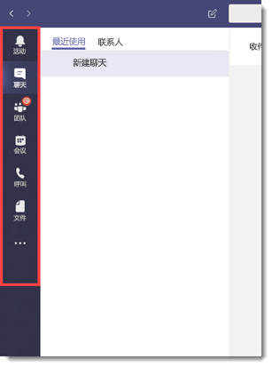
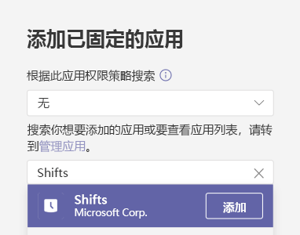
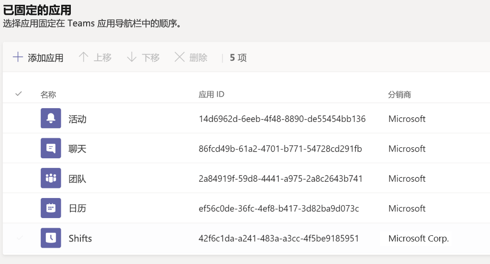
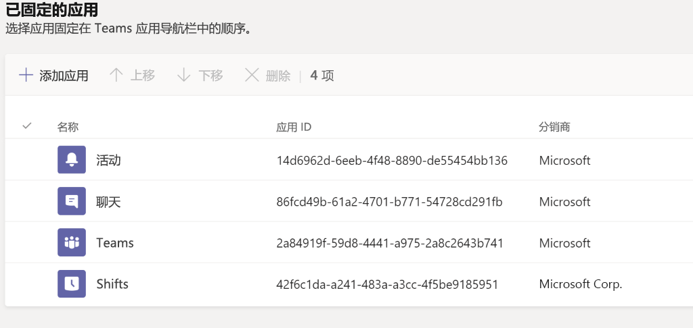
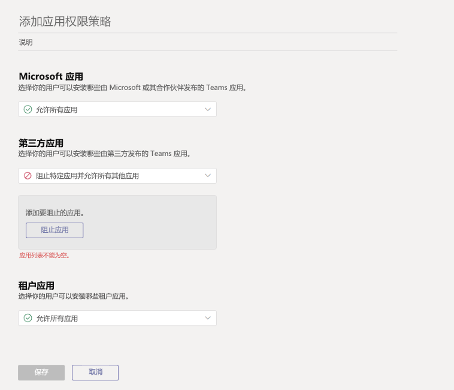

# <a name="how-to-provision-teams-at-scale-for-firstline-workers"></a><span data-ttu-id="1591e-103">如何为一线工作人员大规模预配 Teams</span><span class="sxs-lookup"><span data-stu-id="1591e-103">How to provision Teams at scale for Firstline Workers</span></span>

<span data-ttu-id="1591e-104">是否需要快速将大量用户加入到 Microsoft Teams 并为他们配置精简体验？</span><span class="sxs-lookup"><span data-stu-id="1591e-104">Do you need to rapidly onboard a large number of users to Microsoft Teams and configure a streamlined experience for them?</span></span> <span data-ttu-id="1591e-105">可按以下说明操作，快速预配标识、预配团队，并分配所有相关策略来控制最终用户体验。</span><span class="sxs-lookup"><span data-stu-id="1591e-105">You can quickly provision identities, provision teams, and assign all relevant policies to control the end user experience by walking through the following instructions.</span></span>

<span data-ttu-id="1591e-106">在本演练中，你将学习如何：</span><span class="sxs-lookup"><span data-stu-id="1591e-106">In this walkthrough, you'll learn how to:</span></span>

- <span data-ttu-id="1591e-107">创建大量用户。</span><span class="sxs-lookup"><span data-stu-id="1591e-107">Create a large number of users.</span></span>
- <span data-ttu-id="1591e-108">创建大量团队并设置适当的频道。</span><span class="sxs-lookup"><span data-stu-id="1591e-108">Create a large number of teams and set up the appropriate channels.</span></span>
- <span data-ttu-id="1591e-109">大规模分配许可。</span><span class="sxs-lookup"><span data-stu-id="1591e-109">Assign licensing at scale.</span></span>
- <span data-ttu-id="1591e-110">创建相应的 Teams 消息传递策略、应用设置策略和应用权限策略。</span><span class="sxs-lookup"><span data-stu-id="1591e-110">Create appropriate Teams Messaging Policies, App Setup Policies, and App Permission Policies.</span></span>
- <span data-ttu-id="1591e-111">将这些策略大规模应用至用户。</span><span class="sxs-lookup"><span data-stu-id="1591e-111">Apply those policies to users at scale.</span></span>
- <span data-ttu-id="1591e-112">向指定团队分配大量用户。</span><span class="sxs-lookup"><span data-stu-id="1591e-112">Assign a large number of users into a designated team.</span></span>

> [!NOTE]
> <span data-ttu-id="1591e-113">如果查看了这些信息，并认为需要帮助或存在疑问，可以[**单击此处**](https://forms.office.com/Pages/ResponsePage.aspx?id=v4j5cvGGr0GRqy180BHbRyMDv-1voW9MqL7zkQ11DzBUREZaU1E0WEk5T0NYS0NDSkFMSDROUUdYMC4u)与 White Glove支持联系。</span><span class="sxs-lookup"><span data-stu-id="1591e-113">If you've reviewed this information and feel like you need some help or have some questions, you can [**click here**](https://forms.office.com/Pages/ResponsePage.aspx?id=v4j5cvGGr0GRqy180BHbRyMDv-1voW9MqL7zkQ11DzBUREZaU1E0WEk5T0NYS0NDSkFMSDROUUdYMC4u) to reach out for White Glove Support.</span></span>

## <a name="prerequisites"></a><span data-ttu-id="1591e-114">先决条件</span><span class="sxs-lookup"><span data-stu-id="1591e-114">Prerequisites</span></span>

<span data-ttu-id="1591e-115">从[此位置](https://aka.ms/flwteamsscale)下载资产。</span><span class="sxs-lookup"><span data-stu-id="1591e-115">Download the assets from [this location](https://aka.ms/flwteamsscale).</span></span>

> [!IMPORTANT]
> <span data-ttu-id="1591e-116">上面提供的链接中的脚本是由 Microsoft 按原样提供的，必须根据你的个人需求进行修改。</span><span class="sxs-lookup"><span data-stu-id="1591e-116">The scripts in the link provided above are provided as-is by Microsoft, and must be modified for your individual needs.</span></span>

## <a name="technical-requirements"></a><span data-ttu-id="1591e-117">技术要求</span><span class="sxs-lookup"><span data-stu-id="1591e-117">Technical requirements</span></span>

- <span data-ttu-id="1591e-118">租户必须具有相应数量的可用许可证，包括 Microsoft Teams。</span><span class="sxs-lookup"><span data-stu-id="1591e-118">Your tenant must have the appropriate number of licenses available that include Microsoft Teams.</span></span> <span data-ttu-id="1591e-119">如果尚无这些许可证，请查看 [Teams 探索](teams-exploratory.md)，获取免费的试用订阅。</span><span class="sxs-lookup"><span data-stu-id="1591e-119">If you do not already have these licenses, check out [Teams Exploratory](teams-exploratory.md) for a free trial subscription.</span></span>
- <span data-ttu-id="1591e-120">执行这些步骤的用户必须在 Azure AD 中分配以下角色：全局管理员、用户管理员和 Teams 服务管理员。</span><span class="sxs-lookup"><span data-stu-id="1591e-120">The user taking these steps must have these roles assigned: Global Admin, User Admin, and Teams Service Admin, in Azure AD.</span></span>
- <span data-ttu-id="1591e-121">用户必须具有在其本地计算机上安装和配置软件的权限。</span><span class="sxs-lookup"><span data-stu-id="1591e-121">User must have the rights to install and configure software on their local machine.</span></span>

## <a name="step-by-step-process-overview"></a><span data-ttu-id="1591e-122">分步流程概述</span><span class="sxs-lookup"><span data-stu-id="1591e-122">Step-by-step process overview</span></span>

1. <span data-ttu-id="1591e-123">**设置环境**</span><span class="sxs-lookup"><span data-stu-id="1591e-123">**Set up Your Environment**</span></span>
    1. <span data-ttu-id="1591e-124">从包含示例 PowerShell 脚本和文档的 GitHub 存储库下载</span><span class="sxs-lookup"><span data-stu-id="1591e-124">Download from the GitHub repository containing the sample PowerShell scripts and documentation</span></span>
    1. <span data-ttu-id="1591e-125">配置本地环境</span><span class="sxs-lookup"><span data-stu-id="1591e-125">Configure the local environment</span></span>
    1. <span data-ttu-id="1591e-126">设置凭据</span><span class="sxs-lookup"><span data-stu-id="1591e-126">Setup credentials</span></span>
    1. <span data-ttu-id="1591e-127">配置 PowerShell 模块和环境变量</span><span class="sxs-lookup"><span data-stu-id="1591e-127">Configure PowerShell Modules and environmental variables</span></span>
1. <span data-ttu-id="1591e-128">**创建和设置团队**</span><span class="sxs-lookup"><span data-stu-id="1591e-128">**Create and Setup Teams**</span></span>
    1. <span data-ttu-id="1591e-129">创建团队</span><span class="sxs-lookup"><span data-stu-id="1591e-129">Create teams</span></span>
    1. <span data-ttu-id="1591e-130">创建团队的步骤</span><span class="sxs-lookup"><span data-stu-id="1591e-130">Steps to create teams</span></span>
    1. <span data-ttu-id="1591e-131">为团队创建频道</span><span class="sxs-lookup"><span data-stu-id="1591e-131">Create channels for teams</span></span>
1. <span data-ttu-id="1591e-132">**创建 Teams 策略**</span><span class="sxs-lookup"><span data-stu-id="1591e-132">**Create Teams Policies**</span></span>
    1. <span data-ttu-id="1591e-133">创建 Teams 消息策略</span><span class="sxs-lookup"><span data-stu-id="1591e-133">Create Teams message policies</span></span>
    1. <span data-ttu-id="1591e-134">创建 Teams 应用设置策略</span><span class="sxs-lookup"><span data-stu-id="1591e-134">Create Teams app setup policies</span></span>
    1. <span data-ttu-id="1591e-135">创建 Teams 应用权限策略</span><span class="sxs-lookup"><span data-stu-id="1591e-135">Create Teams app permission policies</span></span>
1. <span data-ttu-id="1591e-136">**用户和安全组**</span><span class="sxs-lookup"><span data-stu-id="1591e-136">**Users and Security Groups**</span></span>
    1. <span data-ttu-id="1591e-137">创建用户和安全组</span><span class="sxs-lookup"><span data-stu-id="1591e-137">Create users and security groups</span></span>
    1. <span data-ttu-id="1591e-138">通过基于组的许可向用户分配许可</span><span class="sxs-lookup"><span data-stu-id="1591e-138">Assign licensing to users via group-based licensing</span></span>
1. <span data-ttu-id="1591e-139">**分配用户和策略**</span><span class="sxs-lookup"><span data-stu-id="1591e-139">**Assign Users and Policies**</span></span>
    1. <span data-ttu-id="1591e-140">向团队分配用户</span><span class="sxs-lookup"><span data-stu-id="1591e-140">Assign users to Teams</span></span>
    1. <span data-ttu-id="1591e-141">向用户分配 Teams 策略</span><span class="sxs-lookup"><span data-stu-id="1591e-141">Assign Teams policies to users</span></span>
    1. <span data-ttu-id="1591e-142">可选：转换组成员身份类型</span><span class="sxs-lookup"><span data-stu-id="1591e-142">OPTIONAL: Convert group membership type</span></span>
1. <span data-ttu-id="1591e-143">**测试和验证**</span><span class="sxs-lookup"><span data-stu-id="1591e-143">**Test and Validate**</span></span>
    1. <span data-ttu-id="1591e-144">以测试用户身份登录 Teams</span><span class="sxs-lookup"><span data-stu-id="1591e-144">Login to Teams with a test user</span></span>
    1. <span data-ttu-id="1591e-145">检查错误</span><span class="sxs-lookup"><span data-stu-id="1591e-145">Check for errors</span></span>
    1. <span data-ttu-id="1591e-146">错误处理</span><span class="sxs-lookup"><span data-stu-id="1591e-146">Error handling</span></span>
1. <span data-ttu-id="1591e-147">**延伸阅读**</span><span class="sxs-lookup"><span data-stu-id="1591e-147">**Further reading**</span></span>

## <a name="set-up-your-environment"></a><span data-ttu-id="1591e-148">设置环境</span><span class="sxs-lookup"><span data-stu-id="1591e-148">Set up your environment</span></span>

<span data-ttu-id="1591e-149">可以通过以下步骤设置环境：</span><span class="sxs-lookup"><span data-stu-id="1591e-149">The following steps will allow you to set up your environment:</span></span>

### <a name="download-from-the-github-repository-containing-sample-powershell-scripts-and-documentation"></a><span data-ttu-id="1591e-150">从包含示例 PowerShell 脚本和文档的 GitHub 存储库下载</span><span class="sxs-lookup"><span data-stu-id="1591e-150">Download from the GitHub repository containing sample PowerShell scripts and documentation</span></span>

<span data-ttu-id="1591e-151">在继续操作前，你需要在[此位置](https://aka.ms/flwteamsscale)下载脚本。</span><span class="sxs-lookup"><span data-stu-id="1591e-151">Before you can proceed, you'll need to download the scripts at [this location](https://aka.ms/flwteamsscale).</span></span>

### <a name="configure-the-local-environment"></a><span data-ttu-id="1591e-152">配置本地环境</span><span class="sxs-lookup"><span data-stu-id="1591e-152">Configure the local environment</span></span>

<span data-ttu-id="1591e-153">通过设置本地环境变量，此处引用的脚本可使用相对路径运行。</span><span class="sxs-lookup"><span data-stu-id="1591e-153">Setting the local environment variables allows the scripts referenced here to be run using relative paths.</span></span> <span data-ttu-id="1591e-154">rootPath 是克隆此存储库的位置的根路径，tenantName 的格式为 **yourTenant.onmicrosoft.com**（不应包括 https）。</span><span class="sxs-lookup"><span data-stu-id="1591e-154">The rootPath is the root of where you cloned this repository, and the tenantName is in the form **yourTenant.onmicrosoft.com** (https should not be included).</span></span>

1. <span data-ttu-id="1591e-155">打开 PowerShell 会话并导航到克隆的 git 存储库内的脚本文件夹。</span><span class="sxs-lookup"><span data-stu-id="1591e-155">Open a PowerShell session and navigate to the scripts folder inside the cloned git repo.</span></span>
1. <span data-ttu-id="1591e-156">运行脚本 .\SetConfig.ps1 -tenantName [你的租户名称] -rootPath“git 存储库的完整根路径”。</span><span class="sxs-lookup"><span data-stu-id="1591e-156">Run the script .\SetConfig.ps1 -tenantName [your tenant name] -rootPath "full path to the root of the git repo".</span></span>

<span data-ttu-id="1591e-157">例如：.\SetConfig.ps1 -tenantName contoso.onmicrosoft.com -rootPath "C:\data\source\FLWTeamsScale"</span><span class="sxs-lookup"><span data-stu-id="1591e-157">For example: .\SetConfig.ps1 -tenantName contoso.onmicrosoft.com -rootPath "C:\data\source\FLWTeamsScale"</span></span>

### <a name="setup-credentials"></a><span data-ttu-id="1591e-158">设置凭据</span><span class="sxs-lookup"><span data-stu-id="1591e-158">Setup credentials</span></span>

> [!IMPORTANT]
> <span data-ttu-id="1591e-159">这些脚本中的凭据管理方式可能不适合你使用，而且它们可轻松更改以满足你的要求。</span><span class="sxs-lookup"><span data-stu-id="1591e-159">How credentials are managed in these scripts may not be appropriate for your use, and they're easily changed to meet your requirements.</span></span> <span data-ttu-id="1591e-160">始终遵循公司的标准和做法来保护服务帐户和托管身份。</span><span class="sxs-lookup"><span data-stu-id="1591e-160">Always follow your company's standards and practices for securing service accounts and managed identities.</span></span>

<span data-ttu-id="1591e-161">这些脚本使用以 XML 文件形式存储在 $ENV:LOCALAPPDATA\keys（即 AppData\Local 文件夹）中的凭据。</span><span class="sxs-lookup"><span data-stu-id="1591e-161">The scripts use credentials that are stored as XML files in $ENV:LOCALAPPDATA\keys, that is, the AppData\Local folder.</span></span> <span data-ttu-id="1591e-162">需要调用模块 **BulkAddFunctions.psm1** 中的 helper 函数 **Set-Creds** 来设置用于运行这些脚本的凭据。</span><span class="sxs-lookup"><span data-stu-id="1591e-162">The helper function **Set-Creds** in the module **BulkAddFunctions.psm1** needs to be called to set the credentials used to run these scripts.</span></span> <span data-ttu-id="1591e-163">此技术消除了在维护本地存储中的凭据时对各种服务终结点进行身份验证的需要。</span><span class="sxs-lookup"><span data-stu-id="1591e-163">This technique removes the need for you to authenticate to all various service endpoints while maintaining the credentials in a local store.</span></span> <span data-ttu-id="1591e-164">在每个脚本中，将使用 helper 函数 **Get-Creds** 读取相应的凭据，这些凭据用于连接到各种服务。</span><span class="sxs-lookup"><span data-stu-id="1591e-164">From within each script, the appropriate credentials are read with the helper function **Get-Creds** and those credentials are used to connect to the various services.</span></span>

<span data-ttu-id="1591e-165">当你调用 **Set-Creds** 时，系统将提示你提供要写入到 $ENV:LOCALAPPDATA\keys 的 XML 文件名称。</span><span class="sxs-lookup"><span data-stu-id="1591e-165">When you call **Set-Creds**, you're prompted to provide an XML file name that will be written to $ENV:LOCALAPPDATA\keys.</span></span> <span data-ttu-id="1591e-166">你可能需要为不同的服务使用不同的凭据。</span><span class="sxs-lookup"><span data-stu-id="1591e-166">You might have different credentials for different services.</span></span> <span data-ttu-id="1591e-167">例如，你可能对 MicrosoftTeams、AzureAD 和 MSonline 使用不同的凭据，在这种情况下，你可以多次运行 **Set-Creds**，使用有意义的名称保存每个凭据文件。</span><span class="sxs-lookup"><span data-stu-id="1591e-167">For example, you might have different credentials for MicrosoftTeams, AzureAD, and MSonline, in which case you can run **Set-Creds** more than once, saving each credential file with its own meaningful name.</span></span>

<span data-ttu-id="1591e-168">例如：Set-Creds msol-cred.xml Set-Creds azuread-cred.xml Set-Creds teams-cred.xml</span><span class="sxs-lookup"><span data-stu-id="1591e-168">Examples: Set-Creds msol-cred.xml Set-Creds azuread-cred.xml Set-Creds teams-cred.xml</span></span>

<span data-ttu-id="1591e-169">运行脚本 **SetCreds.ps1** 以保存你的凭据。</span><span class="sxs-lookup"><span data-stu-id="1591e-169">Run the script **SetCreds.ps1** to save your credentials.</span></span> <span data-ttu-id="1591e-170">系统将提示你“正在执行操作‘Export-Clixml’...”，输入“Y”以批准。</span><span class="sxs-lookup"><span data-stu-id="1591e-170">You will be prompted with "Performing the operation "Export-Clixml"..." and enter 'Y' to approve.</span></span>

> [!NOTE]
> <span data-ttu-id="1591e-171">用于凭据的帐户不能要求多重身份验证 (MFA)。</span><span class="sxs-lookup"><span data-stu-id="1591e-171">The account used for the credentials cannot require Multi-Factor Auth (MFA).</span></span>

<span data-ttu-id="1591e-172">以下是说明各种脚本如何使用保存的凭据进行身份验证的示例：</span><span class="sxs-lookup"><span data-stu-id="1591e-172">Here's an example of how the various scripts use the saved credentials to authenticate:</span></span>

```azurepowershell
# Connect to MicrosoftTeams
$teams_cred = Get-Creds teams-cred.xml
Connect-MicrosoftTeams -Credential $teams_cred
```

### <a name="configure-powershell-modules-and-environmental-variables"></a><span data-ttu-id="1591e-173">配置 PowerShell 模块和环境变量</span><span class="sxs-lookup"><span data-stu-id="1591e-173">Configure PowerShell modules and environmental variables</span></span>

<span data-ttu-id="1591e-174">你需要安装并连接若干个 PowerShell 模块，包括 Azure AD、MSAL、MSCloudUtils 和 MicrosoftTeams。</span><span class="sxs-lookup"><span data-stu-id="1591e-174">You'll need to install and connect to several PowerShell modules, including Azure AD, MSAL, MSCloudUtils, and MicrosoftTeams.</span></span>

1. <span data-ttu-id="1591e-175">在存储库的脚本文件夹中查找 **ConfigurePowerShellModules.ps1**。</span><span class="sxs-lookup"><span data-stu-id="1591e-175">Find the **ConfigurePowerShellModules.ps1** in the scripts folder in the repository.</span></span>
1. <span data-ttu-id="1591e-176">在 PowerShell 中运行 **ConfigurePowerShellModules.ps1** 脚本。</span><span class="sxs-lookup"><span data-stu-id="1591e-176">From PowerShell, run the **ConfigurePowerShellModules.ps1** script.</span></span>

## <a name="create-and-set-up-teams"></a><span data-ttu-id="1591e-177">创建和设置团队</span><span class="sxs-lookup"><span data-stu-id="1591e-177">Create and set up Teams</span></span>

<span data-ttu-id="1591e-178">为了与一线工作人员进行沟通和协作，首先需要建立一系列团队，并向这些团队添加标准频道，我们将在接下来介绍这些内容。</span><span class="sxs-lookup"><span data-stu-id="1591e-178">In order to communicate and collaborate with your Firstline Workers, you will first need to establish a series of Teams and add standard Channels to those teams, which we'll walk through next.</span></span>

### <a name="create-teams"></a><span data-ttu-id="1591e-179">创建团队</span><span class="sxs-lookup"><span data-stu-id="1591e-179">Create teams</span></span>

<span data-ttu-id="1591e-180">团队是组织内人员、内容和工具的集合。</span><span class="sxs-lookup"><span data-stu-id="1591e-180">Teams are a collection of people, content, and tools within your organization.</span></span> <span data-ttu-id="1591e-181">对于大多数以一线工作人为中心的组织，最佳做法是将团队固定在一个物理位置周围。</span><span class="sxs-lookup"><span data-stu-id="1591e-181">For most Firstline Worker-centric organizations, it is best practice to anchor a Team around a physical location.</span></span> <span data-ttu-id="1591e-182">例如，对以下每个位置设立团队：</span><span class="sxs-lookup"><span data-stu-id="1591e-182">For example, a Team for each of the following:</span></span>

- <span data-ttu-id="1591e-183">商店</span><span class="sxs-lookup"><span data-stu-id="1591e-183">Store</span></span>
- <span data-ttu-id="1591e-184">通讯组列表</span><span class="sxs-lookup"><span data-stu-id="1591e-184">Distribution Center</span></span>
- <span data-ttu-id="1591e-185">制造工厂</span><span class="sxs-lookup"><span data-stu-id="1591e-185">Manufacturing Plant</span></span>
- <span data-ttu-id="1591e-186">医院</span><span class="sxs-lookup"><span data-stu-id="1591e-186">Hospital</span></span>
- <span data-ttu-id="1591e-187">杂货店</span><span class="sxs-lookup"><span data-stu-id="1591e-187">Grocery Store</span></span>

<span data-ttu-id="1591e-188">*最佳实践讨论*：设计团队时，务必牢记[团队限制和规范](limits-specifications-teams.md)。</span><span class="sxs-lookup"><span data-stu-id="1591e-188">*Best Practice Discussion*: When designing your teams, it's important to keep in mind [Teams limits and specifications](limits-specifications-teams.md).</span></span> <span data-ttu-id="1591e-189">对于小型组织，可使用组织范围的团队来简化通信并对物理位置结构进行补充。</span><span class="sxs-lookup"><span data-stu-id="1591e-189">For smaller organizations, an org-wide team can be used to streamline communication and complement a physical location structure.</span></span> <span data-ttu-id="1591e-190">对于其他组织，结构化物理位置团队命名约定有助于企业轻松地同时向多个团队交叉发布通信。</span><span class="sxs-lookup"><span data-stu-id="1591e-190">For others, a structured physical location Team naming convention helps assist Corporate Communications with Cross Posting to multiple teams simultaneously with ease.</span></span> <span data-ttu-id="1591e-191">例如，可以搜索名称中带有 US 的所有团队并向其交叉发布通信，以定位所有 US 位置。</span><span class="sxs-lookup"><span data-stu-id="1591e-191">For example, you can search and cross-post to all Teams with US in the name to target all US locations.</span></span> <span data-ttu-id="1591e-192">有关交叉发布的详细信息，请参阅[此处](https://support.office.com/article/cross-post-a-channel-conversation-in-teams-9c1252a3-67ef-498e-a7c1-dd7147b3d295)。</span><span class="sxs-lookup"><span data-stu-id="1591e-192">More information on cross-posting can be found [here](https://support.office.com/article/cross-post-a-channel-conversation-in-teams-9c1252a3-67ef-498e-a7c1-dd7147b3d295).</span></span>

#### <a name="steps-to-create-teams"></a><span data-ttu-id="1591e-193">创建团队的步骤</span><span class="sxs-lookup"><span data-stu-id="1591e-193">Steps to create teams</span></span>

1. <span data-ttu-id="1591e-194">在存储库的数据文件夹中查找 **TeamsInformation.csv** 文件。</span><span class="sxs-lookup"><span data-stu-id="1591e-194">Find the **TeamsInformation.csv** file in the data folder in the repository.</span></span>
1. <span data-ttu-id="1591e-195">使用组织的特定信息来更新 **TeamsInformation.csv** 文件中的信息。</span><span class="sxs-lookup"><span data-stu-id="1591e-195">Update the information in the **TeamsInformation.csv** file with your organization's specific information.</span></span> <span data-ttu-id="1591e-196">请牢记我们上面的最佳做法。</span><span class="sxs-lookup"><span data-stu-id="1591e-196">Keep in mind our best practices above.</span></span>
1. <span data-ttu-id="1591e-197">查找 **CreateTeams. ps1** 脚本。</span><span class="sxs-lookup"><span data-stu-id="1591e-197">Find the **CreateTeams.ps1** script.</span></span>
1. <span data-ttu-id="1591e-198">在 PowerShell 中运行 **CreateTeams.ps1** 脚本。</span><span class="sxs-lookup"><span data-stu-id="1591e-198">From PowerShell, run the **CreateTeams.ps1** script.</span></span>

### <a name="create-channels-for-teams"></a><span data-ttu-id="1591e-199">为团队创建频道</span><span class="sxs-lookup"><span data-stu-id="1591e-199">Create channels for teams</span></span>

<span data-ttu-id="1591e-200">频道是团队中专门的分区，用于按特定主题、项目、学科等整理对话。</span><span class="sxs-lookup"><span data-stu-id="1591e-200">Channels are dedicated sections within a team to keep conversations organized by specific topic, project, discipline, and more.</span></span> <span data-ttu-id="1591e-201">每个团队都将自动获得一个常规频道，但在那里，你可以根据业务需求自定义你的结构。</span><span class="sxs-lookup"><span data-stu-id="1591e-201">Every Team automatically gets a General channel, but from there you can customize your structure according to the needs of your business.</span></span> <span data-ttu-id="1591e-202">例如，你的附加频道结构可能包括：</span><span class="sxs-lookup"><span data-stu-id="1591e-202">For example, your additional channel structure could include:</span></span>

- <span data-ttu-id="1591e-203">**制造** - 安全、第 1 行、第 2 行、企业沟通、培训</span><span class="sxs-lookup"><span data-stu-id="1591e-203">**Manufacturing** - Safety, Line 1, Line 2, Corporate Communications, Training</span></span>
- <span data-ttu-id="1591e-204">**杂货** - 面包店、农产品、肉类、企业沟通、培训</span><span class="sxs-lookup"><span data-stu-id="1591e-204">**Grocery** - Bakery, Produce, Meat, Corporate Communications, Training</span></span>
- <span data-ttu-id="1591e-205">**医疗保健** - 护士、医生、危症监护病房 1、危症监护病房 2</span><span class="sxs-lookup"><span data-stu-id="1591e-205">**Healthcare** - Nurses, Doctors, Critical Care Unit 1, Critical Care Unit 2</span></span>
- <span data-ttu-id="1591e-206">**宾馆** - 前台、维修、客房服务、代客泊车和行李运送、企业沟通、培训</span><span class="sxs-lookup"><span data-stu-id="1591e-206">**Hospitality** - Front Desk, Maintenance, Housekeeping, Valet and Baggage, Corporate Communications, Training</span></span>
- <span data-ttu-id="1591e-207">**零售** - 商店前门、商店后门、企业沟通、培训</span><span class="sxs-lookup"><span data-stu-id="1591e-207">**Retail** - Front of Store, Back of Store, Corporate Communications, Training</span></span>

> [!NOTE]
> <span data-ttu-id="1591e-208">不应将频道视为安全边界。</span><span class="sxs-lookup"><span data-stu-id="1591e-208">Channels should not be thought of as a security boundary.</span></span> <span data-ttu-id="1591e-209">它们是组织工作人员进行协作的一种手段。</span><span class="sxs-lookup"><span data-stu-id="1591e-209">They are a means of organizing your workers for the purposes of collaboration.</span></span>

<span data-ttu-id="1591e-210">*最佳实践讨论*：在设计频道结构时，请务必保持简单，尤其是在你希望许多用户加入的情况下。</span><span class="sxs-lookup"><span data-stu-id="1591e-210">*Best Practice Discussion*: When designing your channel structure, it's important to keep things simple, especially when you're looking to onboard a lot of users.</span></span> <span data-ttu-id="1591e-211">为了最大程度地降低培训需求，请抑制住为每种情况、角色或主题创建频道的冲动。</span><span class="sxs-lookup"><span data-stu-id="1591e-211">Resist the urge to create channels for every situation, role, or topic in order to minimize the need for training.</span></span> <span data-ttu-id="1591e-212">最多选择 3-5 个频道开始体验。</span><span class="sxs-lookup"><span data-stu-id="1591e-212">Pick 3-5 channels at most to get started.</span></span> <span data-ttu-id="1591e-213">可在需要时轻松创建其他频道。</span><span class="sxs-lookup"><span data-stu-id="1591e-213">Additional channels can easily be created as the need arises.</span></span> <span data-ttu-id="1591e-214">实际上，目前仅使用常规频道即可！</span><span class="sxs-lookup"><span data-stu-id="1591e-214">In fact, it's okay to just use the General channel alone for now!</span></span>

#### <a name="steps-to-create-channels-for-teams"></a><span data-ttu-id="1591e-215">为 Teams 创建频道的步骤</span><span class="sxs-lookup"><span data-stu-id="1591e-215">Steps to Create Channels for Teams</span></span>

1. <span data-ttu-id="1591e-216">在存储库的脚本文件夹中查找 **TeamsChannels.csv** 文件。</span><span class="sxs-lookup"><span data-stu-id="1591e-216">Find the **TeamsChannels.csv** file in the scripts folder in the repository.</span></span>
1. <span data-ttu-id="1591e-217">使用组织的特定信息来更新 **TeamsChannels.csv** 文件。</span><span class="sxs-lookup"><span data-stu-id="1591e-217">Update the **TeamsChannels.csv** file with your organization's specific information.</span></span> <span data-ttu-id="1591e-218">请牢记我们上面的最佳做法。</span><span class="sxs-lookup"><span data-stu-id="1591e-218">Keep in mind our best practices above.</span></span>
1. <span data-ttu-id="1591e-219">在存储库的脚本文件夹中查找 **CreateTeamsChannels.ps1** 脚本。</span><span class="sxs-lookup"><span data-stu-id="1591e-219">Find the **CreateTeamsChannels.ps1** script in the scripts folder in the repository.</span></span>
1. <span data-ttu-id="1591e-220">在 PowerShell 中运行 **CreateTeamsChannels.ps1** 脚本。</span><span class="sxs-lookup"><span data-stu-id="1591e-220">From PowerShell, run the **CreateTeamsChannels.ps1** script.</span></span>

## <a name="create-teams-policies"></a><span data-ttu-id="1591e-221">创建 Teams 策略</span><span class="sxs-lookup"><span data-stu-id="1591e-221">Create Teams policies</span></span>

<span data-ttu-id="1591e-222">作为管理员，你可以使用 Microsoft Teams 中的团队策略来控制组织中的用户能够看到的内容。</span><span class="sxs-lookup"><span data-stu-id="1591e-222">As an admin, you can use teams policies in Microsoft Teams to control what users in your organization see and can.</span></span> <span data-ttu-id="1591e-223">例如，可以控制将哪些应用程序固定到桌面或 Web 浏览器上的左边栏，或移动设备上的底部栏，以便在大量用户加入时简化最终用户体验。</span><span class="sxs-lookup"><span data-stu-id="1591e-223">For example, you can control which applications are pinned to the left rail on your Desktop or Web browser, or the bottom bar on mobile devices, in order to simplify the end user experience when onboarding a large amount of users.</span></span> <span data-ttu-id="1591e-224">这些策略中的一部分可使用 PowerShell 创建，另一些则必须在 Teams 管理控制台中手动创建。</span><span class="sxs-lookup"><span data-stu-id="1591e-224">Some of these policies can be created with PowerShell, and others have to be manually created in the Teams Admin Console.</span></span>

<span data-ttu-id="1591e-225">*最佳实践讨论*：对于下面的每个策略，我们将选择实际创建两个策略：一个用于一线工作人员，一个用于一线管理人员。</span><span class="sxs-lookup"><span data-stu-id="1591e-225">*Best Practice Discussion*: For each of the following policies, we're choosing to actually create two policies: one for Firstline Workers and one for Firstline Managers.</span></span> <span data-ttu-id="1591e-226">可以根据需要导入任意数目的联系人。</span><span class="sxs-lookup"><span data-stu-id="1591e-226">You can choose to create as many or as few as you like.</span></span> <span data-ttu-id="1591e-227">对于大多数客户来说，最好从两个联系人开始，即使你最初为每个组进行了相同的设置也不例外。</span><span class="sxs-lookup"><span data-stu-id="1591e-227">For most customers, two is a good place to start, even if you give the same settings to each group initially.</span></span> <span data-ttu-id="1591e-228">随着 Teams 体验的发展，你可以选择进一步区分自己的体验，创建两个单独的策略可简化这项工作。</span><span class="sxs-lookup"><span data-stu-id="1591e-228">As your experience with Teams grows, you may choose to differentiate their experience further and having the two separate policies already created can make that simpler.</span></span>

### <a name="create-teams-message-policies"></a><span data-ttu-id="1591e-229">创建 Teams 消息策略</span><span class="sxs-lookup"><span data-stu-id="1591e-229">Create Teams message policies</span></span>

<span data-ttu-id="1591e-230">消息传递策略用于控制为 Microsoft Teams 中的用户提供哪些聊天和频道消息功能。</span><span class="sxs-lookup"><span data-stu-id="1591e-230">Messaging policies are used to control which chat and channel messaging features are available to users in Microsoft Teams.</span></span>

<span data-ttu-id="1591e-231">*最佳实践讨论*：尽管可使用自动创建的默认全局策略，但我们选择了按照以下步骤创建自定义策略，为一线管理人员和一线工作人员提供更加锁定、简单和差异化的体验。</span><span class="sxs-lookup"><span data-stu-id="1591e-231">*Best Practice Discussion*: While you can use the default Global policy that is created automatically, we have opted to create a custom policy using the steps below to provide a more locked down, simple, and differentiated experience for Firstline Managers and Firstline Workers.</span></span>

#### <a name="steps-to-create-teams-message-policies"></a><span data-ttu-id="1591e-232">创建 Teams 消息策略的步骤</span><span class="sxs-lookup"><span data-stu-id="1591e-232">Steps to Create Teams Message Policies</span></span>

1. <span data-ttu-id="1591e-233">在存储库的脚本文件夹中查找 **TeamsMessagingPolicies.csv** 文件。</span><span class="sxs-lookup"><span data-stu-id="1591e-233">Find the **TeamsMessagingPolicies.csv** file in the scripts folder in the repository.</span></span>
1. <span data-ttu-id="1591e-234">使用组织的特定信息来更新 **TeamsMessagingPolicies.csv** 文件。</span><span class="sxs-lookup"><span data-stu-id="1591e-234">Update the **TeamsMessagingPolicies.csv** file with your organization's specific information.</span></span> <span data-ttu-id="1591e-235">有关各选项的详细信息，请参阅[此处](https://docs.microsoft.com/microsoftteams/messaging-policies-in-teams#messaging-policy-settings)。</span><span class="sxs-lookup"><span data-stu-id="1591e-235">Additional information on some of the various options can be found [here](https://docs.microsoft.com/microsoftteams/messaging-policies-in-teams#messaging-policy-settings).</span></span>
1. <span data-ttu-id="1591e-236">在存储库的脚本文件夹中查找 **CreateTeamsMessagePolicies.ps1** 脚本。</span><span class="sxs-lookup"><span data-stu-id="1591e-236">Find the **CreateTeamsMessagePolicies.ps1** script in the scripts folder in the repository.</span></span>
1. <span data-ttu-id="1591e-237">在 PowerShell 中运行 **CreateTeamsMessagePolicies.ps1** 脚本。</span><span class="sxs-lookup"><span data-stu-id="1591e-237">From PowerShell, run the **CreateTeamsMessagePolicies.ps1** script.</span></span>

### <a name="create-teams-app-setup-policies"></a><span data-ttu-id="1591e-238">创建 Teams 应用设置策略</span><span class="sxs-lookup"><span data-stu-id="1591e-238">Create Teams app setup policies</span></span>

<span data-ttu-id="1591e-239">作为管理员，你可以使用应用设置策略执行以下操作：</span><span class="sxs-lookup"><span data-stu-id="1591e-239">As an admin, you can use app setup policies to do the following:</span></span>

- <span data-ttu-id="1591e-240">自定义 Teams 以突出显示对用户最为重要的应用。</span><span class="sxs-lookup"><span data-stu-id="1591e-240">Customize Teams to highlight the apps that are most important for your users.</span></span> <span data-ttu-id="1591e-241">选择要固定的应用并设置其显示顺序。</span><span class="sxs-lookup"><span data-stu-id="1591e-241">You choose the apps to pin and set the order in which they appear.</span></span> <span data-ttu-id="1591e-242">通过固定应用，可展示组织中的用户所需的应用，包括由第三方或组织中的开发人员构建的应用。</span><span class="sxs-lookup"><span data-stu-id="1591e-242">Pinning apps lets you showcase apps that users in your organization need, including those built by third parties or by developers in your organization.</span></span>
- <span data-ttu-id="1591e-243">控制用户是否可以将应用固定到 Teams。</span><span class="sxs-lookup"><span data-stu-id="1591e-243">Control whether users can pin apps to Teams.</span></span>

<span data-ttu-id="1591e-244">将应用程序固定到应用栏。</span><span class="sxs-lookup"><span data-stu-id="1591e-244">Apps are pinned to the app bar.</span></span> <span data-ttu-id="1591e-245">这是 Teams 桌面客户端的侧边栏和 Teams 移动客户端（iOS 和 Android）的底边栏。</span><span class="sxs-lookup"><span data-stu-id="1591e-245">This is the bar on the side of the Teams desktop client and at the bottom of the Teams mobile clients (iOS and Android).</span></span>

|<span data-ttu-id="1591e-246">Teams 桌面客户端</span><span class="sxs-lookup"><span data-stu-id="1591e-246">Teams Desktop Client</span></span>  |         |<span data-ttu-id="1591e-247">Teams 移动客户端</span><span class="sxs-lookup"><span data-stu-id="1591e-247">Teams Mobile Client</span></span>  |
|---------|---------|---------|
|         |         | |

<span data-ttu-id="1591e-250">*最佳实践讨论*：在 Microsoft Teams 管理中心管理应用设置策略。</span><span class="sxs-lookup"><span data-stu-id="1591e-250">*Best Practice Discussion*: You manage app setup policies in the Microsoft Teams admin center.</span></span> <span data-ttu-id="1591e-251">无法使用 PowerShell 创建它们。</span><span class="sxs-lookup"><span data-stu-id="1591e-251">They aren't able to be created with PowerShell.</span></span> <span data-ttu-id="1591e-252">可使用全局（组织范围的默认）策略，或者创建自定义策略并将其分配给用户。</span><span class="sxs-lookup"><span data-stu-id="1591e-252">You can use the global (Org-wide default) policy or create custom policies and assign them to users.</span></span> <span data-ttu-id="1591e-253">除非你创建并分配了自定义策略，否则你组织中的用户将自动分配到全局策略。</span><span class="sxs-lookup"><span data-stu-id="1591e-253">Users in your organization will automatically be assigned to the global policy unless you create and assign a custom policy.</span></span> <span data-ttu-id="1591e-254">出于我们的目的，我们将为一线工作人员和一线管理人员创建两个新策略，以便为他们提供更简单、更精简的体验，从而轻松地同时加入大量用户。</span><span class="sxs-lookup"><span data-stu-id="1591e-254">For our purposes, we are creating two new policies for Firstline Workers and Firstline Managers, in order to provide them a simpler and more streamlined experience to ease onboarding a large number of users simultaneously.</span></span> <span data-ttu-id="1591e-255">你可以选择根据业务需求自定义体验。</span><span class="sxs-lookup"><span data-stu-id="1591e-255">You can choose to customize the experience as your business needs.</span></span>

#### <a name="create-the-firstline-manager-app-setup-policy"></a><span data-ttu-id="1591e-256">创建一线管理人员应用设置策略</span><span class="sxs-lookup"><span data-stu-id="1591e-256">Create the Firstline Manager app setup policy</span></span>

<span data-ttu-id="1591e-257">可以自定义以下设置以满足你的业务需求。</span><span class="sxs-lookup"><span data-stu-id="1591e-257">The following settings can be customized to meet your business needs.</span></span> <span data-ttu-id="1591e-258">我们已根据最佳实践选择了一些推荐的选项，并提高了大规模加入新用户的轻松度。</span><span class="sxs-lookup"><span data-stu-id="1591e-258">We have chosen some recommended options based on best practices and to improve the ease of onboarding new users at scale.</span></span> <span data-ttu-id="1591e-259">有关详细信息，请单击[此处](https://docs.microsoft.com/MicrosoftTeams/teams-app-setup-policies#create-a-custom-app-setup-policy)。</span><span class="sxs-lookup"><span data-stu-id="1591e-259">For more information, click [here](https://docs.microsoft.com/MicrosoftTeams/teams-app-setup-policies#create-a-custom-app-setup-policy).</span></span>

1. <span data-ttu-id="1591e-260">在 Microsoft Teams 管理中心的左侧导航中，转到“ **Teams 应用**” >“ **设置策略**”。</span><span class="sxs-lookup"><span data-stu-id="1591e-260">In the left navigation of the Microsoft Teams admin center, go to **Teams apps** > **Setup policies**.</span></span>
2. <span data-ttu-id="1591e-261">单击“ **添加**”。</span><span class="sxs-lookup"><span data-stu-id="1591e-261">Click **Add**.</span></span>  
3. <span data-ttu-id="1591e-262">输入策略的名称和说明。</span><span class="sxs-lookup"><span data-stu-id="1591e-262">Enter a name and description for the policy.</span></span> <span data-ttu-id="1591e-263">例如，**一线管理人员应用设置策略**。</span><span class="sxs-lookup"><span data-stu-id="1591e-263">As an example: **Firstline Manager App Setup Policy**.</span></span>
<span data-ttu-id="1591e-264"></span><span class="sxs-lookup"><span data-stu-id="1591e-264"></span></span>

4. <span data-ttu-id="1591e-265">关闭“**上载自定义应用**”。</span><span class="sxs-lookup"><span data-stu-id="1591e-265">Turn off **Upload custom apps**.</span></span>
5. <span data-ttu-id="1591e-266">关闭“**允许用户固定**”。</span><span class="sxs-lookup"><span data-stu-id="1591e-266">Turn off **Allow user pinning**.</span></span>
<span data-ttu-id="1591e-267"></span><span class="sxs-lookup"><span data-stu-id="1591e-267"></span></span>

6. <span data-ttu-id="1591e-268">如果尚未列出**班次**应用，请添加。</span><span class="sxs-lookup"><span data-stu-id="1591e-268">If it's not already listed, add the **Shifts** app.</span></span> <span data-ttu-id="1591e-269">有关**班次**的更多信息，请单击[此处](expand-teams-across-your-org/shifts/manage-the-shifts-app-for-your-organization-in-teams.md)。</span><span class="sxs-lookup"><span data-stu-id="1591e-269">For more information about **Shifts**, click [here](expand-teams-across-your-org/shifts/manage-the-shifts-app-for-your-organization-in-teams.md).</span></span>
<span data-ttu-id="1591e-270"></span><span class="sxs-lookup"><span data-stu-id="1591e-270"></span></span>

7. <span data-ttu-id="1591e-271">删除显示的呼叫</span><span class="sxs-lookup"><span data-stu-id="1591e-271">Remove Calling, if it appears.</span></span> <span data-ttu-id="1591e-272">注意：删除此功能不会针对用户禁用它，但会阻止它出现在应用栏，从而简化最终用户体验。</span><span class="sxs-lookup"><span data-stu-id="1591e-272">Note: removing this feature will not disable it for the user, but will prevent it from appearing on the app bar to simplify the end user experience.</span></span>
8. <span data-ttu-id="1591e-273">按以下顺序排列应用以指定其在 Teams 应用栏中的顺序，然后单击“ **保存**”。</span><span class="sxs-lookup"><span data-stu-id="1591e-273">Arrange the apps in the following order to dictate their order in the Teams App Bar, and then click **Save**.</span></span>
    1. <span data-ttu-id="1591e-274">活动</span><span class="sxs-lookup"><span data-stu-id="1591e-274">Activity</span></span>
    1. <span data-ttu-id="1591e-275">聊天</span><span class="sxs-lookup"><span data-stu-id="1591e-275">Chat</span></span>
    1. <span data-ttu-id="1591e-276">团队</span><span class="sxs-lookup"><span data-stu-id="1591e-276">Teams</span></span>
    1. <span data-ttu-id="1591e-277">日历</span><span class="sxs-lookup"><span data-stu-id="1591e-277">Calendar</span></span>
    1. <span data-ttu-id="1591e-278">班次 </span><span class="sxs-lookup"><span data-stu-id="1591e-278">Shifts </span></span>

#### <a name="create-the-firstline-worker-app-setup-policy"></a><span data-ttu-id="1591e-279">创建一线工作人员应用设置策略</span><span class="sxs-lookup"><span data-stu-id="1591e-279">Create the Firstline Worker app setup policy</span></span>

<span data-ttu-id="1591e-280">可以自定义以下设置以满足你的业务需求。</span><span class="sxs-lookup"><span data-stu-id="1591e-280">The following settings can be customized to meet your business needs.</span></span> <span data-ttu-id="1591e-281">我们已根据最佳实践选择了一些推荐的选项，并提高了大规模加入新用户的轻松度。</span><span class="sxs-lookup"><span data-stu-id="1591e-281">We have chosen some recommended options based on best practices and to improve the ease of onboarding new users at scale.</span></span> <span data-ttu-id="1591e-282">有关详细信息，请单击[此处](https://docs.microsoft.com/MicrosoftTeams/teams-app-setup-policies#create-a-custom-app-setup-policy)。</span><span class="sxs-lookup"><span data-stu-id="1591e-282">For more information, click [here](https://docs.microsoft.com/MicrosoftTeams/teams-app-setup-policies#create-a-custom-app-setup-policy).</span></span>

1. <span data-ttu-id="1591e-283">在 Microsoft Teams 管理中心的左侧导航中，转到“ **Teams 应用**” >“ **设置策略**”。</span><span class="sxs-lookup"><span data-stu-id="1591e-283">In the left navigation of the Microsoft Teams admin center, go to **Teams apps** > **Setup policies**.</span></span>
2. <span data-ttu-id="1591e-284">单击“ **添加**”。</span><span class="sxs-lookup"><span data-stu-id="1591e-284">Click **Add**.</span></span>
3. <span data-ttu-id="1591e-285">输入策略的名称和说明。</span><span class="sxs-lookup"><span data-stu-id="1591e-285">Enter a name and description for the policy.</span></span> <span data-ttu-id="1591e-286">例如：**一线工作人员应用设置策略**。</span><span class="sxs-lookup"><span data-stu-id="1591e-286">As an example: **Firstline Worker App Setup Policy**.</span></span>
<span data-ttu-id="1591e-287"></span><span class="sxs-lookup"><span data-stu-id="1591e-287"></span></span>

4. <span data-ttu-id="1591e-288">关闭“**上载自定义应用**”。</span><span class="sxs-lookup"><span data-stu-id="1591e-288">Turn off **Upload custom apps**.</span></span>
5. <span data-ttu-id="1591e-289">关闭“**允许用户固定**”。</span><span class="sxs-lookup"><span data-stu-id="1591e-289">Turn off **Allow user pinning**.</span></span>
<span data-ttu-id="1591e-290"></span><span class="sxs-lookup"><span data-stu-id="1591e-290"></span></span>

6. <span data-ttu-id="1591e-291">如果尚未列出**班次**应用，请添加。</span><span class="sxs-lookup"><span data-stu-id="1591e-291">If it's not already listed, add the **Shifts** app.</span></span> <span data-ttu-id="1591e-292">有关**班次**的详细信息，请单击此处。</span><span class="sxs-lookup"><span data-stu-id="1591e-292">For more information about **Shifts**, click here.</span></span>
<span data-ttu-id="1591e-293"></span><span class="sxs-lookup"><span data-stu-id="1591e-293"></span></span>

7. <span data-ttu-id="1591e-294">删除显示的会议和呼叫</span><span class="sxs-lookup"><span data-stu-id="1591e-294">Remove Meetings and Calling, if they appear.</span></span> <span data-ttu-id="1591e-295">注意：删除这些功能不会针对用户禁用它们，但会阻止它们出现在应用栏，从而简化最终用户体验。</span><span class="sxs-lookup"><span data-stu-id="1591e-295">Note: removing these features will not disable them for the user, but will prevent them from appearing on the app bar to simplify the end user experience.</span></span>
8. <span data-ttu-id="1591e-296">按以下顺序排列应用以指定其在 Teams 应用栏中的顺序，然后单击“ **保存**”。</span><span class="sxs-lookup"><span data-stu-id="1591e-296">Arrange the apps in the following order to dictate their order in the Teams App Bar, and then click **Save**.</span></span>
    1. <span data-ttu-id="1591e-297">活动</span><span class="sxs-lookup"><span data-stu-id="1591e-297">Activity</span></span>
    1. <span data-ttu-id="1591e-298">聊天</span><span class="sxs-lookup"><span data-stu-id="1591e-298">Chat</span></span>
    1. <span data-ttu-id="1591e-299">Teams</span><span class="sxs-lookup"><span data-stu-id="1591e-299">Teams</span></span>
    1. <span data-ttu-id="1591e-300">班次 </span><span class="sxs-lookup"><span data-stu-id="1591e-300">Shifts </span></span>

### <a name="create-teams-app-permission-policies"></a><span data-ttu-id="1591e-301">创建 Teams 应用权限策略</span><span class="sxs-lookup"><span data-stu-id="1591e-301">Create Teams app permission policies</span></span>

<span data-ttu-id="1591e-302">作为管理员，你可以使用应用权限策略来控制适用于组织中的 Microsoft Teams 用户的应用。</span><span class="sxs-lookup"><span data-stu-id="1591e-302">As an admin, you can use app permission policies to control what apps are available to Microsoft Teams users in your organization.</span></span> <span data-ttu-id="1591e-303">你可以允许或阻止 Microsoft、第三方和你的组织发布的所有应用或特定应用。</span><span class="sxs-lookup"><span data-stu-id="1591e-303">You can allow or block all apps, or specific apps published by Microsoft, third-parties, and your organization.</span></span> <span data-ttu-id="1591e-304">阻止某个应用后，具有该策略的用户将无法从 Teams 应用商店安装它。</span><span class="sxs-lookup"><span data-stu-id="1591e-304">When you block an app, users who have the policy are unable to install it from the Teams app store.</span></span> <span data-ttu-id="1591e-305">必须是全局管理员或 Teams 服务管理员才能管理这些策略。</span><span class="sxs-lookup"><span data-stu-id="1591e-305">You must be a global admin or Teams service admin to manage these policies.</span></span>

<span data-ttu-id="1591e-306">*最佳实践讨论*：在 Microsoft Teams 管理中心管理应用设置策略。</span><span class="sxs-lookup"><span data-stu-id="1591e-306">*Best Practice Discussion*: You manage app setup policies in the Microsoft Teams admin center.</span></span> <span data-ttu-id="1591e-307">无法使用 PowerShell 创建它们。</span><span class="sxs-lookup"><span data-stu-id="1591e-307">They aren't able to be created with PowerShell.</span></span> <span data-ttu-id="1591e-308">可使用全局（组织范围的默认）策略，或者创建自定义策略并将其分配给用户。</span><span class="sxs-lookup"><span data-stu-id="1591e-308">You can use the global (Org-wide default) policy or create custom policies and assign them to users.</span></span> <span data-ttu-id="1591e-309">除非你创建并分配了自定义策略，你组织中的用户将自动获取全局策略。</span><span class="sxs-lookup"><span data-stu-id="1591e-309">Users in your organization will automatically get the global policy unless you create and assign a custom policy.</span></span> <span data-ttu-id="1591e-310">出于我们的目的，我们将为一线工作人员和一线管理人员创建了两个新策略，以便为他们提供更安全、更精简的体验，从而轻松地同时加入大量用户。</span><span class="sxs-lookup"><span data-stu-id="1591e-310">For our purposes, we are creating two new policies for Firstline Workers and Firstline Managers in order to provide a secure and more streamlined experience to ease onboarding a large number of users simultaneously.</span></span> <span data-ttu-id="1591e-311">当然，你也可以选择根据业务需求自定义体验。</span><span class="sxs-lookup"><span data-stu-id="1591e-311">You can of course choose to customize the experience as your business needs.</span></span>

#### <a name="create-the-firstline-manager-app-permission-policy"></a><span data-ttu-id="1591e-312">创建一线管理人员应用权限策略</span><span class="sxs-lookup"><span data-stu-id="1591e-312">Create the Firstline Manager app permission policy</span></span>

<span data-ttu-id="1591e-313">可以自定义以下设置以满足你的业务需求。</span><span class="sxs-lookup"><span data-stu-id="1591e-313">The following settings can be customized to meet your business needs.</span></span> <span data-ttu-id="1591e-314">这些是基于最佳实践的一些推荐选项，可以提高新用户大规模登录的便利性。</span><span class="sxs-lookup"><span data-stu-id="1591e-314">These are some recommended options based on best practices that can improve the ease of onboarding new users at scale.</span></span> <span data-ttu-id="1591e-315">有关详细信息，请单击[此处](teams-app-permission-policies.md)。</span><span class="sxs-lookup"><span data-stu-id="1591e-315">For more information, click [here](teams-app-permission-policies.md).</span></span>

1. <span data-ttu-id="1591e-316">在 Microsoft Teams 管理中心的左侧导航中，转到“ **Teams 应用**” >“ **权限策略**”。</span><span class="sxs-lookup"><span data-stu-id="1591e-316">In the left navigation of the Microsoft Teams admin center, go to **Teams apps** > **Permission policies**.</span></span>
2. <span data-ttu-id="1591e-317">单击“ **添加**”。</span><span class="sxs-lookup"><span data-stu-id="1591e-317">Click **Add**.</span></span>
<span data-ttu-id="1591e-318"></span><span class="sxs-lookup"><span data-stu-id="1591e-318"></span></span>

3. <span data-ttu-id="1591e-319">输入策略的名称和说明。</span><span class="sxs-lookup"><span data-stu-id="1591e-319">Enter a name and description for the policy.</span></span> <span data-ttu-id="1591e-320">例如，一线管理人员应用权限策略。</span><span class="sxs-lookup"><span data-stu-id="1591e-320">As an example: Firstline Manager App Permission Policy.</span></span>
4. <span data-ttu-id="1591e-321">在 Microsoft 应用下，选择“**允许所有应用**”。</span><span class="sxs-lookup"><span data-stu-id="1591e-321">Under Microsoft apps, select **Allow all apps**.</span></span>
5. <span data-ttu-id="1591e-322">在第三方应用下，选择“**允许所有应用**”。</span><span class="sxs-lookup"><span data-stu-id="1591e-322">Under Third-party apps, select **Allow all apps**.</span></span>
6. <span data-ttu-id="1591e-323">在租户应用下，选择“**允许所有应用**”。</span><span class="sxs-lookup"><span data-stu-id="1591e-323">Under Tenant apps, select **Allow all apps**.</span></span>
7. <span data-ttu-id="1591e-324">单击“ **保存**”。</span><span class="sxs-lookup"><span data-stu-id="1591e-324">Click **Save**.</span></span>

#### <a name="create-the-firstline-worker-app-permission-policy"></a><span data-ttu-id="1591e-325">创建一线员工应用权限策略</span><span class="sxs-lookup"><span data-stu-id="1591e-325">Create the Firstline Worker App Permission Policy</span></span>

<span data-ttu-id="1591e-326">可以自定义以下设置以满足你的业务需求。</span><span class="sxs-lookup"><span data-stu-id="1591e-326">The following settings can be customized to meet your business needs.</span></span> <span data-ttu-id="1591e-327">这些是基于最佳实践的一些推荐选项，可以提高新用户大规模登录的便利性。</span><span class="sxs-lookup"><span data-stu-id="1591e-327">These are some recommended options based on best practices that can improve the ease of onboarding new users at scale.</span></span> <span data-ttu-id="1591e-328">有关详细信息，请单击[此处](teams-app-permission-policies.md)。</span><span class="sxs-lookup"><span data-stu-id="1591e-328">For more information, click [here](teams-app-permission-policies.md).</span></span>

1. <span data-ttu-id="1591e-329">在 Microsoft Teams 管理中心的左侧导航中，转到“ **Teams 应用**” >“ **权限策略**”。</span><span class="sxs-lookup"><span data-stu-id="1591e-329">In the left navigation of the Microsoft Teams admin center, go to **Teams apps** > **Permission policies**.</span></span>
2. <span data-ttu-id="1591e-330">单击“ **添加**”。</span><span class="sxs-lookup"><span data-stu-id="1591e-330">Click **Add**.</span></span>
<span data-ttu-id="1591e-331"></span><span class="sxs-lookup"><span data-stu-id="1591e-331"></span></span>

3. <span data-ttu-id="1591e-332">输入策略的名称和说明。</span><span class="sxs-lookup"><span data-stu-id="1591e-332">Enter a name and description for the policy.</span></span> <span data-ttu-id="1591e-333">例如，一线员工应用权限策略。</span><span class="sxs-lookup"><span data-stu-id="1591e-333">As an example: Firstline Worker App Permission Policy.</span></span>
4. <span data-ttu-id="1591e-334">在 Microsoft 应用下，选择“**允许所有应用**”。</span><span class="sxs-lookup"><span data-stu-id="1591e-334">Under Microsoft apps, select **Allow all apps**.</span></span>
5. <span data-ttu-id="1591e-335">在第三方应用下，选择“**阻止所有应用**”。</span><span class="sxs-lookup"><span data-stu-id="1591e-335">Under Third-party apps, select **Block all apps**.</span></span>
6. <span data-ttu-id="1591e-336">在租户应用下，选择“**允许所有应用**”。</span><span class="sxs-lookup"><span data-stu-id="1591e-336">Under Tenant apps, select **Allow all apps**.</span></span>
7. <span data-ttu-id="1591e-337">单击“ **保存**”。</span><span class="sxs-lookup"><span data-stu-id="1591e-337">Click **Save**.</span></span>

## <a name="users-and-security-groups"></a><span data-ttu-id="1591e-338">用户和安全组</span><span class="sxs-lookup"><span data-stu-id="1591e-338">Users and security groups</span></span>

### <a name="create-users-and-security-groups"></a><span data-ttu-id="1591e-339">创建用户和安全组</span><span class="sxs-lookup"><span data-stu-id="1591e-339">Create users and security groups</span></span>

<span data-ttu-id="1591e-340">要在 Teams 中处理大量用户，你首先需要在 Azure AD 中创建用户。</span><span class="sxs-lookup"><span data-stu-id="1591e-340">To work with a large amount of users in Teams you first need to have the users created in Azure AD.</span></span> <span data-ttu-id="1591e-341">有很多方法可以预配大量用户，但我们要强调以下几点：</span><span class="sxs-lookup"><span data-stu-id="1591e-341">There are many ways to provision a large number of users, but we're going to highlight the following:</span></span>

- <span data-ttu-id="1591e-342">如果这些用户已存在于下面其中一个 HR 系统只中，请使用以下链接设置用户预配：</span><span class="sxs-lookup"><span data-stu-id="1591e-342">If these users already exist in one of the following HR systems, use the following links to set up user provisioning:</span></span>
  - <span data-ttu-id="1591e-343">SAP Success Factors - [教程：配置 Active Directory 用户预配的 SAP SuccessFactors](https://docs.microsoft.com/azure/active-directory/saas-apps/sap-successfactors-inbound-provisioning-tutorial)。</span><span class="sxs-lookup"><span data-stu-id="1591e-343">SAP Success Factors - [Tutorial: Configure SAP SuccessFactors to Active Directory user provisioning](https://docs.microsoft.com/azure/active-directory/saas-apps/sap-successfactors-inbound-provisioning-tutorial).</span></span>
  - <span data-ttu-id="1591e-344">Workday - [教程：针对自动用户预配配置 Workday](https://docs.microsoft.com/azure/active-directory/saas-apps/workday-inbound-tutorial)。</span><span class="sxs-lookup"><span data-stu-id="1591e-344">Workday - [Tutorial: Configure Workday for automatic user provisioning](https://docs.microsoft.com/azure/active-directory/saas-apps/workday-inbound-tutorial).</span></span>
- <span data-ttu-id="1591e-345">如果你的用户信息存在于其他系统中，请继续执行以下步骤。</span><span class="sxs-lookup"><span data-stu-id="1591e-345">If you have your user information in other systems, proceed with the following steps.</span></span>

<span data-ttu-id="1591e-346">为了更高效地管理这些用户，你需要为一线工作人员和一线管理人员创建两个安全组，并按照以下步骤直接将这些用户预配到安全组：</span><span class="sxs-lookup"><span data-stu-id="1591e-346">In order to manage these users at scale more effectively, you need to create two security groups for Firstline Workers and Firstline Managers, and provision those users into the security groups directly, following these steps:</span></span>

1. <span data-ttu-id="1591e-347">在存储库的脚本文件夹中查找 **Users.csv** 文件。</span><span class="sxs-lookup"><span data-stu-id="1591e-347">Find the **Users.csv** file in the scripts folder in the repository.</span></span>
1. <span data-ttu-id="1591e-348">使用组织的特定信息来更新 **Users.csv** 文件。</span><span class="sxs-lookup"><span data-stu-id="1591e-348">Update the **Users.csv** file with your organization's specific information.</span></span>
    1. <span data-ttu-id="1591e-349">默认情况下，我们提供的脚本将创建一个用户，其中临时密码必须在首次登录时更改。</span><span class="sxs-lookup"><span data-stu-id="1591e-349">By default, the script we've provided will create a user with a temporary password that must be changed on first login.</span></span> <span data-ttu-id="1591e-350">如果你不想使用默认密码，请编辑 **CreateUsers.ps1** 脚本以满足你的需求。</span><span class="sxs-lookup"><span data-stu-id="1591e-350">If you don't want to use the default password, edit the **CreateUsers.ps1** script to meet your requirements.</span></span>
    1. <span data-ttu-id="1591e-351">请确保更新“SecurityGroup”字段以反映先前创建的相应名称。</span><span class="sxs-lookup"><span data-stu-id="1591e-351">Make sure to update the SecurityGroup field to reflect the appropriate name created earlier.</span></span>
1. <span data-ttu-id="1591e-352">在存储库的脚本文件夹中查找 **SecurityGroups.csv** 文件。</span><span class="sxs-lookup"><span data-stu-id="1591e-352">Find the **SecurityGroups.csv** file in the scripts folder in the repository.</span></span>
1. <span data-ttu-id="1591e-353">使用组织的特定安全组信息来更新 **SecurityGroups.csv** 文件。</span><span class="sxs-lookup"><span data-stu-id="1591e-353">Update the **SecurityGroups.csv** file with your organization's specific security group information.</span></span>
    1. <span data-ttu-id="1591e-354">务必更新 **MessagePolicy**、**AppPermissionPolicy** 和 **AppSetupPolicy** 的字段，以映射到先前创建的相应策略。</span><span class="sxs-lookup"><span data-stu-id="1591e-354">Make sure to update the **MessagePolicy**, **AppPermissionPolicy**, and **AppSetupPolicy** fields to map to the appropriate policies you created earlier.</span></span>
    1. <span data-ttu-id="1591e-355">务必更新 **LicensePlan** 字段，以反映你打算为每个用户提供的许可证。</span><span class="sxs-lookup"><span data-stu-id="1591e-355">Make sure to update the **LicensePlan** field to reflect the licensing that you intend to give each of these users.</span></span> <span data-ttu-id="1591e-356">有关产品名称和服务计划标识符的详细信息，请参阅[此处](https://docs.microsoft.com/azure/active-directory/users-groups-roles/licensing-service-plan-reference)的文档。</span><span class="sxs-lookup"><span data-stu-id="1591e-356">For more information on product names and service plan identifiers, review the documentation [here](https://docs.microsoft.com/azure/active-directory/users-groups-roles/licensing-service-plan-reference).</span></span>
1. <span data-ttu-id="1591e-357">在 PowerShell 中，运行资产中的脚本 **CreateUsers.ps1**。</span><span class="sxs-lookup"><span data-stu-id="1591e-357">From PowerShell, run the script **CreateUsers.ps1** from assets.</span></span>

### <a name="assign-licensing-to-users-via-group-based-licensing"></a><span data-ttu-id="1591e-358">通过基于组的许可向用户分配许可</span><span class="sxs-lookup"><span data-stu-id="1591e-358">Assign licensing to users via group-based licensing</span></span>

<span data-ttu-id="1591e-359">Microsoft 付费的云服务（如 Microsoft 365、Office 365、企业移动性 + 安全性、Dynamics 365 和其他类似产品）需要许可证。</span><span class="sxs-lookup"><span data-stu-id="1591e-359">Microsoft paid cloud services, such as Microsoft 365, Office 365, Enterprise Mobility + Security, Dynamics 365, and other similar products, require licenses.</span></span> <span data-ttu-id="1591e-360">这些许可证将分配给需要访问这些服务的每个用户。</span><span class="sxs-lookup"><span data-stu-id="1591e-360">These licenses are assigned to each user who needs access to these services.</span></span> <span data-ttu-id="1591e-361">为管理许可证，管理员将使用其中一个管理门户（Office 或 Azure）和 PowerShell cmdlet。</span><span class="sxs-lookup"><span data-stu-id="1591e-361">To manage licenses, administrators use one of the management portals (Office or Azure) and PowerShell cmdlets.</span></span> <span data-ttu-id="1591e-362">Azure Active Directory (Azure AD) 是支持所有 Microsoft 云服务标识管理的基础结构。</span><span class="sxs-lookup"><span data-stu-id="1591e-362">Azure Active Directory (Azure AD) is the underlying infrastructure that supports identity management for all Microsoft cloud services.</span></span> <span data-ttu-id="1591e-363">Azure AD 存储有关用户许可证分配状态的信息。</span><span class="sxs-lookup"><span data-stu-id="1591e-363">Azure AD stores information about license assignment states for users.</span></span>

<span data-ttu-id="1591e-364">为了大规模启用许可，Azure AD 现在包含基于组的许可，因此我们在本文前面创建了安全组。</span><span class="sxs-lookup"><span data-stu-id="1591e-364">In order to enable licensing at scale, Azure AD now includes group-based licensing, and for this reason we created the security groups earlier in this article.</span></span> <span data-ttu-id="1591e-365">可向组分配一个或多个产品许可证。</span><span class="sxs-lookup"><span data-stu-id="1591e-365">You can assign one or more product licenses to a group.</span></span> <span data-ttu-id="1591e-366">Azure AD 可确保许可证分配给组的所有成员。</span><span class="sxs-lookup"><span data-stu-id="1591e-366">Azure AD ensures that the licenses are assigned to all members of the group.</span></span> <span data-ttu-id="1591e-367">任何加入该组的新成员都获得了相应的许可证。</span><span class="sxs-lookup"><span data-stu-id="1591e-367">Any new members who join the group are assigned the appropriate licenses.</span></span> <span data-ttu-id="1591e-368">离开组的成员的许可证将被删除。</span><span class="sxs-lookup"><span data-stu-id="1591e-368">Licenses are removed from members who leave the group.</span></span> <span data-ttu-id="1591e-369">此许可管理无需通过 PowerShell 自动执行许可证管理，以根据用户的具体情况反映组织中的变化和部门结构。</span><span class="sxs-lookup"><span data-stu-id="1591e-369">This licensing management eliminates the need for automating license management via PowerShell to reflect changes in the organization and departmental structure on a per-user basis.</span></span>

## <a name="assign-users-and-policies"></a><span data-ttu-id="1591e-370">分配用户和策略</span><span class="sxs-lookup"><span data-stu-id="1591e-370">Assign Users and Policies</span></span>

### <a name="assign-users-to-teams"></a><span data-ttu-id="1591e-371">向团队分配用户</span><span class="sxs-lookup"><span data-stu-id="1591e-371">Assign users to teams</span></span>

<span data-ttu-id="1591e-372">现在你已创建用户并创建团队，可将所有用户放在适当的团队中。</span><span class="sxs-lookup"><span data-stu-id="1591e-372">Now that you've created the users and created the Teams, it's time to put all the users in the appropriate Teams.</span></span>

1. <span data-ttu-id="1591e-373">在存储库的数据文件夹中查找 **Users.csv** 文件，并确保你能准确映射到此文件中的团队。</span><span class="sxs-lookup"><span data-stu-id="1591e-373">Find the **Users.csv** file in the data folder in the repository and make sure you have accurate mapping to Teams in this file.</span></span>
1. <span data-ttu-id="1591e-374">在 PowerShell 中，运行存储库的脚本文件夹中的脚本 **AssignUserstoTeams.ps1**。</span><span class="sxs-lookup"><span data-stu-id="1591e-374">From PowerShell, run the script **AssignUserstoTeams.ps1** from the scripts folder in the repository.</span></span>

### <a name="assign-teams-policies-to-users"></a><span data-ttu-id="1591e-375">向用户分配 Teams 策略</span><span class="sxs-lookup"><span data-stu-id="1591e-375">Assign Teams policies to users</span></span>

<span data-ttu-id="1591e-376">你已创建用户和策略来修改 Teams 中的体验，现在可以将这些策略分配给合适的用户了。</span><span class="sxs-lookup"><span data-stu-id="1591e-376">Now that you've created the users and the policies to modify their experience in Teams, it's time to assign those policies to the correct users.</span></span>

1. <span data-ttu-id="1591e-377">在存储库的数据文件夹中查找 **SecurityGroups.csv** 文件，并确保你能将策略准确映射到组。</span><span class="sxs-lookup"><span data-stu-id="1591e-377">Find the **SecurityGroups.csv** file in the data folder in the repository and make sure you have accurate mapping of the policies to the groups.</span></span>
1. <span data-ttu-id="1591e-378">在 PowerShell 中，运行存储库的脚本文件夹中的脚本 **AssignPoliciestoUsers.ps1**。</span><span class="sxs-lookup"><span data-stu-id="1591e-378">From PowerShell, run the script **AssignPoliciestoUsers.ps1** from the scripts folder in the repository.</span></span>

### <a name="optional-convert-group-membership-type"></a><span data-ttu-id="1591e-379">可选：转换组成员身份类型</span><span class="sxs-lookup"><span data-stu-id="1591e-379">OPTIONAL: Convert group membership type</span></span>

> [!NOTE]
> <span data-ttu-id="1591e-380">此步骤适用于拥有 Azure AD P1 或更高版本的用户。</span><span class="sxs-lookup"><span data-stu-id="1591e-380">This step is for people who have Azure AD P1 or above.</span></span>

<span data-ttu-id="1591e-381">获得 Azure AD P1 或更高版本的许可后，你可以选择使用动态组成员身份，而不是使用分配的成员身份。</span><span class="sxs-lookup"><span data-stu-id="1591e-381">When licensed for Azure AD P1 or above, you have the option of using Dynamic Group Membership instead of using assigned membership.</span></span> <span data-ttu-id="1591e-382">创建团队的脚本还创建了成员身份类型为“已分配”的 Office 组，这意味着必须显式添加其成员。</span><span class="sxs-lookup"><span data-stu-id="1591e-382">The scripts that created the Teams also created Office Groups of the membership type Assigned, which means its members must be explicitly added.</span></span>

<span data-ttu-id="1591e-383">使用动态成员身份，可以编写规则来确定某人是否为团队成员。</span><span class="sxs-lookup"><span data-stu-id="1591e-383">Using Dynamic membership, rules are written to determine if someone is a member of the team or not.</span></span>

> [!NOTE]
> <span data-ttu-id="1591e-384">运行此脚本时，组的当前成员身份将被删除（所有者除外），并且将在成员身份同步作业运行时添加新成员。</span><span class="sxs-lookup"><span data-stu-id="1591e-384">When you run this script, the current membership of the group will be removed (except for its owners), and new members will be added when the membership synch job runs.</span></span>

1. <span data-ttu-id="1591e-385">在存储库的数据文件夹中查找 **migrateGroups.csv** 文件。</span><span class="sxs-lookup"><span data-stu-id="1591e-385">Find the **migrateGroups.csv** file in the data folder in the repository.</span></span>
1. <span data-ttu-id="1591e-386">使用将要迁移的组以及动态成员身份规则来更新 CSV 文件 **migrateGroups.csv**。</span><span class="sxs-lookup"><span data-stu-id="1591e-386">Update the CSV file **migrateGroups.csv** with the groups that will be migrated, along with the rule for dynamic membership.</span></span>
1. <span data-ttu-id="1591e-387">在存储库的脚本文件夹中查找 **ConvertGroupMembershipType.ps1** 文件。</span><span class="sxs-lookup"><span data-stu-id="1591e-387">Find the **ConvertGroupMembershipType.ps1** file in the scripts folder in the repository.</span></span>
1. <span data-ttu-id="1591e-388">在 PowerShell 中，运行脚本 **ConvertGroupMembershipType.ps1**</span><span class="sxs-lookup"><span data-stu-id="1591e-388">From PowerShell, run the script **ConvertGroupMembershipType.ps1**</span></span>

## <a name="test-and-validate"></a><span data-ttu-id="1591e-389">测试和验证</span><span class="sxs-lookup"><span data-stu-id="1591e-389">Test and validate</span></span>

### <a name="login-to-teams-with-a-test-user"></a><span data-ttu-id="1591e-390">以测试用户身份登录 Teams</span><span class="sxs-lookup"><span data-stu-id="1591e-390">Login to Teams with a test user</span></span>

<span data-ttu-id="1591e-391">你已经完成所有步骤，现在可以验证已完成的工作了。</span><span class="sxs-lookup"><span data-stu-id="1591e-391">Now that you've completed all the steps, it's time to verify the work you've completed.</span></span>

1. <span data-ttu-id="1591e-392">创建的用户的初始密码位于 CreateUsers.ps1 中，他们需要在首次登录时进行更改。</span><span class="sxs-lookup"><span data-stu-id="1591e-392">The created user will have an initial password that is in the CreateUsers.ps1 and they are required to change it at their first login.</span></span>
1. <span data-ttu-id="1591e-393">验证 Teams 的外观和风格是否符合你的预期。</span><span class="sxs-lookup"><span data-stu-id="1591e-393">Verify the look and feel of Teams is what you expected.</span></span> <span data-ttu-id="1591e-394">如果不符合，请查看**创建 Teams 策略**和**向用户分配 Teams 策略**部分。</span><span class="sxs-lookup"><span data-stu-id="1591e-394">If not, review the **Create Teams Policies** and the **Assign Teams Policies to Users** sections.</span></span>
1. <span data-ttu-id="1591e-395">验证用户是否在正确的团队中。</span><span class="sxs-lookup"><span data-stu-id="1591e-395">Verify the user is in the correct team.</span></span> <span data-ttu-id="1591e-396">如果不在，请查看**创建和设置用户**和**向团队分配用户**部分。</span><span class="sxs-lookup"><span data-stu-id="1591e-396">If not, review the **Create and Setup Users** and **Assign Users to Teams** sections.</span></span>

> [!NOTE]
> <span data-ttu-id="1591e-397">如果通过“身份和访问管理”团队来管理一线员工配置，则需要遵循他们的流程来为员工提供凭据。</span><span class="sxs-lookup"><span data-stu-id="1591e-397">If Firstline employee provisioning is managed through your Identity and Access Management team, you will need to follow their process for providing the employee their credentials.</span></span>

### <a name="check-for-errors"></a><span data-ttu-id="1591e-398">检查错误</span><span class="sxs-lookup"><span data-stu-id="1591e-398">Check for errors</span></span>

<span data-ttu-id="1591e-399">运行早期版本的脚本时，将向位于存储库副本的日志文件夹中的 .csv 文件写入错误或异常。</span><span class="sxs-lookup"><span data-stu-id="1591e-399">As you ran the earlier scripts, errors or exceptions were written to a .csv file located in the logs folder in your copy of the repository.</span></span> <span data-ttu-id="1591e-400">此文件可用于调查可能发生的任何问题。</span><span class="sxs-lookup"><span data-stu-id="1591e-400">This file can be used to investigate any issues that may have occurred.</span></span>

<span data-ttu-id="1591e-401">异常的一个示例是，你试图创建一个租户中已经存在的团队。</span><span class="sxs-lookup"><span data-stu-id="1591e-401">An example of an exception could be if you tried to create a team that already existed in your tenant.</span></span>

1. <span data-ttu-id="1591e-402">查找“**日志**”文件夹，并审查它可能包含的任何 .csv 文件。</span><span class="sxs-lookup"><span data-stu-id="1591e-402">Find the **Logs** folder and review any .csv file it may contain.</span></span> <span data-ttu-id="1591e-403">如果没有异常，则不会在这里找到异常文件。</span><span class="sxs-lookup"><span data-stu-id="1591e-403">If there are no exceptions, you may not find an exception file here.</span></span>

### <a name="error-handling"></a><span data-ttu-id="1591e-404">错误处理</span><span class="sxs-lookup"><span data-stu-id="1591e-404">Error handling</span></span>

<span data-ttu-id="1591e-405">这些示例脚本中实现了最少的错误处理。</span><span class="sxs-lookup"><span data-stu-id="1591e-405">Minimal error handling has been implemented in these sample scripts.</span></span> <span data-ttu-id="1591e-406">存在 try/catch 块，如果触发，我们会将错误存储到 catch 块的变量中。</span><span class="sxs-lookup"><span data-stu-id="1591e-406">There are try/catch blocks and, if triggered, we store the error into a variable in the catch block.</span></span> <span data-ttu-id="1591e-407">必须根据你的偏好实现其他错误处理。</span><span class="sxs-lookup"><span data-stu-id="1591e-407">Additional error handling must be implemented according to your preferences.</span></span>

## <a name="further-reading"></a><span data-ttu-id="1591e-408">延伸阅读</span><span class="sxs-lookup"><span data-stu-id="1591e-408">Further reading</span></span>

- [<span data-ttu-id="1591e-409">新建团队频道 (Powershell)</span><span class="sxs-lookup"><span data-stu-id="1591e-409">New Team Channel (Powershell)</span></span>](https://docs.microsoft.com/powershell/module/teams/new-teamchannel?view=teams-ps)
- [<span data-ttu-id="1591e-410">新建团队消息传递策略 (Powershell)</span><span class="sxs-lookup"><span data-stu-id="1591e-410">New Teams Messaging Policy (Powershell)</span></span>](https://docs.microsoft.com/powershell/module/skype/new-csteamsmessagingpolicy?view=skype-ps)
- [<span data-ttu-id="1591e-411">向 Microsoft Teams 中的用户分配策略</span><span class="sxs-lookup"><span data-stu-id="1591e-411">Assign policies to your users in Microsoft Teams</span></span>](assign-policies.md#install-and-connect-to-the-microsoft-teams-powershell-module)
- [<span data-ttu-id="1591e-412">使用 Office 365 PowerShell 分配许可证和用户帐户</span><span class="sxs-lookup"><span data-stu-id="1591e-412">Assign licenses and user accounts with Office 365 PowerShell</span></span>](https://docs.microsoft.com/office365/enterprise/powershell/assign-licenses-to-user-accounts-with-office-365-powershell)
