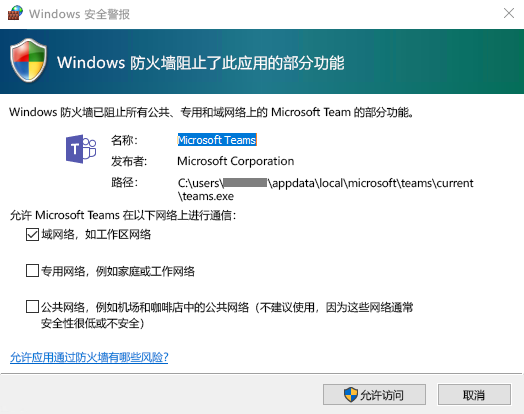
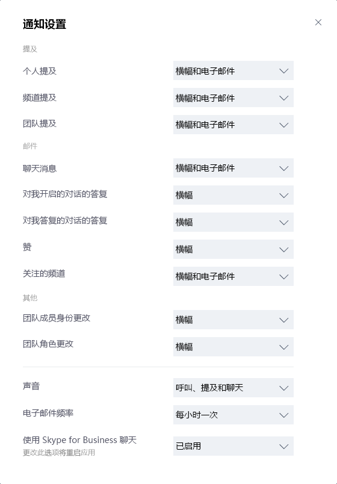

# <a name="get-clients-for-microsoft-teams"></a><span data-ttu-id="03970-103">获取 Microsoft Teams 的客户端</span><span class="sxs-lookup"><span data-stu-id="03970-103">Get clients for Microsoft Teams</span></span> 


<span data-ttu-id="03970-104">Microsoft 团队拥有适用于桌面（Windows、Mac 和 Linux）、web 和移动设备（Android 和 iOS）的客户端。</span><span class="sxs-lookup"><span data-stu-id="03970-104">Microsoft Teams has clients available for desktop (Windows, Mac, and Linux), web, and mobile (Android and iOS).</span></span> <span data-ttu-id="03970-105">这些客户端都要求有活动的 Internet 连接，不支持脱机模式。</span><span class="sxs-lookup"><span data-stu-id="03970-105">These clients all require an active internet connection and do not support an offline mode.</span></span>

> [!NOTE]
> <span data-ttu-id="03970-106">2018年11月29日，您将不再能够使用 microsoft Store 提供的 Microsoft Windows 10 S （预览版）应用程序。</span><span class="sxs-lookup"><span data-stu-id="03970-106">Effective November 29, 2018, you'll no longer be able to use the Microsoft Teams for Windows 10 S (Preview) app, available from the Microsoft Store.</span></span> <span data-ttu-id="03970-107">现在，你可以在运行 Windows 10 S 模式的设备上下载和安装团队桌面客户端。</span><span class="sxs-lookup"><span data-stu-id="03970-107">Instead, you can now download and install the Teams desktop client on devices running Windows 10 S mode.</span></span> <span data-ttu-id="03970-108">若要下载桌面客户端，请[https://teams.microsoft.com/downloads](https://go.microsoft.com/fwlink/?linkid=855754)转到。</span><span class="sxs-lookup"><span data-stu-id="03970-108">To download the desktop client, go to [https://teams.microsoft.com/downloads](https://go.microsoft.com/fwlink/?linkid=855754).</span></span> <span data-ttu-id="03970-109">适用于运行 Windows 10 S 模式的设备尚不支持团队桌面客户端的 MSI 内部版本。</span><span class="sxs-lookup"><span data-stu-id="03970-109">MSI builds of the Teams desktop client are not yet available for devices running Windows 10 S mode.</span></span>
>
> <span data-ttu-id="03970-110">有关 Windows 10 S 模式的详细信息，请参阅[windows 10 的 s 模式简介](https://www.microsoft.com/windows/s-mode)。</span><span class="sxs-lookup"><span data-stu-id="03970-110">For more information about Windows 10 S mode, see [Introducing Windows 10 in S mode](https://www.microsoft.com/windows/s-mode).</span></span> 

## <a name="desktop-client"></a><span data-ttu-id="03970-111">桌面客户端</span><span class="sxs-lookup"><span data-stu-id="03970-111">Desktop client</span></span>

> [!Tip]
> <span data-ttu-id="03970-112">观看以下会话，了解 Windows 桌面客户端的优点、如何规划它以及如何部署它：[团队 Windows 桌面客户端](https://aka.ms/teams-clients)</span><span class="sxs-lookup"><span data-stu-id="03970-112">Watch the following session to learn about the benefits of the Windows Desktop Client, how to plan for it, and how to deploy it: [Teams Windows Desktop Client](https://aka.ms/teams-clients)</span></span>

<span data-ttu-id="03970-113">Microsoft 团队桌面客户端是独立的应用程序，也[可以在 Office 365 专业增强版中使用](https://docs.microsoft.com/deployoffice/teams-install)。</span><span class="sxs-lookup"><span data-stu-id="03970-113">The Microsoft Teams desktop client is a standalone application and is also [available in Office 365 ProPlus](https://docs.microsoft.com/deployoffice/teams-install).</span></span> <span data-ttu-id="03970-114">团队可用于 Windows （7 +）、32位和64位版本、macOS （10.10 +）和 Linux （"格式" 和`.deb` `.rpm` "格式"）。</span><span class="sxs-lookup"><span data-stu-id="03970-114">Teams is available for Windows (7+), both 32-bit and 64-bit versions, macOS (10.10+), and Linux (in `.deb` and `.rpm` formats.).</span></span> <span data-ttu-id="03970-115">在 Windows 上，团队需要 .NET Framework 4.5 或更高版本;如果您没有，团队安装程序将为您提供安装它的功能。</span><span class="sxs-lookup"><span data-stu-id="03970-115">On Windows, Teams requires .NET Framework 4.5 or later; the Teams installer will offer to install it for you if you don't have it.</span></span> <span data-ttu-id="03970-116">在 Linux 上，程序包管理器（如 apt 和 yum）将尝试为你安装任何要求。</span><span class="sxs-lookup"><span data-stu-id="03970-116">On Linux, package managers such as apt and yum will try to install any requirements for you.</span></span> <span data-ttu-id="03970-117">但是，如果不是这样，则需要安装任何报告的要求，然后才能在 Linux 上安装团队。</span><span class="sxs-lookup"><span data-stu-id="03970-117">However, if they don't then you will need to install any reported requirements before installing Teams on Linux.</span></span>

<span data-ttu-id="03970-118">桌面客户端为团队会议、群组通话和私人一对一通话提供实时通信支持（音频、视频和内容共享）。</span><span class="sxs-lookup"><span data-stu-id="03970-118">The desktop clients provide real-time communications support (audio, video, and content sharing) for team meetings, group calling, and private one-on-one calls.</span></span>

<span data-ttu-id="03970-119">[https://teams.microsoft.com/downloads](https://go.microsoft.com/fwlink/?linkid=855754)如果最终用户拥有相应的本地权限（在电脑上安装团队客户端，但在 Mac 上需要管理员权限），则最终用户可以直接下载和安装桌面客户端。</span><span class="sxs-lookup"><span data-stu-id="03970-119">Desktop clients can be downloaded and installed by end users directly from [https://teams.microsoft.com/downloads](https://go.microsoft.com/fwlink/?linkid=855754) if they have the appropriate local permissions (admin rights are not required to install the Teams client on a PC but are required on a Mac).</span></span>

<span data-ttu-id="03970-120">IT 管理员可以选择其首选方法将安装文件分发给组织中的计算机。</span><span class="sxs-lookup"><span data-stu-id="03970-120">IT admins can choose their preferred method to distribute the installation files to computers in their organization.</span></span> <span data-ttu-id="03970-121">一些示例包括 System Center Configuration Manager （Windows）或 Jamf Pro （macOS）。</span><span class="sxs-lookup"><span data-stu-id="03970-121">Some examples include System Center Configuration Manager (Windows) or Jamf Pro (macOS).</span></span> <span data-ttu-id="03970-122">若要获取适用于 Windows 分发的 MSI 程序包，请参阅[使用 Msi 安装 Microsoft 团队](msi-deployment.md)。</span><span class="sxs-lookup"><span data-stu-id="03970-122">To get the MSI package for Windows distribution, see [Install Microsoft Teams using MSI](msi-deployment.md).</span></span>  

> [!NOTE]
> <span data-ttu-id="03970-123">通过这些机制分发客户端仅适用于初次安装 Microsoft Team 客户端，不适用于将来更新。</span><span class="sxs-lookup"><span data-stu-id="03970-123">Distribution of the client via these mechanisms is only for the initial installation of Microsoft Team clients and not for future updates.</span></span>

### <a name="windows"></a><span data-ttu-id="03970-124">Windows</span><span class="sxs-lookup"><span data-stu-id="03970-124">Windows</span></span>

<span data-ttu-id="03970-125">适用于 Windows 的 Microsoft Teams 安装提供 32 位和 64 位体系结构的可下载安装程序。</span><span class="sxs-lookup"><span data-stu-id="03970-125">The Microsoft Teams installation for Windows provides downloadable installers in 32-bit and 64-bit architecture.</span></span>

> [!NOTE]
> <span data-ttu-id="03970-126">Microsoft 团队的体系结构（32位和64位）对安装的 Windows 和 Office 体系结构而言不可知。</span><span class="sxs-lookup"><span data-stu-id="03970-126">The architecture (32-bit vs. 64-bit) of Microsoft Teams is agnostic to the architecture of Windows and Office that is installed.</span></span>

<span data-ttu-id="03970-127">Windows 客户端部署到位于用户配置文件中的 AppData 文件夹中。</span><span class="sxs-lookup"><span data-stu-id="03970-127">The Windows client is deployed to the AppData folder located in the user’s profile.</span></span> <span data-ttu-id="03970-128">部署到用户的本地配置文件后，无需提升的权限即可安装客户端。</span><span class="sxs-lookup"><span data-stu-id="03970-128">Deploying to the user’s local profile allows the client to be installed without requiring elevated rights.</span></span> <span data-ttu-id="03970-129">Windows 客户端利用以下位置：</span><span class="sxs-lookup"><span data-stu-id="03970-129">The Windows client leverages the following locations:</span></span>

- <span data-ttu-id="03970-130">% LocalAppData%\\Microsoft\\团队</span><span class="sxs-lookup"><span data-stu-id="03970-130">%LocalAppData%\\Microsoft\\Teams</span></span>

- <span data-ttu-id="03970-131">% LocalAppData%\\Microsoft\\TeamsMeetingAddin</span><span class="sxs-lookup"><span data-stu-id="03970-131">%LocalAppData%\\Microsoft\\TeamsMeetingAddin</span></span>

- <span data-ttu-id="03970-132">% AppData%\\Microsoft\\团队</span><span class="sxs-lookup"><span data-stu-id="03970-132">%AppData%\\Microsoft\\Teams</span></span>

- <span data-ttu-id="03970-133">% LocalAppData%\\SquirrelTemp</span><span class="sxs-lookup"><span data-stu-id="03970-133">%LocalAppData%\\SquirrelTemp</span></span>

<span data-ttu-id="03970-134">用户首次使用 Microsoft Teams 客户端启动呼叫时，他们可能会注意到有关 Windows 防火墙设置的警告，要求用户允许通信。</span><span class="sxs-lookup"><span data-stu-id="03970-134">When users initiate a call using the Microsoft Teams client for the first time, they might notice a warning with the Windows firewall settings that asks for users to allow communication.</span></span> <span data-ttu-id="03970-135">系统可能会指示用户忽略此消息，因为呼叫将正常工作，即使消除警告时也是如此。</span><span class="sxs-lookup"><span data-stu-id="03970-135">Users might be instructed to ignore this message because the call will work, even when the warning is dismissed.</span></span>



> [!NOTE]
> <span data-ttu-id="03970-137">即使选择“取消”忽略该提示，也将会更改 Windows 防火墙配置。</span><span class="sxs-lookup"><span data-stu-id="03970-137">Windows Firewall configuration will be altered even when the prompt is dismissed by selecting “Cancel”.</span></span> <span data-ttu-id="03970-138">将会创建两条针对 teams.exe 的入站规则，操作是阻止 TCP 和 UDP 协议。</span><span class="sxs-lookup"><span data-stu-id="03970-138">Two inbound rules for teams.exe will be created with Block action for both TCP and UDP protocols.</span></span>

### <a name="mac"></a><span data-ttu-id="03970-139">Mac</span><span class="sxs-lookup"><span data-stu-id="03970-139">Mac</span></span>

<span data-ttu-id="03970-140">通过使用 macOS 计算机的 INSTALLER.PKG 安装文件，Mac 用户可以安装团队。</span><span class="sxs-lookup"><span data-stu-id="03970-140">Mac users can install Teams by using a PKG installation file for macOS computers.</span></span> <span data-ttu-id="03970-141">要安装 Mac 客户端，需要管理权限。</span><span class="sxs-lookup"><span data-stu-id="03970-141">Administrative access is required to install the Mac client.</span></span> <span data-ttu-id="03970-142">MacOS 客户端安装到/Applications 文件夹。</span><span class="sxs-lookup"><span data-stu-id="03970-142">The macOS client is installed to the /Applications folder.</span></span>

#### <a name="install-teams-by-using-the-pkg-file"></a><span data-ttu-id="03970-143">使用 INSTALLER.PKG 文件安装团队</span><span class="sxs-lookup"><span data-stu-id="03970-143">Install Teams by using the PKG file</span></span>

1. <span data-ttu-id="03970-144">从 "[团队下载" 页面](https://teams.microsoft.com/downloads)上的 " **Mac**" 下，单击 "**下载**"。</span><span class="sxs-lookup"><span data-stu-id="03970-144">From the [Teams download page](https://teams.microsoft.com/downloads), under **Mac**, click **Download**.</span></span>
2. <span data-ttu-id="03970-145">双击 "INSTALLER.PKG" 文件。</span><span class="sxs-lookup"><span data-stu-id="03970-145">Double click the PKG file.</span></span>
3. <span data-ttu-id="03970-146">按照安装向导完成安装。</span><span class="sxs-lookup"><span data-stu-id="03970-146">Follow the installation wizard to complete the installation.</span></span>
4. <span data-ttu-id="03970-147">团队将安装到/Applications 文件夹。</span><span class="sxs-lookup"><span data-stu-id="03970-147">Teams will be installed to /Applications folder.</span></span> <span data-ttu-id="03970-148">这是一种计算机范围的安装。</span><span class="sxs-lookup"><span data-stu-id="03970-148">It is a machine-wide installation.</span></span>

> [!NOTE]
> <span data-ttu-id="03970-149">在安装期间，INSTALLER.PKG 将提示输入管理员凭据。</span><span class="sxs-lookup"><span data-stu-id="03970-149">During the installation, the PKG will prompt for admin credentials.</span></span> <span data-ttu-id="03970-150">用户需要输入管理员凭据，无论用户是否为管理员。</span><span class="sxs-lookup"><span data-stu-id="03970-150">The user needs to enter the admin credentials, regardless of whether or not the user is an admin.</span></span>

<span data-ttu-id="03970-151">如果用户当前具有团队的 .DMG 安装，并且想要将其替换为 INSTALLER.PKG 安装，用户应：</span><span class="sxs-lookup"><span data-stu-id="03970-151">If a user currently has a DMG installation of Teams and wants to replace it with the PKG installation, the user should:</span></span>

1. <span data-ttu-id="03970-152">退出 "团队" 应用。</span><span class="sxs-lookup"><span data-stu-id="03970-152">Exit the Teams app.</span></span>
2. <span data-ttu-id="03970-153">卸载 "团队" 应用。</span><span class="sxs-lookup"><span data-stu-id="03970-153">Uninstall the Teams app.</span></span>
3. <span data-ttu-id="03970-154">安装 INSTALLER.PKG 文件。</span><span class="sxs-lookup"><span data-stu-id="03970-154">Install the PKG file.</span></span>

<span data-ttu-id="03970-155">IT 管理员可以使用团队的托管部署将安装文件分发到其组织中的所有 Mac，例如 Jamf Pro。</span><span class="sxs-lookup"><span data-stu-id="03970-155">IT admins can use managed deployment of Teams to distribute the installation files to all Macs in their organization, such as Jamf Pro.</span></span>

> [!NOTE]
> <span data-ttu-id="03970-156">如果您安装 INSTALLER.PKG 时遇到问题，请告知我们。</span><span class="sxs-lookup"><span data-stu-id="03970-156">If you experience issues installing the PKG, let us know.</span></span> <span data-ttu-id="03970-157">在本文末尾的 "**反馈**" 部分中，单击 "**产品反馈**"。</span><span class="sxs-lookup"><span data-stu-id="03970-157">In the **Feedback** section at the end of this article, click **Product feedback**.</span></span>

### <a name="linux"></a><span data-ttu-id="03970-158">厂商</span><span class="sxs-lookup"><span data-stu-id="03970-158">Linux</span></span>

<span data-ttu-id="03970-159">用户将能够安装本机 Linux 程序包`.deb`并`.rpm`设置其格式。</span><span class="sxs-lookup"><span data-stu-id="03970-159">Users will be able to install native Linux packages in `.deb` and `.rpm` formats.</span></span>

> [!NOTE] 
> <span data-ttu-id="03970-160">Linux 客户端上的团队在有限预览版中可用。</span><span class="sxs-lookup"><span data-stu-id="03970-160">The Teams on Linux client is available in limited preview.</span></span> <span data-ttu-id="03970-161">在客户端`Report a Problem`中使用从客户端提交的 bug。</span><span class="sxs-lookup"><span data-stu-id="03970-161">Submit bugs using `Report a Problem` from within the client.</span></span> <span data-ttu-id="03970-162">对于已知问题，请参阅[已知问题](Known-issues.md)。</span><span class="sxs-lookup"><span data-stu-id="03970-162">For known issues, see [Known Issues](Known-issues.md).</span></span>

#### <a name="install-teams-using-deb-package"></a><span data-ttu-id="03970-163">使用 DEB 包程序包安装团队</span><span class="sxs-lookup"><span data-stu-id="03970-163">Install Teams using DEB package</span></span>

1. <span data-ttu-id="03970-164">从https://aka.ms/getteams下载程序包。</span><span class="sxs-lookup"><span data-stu-id="03970-164">Download the package from https://aka.ms/getteams.</span></span> <span data-ttu-id="03970-165">（Linux 客户端处于有限的预览中，即将启动。</span><span class="sxs-lookup"><span data-stu-id="03970-165">(The Linux client is in limited preview and will launch soon.</span></span> <span data-ttu-id="03970-166">如果在 "下载" 页面上看不到 Linux 客户端，则它尚未启动。）</span><span class="sxs-lookup"><span data-stu-id="03970-166">If you don't see the Linux client on the downloads page then it has not launched yet.)</span></span>
2. <span data-ttu-id="03970-167">使用下列操作之一进行安装：</span><span class="sxs-lookup"><span data-stu-id="03970-167">Install using one of the following:</span></span>  
    - <span data-ttu-id="03970-168">打开相关的程序包管理工具，并浏览自行引导的 Linux 应用安装过程。</span><span class="sxs-lookup"><span data-stu-id="03970-168">Open the relevant package management tool and go through the self-guided Linux app installation process.</span></span>
    - <span data-ttu-id="03970-169">或者，如果您喜欢终端，请键入：`sudo apt install **teams download file**`</span><span class="sxs-lookup"><span data-stu-id="03970-169">Or if you love Terminal, type: `sudo apt install **teams download file**`</span></span>

<span data-ttu-id="03970-170">你可以通过活动或通过输入`Teams`通过 "终端" 启动团队。</span><span class="sxs-lookup"><span data-stu-id="03970-170">You can launch Teams via Activities or via Terminal by typing `Teams`.</span></span> 

#### <a name="install-teams-using-rpm-package"></a><span data-ttu-id="03970-171">使用 RPM 程序包安装团队</span><span class="sxs-lookup"><span data-stu-id="03970-171">Install Teams using RPM package</span></span>

1. <span data-ttu-id="03970-172">从https://aka.ms/getteams下载程序包。</span><span class="sxs-lookup"><span data-stu-id="03970-172">Download the package from https://aka.ms/getteams.</span></span> <span data-ttu-id="03970-173">（Linux 客户端处于有限的预览中，即将启动。</span><span class="sxs-lookup"><span data-stu-id="03970-173">(The Linux client is in limited preview and will launch soon.</span></span> <span data-ttu-id="03970-174">如果在 "下载" 页面上看不到 Linux 客户端，则它尚未启动。）</span><span class="sxs-lookup"><span data-stu-id="03970-174">If you don't see the Linux client on the downloads page then it has not launched yet.)</span></span>
2. <span data-ttu-id="03970-175">使用下列操作之一进行安装：</span><span class="sxs-lookup"><span data-stu-id="03970-175">Install using one of the following:</span></span>
    - <span data-ttu-id="03970-176">打开相关的程序包管理工具，并浏览自行引导的 Linux 应用安装过程。</span><span class="sxs-lookup"><span data-stu-id="03970-176">Open the relevant package management tool and go through the self-guided Linux app installation process.</span></span>
    - <span data-ttu-id="03970-177">或者，如果您喜欢终端，请键入：`sudo yum install **teams download file**`</span><span class="sxs-lookup"><span data-stu-id="03970-177">Or if you love Terminal, type: `sudo yum install **teams download file**`</span></span>

<span data-ttu-id="03970-178">你可以通过活动或通过输入`Teams`通过 "终端" 启动团队。</span><span class="sxs-lookup"><span data-stu-id="03970-178">You can launch Teams via Activities or via Terminal by typing `Teams`.</span></span>

## <a name="web-client"></a><span data-ttu-id="03970-179">Web 客户端</span><span class="sxs-lookup"><span data-stu-id="03970-179">Web client</span></span> 

<span data-ttu-id="03970-180">Web 客户端（[https://teams.microsoft.com](https://go.microsoft.com/fwlink/?linkid=855753)）是一种完整的功能客户端，可从各种浏览器使用。</span><span class="sxs-lookup"><span data-stu-id="03970-180">The web client ([https://teams.microsoft.com](https://go.microsoft.com/fwlink/?linkid=855753)) is a full, functional client that can be used from a variety of browsers.</span></span> <span data-ttu-id="03970-181">Web 客户端通过使用 webRTC 支持呼叫和会议，因此在 web 浏览器中不需要使用插件或下载来运行团队。</span><span class="sxs-lookup"><span data-stu-id="03970-181">The web client supports Calling and Meetings by using webRTC, so there is no plug-in or download required to run Teams in a web browser.</span></span> <span data-ttu-id="03970-182">浏览器必须配置为允许第三方 cookie。</span><span class="sxs-lookup"><span data-stu-id="03970-182">The browser must be configured to allow third-party cookies.</span></span> 

[!INCLUDE [browser-support](includes/browser-support.md)]

<span data-ttu-id="03970-183">Web 客户端在连接到[https://teams.microsoft.com](https://go.microsoft.com/fwlink/?linkid=855753)时执行浏览器版本检测。</span><span class="sxs-lookup"><span data-stu-id="03970-183">The web client performs browser version detection upon connecting to [https://teams.microsoft.com](https://go.microsoft.com/fwlink/?linkid=855753).</span></span> <span data-ttu-id="03970-184">如果检测到不受支持的浏览器版本，它将阻止对 web 界面的访问，并建议用户下载桌面客户端或移动应用。</span><span class="sxs-lookup"><span data-stu-id="03970-184">If an unsupported browser version is detected, it will block access to the web interface and recommend that the user download the desktop client or mobile app.</span></span>

## <a name="mobile-clients"></a><span data-ttu-id="03970-185">移动客户端</span><span class="sxs-lookup"><span data-stu-id="03970-185">Mobile clients</span></span>

<span data-ttu-id="03970-186">Microsoft 团队移动应用适用于 Android 和 iOS，并且适用于参与基于聊天的对话的用户和允许对等音频呼叫。</span><span class="sxs-lookup"><span data-stu-id="03970-186">The Microsoft Teams mobile apps are available for Android and iOS, and are geared for on-the-go users participating in chat-based conversations and allow peer-to-peer audio calls.</span></span> <span data-ttu-id="03970-187">对于移动应用，请转到相关的移动应用商店 Google Play 和 Apple App Store。</span><span class="sxs-lookup"><span data-stu-id="03970-187">For mobile apps, go to the relevant mobile stores Google Play and the Apple App Store.</span></span> <span data-ttu-id="03970-188">Windows Phone 应用已于2018年7月20日停用，可能不再有效。</span><span class="sxs-lookup"><span data-stu-id="03970-188">The Windows Phone App was retired July 20, 2018 and may no longer work.</span></span> 

<span data-ttu-id="03970-189">Microsoft Teams 移动应用的支持移动平台如下：</span><span class="sxs-lookup"><span data-stu-id="03970-189">Supported mobile platforms for Microsoft Teams mobile apps are the following:</span></span>

-   <span data-ttu-id="03970-190">**Android**：4.4 或更高版本</span><span class="sxs-lookup"><span data-stu-id="03970-190">**Android**: 4.4 or later</span></span>

-   <span data-ttu-id="03970-191">**iOS**：10.0 或更高版本</span><span class="sxs-lookup"><span data-stu-id="03970-191">**iOS**: 10.0 or later</span></span>

> [!NOTE]
> <span data-ttu-id="03970-192">移动版必须可供公众使用，以便团队能够按预期工作。</span><span class="sxs-lookup"><span data-stu-id="03970-192">The mobile version must be available to the public in order for Teams to work as expected.</span></span>

<span data-ttu-id="03970-193">移动应用仅通过相应的移动平台的应用商店进行分发和更新。</span><span class="sxs-lookup"><span data-stu-id="03970-193">Mobile apps are distributed and updated through the respective mobile platform’s app store only.</span></span> <span data-ttu-id="03970-194">Microsoft 不支持通过 MDM 或加载方传播移动应用。</span><span class="sxs-lookup"><span data-stu-id="03970-194">Distribution of the mobile apps via MDM or side-loading is not supported by Microsoft.</span></span> <span data-ttu-id="03970-195">在受支持的移动平台上安装了移动应用后，只要版本在当前版本的三个月内，就会支持团队移动应用本身。</span><span class="sxs-lookup"><span data-stu-id="03970-195">Once the mobile app has been installed on a supported mobile platform, the Teams Mobile App itself will be supported provided the version is within three months of the current release.</span></span>


| | | |
|---------|---------|---------|
|      |<span data-ttu-id="03970-197">决策点</span><span class="sxs-lookup"><span data-stu-id="03970-197">Decision Point</span></span>         |<span data-ttu-id="03970-198">是否存在阻止用户在其设备上安装合适 Microsoft Teams 客户端的任何限制？</span><span class="sxs-lookup"><span data-stu-id="03970-198">Are there any restrictions preventing users from installing the appropriate Microsoft Teams client on their devices?</span></span>         |
|     |<span data-ttu-id="03970-200">后续步骤</span><span class="sxs-lookup"><span data-stu-id="03970-200">Next Steps</span></span>         |<span data-ttu-id="03970-201">如果贵组织限制软件安装，请确保 Microsoft Teams 不会受到阻止。</span><span class="sxs-lookup"><span data-stu-id="03970-201">If your organization restricts software installation, make sure that process is compatible with Microsoft Teams.</span></span> <span data-ttu-id="03970-202">注意：PC 客户端安装不需要管理权限，但在 Mac 上安装需要。</span><span class="sxs-lookup"><span data-stu-id="03970-202">Note: Admin rights are not required for PC client installation but are required for installation on a Mac.</span></span>         |

## <a name="client-update-management"></a><span data-ttu-id="03970-203">客户端更新管理</span><span class="sxs-lookup"><span data-stu-id="03970-203">Client update management</span></span>

<span data-ttu-id="03970-204">当前，Microsoft Teams 服务会自动更新客户端，无需 IT 管理员干预。</span><span class="sxs-lookup"><span data-stu-id="03970-204">Clients are currently updated automatically by the Microsoft Teams service with no IT administrator intervention required.</span></span> <span data-ttu-id="03970-205">如果有可用更新，客户端将自动下载更新，并且当应用在一段时间内有 idled 时，将开始更新过程。</span><span class="sxs-lookup"><span data-stu-id="03970-205">If an update is available, the client will automatically download the update and when the app has idled for a period of time, the update process will begin.</span></span>

## <a name="client-side-configurations"></a><span data-ttu-id="03970-206">客户端配置</span><span class="sxs-lookup"><span data-stu-id="03970-206">Client-side configurations</span></span>

<span data-ttu-id="03970-207">当前，未提供支持的选项来通过租户管理、PowerShell、组策略对象或注册表配置客户端。</span><span class="sxs-lookup"><span data-stu-id="03970-207">Currently, there are no supported options available to configure the client either through the tenant admin, PowerShell, Group Policy Objects or the registry.</span></span>

## <a name="notification-settings"></a><span data-ttu-id="03970-208">通知设置</span><span class="sxs-lookup"><span data-stu-id="03970-208">Notification settings</span></span>

<span data-ttu-id="03970-209">当前，未提供选项允许 IT 管理员配置客户端通知设置。</span><span class="sxs-lookup"><span data-stu-id="03970-209">There are currently no options available for IT administrators to configure client-side notification settings.</span></span> <span data-ttu-id="03970-210">所有通知选项均由用户设置。</span><span class="sxs-lookup"><span data-stu-id="03970-210">All notification options are set by the user.</span></span> <span data-ttu-id="03970-211">下图概括显示了默认客户端设置。</span><span class="sxs-lookup"><span data-stu-id="03970-211">The figure below outlines the default client settings.</span></span>



## <a name="sample-powershell-script"></a><span data-ttu-id="03970-213">PowerShell 脚本示例</span><span class="sxs-lookup"><span data-stu-id="03970-213">Sample PowerShell Script</span></span>

<span data-ttu-id="03970-214">此示例脚本（需要在已提升的管理员帐户上下文中的客户端计算机上运行）将为在 c:\users. 中找到的每个用户文件夹创建新的入站防火墙规则。</span><span class="sxs-lookup"><span data-stu-id="03970-214">This sample script, which needs to run on client computers in the context of an elevated administrator account, will create a new inbound firewall rule for each user folder found in c:\users.</span></span> <span data-ttu-id="03970-215">当团队发现此规则时，它将阻止团队应用程序在用户第一次从团队发出呼叫时提示用户创建防火墙规则。</span><span class="sxs-lookup"><span data-stu-id="03970-215">When Teams finds this rule, it will prevent the Teams application from prompting users to create firewall rules when the users make their first call from Teams.</span></span> 

```

<#
.Synopsis
   Creates firewall rules for Teams.
.DESCRIPTION
   (c) Microsoft Corporation 2018. All rights reserved. Script provided as-is without any warranty of any kind. Use it freely at your own risks.
   Must be run with elevated permissions. Can be run as a GPO Computer Startup script, or as a Scheduled Task with elevated permissions. 
   The script will create a new inbound firewall rule for each user folder found in c:\users. 
   Requires PowerShell 3.0.
#>

#Requires -Version 3

$users = Get-ChildItem (Join-Path -Path $env:SystemDrive -ChildPath 'Users') -Exclude 'Public', 'ADMINI~*'
if ($users.Length -gt 0)
{
    foreach ($user in $users)
    {
        $progPath = Join-Path -Path $user.FullName -ChildPath "AppData\Local\Microsoft\Teams\Current\Teams.exe"
        if (Test-Path $progPath)
        {
            if (-not (Get-NetFirewallApplicationFilter -Program $progPath -ErrorAction SilentlyContinue))
            {
                $ruleName = "Teams.exe for user $($user.Name)"
                "UDP", "TCP" | ForEach-Object { New-NetFirewallRule -DisplayName $ruleName -Direction Inbound -Profile Domain -Program $progPath -Action Allow -Protocol $_ }
                Clear-Variable ruleName
            }
        }
        Clear-Variable progPath
    }
}

```
