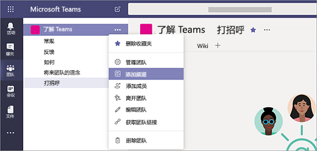
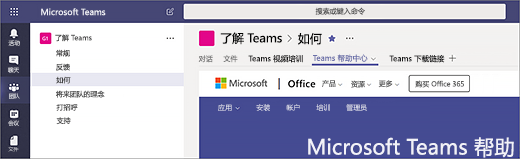

# 在 Microsoft Teams 中创建首批团队和频道Create your first teams and channels in Microsoft Teams

设置和使用你的第一批团队和频道可让你积累 Teams 相关经验，并确定可帮助在整个组织内推动采用 Teams 的支持者。Setting up and using your first set of teams and channels builds your experience with Teams and identifies champions who can help drive Teams adoption across your organization. 如果尚未安装 Teams，请参阅[获取 Teams 客户端](get-clients.md)和[使用新式身份验证登录到 Teams](sign-in-teams.md)。If you haven't installed Teams yet, check out [Get Teams clients](get-clients.md) and [Sign in to Teams using modern authentication](sign-in-teams.md).

## 针对你的第一批团队和频道的建议Suggestions for your first teams and channels

 团队是围绕共同目标聚集在一起的一些人。A team is a collection of people who gather together around a common goal. 频道是团队内完成实际工作的协作空间。Channels are the collaboration spaces within a team where the actual work gets done. 

若要了解详细信息，请参阅 [Teams 中的团队和频道概述](teams-channels-overview.md)以及[在 Teams 中组织团队的最佳做法](best-practices-organizing.md)。To learn more, see [Overview of teams and channels in Teams](teams-channels-overview.md) and [Best practices for organizing teams in Teams](best-practices-organizing.md).

 建议你首先创建一个“了解 Teams”团队，早期采用者可以在该团队中尝试各种操作、询问问题，并发现 Teams 的功能。We suggest you start with a “Get to know Teams” team where your early adopters can play around, ask questions, and discover the capabilities of Teams. 为了在你开始体验 Teams 时取得成功，此团队可能非常重要。This team can be essential to your success as you begin to experiment with Teams. 

### “了解 Teams”团队"Get to know Teams" team
项目团队可以使用“了解 Teams”团队确保他们准备好使用 Teams 客户端、进行一些初始对话，并浏览 Teams 的功能。Your project team can use the “Getting to know Teams” team to ensure they're set up with Teams clients, have some initial conversations, and explore what Teams can do. 你的组织中可能已经有抢先试用过新功能的一群人。You may already have a group of people in your organization who enjoy getting early access to new capabilities. 当你针对这些用户上线产品时，这可能就形成了其最初的团队之一，并将帮助你获得早期反馈。This can be one of their initial teams when you bring them on board and will help you get early feedback.

下面是建议的团队结构。Here's a suggested structure for the team.

| 频道Channel | 说明和用法Description and usage | 固定的选项卡、聊天机器人和应用Pinned tabs, bots, and apps |
| ------------ | -------------------- | -------------------- |
| 常规General | 所有团队都从“常规”频道开始。All teams start with a General channel. 在你开始了解 Teams 时，使用此频道来发布公告。Use this channel to make announcements as you start getting to know Teams. |  |
| 打招呼Say hi | 向团队进行自我介绍，并说出你从 Teams 中获得什么。Introduce yourself to the team and share what you want to get from Teams. |  |
| 如何How do I | 用于提出“操作方法”问题的频道。A channel to ask how-to questions. 步骤 1 - 安装桌面和移动客户端。Step 1 – install the desktop and mobile clients. 步骤 2 – 进入 Teams。Step 2 – jump into Teams.| 链接到 [Teams 帮助中心](https://support.office.com/teams)的固定选项卡Pinned tab that links to the [Teams help center](https://support.office.com/teams) 链接到 [Teams 培训视频](https://support.office.com/article/microsoft-teams-video-training-4f108e54-240b-4351-8084-b1089f0d21d7)的固定选项卡Pinned tab that links to [Teams training videos](https://support.office.com/article/microsoft-teams-video-training-4f108e54-240b-4351-8084-b1089f0d21d7) 链接到 [Teams 桌面和移动客户端下载链接](https://teams.microsoft.com/downloads)的固定选项卡Pinned tab that links to [Teams desktop and mobile client download links](https://teams.microsoft.com/downloads) |
| 反馈Feedback | 分享有关你的 Teams 体验的看法。Share your thoughts on your Teams experiences. | 包含投票的固定选项卡Pinned tab with Polly Poll|
| 将来团队的理念Ideas for future teams | 分享你对 Teams 可在组织中的何处带来附加价值的看法。Share your thoughts on where Teams can drive additional value in your organization. 可以将这些团队称之为什么？What could these teams be called? 谁将成为成员？Who would be members? ||
| 支持Support | 如果某些功能未按预期方式工作，请使用此频道来获得帮助。If something isn't working as expected, use this channel to get help. ||

## 启动并运行你的第一批团队Get your first teams up and running
作为管理员，你可以在 Teams 客户端或 Microsoft Teams 管理中心中创建和管理团队及频道。As an admin, you can create and manage teams and channels in the Teams client or the Microsoft Teams admin center. 可将团队创建为公共团队或私有团队。You can create teams as public or private. 你也可以创建[组织范围团队](create-an-org-wide-team.md)。You can also create an [org-wide team](create-an-org-wide-team.md). 组织中使用 Teams 的任何人都可加入公共团队。Anyone using Teams in your organization can join a public team. 对于私有团队，团队所有者可管理团队成员身份。For private teams, team owners manage team membership. 对于组织范围团队，会自动添加组织中的每个人。And for an org-wide team, everyone in your organization is automatically added. 

若要开始，我们建议你创建私有团队，并添加另一个所有者来管理团队设置和成员身份。To get started, we recommend you create private teams and add another owner to manage team settings and membership. 

> [!NOTE]
> 在后面的步骤中，我们使用 Teams 桌面客户端来创建团队和频道。In the steps that follow, we use the Teams desktop client to create teams and channels. 请记住，作为管理员，你还可以在 Microsoft Teams 管理中心中执行这些任务。Keep in mind that as an admin, you can also do these tasks in the Microsoft Teams admin center.

### 创建团队Create a team

在 Teams 的左侧, 单击“**团队**”，在团队列表底部单击“**加入或创建团队**”，然后单击“**创建新团队**”。On the left side of Teams, click **Teams**, at the bottom of the teams list, click **Join or create a team**, and then click **Create a new team**.

创建团队后，邀请人加入其中。Once you've created the team, invite people to join it. 可以添加单个用户、 组，甚至可添加整个联系人组 （以前称为“通讯组列表”）。You can add individual users, groups, and even entire contact groups (formerly known as "distribution lists"). 

Screen shot of an example Get to know Teams team, showing the team name and description 

### 添加团队所有者Add a team owner
找到你创建的团队，单击“**更多选项˙˙˙**” > “**管理团队**”。Find the team that you created, click **More options ˙˙˙** > **Manage team**. 然后转到“**成员**”选项卡。找到想要指定为团队所有者的人。Then go to the **Members** tab. Find the people you want to designate as team owners. 在“**角色**”下，单击“**所有者**”。Under **Role**, click **Owner**.

### 在团队中创建频道Create a channel in a team
找到你创建的团队，单击“**更多选项˙˙˙**” > “**添加频道**”。Find the team that you created, click **More options ...** > **Add channel**. 也可以单击“**管理团队**”，并在“**频道**”选项卡中添加频道。You can also click **Manage team** and add a channel in the **Channels** tab. 

 

为频道指定一个描述性名称，让用户能够更轻松地了解该频道的用途。Give the channel a descriptive name to make it easier for users to understand the purpose of the channel. 

作为团队所有者，你可以为整个团队自动收藏频道，让团队中的每个人可以更容易看到这些频道。As a team owner, you can automatically favorite channels for the whole team, making the channels more visible for everyone on the team. 你也可以将选项卡固定到频道来添加工具（例如 OneNote）、网页链接和其他内容，方便用户找到所需的内容和分享想法。You can also pin tabs to the channel to add tools, such as OneNote, links to webpages, and other content to make it easy for users to find what they need and share their thoughts.  

下面是“了解 Teams”团队中的“如何”频道的示例，显示链接到 Teams 网页的固定选项卡 &ndash; Teams 视频培训、Teams 帮助中心和 Teams 下载链接。Here's an example of the "How do I" channel in the "Get to know Teams" team, showing pinned tabs that link to Teams webpages &ndash; Teams video training, Teams help center, and Teams download links. 

 

## 后续步骤Next steps
转到[为早期采用者上线产品](get-started-with-teams-onboard-early-adopters.md)。Go to [Onboard your early adopters](get-started-with-teams-onboard-early-adopters.md).
