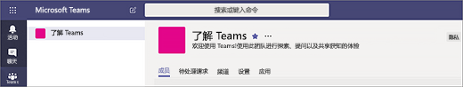

# 在 Microsoft 团队中创建第一个团队和通道Create your first teams and channels in Microsoft Teams

设置和使用您的团队和频道的第一组生成您的体验与团队并标识拥护者可帮助您的组织内的驱动器团队应用。Setting up and using your first set of teams and channels builds your experience with Teams and identifies champions who can help drive Teams adoption across your organization. 

## 建议您的第一个团队和频道Suggestions for your first teams and channels

 团队是人员的收集在一起共同目标周围的集合。A team is a collection of people who gather together around a common goal. 频道是完成的实际工时获取其中的团队中的协作空格。Channels are the collaboration spaces within a team where the actual work gets done. 

若要了解详细信息，请参阅[工作组和团队中的通道的概述](teams-channels-overview.md)和[最佳做法来组织工作组中的团队](best-practices-organizing.md)。To learn more, see [Overview of teams and channels in Teams](teams-channels-overview.md) and [Best practices for organizing teams in Teams](best-practices-organizing.md).

 我们建议您与您前期应用播放、 提出问题，以及发现团队的功能的"获取了解团队"工作组开始。We suggest you start with a “Get to know Teams” team where your early adopters can play around, ask questions, and discover the capabilities of Teams. 此团队可以是在您开始试验团队对您的成功基本。This team can be essential to your success as you begin to experiment with Teams. 

### "获取了解团队"团队"Get to know Teams" team
项目团队可以使用"入门了解团队"团队以确保您设置与团队的客户端，有一些出色的初始对话，并浏览团队可以执行的操作。Your project team can use the “Getting to know Teams” team to ensure they're set up with Teams clients, have some great initial conversations, and explore what Teams can do. 您可能已经享受获取的新功能的及早访问您的组织中人员的组。You may already have a group of people in your organization who enjoy getting early access to new capabilities. 使其参与，并将帮助您要立即开始获取反馈时，这可以是其初始团队之一。This can be one of their initial teams when you bring them on board, and will help you to immediately start getting feedback.

下面是团队建议的结构。Here's a suggested structure for the team.

| 频道Channel | 说明和使用情况Description and usage | 固定的选项卡、 bot 和应用程序Pinned tabs, bots, and apps |
| ------------ | -------------------- | -------------------- |
| 常规General | 所有团队都开头的常规通道。All teams start with a General channel. 使用此通道您开始了解团队进行通知。Use this channel to make announcements as you start getting to know Teams. |  |
| 说劫持Say hi | 介绍您自己与团队和共享您想要获得团队。Introduce yourself to the team and share what you want to get from Teams. |  |
| 如何实现？How do I ? | 操作方法提问频道。A channel to ask how-to questions. 步骤 1 – 安装桌面和移动客户端。Step 1 – install the desktop and mobile clients. 步骤 2 – 跳转到团队。Step 2 – jump into Teams.| 链接到[团队帮助中心](https://support.office.com/teams)的固定选项卡Pinned tab that links to the [Teams help center](https://support.office.com/teams) 链接到[团队培训视频](https://support.office.com/article/microsoft-teams-video-training-4f108e54-240b-4351-8084-b1089f0d21d7)的固定选项卡Pinned tab that links to [Teams training videos](https://support.office.com/article/microsoft-teams-video-training-4f108e54-240b-4351-8084-b1089f0d21d7) 链接到[团队桌面和移动客户端下载链接](https://teams.microsoft.com/downloads)的固定选项卡Pinned tab that links to [Teams desktop and mobile client download links](https://teams.microsoft.com/downloads) |
| 反馈Feedback | 共享您的想法团队体验。Share your thoughts on your Teams experiences. | 固定选项卡与 Polly 投票Pinned tab with Polly Poll|
| 将来团队的想法Ideas for future teams | 共享您的想法在其中团队可以在组织中驱动器额外的值。Share your thoughts on where Teams can drive additional value in your organization. 什么无法这些团队调用？What could these teams be called? 谁将成员？Who would be members? ||
| 支持Support | 如果内容未按预期方式工作，，使用此通道获取帮助。If something isn't working as expected, use this channel to get help. ||

## 让您的第一个团队，启动并运行Get your first teams up and running
作为一名管理员，您可以创建和管理团队和团队客户端或 Microsoft 团队和 Skype 的业务管理中心中的通道。As an admin, you can create and manage teams and channels in the Teams client or the Microsoft Teams & Skype for Business Admin Center. 您可以为公共或专用创建团队。You can create teams as public or private. 您还可以创建一个组织范围团队。You can also create an org-wide team. 在组织中使用团队的任何人都可以加入公共团队。Anyone using Teams in your organization can join a public team. 对于专用团队，团队所有者管理团队成员资格。For private teams, team owners manage team membership. 和组织范围团队，您的组织中的每个人会自动添加。And for an org-wide team, everyone in your organization is automatically added. 

若要开始，我们建议您创建专用团队并添加另一个所有者管理团队设置和成员身份。To get started, we recommend you create private teams and add another owner to manage team settings and membership. 

> [!NOTE]
> 在遵循的步骤，我们使用团队桌面客户端创建团队和频道。In the steps that follow, we use the Teams desktop client to create teams and channels. 请记住，作为一名管理员，您还可以执行这些任务中的 Microsoft 团队业务管理中心的 Skype。Keep in mind that as an admin, you can also do these tasks in the Microsoft Teams & Skype for Business Admin Center.

### 创建团队Create a team

在工作组的左侧，单击**团队**，，然后团队列表的底部，单击**加入或创建工作组**。On the left side of Teams, click **Teams**, and then at the bottom of the teams list, click **Join or create a team**. 在**创建工作组**平铺上，单击**创建工作组**。On the **Create a team** tile, click **Create team**.

从此处，命名您的团队、 添加说明，并设置隐私。From here, name your team, add a description, and set the privacy. 包含了邀请其他人加入团队。After you've done that, invite people to join the team. 您可以添加单个用户、 组和甚至整个联系人组 （之前被称为"通讯组列表"）。You can add individual users, groups, and even entire contact groups (formerly known as "distribution lists"). 

 

### 添加团队的所有者Add a team owner
找到您创建的团队、**更多选项 ˙˙˙** > **管理团队**。Find the team that you created, click **More options ˙˙˙** > **Manage team**. 然后，转到**成员**选项卡找到要指定为团队所有者，然后单击**角色**下的**所有者**的用户。Then go to the **Members** tab. Find the user or users you want to designate as team owner, and then under **Role**, click **Owner**.

### 团队中创建通道Create a channel in a team
找到您创建的团队、**更多选项 ˙˙˙** > **添加通道**。Find the team that you created, click **More options ˙˙˙** > **Add channel**. 您还可以单击**管理团队**，**通道**选项卡中添加信道。You can also click **Manage team** and add a channel in the **Channels** tab. 

 

授予该频道可以让用户了解的内容在进入频道对话存在以实现更方便的描述性名称。Give the channel a descriptive name to make it easier for users to understand what the conversation in the channel is there to achieve. 

作为团队所有者，您可以自动最喜爱的通道，整个团队，使团队的成员的每个人的通道更可见。As a team owner, you can automatically favorite channels for the whole team, making the channels more visible for everyone on the team. 您还可以锁定为频道添加 OneNote 之类的工具选项卡或网页和其他内容，以使用户可以方便地找到所需信息的链接和共享自己的想法。You can also pin tabs to the channel to add tools like OneNote or links to webpages and other content to make it easy for users to find what they need and share their thoughts.  

下面是一个示例中的"获取了解团队"团队"如何实现"通道的、 固定显示 tabs 团队网页的链接&ndash;团队视频培训、 团队帮助中心和团队下载的链接。Here's an example of the "How do I" channel in the "Get to know Teams" team, showing pinned tabs that link to Teams webpages &ndash; Teams video training, Teams help center, and Teams download links. 

 

## 后续步骤Next steps
转到[Onboard 您前期应用](get-started-with-teams-onboard-early-adopters.md)。Go to [Onboard your early adopters](get-started-with-teams-onboard-early-adopters.md).
