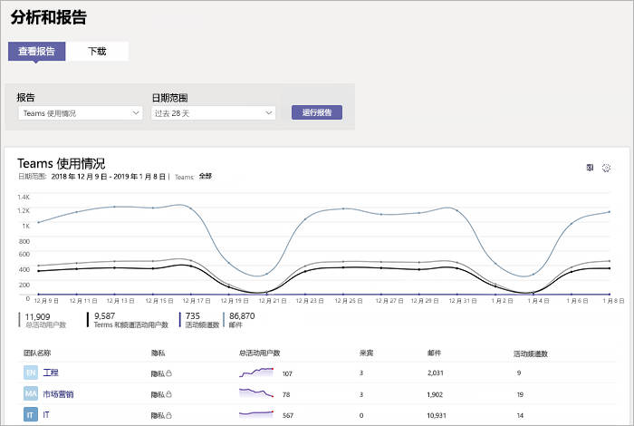
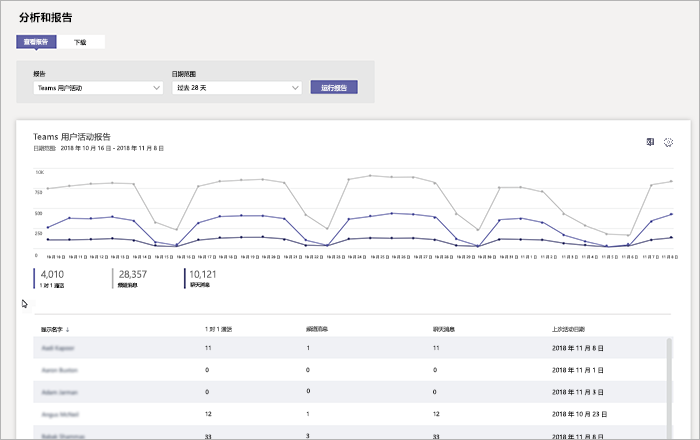

# 在 Microsoft Teams 中监视使用情况和反馈
了解用户使用 Teams 的情况以及他们对 Teams 的体验非常重要。 使用情况报告可以帮助你更好地了解使用模式，并且连同用户反馈一起，为你提供相关见解来了解更广泛的部署以及在何处设置培训和通信工作的优先级。

## 监视使用情况
对于第一组团队，我们建议一周查看报告两次来了解新兴趋势。 

例如，使用情况报告显示没有很多用户在使用 Teams 移动客户端。 这可能表示用户不确定如何安装客户端。 在频道中发布分步安装说明可以帮助推动使用更广泛的客户端。 或者，使用情况报告显示用户主要使用 Teams 进行私人聊天。 在此示例中，你可能需要审阅团队方案，因为用户在设置的初始团队和频道外部聊天。 

下面介绍如何获取报告来查看 Teams 使用情况。 

### Teams 分析和报告（Microsoft Teams 管理中心）

Microsoft Teams 管理中心中的 Teams 报告能让你了解组织中 Teams 的使用情况。 使用这些报告来了解组织中的 Teams 使用情况、用户活动和设备使用情况。 

若要查看这些报告，你必须是 Microsoft 365 或 Office 365 中的全局管理员、Teams 服务管理员或 Skype for Business 管理员。转到 Microsoft Teams 管理中心，在左侧导航栏中，选择“ **分析和报告** ”，然后在“ **报告** ”下选择想要运行的报告。

- **Teams 使用情况报告** ：此报告提供 Teams 中使用情况活动的概览，其中包括活跃用户和频道总数，以及每个团队中活跃用户和频道、来宾和消息的数量。 

         
- **Teams 用户活动报告** ：此报告使你能深入了解用户参与的活动类型，例如多少人通过一对一通话、频道消息和私人聊天消息进行通信。 

     
`
- **Teams 设备使用情况报告** ：此报告显示用户连接到 Teams 的方式，包括有多少人在外出时在其移动设备上使用 Teams。 

    

若要了解详细信息，请参阅 [Teams 分析和报告](teams-analytics-and-reports/teams-reporting-reference.md)。 

### Teams 活动报告（Microsoft 365 管理中心）
你还可以通过 Microsoft 365 管理中心提供的报告查看 Teams 活动。 这些报告是 Microsoft 365 管理中心中 Microsoft 365 报告的一部分，提供有关用户活动和设备使用情况的信息。 

若要查看这些报告，请转到 Microsoft 365 管理中心，单击“ **报告** ” > “ **使用情况** ”。 在“ **选择报告** ”下，单击“ **Microsoft Teams** ”。 从这里选择要查看的报告。

若要了解详细信息，请转到 [使用 Teams 活动报告](teams-activity-reports.md)。

### Microsoft 365 使用情况分析

可以使用 Power BI 中的 Microsoft 365 使用情况分析来查看和分析 Teams 及其他 Microsoft 365 或 Office 365 产品和服务的使用情况数据。 Microsoft 365 使用情况分析是一个内容包，其中包括一个预建的仪表板以及一些预建的报告。 每个报告都提供具体的使用情况数据和见解。 若要连接到该内容包，你需要 Power BI，并且必须是 Microsoft 365、Office 365 或报告阅读器中的全局管理员。 如果还没有 Power BI，请[注册免费的 Power BI 服务](https://powerbi.microsoft.com)。 

若要了解详细信息，请参阅[启用 Microsoft 365 使用情况分析](https://support.office.com/article/Microsoft-365-usage-analytics-77ff780d-ab19-4553-adea-09cb65ad0f1f)。 

## 收集反馈
采用新的协作体验将会改变用户的行为。 实现改变需要培训、鼓励和正面示例。 让用户在过渡到 Teams 的过程中提出意见并能够毫不隐瞒地分享体验非常重要。 我们建议使用你创建的“了解 Teams”团队中的“反馈”频道来收集和解决用户根据其 Teams 体验提出的反馈。 

## 后续步骤
转到[获取资源以规划组织范围的 Microsoft Teams 部署](get-started-with-teams-resources-for-org-wide-rollout.md)。
