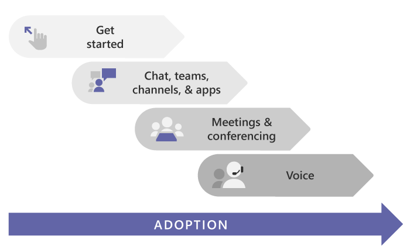

# 开始使用 Microsoft TeamsGet started with Microsoft Teams

> [!TIP]
> 想了解如何在电脑或移动设备上安装 Teams 客户端的信息？Are you looking for information on how to install the Teams client on your PC or mobile device? 请转到此处： [下载 Microsoft Teams](https://www.microsoft.com/microsoft-teams/download-app)。Go here: [Download Microsoft Teams](https://www.microsoft.com/microsoft-teams/download-app).

## 从这里开始Start here

不管是小型企业还是跨国企业，都可以通过入门来开始部署 Teams。Whether you're a small business or a multi-national, this is the place to start rolling out Teams. 以下文章将指导你完成小规模的 Teams 推出，如果你是小型企业，或者如果你正在快速推出 Teams 作为你的第一个 Microsoft 365 工作负荷来支持 **远程工作者**。These articles will guide you through a small-scale Teams rollout, which may be all you need if you're a small business or if you're rolling out Teams quickly as your first Microsoft 365 workload to support **remote workers**.

如果你是一家更大的组织，请使用这些文章来通过一小组早期采用者来试点 Teams，以便你可以了解 Teams 并开始在组织范围内进行部署。If you're a larger organization, use these articles to pilot Teams with a small group of early adopters so you can learn about Teams and start planning your org-wide deployment. 以后，使用 Microsoft Teams [采用](https://adoption.microsoft.com/microsoft-teams/#get-started) 网站的指南，帮助你在组织中推广 Teams。Later, use the guidance on the [Microsoft Teams Adoption](https://adoption.microsoft.com/microsoft-teams/#get-started) site to help you roll out Teams across your organization.

我们建议在组织做好准备时按工作负载分阶段部署 Teams。We recommend rolling out Teams in stages, workload by workload, as your organization is ready. **不必等到完成了一个步骤才开始下一个步骤。****You don't have to wait until you've completed one step before you move to the next.** 某些组织可能想要一次推出所有 Teams 功能，而其他组织可能喜欢采用分阶段的方法。Some organizations may want to roll out all Teams features at once, while others may prefer a phased approach. 下面是按我们的建议部署顺序列出的 Teams 工作负载：Here are the Teams workloads, in the order we recommend rolling them out:

- [聊天、团队、频道和应用Chat, teams, channels, & apps](deploy-chat-teams-channels-microsoft-teams-landing-page.md)
- [会议Meetings & conferencing](deploy-meetings-microsoft-teams-landing-page.md)
- [云语音Cloud voice](cloud-voice-landing-page.md)

如果你有一个中等或大型组织， [使用 Teams 顾问帮助你推出 Microsoft Teams](use-advisor-teams-roll-out.md) ，以帮助你计划在组织中推出这些工作负载。If you have a medium or large organization, [use Advisor for Teams to help you roll out Microsoft Teams](use-advisor-teams-roll-out.md) to help you plan the rollout of these workloads across your organization. 顾问使用 Teams 本身创建计划任务并将其分配给所有者、共享文档，并可实现整个部署团队的讨论。The Advisor uses Teams itself to create a plan tasks and assign them to owners, share documents, and enable discussions amongst your deployment team.

## 确保你已准备就绪Make sure you're ready

为准备好进行 Teams 部署，可在下面了解你需要执行哪些操作、Teams 是你在现有 Microsoft 365 或 Office 365 部署中的第一个工作负载（“Teams 第一”）还是下一个工作负载：To get ready for your Teams rollout, here's what you need to do, whether Teams is your first workload ("Teams First") or the next workload in an existing Microsoft 365 or Office 365 deployment:

- [为 Teams 准备贵组织的网络Prepare your organization's network for Teams](prepare-network.md)
  - 这包括配置 Microsoft 365 或 Office 365 域、SharePoint Online、Exchange Online 和 OneDrive for Business。This includes configuring your Microsoft 365 or Office 365 domain, SharePoint Online, Exchange Online, and OneDrive for Business.

- 为每个人获得 Teams 许可证。Get Teams licenses for everybody. 查看 [Teams 计划](https://www.microsoft.com/microsoft-365/microsoft-teams/compare-microsoft-teams-options)和 [Microsoft Teams 服务说明](https://docs.microsoft.com/office365/servicedescriptions/teams-service-description)。Check out [Teams plans](https://www.microsoft.com/microsoft-365/microsoft-teams/compare-microsoft-teams-options) and [Microsoft Teams service description](https://docs.microsoft.com/office365/servicedescriptions/teams-service-description).

- [了解安装桌面、网页和移动版客户端的好处Learn about the benefits of installing the desktop, web, and mobile clients](get-clients.md)

## 熟悉 TeamsGet familiar with Teams

如果不熟悉 Teams，熟悉它最好的方法就是立即开始使用它。If you're new to Teams, the best way to get familiar with it is to start using it right away. Teams 的出色的功能是，现在设置的方式不会影响以后需要执行的任何升级或迁移。The great thing about Teams is that what you set up now won't get in the way of any upgrades or migrations you might need to do later.

> [!TIP]
> 查看 Microsoft Learning for Teams [中可用的学习路径](/learn/teams/)。Check out the learning paths and modules available in [Microsoft Learn for Teams](/learn/teams/). 可以浏览 [Teams 管理中心](https://docs.microsoft.com/learn/modules/m365-teams-navigate-admin-portal/)，了解如何 [为 Teams](/learn/modules/m365-teams-connectivity/)配置网络，了解如何最好地为 [将用户载入到 Teams](/learn/modules/m365-teams-onboard-users/)等！You can get a tour of the [Teams admin center](https://docs.microsoft.com/learn/modules/m365-teams-navigate-admin-portal/), learn how to [configure your network for Teams](/learn/modules/m365-teams-connectivity/), get ideas on how to best [onboard your users to Teams](/learn/modules/m365-teams-onboard-users/), and more!

使用以下步骤来设置一些团队并加入一些早期采用者，以帮助你熟悉 Teams。Use the steps below to set up a couple teams and onboard a few early adopters to help you get familiar with Teams.

- 步骤 1：[创建你的第一批团队和频道](get-started-with-teams-create-your-first-teams-and-channels.md)Step 1: [Create your first teams and channels](get-started-with-teams-create-your-first-teams-and-channels.md)
- 步骤 2：[为早期采用者上线产品](get-started-with-teams-onboard-early-adopters.md)Step 2: [Onboard early adopters](get-started-with-teams-onboard-early-adopters.md)
- 步骤 3：[监视使用情况和反馈](get-started-with-teams-monitor-usage-and-feedback.md)Step 3: [Monitor usage and feedback](get-started-with-teams-monitor-usage-and-feedback.md)
- 步骤 4： [开始在组织中推出](get-started-with-teams-resources-for-org-wide-rollout.md)Step 4: [Start your organization-wide rollout](get-started-with-teams-resources-for-org-wide-rollout.md)

## 从 Skype for Business 升级或迁移Upgrade or migrate from Skype for Business

如果即将通过 Skype for Business（联机或本地）访问 Teams，或者需要混合配置，仍可按照以上建议路径部署 Teams，但首先需执行一些额外规划。If you're coming to Teams from Skype for Business (online or on premises), or if you need a hybrid configuration, you still want to follow the recommended path above for a Teams deployment, but first you need to do some extra planning. 首先查看下表中适用于贵组织情况的指引。Start by reviewing the guidance in the table below that applies to your organization's profile.

|  |贵组织的情况Your organization's profile|指引Guidance  |
|---------|---------|---------|
||我当前正在使用 Skype for Business Online，并准备转移到 Teams。I'm currently using Skype for Business Online, and I'm ready to move to Teams. |转到[升级到 Teams](upgrade-start-here.md)。Go to [Upgrade to Teams](upgrade-start-here.md).        |
||我的组织正在运行 Skype for Business Server，并且我想要部署 Teams。My organization is running Skype for Business Server, and I want to roll out Teams. |要全面推广 Teams，首先需要配置预置环境和 Microsoft 365 之间的混合连接。从阅读[ Skype for Business Server 与 Microsoft 365或Office 365之间的混合连接计划](https://docs.microsoft.com/skypeforbusiness/hybrid/plan-hybrid-connectivity)开始。For a full-scale Teams rollout, first you need to configure hybrid connectivity between your on-premises environment and Microsoft 365. Start by reading [Plan hybrid connectivity between Skype for Business Server and Microsoft 365 or Office 365](https://docs.microsoft.com/skypeforbusiness/hybrid/plan-hybrid-connectivity).   你还应查看[升级到 Teams](upgrade-start-here.md)。You should also review [Upgrade to Teams](upgrade-start-here.md).   |
||我没有 Skype for Business Server，但具有本地公用电话交换网 （PSTN） 解决方案。I don't have Skype for Business Server, but I do have an on-premises Public Switched Telephone Network (PSTN) solution. 我想要部署 Teams，但希望保留本地 PSTN 解决方案。I want to roll out Teams, but I want to keep my on-premises PSTN solution. |按照本文中的建议推出 Teams。Roll out Teams following  the suggestions in this article.  然后阅读[规划直接路由](direct-routing-plan.md)，了解如何使用电话系统直接路由将本地 PSTN 解决方案连接到 Teams。Then read [Plan Direct Routing](direct-routing-plan.md) to learn about using Phone System Direct Routing to hook up your on-premises PSTN solution with Teams.|
