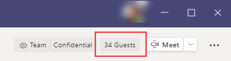

# Teams 中的来宾体验

当来宾受邀加入团队时，他们将收到欢迎电子邮件。 此消息包含有关团队的一些信息，以及成为成员后期望获得的信息。 来宾必须接受邀请，在电子邮件中选择"打开 **Microsoft Teams"，** 然后他们才能访问团队及其频道。
    

    
所有团队成员将在频道线索中看到一条消息，告知团队所有者添加了来宾并提供该来宾的姓名。 团队中的所有人都可以轻松识别谁是来宾。 频道线程右上角的标记指示团队中的来宾数， (来宾) **标签显示在** 每个来宾的姓名旁边。

查看以下有关 Teams 中的来宾体验的视频：
- [作为来宾加入团队](https://support.office.com/article/join-a-team-as-a-guest-928d1eef-61e2-49ec-b754-c2fe86b34824)
- [与来宾一起加入 Teams 会议](https://support.office.com/article/join-a-company-meeting-a120c282-063d-46b8-b973-851197ab75d8)

## 团队成员和来宾功能的比较

下表比较了可供组织的团队成员及其来宾使用的团队功能。 Teams 管理员控制来宾可用的功能。

| Teams 中的功能 | 组织中的 Teams 用户 | 来宾 |
|:-----|:-----|:-----|
|创建通道     *团队所有者控制此设置。*    |&#x2713;|&#x2713;|
|参与私人聊天    |&#x2713;|&#x2713;|
|参与频道对话    |&#x2713;|&#x2713;|
|发布、删除和编辑消息    |&#x2713;|&#x2713;|
|共享频道文件    |&#x2713;|&#x2713;|
|访问 SharePoint 文件  |&#x2713;|&#x2713;|
|附加文件  |&#x2713;|仅团队聊天|
|下载私人聊天文件  |&#x2713;|&#x2713;|
|在文件中搜索  |&#x2713;||
|共享聊天文件    |&#x2713;||
|添加应用（选项卡、聊天机器人或连接器）    |&#x2713;||
|创建会议或访问计划    |&#x2713;||
|访问 OneDrive for Business 存储    |&#x2713;||
|创建租户范围和团队/频道来宾访问策略    |&#x2713;||
|邀请 Microsoft 365 或 Office 365 组织的域外部的用户    *团队所有者控制此设置。*      |&#x2713;||
|创建团队    |&#x2713;||
|发现和加入公用团队    |&#x2713;||
|查看组织结构图    |&#x2713;||
|使用内联翻译    |&#x2713;||
|成为团队所有者    |&#x2713;||

下表显示了与其他类型的用户相比，来宾可用的呼叫和会议功能。

| 呼叫功能 | 来宾 | E1 和 E3 用户 | E5 和 企业语音 用户 |
| --------------- | ----- | -------------- | -------------- |
| VOIP 呼叫 | 是 | 是 | 是 |
| 群组通话 | 是 | 是 | 是 |
| 受支持的核心通话控件（保留、静音、打开/关闭视频、屏幕共享） | 是 | 是 | 是 |
| 转接目标 | 是 | 是 | 是 |
| 电话可转接 | 是 | 是 | 是 |
| 可协商转接 | 是 | 是 | 是 |
| 可通过 VOIP 将其他用户添加到通话中 | 是 | 是 | 是 |
| 可通过电话号码将用户添加到通话中 | 否 | 否 | 是 |
| 转发目标 | 否 | 是 | 是 |
| 通话群组目标 | 否 | 是 | 是 |
| 未应答目标 | 否 | 是 | 是 |
| 可为联合呼叫的目标 | 否 | 是 | 是 |
| 可进行联合呼叫 | 否 | 是 | 是 |
| 可立即转发其呼叫 | 否 | 否 | 是 |
| 拨打时可同时响铃 | 否 | 否 | 是 |
| 可路由未应答的通话 | 否 | 否 | 是 |
| 漏接来电可转到语音邮件 | 否 | 否1 |是 |
| 具有可接听电话的电话号码 | 否 | 否 | 是 |
| 可拨打电话号码 | 否 | 否 | 是 |
| 可访问呼叫设置 | 否 | 否 | 是 |
| 可更改语音邮件问候语 | 否 | 否1 | 是 |
| 可更改铃声 | 否 | 否  | 是 |
| 支持 TTY | 否 | 否 | 是 |
| 可具有委派 | 否 | 否 | 是 |
|  可为代理 | 否 | 否 | 是 |

1即将推出此功能。

> [!NOTE]
> Azure AD **(** Azure AD) Azure Active Directory 中的来宾用户访问限制策略确定目录中来宾的权限。 有三种政策选择。
>  - "**来宾用户拥有与成员（最包容）相同的访问权限**"设置表示来宾与目录中的普通用户一样具有相同的目录数据访问权限。
>  - "**来宾用户对目录对象的属性和成员身份拥有有限的访问权限** "设置表示来宾对某些目录任务没有权限，如枚举用户、组或其他使用 Microsoft Graph的目录资源。
>  - "**来宾用户访问权限仅限于其自己的目录对象属性和成员身份（最严格）**"设置表示来宾仅可访问自己的目录对象。
>
>要了解详细信息，请参阅[Azure Active Directory 中的默认用户权限是什么？?](/azure/active-directory/fundamentals/users-default-permissions)

## 相关主题

[将组织保留为来宾](/azure/active-directory/b2b/leave-the-organization)