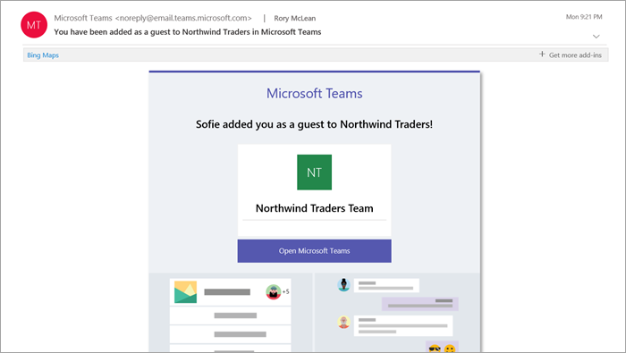

来宾体验介绍What the guest experience is like
=================================

当来宾被邀请加入团队时，他们将收到欢迎电子邮件。When a guest is invited to join a team, they receive a welcome email message. 此消息包括有关团队的一些信息，以及现在所期望的成员。This message includes some information about the team and what to expect now that they're a member. 来宾必须先通过在电子邮件中选择 "**打开 Microsoft 团队**" 来接受邀请，然后才能访问团队及其频道。The guest must accept the invitation by selecting **Open Microsoft Teams** in the email message before they can access the team and its channels.
    

    
所有团队成员将在频道线索中看到一条消息，告知团队所有者添加了来宾并提供该来宾的姓名。All team members see a message in the channel thread announcing that the team owner has added a guest and providing the guest's name. 团队中的所有人都可以轻松识别谁是来宾。Everyone on the team can identify easily who is a guest. 如以下示例团队的屏幕截图所示，横幅指示 "此团队拥有来宾"，并且每个来宾的名称旁边显示一个 **（来宾）** 标签。As shown in the following screenshot of a sample team, a banner indicates "This team has guests" and a **(Guest)** label appears next to each guest's name.
    

查看有关团队中的来宾体验的这些视频：Check out these videos about the guest experience in Teams:
- [作为来宾加入团队Join a team as a guest](https://support.office.com/article/join-a-team-as-a-guest-928d1eef-61e2-49ec-b754-c2fe86b34824)
- [加入与来宾的团队会议Join a Teams meeting with guests](https://support.office.com/article/join-a-company-meeting-a120c282-063d-46b8-b973-851197ab75d8)

## 工作组成员和来宾功能的比较Comparison of team member and guest capabilities

下表比较了适用于组织的团队成员及其来宾的团队功能。The following table compares the Teams functionality available for an organization's team members and its guests.

|**Teams 中的功能****Capability in Teams**|**组织中的 Teams 用户****Teams user in the organization**|**来宾用户****Guest user**|
|:-----|:-----|:-----|
|创建通道Create a channel     *团队所有者控制此设置。**Team owners control this setting.*    |&#x2713;&#x2713;|&#x2713;&#x2713;|
|参与私人聊天Participate in a private chat    |&#x2713;&#x2713;|&#x2713;&#x2713;|
|参与频道对话Participate in a channel conversation    |&#x2713;&#x2713;|&#x2713;&#x2713;|
|发布、删除和编辑消息Post, delete, and edit messages    |&#x2713;&#x2713;|&#x2713;&#x2713;|
|共享频道文件Share a channel file    |&#x2713;&#x2713;|&#x2713;&#x2713;|
|共享聊天文件Share a chat file    |&#x2713;&#x2713;||
|添加应用（选项卡、聊天机器人或连接器）Add apps (tabs, bots, or connectors)    |&#x2713;&#x2713;||
|创建会议或访问计划Create meetings or access schedules    |&#x2713;&#x2713;||
|访问 OneDrive for Business 存储Access OneDrive for Business storage    |&#x2713;&#x2713;||
|创建租户范围和团队/频道来宾访问策略Create tenant-wide and teams/channels guest access policies    |&#x2713;&#x2713;||
|邀请 Office 365 组织的域外部的用户Invite a user outside the Office 365 organization's domain    *团队所有者控制此设置。**Team owners control this setting.*      |&#x2713;&#x2713;||
|创建团队Create a team    |&#x2713;&#x2713;||
|发现和加入公用团队Discover and join a public team    |&#x2713;&#x2713;||
|查看组织结构图View organization chart    |&#x2713;&#x2713;||
|使用内联转换Use inline translation    |&#x2713;&#x2713;||
|成为团队所有者Become team owner    |&#x2713;&#x2713;||

   
下表显示了与其他类型的用户相比，来宾可使用的呼叫和会议功能。The following table shows the calling and meeting features available to guests, compared to other types of users.

| 呼叫功能Calling feature | 来宾Guest | E1 和 E3 用户E1 and E3 user | E5 和企业语音用户E5 and Enterprise Voice user |
| --------------- | ----- | -------------- | -------------- |
| VOIP 呼叫VOIP calling | 是Yes | 是 Yes | 是 Yes |
| 群组通话Group calling | 是Yes | 是 Yes | 是 Yes |
| 受支持的核心通话控件（保留、静音、打开/关闭视频、屏幕共享）Core call controls supported (hold, mute, video on/off, screen sharing) | 是Yes | 是 Yes | 是 Yes |
| 转接目标Transfer target | 是Yes | 是 Yes | 是 Yes |
| 电话可转接Can transfer a call | 是Yes | 是 Yes | 是 Yes |
| 可协商转接Can consultative transfer | 是Yes | 是 Yes | 是 Yes |
| 可通过 VOIP 将其他用户添加到通话中Can add other users to a call via VOIP | 是Yes | 是 Yes | 是 Yes |
| 可通过电话号码将用户添加到通话中Can add users by phone number to a call | 否No | 否No | 是Yes |
| 转发目标Forward target | 否No | 是Yes | 是Yes |
| 通话群组目标Call group target | 否No | 是Yes | 是 Yes |
| 未应答目标Unanswered target | 否No | 是Yes | 是 Yes |
| 可为联合呼叫的目标Can be the target of a federated call | 否No | 是Yes | 是 Yes |
| 可进行联合呼叫Can make a federated call | 否No | 是Yes | 是 Yes |
| 可立即转发其呼叫Can immediately forward their calls | 否No | 否No | 是Yes |
| 拨打时可同时响铃Can simultaneously ring their calls | 否No | 否No | 是Yes |
| 可路由未应答的通话Can route their unanswered calls | 否No | 否No | 是Yes |
| 漏接来电可转到语音邮件Missed calls can go to voicemail | 否No | 否1No1 |是Yes |
| 具有可接听电话的电话号码Have a phone number that can receive calls | 否No | 否No | 是Yes |
| 可拨打电话号码Can dial phone numbers | 否No | 否No | 是Yes |
| 可访问呼叫设置Can access call settings | 否No | 否No | 是Yes |
| 可更改语音邮件问候语Can change voicemail greeting | 否No | 否1No1 | 是Yes |
| 可更改铃声Can change ringtones | 否No | 否No  | 是Yes |
| 支持 TTYSupports TTY | 否No | 否No | 是Yes |
| 可具有委派Can have delegates | 否No | 否No | 是Yes |
|  可为代理Can be a delegate | 否No | 否No | 是Yes |

1即将推出此功能。1 This feature will be available soon.

> [!NOTE]
> 由 Office 365 管理员控制可供来宾使用的功能。Office 365 admins control the features available to guests. 

## 常见问题解答Frequently asked questions

### 如何离开已被邀请的组织？How do I leave an organization that I've been invited to?
如果您已被邀请到您不希望作为其来宾的组织，您可以选择离开该组织。If you've been invited to an organization that you don't want to be a guest of, you can choose to leave the organization. 有关详细信息，请转到[将组织作为来宾用户退出](https://docs.microsoft.com/azure/active-directory/b2b/leave-the-organization)。For more information, go to [Leave an organization as a guest user](https://docs.microsoft.com/azure/active-directory/b2b/leave-the-organization). 或者，您可以要求组织的管理员将您从其租户中删除。Alternatively, you can ask the admin of the organization to remove you from their tenant. 请注意，在这两种情况下，如果你想要在将来访问组织，则需要重新邀请租户。Note that in either case you'll need to be re-invited to the tenant if you want to access the organization in the future.

### 来宾与团队成员享有同样的功能吗？Do guests have the same capabilities as team members?
不能。No. 有关来宾可以执行和不能执行的操作的详细信息，请参阅本文中[的团队成员和来宾功能的比较](#comparison-of-team-member-and-guest-capabilities)。For more information about what a guest can and cannot do, go to [Comparison of team member and guest capabilities](#comparison-of-team-member-and-guest-capabilities) in this article.

### 来宾能否访问 OneDrive for Business？Do guests have access to OneDrive for Business?
不能。No.

### 来宾能否访问 SharePoint 文件？Do guests have access to SharePoint files?
是。Yes.

### 来宾可在文件中进行搜索吗？Can guests search within files?
不能。No.

### 来宾能否附加文件？Can guests attach files?
是的，来宾可通过以下两种方式附加文件：Yes, a guest can attach files in these two ways:

   - 在左窗格中选择 "**文件**"，然后浏览到文件位置。Select **Files** in the left pane, and then browse to the file location.
   - 从计算机上传文件。Upload files from their computer.

### 来宾可下载私密聊天中的文件吗？Can a guest download a file in a private chat?
能，他们可接收来自私密聊天中的成员的文件，然后将其下载到桌面上。Yes, they can receive a file from a member in a private chat, and then download it to their desktop.
